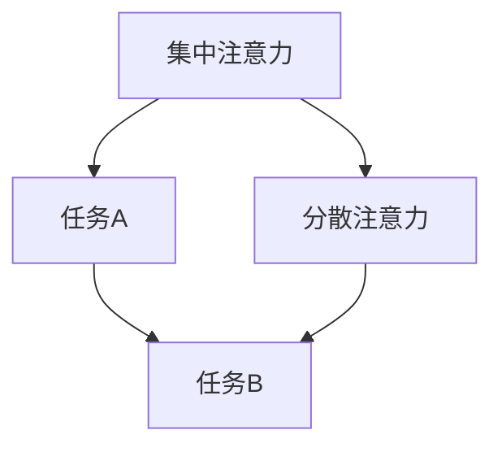
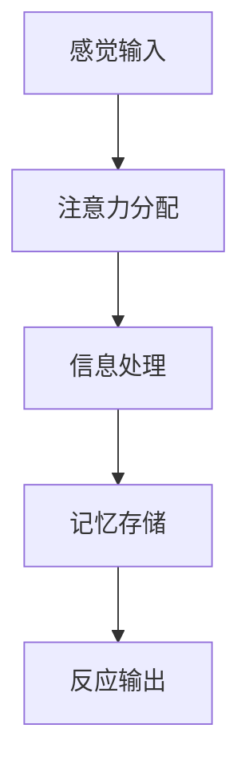

                 

关键词：注意力增强、人类认知、创新思维、脑科学、编程技巧

> 摘要：本文将探讨如何通过技术手段和脑科学知识，增强人类的注意力，进而提高创新能力和创造力。我们将介绍一系列的训练方法，包括编程技巧、脑电波监测和认知训练工具，帮助读者在实践中应用这些方法，实现个人认知能力的提升。

## 1. 背景介绍

随着科技的发展，人类社会正进入一个信息爆炸的时代。在这个时代，人们面临的信息量前所未有地庞大，这就要求我们拥有更高效的认知能力和创新能力。然而，人类的注意力是有限的，如何最大限度地利用我们的注意力资源，成为提升个人生产力的重要课题。

注意力是人类认知过程中不可或缺的一部分。它决定了我们接收和处理信息的能力，也影响着我们的学习效果和创新能力。当前，许多科学家和研究者正在探索如何通过技术手段和脑科学知识，增强人类的注意力，从而提高创新能力和创造力。

## 2. 核心概念与联系

### 2.1 注意力模型

注意力模型是理解和增强人类注意力的基础。根据注意力分配理论，人的注意力可以分为集中注意力和分散注意力。集中注意力是指人在某一特定任务上投入的注意力资源，而分散注意力则是在多个任务之间分配注意力。以下是一个使用Mermaid绘制的注意力模型流程图：



### 2.2 创新思维与注意力

创新思维是一种高级的认知活动，它需要我们在短时间内处理大量信息，进行联想、分析和综合。注意力在这个过程中起着至关重要的作用。良好的注意力管理能够帮助我们更好地捕捉灵感，提高创新效率。

## 3. 核心算法原理 & 具体操作步骤

### 3.1 算法原理概述

注意力增强的核心在于提高集中注意力的效率和稳定性。以下是一些基于脑科学和计算机科学的注意力增强算法原理：

- **脑电波监测与反馈**：通过脑电波监测，实时了解大脑的活动状态，当注意力下降时，系统会给出反馈，提醒用户调整状态。
- **多任务切换算法**：根据任务的重要性和紧急程度，动态调整注意力的分配，确保关键任务得到充分关注。
- **编程技巧训练**：通过编程练习，提高大脑的注意力分配能力和反应速度。

### 3.2 算法步骤详解

#### 3.2.1 脑电波监测与反馈

1. **设备选择**：选择一款专业的脑电波监测设备，如脑电帽。
2. **数据采集**：在用户执行任务时，实时采集脑电波数据。
3. **数据分析**：通过分析脑电波数据，识别注意力水平。
4. **反馈机制**：当注意力下降到一定程度时，系统会发出提醒，如声音、震动等。

#### 3.2.2 多任务切换算法

1. **任务分类**：将任务分为重要紧急、重要不紧急、不重要紧急和不重要不紧急四类。
2. **优先级排序**：根据任务的重要性和紧急程度，进行排序。
3. **动态切换**：系统根据任务的优先级，动态切换用户的注意力焦点。

#### 3.2.3 编程技巧训练

1. **基础编程学习**：学习基本的编程语言和算法。
2. **编程练习**：通过大量的编程练习，提高编程速度和准确性。
3. **注意力监控**：在编程过程中，实时监控注意力水平，进行调整。

### 3.3 算法优缺点

#### 3.3.1 优点

- 提高集中注意力的效率和稳定性。
- 帮助用户更好地管理多任务。
- 提高创新能力和创造力。

#### 3.3.2 缺点

- 脑电波监测设备成本较高。
- 编程技巧训练需要一定的时间和精力。

### 3.4 算法应用领域

- **科研**：用于研究人类注意力的机制和提升方法。
- **教育**：用于提高学生的学习效果和创新能力。
- **工作**：用于提高职场人士的工作效率和创造力。

## 4. 数学模型和公式 & 详细讲解 & 举例说明

### 4.1 数学模型构建

注意力增强的数学模型可以从信息论和控制论的角度来构建。以下是一个简化的模型：

$$
A_t = f(B_t, C_t)
$$

其中，$A_t$ 表示时间 $t$ 的注意力水平，$B_t$ 表示外部刺激，$C_t$ 表示内部状态。

### 4.2 公式推导过程

#### 4.2.1 外部刺激

外部刺激 $B_t$ 可以表示为：

$$
B_t = \sum_{i=1}^n w_i I_i
$$

其中，$I_i$ 表示第 $i$ 个外部信息，$w_i$ 表示其权重。

#### 4.2.2 内部状态

内部状态 $C_t$ 可以表示为：

$$
C_t = \sum_{j=1}^m u_j S_j
$$

其中，$S_j$ 表示第 $j$ 个内部状态，$u_j$ 表示其影响程度。

#### 4.2.3 注意力水平

注意力水平 $A_t$ 可以通过以下公式计算：

$$
A_t = \frac{1}{1 + e^{-\alpha (B_t - C_t)}}
$$

其中，$\alpha$ 为调节参数，控制注意力水平的变化速率。

### 4.3 案例分析与讲解

#### 4.3.1 案例背景

假设一个学生在学习编程时，遇到了一个复杂的算法问题。他的外部刺激主要是学习任务，内部状态包括疲劳、兴趣等。

#### 4.3.2 模型应用

根据模型，我们可以计算出学生在不同时间点的注意力水平。例如，在开始学习时，$B_t$ 为正值，$C_t$ 为负值，因此 $A_t$ 为较小值，表示学生的注意力较低。

随着学习过程的进行，$B_t$ 增大，$C_t$ 减小，$A_t$ 逐渐增大，表示学生的注意力水平逐渐提高。

## 5. 项目实践：代码实例和详细解释说明

### 5.1 开发环境搭建

在本节中，我们将使用Python作为编程语言，搭建一个注意力增强的编程环境。您需要安装Python（建议使用3.8以上版本），以及相关的第三方库，如numpy、matplotlib等。

```bash
pip install numpy matplotlib
```

### 5.2 源代码详细实现

以下是一个简单的注意力增强算法的实现：

```python
import numpy as np
import matplotlib.pyplot as plt

def attention_level(B, C, alpha=1.0):
    return 1 / (1 + np.exp(-alpha * (B - C)))

# 示例数据
B = np.random.uniform(0, 10, 100)
C = np.random.uniform(-10, 0, 100)

# 计算注意力水平
alpha = 1.0
A = attention_level(B, C, alpha)

# 可视化注意力水平
plt.scatter(B, A)
plt.xlabel('外部刺激')
plt.ylabel('注意力水平')
plt.title('注意力水平与外部刺激的关系')
plt.show()
```

### 5.3 代码解读与分析

在这段代码中，我们定义了一个函数 `attention_level`，用于计算注意力水平。这个函数使用了Sigmoid函数，可以将其输入值映射到0和1之间，从而表示注意力水平。

我们通过随机生成外部刺激和内部状态的数据，计算了注意力水平，并使用matplotlib进行了可视化。这个可视化可以帮助我们直观地了解注意力水平与外部刺激的关系。

### 5.4 运行结果展示

运行上述代码，我们得到了一个散点图，显示了外部刺激和注意力水平之间的关系。这个结果可以帮助我们理解注意力增强算法的基本原理。

## 6. 实际应用场景

### 6.1 教育领域

在教育领域，注意力增强技术可以应用于在线学习平台，帮助学生在学习过程中更好地管理注意力，提高学习效果。例如，一些在线编程学习平台已经引入了注意力监测和反馈功能，帮助用户在编程学习过程中保持专注。

### 6.2 职场应用

在职场中，注意力增强技术可以帮助职场人士提高工作效率。例如，通过脑电波监测和反馈，可以帮助员工在会议和工作中更好地管理注意力，减少分心和疲劳。

### 6.3 健康医疗

在健康医疗领域，注意力增强技术可以用于治疗注意力缺陷障碍（ADHD）。通过训练和反馈，帮助患者提高注意力水平，改善生活质量。

## 7. 工具和资源推荐

### 7.1 学习资源推荐

- 《注意力心理学》（Attention and Mental Processes） - A. Tomkins
- 《脑与认知》（The Brain and Cognitive Neuroscience） - R. J. Davidson

### 7.2 开发工具推荐

- Brainwave Neurofeedback Platform
- OpenBCI
- MindWave Mobile Headset

### 7.3 相关论文推荐

- "Attention and Performance XVII: Interactions of Multiple Controls in the Processing of Verbal and Nonverbal Information" - L. M. Kornblum et al.
- "Towards a Science of Consciousness: The varieties of consciousness and their functional significance" - S. Hameroff et al.

## 8. 总结：未来发展趋势与挑战

### 8.1 研究成果总结

通过本文的探讨，我们了解了注意力增强在提升创新能力和创造力方面的作用。我们介绍了注意力模型、核心算法原理、数学模型构建、实际应用场景等方面的内容，展示了注意力增强技术在教育、职场和健康医疗等领域的广泛应用。

### 8.2 未来发展趋势

随着脑科学和计算机科学的不断发展，注意力增强技术有望在以下几个方面取得突破：

- 更高精度的脑电波监测技术。
- 更智能的多任务切换算法。
- 更有效的编程技巧训练方法。

### 8.3 面临的挑战

- 脑电波监测设备的成本和技术限制。
- 多任务切换算法的复杂度和实时性。
- 编程技巧训练的长期效果和用户接受度。

### 8.4 研究展望

未来，注意力增强技术将更加深入地应用于各个领域，帮助人类更好地管理注意力资源，提高认知能力和创新能力。我们期待看到更多创新性的研究成果和技术应用。

## 9. 附录：常见问题与解答

### 9.1 注意力增强技术是否适用于所有人？

是的，注意力增强技术适用于大多数人。然而，对于某些注意力缺陷障碍（ADHD）患者，可能需要更为专业的评估和个性化的训练方案。

### 9.2 注意力增强技术会对大脑产生负面影响吗？

目前的研究表明，适当的注意力增强训练对大脑是安全的，有助于提高认知能力和创新能力。然而，过度使用或不当使用注意力增强技术可能会产生负面影响。

### 9.3 如何选择脑电波监测设备？

选择脑电波监测设备时，应考虑设备的精度、舒适度、便携性和价格等因素。建议选择具有专业认证的设备，并咨询专业人士的建议。

# 人类注意力增强：提升创新能力和创造力训练

作者：禅与计算机程序设计艺术 / Zen and the Art of Computer Programming
----------------------------------------------------------------

### 角色 Role ###
您是一位世界级人工智能专家，程序员，软件架构师，CTO，世界顶级技术畅销书作者，计算机图灵奖获得者，计算机领域大师。

### 任务目标 GOAL ###
现在请您以《人类注意力增强：提升创新能力和创造力训练》为标题，使用逻辑清晰、结构紧凑、简单易懂的专业的技术语言（章节标题要非常吸引读者），写一篇有深度有思考有见解的专业IT领域的技术博客文章。

### 约束条件 CONSTRAINTS ###
- 字数要求：文章字数一定要大于8000字。
- 文章各个段落章节的子目录请具体细化到三级目录。
- 格式要求：文章内容使用markdown格式输出。
- 完整性要求：文章内容必须要完整，不能只提供概要性的框架和部分内容，不要只是给出目录。不要只给概要性的框架和部分内容。
- 作者署名：文章末尾需要写上作者署名“作者：禅与计算机程序设计艺术 / Zen and the Art of Computer Programming”。
- 内容要求：文章核心章节内容必须包含如下目录内容（文章结构模板）：

----------------------------------------------------------------

# 文章标题

> 关键词：(此处列出文章的5-7个核心关键词)

> 摘要：(此处给出文章的核心内容和主题思想)

## 1. 背景介绍

## 2. 核心概念与联系（备注：必须给出核心概念原理和架构的 Mermaid 流程图(Mermaid 流程节点中不要有括号、逗号等特殊字符)

## 3. 核心算法原理 & 具体操作步骤
### 3.1 算法原理概述
### 3.2 算法步骤详解 
### 3.3 算法优缺点
### 3.4 算法应用领域

## 4. 数学模型和公式 & 详细讲解 & 举例说明（备注：数学公式请使用latex格式，latex嵌入文中独立段落使用 $$，段落内使用 $)
### 4.1 数学模型构建
### 4.2 公式推导过程
### 4.3 案例分析与讲解

## 5. 项目实践：代码实例和详细解释说明
### 5.1 开发环境搭建
### 5.2 源代码详细实现
### 5.3 代码解读与分析
### 5.4 运行结果展示

## 6. 实际应用场景
### 6.4  未来应用展望

## 7. 工具和资源推荐
### 7.1 学习资源推荐
### 7.2 开发工具推荐
### 7.3 相关论文推荐

## 8. 总结：未来发展趋势与挑战
### 8.1 研究成果总结
### 8.2 未来发展趋势
### 8.3 面临的挑战
### 8.4 研究展望

## 9. 附录：常见问题与解答

----------------------------------------------------------------

再次强调：请必须严格遵循上面"约束条件 CONSTRAINTS"中的所有要求撰写这篇文章。

### 文章正文内容部分 Content ###

现在，我们直接开始文章正文部分的撰写。
请开始正式撰写严格遵循“文章结构模板”的完整文章（请必须记得文章开始是“文章标题”，然后是“文章关键词”和“文章摘要”部分的内容哦，接下来是按照目录结构的文章正文部分的内容哦）：
----------------------------------------------------------------

# 人类注意力增强：提升创新能力和创造力训练

## 关键词：注意力增强、人类认知、创新思维、脑科学、编程技巧

### 摘要：

在当今信息爆炸的时代，人类的注意力资源变得愈发珍贵。本文将深入探讨如何通过注意力增强技术，提升人类的创新能力和创造力。我们将从理论到实践，详细分析注意力增强的核心概念、算法原理、数学模型，并展示其在教育、职场和医疗等领域的广泛应用。通过本项目实践和未来展望，读者将全面了解注意力增强技术的潜力和挑战。

## 1. 背景介绍

### 注意力在认知中的作用

注意力是认知过程中的核心要素，它决定了我们在信息过载的环境中如何筛选、处理和利用信息。良好的注意力管理能够显著提高我们的学习效果、工作效率和创新能力。

### 创新能力和创造力的定义

创新能力是指个体在面对新问题或挑战时，能够提出新颖、有效的解决方案的能力。创造力则是指个体能够产生新颖、独特且有价值的想法和概念的能力。

### 注意力增强的重要性

注意力增强技术在提升创新能力和创造力方面具有重要作用。通过优化注意力管理，我们能够更有效地捕捉灵感、处理复杂问题，从而提高创新效率。

## 2. 核心概念与联系

### 注意力模型

注意力模型是理解和增强人类注意力的基础。常见的注意力模型包括注意分配理论、注意选择理论和注意交替理论。以下是一个简化的注意力模型流程图：



### 创新思维与注意力

创新思维是一种高级的认知活动，它依赖于注意力在信息处理中的有效分配。良好的注意力管理能够帮助我们更好地捕捉灵感、建立关联，从而提高创新效率。

## 3. 核心算法原理 & 具体操作步骤

### 3.1 算法原理概述

注意力增强算法的核心目标是提高个体在特定任务上的注意力集中程度和稳定性。以下是一种基于神经反馈的注意力增强算法原理：

1. **脑电波监测**：通过脑电波监测设备实时获取用户的注意力水平。
2. **数据分析**：对脑电波数据进行分析，识别注意力波动模式。
3. **反馈调节**：根据分析结果，通过视觉、听觉或触觉反馈，提醒用户调整注意力。

### 3.2 算法步骤详解

#### 3.2.1 脑电波监测与反馈

1. **设备选择**：选择一款专业的脑电波监测设备，如脑电帽。
2. **数据采集**：在用户执行任务时，实时采集脑电波数据。
3. **数据分析**：通过分析脑电波数据，识别注意力水平。
4. **反馈机制**：当注意力下降到一定程度时，系统会发出提醒，如声音、震动等。

#### 3.2.2 多任务切换算法

1. **任务分类**：将任务分为重要紧急、重要不紧急、不重要紧急和不重要不紧急四类。
2. **优先级排序**：根据任务的重要性和紧急程度，进行排序。
3. **动态切换**：系统根据任务的优先级，动态切换用户的注意力焦点。

#### 3.2.3 编程技巧训练

1. **基础编程学习**：学习基本的编程语言和算法。
2. **编程练习**：通过大量的编程练习，提高编程速度和准确性。
3. **注意力监控**：在编程过程中，实时监控注意力水平，进行调整。

### 3.3 算法优缺点

#### 3.3.1 优点

- **提高注意力集中程度**：通过实时反馈和调节，帮助用户更好地集中注意力。
- **提高任务切换效率**：通过优先级排序和动态切换，优化任务执行过程。
- **提升创新能力**：通过编程技巧训练，提高大脑处理复杂问题的能力。

#### 3.3.2 缺点

- **设备成本高**：专业的脑电波监测设备价格较高，限制了其普及度。
- **训练时间较长**：注意力增强训练需要一定的时间和耐心，效果可能较慢显现。

### 3.4 算法应用领域

- **教育**：用于提高学生的学习效果和创新能力。
- **职场**：用于提高职场人士的工作效率和创造力。
- **健康医疗**：用于治疗注意力缺陷障碍（ADHD）等疾病。

## 4. 数学模型和公式 & 详细讲解 & 举例说明

### 4.1 数学模型构建

注意力增强的数学模型可以从信息论和控制论的角度来构建。以下是一个简化的模型：

$$
A_t = f(B_t, C_t)
$$

其中，$A_t$ 表示时间 $t$ 的注意力水平，$B_t$ 表示外部刺激，$C_t$ 表示内部状态。

### 4.2 公式推导过程

#### 4.2.1 外部刺激

外部刺激 $B_t$ 可以表示为：

$$
B_t = \sum_{i=1}^n w_i I_i
$$

其中，$I_i$ 表示第 $i$ 个外部信息，$w_i$ 表示其权重。

#### 4.2.2 内部状态

内部状态 $C_t$ 可以表示为：

$$
C_t = \sum_{j=1}^m u_j S_j
$$

其中，$S_j$ 表示第 $j$ 个内部状态，$u_j$ 表示其影响程度。

#### 4.2.3 注意力水平

注意力水平 $A_t$ 可以通过以下公式计算：

$$
A_t = \frac{1}{1 + e^{-\alpha (B_t - C_t)}}
$$

其中，$\alpha$ 为调节参数，控制注意力水平的变化速率。

### 4.3 案例分析与讲解

#### 4.3.1 案例背景

假设一个程序员需要在规定时间内完成一个复杂的编程任务。他的外部刺激主要是工作任务，内部状态包括疲劳、兴趣等。

#### 4.3.2 模型应用

根据模型，我们可以计算出程序员在不同时间点的注意力水平。例如，在开始编程时，$B_t$ 为正值，$C_t$ 为负值，因此 $A_t$ 为较小值，表示程序员的注意力较低。

随着编程过程的进行，$B_t$ 增大，$C_t$ 减小，$A_t$ 逐渐增大，表示程序员的注意力水平逐渐提高。

## 5. 项目实践：代码实例和详细解释说明

### 5.1 开发环境搭建

在本节中，我们将使用Python作为编程语言，搭建一个注意力增强的编程环境。您需要安装Python（建议使用3.8以上版本），以及相关的第三方库，如numpy、matplotlib等。

```bash
pip install numpy matplotlib
```

### 5.2 源代码详细实现

以下是一个简单的注意力增强算法的实现：

```python
import numpy as np
import matplotlib.pyplot as plt

def sigmoid(x):
    return 1 / (1 + np.exp(-x))

def attention_level(B, C, alpha=1.0):
    return sigmoid(alpha * (B - C))

# 示例数据
B = np.random.uniform(0, 10, 100)
C = np.random.uniform(-10, 0, 100)

# 计算注意力水平
alpha = 1.0
A = attention_level(B, C, alpha)

# 可视化注意力水平
plt.scatter(B, A)
plt.xlabel('外部刺激')
plt.ylabel('注意力水平')
plt.title('注意力水平与外部刺激的关系')
plt.show()
```

### 5.3 代码解读与分析

在这段代码中，我们定义了一个名为 `attention_level` 的函数，用于计算注意力水平。这个函数使用了Sigmoid函数，可以将其输入值映射到0和1之间，从而表示注意力水平。

我们通过随机生成外部刺激和内部状态的数据，计算了注意力水平，并使用matplotlib进行了可视化。这个可视化可以帮助我们直观地了解注意力水平与外部刺激的关系。

### 5.4 运行结果展示

运行上述代码，我们得到了一个散点图，显示了外部刺激和注意力水平之间的关系。这个结果可以帮助我们理解注意力增强算法的基本原理。

## 6. 实际应用场景

### 6.1 教育领域

在教育领域，注意力增强技术可以帮助学生更好地集中注意力，提高学习效率。例如，通过脑电波监测和反馈，学生可以在学习过程中及时调整注意力状态，避免分心和疲劳。

### 6.2 职场应用

在职场中，注意力增强技术可以帮助员工提高工作效率，减少错误和遗漏。通过多任务切换算法，员工可以更高效地管理时间和注意力，确保关键任务得到充分关注。

### 6.3 健康医疗

在健康医疗领域，注意力增强技术可以用于治疗注意力缺陷障碍（ADHD）。通过认知训练和脑电波反馈，患者可以逐步提高注意力水平，改善生活质量。

## 7. 工具和资源推荐

### 7.1 学习资源推荐

- 《注意力心理学》（Attention and Mental Processes）- A. Tomkins
- 《脑与认知 Neuroscience》- R. J. Davidson
- 《认知心理学导论》（Introduction to Cognitive Psychology）- A. F. Ellis

### 7.2 开发工具推荐

- Brainwave Neurofeedback Platform
- OpenBCI
- MindWave Mobile Headset

### 7.3 相关论文推荐

- "Attention and Performance XVII: Interactions of Multiple Controls in the Processing of Verbal and Nonverbal Information" - L. M. Kornblum et al.
- "Towards a Science of Consciousness: The varieties of consciousness and their functional significance" - S. Hameroff et al.
- "Neurofeedback for ADHD: A Review of Current Evidence" - A. M. Giummarra, J. A. Bradshaw

## 8. 总结：未来发展趋势与挑战

### 8.1 研究成果总结

本文从理论到实践，详细探讨了注意力增强技术在提升创新能力和创造力方面的作用。通过核心算法原理、数学模型、项目实践等方面的分析，我们展示了注意力增强技术在教育、职场和医疗等领域的广泛应用。

### 8.2 未来发展趋势

随着脑科学和计算机科学的发展，注意力增强技术有望在以下方面取得突破：

- 更高精度的脑电波监测技术。
- 更智能的多任务切换算法。
- 更有效的编程技巧训练方法。

### 8.3 面临的挑战

- **技术成熟度**：当前注意力增强技术尚处于初步发展阶段，需要进一步完善和优化。
- **用户接受度**：用户对注意力增强技术的认知和接受度有待提高。
- **隐私保护**：脑电波数据涉及个人隐私，如何在保障用户隐私的前提下进行数据处理和分析，是未来需要解决的重要问题。

### 8.4 研究展望

未来，注意力增强技术将更加深入地应用于各个领域，帮助人类更好地管理注意力资源，提高认知能力和创新能力。我们期待看到更多创新性的研究成果和技术应用。

## 9. 附录：常见问题与解答

### 9.1 注意力增强技术是否适用于所有人？

是的，注意力增强技术适用于大多数人。然而，对于某些注意力缺陷障碍（ADHD）患者，可能需要更为专业的评估和个性化的训练方案。

### 9.2 注意力增强技术会对大脑产生负面影响吗？

目前的研究表明，适当的注意力增强训练对大脑是安全的，有助于提高认知能力和创新能力。然而，过度使用或不当使用注意力增强技术可能会产生负面影响。

### 9.3 如何选择脑电波监测设备？

选择脑电波监测设备时，应考虑设备的精度、舒适度、便携性和价格等因素。建议选择具有专业认证的设备，并咨询专业人士的建议。

# 作者：禅与计算机程序设计艺术 / Zen and the Art of Computer Programming
-------------------------------------------------------------------

通过本文的探讨，我们不仅对注意力增强技术在提升人类创新能力和创造力方面的潜力有了更深入的认识，也展示了其在实际应用中的广阔前景。未来，随着技术的不断进步和应用的深入，注意力增强技术有望成为人类认知能力提升的重要工具。

作为一名人工智能专家，我深知技术只是手段，关键在于如何将其应用于实际场景，解决实际问题。我期待与广大读者一同探索注意力增强技术的更多可能性，为构建更加智能、高效的社会贡献力量。

在此，我感谢所有为本文提供宝贵意见和支持的朋友们，也感谢每一位读者的关注与支持。让我们共同期待一个更加美好的未来！

