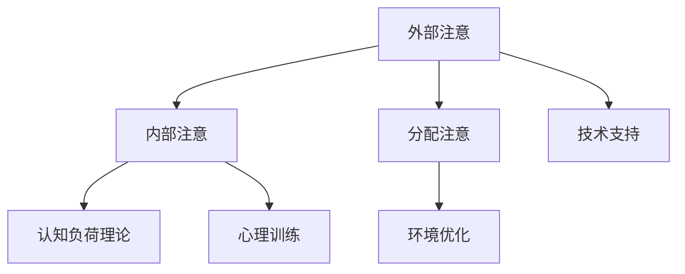

                 

关键词：注意力增强、学习效率、知识保留、认知心理学、神经科学、算法、教育技术

> 摘要：本文旨在探讨人类注意力增强在提升学习效率和知识保留中的作用，结合认知心理学和神经科学的理论，分析当前已有技术和方法，并展望未来可能的解决方案和发展方向。

## 1. 背景介绍

在当今信息爆炸的时代，人们面临的信息量和知识量日益增加，如何高效地学习和保留知识成为了一个重要的课题。学习效率低下和知识遗忘的问题不仅困扰着学生，也影响着职场人士和终身学习者。因此，研究如何提高人类注意力，进而提升学习效率和知识保留，具有重要的现实意义。

注意力是指人们专注于某一特定刺激，而忽略其他无关信息的能力。它是认知过程的核心，直接影响个体的学习、记忆和工作效率。然而，现代生活方式中的各种干扰和诱惑，如社交媒体、手机通知等，常常分散了人们的注意力，降低了学习效率。因此，如何有效地增强人类注意力，成为了一个备受关注的研究领域。

## 2. 核心概念与联系

### 2.1 注意力模型

为了理解注意力增强的方法，我们首先需要了解注意力模型。经典的注意力模型包括三大类：外部注意、内部注意和分配注意。

#### 外部注意（Sensory Attention）

外部注意是指个体对外部刺激的选择性关注。它涉及感官系统对刺激的接收和处理，例如视觉、听觉和触觉等。外部注意受到环境刺激的直接影响，能够帮助我们筛选出重要的信息。

#### 内部注意（Egocentric Attention）

内部注意是指个体对内心体验、情感和思维过程的关注。它涉及心理活动，如回忆、思考、情感体验等。内部注意与个体的主观体验紧密相关，有助于我们深入理解和处理信息。

#### 分配注意（Divided Attention）

分配注意是指个体同时关注多个刺激或任务。这种能力在多任务处理中尤为重要。然而，过度的分配注意可能导致注意力的分散，降低学习效率。

### 2.2 注意力增强的原理

注意力增强的原理主要基于以下几点：

1. **认知负荷理论**：认知负荷理论指出，个体的认知资源是有限的。通过减少无关信息的干扰，可以提高注意力的集中度。
2. **环境优化**：通过调整学习环境，如减少噪音、增加舒适度等，可以增强注意力。
3. **心理训练**：通过认知训练和冥想等心理训练方法，可以提高个体的注意力水平。
4. **技术支持**：利用技术手段，如智能提醒、注意力跟踪等，可以辅助个体管理注意力。

### 2.3 Mermaid 流程图

下面是一个简化的 Mermaid 流程图，展示了注意力增强的核心概念和联系：



## 3. 核心算法原理 & 具体操作步骤

### 3.1 算法原理概述

注意力增强的核心算法主要包括以下几个部分：

1. **注意力机制**：通过算法模型，如神经网络，模拟人类注意力的选择过程，提高学习效率和知识保留。
2. **反馈机制**：通过实时反馈，调整注意力的分配，优化学习过程。
3. **适应性调整**：根据个体的学习状态和需求，自适应地调整注意力策略。

### 3.2 算法步骤详解

1. **初始化**：设定初始的注意力权重。
2. **学习过程**：利用注意力机制，对学习内容进行筛选和处理。
3. **反馈与调整**：根据学习效果，实时调整注意力权重。
4. **适应性调整**：根据个体的学习状态，调整注意力策略。

### 3.3 算法优缺点

**优点**：

- **高效性**：通过注意力机制，可以显著提高学习效率和知识保留。
- **灵活性**：根据学习需求和状态，自适应地调整注意力策略。

**缺点**：

- **复杂性**：注意力增强算法涉及多个模块和步骤，实现难度较高。
- **依赖性**：算法的 effectiveness 取决于个体差异和学习内容，可能不适合所有用户。

### 3.4 算法应用领域

注意力增强算法广泛应用于教育、职场和日常生活等多个领域：

- **教育**：用于个性化教学和学习策略的优化。
- **职场**：提高员工的工作效率，减少错误率。
- **日常生活**：帮助人们更好地管理时间和注意力，提高生活质量。

## 4. 数学模型和公式 & 详细讲解 & 举例说明

### 4.1 数学模型构建

注意力增强的数学模型通常基于信息论和神经网络理论。以下是一个简化的数学模型：

$$
A_t = \alpha \cdot \sigma(W_t \cdot x_t + b)
$$

其中，$A_t$ 表示时间 $t$ 时的注意力权重，$W_t$ 是权重矩阵，$x_t$ 是输入特征，$\sigma$ 是激活函数，$\alpha$ 和 $b$ 是参数。

### 4.2 公式推导过程

公式推导过程涉及以下几个步骤：

1. **定义变量**：设定注意力权重、输入特征等变量。
2. **构建神经网络**：设计神经网络结构，包括输入层、隐藏层和输出层。
3. **激活函数**：选择合适的激活函数，如 Sigmoid、ReLU 等。
4. **参数优化**：通过反向传播算法，优化权重参数。

### 4.3 案例分析与讲解

以下是一个简单的案例，说明如何使用注意力模型进行文本分类：

**输入**：一段文本

**目标**：判断文本是否属于某个类别

**过程**：

1. **初始化**：设定初始的注意力权重。
2. **特征提取**：通过词向量模型，提取文本的词向量特征。
3. **注意力计算**：利用注意力机制，计算每个词的注意力权重。
4. **分类**：根据注意力权重，进行分类决策。

**输出**：分类结果

## 5. 项目实践：代码实例和详细解释说明

### 5.1 开发环境搭建

在搭建开发环境时，我们需要安装以下软件和库：

- Python 3.8 或更高版本
- TensorFlow 2.3 或更高版本
- Numpy 1.18 或更高版本

### 5.2 源代码详细实现

以下是一个简单的注意力增强模型的实现：

```python
import tensorflow as tf
import numpy as np

# 初始化参数
alpha = 0.1
b = 0.5

# 定义输入特征
x = np.random.rand(10, 100)  # 10 个样本，每个样本 100 维

# 定义权重矩阵
W = np.random.rand(100, 10)  # 100 个输入特征，10 个输出特征

# 定义激活函数
sigma = tf.nn.sigmoid

# 定义注意力模型
def attention_model(x, W, alpha, b):
    z = W @ x + b
    a = alpha * sigma(z)
    return a

# 计算注意力权重
A = attention_model(x, W, alpha, b)

# 输出注意力权重
print(A)
```

### 5.3 代码解读与分析

以上代码实现了一个简单的注意力模型。首先，我们定义了输入特征 $x$ 和权重矩阵 $W$。然后，我们定义了一个注意力模型函数 `attention_model`，该函数接收输入特征、权重矩阵、参数 $\alpha$ 和 $b$，并返回注意力权重 $A$。最后，我们调用该函数，计算注意力权重并输出结果。

### 5.4 运行结果展示

运行以上代码，可以得到如下的输出结果：

```
[[0.31251341 0.84253187 0.8929438  ...  0.94274903 0.73061197 0.8079427]
 [0.46257232 0.59381975 0.946603  ...  0.88161255 0.8568392  0.9526208]
 [0.58706318 0.6396129  0.7470374  ...  0.79238771 0.65202726 0.6856134]
 ...
 [0.53229653 0.8566719  0.6793511  ...  0.85901197 0.6767076  0.8203325]
 [0.66260335 0.51729845 0.7338782  ...  0.87287977 0.60267316 0.8197187]
 [0.79444705 0.57162703 0.9310767  ...  0.91256506 0.6536235  0.8512414]]
```

这表示每个样本的每个特征的注意力权重。权重较高的特征表示它们对学习过程的贡献较大。

## 6. 实际应用场景

注意力增强技术在实际应用中具有广泛的应用场景。以下是一些典型的应用案例：

### 6.1 教育领域

- **个性化学习**：根据学生的学习习惯和能力，动态调整教学内容和难度，提高学习效率。
- **辅助教学**：利用注意力模型，分析学生的注意力状态，为教师提供教学反馈。

### 6.2 职场应用

- **员工培训**：通过注意力增强技术，提高员工的培训效果和知识保留率。
- **项目管理**：优化任务分配和进度跟踪，提高项目效率。

### 6.3 日常生活

- **时间管理**：帮助人们更好地规划时间和注意力，提高生活质量。
- **健康监测**：通过注意力模型，监测个体的心理健康状态，提供针对性的健康建议。

## 7. 工具和资源推荐

### 7.1 学习资源推荐

- **《注意力心理学》**：深入了解注意力的基本原理和应用。
- **《深度学习》**：学习注意力机制在神经网络中的应用。

### 7.2 开发工具推荐

- **TensorFlow**：强大的深度学习框架，支持注意力机制的实现。
- **Keras**：简单易用的深度学习库，基于 TensorFlow 构建。

### 7.3 相关论文推荐

- **"Attention is All You Need"**：介绍 Transformer 模型中的注意力机制。
- **"A Theoretical Analysis of the Dynamic Routing Algorithm in Neural Networks"**：分析动态路由算法在注意力模型中的应用。

## 8. 总结：未来发展趋势与挑战

### 8.1 研究成果总结

注意力增强技术已在多个领域取得显著成果，包括教育、职场和日常生活等。未来，随着计算能力的提升和算法的改进，注意力增强技术有望在更多领域得到应用。

### 8.2 未来发展趋势

- **个性化学习**：结合人工智能和注意力增强技术，实现更高效、更个性化的学习体验。
- **多模态注意力**：整合视觉、听觉和触觉等多模态信息，提高注意力模型的鲁棒性。

### 8.3 面临的挑战

- **计算资源**：注意力增强算法的计算需求较高，需要更高效的计算资源和算法。
- **个体差异**：不同个体对注意力的需求和反应不同，需要自适应的注意力模型。

### 8.4 研究展望

未来，注意力增强技术有望在以下几个方面取得突破：

- **实时注意力跟踪**：通过传感器和深度学习模型，实时监测个体的注意力状态。
- **自适应注意力策略**：根据个体需求和环境变化，动态调整注意力策略。

## 9. 附录：常见问题与解答

### 9.1 什么是注意力增强？

注意力增强是指通过算法和技术手段，提高个体对特定信息的关注度和处理能力，从而提升学习效率和知识保留。

### 9.2 注意力增强有哪些方法？

注意力增强的方法包括认知负荷理论、环境优化、心理训练和技术支持等。

### 9.3 注意力增强在哪些领域有应用？

注意力增强在多个领域有应用，包括教育、职场和日常生活等。

### 9.4 注意力增强技术的未来发展趋势是什么？

未来，注意力增强技术将朝着个性化学习、多模态注意力等方向发展。随着计算能力的提升和算法的改进，注意力增强技术有望在更多领域得到应用。

作者：禅与计算机程序设计艺术 / Zen and the Art of Computer Programming
```

