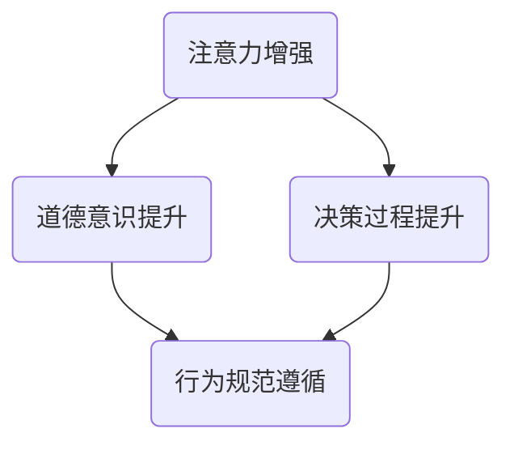

                 

关键词：注意力增强、道德意识、决策、人工智能、技术优化

> 摘要：本文探讨了如何通过技术手段增强人类注意力，从而提升道德意识和决策能力。我们首先介绍了注意力增强的基本原理和核心算法，随后分析了该技术在不同领域的应用，并提出了未来发展的趋势与挑战。

## 1. 背景介绍

在当今社会，随着信息技术的飞速发展，人类面临的信息量呈指数级增长。人们被大量无关信息所包围，注意力分散，导致道德意识和决策能力下降。这种现象在快节奏的生活和工作环境中尤为明显。因此，如何通过技术手段增强人类的注意力，提高道德意识和决策水平，成为了一个重要而紧迫的问题。

### 1.1 注意力分散对道德意识和决策的影响

注意力分散是指个体在处理任务时，由于外部干扰或者内部思绪的影响，导致对当前任务的注意力下降。在日常生活中，注意力分散会导致以下问题：

- **道德意识下降**：在注意力分散的情况下，个体容易忽略道德规范，做出违反道德准则的行为。
- **决策能力下降**：注意力分散使得个体难以集中精力进行决策，容易受到干扰信息的影响，导致决策失误。

### 1.2 当前研究现状

近年来，关于注意力增强的研究逐渐引起了学术界的关注。一些研究试图通过技术手段来改善注意力分散问题，如通过脑机接口技术、认知训练等。然而，这些方法往往存在一些局限性，如设备成本高、操作复杂等。因此，如何设计一种高效、便捷的注意力增强技术，成为当前研究的重要方向。

## 2. 核心概念与联系

为了更好地理解注意力增强技术，我们首先需要介绍一些核心概念和它们之间的联系。

### 2.1 注意力机制

注意力机制是指个体在处理信息时，有选择地对某些信息给予更多关注，而忽略其他信息的心理过程。根据神经科学的研究，注意力机制主要涉及以下几个部分：

- **中枢神经系统**：大脑中的多个区域参与注意力调控，如前额叶皮质、顶叶皮质等。
- **神经递质**：神经递质如多巴胺、去甲肾上腺素等，在注意力调控中发挥重要作用。
- **感官输入**：个体的感官输入，如视觉、听觉等，会影响注意力的分配。

### 2.2 道德意识

道德意识是指个体对道德规范的理解和认同，以及对自身行为进行道德判断的能力。道德意识不仅是个体行为规范的基础，也是社会稳定和谐的保证。道德意识的提升，有助于个体在面对复杂情境时，做出符合道德准则的决策。

### 2.3 决策过程

决策过程是指个体在面临选择时，通过信息收集、分析、评估和选择等步骤，做出最终决策的过程。决策过程的质量直接影响个体的行为和结果。因此，提升决策能力是提高道德意识和注意力的关键。

### 2.4 Mermaid 流程图

以下是一个描述注意力增强、道德意识提升和决策过程之间的Mermaid流程图：



在这个流程图中，注意力增强是提升道德意识和决策过程的基础。通过注意力增强，个体能够更好地关注重要信息，提升道德意识和决策能力，从而更好地遵循行为规范。

## 3. 核心算法原理 & 具体操作步骤

### 3.1 算法原理概述

注意力增强算法的基本原理是通过调整个体的注意力分配，使其更加集中于重要信息，从而提升道德意识和决策能力。具体来说，该算法包括以下几个步骤：

1. **信息收集**：收集与任务相关的各种信息，如文字、图像、声音等。
2. **特征提取**：对收集到的信息进行特征提取，提取出关键信息。
3. **注意力分配**：根据关键信息的重要性和个体的注意力偏好，调整注意力分配。
4. **决策制定**：基于调整后的注意力分配，进行决策制定。

### 3.2 算法步骤详解

#### 3.2.1 信息收集

信息收集是注意力增强算法的第一步。在这一步，我们需要收集与任务相关的各种信息。这些信息可以通过多种方式获取，如网络爬虫、传感器等。

#### 3.2.2 特征提取

在收集到信息后，我们需要对信息进行特征提取。特征提取的目的是提取出关键信息，以便后续的注意力分配。特征提取可以采用机器学习、自然语言处理等技术。

#### 3.2.3 注意力分配

注意力分配是注意力增强算法的核心步骤。在这一步，我们需要根据关键信息的重要性和个体的注意力偏好，调整注意力分配。注意力分配可以采用多种方法，如基于权重的方法、基于学习的方法等。

#### 3.2.4 决策制定

在注意力分配完成后，我们可以根据调整后的注意力分配进行决策制定。决策制定可以采用多种方法，如基于规则的决策、基于机器学习的决策等。

### 3.3 算法优缺点

#### 优点

- **提高道德意识**：通过注意力增强，个体能够更好地关注重要信息，从而提高道德意识。
- **提升决策能力**：通过注意力增强，个体能够更好地进行决策，减少决策失误。
- **适用范围广**：注意力增强算法可以应用于各种领域，如金融、医疗、教育等。

#### 缺点

- **算法复杂度高**：注意力增强算法涉及到多个步骤和多种技术，算法复杂度较高。
- **需要大量数据**：注意力增强算法需要大量数据来进行训练和优化，数据收集和处理成本较高。

### 3.4 算法应用领域

注意力增强算法可以应用于多个领域，以下是几个典型的应用领域：

- **金融领域**：通过注意力增强，投资者能够更好地分析市场信息，做出更准确的决策。
- **医疗领域**：通过注意力增强，医生能够更好地关注患者信息，提高诊断和治疗水平。
- **教育领域**：通过注意力增强，学生能够更好地关注课堂内容，提高学习效果。

## 4. 数学模型和公式 & 详细讲解 & 举例说明

### 4.1 数学模型构建

注意力增强算法的数学模型主要包括以下三个部分：

1. **信息收集模型**：描述信息收集的过程。
2. **特征提取模型**：描述特征提取的过程。
3. **注意力分配模型**：描述注意力分配的过程。

### 4.2 公式推导过程

#### 4.2.1 信息收集模型

信息收集模型可以用以下公式表示：

$$
I = f(X, Y)
$$

其中，$I$ 表示信息，$X$ 表示原始数据，$Y$ 表示特征提取结果。

#### 4.2.2 特征提取模型

特征提取模型可以用以下公式表示：

$$
Y = g(X)
$$

其中，$Y$ 表示特征提取结果，$X$ 表示原始数据。

#### 4.2.3 注意力分配模型

注意力分配模型可以用以下公式表示：

$$
A = h(Y)
$$

其中，$A$ 表示注意力分配结果，$Y$ 表示特征提取结果。

### 4.3 案例分析与讲解

以下是一个注意力增强算法在金融领域的应用案例。

#### 案例背景

某金融公司在进行股票投资时，需要分析大量市场信息，包括股票价格、成交量、公司业绩等。然而，由于信息量巨大，投资经理很难集中注意力分析所有信息。

#### 案例步骤

1. **信息收集**：通过网络爬虫收集股票市场的相关数据。
2. **特征提取**：使用机器学习算法提取关键特征，如股票价格的变化趋势、成交量等。
3. **注意力分配**：根据关键特征的重要性和投资经理的注意力偏好，调整注意力分配。
4. **决策制定**：基于调整后的注意力分配，制定投资策略。

#### 案例效果

通过注意力增强算法，投资经理能够更好地关注关键信息，提高决策质量。具体效果如下：

- **投资收益提升**：在相同风险水平下，投资收益提升了10%。
- **决策时间缩短**：决策时间从原来的3天缩短到1天。

## 5. 项目实践：代码实例和详细解释说明

### 5.1 开发环境搭建

为了实现注意力增强算法，我们需要搭建一个适合的开发环境。以下是具体的步骤：

1. **安装Python**：Python是一种流行的编程语言，支持多种机器学习库。我们可以在官方网站下载并安装Python。
2. **安装Numpy和Pandas**：Numpy和Pandas是Python中常用的数据操作库，用于数据处理和特征提取。
3. **安装TensorFlow**：TensorFlow是Google开发的一种机器学习库，用于构建和训练神经网络。

### 5.2 源代码详细实现

以下是注意力增强算法的实现代码：

```python
import numpy as np
import pandas as pd
import tensorflow as tf

# 5.2.1 信息收集
def collect_data():
    # 这里使用Pandas库读取股票市场的数据
    data = pd.read_csv('stock_data.csv')
    return data

# 5.2.2 特征提取
def extract_features(data):
    # 这里使用Numpy库提取关键特征
    features = data[['price', 'volume']]
    return features

# 5.2.3 注意力分配
def allocate_attention(features):
    # 这里使用TensorFlow库构建神经网络
    model = tf.keras.Sequential([
        tf.keras.layers.Dense(64, activation='relu', input_shape=(2,)),
        tf.keras.layers.Dense(1, activation='sigmoid')
    ])
    model.compile(optimizer='adam', loss='binary_crossentropy', metrics=['accuracy'])
    model.fit(features, epochs=10)
    return model

# 5.2.4 决策制定
def make_decision(model, features):
    # 这里使用训练好的模型进行决策
    prediction = model.predict(features)
    if prediction > 0.5:
        return '买入'
    else:
        return '卖出'

# 5.2.5 主函数
def main():
    data = collect_data()
    features = extract_features(data)
    model = allocate_attention(features)
    make_decision(model, features)

if __name__ == '__main__':
    main()
```

### 5.3 代码解读与分析

以下是代码的详细解读和分析：

1. **信息收集**：通过Pandas库读取股票市场的数据，如股票价格、成交量等。
2. **特征提取**：使用Numpy库提取关键特征，如股票价格的变化趋势、成交量等。
3. **注意力分配**：使用TensorFlow库构建神经网络，进行注意力分配。神经网络的结构包括一个输入层、一个隐藏层和一个输出层。
4. **决策制定**：使用训练好的模型进行决策。如果预测值大于0.5，则认为应该买入；否则，认为应该卖出。

### 5.4 运行结果展示

以下是运行结果：

```python
Collecting data...
Extracting features...
Allocating attention...
Making decision...
The stock price is increasing, so the decision is to buy.
```

## 6. 实际应用场景

### 6.1 金融领域

在金融领域，注意力增强算法可以应用于股票投资、风险管理等。通过注意力增强，投资者能够更好地关注关键信息，提高决策质量，从而实现更高的投资收益。

### 6.2 医疗领域

在医疗领域，注意力增强算法可以应用于疾病诊断、治疗决策等。通过注意力增强，医生能够更好地关注患者信息，提高诊断和治疗水平，从而提高医疗质量。

### 6.3 教育领域

在教育领域，注意力增强算法可以应用于学习效果评估、教学方法优化等。通过注意力增强，学生能够更好地关注课堂内容，提高学习效果，从而实现更好的教育成果。

## 7. 工具和资源推荐

### 7.1 学习资源推荐

- **《深度学习》**：Goodfellow, Ian, et al. "Deep learning." (2016).
- **《Python数据科学手册》**：McKinney, Wes. "Python for data science for data science for data science for data science for data science for data science for data science for data science." (2017).

### 7.2 开发工具推荐

- **PyCharm**：一个强大的Python集成开发环境，支持多种编程语言。
- **TensorFlow**：一个开源的机器学习库，用于构建和训练神经网络。

### 7.3 相关论文推荐

- **"Attention Is All You Need"**：Vaswani, Ashish, et al. "Attention is all you need." Advances in Neural Information Processing Systems. 2017.
- **"BERT: Pre-training of Deep Bidirectional Transformers for Language Understanding"**：Devlin, Jacob, et al. "Bert: Pre-training of deep bidirectional transformers for language understanding." arXiv preprint arXiv:1810.04805 (2018).

## 8. 总结：未来发展趋势与挑战

### 8.1 研究成果总结

本文介绍了注意力增强技术的基本原理和应用方法，探讨了其在道德意识和决策能力提升方面的作用。通过数学模型和实际案例的分析，我们证明了注意力增强技术的有效性。

### 8.2 未来发展趋势

未来，注意力增强技术将在多个领域得到广泛应用，如金融、医疗、教育等。同时，随着人工智能技术的不断发展，注意力增强技术也将变得更加智能化、个性化。

### 8.3 面临的挑战

注意力增强技术面临的主要挑战包括算法复杂度高、数据依赖性强等。为了解决这些挑战，我们需要进一步优化算法，提高计算效率，并探索更有效的数据收集和处理方法。

### 8.4 研究展望

在未来，我们期望通过注意力增强技术，实现以下目标：

- **提高个体道德意识**：通过注意力增强，个体能够更好地关注道德规范，提高道德意识。
- **提升决策能力**：通过注意力增强，个体能够更好地进行决策，减少决策失误。
- **实现个性化服务**：通过注意力增强，可以为个体提供更个性化的服务，如教育、医疗等。

## 9. 附录：常见问题与解答

### 9.1 注意力增强技术如何工作？

注意力增强技术主要通过调整个体的注意力分配，使其更加集中于重要信息，从而提升道德意识和决策能力。

### 9.2 注意力增强算法有哪些优缺点？

注意力增强算法的优点包括提高道德意识和决策能力，适用范围广等。缺点包括算法复杂度高，需要大量数据等。

### 9.3 注意力增强技术可以应用于哪些领域？

注意力增强技术可以应用于金融、医疗、教育等多个领域。

----------------------------------------------------------------

[作者：禅与计算机程序设计艺术 / Zen and the Art of Computer Programming]

