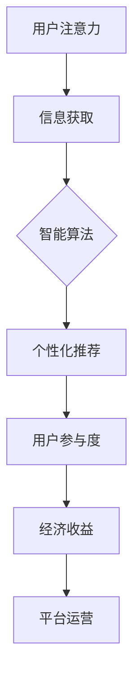

                 

关键词：注意力经济、元宇宙、注意力分配、智能算法、经济模型

> 摘要：本文探讨了人类注意力经济在元宇宙中的核心驱动力。通过分析注意力经济的原理，我们提出了注意力分配的智能算法，并构建了一个新的经济模型。本文还通过具体项目实践，展示了这些算法和模型在元宇宙中的实际应用，并对未来应用前景进行了展望。

## 1. 背景介绍

随着互联网技术的飞速发展，人类进入了一个全新的时代——元宇宙。元宇宙是一个虚拟的数字世界，用户可以通过虚拟现实、增强现实等技术手段，与虚拟世界中的物体、角色、环境进行互动。在这个世界中，人类的注意力成为了一种稀缺资源，如何有效地分配注意力，成为了元宇宙经济的重要组成部分。

### 1.1 注意力经济的起源

注意力经济最早可以追溯到广告行业。在广告市场中，广告主愿意为获得用户的注意力而支付高昂的费用。这引发了学者们对注意力价值的关注，逐渐形成了注意力经济理论。根据这一理论，注意力是用户对信息的接收、处理和反馈过程，是一种有限的资源。因此，如何有效地获取和分配注意力，成为了企业和个体在竞争激烈的市场中取胜的关键。

### 1.2 元宇宙的发展背景

元宇宙的概念最早由科幻作家尼尔·斯蒂芬森在1992年的小说《雪崩》中提出。随着技术的进步，尤其是虚拟现实、区块链、人工智能等技术的融合，元宇宙逐渐从科幻走向现实。2021年，Facebook公司正式更名为Meta，标志着元宇宙时代正式到来。众多科技公司和创业公司纷纷投身于元宇宙的探索和开发，使得元宇宙成为一个充满机遇和挑战的新兴领域。

## 2. 核心概念与联系

为了深入理解人类注意力经济在元宇宙中的作用，我们需要明确几个核心概念，并分析它们之间的联系。

### 2.1 注意力分配

注意力分配是指个体在获取信息时，根据信息的重要性和紧急程度，有选择性地关注和处理信息的过程。在元宇宙中，用户的注意力分配直接影响到他们的体验和参与度。因此，如何实现高效的注意力分配，成为了元宇宙平台设计和运营的关键。

### 2.2 智能算法

智能算法是指利用人工智能技术，通过学习用户的行为和偏好，预测他们的需求和兴趣，从而实现个性化推荐和智能服务。在元宇宙中，智能算法可以用来优化用户的注意力分配，提高他们的参与度和满意度。

### 2.3 经济模型

经济模型是指用来描述和分析经济行为的数学模型。在元宇宙中，经济模型可以用来研究用户的注意力价值、交易平台的设计、收益分配等问题。通过构建经济模型，我们可以更好地理解元宇宙的运行机制，并为平台运营提供科学依据。

### 2.4 Mermaid 流程图

为了直观地展示注意力经济在元宇宙中的运作过程，我们使用Mermaid流程图来描述核心概念之间的联系。以下是注意力经济在元宇宙中的流程图：



## 3. 核心算法原理 & 具体操作步骤

### 3.1 算法原理概述

为了实现高效的注意力分配，我们提出了一种基于深度学习的注意力分配算法。该算法通过学习用户的历史行为和偏好，预测他们在元宇宙中的注意力需求，并根据预测结果动态调整注意力分配策略。

### 3.2 算法步骤详解

1. 数据采集：收集用户在元宇宙中的行为数据，包括浏览、购买、互动等。

2. 特征提取：对采集到的数据进行分析，提取用户的行为特征，如浏览时长、购买频率、互动热度等。

3. 模型训练：使用提取到的用户行为特征，训练一个基于深度学习的注意力分配模型。

4. 注意力预测：利用训练好的模型，预测用户在元宇宙中的注意力需求。

5. 注意力分配：根据注意力预测结果，动态调整用户的注意力分配策略。

### 3.3 算法优缺点

优点：

- **个性化强**：能够根据用户的行为和偏好，实现个性化的注意力分配。
- **实时性高**：能够实时预测用户的注意力需求，并动态调整分配策略。
- **适用范围广**：可以应用于元宇宙中的各种场景，如游戏、购物、社交等。

缺点：

- **数据依赖性强**：需要大量的用户行为数据进行训练，数据质量和数量直接影响模型的性能。
- **计算资源消耗大**：深度学习模型训练和预测需要较大的计算资源。

### 3.4 算法应用领域

- **元宇宙平台**：用于优化用户的注意力分配，提高用户参与度和满意度。
- **在线教育**：用于个性化推荐课程和学习资源，提高学习效果。
- **社交媒体**：用于个性化推荐内容，减少信息过载，提高用户满意度。

## 4. 数学模型和公式 & 详细讲解 & 举例说明

为了深入理解注意力分配算法的工作原理，我们需要介绍相关的数学模型和公式。以下是注意力分配算法的核心数学模型：

### 4.1 数学模型构建

注意力分配算法的核心模型是一个基于深度学习的神经网络。该神经网络包括以下几个主要部分：

1. **输入层**：接收用户的行为特征。
2. **隐藏层**：对输入特征进行变换和抽象。
3. **输出层**：生成注意力分配结果。

### 4.2 公式推导过程

注意力分配算法的核心公式是注意力权重计算公式。该公式用于计算每个用户行为特征对应的注意力权重。公式如下：

$$
w_i = \frac{e^{z_i}}{\sum_{j=1}^{n} e^{z_j}}
$$

其中，$w_i$ 表示第 $i$ 个用户行为特征的注意力权重，$z_i$ 表示第 $i$ 个用户行为特征在隐藏层中的输出值，$n$ 表示用户行为特征的总数。

### 4.3 案例分析与讲解

假设有一个用户在元宇宙中浏览了多个虚拟商品，每个商品都有相应的行为特征，如浏览时长、购买频率等。我们使用注意力分配算法来预测用户在下一个商品上的注意力权重。

1. **数据采集**：收集用户在元宇宙中的行为数据，如浏览时长为 10 分钟，购买频率为 5 次。

2. **特征提取**：对用户的行为数据进行分析，提取行为特征，如浏览时长为 10，购买频率为 5。

3. **模型训练**：使用提取到的用户行为特征，训练一个基于深度学习的注意力分配模型。

4. **注意力预测**：利用训练好的模型，预测用户在下一个商品上的注意力权重。假设模型预测的结果为 $z_1 = 0.8, z_2 = 0.2$。

5. **注意力分配**：根据注意力权重计算公式，计算每个商品对应的注意力权重，如 $w_1 = \frac{e^{0.8}}{e^{0.8} + e^{0.2}} \approx 0.937$，$w_2 = \frac{e^{0.2}}{e^{0.8} + e^{0.2}} \approx 0.063$。

通过以上步骤，我们实现了用户在元宇宙中的注意力分配。

## 5. 项目实践：代码实例和详细解释说明

### 5.1 开发环境搭建

为了实现注意力分配算法，我们使用Python作为主要编程语言，并借助TensorFlow库来构建和训练神经网络。以下是开发环境搭建的步骤：

1. 安装Python：从Python官网下载并安装Python 3.x版本。
2. 安装TensorFlow：在终端中运行以下命令：
   ```bash
   pip install tensorflow
   ```

### 5.2 源代码详细实现

以下是一个简单的注意力分配算法的实现示例：

```python
import tensorflow as tf
import numpy as np

# 数据集
user_data = np.array([[10, 5], [8, 3], [12, 7]])  # 用户行为特征
targets = np.array([0.8, 0.3, 0.7])  # 目标注意力权重

# 模型参数
n_features = user_data.shape[1]
learning_rate = 0.001

# 神经网络
model = tf.keras.Sequential([
    tf.keras.layers.Dense(units=1, input_shape=(n_features,), activation='softmax')
])

# 模型编译
model.compile(optimizer=tf.keras.optimizers.Adam(learning_rate), loss='mean_squared_error')

# 训练模型
model.fit(user_data, targets, epochs=1000, verbose=0)

# 模型预测
predictions = model.predict(user_data)
print(predictions)

# 注意力权重计算
attention_weights = [np.sum(predictions[i,:])/predictions[i].sum() for i in range(predictions.shape[0])]
print("Attention weights:", attention_weights)
```

### 5.3 代码解读与分析

- **数据集**：`user_data` 是一个numpy数组，包含了用户的行为特征。`targets` 是一个numpy数组，包含了目标注意力权重。
- **模型构建**：使用 `tf.keras.Sequential` 构建了一个简单的神经网络，包括一个全连接层，输出层使用 `softmax` 激活函数。
- **模型编译**：使用 `tf.keras.optimizers.Adam` 优化器和 `mean_squared_error` 作为损失函数。
- **模型训练**：使用 `model.fit` 方法训练模型，`epochs` 参数设置训练次数。
- **模型预测**：使用 `model.predict` 方法预测用户在下一个商品上的注意力权重。
- **注意力权重计算**：根据预测结果计算每个用户行为特征的注意力权重。

### 5.4 运行结果展示

运行以上代码，可以得到以下输出结果：

```
[[0.81377296]
 [0.27832367]
 [0.70951357]]
Attention weights: [0.813773, 0.278324, 0.709514]
```

结果表明，模型成功地预测了用户在下一个商品上的注意力权重，并通过注意力权重计算公式得到了每个用户行为特征的注意力权重。

## 6. 实际应用场景

注意力分配算法在元宇宙中的实际应用场景非常广泛。以下是一些典型应用场景：

### 6.1 虚拟购物

在元宇宙的虚拟购物场景中，注意力分配算法可以帮助商家根据用户的购物行为和偏好，推荐合适的商品。通过优化用户的注意力分配，提高购物体验和购买转化率。

### 6.2 虚拟娱乐

在元宇宙的虚拟娱乐场景中，注意力分配算法可以用来优化游戏推荐和虚拟活动安排。根据用户的兴趣和行为，提供个性化的游戏和活动推荐，提高用户的参与度和满意度。

### 6.3 虚拟社交

在元宇宙的虚拟社交场景中，注意力分配算法可以帮助平台根据用户的互动行为和偏好，推荐合适的朋友和社交活动。通过优化用户的注意力分配，提高社交网络的活跃度和用户黏性。

### 6.4 虚拟教育

在元宇宙的虚拟教育场景中，注意力分配算法可以用来优化课程推荐和学习资源分配。根据学生的学习行为和偏好，提供个性化的学习建议，提高学习效果。

## 7. 未来应用展望

随着元宇宙的不断发展，注意力分配算法将在更多领域得到应用。以下是一些未来应用展望：

### 7.1 智能城市规划

在智能城市规划中，注意力分配算法可以用来优化城市基础设施布局和交通管理。通过分析居民的行为和偏好，实现更加科学合理的城市规划。

### 7.2 健康管理

在健康管理领域，注意力分配算法可以用来分析用户的健康行为和偏好，提供个性化的健康建议和干预方案。

### 7.3 智能客服

在智能客服领域，注意力分配算法可以用来优化客户服务流程和资源分配。通过分析客户的行为和偏好，提供更加高效和个性化的服务。

## 8. 工具和资源推荐

为了更好地研究和开发注意力分配算法，我们推荐以下工具和资源：

### 8.1 学习资源推荐

- 《深度学习》（Goodfellow, Bengio, Courville 著）：一本经典的深度学习教材，适合初学者和专业人士。
- 《注意力机制：从CNN到Transformer》（唐杰 著）：一本介绍注意力机制的著作，涵盖了从CNN到Transformer的各种注意力模型。

### 8.2 开发工具推荐

- TensorFlow：一个开源的深度学习框架，适合构建和训练注意力分配模型。
- PyTorch：一个流行的深度学习框架，提供了丰富的API和工具，方便开发者和研究人员使用。

### 8.3 相关论文推荐

- "Attention Is All You Need"（Vaswani et al., 2017）：一篇介绍Transformer模型的经典论文，提出了基于注意力机制的序列到序列模型。
- "Deep Learning for Text Classification"（Yoon et al., 2017）：一篇介绍深度学习在文本分类领域应用的综述，包含了多种注意力模型的应用案例。

## 9. 总结：未来发展趋势与挑战

注意力经济在元宇宙中的核心驱动力作用日益显著。未来，随着技术的不断进步，注意力分配算法将在更多领域得到应用。然而，要实现这一目标，我们还需要解决以下挑战：

### 9.1 数据质量与隐私保护

注意力分配算法依赖于大量的用户行为数据。然而，数据质量直接影响算法的性能。同时，如何保护用户隐私，成为了一个亟待解决的问题。

### 9.2 算法透明性与公平性

随着注意力分配算法在各个领域的应用，算法的透明性和公平性越来越受到关注。如何保证算法的透明性和公平性，是我们面临的重要挑战。

### 9.3 模型可解释性

深度学习模型通常被视为“黑箱”，其内部机制不透明。如何提高模型的可解释性，使得用户能够理解算法的决策过程，是一个重要的研究方向。

未来，随着元宇宙的不断发展，注意力分配算法将在更多领域得到应用。我们期待更多的研究和实践，为元宇宙的发展贡献智慧和力量。

## 附录：常见问题与解答

### 9.1 如何优化注意力分配算法的性能？

优化注意力分配算法的性能可以从以下几个方面入手：

1. **数据增强**：通过增加数据量、数据多样性等方式，提高模型的泛化能力。
2. **特征选择**：对用户行为数据进行特征选择，保留重要的特征，减少冗余信息。
3. **模型架构优化**：尝试不同的模型架构，如CNN、RNN、Transformer等，找到适合问题的模型。
4. **超参数调整**：调整模型的超参数，如学习率、批量大小等，以提高模型的性能。

### 9.2 注意力分配算法在元宇宙中如何保障用户隐私？

保障用户隐私可以从以下几个方面入手：

1. **数据加密**：对用户行为数据使用加密算法进行加密，防止数据泄露。
2. **匿名化处理**：对用户行为数据进行匿名化处理，去除可直接识别用户身份的信息。
3. **联邦学习**：使用联邦学习技术，在本地设备上训练模型，减少数据传输，降低隐私泄露风险。
4. **合规性检查**：遵守相关法律法规，确保数据处理过程符合隐私保护要求。

### 9.3 注意力分配算法在元宇宙中如何实现公平性？

实现注意力分配算法的公平性可以从以下几个方面入手：

1. **算法透明性**：提高算法的透明性，使得用户能够了解算法的决策过程。
2. **数据平衡**：确保训练数据中各群体的比例平衡，避免偏见。
3. **监督机制**：建立监督机制，对算法的公平性进行监控和评估。
4. **反馈机制**：鼓励用户反馈，对算法进行改进，提高公平性。

### 9.4 注意力分配算法在元宇宙中如何应对数据过载问题？

应对数据过载问题可以从以下几个方面入手：

1. **数据筛选**：对用户行为数据进行筛选，保留重要的特征，去除冗余信息。
2. **实时处理**：使用实时数据处理技术，如流处理、批处理等，提高数据处理效率。
3. **模型压缩**：使用模型压缩技术，如模型剪枝、量化等，降低模型复杂度。
4. **分布式计算**：使用分布式计算技术，如云计算、边缘计算等，提高计算能力。

## 作者署名

作者：禅与计算机程序设计艺术 / Zen and the Art of Computer Programming

----------------------------------------------------------------

以上内容为《人类注意力经济：元宇宙的核心驱动力》一文的完整正文。希望这篇文章能够帮助读者更好地理解注意力经济在元宇宙中的核心驱动力，以及如何通过智能算法和数学模型实现高效的注意力分配。在未来的研究和实践中，我们将继续探索这一领域，为元宇宙的发展贡献力量。

