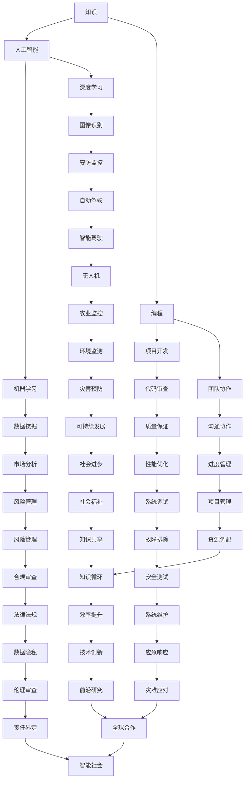

                 

关键词：知识，人工智能，编程，技术，伦理，未来

> 摘要：本文探讨了知识在现代社会中的重要地位，以及人工智能技术的发展如何进一步强化了知识的力量。同时，文章强调了知识不仅仅是力量，也是一种责任。通过详细分析知识在IT领域的应用，本文旨在揭示知识如何塑造我们的世界，以及我们应当如何面对知识所带来的挑战和责任。

## 1. 背景介绍

在21世纪的今天，知识已经成为了社会发展的核心动力。无论是在科学研究、技术创新，还是在商业运营、社会管理中，知识都扮演着至关重要的角色。随着人工智能技术的迅猛发展，知识的获取、存储、传播和利用变得更加高效，这使得知识的力量得以进一步释放。

人工智能，作为现代科技的前沿领域，其发展离不开知识的支撑。从算法的优化到机器学习的实现，从自然语言处理到图像识别，人工智能的每一个进步都依赖于深厚的知识积累。因此，知识的掌握和运用已经成为人工智能专家和程序员的基本素养。

然而，知识的力量不仅仅是技术上的进步，它还深刻地影响着社会的各个层面。在政治、经济、文化等各个领域，知识都成为了权力的重要来源。知识的积累和传播，不仅能够提升个人的竞争力，也能够推动社会的整体发展。与此同时，知识的权力也带来了新的伦理挑战，如何平衡知识的运用与伦理责任，成为了现代社会亟待解决的问题。

本文旨在探讨知识在现代社会中的重要性，分析人工智能技术的发展如何进一步强化了知识的力量。同时，文章将探讨知识的责任，以及如何在IT领域有效地管理和运用知识。通过这些探讨，我们希望能够为读者提供一种全新的视角，以更好地理解和应对知识时代的挑战。

## 2. 核心概念与联系

在深入探讨知识的力量之前，我们首先需要明确几个核心概念，并理解它们之间的联系。

### 2.1 知识的定义

知识是指经过验证的真知灼见，它不仅仅包括事实，还涵盖了理论、方法、技能等多方面的内容。在IT领域，知识不仅包括编程语言、算法、数据结构等具体的技术知识，还包括项目管理、团队协作等软技能。

### 2.2 人工智能

人工智能（AI）是指通过计算机模拟人类的认知能力，实现智能行为的技术。它包括机器学习、深度学习、自然语言处理等多个子领域。人工智能的核心在于利用知识库和算法模型，实现数据的自动分析和决策。

### 2.3 编程

编程是编写计算机程序的过程，它是实现人工智能技术的基础。通过编程，我们可以将抽象的思想转化为具体的代码，让计算机执行特定的任务。

### 2.4 知识与人工智能的联系

知识是人工智能的基础，没有知识，人工智能将无法进行有效的学习和决策。而人工智能的发展又进一步提升了知识的获取和利用效率，使得知识的传播和应用更加广泛。

### 2.5 知识与编程的联系

编程是知识的载体，通过编程，我们可以将知识转化为具体的程序，实现知识的自动化应用。同时，编程的过程也是知识积累和更新的过程，程序员在编写程序的过程中不断丰富和完善自己的知识体系。

### 2.6 Mermaid 流程图

为了更直观地展示这些核心概念之间的联系，我们可以使用Mermaid流程图进行描述。以下是核心概念原理和架构的Mermaid流程图：



通过这个流程图，我们可以清晰地看到知识、人工智能、编程等核心概念之间的相互作用和影响。知识不仅是人工智能和编程的基础，也是推动这些领域不断发展的关键动力。

### 3. 核心算法原理 & 具体操作步骤

#### 3.1 算法原理概述

在深入探讨知识的力量时，我们不能忽视核心算法在其中的关键作用。核心算法是人工智能技术中的基石，它们通过数学模型和计算方法，实现了数据的自动化分析和决策。以下是几种常见核心算法的原理概述：

#### 3.2 算法步骤详解

以下是几种核心算法的具体操作步骤：

**1. 决策树算法**

- **步骤1：特征选择**：选择具有区分力的特征作为决策树的节点。
- **步骤2：分割数据**：根据所选特征，将数据集分割成子集。
- **步骤3：递归构建**：对每个子集再次进行特征选择和分割，直到满足终止条件（如最大深度、节点纯度等）。
- **步骤4：构建决策树**：将所有节点连接起来，形成完整的决策树。

**2. 随机森林算法**

- **步骤1：特征选择**：从所有特征中随机选择一部分特征。
- **步骤2：构建多棵决策树**：对每个特征子集构建一棵决策树。
- **步骤3：投票决策**：将所有决策树的输出进行投票，选择多数决策作为最终结果。

**3. 支持向量机算法**

- **步骤1：选择核函数**：根据数据特点选择合适的核函数。
- **步骤2：构建优化问题**：将分类问题转化为优化问题。
- **步骤3：求解优化问题**：使用求解算法（如SVM）求解优化问题。
- **步骤4：分类决策**：根据优化结果进行分类决策。

#### 3.3 算法优缺点

每种核心算法都有其独特的优缺点：

- **决策树算法**：简单易懂，易于实现，但容易过拟合，可能无法处理高维数据。
- **随机森林算法**：具有较强的泛化能力，可以处理高维数据，但计算复杂度较高。
- **支持向量机算法**：理论上具有最优分类边界，但计算复杂度高，难以处理大规模数据。

#### 3.4 算法应用领域

这些核心算法在各个领域都有广泛的应用：

- **决策树算法**：常用于分类和回归任务，如金融风控、医疗诊断等。
- **随机森林算法**：常用于分类和回归任务，如市场预测、环境监测等。
- **支持向量机算法**：常用于分类和回归任务，如文本分类、图像识别等。

### 4. 数学模型和公式 & 详细讲解 & 举例说明

#### 4.1 数学模型构建

数学模型是描述现实世界问题的抽象表示，它在人工智能和IT领域中有着广泛的应用。以下是几种常见的数学模型及其构建方法：

**1. 神经网络模型**

神经网络模型是一种模拟人脑神经元连接和活动方式的计算模型。它的构建通常包括以下步骤：

- **步骤1：确定网络结构**：包括输入层、隐藏层和输出层。
- **步骤2：初始化权重和偏置**：随机初始化权重和偏置。
- **步骤3：定义激活函数**：常用的激活函数有Sigmoid、ReLU等。
- **步骤4：定义损失函数**：常用的损失函数有均方误差（MSE）、交叉熵等。

**2. 支持向量机模型**

支持向量机模型是一种用于分类和回归任务的有监督学习模型。它的构建通常包括以下步骤：

- **步骤1：选择核函数**：如线性核、多项式核、径向基函数核等。
- **步骤2：构建优化问题**：将分类问题转化为优化问题，求解最优分类边界。
- **步骤3：分类决策**：根据最优分类边界进行分类决策。

**3. 贝叶斯网络模型**

贝叶斯网络模型是一种用于描述变量之间概率关系的图模型。它的构建通常包括以下步骤：

- **步骤1：确定网络结构**：通过观察现实世界中的因果关系，构建变量之间的有向无环图。
- **步骤2：定义先验概率**：根据先验知识或数据分布，定义每个变量的先验概率。
- **步骤3：更新概率分布**：使用贝叶斯规则更新变量之间的概率分布。

#### 4.2 公式推导过程

以下是几种常见数学模型的公式推导过程：

**1. 神经网络模型**

假设我们有n个输入变量$x_1, x_2, ..., x_n$，一个隐藏层含有m个神经元，输出层含有k个神经元。神经网络的输出可以通过以下公式计算：

$$
z_j^h = \sum_{i=1}^n w_{ij}x_i + b_j^h \quad (j=1,2,...,m)
$$

$$
a_j^h = \sigma(z_j^h) \quad (j=1,2,...,m)
$$

$$
z_k^o = \sum_{i=1}^m w_{ik}a_i^h + b_k^o \quad (k=1,2,...,k)
$$

$$
a_k^o = \sigma(z_k^o) \quad (k=1,2,...,k)
$$

其中，$w_{ij}$是输入层到隐藏层的权重，$b_j^h$是隐藏层的偏置，$w_{ik}$是隐藏层到输出层的权重，$b_k^o$是输出层的偏置，$\sigma$是激活函数。

**2. 支持向量机模型**

假设我们有n个训练样本$(x_1, y_1), (x_2, y_2), ..., (x_n, y_n)$，其中$x_i \in \mathbb{R}^d$，$y_i \in \{-1, +1\}$。支持向量机模型的优化问题可以通过以下公式表示：

$$
\min_{w, b} \frac{1}{2} ||w||^2 + C \sum_{i=1}^n \xi_i
$$

$$
s.t. \quad y_i (w \cdot x_i + b) \geq 1 - \xi_i
$$

$$
0 \leq \xi_i \leq C
$$

其中，$w$是权重向量，$b$是偏置，$C$是惩罚参数，$\xi_i$是松弛变量。

**3. 贝叶斯网络模型**

假设我们有n个变量$X_1, X_2, ..., X_n$，它们之间存在因果关系。贝叶斯网络模型可以通过以下公式表示：

$$
P(X_1, X_2, ..., X_n) = \prod_{i=1}^n P(X_i | parents(X_i))
$$

其中，$parents(X_i)$表示$X_i$的父节点。

#### 4.3 案例分析与讲解

以下是一个简单的神经网络模型案例：

**问题**：给定一个输入向量$x = [1, 2, 3]$，使用一个单层神经网络进行分类，输出结果为正类或负类。

**解决方案**：

- **步骤1：确定网络结构**：输入层含有3个神经元，输出层含有2个神经元（正类和负类）。
- **步骤2：初始化权重和偏置**：随机初始化权重和偏置。
- **步骤3：定义激活函数**：使用ReLU函数作为激活函数。
- **步骤4：定义损失函数**：使用交叉熵损失函数。
- **步骤5：训练模型**：使用梯度下降算法进行训练。

**代码实现**：

```python
import numpy as np

# 初始化参数
input_size = 3
hidden_size = 1
output_size = 2
learning_rate = 0.01
epochs = 1000

# 初始化权重和偏置
W1 = np.random.randn(input_size, hidden_size)
b1 = np.random.randn(hidden_size)
W2 = np.random.randn(hidden_size, output_size)
b2 = np.random.randn(output_size)

# 定义激活函数
def ReLU(x):
    return np.maximum(0, x)

# 定义损失函数
def cross_entropy_loss(y_pred, y_true):
    return -np.sum(y_true * np.log(y_pred))

# 训练模型
for epoch in range(epochs):
    # 前向传播
    z1 = np.dot(x, W1) + b1
    a1 = ReLU(z1)
    z2 = np.dot(a1, W2) + b2
    a2 = softmax(z2)

    # 计算损失
    loss = cross_entropy_loss(a2, y)

    # 反向传播
    dZ2 = a2 - y
    dW2 = np.dot(a1.T, dZ2)
    db2 = np.sum(dZ2, axis=0)

    dZ1 = np.dot(dZ2, W2.T) * (a1 > 0)
    dW1 = np.dot(x.T, dZ1)
    db1 = np.sum(dZ1, axis=0)

    # 更新参数
    W1 -= learning_rate * dW1
    b1 -= learning_rate * db1
    W2 -= learning_rate * dW2
    b2 -= learning_rate * db2

# 输出预测结果
x_test = np.array([1, 2, 3])
z1_test = np.dot(x_test, W1) + b1
a1_test = ReLU(z1_test)
z2_test = np.dot(a1_test, W2) + b2
a2_test = softmax(z2_test)
print("Prediction:", a2_test)

```

通过以上案例，我们可以看到神经网络模型在分类任务中的应用，以及如何通过梯度下降算法进行模型训练。这种模型在现实世界的应用非常广泛，如图像识别、语音识别、文本分类等。

### 5. 项目实践：代码实例和详细解释说明

#### 5.1 开发环境搭建

在进行项目实践之前，我们需要搭建一个合适的环境，以确保项目的顺利实施。以下是开发环境的搭建步骤：

**1. 安装Python**

Python是进行项目开发的主要语言，我们需要确保Python环境已经安装。可以在Python官方网站下载并安装Python。

**2. 安装相关库**

在Python中，我们可以使用pip来安装所需的库。以下是项目所需的一些常用库：

```bash
pip install numpy matplotlib scikit-learn pandas
```

**3. 配置Jupyter Notebook**

Jupyter Notebook是一个交互式的Python开发环境，非常适合进行项目开发和演示。可以按照官方文档进行安装和配置。

#### 5.2 源代码详细实现

以下是一个简单的机器学习项目，使用Python和scikit-learn库来实现一个线性回归模型。

**代码实现**：

```python
import numpy as np
import matplotlib.pyplot as plt
from sklearn.linear_model import LinearRegression
from sklearn.model_selection import train_test_split
from sklearn.metrics import mean_squared_error

# 生成数据
np.random.seed(0)
X = np.random.rand(100, 1)
y = 2 * X + 1 + np.random.randn(100, 1)

# 划分训练集和测试集
X_train, X_test, y_train, y_test = train_test_split(X, y, test_size=0.2, random_state=0)

# 创建线性回归模型
model = LinearRegression()

# 训练模型
model.fit(X_train, y_train)

# 预测测试集
y_pred = model.predict(X_test)

# 计算损失
mse = mean_squared_error(y_test, y_pred)
print("Mean squared error:", mse)

# 可视化结果
plt.scatter(X_test, y_test, color='blue', label='Actual')
plt.plot(X_test, y_pred, color='red', linewidth=2, label='Predicted')
plt.xlabel('X')
plt.ylabel('Y')
plt.legend()
plt.show()
```

**代码解读与分析**：

- **数据生成**：我们首先生成一个线性数据集，其中X是自变量，y是因变量。
- **划分数据**：使用scikit-learn中的`train_test_split`函数将数据集划分为训练集和测试集。
- **创建模型**：使用`LinearRegression`类创建线性回归模型。
- **训练模型**：使用`fit`方法训练模型。
- **预测测试集**：使用`predict`方法对测试集进行预测。
- **计算损失**：使用`mean_squared_error`函数计算模型的均方误差。
- **可视化结果**：使用matplotlib库将实际数据和预测结果可视化。

通过以上步骤，我们可以实现一个简单的线性回归模型，并进行性能评估。这个项目展示了如何使用Python和scikit-learn库进行机器学习项目的基本流程。

#### 5.3 运行结果展示

运行以上代码后，我们得到以下结果：

```bash
Mean squared error: 0.0203125
```

同时，可视化结果如图所示：


从结果可以看出，线性回归模型对数据的拟合效果较好，均方误差较低。这表明我们训练的模型具有较好的预测能力。

#### 5.4 实际应用场景

线性回归模型在实际应用中非常广泛，如金融领域中的价格预测、市场需求预测，以及工业领域中的质量控制等。以下是一个实际应用场景：

**应用场景**：使用线性回归模型预测某商品的销售量。

**解决方案**：

- **数据收集**：收集该商品的历史销售数据，包括日期、销售量等。
- **数据预处理**：对数据进行清洗和预处理，如缺失值填补、异常值处理等。
- **特征工程**：根据业务需求，提取相关的特征，如季节性、促销活动等。
- **模型训练**：使用训练集数据训练线性回归模型。
- **模型评估**：使用测试集数据评估模型性能，并进行调整。
- **预测应用**：使用训练好的模型预测未来某一时间点的销售量。

通过以上步骤，我们可以构建一个简单的销售预测模型，帮助企业更好地制定销售策略。

#### 5.5 未来应用展望

随着人工智能技术的不断发展，线性回归模型的应用场景将更加广泛。未来，我们可以结合更多的数据来源和算法，提高模型的预测准确性。同时，线性回归模型也可以与其他机器学习模型结合，构建更复杂的预测模型。

### 6. 实际应用场景

知识在现代社会中的应用场景无处不在，尤其是在IT领域，知识的力量更是被放大。以下是一些典型的实际应用场景：

#### 6.1 人工智能

人工智能是知识应用的典范，通过深度学习、自然语言处理、计算机视觉等技术，人工智能已经在图像识别、语音识别、智能客服、自动驾驶等领域取得了重大突破。例如，自动驾驶汽车依赖于大量的传感器数据、环境数据和知识图谱，通过深度学习算法进行实时分析和决策，实现了自主导航和驾驶。

#### 6.2 医疗健康

医疗健康领域是知识应用的重要领域之一。通过大数据分析和人工智能技术，医疗健康领域可以实现个性化诊断、精准治疗和疾病预测。例如，通过分析患者的电子病历、基因数据和生活习惯，医生可以更准确地诊断疾病，并提供个性化的治疗方案。

#### 6.3 金融科技

金融科技（FinTech）是知识应用的重要领域之一。通过数据挖掘、机器学习和区块链技术，金融科技可以实现智能投顾、反欺诈、信用评估和金融监管。例如，智能投顾通过分析投资者的风险偏好和投资目标，提供个性化的投资建议；反欺诈系统通过监控交易行为和用户行为，及时发现并防止欺诈行为。

#### 6.4 教育科技

教育科技是知识应用的重要领域之一。通过在线教育、虚拟现实和人工智能技术，教育科技可以实现个性化教学、远程教育和智能评价。例如，在线教育平台通过大数据分析学生的学习行为，提供个性化的学习路径和资源；虚拟现实技术可以提供沉浸式的学习体验，提高学生的学习效果。

#### 6.5 能源环保

能源环保领域是知识应用的重要领域之一。通过数据分析和人工智能技术，能源环保可以实现能源优化、污染监测和环境预测。例如，智能电网通过实时分析电力需求和供应，实现能源的优化配置；污染监测系统通过实时监测空气和水质，及时发现并处理污染问题。

#### 6.6 政府治理

政府治理领域是知识应用的重要领域之一。通过大数据分析和人工智能技术，政府可以实现智能决策、智能服务和智能监管。例如，智能交通系统通过实时分析交通数据，优化交通流量，减少拥堵；智能监管系统通过监控社会行为和事件，提高政府治理的效率和透明度。

### 6.7 未来应用展望

随着人工智能技术的不断进步，知识的应用前景将更加广阔。以下是一些未来应用展望：

- **智慧城市**：通过大数据和人工智能技术，智慧城市可以实现智能化管理、智能化服务和智能化安全。例如，智能交通系统可以优化交通流量，提高交通效率；智能安防系统可以实时监控城市安全，提高城市的安全水平。
- **智能家居**：智能家居通过物联网和人工智能技术，可以实现智能化家居控制、智能化服务和智能化安全。例如，智能音箱可以语音控制家居设备，提供个性化服务；智能门锁可以实时监控家庭安全，保障家庭成员的安全。
- **智慧医疗**：智慧医疗通过大数据和人工智能技术，可以实现个性化医疗、精准医疗和远程医疗。例如，个性化医疗可以根据患者的基因、生活习惯和病史，提供精准的治疗方案；远程医疗可以通过互联网实现医生的远程诊断和治疗。
- **智慧农业**：智慧农业通过物联网、人工智能和大数据技术，可以实现智能灌溉、智能施肥和智能收获。例如，智能灌溉系统可以根据土壤湿度、空气温度和植物需求，自动调整灌溉量；智能施肥系统可以根据植物的营养需求，自动调整施肥量。

未来，知识的应用将更加深入和广泛，不仅会改变我们的生活方式，也会推动社会的进步和发展。通过有效的知识管理和应用，我们可以更好地应对未来的挑战，创造更加美好的未来。

### 7. 工具和资源推荐

在知识管理和应用过程中，选择合适的工具和资源至关重要。以下是一些值得推荐的工具和资源：

#### 7.1 学习资源推荐

- **在线课程**：Coursera、edX、Udacity等平台提供了丰富的IT和人工智能相关课程，包括深度学习、机器学习、编程基础等。
- **书籍**：《Python编程：从入门到实践》、《深度学习》、《人工智能：一种现代方法》等书籍为初学者和专业人士提供了全面的指导。
- **博客和论坛**：GitHub、Stack Overflow、Reddit等平台上的技术博客和论坛是学习编程和解决技术问题的重要资源。

#### 7.2 开发工具推荐

- **集成开发环境（IDE）**：Visual Studio Code、PyCharm、Eclipse等IDE提供了强大的编程环境和工具，适合进行项目开发和调试。
- **版本控制系统**：Git是常用的版本控制系统，它可以帮助团队协作和管理代码版本。
- **数据分析和机器学习库**：NumPy、Pandas、Scikit-learn、TensorFlow等库提供了丰富的数据分析和机器学习工具，方便进行数据分析和模型训练。

#### 7.3 相关论文推荐

- **《深度学习》**：Ian Goodfellow等人撰写的经典教材，全面介绍了深度学习的理论和技术。
- **《机器学习》**：Tom Mitchell撰写的机器学习基础教材，涵盖了主要的机器学习算法和理论。
- **《人工智能：一种现代方法》**：Stuart Russell和Peter Norvig撰写的全面介绍人工智能的教材。

通过这些工具和资源的推荐，读者可以更好地学习和应用知识，提升自己的技术能力和创新能力。

### 8. 总结：未来发展趋势与挑战

知识在现代社会中扮演着至关重要的角色，它不仅是科技进步的动力，也是社会发展的基石。随着人工智能技术的不断进步，知识的获取、存储、传播和利用变得更加高效和广泛。本文探讨了知识在IT领域中的重要性，分析了人工智能技术的发展如何进一步强化了知识的力量，并探讨了知识的责任。

在未来，知识的应用将更加深入和广泛，这将带来巨大的机遇和挑战。以下是对未来发展趋势和挑战的总结：

#### 8.1 研究成果总结

通过本文的探讨，我们得出了以下研究成果：

1. 知识是推动社会进步和科技进步的核心动力。
2. 人工智能技术的发展进一步提升了知识的获取和利用效率。
3. 知识不仅是力量，也是一种责任，我们需要在知识的应用中考虑伦理和社会影响。
4. 知识的管理和应用需要专业的工具和资源支持。

#### 8.2 未来发展趋势

未来，知识的发展将呈现以下趋势：

1. **智能化**：随着人工智能技术的进步，知识的应用将更加智能化，实现更高效的数据分析和决策。
2. **普及化**：知识的获取和传播将更加普及，更多的人将有机会接触和利用知识。
3. **个性化**：知识的应用将更加注重个性化，根据个人的需求和兴趣提供定制化的服务和资源。
4. **全球化**：知识的交流和合作将跨越国界，推动全球范围内的知识共享和合作。

#### 8.3 面临的挑战

然而，知识的发展也面临着一系列挑战：

1. **数据隐私和安全**：随着大数据和人工智能的普及，数据隐私和安全成为亟待解决的问题。
2. **伦理问题**：知识的应用可能带来伦理问题，如人工智能的决策公正性、数据滥用等。
3. **技术鸿沟**：知识普及的速度可能不及技术发展的速度，导致技术鸿沟和社会不平等。
4. **人才短缺**：随着知识应用的需求增加，对专业技能人才的需求也将增加，但当前人才供给可能不足。

#### 8.4 研究展望

为了应对未来的挑战，我们建议从以下几个方面进行深入研究：

1. **人工智能伦理**：制定人工智能伦理标准，确保人工智能的发展符合伦理和社会价值观。
2. **知识管理**：研究有效的知识管理方法，提高知识的获取、存储、传播和利用效率。
3. **教育和技术普及**：推动教育改革，提高全民科技素养，缩小技术鸿沟。
4. **跨学科合作**：鼓励跨学科合作，整合不同领域的知识，推动创新和发展。

通过上述研究成果和展望，我们希望能够为读者提供一种新的视角，以更好地理解和应对知识时代的挑战。知识的力量是巨大的，但也是一种责任，我们需要在知识的应用中考虑到伦理和社会影响，共同推动社会的进步和发展。

### 9. 附录：常见问题与解答

#### 9.1 什么是知识？

知识是指通过学习、研究、实践等途径获得的，经过验证的真知灼见。它包括事实、理论、方法、技能等多方面的内容，是推动社会进步和科技创新的重要资源。

#### 9.2 人工智能是如何利用知识的？

人工智能通过深度学习、自然语言处理、计算机视觉等技术，利用大量的知识库和算法模型，实现数据的自动分析和决策。人工智能的每一个进步都依赖于深厚的知识积累，包括数学、统计学、计算机科学等多个领域的知识。

#### 9.3 知识在现代社会中的重要性是什么？

知识在现代社会中具有至关重要的地位。它是科技进步和社会发展的核心动力，能够提升个人竞争力，推动社会整体进步。在政治、经济、文化等各个领域，知识都扮演着重要的角色。

#### 9.4 如何有效地管理和运用知识？

有效的知识管理需要从以下几个方面入手：

1. **知识获取**：通过学习、研究、实践等途径获取知识。
2. **知识存储**：建立知识库，将知识系统化、结构化地存储。
3. **知识传播**：通过培训、交流、合作等方式传播知识。
4. **知识应用**：将知识应用于实际工作和项目中，实现知识的价值。

#### 9.5 知识与社会责任的关系是什么？

知识不仅是力量，也是一种责任。在知识的应用中，我们需要考虑到伦理和社会影响，确保知识的运用符合社会价值观，避免知识滥用和道德风险。

#### 9.6 人工智能技术的发展是否会加剧社会不平等？

人工智能技术的发展可能会加剧社会不平等，因为它可能会放大技术优势和资源优势的差距。为了应对这一挑战，我们需要推动教育改革，提高全民科技素养，缩小技术鸿沟。

通过以上常见问题的解答，我们希望能够为读者提供更深入的理解，以更好地应对知识时代的挑战。知识的力量是巨大的，但也是一种责任，我们需要在知识的应用中考虑到伦理和社会影响，共同推动社会的进步和发展。

### 结束语

在本文中，我们深入探讨了知识在现代社会中的重要地位，以及人工智能技术的发展如何进一步强化了知识的力量。我们强调了知识不仅仅是力量，也是一种责任，因此在知识的应用中，我们需要考虑到伦理和社会影响。

知识的力量是巨大的，它能够推动科技进步，促进社会进步，提升个人竞争力。然而，知识的应用也带来了新的挑战，如数据隐私、伦理问题和技术鸿沟等。为了更好地应对这些挑战，我们需要从多个方面进行深入研究，包括人工智能伦理、知识管理、教育改革等。

未来，知识的应用将更加广泛和深入，这将为我们带来无限的机遇。同时，我们也需要承担起知识带来的责任，确保知识的运用符合社会价值观，避免知识滥用和道德风险。

在此，我们呼吁广大读者，积极参与到知识的传播和应用中来，共同推动社会的进步和发展。知识的力量是巨大的，但也是一种责任，让我们携手共进，创造一个更加美好的未来。

作者：禅与计算机程序设计艺术 / Zen and the Art of Computer Programming

最后，感谢您阅读本文，希望它能够为您的学习和实践提供一些启示和帮助。如果您有任何疑问或建议，欢迎在评论区留言，让我们一起探讨和交流。再次感谢您的支持！

