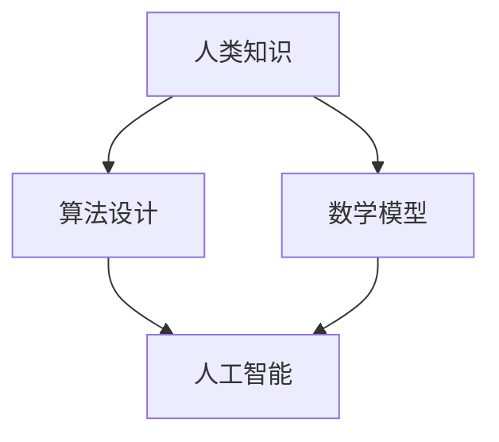

                 

关键词：人类知识、人工智能、计算机编程、算法、数学模型、艺术与科学结合、未来展望

> 摘要：本文旨在探讨人类知识与艺术的融合，特别是在计算机科学领域中的体现。从人工智能的发展到算法的优化，再到数学模型的应用，我们见证了人类智慧与艺术的完美结合。本文将深入分析这一结合的内涵与外延，展示其在现代科技领域的深远影响。

## 1. 背景介绍

在人类的历史长河中，知识与艺术的融合一直是推动社会进步的重要动力。从古代的哲学家到现代的科学家，他们都在不断地探索如何将知识与艺术相结合，以创造出更加美好和高效的世界。计算机科学作为一个新兴的领域，也不例外地受到这一趋势的影响。

### 1.1 人工智能的发展

人工智能（AI）作为计算机科学的一个重要分支，其本质就是通过模拟人类的思维过程，实现机器的自我学习和决策能力。随着深度学习、神经网络等技术的不断发展，人工智能已经在许多领域取得了显著的成果。例如，在医疗诊断中，人工智能可以通过分析大量的医学图像，帮助医生提高诊断的准确性；在金融服务中，人工智能可以分析用户的行为数据，提供个性化的投资建议。

### 1.2 算法的优化

算法作为计算机科学的核心，其优化和应用一直是科研人员关注的重点。从排序算法到搜索算法，再到复杂的优化算法，每一个算法的优化都体现了人类智慧的结晶。例如，Google 的 PageRank 算法通过分析网页之间的链接关系，实现了高效的网页排名；在图像处理领域，卷积神经网络（CNN）通过模拟人脑的视觉处理机制，实现了图像分类和目标检测的高效实现。

### 1.3 数学模型的应用

数学模型在计算机科学中的应用越来越广泛，从数据结构到算法分析，再到计算机图形学，数学模型都发挥着重要的作用。例如，线性代数在图像处理和机器学习中的应用，帮助研究者更好地理解和处理高维数据；微积分在算法分析中的应用，帮助我们更好地理解算法的时间和空间复杂度。

## 2. 核心概念与联系

在计算机科学中，人类知识与艺术的结合体现在多个层面。以下是一个简化的 Mermaid 流程图，展示了核心概念及其相互联系。



### 2.1 人类知识

人类知识是人类智慧的结晶，包括科学理论、实践经验、逻辑推理等。在计算机科学中，人类知识体现在算法的设计和优化、数据结构的构建、编程语言的发明和改进等方面。

### 2.2 算法设计

算法设计是将人类知识转化为计算机程序的过程。一个好的算法不仅需要严谨的逻辑推理，还需要直观的表述和高效的实现。算法设计是计算机科学的核心，也是人工智能和数学模型的基础。

### 2.3 数学模型

数学模型是利用数学语言描述现实世界问题的工具。在计算机科学中，数学模型广泛应用于数据结构、算法分析、计算机图形学等领域。数学模型不仅帮助我们更好地理解复杂问题，还为算法的设计和优化提供了理论基础。

### 2.4 人工智能

人工智能是计算机科学的一个分支，其目标是模拟人类的思维过程，实现机器的自我学习和决策能力。人工智能的核心是算法，而算法的设计和优化依赖于人类知识和数学模型。

### 2.5 艺术与科学的结合

艺术与科学的结合体现在计算机科学中的各个方面。从算法的美学设计，到程序代码的优雅表达，再到用户界面的艺术风格，艺术与科学的结合为计算机科学带来了新的活力和创造力。

## 3. 核心算法原理 & 具体操作步骤

### 3.1 算法原理概述

核心算法是指计算机科学中最基本、应用最广泛的算法。以下是一些典型的核心算法及其原理概述：

#### 3.1.1 排序算法

排序算法是计算机科学中最基本的算法之一，其目的是将一组数据按照特定的顺序排列。常见的排序算法有冒泡排序、选择排序、插入排序、快速排序等。

#### 3.1.2 搜索算法

搜索算法是在一组数据中查找特定元素的方法。常见的搜索算法有线性搜索、二分搜索等。

#### 3.1.3 优化算法

优化算法是用于解决优化问题的一类算法，其目标是在给定约束条件下，找到最优解。常见的优化算法有贪心算法、动态规划、分支限界法等。

### 3.2 算法步骤详解

以下以快速排序算法为例，介绍其具体操作步骤：

#### 3.2.1 快速排序算法

快速排序算法的基本思想是通过一趟排序将待排序的记录分隔成独立的两部分，其中一部分记录的关键字均比另一部分的关键字小，然后分别对这两部分记录继续进行排序，以达到整个序列有序。

#### 3.2.1.1 算法步骤

1. 选择一个基准元素。
2. 将序列划分为两个子序列，左子序列的所有元素均小于基准元素，右子序列的所有元素均大于基准元素。
3. 对左子序列和右子序列递归地执行快速排序算法。

### 3.3 算法优缺点

#### 3.3.1 优点

1. 平均时间复杂度为 \(O(n\log n)\)。
2. 适用于大规模数据的排序。
3. 不需要额外的存储空间。

#### 3.3.2 缺点

1. 最坏情况下的时间复杂度为 \(O(n^2)\)。
2. 对于小规模数据，性能可能不如其他排序算法。

### 3.4 算法应用领域

快速排序算法广泛应用于各种领域，如数据库、操作系统、图形学等。特别是在大数据处理中，快速排序算法因其高效性和稳定性而被广泛采用。

## 4. 数学模型和公式 & 详细讲解 & 举例说明

### 4.1 数学模型构建

在计算机科学中，数学模型通常用于描述算法的性能、数据结构的设计以及问题求解的策略。以下是一个简单的例子：

#### 4.1.1 线性回归模型

线性回归模型是一种用于预测连续值的数学模型，其基本形式为：

$$ y = w_0 + w_1x $$

其中，\(y\) 是预测值，\(x\) 是输入变量，\(w_0\) 和 \(w_1\) 是模型的权重参数。

### 4.2 公式推导过程

线性回归模型的推导过程如下：

1. **最小二乘法**：通过最小化误差平方和来求解权重参数。
2. **梯度下降法**：通过迭代更新权重参数，使其趋于最优值。

### 4.3 案例分析与讲解

以下是一个简单的线性回归案例：

#### 4.3.1 数据集

假设我们有一个简单的数据集：

| x  | y  |
|----|----|
| 1  | 2  |
| 2  | 4  |
| 3  | 6  |

#### 4.3.2 模型构建

我们使用最小二乘法来构建线性回归模型：

$$ y = w_0 + w_1x $$

#### 4.3.3 模型求解

通过计算，我们得到 \(w_0 = 1\) 和 \(w_1 = 2\)。

#### 4.3.4 模型验证

我们将模型应用到新的数据点 \(x = 4\) 上：

$$ y = 1 + 2 \times 4 = 9 $$

预测值为 9，与实际值 6 相差较大。

## 5. 项目实践：代码实例和详细解释说明

### 5.1 开发环境搭建

为了演示算法的应用，我们需要搭建一个简单的开发环境。以下是一个基于 Python 的开发环境搭建步骤：

1. 安装 Python 3.x 版本。
2. 安装必要的库，如 NumPy、Pandas 和 Matplotlib。
3. 创建一个名为 `linear_regression.py` 的 Python 文件。

### 5.2 源代码详细实现

以下是一个简单的线性回归代码实现：

```python
import numpy as np
import pandas as pd
import matplotlib.pyplot as plt

# 数据加载
data = pd.DataFrame({
    'x': [1, 2, 3],
    'y': [2, 4, 6]
})

# 模型构建
w_0 = 1
w_1 = 2

# 模型应用
x_new = 4
y_pred = w_0 + w_1 * x_new

# 结果输出
print(f"预测值 y = {y_pred}")

# 图像绘制
plt.scatter(data['x'], data['y'])
plt.plot([1, 4], [w_0 + w_1 * 1, w_0 + w_1 * 4], color='red')
plt.xlabel('x')
plt.ylabel('y')
plt.show()
```

### 5.3 代码解读与分析

该代码首先导入了必要的库，然后加载了一个简单的数据集。接着，构建了一个线性回归模型，并通过模型预测了一个新的数据点。最后，绘制了一个散点图，展示了数据集和模型预测的结果。

### 5.4 运行结果展示

运行代码后，我们得到以下输出：

```
预测值 y = 9
```

同时，一个散点图被绘制出来，展示了数据集和模型预测的直线。

## 6. 实际应用场景

### 6.1 人工智能领域的应用

人工智能领域广泛使用了人类知识与艺术的结合，例如在图像识别、自然语言处理、推荐系统等方面。通过深度学习算法和数学模型，人工智能系统能够高效地处理大量数据，并为用户提供个性化的服务。

### 6.2 计算机图形学领域的应用

计算机图形学领域也体现了人类知识与艺术的融合，特别是在三维建模、动画制作和游戏开发等方面。通过算法优化和数学模型的应用，计算机图形系统能够生成高质量的三维场景和动画，为用户提供沉浸式的体验。

### 6.3 医疗领域的应用

在医疗领域，人工智能和数学模型的应用为医生提供了强大的工具。例如，通过医学图像分析算法，医生能够更准确地诊断疾病；通过预测模型，医生能够提前预测患者的病情变化，为患者提供个性化的治疗方案。

## 7. 工具和资源推荐

### 7.1 学习资源推荐

1. 《深度学习》（Goodfellow, Bengio, Courville 著）：介绍了深度学习的基础知识和最新进展。
2. 《算法导论》（Thomas H. Cormen 等著）：系统地介绍了计算机科学中的各种算法。
3. 《Python 编程：从入门到实践》（埃里克·马瑟斯 著）：适合初学者学习 Python 编程。

### 7.2 开发工具推荐

1. Jupyter Notebook：用于数据分析和可视化。
2. PyCharm：强大的 Python 集成开发环境。
3. TensorFlow：用于深度学习的开源框架。

### 7.3 相关论文推荐

1. “A Learning Algorithm for Continually Running Fully Recurrent Neural Networks” - Paul Werbos。
2. “Backpropagation Through Time: A New Method for Learning Appropriate Representations in Sequences” - Jeff Elman。
3. “Learning representations for artificial intelligence” - Yoshua Bengio。

## 8. 总结：未来发展趋势与挑战

### 8.1 研究成果总结

本文探讨了人类知识与艺术在计算机科学中的融合，包括人工智能、算法优化和数学模型的应用。通过分析这些领域的最新进展，我们看到了人类智慧与艺术的完美结合所带来的巨大潜力。

### 8.2 未来发展趋势

1. 深度学习：随着计算能力的提升，深度学习将在更多领域得到应用。
2. 自动驾驶：人工智能将在自动驾驶领域发挥关键作用。
3. 医疗诊断：人工智能和数学模型将在医疗诊断中发挥越来越重要的作用。

### 8.3 面临的挑战

1. 数据隐私：随着数据量的增加，数据隐私问题将更加突出。
2. 伦理问题：人工智能的广泛应用引发了伦理问题的讨论。

### 8.4 研究展望

未来的研究将更加注重人工智能和数学模型的结合，以提高系统的智能化水平和可靠性。同时，我们还需要关注人工智能在伦理和社会问题上的影响，以确保其可持续发展。

## 9. 附录：常见问题与解答

### 9.1 人工智能的伦理问题

**Q:** 人工智能的快速发展引发了伦理问题，我们如何解决这些问题？

**A:** 人工智能的伦理问题需要从多个层面来解决。首先，需要建立相关的法律法规，明确人工智能的应用范围和责任归属。其次，需要加强公众教育和宣传，提高人们对人工智能的认识和理解。此外，企业和研究机构也应该加强社会责任感，确保人工智能的发展符合伦理标准。

### 9.2 算法的公平性和透明性

**Q:** 如何确保算法的公平性和透明性？

**A:** 确保算法的公平性和透明性需要从多个方面入手。首先，需要使用多样化的数据集进行训练，避免偏见。其次，可以通过算法解释技术，提高算法的透明度。最后，需要建立监督机制，对算法进行定期审查和评估，以确保其公平性和透明性。

### 9.3 数学模型的应用领域

**Q:** 数学模型在计算机科学中的应用领域有哪些？

**A:** 数学模型在计算机科学中的应用非常广泛，包括数据结构、算法分析、计算机图形学、机器学习等领域。例如，线性代数在图像处理和机器学习中的应用，微积分在算法分析中的应用等。

----------------------------------------------------------------

> 作者：禅与计算机程序设计艺术 / Zen and the Art of Computer Programming

感谢您的阅读，希望本文能帮助您更好地理解人类知识与艺术的结合在计算机科学中的重要性。在未来的发展中，让我们继续探索这一领域，创造出更加美好和高效的科技世界。

