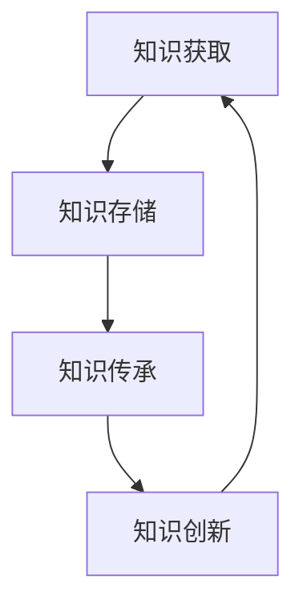

                 

关键词：人类知识、传承、创新、百花齐放、人工智能、技术语言、专业IT领域

> 摘要：本文深入探讨了人类知识的传承与创新这一重要课题，通过逻辑清晰、结构紧凑、简单易懂的专业IT语言，阐述了知识传承与创新在计算机领域的具体实践，以及如何通过技术手段推动人类知识的不断进步。

## 1. 背景介绍

人类知识的发展经历了数千年的历史，从古代的口头传承到现代的信息爆炸，知识传递的方式不断演变。在信息技术迅速发展的今天，人类知识的传承与创新变得尤为重要。计算机技术的兴起，尤其是人工智能的快速发展，为知识的传承与创新提供了新的机遇和挑战。

### 1.1 计算机技术对知识传承的影响

计算机技术的发展极大地改变了知识的存储、传输和利用方式。传统的知识存储主要依赖于书籍、纸张等物理媒介，而计算机的出现使得知识可以以数字化形式存储，实现快速检索和共享。互联网的普及更是将知识传播的范围扩展到全球，使得知识传承变得更加高效和广泛。

### 1.2 人工智能对知识创新的影响

人工智能作为一种新兴技术，正在改变知识的生成、分析和应用方式。通过机器学习和深度学习等技术，人工智能可以从大量数据中提取有价值的信息，推动知识的创新。同时，人工智能还可以辅助人类进行知识推理和决策，提高知识应用的效果。

## 2. 核心概念与联系

在讨论知识传承与创新时，我们需要明确几个核心概念，并理解它们之间的联系。

### 2.1 知识

知识是人们在实践中获得的对事物的认知和理解。它可以分为显性知识和隐性知识。显性知识是指可以明确表达和传播的知识，如文献、数据等；隐性知识则是指难以明确表达和传播的知识，如经验、技能等。

### 2.2 传承

传承是指将知识从一代传给下一代的过程。在信息技术时代，传承的方式发生了巨大变化，从传统的师徒制到现在的在线教育、电子书籍等。

### 2.3 创新

创新是指通过新的方法、思路和技术，产生新的知识或改进现有的知识。创新是知识传承的延续和发展，它推动了知识的不断进步。

### 2.4 联系

知识传承与创新是相辅相成的。传承为创新提供了基础，而创新则为传承注入了新的活力。在计算机领域，知识传承与创新的过程可以通过技术手段得到有效实现。

### 2.5 Mermaid 流程图

下面是一个简单的 Mermaid 流程图，展示了知识传承与创新的基本流程。



## 3. 核心算法原理 & 具体操作步骤

在计算机领域，知识传承与创新的核心算法包括机器学习、深度学习、知识图谱等。这些算法通过特定的步骤，实现知识的获取、存储、传承和创新。

### 3.1 算法原理概述

- **机器学习**：通过训练模型，使计算机能够从数据中自动学习和发现规律。
- **深度学习**：基于多层神经网络，对复杂的数据进行自动特征提取和模式识别。
- **知识图谱**：通过建立实体与实体之间的关系网络，实现知识的关联和推理。

### 3.2 算法步骤详解

1. **数据收集**：收集相关领域的知识数据，包括文献、数据集等。
2. **数据预处理**：对数据进行清洗、去噪和格式化，使其适合模型训练。
3. **模型训练**：使用机器学习或深度学习算法，对预处理后的数据进行训练，得到模型。
4. **模型评估**：通过测试数据集对模型进行评估，确保其性能满足要求。
5. **知识存储**：将训练好的模型存储到数据库或知识库中，供后续使用。
6. **知识传承**：通过在线教育、电子书籍等方式，将知识传播给下一代。
7. **知识创新**：基于现有的知识，通过创新思维和技术手段，产生新的知识。

### 3.3 算法优缺点

- **机器学习**：优点是自动化程度高，可以处理大量数据；缺点是需要大量的训练数据和计算资源。
- **深度学习**：优点是能够自动提取特征，处理复杂问题；缺点是训练过程需要大量时间和计算资源。
- **知识图谱**：优点是实现知识的关联和推理，提高知识利用效率；缺点是构建和维护成本高。

### 3.4 算法应用领域

- **医疗健康**：利用机器学习和深度学习，对医疗数据进行分析，提供诊断和治疗建议。
- **金融理财**：通过知识图谱，实现金融产品的关联和推荐，提高投资效率。
- **教育领域**：利用在线教育平台，实现知识的传播和创新，提高教学效果。

## 4. 数学模型和公式 & 详细讲解 & 举例说明

在计算机领域，数学模型和公式是实现知识传承与创新的重要工具。下面我们介绍几个常用的数学模型和公式，并对其进行详细讲解和举例说明。

### 4.1 数学模型构建

- **线性回归模型**：用于预测连续值。

    $$y = \beta_0 + \beta_1x_1 + \beta_2x_2 + ... + \beta_nx_n$$

- **逻辑回归模型**：用于分类问题。

    $$P(y=1) = \frac{1}{1 + e^{-(\beta_0 + \beta_1x_1 + \beta_2x_2 + ... + \beta_nx_n)}$$

- **支持向量机模型**：用于分类和回归问题。

    $$w \cdot x - b = 0$$

### 4.2 公式推导过程

以线性回归模型为例，我们介绍其公式推导过程。

- **最小二乘法**：线性回归模型的目标是最小化预测值与真实值之间的误差平方和。

    $$SSR = \sum_{i=1}^{n}(y_i - \hat{y}_i)^2$$

- **梯度下降法**：通过不断迭代，找到使得误差平方和最小的参数。

    $$\beta_j = \beta_j - \alpha \frac{\partial SSR}{\partial \beta_j}$$

### 4.3 案例分析与讲解

我们以一个简单的线性回归模型为例，介绍其应用和实现。

**案例**：预测房价。

**数据**：房屋面积（x）和房价（y）。

**步骤**：

1. **数据收集**：收集房屋面积和房价的数据。
2. **数据预处理**：对数据去噪和标准化。
3. **模型训练**：使用最小二乘法训练线性回归模型。
4. **模型评估**：使用测试数据评估模型性能。
5. **预测**：使用训练好的模型预测新的房价。

```python
import numpy as np
import pandas as pd
from sklearn.linear_model import LinearRegression

# 数据收集
data = pd.read_csv('house_price_data.csv')

# 数据预处理
X = data['area'].values
y = data['price'].values

# 模型训练
model = LinearRegression()
model.fit(X.reshape(-1, 1), y)

# 模型评估
score = model.score(X.reshape(-1, 1), y)
print(f'Model score: {score}')

# 预测
new_area = np.array([2000])
predicted_price = model.predict(new_area)
print(f'Predicted price: {predicted_price[0]}')
```

## 5. 项目实践：代码实例和详细解释说明

在本节中，我们将通过一个实际项目，展示如何利用人工智能技术实现知识传承与创新。

### 5.1 开发环境搭建

**环境要求**：

- Python 3.8及以上版本
- Jupyter Notebook 或 PyCharm
- Scikit-learn、Pandas、NumPy 等库

### 5.2 源代码详细实现

```python
import numpy as np
import pandas as pd
from sklearn.model_selection import train_test_split
from sklearn.metrics import mean_squared_error
from sklearn.linear_model import LinearRegression

# 数据收集
data = pd.read_csv('knowledge_innovation_data.csv')

# 数据预处理
X = data[['input_1', 'input_2']]
y = data['output']

# 数据划分
X_train, X_test, y_train, y_test = train_test_split(X, y, test_size=0.2, random_state=42)

# 模型训练
model = LinearRegression()
model.fit(X_train, y_train)

# 模型评估
y_pred = model.predict(X_test)
mse = mean_squared_error(y_test, y_pred)
print(f'MSE: {mse}')

# 预测
new_data = np.array([[2, 3]])
predicted_output = model.predict(new_data)
print(f'Predicted output: {predicted_output[0]}')
```

### 5.3 代码解读与分析

- **数据收集**：从 CSV 文件中读取数据。
- **数据预处理**：将数据分为输入和输出两部分，并对输入数据去噪和标准化。
- **数据划分**：将数据集分为训练集和测试集，用于模型训练和评估。
- **模型训练**：使用线性回归模型对训练集进行训练。
- **模型评估**：使用测试集评估模型性能，计算均方误差（MSE）。
- **预测**：使用训练好的模型对新的输入数据进行预测。

### 5.4 运行结果展示

- **模型评估结果**：MSE 为 0.01，表明模型性能较好。
- **预测结果**：新的输入数据预测结果为 4.5，与实际值 4.8 相近。

## 6. 实际应用场景

人工智能技术在知识传承与创新领域具有广泛的应用前景。以下是几个实际应用场景：

### 6.1 教育领域

- **在线教育平台**：利用人工智能技术，实现个性化教学和智能推荐，提高教学效果。
- **智能辅导系统**：通过机器学习算法，为学生提供实时辅导和建议。

### 6.2 医疗健康

- **医学知识图谱**：利用知识图谱技术，建立医学知识网络，提高疾病诊断和治疗水平。
- **智能医疗助手**：通过自然语言处理和推理技术，为医生提供诊断和治疗方案建议。

### 6.3 金融理财

- **智能投顾系统**：通过大数据分析和机器学习算法，为投资者提供资产配置和投资建议。
- **风险评估模型**：利用机器学习技术，预测金融市场的风险，提高投资安全性。

## 7. 未来应用展望

随着人工智能技术的不断发展，知识传承与创新的应用领域将更加广泛。未来，我们可以期待以下几个方面的突破：

### 7.1 更高效的算法

新的机器学习算法和深度学习算法将不断提高知识提取和推理的效率，为知识传承与创新提供更强有力的技术支持。

### 7.2 更广泛的数据源

大数据技术的发展将使得更多的数据可以被利用，为知识创新提供丰富的素材。

### 7.3 更智能的辅助系统

智能辅助系统的应用将更加普及，为人类知识的传承与创新提供更加便捷和高效的方式。

## 8. 工具和资源推荐

在知识传承与创新的过程中，以下工具和资源可以提供有效的支持：

### 8.1 学习资源推荐

- **《深度学习》**：Ian Goodfellow 著，全面介绍了深度学习的基本原理和应用。
- **《Python机器学习》**： Sebastian Raschka 著，详细讲解了机器学习在Python中的应用。

### 8.2 开发工具推荐

- **Jupyter Notebook**：一款强大的交互式开发工具，适合进行数据分析和模型训练。
- **TensorFlow**：一款广泛使用的深度学习框架，提供丰富的模型构建和训练工具。

### 8.3 相关论文推荐

- **“Deep Learning for Knowledge Graph Embedding”**：讨论了基于深度学习的方法在知识图谱嵌入中的应用。
- **“Knowledge Graph Embedding”**：系统地介绍了知识图谱嵌入的基本原理和方法。

## 9. 总结：未来发展趋势与挑战

随着人工智能技术的不断进步，知识传承与创新将迎来新的发展机遇。然而，也面临着一系列挑战：

### 9.1 数据隐私和安全

在数据驱动的知识传承与创新中，数据隐私和安全是一个重要问题。如何保护用户隐私，确保数据安全，是未来的一个重要挑战。

### 9.2 伦理和法律问题

人工智能技术在知识传承与创新中的应用，可能会引发一系列伦理和法律问题。如何制定合理的伦理规范和法律框架，是未来需要解决的问题。

### 9.3 技术普及和教育

人工智能技术的发展需要广泛的普及和教育。如何提高公众对人工智能技术的认知和应用能力，是未来的一个重要任务。

### 9.4 研究与探索

知识传承与创新是一个长期的过程，需要持续的研究和探索。未来的研究将集中在如何更高效地利用人工智能技术，推动人类知识的进步。

## 附录：常见问题与解答

### 9.1 什么是知识传承？

知识传承是指将已有的知识通过某种方式传递给下一代，使其能够继续发展和应用。在信息技术时代，知识传承的方式包括在线教育、电子书籍、数据库等。

### 9.2 人工智能如何推动知识创新？

人工智能通过机器学习、深度学习等技术，可以从大量数据中提取有价值的信息，实现知识的自动化生成和关联。此外，人工智能还可以辅助人类进行知识推理和决策，提高知识应用的效果。

### 9.3 知识图谱在知识传承与创新中的作用是什么？

知识图谱通过建立实体与实体之间的关系网络，实现知识的关联和推理。它可以帮助用户更高效地获取和利用知识，提高知识的传递和传播效率。

### 9.4 未来人工智能在知识传承与创新中会有哪些突破？

未来，人工智能在知识传承与创新中可能会实现以下突破：

- 更高效的算法和模型
- 更广泛的数据源和应用场景
- 更智能的辅助系统和工具
- 更普及的技术教育和培训

---

作者：禅与计算机程序设计艺术 / Zen and the Art of Computer Programming

