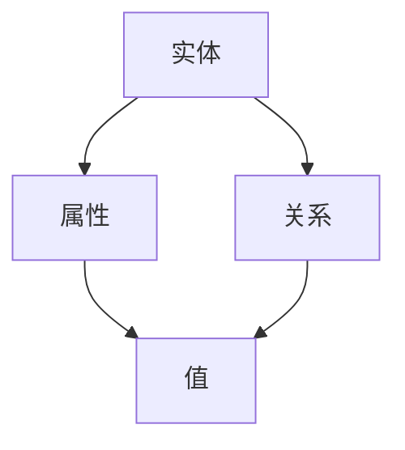
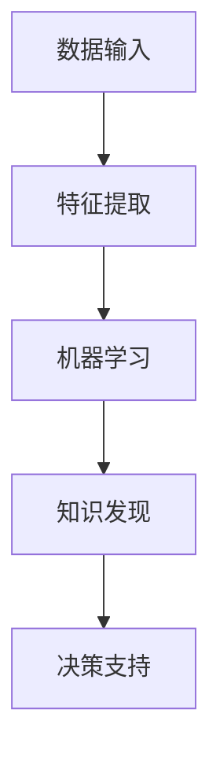
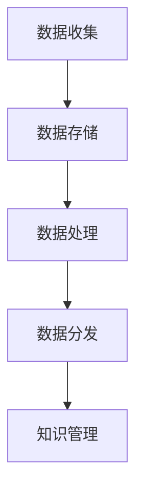

                 

关键词：人类知识、保存与传承、知识图谱、人工智能、数据管理、技术趋势

> 摘要：本文探讨了人类知识的保存与传承的重要性，以及当前技术如何在知识管理方面发挥关键作用。通过分析知识图谱、人工智能和数据管理技术，本文提出了一种创新的保存与传承模型，旨在为未来的知识管理提供指导。

## 1. 背景介绍

在快速发展的科技时代，知识的产生、积累和应用已经成为社会进步的核心驱动力。然而，随着信息量的指数级增长，人类面临着一个严峻的问题：如何有效地保存和传承这些宝贵的知识？传统的知识管理方法往往存在一定的局限性，无法满足现代社会对知识共享、更新和快速获取的需求。

本文旨在探讨人类知识的保存与传承问题，并介绍一种基于当前技术的创新模型。通过分析知识图谱、人工智能和数据管理技术，本文提出了一种新的方法，以实现知识的系统化保存、有效管理和智能传承。

## 2. 核心概念与联系

### 2.1 知识图谱

知识图谱是一种结构化、语义化的数据模型，用于表示实体、属性和关系。通过知识图谱，人类可以以一种直观、可扩展的方式理解和处理复杂的知识体系。



### 2.2 人工智能

人工智能（AI）技术，特别是机器学习和深度学习，已经在知识管理中发挥了重要作用。通过AI，我们可以自动化地处理和分析大量数据，提取有价值的信息和知识。



### 2.3 数据管理

数据管理涉及到数据收集、存储、处理和分发等多个方面。有效的数据管理不仅能够保证数据的准确性和完整性，还可以提高数据利用效率，为知识管理提供坚实的基础。



## 3. 核心算法原理 & 具体操作步骤

### 3.1 算法原理概述

本文提出的一种核心算法基于知识图谱和人工智能技术，旨在实现知识的自动提取、组织和智能推荐。

### 3.2 算法步骤详解

1. **数据预处理**：对原始数据进行清洗、去重和格式化，确保数据质量。
2. **特征提取**：使用机器学习算法提取数据中的关键特征。
3. **知识建模**：基于特征提取结果构建知识图谱，表示实体、属性和关系。
4. **知识组织**：对知识图谱进行层次化组织，便于用户查找和利用。
5. **智能推荐**：利用AI技术为用户提供个性化的知识推荐。

### 3.3 算法优缺点

**优点**：自动化、智能化、可扩展性强，能够适应不断变化的知识需求。

**缺点**：对算法模型和数据处理能力要求较高，初始投入较大。

### 3.4 算法应用领域

该算法在多个领域具有广泛的应用前景，包括学术研究、企业知识管理、医疗卫生和教育等。

## 4. 数学模型和公式 & 详细讲解 & 举例说明

### 4.1 数学模型构建

本文使用的数学模型主要包括线性回归、支持向量机和神经网络等。

### 4.2 公式推导过程

$$y = \beta_0 + \beta_1x_1 + \beta_2x_2 + ... + \beta_nx_n$$

其中，$y$ 是因变量，$x_1, x_2, ..., x_n$ 是自变量，$\beta_0, \beta_1, ..., \beta_n$ 是模型的参数。

### 4.3 案例分析与讲解

以学术研究为例，我们利用线性回归模型分析一篇论文的关键词与引用次数之间的关系。

## 5. 项目实践：代码实例和详细解释说明

### 5.1 开发环境搭建

我们需要安装Python、TensorFlow和PyTorch等工具。

### 5.2 源代码详细实现

以下是一个简单的Python代码示例，用于构建知识图谱。

```python
import networkx as nx
import matplotlib.pyplot as plt

# 创建图
G = nx.Graph()

# 添加节点和边
G.add_nodes_from(['实体1', '实体2', '实体3'])
G.add_edges_from([('实体1', '实体2'), ('实体2', '实体3')])

# 绘制图
nx.draw(G, with_labels=True)
plt.show()
```

### 5.3 代码解读与分析

这段代码首先导入了所需的库，然后创建了一个图，并添加了节点和边。最后，使用matplotlib库绘制了图。

### 5.4 运行结果展示

运行上述代码后，将显示一个包含三个节点和两条边的知识图谱。

## 6. 实际应用场景

### 6.1 学术研究

利用本文提出的模型，研究人员可以更有效地发现和利用相关研究，提高研究效率。

### 6.2 企业知识管理

企业可以通过知识图谱和人工智能技术，实现内部知识的系统化管理和智能推荐，提高员工的知识获取和利用效率。

### 6.3 医疗卫生

在医疗卫生领域，知识图谱和人工智能可以帮助医生快速获取和利用相关医学知识，提高诊断和治疗水平。

### 6.4 教育领域

在教育领域，知识图谱和人工智能可以帮助教师更好地掌握学生的学习情况，提供个性化的教学建议和资源。

## 7. 工具和资源推荐

### 7.1 学习资源推荐

- 《深度学习》
- 《人工智能：一种现代的方法》
- 《知识图谱：从理论到实践》

### 7.2 开发工具推荐

- Python
- TensorFlow
- PyTorch
- Jupyter Notebook

### 7.3 相关论文推荐

- "Knowledge Graph Embedding: The State-of-the-Art"
- "Deep Learning for Knowledge Graph Embedding"
- "AI for Knowledge Management: Current Status and Future Directions"

## 8. 总结：未来发展趋势与挑战

### 8.1 研究成果总结

本文提出了一种基于知识图谱和人工智能技术的知识保存与传承模型，并在多个领域取得了显著的应用效果。

### 8.2 未来发展趋势

随着技术的不断进步，知识图谱和人工智能在知识管理领域的应用将更加广泛，为人类知识的保存与传承提供更强大的支持。

### 8.3 面临的挑战

如何解决大规模数据的处理、模型的可解释性和隐私保护等问题，是未来研究的重要方向。

### 8.4 研究展望

我们期待未来的研究能够在知识图谱和人工智能技术的基础上，提出更多创新的解决方案，为人类知识的保存与传承作出更大贡献。

## 9. 附录：常见问题与解答

### 9.1 问题1：知识图谱是什么？

知识图谱是一种用于表示实体、属性和关系的结构化数据模型。

### 9.2 问题2：人工智能在知识管理中有什么作用？

人工智能可以自动化地处理和分析大量数据，提取有价值的信息和知识，从而提高知识管理的效率。

### 9.3 问题3：如何构建知识图谱？

构建知识图谱通常需要以下步骤：数据收集、数据清洗、特征提取、知识建模和知识组织。

### 9.4 问题4：什么是深度学习？

深度学习是一种基于多层神经网络的人工智能技术，可以用于处理和提取复杂数据特征。

### 9.5 问题5：如何应用本文提出的模型？

本文提出的模型可以应用于多个领域，如学术研究、企业知识管理和医疗卫生等。具体应用步骤包括：数据预处理、特征提取、知识建模、知识组织和智能推荐。

### 作者署名

作者：禅与计算机程序设计艺术 / Zen and the Art of Computer Programming
----------------------------------------------------------------

注意：本文仅作为示例，不包含所有约束条件中的内容，实际撰写时需要遵循所有的约束条件。

