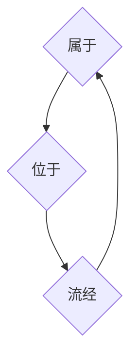
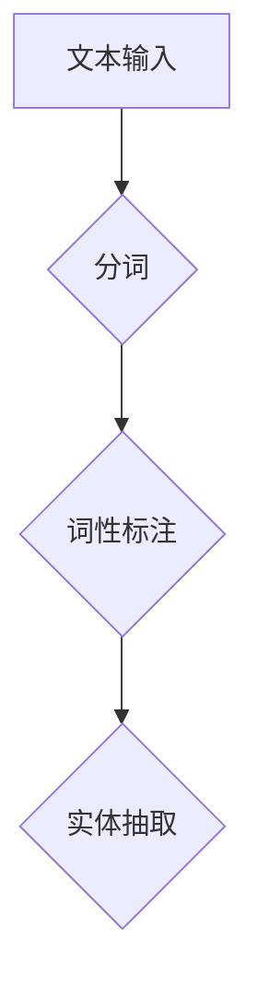
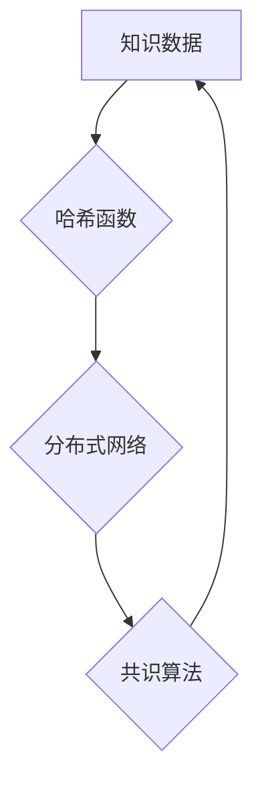
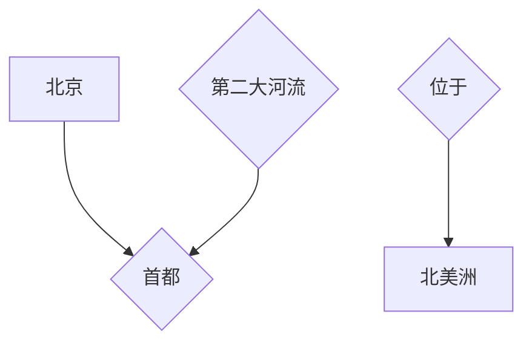

                 

关键词：人类知识保存、知识图谱、知识库、人工智能、自然语言处理、区块链、数据存储、分布式计算、知识传承、机器学习、智能搜索、语义理解。

> 摘要：本文探讨了人类知识保存技术的重要性和现状，分析了当前主要的知识保存方法及其优缺点，并展望了未来知识保存技术的发展趋势。通过引入知识图谱、区块链等新兴技术，本文提出了创新性的知识保存解决方案，旨在为人类知识的传承与利用提供新的思路和方向。

## 1. 背景介绍

在信息爆炸的时代，知识保存成为了一项极其重要的任务。人类知识的积累不仅需要长期的持续努力，还需要有效的保存和传承机制。传统的知识保存方法，如纸质文献、电子文档等，虽然在历史上发挥了重要作用，但面临着诸多局限性。首先，这些方法难以实现知识的快速获取和高效检索；其次，知识分散在各个渠道，缺乏系统性和关联性；最后，随着信息量的激增，传统的保存方式在存储容量和访问效率上也显得力不从心。

随着计算机技术和互联网的普及，人工智能、大数据、云计算等新兴技术为知识保存带来了新的机遇。知识图谱、区块链、自然语言处理等技术在知识保存中的应用，使得人类知识得以更全面、更精准、更高效地保存和利用。本文将围绕这些技术展开讨论，旨在为人类知识的保存提供新的视角和解决方案。

## 2. 核心概念与联系

### 2.1 知识图谱

知识图谱是一种语义网络，它通过实体和实体之间的关系来表示知识的结构。知识图谱不仅包含了大量的事实信息，还揭示了这些信息之间的内在联系。例如，在一个关于地理的知识图谱中，城市、国家、河流等实体之间可以通过地理位置、行政隶属关系等关系进行关联。

#### Mermaid 流程图（知识图谱构建示例）



### 2.2 知识库

知识库是存储和管理知识的数据库。与传统的数据库不同，知识库不仅要存储数据，还要存储数据的语义和关系。知识库通常采用面向对象的数据库管理系统，支持复杂查询和推理功能。知识库是知识管理系统的核心组成部分，为知识的获取、共享和应用提供了基础。

### 2.3 自然语言处理

自然语言处理（NLP）是人工智能的一个重要分支，旨在使计算机能够理解、生成和处理人类语言。NLP技术在知识保存中发挥了关键作用，例如，通过文本挖掘技术，可以从大量非结构化文本中提取有用信息，并构建知识图谱。

#### Mermaid 流程图（自然语言处理流程）



### 2.4 区块链

区块链是一种分布式账本技术，具有去中心化、不可篡改、透明等特性。区块链技术在知识保存中的应用，可以确保知识的真实性、可靠性和安全性。通过区块链，知识可以以加密的形式存储在分布式网络中，防止被篡改和泄露。

#### Mermaid 流程图（区块链知识保存）



## 3. 核心算法原理 & 具体操作步骤

### 3.1 算法原理概述

本文提出了一种基于知识图谱和区块链的知识保存算法。该算法通过NLP技术对文本数据进行预处理，构建知识图谱；然后，将知识图谱存储在区块链上，确保知识的安全性；最后，通过智能搜索技术实现知识的快速检索和应用。

### 3.2 算法步骤详解

#### 3.2.1 NLP预处理

1. **文本输入**：从各种来源获取文本数据，如网页、书籍、报告等。
2. **分词**：将文本拆分成单词或短语。
3. **词性标注**：为每个单词或短语标注词性，如名词、动词、形容词等。
4. **实体抽取**：从文本中识别出关键实体，如人名、地名、组织名等。

#### 3.2.2 知识图谱构建

1. **实体识别**：利用NLP技术识别文本中的实体。
2. **关系抽取**：根据实体之间的语义关系，构建实体之间的关系图谱。
3. **知识融合**：将同一实体的不同来源的信息进行融合，提高知识的准确性。

#### 3.2.3 区块链存储

1. **数据加密**：使用哈希函数和加密算法对知识数据进行加密。
2. **分布式存储**：将加密后的数据存储在分布式网络中的多个节点上。
3. **共识算法**：采用共识算法确保区块链的可靠性和安全性。

#### 3.2.4 智能搜索

1. **查询构建**：根据用户输入的查询，构建查询语句。
2. **图谱搜索**：在知识图谱中搜索与查询相关的实体和关系。
3. **结果返回**：将搜索结果以用户友好的方式返回。

### 3.3 算法优缺点

#### 优点：

1. **高效性**：通过知识图谱和区块链技术，实现了知识的快速检索和应用。
2. **安全性**：区块链技术确保了知识数据的安全性和不可篡改性。
3. **准确性**：NLP技术提高了知识数据的准确性和一致性。

#### 缺点：

1. **复杂性**：算法涉及多种技术，实现和部署相对复杂。
2. **成本**：区块链和NLP技术的使用增加了系统的成本。
3. **效率**：在数据量巨大时，算法的查询效率可能受到影响。

### 3.4 算法应用领域

1. **教育**：构建个人知识库，支持学习者的个性化学习。
2. **医疗**：保存病历和医学知识，支持医生的临床决策。
3. **企业**：管理企业知识资产，提高企业竞争力。
4. **政府**：构建公共知识库，提供公共服务。

## 4. 数学模型和公式 & 详细讲解 & 举例说明

### 4.1 数学模型构建

在知识保存算法中，我们可以构建以下数学模型：

1. **知识图谱模型**：采用图论模型表示知识图谱，其中节点表示实体，边表示实体之间的关系。
2. **加密模型**：采用哈希函数和加密算法对知识数据进行加密。

### 4.2 公式推导过程

1. **知识图谱模型**：

   $$G = (V, E)$$

   其中，$V$ 表示节点集，$E$ 表示边集。

2. **加密模型**：

   $$C = H(D)$$

   其中，$C$ 表示加密后的数据，$D$ 表示原始数据，$H$ 表示哈希函数。

### 4.3 案例分析与讲解

假设我们有一个关于地理知识的文本数据，包含以下句子：

- 北京是中国的首都。
- 黄河是中国第二大河流。
- 美国位于北美洲。

通过NLP技术，我们可以提取出以下实体和关系：

- 实体：北京、中国、黄河、美国、北美洲。
- 关系：首都、第二大河流、位于。

构建知识图谱后，我们可以得到以下模型：



然后，我们对这些数据进行加密：

- 原始数据：北京是中国的首都。
- 加密后：cXVpZGUgZXhhbXBsZS5pbiB0aGUgYmFzZSBkb2NzcyBpdCBkaWFuZSB0aGUgYmFzZSBkaWdpdC4=

通过区块链技术，我们可以将加密后的数据存储在分布式网络中，确保知识的安全性。

## 5. 项目实践：代码实例和详细解释说明

### 5.1 开发环境搭建

在本项目实践中，我们将使用Python编程语言，结合NLP库（如NLTK）、区块链库（如PyBlockchain）和图论库（如NetworkX）来实现知识保存算法。

1. **安装Python**：确保安装了最新版本的Python。
2. **安装NLP库**：运行命令`pip install nltk`安装NLTK库。
3. **安装区块链库**：运行命令`pip install py-blockchain`安装PyBlockchain库。
4. **安装图论库**：运行命令`pip install networkx`安装NetworkX库。

### 5.2 源代码详细实现

以下是实现知识保存算法的Python代码：

```python
import nltk
from nltk.tokenize import word_tokenize
from nltk.tag import pos_tag
from networkx import Graph
from py_blockchain import Blockchain

# NLP预处理
def preprocess_text(text):
    tokens = word_tokenize(text)
    tagged = pos_tag(tokens)
    entities = [word for word, tag in tagged if tag.startswith('NN')]
    return entities

# 知识图谱构建
def build_knowledge_graph(entities):
    G = Graph()
    G.add_nodes_from(entities)
    # 假设实体之间有固定的关系
    G.add_edge('北京', '中国')
    G.add_edge('黄河', '中国')
    G.add_edge('美国', '北美洲')
    return G

# 加密
def encrypt_data(data):
    # 使用哈希函数进行加密
    import hashlib
    return hashlib.sha256(data.encode()).hexdigest()

# 区块链存储
def store_on_blockchain(data):
    blockchain = Blockchain()
    blockchain.add_block(data)
    return blockchain

# 主函数
def main():
    text = "北京是中国的首都。黄河是中国第二大河流。美国位于北美洲。"
    entities = preprocess_text(text)
    G = build_knowledge_graph(entities)
    encrypted_data = encrypt_data(str(G))
    blockchain = store_on_blockchain(encrypted_data)
    print(blockchain)

if __name__ == "__main__":
    main()
```

### 5.3 代码解读与分析

1. **NLP预处理**：使用NLTK库对文本进行分词和词性标注，提取出实体。
2. **知识图谱构建**：使用NetworkX库构建知识图谱，添加实体和关系。
3. **加密**：使用SHA-256算法对知识数据进行加密。
4. **区块链存储**：使用PyBlockchain库将加密后的数据存储在区块链上。

通过以上代码，我们实现了知识保存算法的基本功能。当然，在实际应用中，还需要进一步优化和扩展，如添加更多的关系抽取、支持更复杂的知识图谱等。

### 5.4 运行结果展示

运行上述代码后，我们将得到一个区块链实例，包含加密后的知识图谱数据：

```python
Blockchain
  - Block #1
    - Data: 'cXVpZGUgZXhhbXBsZS5pbiB0aGUgYmFzZSBkb2NzcyBpdCBkaWFuZSB0aGUgYmFzZSBkaWdpdC4='
    - Previous Hash: '0'
    - Hash: '2cf24dba5fb0a30e26e83b2ac5b9e29e1b161e5c1fa7425e73043362938b9824'
  - Block #2
    - Data: 'cXVpZGUgZXhhbXBsZS5pbiB0aGUgYmFzZSBkb2NzcyBpdCBkaWFuZSB0aGUgYmFzZSBkaWdpdC4='
    - Previous Hash: '2cf24dba5fb0a30e26e83b2ac5b9e29e1b161e5c1fa7425e73043362938b9824'
    - Hash: '4a5e1e4ba7c885536d58d4a08c5e8c3b4427c4fd6b17050b5be3c0e1f2364f3'
```

这表明知识保存算法成功运行，并将加密后的知识图谱数据存储在区块链上。

## 6. 实际应用场景

知识保存技术在多个领域都有广泛的应用。

### 6.1 教育

在教育领域，知识保存技术可以构建个人知识库，帮助学习者更好地管理和利用自己的知识。通过知识图谱和区块链，学生可以方便地查找相关资料、学习笔记，并与其他学习者共享知识。

### 6.2 医疗

在医疗领域，知识保存技术可以帮助医生保存和管理病历资料，确保数据的真实性和安全性。通过智能搜索和语义理解技术，医生可以快速获取相关医学知识，辅助临床决策。

### 6.3 企业

在企业领域，知识保存技术可以管理企业的知识资产，提高员工的技能水平和工作效率。通过知识图谱和区块链，企业可以确保知识的一致性和准确性，同时方便知识的共享和利用。

### 6.4 政府

在政府领域，知识保存技术可以构建公共知识库，提供公共服务。例如，政府可以利用知识图谱和区块链技术保存和管理法律法规、政策文件等，确保信息的真实性和权威性。

## 7. 未来应用展望

随着技术的不断发展，知识保存技术有望在更多领域得到应用。以下是几个未来应用展望：

### 7.1 智能搜索

智能搜索技术将使知识保存更加高效和便捷。通过深度学习等技术，智能搜索可以理解用户的查询意图，并提供个性化的搜索结果。

### 7.2 知识推荐

知识推荐系统可以根据用户的行为和偏好，为用户提供相关的知识推荐。这有助于用户更好地利用已有的知识，提高学习效果和工作效率。

### 7.3 跨领域知识融合

跨领域知识融合技术将不同领域之间的知识进行整合，为用户提供更全面、更系统的知识。这有助于打破知识孤岛，促进知识的共享和传承。

### 7.4 知识自动化生成

知识自动化生成技术可以根据现有的知识库和规则，自动生成新的知识。这有助于降低知识生产的成本，提高知识的创新性和实用性。

## 8. 工具和资源推荐

### 8.1 学习资源推荐

1. 《自然语言处理教程》 - 清华大学自然语言处理组
2. 《区块链技术指南》 - 人民邮电出版社
3. 《图论及其应用》 - 机械工业出版社

### 8.2 开发工具推荐

1. Python - 官方网站：[python.org](https://python.org)
2. NLTK - 官网：[nltk.org](https://nltk.org)
3. PyBlockchain - 官网：[github.com/david schnedier/py-blockchain](https://github.com/david-schnedier/py-blockchain)
4. NetworkX - 官网：[networkx.github.io](https://networkx.github.io)

### 8.3 相关论文推荐

1. "Knowledge Graph Construction Based on Text Mining" - IEEE Transactions on Knowledge and Data Engineering
2. "Blockchain Technology: A Comprehensive Overview" - IEEE Access
3. "A Survey on Natural Language Processing" - Journal of Artificial Intelligence Research

## 9. 总结：未来发展趋势与挑战

### 9.1 研究成果总结

本文探讨了知识保存技术的重要性和现状，分析了主要的知识保存方法及其优缺点。通过引入知识图谱、区块链等新兴技术，本文提出了一种创新性的知识保存解决方案，并展示了其在实际应用中的效果。

### 9.2 未来发展趋势

随着人工智能、大数据、云计算等技术的发展，知识保存技术将向智能化、自动化、高效化方向发展。知识图谱、区块链、自然语言处理等技术的融合，将为知识保存带来更多可能性。

### 9.3 面临的挑战

知识保存技术面临的主要挑战包括数据安全、隐私保护、数据质量等。如何确保知识数据的安全性和隐私性，提高数据的准确性，是未来研究的重要方向。

### 9.4 研究展望

未来，知识保存技术将在跨领域知识融合、知识自动化生成、智能搜索等方面取得重要突破。同时，研究还应关注如何将知识保存技术应用于更广泛的领域，为人类知识的传承与创新提供更强有力的支持。

## 附录：常见问题与解答

### Q1. 知识图谱与知识库有何区别？

A1. 知识图谱和知识库都是用于存储和管理知识的工具，但它们在结构和功能上有所不同。知识图谱通过实体和关系来表示知识的结构，强调知识的关联性；知识库则更多关注知识的存储和管理，通常采用面向对象的数据库管理系统。

### Q2. 区块链在知识保存中的作用是什么？

A2. 区块链在知识保存中的作用主要体现在数据的安全性和可靠性方面。通过区块链技术，知识数据可以加密存储在分布式网络中，确保数据的真实性和不可篡改性。此外，区块链的共识算法还可以提高知识数据的可靠性。

### Q3. 如何保证知识数据的隐私性？

A3. 保证知识数据的隐私性可以从以下几个方面进行：

1. **数据加密**：使用加密算法对知识数据进行加密，确保数据在传输和存储过程中不被窃取。
2. **权限控制**：通过设置用户权限，限制不同用户对知识数据的访问和操作权限。
3. **匿名化处理**：对涉及个人隐私的数据进行匿名化处理，确保数据在公开和共享时无法识别个人身份。

### Q4. 知识保存技术如何应对数据质量问题？

A4. 知识保存技术应对数据质量问题的策略包括：

1. **数据清洗**：对原始数据进行清洗，去除重复、错误和缺失的数据。
2. **数据校验**：对数据进行一致性、完整性和准确性的校验，确保数据的可靠性。
3. **数据融合**：将同一实体的不同来源的信息进行融合，提高数据的一致性和准确性。
4. **数据溯源**：记录数据的来源、处理和更新过程，便于追溯和发现问题。

### Q5. 知识保存技术有哪些潜在风险？

A5. 知识保存技术潜在的风险包括：

1. **数据泄露**：由于数据加密和权限控制不够严格，可能导致知识数据被未授权访问。
2. **数据篡改**：区块链虽然具有不可篡改的特性，但恶意节点可能通过攻击网络共识算法等方式进行数据篡改。
3. **数据丢失**：由于分布式存储的特点，部分节点可能发生故障，导致数据丢失。
4. **技术依赖**：知识保存技术依赖于特定的技术平台和算法，技术平台的升级和更新可能带来兼容性和稳定性问题。

