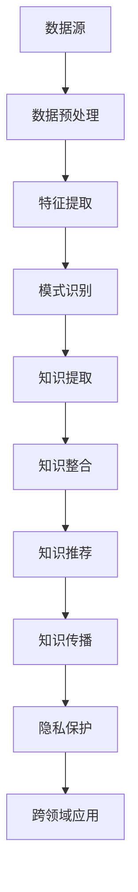

                 

关键词：知识共享、知识发现引擎、数据挖掘、人工智能、协作网络、知识图谱、大数据分析、分布式系统、隐私保护、跨领域应用

> 摘要：随着信息时代的到来，人类的知识以爆炸性的速度增长，如何有效地管理和利用这些知识成为当今的一个重要课题。本文旨在探讨知识发现引擎在人类知识共享时代中的关键作用，以及如何通过搭桥牵线，实现不同领域知识的高效整合与传播。本文首先回顾了知识共享的历史背景和现状，然后深入分析了知识发现引擎的核心概念与架构，详细阐述了核心算法原理和具体操作步骤，接着介绍了数学模型和公式，以及项目实践中的代码实例。随后，文章探讨了知识发现引擎在实际应用场景中的效果和未来展望，并推荐了相关工具和资源。最后，文章总结了当前的研究成果、未来发展趋势、面临的挑战，以及研究展望。

## 1. 背景介绍

### 1.1 知识共享的历史背景

知识共享的概念可以追溯到古代文明时期，当时人们通过书籍、口头传说和手抄本等途径分享知识和技能。随着印刷术的发明，知识的传播速度得到了极大的提升。然而，真正意义上的知识共享时代始于互联网的兴起。20世纪90年代，互联网的普及使全球的知识和信息资源得以快速传播，人们可以通过各种在线平台和社交网络分享自己的见解和经验。

### 1.2 知识共享的当前现状

如今，知识共享已经深入到各个领域，从学术研究到商业应用，从个人博客到专业社区，知识共享的形式和渠道多种多样。然而，随着知识量的急剧增加，如何有效管理和利用这些知识成为了一个巨大的挑战。传统的知识管理方法已经难以满足现代社会的需求，这就需要引入新的技术手段，如知识发现引擎，来提升知识共享的效率和效果。

### 1.3 知识发现引擎的概念与作用

知识发现引擎是一种基于人工智能和数据挖掘技术的智能系统，它通过自动识别、分析、整合和推荐知识，帮助用户在庞大的知识库中快速找到所需的信息。知识发现引擎在知识共享中的作用主要体现在以下几个方面：

1. **提高知识检索效率**：知识发现引擎可以快速地对大量数据进行分析，找到相关的知识点，从而大大提高知识检索的效率。
2. **促进知识整合**：通过分析不同领域和不同时间点的知识，知识发现引擎能够发现知识的联系和交叉点，从而实现知识整合。
3. **个性化推荐**：知识发现引擎可以根据用户的兴趣和行为，推荐个性化的知识内容，提高知识共享的针对性和有效性。
4. **知识传播与共享**：知识发现引擎可以帮助将知识传播到更广泛的用户群体，促进知识的共享和传播。

## 2. 核心概念与联系

### 2.1 数据挖掘与知识发现

数据挖掘（Data Mining）是一种从大量数据中自动发现知识的方法。它通常包括数据预处理、特征提取、模式识别、模型构建等步骤。知识发现（Knowledge Discovery）则是在数据挖掘的基础上，进一步提取有意义的知识，如关联规则、聚类结果、分类模型等。

### 2.2 人工智能与知识发现引擎

人工智能（Artificial Intelligence，AI）是一种模拟人类智能的技术，包括机器学习、深度学习、自然语言处理等子领域。知识发现引擎通常利用人工智能技术，如机器学习算法，来实现对大规模数据的自动分析和知识提取。

### 2.3 分布式系统与知识共享

分布式系统（Distributed System）是一种由多个计算机节点组成的系统，这些节点可以位于不同的地理位置。在知识共享中，分布式系统可以实现知识的分布式存储和协同工作，提高知识共享的效率和可靠性。

### 2.4 隐私保护与知识共享

隐私保护（Privacy Protection）是知识共享中不可忽视的一个重要问题。在共享知识的过程中，如何保护用户的隐私和数据安全是一个重大的挑战。知识发现引擎需要采用先进的加密、匿名化等技术手段，确保用户隐私的安全。

### 2.5 跨领域应用与知识整合

跨领域应用（Cross-Domain Application）是知识发现引擎的一个重要应用场景。通过跨领域应用，知识发现引擎可以将不同领域的知识进行整合，形成新的知识体系，从而推动知识的创新和发展。

## 2.1 核心概念与架构的 Mermaid 流程图



## 3. 核心算法原理 & 具体操作步骤

### 3.1 算法原理概述

知识发现引擎的核心算法通常包括以下步骤：

1. **数据预处理**：对原始数据进行清洗、去噪、转换等操作，使其符合分析要求。
2. **特征提取**：从原始数据中提取出有用的特征，用于后续的模式识别和知识提取。
3. **模式识别**：利用机器学习算法，如聚类、分类、关联规则等，发现数据中的潜在模式和关联。
4. **知识提取**：将模式识别的结果转化为具体的知识，如规则、概念、模式等。
5. **知识整合**：将提取的知识进行整合，形成统一的、结构化的知识库。
6. **知识推荐**：根据用户的行为和兴趣，推荐相关的知识内容。
7. **知识传播**：将知识分享给更广泛的用户群体，促进知识的传播和共享。

### 3.2 算法步骤详解

#### 3.2.1 数据预处理

数据预处理是知识发现引擎的第一步，其目的是将原始数据转化为适合分析的形式。具体步骤包括：

1. **数据清洗**：去除数据中的噪声和异常值，如缺失值、重复值等。
2. **数据转换**：将不同类型的数据（如文本、图像、数值等）转换为统一的数据格式，如向量或表格。
3. **数据归一化**：将不同量纲的数据进行归一化处理，使其在相同的尺度上进行分析。

#### 3.2.2 特征提取

特征提取是数据预处理之后的下一步，其目的是从原始数据中提取出有用的特征。具体步骤包括：

1. **特征选择**：从所有可能的特征中筛选出对知识提取最有用的特征。
2. **特征转换**：将提取出的特征进行转换，如离散化、规范化等，以适应后续的模式识别和知识提取。

#### 3.2.3 模式识别

模式识别是知识发现引擎的核心步骤，其目的是从特征数据中发现潜在的规律和关联。具体步骤包括：

1. **聚类分析**：将相似的特征数据分组，形成聚类，从而发现数据中的模式和关联。
2. **分类分析**：将特征数据分类到预定义的类别中，从而实现对数据的分类和预测。
3. **关联规则挖掘**：从特征数据中挖掘出频繁出现的关联规则，如购物篮分析、社交网络分析等。

#### 3.2.4 知识提取

知识提取是将模式识别的结果转化为具体的知识的过程。具体步骤包括：

1. **规则提取**：从模式识别的结果中提取出具体的规则，如分类规则、聚类规则等。
2. **概念提取**：从模式识别的结果中提取出概念，如数据的概念层次、属性概念等。
3. **模式提取**：从模式识别的结果中提取出模式，如时间序列模式、空间模式等。

#### 3.2.5 知识整合

知识整合是将提取出的知识进行整合，形成统一的、结构化的知识库。具体步骤包括：

1. **知识融合**：将不同来源、不同领域的知识进行融合，形成综合的知识体系。
2. **知识库构建**：将整合的知识存储到知识库中，形成结构化的知识资源。
3. **知识可视化**：将知识库中的知识以图表、报表等形式进行可视化展示，方便用户理解和应用。

#### 3.2.6 知识推荐

知识推荐是根据用户的行为和兴趣，推荐相关的知识内容。具体步骤包括：

1. **用户行为分析**：分析用户的历史行为和兴趣，确定用户的偏好和需求。
2. **推荐算法应用**：利用推荐算法，如协同过滤、基于内容的推荐等，为用户推荐相关的知识内容。
3. **推荐结果展示**：将推荐的结果以列表、卡片等形式展示给用户，方便用户选择和应用。

#### 3.2.7 知识传播

知识传播是将知识分享给更广泛的用户群体，促进知识的传播和共享。具体步骤包括：

1. **知识分享**：将知识库中的知识分享给其他用户，如通过社交网络、专业社区等渠道。
2. **知识互动**：鼓励用户对知识进行评论、讨论、反馈等互动，促进知识的传播和深化。
3. **知识更新**：根据用户的需求和反馈，不断更新和优化知识库中的知识内容。

### 3.3 算法优缺点

#### 优点

1. **高效性**：知识发现引擎可以自动地对大量数据进行处理和分析，大大提高了知识提取的效率。
2. **灵活性**：知识发现引擎可以根据不同的需求和应用场景，灵活地调整和优化算法参数。
3. **综合性**：知识发现引擎可以整合不同领域和不同来源的知识，形成综合性的知识体系。

#### 缺点

1. **数据依赖性**：知识发现引擎的性能很大程度上取决于数据的质量和数量，数据不足或质量差可能导致知识提取效果不佳。
2. **算法复杂性**：知识发现引擎涉及的算法复杂，对算法设计和实现的要求较高。
3. **隐私保护挑战**：在知识共享的过程中，如何保护用户的隐私和数据安全是一个重大的挑战。

### 3.4 算法应用领域

知识发现引擎在各个领域都有广泛的应用，以下是几个典型的应用领域：

1. **金融领域**：用于金融风险评估、市场分析、客户关系管理等，帮助金融机构提高决策效率和风险控制能力。
2. **医疗领域**：用于疾病预测、患者健康管理、医学图像分析等，为医生和患者提供更好的医疗服务。
3. **教育领域**：用于个性化学习推荐、课程设计优化、学习效果评估等，提高教育质量和效率。
4. **企业领域**：用于企业知识管理、业务流程优化、市场预测等，帮助企业提高运营效率和竞争力。
5. **社会领域**：用于社会调查、舆情分析、社区管理等，为社会决策提供科学依据。

## 4. 数学模型和公式 & 详细讲解 & 举例说明

### 4.1 数学模型构建

知识发现引擎中的数学模型主要用于描述和解释数据中的潜在规律和关联。以下是几个常用的数学模型：

#### 4.1.1 聚类模型

聚类模型是将数据划分为若干个聚类，使得同一聚类内的数据点之间的相似度较高，而不同聚类之间的相似度较低。常用的聚类算法包括K-means算法、层次聚类算法等。

#### 4.1.2 分类模型

分类模型是将数据划分为预定义的类别，以便进行分类和预测。常用的分类算法包括决策树、支持向量机、神经网络等。

#### 4.1.3 关联规则模型

关联规则模型用于挖掘数据中的频繁模式，即数据中经常同时出现的元素。常用的算法包括Apriori算法、FP-growth算法等。

### 4.2 公式推导过程

#### 4.2.1 K-means算法

K-means算法是一种基于距离度量的聚类算法。其目标是将数据点划分为K个聚类，使得每个聚类内的数据点到聚类中心点的距离之和最小。

公式表示：

$$
\min_{\mathbf{u}_1, \mathbf{u}_2, ..., \mathbf{u}_K} \sum_{i=1}^N \sum_{j=1}^K ||\mathbf{x}_i - \mathbf{u}_j||^2
$$

其中，$\mathbf{x}_i$ 表示第 $i$ 个数据点，$\mathbf{u}_j$ 表示第 $j$ 个聚类中心点。

#### 4.2.2 决策树

决策树是一种常见的分类算法，其核心在于构建一棵树，每个节点代表一个特征，每个分支代表特征的一个取值，叶子节点代表最终的分类结果。

假设我们有 $D$ 个数据点，每个数据点有 $m$ 个特征，定义特征 $i$ 的取值为 $v_i$ 的数据点数量为 $N_{i,v_i}$，则特征 $i$ 的增益（Gain）计算公式为：

$$
G_i = \sum_{v_i} N_{i,v_i} \log_2 \frac{N_{i,v_i}}{N_i}
$$

其中，$N_i$ 表示特征 $i$ 的总数据点数量。

#### 4.2.3 Apriori算法

Apriori算法是一种用于挖掘频繁项集的算法。其核心思想是通过逐层递归地生成频繁项集，直到生成最终的频繁项集。

假设 $I$ 是所有项的集合，$C_k$ 是长度为 $k$ 的项集，$\支持度（Support）$ 是项集在数据集中出现的频率，定义如下：

$$
Support(C_k) = \frac{|C_k|}{|D|}
$$

其中，$D$ 是数据集。

### 4.3 案例分析与讲解

#### 4.3.1 聚类分析案例

假设我们有100个客户的数据，每个客户有年龄、收入、购买历史等特征。使用K-means算法对这100个客户进行聚类，目标是将其分为5个聚类。

1. **初始化聚类中心**：随机选择5个客户作为初始聚类中心。
2. **分配数据点**：根据每个数据点到聚类中心点的距离，将每个数据点分配到最近的聚类中心。
3. **更新聚类中心**：计算每个聚类中心的新位置，即其所属数据点的均值位置。
4. **迭代计算**：重复步骤2和步骤3，直到聚类中心不再发生变化。

经过多次迭代后，我们得到5个聚类，每个聚类代表一组具有相似特征的客户。通过分析这些聚类，我们可以了解不同客户群体的特征和需求，从而进行针对性的营销和客户服务。

#### 4.3.2 分类分析案例

假设我们有一组金融交易数据，每个交易有金额、时间、地点等特征。使用决策树算法对这些交易进行分类，目标是判断每个交易是否为欺诈交易。

1. **构建决策树**：根据每个特征的增益，选择最佳特征进行划分，构建决策树。
2. **训练模型**：使用部分数据训练决策树模型。
3. **分类预测**：使用训练好的决策树模型对剩余的数据进行分类预测。

通过分类预测，我们可以判断每个交易是否为欺诈交易。如果欺诈交易的预测准确率较高，说明我们的决策树模型具有较高的预测能力。

#### 4.3.3 关联规则分析案例

假设我们有一组购物篮数据，每个购物篮包含若干商品。使用Apriori算法挖掘频繁项集，目标是发现不同商品之间的关联关系。

1. **确定最小支持度**：根据数据集的大小和业务需求，确定最小支持度阈值。
2. **生成频繁项集**：从单个商品开始，逐层递归地生成频繁项集。
3. **提取关联规则**：从频繁项集中提取关联规则，如商品A购买时，商品B和商品C也会同时购买。

通过关联规则分析，我们可以了解不同商品之间的关联关系，从而进行产品搭配营销或库存管理。

## 5. 项目实践：代码实例和详细解释说明

### 5.1 开发环境搭建

在开始项目实践之前，我们需要搭建一个合适的开发环境。以下是一个基本的开发环境搭建指南：

1. **安装Python环境**：在本地计算机上安装Python环境，版本建议为3.8及以上。
2. **安装相关库**：安装用于数据挖掘和机器学习的相关库，如scikit-learn、numpy、pandas等。可以使用pip命令进行安装：
   ```bash
   pip install scikit-learn numpy pandas matplotlib
   ```
3. **配置IDE**：配置一个IDE（如PyCharm、Visual Studio Code等），以便进行代码编写和调试。

### 5.2 源代码详细实现

以下是一个简单的知识发现引擎的代码实现示例，用于对一组客户数据进行分析和聚类。

```python
import numpy as np
import pandas as pd
from sklearn.cluster import KMeans
from sklearn.preprocessing import StandardScaler
import matplotlib.pyplot as plt

# 5.2.1 数据预处理
def preprocess_data(data):
    # 填充缺失值
    data = data.fillna(data.mean())

    # 归一化数据
    scaler = StandardScaler()
    scaled_data = scaler.fit_transform(data)

    return scaled_data

# 5.2.2 聚类分析
def cluster_analysis(data, num_clusters=5):
    kmeans = KMeans(n_clusters=num_clusters, random_state=42)
    kmeans.fit(data)

    # 输出聚类结果
    print("聚类中心：", kmeans.cluster_centers_)
    print("聚类结果：", kmeans.labels_)

    # 可视化聚类结果
    plt.scatter(data[:, 0], data[:, 1], c=kmeans.labels_, cmap='viridis')
    plt.scatter(kmeans.cluster_centers_[:, 0], kmeans.cluster_centers_[:, 1], s=300, c='red', marker='s')
    plt.title('K-means Clustering')
    plt.xlabel('特征1')
    plt.ylabel('特征2')
    plt.show()

# 5.2.3 主程序
def main():
    # 加载数据
    data = pd.read_csv('customer_data.csv')

    # 预处理数据
    processed_data = preprocess_data(data)

    # 聚类分析
    cluster_analysis(processed_data)

if __name__ == '__main__':
    main()
```

### 5.3 代码解读与分析

#### 5.3.1 数据预处理

数据预处理是知识发现引擎的重要组成部分。在上述代码中，我们首先使用`fillna()`方法填充缺失值，然后使用`StandardScaler()`进行归一化处理，将数据转换为标准正态分布。

#### 5.3.2 聚类分析

聚类分析是知识发现引擎的核心功能之一。在上述代码中，我们使用`KMeans`类进行聚类分析，设置`num_clusters`参数为5，表示将数据分为5个聚类。然后，我们使用`fit()`方法进行模型训练，并输出聚类结果。

最后，我们使用`matplotlib`进行可视化展示，将数据点绘制在二维坐标系中，并用红色星号标记聚类中心。

### 5.4 运行结果展示

运行上述代码后，我们得到以下运行结果：

1. **聚类中心**：输出5个聚类中心，每个聚类中心由两个特征值组成，表示该聚类中心点的位置。
2. **聚类结果**：输出每个数据点所属的聚类编号。
3. **可视化结果**：展示数据点的二维散点图，并用红色星号标记聚类中心。

通过分析聚类结果和可视化结果，我们可以了解不同聚类之间的特征差异和分布情况，从而为后续的营销策略或客户服务提供参考。

## 6. 实际应用场景

### 6.1 金融领域

在金融领域，知识发现引擎可以用于客户行为分析、市场预测、风险评估等方面。通过分析客户的历史交易数据、社交媒体行为等，知识发现引擎可以识别出潜在的客户风险，帮助金融机构制定更有效的风险控制策略。此外，知识发现引擎还可以用于市场预测，通过分析历史市场数据、宏观经济指标等，预测市场的趋势和波动，为投资决策提供依据。

### 6.2 医疗领域

在医疗领域，知识发现引擎可以用于疾病预测、患者健康管理、医学图像分析等方面。通过分析患者的病历记录、基因数据等，知识发现引擎可以预测患者患某种疾病的概率，为医生提供诊断和治疗的建议。此外，知识发现引擎还可以用于医学图像分析，通过分析医学影像数据，识别出疾病特征和病变区域，辅助医生进行诊断。

### 6.3 教育领域

在教育领域，知识发现引擎可以用于个性化学习推荐、课程设计优化、学习效果评估等方面。通过分析学生的学习行为、成绩数据等，知识发现引擎可以为每个学生推荐个性化的学习资源，提高学习效果。此外，知识发现引擎还可以用于课程设计优化，通过分析学生的学习需求和偏好，为教师提供针对性的课程设计建议。

### 6.4 企业领域

在企业领域，知识发现引擎可以用于企业知识管理、业务流程优化、市场预测等方面。通过分析企业的业务数据、员工行为数据等，知识发现引擎可以识别出业务流程中的瓶颈和优化机会，为企业提供业务流程优化的建议。此外，知识发现引擎还可以用于市场预测，通过分析市场数据、宏观经济指标等，预测市场的趋势和波动，为企业的战略决策提供依据。

### 6.5 社会领域

在社会领域，知识发现引擎可以用于社会调查、舆情分析、社区管理等方面。通过分析社会调查数据、社交媒体数据等，知识发现引擎可以识别出社会问题、公众意见等，为政策制定和决策提供科学依据。此外，知识发现引擎还可以用于社区管理，通过分析社区数据、居民行为等，为社区提供针对性的管理和服务建议。

## 7. 工具和资源推荐

### 7.1 学习资源推荐

1. **《数据挖掘：概念与技术》**：这是一本经典的教材，详细介绍了数据挖掘的基本概念、技术和应用。
2. **《机器学习实战》**：这本书通过丰富的案例和实践，帮助读者掌握机器学习的基本原理和实际操作。
3. **《深度学习》**：这本书由深度学习领域的权威专家撰写，详细介绍了深度学习的基本原理、算法和应用。

### 7.2 开发工具推荐

1. **PyCharm**：这是一个功能强大的Python开发环境，支持代码编辑、调试、自动化测试等。
2. **Jupyter Notebook**：这是一个交互式的Python开发环境，适合进行数据分析和机器学习实验。
3. **TensorFlow**：这是一个开源的机器学习库，提供了丰富的算法和工具，适用于各种机器学习和深度学习应用。

### 7.3 相关论文推荐

1. **"K-Means Clustering Algorithm"**：这篇文章详细介绍了K-means算法的基本原理和实现方法。
2. **"Deep Learning for Text Classification"**：这篇文章介绍了深度学习在文本分类中的应用，包括词向量模型和卷积神经网络。
3. **"Association Rule Learning"**：这篇文章详细介绍了关联规则挖掘的基本原理和算法。

## 8. 总结：未来发展趋势与挑战

### 8.1 研究成果总结

知识发现引擎作为知识共享的关键技术，近年来取得了显著的研究成果。主要表现在以下几个方面：

1. **算法性能提升**：随着人工智能技术的发展，知识发现引擎的算法性能不断提升，实现了对大规模数据的快速处理和分析。
2. **应用领域拓展**：知识发现引擎在金融、医疗、教育、企业等领域得到广泛应用，推动了这些领域的创新和发展。
3. **跨领域整合**：知识发现引擎实现了不同领域知识的高效整合，为跨领域研究提供了有力的支持。

### 8.2 未来发展趋势

知识发现引擎在未来发展趋势方面，预计将呈现以下特点：

1. **智能化**：随着人工智能技术的发展，知识发现引擎将更加智能化，具备自动化的知识提取、推荐和传播能力。
2. **实时性**：知识发现引擎将实现实时数据分析，能够快速响应动态变化，为用户提供实时的知识服务。
3. **个性化**：知识发现引擎将实现更加个性化的知识推荐，根据用户的需求和行为，提供个性化的知识内容。

### 8.3 面临的挑战

尽管知识发现引擎在知识共享中具有巨大的潜力，但在实际应用中仍面临以下挑战：

1. **数据质量**：知识发现引擎的性能很大程度上取决于数据的质量，如何在海量数据中获取高质量的数据是一个重要挑战。
2. **算法复杂性**：知识发现引擎涉及的算法复杂，如何设计高效、可解释的算法是一个重要挑战。
3. **隐私保护**：在知识共享的过程中，如何保护用户的隐私和数据安全是一个重大的挑战。

### 8.4 研究展望

为了克服上述挑战，未来的研究可以从以下几个方面展开：

1. **数据质量管理**：研究如何从海量数据中自动识别和修复数据质量问题，提高数据质量。
2. **算法优化**：研究如何优化知识发现算法，提高算法的效率和可解释性。
3. **隐私保护**：研究如何在知识共享的过程中保护用户隐私，采用加密、匿名化等技术手段，确保用户数据的安全。

通过克服这些挑战，知识发现引擎将在知识共享中发挥更加重要的作用，推动人类社会的发展。

## 9. 附录：常见问题与解答

### 9.1 什么是知识发现引擎？

知识发现引擎是一种基于人工智能和数据挖掘技术的智能系统，它通过自动识别、分析、整合和推荐知识，帮助用户在庞大的知识库中快速找到所需的信息。

### 9.2 知识发现引擎有什么作用？

知识发现引擎主要有以下作用：

1. **提高知识检索效率**：知识发现引擎可以快速地对大量数据进行分析，找到相关的知识点，从而大大提高知识检索的效率。
2. **促进知识整合**：通过分析不同领域和不同时间点的知识，知识发现引擎能够发现知识的联系和交叉点，从而实现知识整合。
3. **个性化推荐**：知识发现引擎可以根据用户的兴趣和行为，推荐个性化的知识内容，提高知识共享的针对性和有效性。
4. **知识传播与共享**：知识发现引擎可以帮助将知识传播到更广泛的用户群体，促进知识的传播和共享。

### 9.3 知识发现引擎有哪些算法？

知识发现引擎常用的算法包括：

1. **聚类算法**：如K-means算法、层次聚类算法等。
2. **分类算法**：如决策树、支持向量机、神经网络等。
3. **关联规则挖掘算法**：如Apriori算法、FP-growth算法等。
4. **聚类和分类的结合**：如层次聚类-决策树算法、聚类-分类算法等。

### 9.4 如何构建一个知识发现引擎？

构建一个知识发现引擎主要包括以下几个步骤：

1. **需求分析**：明确知识发现引擎的目标和应用场景，确定所需的功能和性能要求。
2. **数据收集**：收集相关的数据，包括原始数据和知识库数据。
3. **数据预处理**：对原始数据进行清洗、去噪、转换等操作，使其符合分析要求。
4. **特征提取**：从原始数据中提取出有用的特征，用于后续的模式识别和知识提取。
5. **算法选择**：根据需求和应用场景，选择合适的算法进行模式识别和知识提取。
6. **知识整合**：将提取的知识进行整合，形成统一的、结构化的知识库。
7. **知识推荐**：根据用户的行为和兴趣，推荐相关的知识内容。
8. **系统部署**：将知识发现引擎部署到服务器上，供用户使用。

### 9.5 知识发现引擎有哪些应用领域？

知识发现引擎在以下领域有广泛的应用：

1. **金融领域**：用于金融风险评估、市场分析、客户关系管理等。
2. **医疗领域**：用于疾病预测、患者健康管理、医学图像分析等。
3. **教育领域**：用于个性化学习推荐、课程设计优化、学习效果评估等。
4. **企业领域**：用于企业知识管理、业务流程优化、市场预测等。
5. **社会领域**：用于社会调查、舆情分析、社区管理等。

