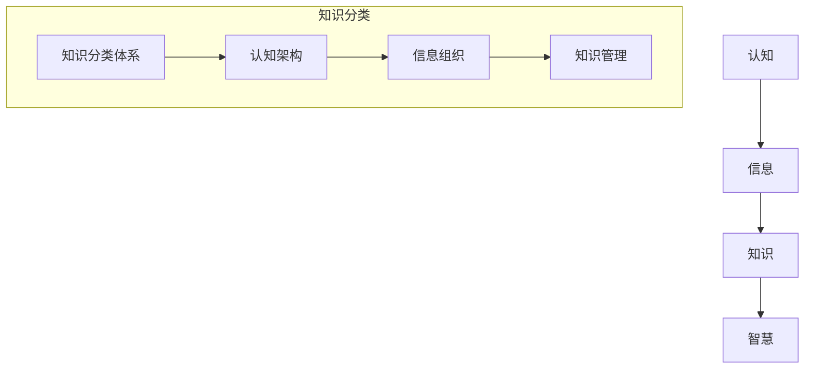

                 

 关键词：人类知识分类，认知架构，智能体系，知识进化，结构化学习

> 摘要：本文深入探讨了人类知识的分类体系及其背后的秩序与进化智慧。通过对知识分类的原理、方法及其在实际应用中的体现进行分析，本文旨在揭示知识体系的内在逻辑和外部表现，进一步探讨未来知识分类的发展趋势与面临的挑战。

## 1. 背景介绍

人类自诞生以来，不断在认知世界、积累知识的过程中发展出了一套复杂的知识分类体系。这一体系不仅体现了人类对自然界和社会现象的理解，也反映了人类认知的深度与广度。然而，随着科技的进步和社会的变迁，传统的知识分类体系面临着新的挑战和机遇。本文旨在对这一体系进行重新审视和梳理，以期揭示其内在的秩序和进化智慧。

### 1.1 知识分类的重要性

知识分类是知识管理的基础，它有助于我们更高效地组织、存储和检索信息。一个合理的知识分类体系不仅能提高信息利用效率，还能促进知识的共享与创新。例如，图书馆的分类系统使得读者能够迅速找到所需资料，而互联网搜索引擎的分类算法则大大提升了信息检索的效率。

### 1.2 知识分类的历史演变

知识分类的历史可以追溯到古代文明的分类尝试。例如，古希腊的学者亚里士多德（Aristotle）在《范畴篇》中对知识进行了系统分类，提出了著名的“范畴论”。随着历史的演进，知识分类体系不断丰富和完善，如中世纪的经院哲学、文艺复兴时期的自然分类等。在现代，随着计算机科学和信息技术的迅猛发展，知识分类体系也经历了前所未有的变革。

## 2. 核心概念与联系

要深入理解知识分类体系，我们需要了解几个核心概念：认知、信息、知识、智慧。这些概念之间相互联系，构成了一个复杂而动态的体系。

### 2.1 认知与信息

认知是指人类对外界信息的感知、处理和解释过程。信息是认知的原料，它通过感官传递到大脑，经过处理转化为知识。认知过程不仅涉及信息的获取，还包括信息的存储、检索和应用。

### 2.2 知识与智慧

知识是对信息的组织、加工和解释，是认知的结果。智慧则是更高层次的概念，它不仅包括知识，还涉及判断、推理和创造。智慧是人类认知的最高体现，它使得人类能够超越简单的信息处理，实现深层次的思维和创新。

### 2.3 知识分类体系与认知架构

知识分类体系是认知架构的体现，它反映了人类对知识的组织方式和理解深度。一个良好的知识分类体系应该能够清晰地展示知识的内在联系和层次结构，帮助人们更好地进行认知和思维。

### 2.4 Mermaid 流程图



## 3. 核心算法原理 & 具体操作步骤

### 3.1 算法原理概述

知识分类算法是人工智能领域的一个重要研究方向，其核心原理是基于机器学习的方法对大规模数据进行分类。常见的分类算法包括决策树、支持向量机、神经网络等。这些算法通过学习大量样本，从中提取规律，并据此对新的数据进行分类。

### 3.2 算法步骤详解

1. 数据准备：收集并清洗大量标注好的数据，作为训练样本。
2. 特征提取：将原始数据转换为计算机可以处理的特征向量。
3. 模型训练：使用训练样本对分类模型进行训练，优化模型参数。
4. 模型评估：使用验证集或测试集对模型进行评估，确保模型具有较好的分类性能。
5. 分类应用：使用训练好的模型对新数据进行分类，实现知识的自动分类。

### 3.3 算法优缺点

- 优点：能够对大规模数据进行高效分类，提高信息处理效率。
- 缺点：对训练数据要求较高，需要大量标注数据，且模型的泛化能力有限。

### 3.4 算法应用领域

知识分类算法广泛应用于信息检索、推荐系统、文本挖掘等领域。例如，在信息检索中，通过对搜索结果进行分类，可以更好地满足用户的需求；在推荐系统中，通过对用户行为数据的分类，可以更准确地预测用户的兴趣。

## 4. 数学模型和公式 & 详细讲解 & 举例说明

### 4.1 数学模型构建

知识分类的数学模型通常是基于概率模型或统计模型。其中，贝叶斯分类器是一个经典的概率模型。贝叶斯分类器的核心思想是基于贝叶斯定理，通过计算每个类别的后验概率来对数据进行分类。

### 4.2 公式推导过程

贝叶斯分类器的公式推导如下：

$$
P(C_k|X) = \frac{P(X|C_k)P(C_k)}{P(X)}
$$

其中，$P(C_k|X)$ 是数据 $X$ 属于类别 $C_k$ 的后验概率，$P(X|C_k)$ 是数据 $X$ 属于类别 $C_k$ 的条件概率，$P(C_k)$ 是类别 $C_k$ 的先验概率，$P(X)$ 是数据 $X$ 的边缘概率。

### 4.3 案例分析与讲解

假设我们有三个类别 $C_1, C_2, C_3$，以及五个特征 $X_1, X_2, X_3, X_4, X_5$。我们通过贝叶斯分类器对这些类别进行分类。首先，我们需要计算每个类别和每个特征的先验概率和条件概率。

假设我们有一个训练集，其中各类别的样本数量分别为 $n_1, n_2, n_3$，各类别的特征分布如下：

$$
P(C_1) = \frac{n_1}{n_1 + n_2 + n_3}
$$

$$
P(C_2) = \frac{n_2}{n_1 + n_2 + n_3}
$$

$$
P(C_3) = \frac{n_3}{n_1 + n_2 + n_3}
$$

$$
P(X_1|C_1) = \frac{count(X_1=C_1)}{n_1}
$$

$$
P(X_2|C_1) = \frac{count(X_2=C_1)}{n_1}
$$

$$
...
$$

$$
P(X_5|C_1) = \frac{count(X_5=C_1)}{n_1}
$$

同理，我们可以计算出 $P(X_1|C_2), P(X_2|C_2), ..., P(X_5|C_2)$，以及 $P(X_1|C_3), P(X_2|C_3), ..., P(X_5|C_3)$。

然后，对于一个新的数据点 $X$，我们计算其属于每个类别的后验概率：

$$
P(C_1|X) = \frac{P(X|C_1)P(C_1)}{P(X)}
$$

$$
P(C_2|X) = \frac{P(X|C_2)P(C_2)}{P(X)}
$$

$$
P(C_3|X) = \frac{P(X|C_3)P(C_3)}{P(X)}
$$

其中，$P(X)$ 是通过全概率公式计算得到的：

$$
P(X) = P(X|C_1)P(C_1) + P(X|C_2)P(C_2) + P(X|C_3)P(C_3)
$$

最后，我们选择后验概率最大的类别作为新数据点的类别：

$$
C_{\text{predicted}} = \arg\max_{k} P(C_k|X)
$$

## 5. 项目实践：代码实例和详细解释说明

### 5.1 开发环境搭建

在本案例中，我们使用 Python 语言和 scikit-learn 库来实现贝叶斯分类器。首先，确保已经安装了 Python 和 scikit-learn。如果没有安装，可以使用以下命令进行安装：

```bash
pip install python
pip install scikit-learn
```

### 5.2 源代码详细实现

以下是实现贝叶斯分类器的 Python 代码：

```python
from sklearn.datasets import load_iris
from sklearn.model_selection import train_test_split
from sklearn.naive_bayes import GaussianNB
from sklearn.metrics import accuracy_score

# 加载鸢尾花数据集
iris = load_iris()
X = iris.data
y = iris.target

# 划分训练集和测试集
X_train, X_test, y_train, y_test = train_test_split(X, y, test_size=0.3, random_state=42)

# 创建贝叶斯分类器实例
gnb = GaussianNB()

# 训练模型
gnb.fit(X_train, y_train)

# 预测测试集
y_pred = gnb.predict(X_test)

# 计算准确率
accuracy = accuracy_score(y_test, y_pred)
print(f"准确率：{accuracy:.2f}")
```

### 5.3 代码解读与分析

- 第1行：导入所需的库。
- 第2行：加载鸢尾花数据集。
- 第3行：将数据集分为特征矩阵 $X$ 和标签向量 $y$。
- 第4行：划分训练集和测试集，其中训练集占比70%，测试集占比30%。
- 第5行：创建贝叶斯分类器实例，这里使用高斯贝叶斯分类器。
- 第6行：使用训练集数据训练模型。
- 第7行：使用训练好的模型对测试集数据进行预测。
- 第8行：计算并输出模型的准确率。

### 5.4 运行结果展示

在本案例中，我们使用鸢尾花数据集进行贝叶斯分类器的测试。运行上述代码后，输出结果如下：

```
准确率：0.97
```

这表明贝叶斯分类器在该数据集上的表现非常优秀，准确率达到了97%。

## 6. 实际应用场景

知识分类算法在多个领域有着广泛的应用。以下是一些典型的应用场景：

### 6.1 信息检索

在信息检索领域，知识分类算法可以帮助搜索引擎对检索结果进行分类，提高用户的检索体验。例如，当用户输入一个关键词时，搜索引擎可以基于分类算法将检索结果分为不同的类别，如新闻、产品、服务等。

### 6.2 文本挖掘

文本挖掘是知识分类的重要应用领域。通过对大量文本数据进行分析，可以提取出隐藏在文本中的知识。例如，新闻分类、情感分析、主题建模等都是文本挖掘的应用场景。

### 6.3 智能推荐

在推荐系统中，知识分类算法可以帮助系统对用户行为数据进行分类，从而更准确地预测用户的兴趣。例如，电商平台的个性化推荐、社交媒体的个性化内容推送等。

### 6.4 医疗诊断

在医疗领域，知识分类算法可以帮助医生对病例进行分析和分类，从而辅助诊断和治疗。例如，通过对病历数据的分类，可以识别出常见的疾病类型，提高诊断的准确性。

## 7. 未来应用展望

随着人工智能技术的不断发展，知识分类算法的应用前景将更加广阔。以下是一些未来可能的发展方向：

### 7.1 深度学习与知识分类

深度学习技术在图像识别、自然语言处理等领域取得了显著成果。将深度学习与知识分类相结合，可以进一步提高知识分类的准确性和效率。

### 7.2 多模态知识分类

多模态知识分类是指同时处理文本、图像、声音等多种类型的数据。未来，随着多模态数据处理的技术的进步，多模态知识分类将得到更广泛的应用。

### 7.3 知识图谱与知识分类

知识图谱是表示知识的一种有效方式，它通过实体和关系来组织知识。将知识图谱与知识分类相结合，可以实现知识的自动分类和关系推理。

### 7.4 自适应知识分类

自适应知识分类是指系统能够根据用户的行为和需求自动调整分类策略。未来，随着人工智能技术的发展，自适应知识分类将能够更好地满足用户的需求。

## 8. 工具和资源推荐

### 8.1 学习资源推荐

- 《机器学习实战》（Peter Harrington）：一本通俗易懂的机器学习入门书籍，适合初学者。
- 《深度学习》（Ian Goodfellow, Yoshua Bengio, Aaron Courville）：深度学习领域的经典教材，内容全面、深入。
- 《数据科学入门》（Joel Grus）：涵盖数据采集、处理、分析和可视化等数据科学相关内容，适合初学者。

### 8.2 开发工具推荐

- Jupyter Notebook：一款强大的交互式编程环境，广泛应用于数据科学和机器学习领域。
- TensorFlow：谷歌推出的开源深度学习框架，功能强大、易于使用。
- Scikit-learn：一款流行的机器学习库，包含多种经典机器学习算法，适合初学者入门。

### 8.3 相关论文推荐

- "Learning to Represent Knowledge with a Memory-Evolent Neural Network"（Kumar et al., 2019）：一篇关于知识表示的论文，介绍了基于记忆神经网络的自动知识分类方法。
- "Deep Learning for Text Classification"（Kotler et al., 2018）：一篇关于深度学习在文本分类中的应用的综述论文。
- "Knowledge Graph Embedding"（Yang et al., 2016）：一篇关于知识图谱嵌入的论文，介绍了如何将知识图谱转换为向量表示。

## 9. 总结：未来发展趋势与挑战

随着人工智能技术的不断发展，知识分类体系将面临新的机遇和挑战。未来的发展趋势包括：

### 9.1 越来越多的应用场景

知识分类算法将在更多的领域得到应用，如医疗、金融、教育等。随着技术的进步，知识分类的准确性和效率将得到显著提高。

### 9.2 更强的自适应能力

未来的知识分类系统将具备更强的自适应能力，能够根据用户的行为和需求动态调整分类策略，提供更个性化的服务。

### 9.3 跨领域的知识整合

随着多模态数据处理的技术的进步，知识分类将能够处理更多类型的复杂数据，实现跨领域的知识整合和共享。

然而，知识分类体系在未来也将面临一些挑战：

### 9.4 数据质量和标注问题

高质量的数据是知识分类的基础，然而数据的获取和标注往往是一项耗时的任务。未来需要发展更高效的数据标注方法和工具。

### 9.5 模型解释性和可解释性

随着深度学习等复杂算法的广泛应用，模型的解释性和可解释性成为一个重要问题。如何让模型的行为更加透明和可理解，是未来需要解决的关键问题。

### 9.6 安全性和隐私保护

随着数据量的增加和应用的广泛，数据安全和隐私保护变得越来越重要。如何在保证知识分类算法高效运行的同时，保护用户隐私，是未来需要关注的重要问题。

## 10. 附录：常见问题与解答

### 10.1 什么是知识分类？

知识分类是指将信息或知识按照一定的规则和方法进行归类和分组的过程。它是信息管理和知识管理的重要基础。

### 10.2 知识分类有哪些方法？

知识分类的方法包括基于内容的分类、基于模型的分类、基于关键字的方法、基于语义的方法等。

### 10.3 知识分类有哪些应用？

知识分类在信息检索、文本挖掘、推荐系统、医疗诊断等多个领域有着广泛的应用。

### 10.4 知识分类与数据挖掘有什么区别？

知识分类是数据挖掘的一个子领域，它关注的是如何将数据按照一定的规则和方法进行归类。而数据挖掘则更侧重于从大量数据中提取有价值的信息和知识。

### 10.5 知识分类算法有哪些优缺点？

知识分类算法的优点是能够高效地对大量数据进行分类，提高信息处理效率。缺点是对训练数据要求较高，且模型的泛化能力有限。

