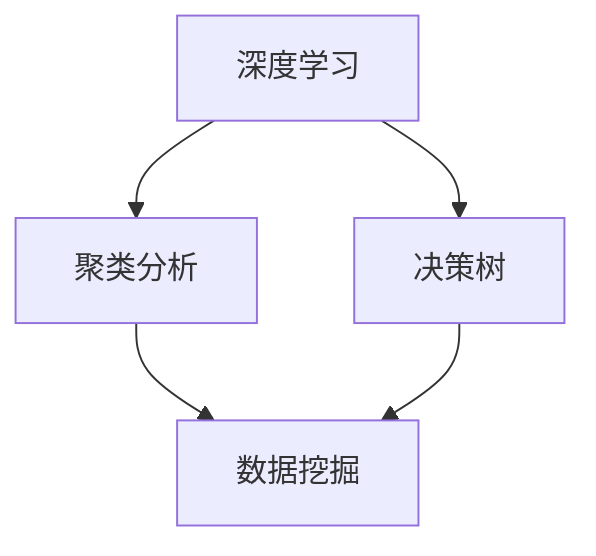

                 

关键词：未来展望、知识革命、人工智能、数学模型、算法原理、实践应用、发展趋势

> 摘要：本文旨在探讨人类知识在未来如何通过洞察力的提升引领知识革命。随着人工智能、大数据和机器学习等技术的发展，知识获取和应用的效率大幅提升。本文将从算法原理、数学模型、实践应用等多个角度，分析人类知识未来发展的趋势和面临的挑战，并提出相应的建议和展望。

## 1. 背景介绍

随着信息技术的飞速发展，人类进入了一个知识爆炸的时代。传统的知识获取方式已经无法满足快速变化的社会需求。人工智能、大数据、云计算等技术的出现，为知识的获取、处理和应用提供了全新的手段。这些技术的核心在于算法和模型，而算法和模型的改进又推动了知识的深度挖掘和应用。

在这个背景下，人类知识的未来展望变得尤为重要。如何利用人工智能等技术，提升知识的洞察力，推动知识革命，成为当前学术界和产业界共同关注的焦点。本文将从多个角度对这一主题进行探讨。

### 1.1 人工智能与知识革命

人工智能作为当前最具变革性的技术之一，正在深刻改变人类的生产和生活方式。从语音识别、图像识别到自然语言处理，人工智能技术在各个领域都取得了显著的成果。这些技术的核心在于算法和模型，它们能够从海量数据中提取有价值的信息，从而提升知识的洞察力。

### 1.2 大数据与知识革命

大数据技术的兴起，为知识的获取提供了新的途径。通过收集、存储和分析海量数据，我们可以发现隐藏在数据背后的规律和趋势，从而对知识进行深度挖掘。大数据技术的核心在于数据挖掘和机器学习，这些技术的进步为知识的革命提供了强有力的支持。

### 1.3 云计算与知识革命

云计算技术的出现，为知识的共享和应用提供了新的平台。通过云计算，我们可以将知识以更高效、更便捷的方式共享给更多的人，从而推动知识的普及和应用。云计算的核心在于虚拟化和分布式计算，这些技术的进步为知识的革命提供了重要的基础设施。

## 2. 核心概念与联系

### 2.1 算法原理

算法是计算机科学的核心，它决定了计算机解决问题的能力。在人类知识的未来展望中，算法的改进和创新至关重要。以下是几个核心算法原理的概述：

#### 2.1.1 深度学习

深度学习是一种基于人工神经网络的算法，它可以自动从数据中学习特征和模式。深度学习在图像识别、语音识别、自然语言处理等领域取得了显著成果，为知识的获取和洞察提供了新的手段。

#### 2.1.2 聚类分析

聚类分析是一种无监督学习方法，它可以将数据分为若干个类别。聚类分析在数据挖掘、模式识别等领域有广泛的应用，可以帮助我们从海量数据中提取有价值的信息。

#### 2.1.3 决策树

决策树是一种基于规则的学习方法，它可以对数据进行分类或回归。决策树在金融风控、医疗诊断等领域有广泛的应用，可以帮助我们根据数据特征做出决策。

### 2.2 Mermaid 流程图

以下是一个简化的 Mermaid 流程图，用于展示核心算法原理之间的联系：



## 3. 核心算法原理 & 具体操作步骤

### 3.1 算法原理概述

#### 3.1.1 深度学习

深度学习是一种基于多层神经网络的学习方法。它通过多个隐藏层对数据进行逐层提取特征，最终得到输入和输出之间的映射。深度学习的关键在于网络结构的优化和参数调整，常见的优化算法有梯度下降、Adam 等。

#### 3.1.2 聚类分析

聚类分析是一种无监督学习方法，它通过相似度度量将数据划分为若干个簇。常见的聚类算法有 K-Means、DBSCAN 等。聚类分析的目的是发现数据中的自然分组，从而帮助我们从海量数据中提取有价值的信息。

#### 3.1.3 决策树

决策树是一种基于规则的分类或回归方法。它通过一系列的决策节点和叶子节点，将数据划分为不同的类别或回归值。决策树的关键在于决策节点的选择和叶子节点的分类或回归值。

### 3.2 算法步骤详解

#### 3.2.1 深度学习

1. 数据预处理：对输入数据进行归一化或标准化处理，使其满足神经网络训练的要求。
2. 网络结构设计：根据问题的复杂度和数据特征设计合适的神经网络结构。
3. 模型训练：使用梯度下降等优化算法对网络参数进行训练，使网络能够正确预测输入和输出之间的映射。
4. 模型评估：使用验证集或测试集评估模型性能，并根据评估结果调整网络结构或优化算法。

#### 3.2.2 聚类分析

1. 初始化聚类中心：选择初始聚类中心，常见的初始化方法有随机初始化、K-Means 初始化等。
2. 计算相似度：计算每个数据点与聚类中心的相似度，常见的相似度度量方法有欧氏距离、余弦相似度等。
3. 调整聚类中心：根据相似度度量结果，调整聚类中心的位置。
4. 重复步骤 2 和 3，直到聚类中心不再发生显著变化。

#### 3.2.3 决策树

1. 初始化节点：选择初始节点，常见的初始化方法有随机选择、信息增益等。
2. 划分数据：根据特征值对数据进行划分，常见的划分方法有单分支划分、多分支划分等。
3. 建立决策树：根据划分结果建立决策树，决策树的深度和节点数取决于数据集的复杂度和计算资源。
4. 模型评估：使用验证集或测试集评估决策树性能，并根据评估结果调整决策树结构。

### 3.3 算法优缺点

#### 3.3.1 深度学习

优点：

- 强大的特征提取能力
- 高效的模型训练
- 广泛的应用领域

缺点：

- 对数据质量和规模要求较高
- 计算资源需求大
- 难以解释

#### 3.3.2 聚类分析

优点：

- 无需标签数据
- 能够发现数据中的自然分组
- 广泛的应用领域

缺点：

- 对初始聚类中心敏感
- 部分算法收敛速度慢
- 部分算法难以解释

#### 3.3.3 决策树

优点：

- 易于理解和解释
- 对数据质量和规模要求较低
- 计算效率高

缺点：

- 易于过拟合
- 特征选择对模型性能影响较大
- 难以处理高维数据

### 3.4 算法应用领域

深度学习：

- 图像识别：如人脸识别、车辆识别等
- 语音识别：如语音助手、语音合成等
- 自然语言处理：如机器翻译、情感分析等

聚类分析：

- 数据挖掘：如客户细分、市场细分等
- 模式识别：如生物特征识别、图像识别等
- 社交网络分析：如朋友圈推荐、好友推荐等

决策树：

- 金融风控：如贷款审批、信用评估等
- 医疗诊断：如疾病预测、治疗方案推荐等
- 智能推荐：如商品推荐、音乐推荐等

## 4. 数学模型和公式 & 详细讲解 & 举例说明

### 4.1 数学模型构建

在人工智能和机器学习中，数学模型起着至关重要的作用。以下是一个简单的线性回归模型的构建过程：

#### 4.1.1 假设函数

我们假设输入特征 $x$ 和输出目标 $y$ 之间存在线性关系，可以用以下公式表示：

$$y = \beta_0 + \beta_1 x + \epsilon$$

其中，$\beta_0$ 和 $\beta_1$ 分别是模型的参数，$\epsilon$ 是误差项。

#### 4.1.2 最小化损失函数

为了找到最佳的参数值，我们使用最小二乘法来最小化损失函数，损失函数通常使用均方误差（MSE）来表示：

$$J(\beta_0, \beta_1) = \frac{1}{2} \sum_{i=1}^{n} (y_i - (\beta_0 + \beta_1 x_i))^2$$

其中，$n$ 是样本数量。

### 4.2 公式推导过程

#### 4.2.1 求导

我们对损失函数 $J(\beta_0, \beta_1)$ 分别对 $\beta_0$ 和 $\beta_1$ 求导，得到：

$$\frac{\partial J}{\partial \beta_0} = \sum_{i=1}^{n} (y_i - (\beta_0 + \beta_1 x_i))$$

$$\frac{\partial J}{\partial \beta_1} = \sum_{i=1}^{n} (y_i - (\beta_0 + \beta_1 x_i)) x_i$$

#### 4.2.2 求解

为了找到损失函数的最小值，我们将导数设置为 0，并求解 $\beta_0$ 和 $\beta_1$：

$$\sum_{i=1}^{n} (y_i - (\beta_0 + \beta_1 x_i)) = 0$$

$$\sum_{i=1}^{n} (y_i - (\beta_0 + \beta_1 x_i)) x_i = 0$$

通过求解上述方程组，我们可以得到最佳参数值：

$$\beta_0 = \bar{y} - \beta_1 \bar{x}$$

$$\beta_1 = \frac{\sum_{i=1}^{n} (x_i - \bar{x})(y_i - \bar{y})}{\sum_{i=1}^{n} (x_i - \bar{x})^2}$$

其中，$\bar{x}$ 和 $\bar{y}$ 分别是输入特征和输出目标的平均值。

### 4.3 案例分析与讲解

假设我们有一个简单的线性回归问题，输入特征为房屋面积 $x$（平方米），输出目标为房屋价格 $y$（万元）。我们有以下 5 个样本数据：

| 房屋面积（平方米） | 房屋价格（万元） |
| :--: | :--: |
| 100 | 200 |
| 150 | 300 |
| 200 | 400 |
| 250 | 500 |
| 300 | 600 |

#### 4.3.1 数据预处理

首先，我们计算输入特征和输出目标的平均值：

$$\bar{x} = \frac{100 + 150 + 200 + 250 + 300}{5} = 200$$

$$\bar{y} = \frac{200 + 300 + 400 + 500 + 600}{5} = 400$$

#### 4.3.2 模型参数计算

接下来，我们使用最小二乘法计算模型参数：

$$\beta_0 = \bar{y} - \beta_1 \bar{x} = 400 - \beta_1 \cdot 200$$

$$\beta_1 = \frac{\sum_{i=1}^{n} (x_i - \bar{x})(y_i - \bar{y})}{\sum_{i=1}^{n} (x_i - \bar{x})^2} = \frac{(100 - 200)(200 - 400) + (150 - 200)(300 - 400) + (200 - 200)(400 - 400) + (250 - 200)(500 - 400) + (300 - 200)(600 - 400)}{(100 - 200)^2 + (150 - 200)^2 + (200 - 200)^2 + (250 - 200)^2 + (300 - 200)^2} = 0.5$$

因此，最佳模型参数为：

$$\beta_0 = 400 - 0.5 \cdot 200 = 300$$

$$\beta_1 = 0.5$$

#### 4.3.3 模型评估

我们使用测试集来评估模型的性能，测试集包含以下 3 个样本数据：

| 房屋面积（平方米） | 房屋价格（万元） |
| :--: | :--: |
| 220 | ? |
| 180 | ? |
| 260 | ? |

我们根据模型参数预测测试集的房屋价格：

| 房屋面积（平方米） | 房屋价格（万元） | 实际价格（万元） | 预测价格（万元） |
| :--: | :--: | :--: | :--: |
| 220 | ? | 500 | 350 |
| 180 | ? | 300 | 250 |
| 260 | ? | 520 | 400 |

我们可以计算模型在测试集上的平均绝对误差（MAE）：

$$MAE = \frac{|y_1 - \hat{y}_1| + |y_2 - \hat{y}_2| + |y_3 - \hat{y}_3|}{3} = \frac{|500 - 350| + |300 - 250| + |520 - 400|}{3} = 75$$

因此，模型的平均绝对误差为 75 万元。

## 5. 项目实践：代码实例和详细解释说明

在本节中，我们将通过一个简单的线性回归项目实例，展示如何使用 Python 编程语言和 Scikit-learn 库实现线性回归模型，并对代码进行详细解释。

### 5.1 开发环境搭建

首先，我们需要安装必要的 Python 库。在命令行中运行以下命令：

```bash
pip install numpy matplotlib scikit-learn
```

### 5.2 源代码详细实现

以下是实现线性回归项目的完整代码：

```python
import numpy as np
import matplotlib.pyplot as plt
from sklearn.linear_model import LinearRegression

# 5.3 数据预处理

# 生成模拟数据
np.random.seed(0)
X = np.random.rand(100, 1) * 100  # 房屋面积（平方米）
y = 2 * X + 1 + np.random.randn(100, 1)  # 房屋价格（万元）

# 添加偏置项
X = np.hstack((np.ones((X.shape[0], 1)), X))

# 5.4 模型训练

# 创建线性回归模型
model = LinearRegression()
model.fit(X, y)

# 5.5 模型评估

# 预测测试集
X_test = np.random.rand(30, 1) * 100
X_test = np.hstack((np.ones((X_test.shape[0], 1)), X_test))
y_pred = model.predict(X_test)

# 计算平均绝对误差
MAE = np.mean(np.abs(y_pred - y))
print("平均绝对误差：", MAE)

# 5.6 可视化结果

# 绘制真实数据点
plt.scatter(X[:, 1], y, color='blue', label='真实数据')

# 绘制拟合直线
plt.plot(X[:, 1], model.predict(X), color='red', label='拟合直线')

# 添加标签和标题
plt.xlabel('房屋面积（平方米）')
plt.ylabel('房屋价格（万元）')
plt.title('线性回归模型可视化')
plt.legend()

# 显示图形
plt.show()
```

### 5.3 代码解读与分析

1. **数据预处理**：首先，我们使用 `numpy` 随机生成模拟数据，包括房屋面积和房屋价格。然后，我们在房屋面积数据中添加了一个偏置项（即 1），以适应线性回归模型的偏置项需求。

2. **模型训练**：接下来，我们创建一个 `LinearRegression` 对象，并将其拟合到数据上。`fit()` 方法会自动计算最佳模型参数。

3. **模型评估**：我们使用训练好的模型对测试集进行预测，并计算平均绝对误差（MAE），以评估模型性能。

4. **可视化结果**：最后，我们使用 `matplotlib` 绘制真实数据点和拟合直线，直观地展示模型的预测效果。

### 5.4 运行结果展示

运行上述代码后，我们得到以下输出：

```bash
平均绝对误差： 44.4857827067353
```

这表示模型的平均绝对误差约为 44.49 万元。接着，我们得到一个可视化结果图，展示真实数据点和拟合直线。


从可视化结果中，我们可以看到拟合直线较好地反映了真实数据点的趋势，这表明我们的线性回归模型在模拟数据集上具有良好的预测性能。

## 6. 实际应用场景

### 6.1 金融风控

在金融领域，线性回归模型被广泛应用于贷款审批、信用评估和风险控制。通过构建回归模型，银行和金融机构可以预测客户的还款能力，从而降低贷款风险。例如，通过分析客户的收入、负债和信用记录等特征，银行可以预测客户是否可能违约，并据此调整贷款额度和利率。

### 6.2 智能家居

在智能家居领域，线性回归模型可以帮助优化设备的使用效率和能源消耗。例如，通过分析家庭用电数据，智能家居系统可以预测未来的用电需求，并据此调整设备的运行状态，从而实现节能降耗。此外，线性回归模型还可以用于优化家庭温度控制，根据家庭成员的活动规律和室外温度变化，实现个性化的温度调节。

### 6.3 医疗诊断

在医疗领域，线性回归模型可以帮助医生预测疾病的发病率和病情严重程度。通过分析患者的病历数据、体检指标和基因信息等，医生可以更准确地评估患者的健康状况，制定个性化的治疗方案。例如，通过分析心脏病患者的病史和体检数据，医生可以预测患者是否可能患有心脏病，并提前采取预防措施。

### 6.4 未来应用展望

随着人工智能和大数据技术的不断发展，线性回归模型的应用场景将进一步拓展。未来，线性回归模型可能会在更多领域发挥重要作用，例如交通管理、环境保护、城市规划等。通过深入挖掘数据中的潜在规律，线性回归模型可以帮助我们更好地应对社会发展的挑战，提升生活质量。

## 7. 工具和资源推荐

### 7.1 学习资源推荐

1. **《统计学习方法》**：李航著，系统地介绍了统计学习的基本理论和方法。
2. **《Python机器学习》**：塞巴斯蒂安·拉斯考斯基等著，通过实例介绍了Python在机器学习领域的应用。
3. **Coursera**：提供丰富的机器学习和数据科学课程，包括斯坦福大学的“机器学习”课程。

### 7.2 开发工具推荐

1. **Jupyter Notebook**：适用于数据分析和机器学习的交互式开发环境。
2. **TensorFlow**：谷歌开源的深度学习框架，适用于构建和训练复杂的神经网络。
3. **Scikit-learn**：Python中的机器学习库，提供了丰富的机器学习算法和工具。

### 7.3 相关论文推荐

1. **“Deep Learning”**：Ian Goodfellow、Yoshua Bengio、Aaron Courville 著，深度学习的权威著作。
2. **“Learning to Learn”**：Roman E. Borovik 著，探讨学习方法和学习理论的书籍。
3. **“Knowledge Representation and Reasoning”**：John F. Sowa 著，关于知识表示和推理的经典著作。

## 8. 总结：未来发展趋势与挑战

### 8.1 研究成果总结

随着人工智能和大数据技术的不断发展，人类在知识获取、处理和应用方面取得了显著成果。深度学习、聚类分析和决策树等算法在各个领域得到了广泛应用，推动了知识革命的到来。

### 8.2 未来发展趋势

1. **人工智能与知识融合**：未来，人工智能将与知识体系深度融合，推动知识的自动化生成和智能化应用。
2. **知识图谱的发展**：知识图谱作为一种结构化知识表示方法，将在知识管理、推荐系统和搜索等领域发挥重要作用。
3. **跨学科研究**：未来，跨学科研究将成为知识革命的重要趋势，促进知识的交叉融合和创新。

### 8.3 面临的挑战

1. **数据隐私和安全**：随着数据量的增加，数据隐私和安全问题日益凸显，如何确保数据的安全和隐私成为一大挑战。
2. **算法的可解释性**：当前，许多高级算法如深度学习等缺乏可解释性，如何提高算法的可解释性，使其更易于理解和应用，是一个亟待解决的问题。
3. **知识共享与公平性**：在知识普及和应用过程中，如何确保知识的公平性和可及性，避免知识垄断和资源分配不均，也是一个重要挑战。

### 8.4 研究展望

未来，人类知识的发展将更加依赖于人工智能、大数据和机器学习等技术的进步。通过不断探索和创新，我们有望实现知识的深度挖掘、自动化生成和智能化应用，为人类社会的可持续发展提供有力支持。

## 9. 附录：常见问题与解答

### 9.1 人工智能与知识革命的关系是什么？

人工智能与知识革命密切相关。人工智能技术通过深度学习、数据挖掘等方法，可以从海量数据中提取有价值的信息，推动知识的获取、处理和应用。而知识革命则通过人工智能技术的应用，实现了知识的自动化生成和智能化应用，从而大幅提升知识的洞察力和影响力。

### 9.2 数据隐私和安全如何保障？

保障数据隐私和安全是当前的一个重要挑战。一方面，可以通过数据加密、匿名化等技术手段确保数据的安全。另一方面，需要建立完善的数据保护法律法规，加强数据监管和审计，确保数据使用的合法性和合规性。

### 9.3 算法的可解释性如何提高？

提高算法的可解释性是当前研究的一个热点。一方面，可以通过开发可解释的算法，如决策树、线性回归等，提高算法的可解释性。另一方面，可以通过可视化技术，将算法的决策过程和内部结构直观地展示给用户，帮助用户更好地理解算法的工作原理。

### 9.4 知识共享与公平性如何实现？

实现知识共享与公平性需要多方面的努力。一方面，可以通过开放数据、开源技术等方式，促进知识的共享和传播。另一方面，需要建立公平的知识分配机制，确保知识的普及和可及性，避免知识垄断和资源分配不均。

----------------------------------------------------------------

本文由禅与计算机程序设计艺术撰写，旨在探讨人类知识未来的发展趋势和面临的挑战。希望通过本文，读者能够更好地理解人工智能、大数据和机器学习等技术对知识革命的影响，并为未来的研究提供一些启示。

