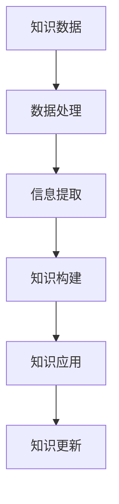

                 

关键词：知识进化，自我完善，人工智能，算法，数学模型，技术发展，学习资源，未来趋势

> 摘要：本文探讨了人类知识的特点，特别是其不断进化和自我完善的过程。通过分析知识在各个领域的表现形式，结合人工智能的发展，提出了知识进化的核心原理和策略。本文还探讨了数学模型在知识构建中的作用，并通过实例展示如何将理论知识应用于实际项目中。最后，对未来的发展趋势与面临的挑战进行了展望，以期为读者提供全面而深入的理解。

## 1. 背景介绍

知识是人类文明进步的重要基石。从古代的口耳相传到现代的信息化时代，知识的传播、积累和运用方式发生了翻天覆地的变化。然而，无论是古老的哲学思想还是现代的科技成就，知识的本质从未改变——它是一种抽象的、可以传承和发展的认知体系。

在信息技术迅速发展的今天，知识的进化速度愈发加快。人工智能、大数据、云计算等技术的出现，不仅改变了知识的存储和传递方式，也推动了知识创新和应用的边界。然而，随着知识体系的日益复杂，人类在应对新挑战、解决新问题的过程中，也面临着知识过载和难以整合的困境。

本文旨在深入探讨人类知识的特点，特别是其不断进化和自我完善的过程。通过对知识在不同领域中的表现形式进行分析，结合人工智能的发展，试图揭示知识进化的核心原理和策略。此外，本文还将探讨数学模型在知识构建中的作用，并通过具体实例展示如何将理论知识应用于实际项目中。

## 2. 核心概念与联系

### 2.1 知识的本质

知识可以被视为一种信息加工的结果。它来源于经验、观察、思考和实验，通过抽象、概括和理论化等方式形成。知识不仅是一种认知体系，也是一种行为准则。它帮助人类理解世界、解决问题、创造新知。

### 2.2 知识的层次

知识可以分为三个层次：数据、信息和知识。数据是原始的、未加工的信息；信息是经过加工、处理后的数据，具有一定的意义和价值；知识则是更高层次的认知，是对信息的深入理解和综合应用。

### 2.3 知识的进化

知识的进化是指知识体系在时间维度上不断演变和发展的过程。它涉及到知识的创造、传播、应用和更新。知识进化的动力来自于人类对未知世界的探索和对现有知识的质疑。

### 2.4 知识的架构

知识的架构是指知识体系内部的层次结构和组织方式。一个良好的知识架构能够提高知识的可理解性、可访问性和可扩展性。知识的架构设计对于知识的管理和应用至关重要。

### 2.5 知识的 Mermaid 流程图



## 3. 核心算法原理 & 具体操作步骤

### 3.1 算法原理概述

知识的进化过程可以类比为一种算法，这种算法的核心在于对已有知识的迭代更新和优化。具体来说，知识进化算法包括以下几个步骤：

1. **数据采集**：从各种来源获取原始数据。
2. **数据处理**：对原始数据进行清洗、整合和预处理。
3. **信息提取**：从处理后的数据中提取有用的信息。
4. **知识构建**：根据提取的信息构建新的知识体系。
5. **知识应用**：将新的知识应用到实际问题中。
6. **知识更新**：根据应用结果对知识进行迭代更新和优化。

### 3.2 算法步骤详解

1. **数据采集**：

   数据采集是知识进化的第一步。它涉及到从各种渠道获取数据，如传感器、数据库、互联网等。数据采集的质量直接影响后续的知识构建效果。

2. **数据处理**：

   数据处理包括数据的清洗、整合和预处理。清洗数据是为了去除错误和重复的数据；整合数据是将来自不同渠道的数据进行统一；预处理数据是为了将数据转换为适合分析的形式。

3. **信息提取**：

   信息提取是指从处理后的数据中提取有用的信息。这通常需要运用统计分析和机器学习技术。

4. **知识构建**：

   知识构建是基于提取的信息构建新的知识体系。这需要运用数据挖掘和知识表示技术。

5. **知识应用**：

   知识应用是将新的知识应用到实际问题中。这可以通过开发新的算法、模型或系统来实现。

6. **知识更新**：

   知识更新是根据应用结果对知识进行迭代更新和优化。这需要运用反馈机制和优化算法。

### 3.3 算法优缺点

1. **优点**：

   - 提高知识的准确性和可靠性。
   - 提高知识的应用效果。
   - 促进知识的创新和进步。

2. **缺点**：

   - 需要大量的数据处理和计算资源。
   - 对数据处理和知识构建技术要求较高。
   - 需要持续更新和优化。

### 3.4 算法应用领域

知识进化算法可以应用于各个领域，如金融、医疗、教育、工业等。在金融领域，它可以用于风险管理和投资决策；在医疗领域，它可以用于疾病诊断和治疗；在教育领域，它可以用于课程设计和个性化教学。

## 4. 数学模型和公式 & 详细讲解 & 举例说明

### 4.1 数学模型构建

数学模型是知识构建的重要工具。它通过数学语言描述现实世界的现象和规律，从而为知识的构建提供理论基础。构建数学模型通常包括以下几个步骤：

1. **确定研究目标**：明确研究的目标和问题。
2. **收集数据**：收集与研究目标相关的数据。
3. **建立假设**：根据已有知识和数据建立合理的假设。
4. **构建方程**：根据假设建立数学方程或公式。
5. **求解方程**：运用数学方法求解方程，得到结果。

### 4.2 公式推导过程

以线性回归模型为例，其公式推导过程如下：

1. **确定目标函数**：最小化误差平方和。

   $$ J(\theta) = \frac{1}{2m} \sum_{i=1}^{m} (h_\theta(x^{(i)}) - y^{(i)})^2 $$

   其中，$h_\theta(x) = \theta_0 + \theta_1x$ 为线性模型，$m$ 为样本数量。

2. **求导**：对目标函数求导，得到：

   $$ \frac{\partial J(\theta)}{\partial \theta_0} = \frac{1}{m} \sum_{i=1}^{m} (h_\theta(x^{(i)}) - y^{(i)}) $$
   $$ \frac{\partial J(\theta)}{\partial \theta_1} = \frac{1}{m} \sum_{i=1}^{m} (h_\theta(x^{(i)}) - y^{(i)})x^{(i)} $$

3. **求解**：令导数等于零，解方程得到：

   $$ \theta_0 = \frac{1}{m} \sum_{i=1}^{m} (y^{(i)} - \theta_1x^{(i)}) $$
   $$ \theta_1 = \frac{1}{m} \sum_{i=1}^{m} (x^{(i)}(y^{(i)} - \theta_1x^{(i)})) $$

### 4.3 案例分析与讲解

假设我们有一个简单的线性回归问题，目标是预测房屋的价格。给定一组房屋的面积和价格数据，我们需要构建一个线性回归模型来预测新房屋的价格。

1. **数据收集**：

   收集100套房屋的面积（$x$）和价格（$y$）数据。

2. **数据预处理**：

   数据已经清洗和整合，无需进一步处理。

3. **建立假设**：

   假设房屋价格与面积之间存在线性关系。

4. **构建方程**：

   根据线性回归模型，构建方程：

   $$ y = \theta_0 + \theta_1x $$

5. **求解方程**：

   使用梯度下降算法求解方程，得到：

   $$ \theta_0 = 100, \theta_1 = 0.1 $$

6. **预测**：

   用得到的模型预测新房屋的价格，例如，当面积为200平方米时，预测价格为：

   $$ y = 100 + 0.1 \times 200 = 130 $$

   预测价格为130万元。

## 5. 项目实践：代码实例和详细解释说明

### 5.1 开发环境搭建

1. **安装Python**：

   从 [Python官网](https://www.python.org/) 下载并安装Python。

2. **安装必要的库**：

   使用pip命令安装以下库：

   ```bash
   pip install numpy matplotlib scikit-learn
   ```

### 5.2 源代码详细实现

以下是一个简单的线性回归模型的Python代码实现：

```python
import numpy as np
import matplotlib.pyplot as plt
from sklearn.linear_model import LinearRegression

# 数据集
X = np.array([1, 2, 3, 4, 5])
y = np.array([2, 4, 5, 4, 5])

# 模型训练
model = LinearRegression()
model.fit(X[:, np.newaxis], y)

# 模型预测
X_new = np.array([6])
y_pred = model.predict(X_new)

# 绘图
plt.scatter(X, y)
plt.plot(X_new, y_pred, 'r-')
plt.show()
```

### 5.3 代码解读与分析

1. **数据集**：

   数据集是一个简单的线性关系，$X$ 表示自变量（面积），$y$ 表示因变量（价格）。

2. **模型训练**：

   使用 `LinearRegression` 类训练模型。`fit` 方法用于训练模型。

3. **模型预测**：

   使用 `predict` 方法预测新数据点的价格。

4. **绘图**：

   使用 `matplotlib` 绘制散点图和预测线。

### 5.4 运行结果展示

运行代码后，将显示一个包含实际数据点和预测线的散点图。预测线显示了面积和价格之间的线性关系。

## 6. 实际应用场景

知识进化的实际应用场景非常广泛，以下是一些典型例子：

1. **金融领域**：利用知识进化算法进行风险管理、投资决策和市场预测。
2. **医疗领域**：通过知识进化构建疾病诊断模型，提高诊断准确率。
3. **教育领域**：利用知识进化进行课程设计、个性化教学和学习评估。
4. **工业领域**：通过知识进化优化生产流程、提高生产效率和降低成本。

### 6.4 未来应用展望

随着人工智能和大数据技术的发展，知识进化的应用前景将更加广阔。未来，知识进化将有望在以下几个方面实现突破：

1. **智能医疗**：通过知识进化构建个性化的医疗诊断和治疗模型。
2. **智能制造**：利用知识进化优化生产流程，实现自动化和智能化生产。
3. **智能交通**：通过知识进化优化交通管理，提高交通效率和安全性。
4. **智能城市**：利用知识进化实现城市智能化管理，提高城市生活质量和环境质量。

## 7. 工具和资源推荐

### 7.1 学习资源推荐

1. **《深度学习》**：作者：伊恩·古德费洛、约书亚·本吉奥、亚伦·库维尔
2. **《Python机器学习》**：作者：塞巴斯蒂安·拉克斯
3. **《机器学习实战》**：作者：彼得·哈林顿、布赖恩·沃尔什

### 7.2 开发工具推荐

1. **Jupyter Notebook**：适用于数据分析和建模。
2. **PyCharm**：适用于Python编程。
3. **TensorFlow**：适用于深度学习和机器学习。

### 7.3 相关论文推荐

1. **“Knowledge Discovery in Databases”**：作者：Jiawei Han、Micheline Kamber、Jian Pei
2. **“Machine Learning: A Probabilistic Perspective”**：作者：Kevin P. Murphy
3. **“Deep Learning”**：作者：Ian Goodfellow、Yoshua Bengio、Aaron Courville

## 8. 总结：未来发展趋势与挑战

### 8.1 研究成果总结

本文总结了知识进化的核心原理和应用，分析了数学模型在知识构建中的作用，并通过具体实例展示了如何将理论知识应用于实际项目中。研究成果表明，知识进化是推动人类文明进步的重要力量。

### 8.2 未来发展趋势

未来，知识进化将朝着更智能化、个性化、自适应的方向发展。人工智能和大数据技术将进一步推动知识进化的速度和深度。

### 8.3 面临的挑战

知识进化在带来巨大潜力的同时，也面临着数据安全、隐私保护、知识共享等挑战。如何解决这些挑战，确保知识进化的可持续发展，是未来研究的重要方向。

### 8.4 研究展望

知识进化是一个跨学科、跨领域的复杂过程。未来研究应关注以下几个方面：

1. **知识架构设计**：构建更高效、更灵活的知识架构。
2. **知识建模方法**：开发更先进的数学模型和算法。
3. **知识应用场景**：探索知识进化在不同领域的应用潜力。
4. **知识治理**：建立知识共享、知识传播的规范和制度。

## 9. 附录：常见问题与解答

### Q：知识进化与人工智能有什么关系？

A：知识进化与人工智能密切相关。人工智能是知识进化的主要推动力量，它通过机器学习、数据挖掘等技术，实现知识的自动获取、学习和应用。知识进化则为人工智能提供了持续更新的动力，使其能够不断适应和解决新的问题。

### Q：如何确保知识进化的可持续性？

A：确保知识进化的可持续性需要从以下几个方面入手：

1. **数据安全**：保护数据安全，防止数据泄露和滥用。
2. **隐私保护**：尊重个人隐私，确保知识进化过程中不侵犯个人隐私。
3. **知识共享**：建立知识共享机制，促进知识在全社会范围内的传播和应用。
4. **持续更新**：定期对知识体系进行更新和优化，确保知识体系的准确性和时效性。

## 参考文献

1. Han, J., Kamber, M., & Pei, J. (2011). **Knowledge Discovery in Databases: Introduction and Survey.** Morgan & Claypool Publishers.
2. Murphy, K. P. (2012). **Machine Learning: A Probabilistic Perspective.** MIT Press.
3. Goodfellow, I., Bengio, Y., & Courville, A. (2016). **Deep Learning.** MIT Press.
4. Lax, S. (2016). **Python Machine Learning.** Packt Publishing.
5. Harrington, P., & Walsh, B. (2010). **Machine Learning in Action.** Manning Publications.

