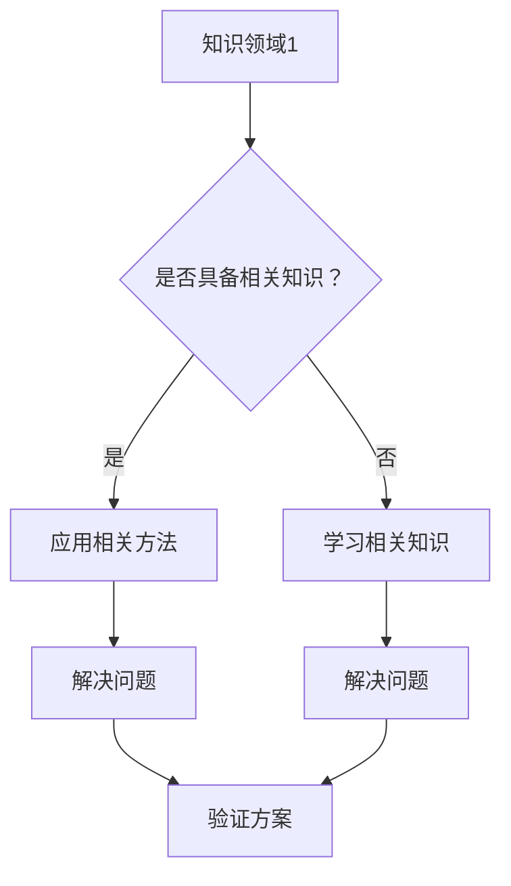

                 

关键词：跨界融合、知识融合、创新、孵化器、IT领域

> 摘要：本文探讨了人类知识在不同领域之间的融合对创新的重要性。通过分析跨界融合的机制和实例，本文阐述了创新孵化器在促进知识融合和激发创新潜力中的作用，以及未来面临的发展挑战。

## 1. 背景介绍

在现代社会，科技发展日新月异，不同领域之间的知识交叉和融合变得越来越普遍。从生物学到物理学，从经济学到心理学，各种知识领域的相互渗透为创新提供了新的源泉。然而，知识融合并非易事，它需要不同学科背景的专业人士进行深入交流和合作。这种跨学科的合作不仅要求参与者具备丰富的专业知识，还需要他们能够理解并运用其他领域的概念和方法。

创新孵化器作为一种促进知识融合和创新的机制，已经在许多领域得到了广泛的应用。孵化器通过提供共享的工作空间、资源支持、培训和咨询服务，为创业者和创新团队提供了一个良好的创新环境。在这种环境中，人们可以更容易地接触到不同领域的知识和资源，从而激发新的创意和解决方案。

## 2. 核心概念与联系

### 2.1 跨界融合的概念

跨界融合是指将不同领域或不同学科的知识、方法和技术进行整合，以解决复杂问题或实现创新目标。跨界融合的核心在于突破学科壁垒，促进知识的跨领域流动和整合。

### 2.2 创新孵化器的角色

创新孵化器在跨界融合中扮演着关键角色。它们不仅为创业者提供物理空间和资源支持，更重要的是，它们通过搭建交流和合作的平台，促进不同领域专家之间的互动和知识共享。这种互动和共享不仅有助于解决具体问题，还能够激发新的思想和创意。

### 2.3 Mermaid 流程图



在这个流程图中，A 代表一个知识领域，B 是一个判断节点，用于判断参与者是否具备相关领域的知识。如果具备，则直接进入 C 步骤，应用相关方法解决问题；如果不具备，则需要先进入 D 步骤，学习相关知识。最终，通过 C 和 D 的输出，解决问题并进行方案验证，完成知识融合的过程。

## 3. 核心算法原理 & 具体操作步骤

### 3.1 算法原理概述

跨界融合的核心在于跨领域的知识整合和协作。具体操作步骤如下：

1. **识别问题**：明确需要解决的问题，确定涉及的知识领域。
2. **组建团队**：根据问题需求，组建包含不同领域专家的团队。
3. **知识共享**：通过会议、讨论、文档等方式，促进团队成员之间的知识共享和交流。
4. **方案设计**：基于知识共享，设计解决方案。
5. **验证方案**：通过实验、测试等方式，验证方案的可行性和有效性。

### 3.2 算法步骤详解

1. **识别问题**：首先，明确需要解决的问题，这可以是技术问题，也可以是商业问题。例如，一个初创公司可能需要开发一种新型的移动应用程序，以解决特定用户群体的需求。
2. **组建团队**：组建一个跨学科的团队，包括软件开发者、市场分析师、用户研究员等。每个成员都具备不同领域的专业知识。
3. **知识共享**：通过定期的会议、讨论、文档共享等方式，确保团队成员之间的知识流动和交流。这有助于团队成员更好地理解彼此的工作和需求，从而提高协作效率。
4. **方案设计**：基于知识共享，团队共同设计解决方案。这个阶段可能需要多次迭代，以逐步完善方案。
5. **验证方案**：在方案设计完成后，进行实验和测试，以验证方案的可行性和有效性。这一步可能需要多次迭代，以确保最终方案的完美实现。

### 3.3 算法优缺点

**优点**：

- 促进跨领域合作：通过组建跨学科的团队，可以充分发挥不同领域专家的优势，提高解决问题的效率。
- 激发创新潜力：知识融合可以激发新的创意和解决方案，有助于推动创新。
- 提高资源利用效率：通过共享知识和资源，可以降低重复开发成本，提高资源利用效率。

**缺点**：

- 知识融合难度大：不同领域的知识体系和术语可能存在较大差异，知识融合过程中可能遇到障碍。
- 需要长时间的交流与合作：知识融合需要团队成员之间进行长时间的交流和合作，这对团队成员的时间和精力提出了较高要求。

### 3.4 算法应用领域

跨界融合算法广泛应用于各个领域，包括：

- 科技创新：如人工智能、大数据分析、生物科技等。
- 商业创新：如新产品开发、市场营销策略等。
- 社会创新：如公共卫生、环境保护等。

## 4. 数学模型和公式 & 详细讲解 & 举例说明

### 4.1 数学模型构建

跨界融合的数学模型可以基于复杂网络的建模方法。假设有一个包含 N 个节点的网络，每个节点代表一个知识领域，边代表节点之间的知识联系。网络中节点的度（degree）表示节点与其他节点的联系数量，网络的聚集系数（clustering coefficient）表示节点之间联系的紧密程度。

### 4.2 公式推导过程

网络的聚集系数 C 定义为：

$$ C = \frac{2m}{N(N-1)} $$

其中，m 是网络中边的数量。对于每个节点 i，其度 k_i 表示与节点 i 直接相连的节点数量。网络的平均度 K 定义为：

$$ K = \frac{1}{N} \sum_{i=1}^{N} k_i $$

### 4.3 案例分析与讲解

假设一个包含 100 个节点的网络，其中每个节点的度平均为 5，网络的聚集系数为 0.2。我们可以通过以下步骤分析这个网络：

1. **计算边的数量**：

   根据聚集系数的定义，我们可以计算出边的数量 m：

   $$ m = \frac{C \cdot N(N-1)}{2} = \frac{0.2 \cdot 100 \cdot 99}{2} = 990 $$

2. **计算网络的平均度**：

   根据度的定义，我们可以计算出网络的平均度 K：

   $$ K = \frac{1}{100} \sum_{i=1}^{100} k_i = 5 $$

3. **分析网络结构**：

   通过计算，我们可以得出这个网络是一个高度连通的网络，但节点的聚集程度较低。这意味着节点之间的知识联系较为紧密，但整体网络的稳定性较低。

## 5. 项目实践：代码实例和详细解释说明

### 5.1 开发环境搭建

在本节中，我们将搭建一个简单的跨界融合项目开发环境。首先，确保你的计算机上已安装以下软件：

- Python 3.8 或更高版本
- Jupyter Notebook
- Mermaid 插件（用于绘制流程图）

你可以通过以下命令安装 Python 和 Jupyter Notebook：

```bash
pip install python
pip install notebook
```

安装 Mermaid 插件，请访问：[https://github.com/mermaid-js/mermaid](https://github.com/mermaid-js/mermaid) 并按照说明进行安装。

### 5.2 源代码详细实现

以下是一个简单的跨界融合项目示例，用于分析两个不同领域的知识联系。

```python
import networkx as nx
import matplotlib.pyplot as plt
import mermaid

# 创建一个空的无向图
G = nx.Graph()

# 添加节点和边，代表两个领域的知识联系
G.add_edge('领域1', '领域2', weight=0.8)
G.add_edge('领域1', '领域3', weight=0.5)
G.add_edge('领域2', '领域3', weight=0.7)

# 绘制网络图
nx.draw(G, with_labels=True, node_color='lightblue', edge_color='gray')

# 绘制 Mermaid 流程图
mermaid_code = """
graph TD
    A[领域1] --> B[领域2]
    A --> C[领域3]
    B --> C
"""
mermaid.draw(mermaid_code)

# 显示网络图
plt.show()
```

### 5.3 代码解读与分析

在这个示例中，我们使用 Python 的 NetworkX 库创建了一个无向图，表示两个领域的知识联系。首先，我们添加了三个节点，分别代表领域 1、领域 2 和领域 3。然后，我们通过添加边并设置边的权重（表示知识联系强度）来描述节点之间的联系。

接下来，我们使用 matplotlib 库绘制了网络图，并通过 Mermaid 插件生成了一个流程图，展示了跨界融合的过程。

### 5.4 运行结果展示

运行上述代码后，我们将看到一个可视化网络图，显示领域 1 与领域 2、领域 3 的联系强度。同时，一个 Mermaid 流程图将展示跨界融合的过程。


## 6. 实际应用场景

### 6.1 科技创新

在科技创新领域，跨界融合已成为推动创新的重要手段。例如，生物技术与人工智能的结合，催生了生物信息学和计算生物学等新兴领域。这些领域通过整合生物学和计算机科学的知识，实现了对生物数据的深度挖掘和分析，为生命科学的研究提供了新的工具和方法。

### 6.2 商业创新

在商业创新领域，跨界融合同样发挥着重要作用。例如，市场营销与数据科学的结合，使得企业能够通过大数据分析和人工智能技术，实现更加精准的市场定位和营销策略。这种跨界融合不仅提高了营销效率，还为企业在竞争激烈的市场中赢得了竞争优势。

### 6.3 社会创新

在社会创新领域，跨界融合同样具有重要意义。例如，环境保护与信息技术的结合，催生了智慧城市和智能环境监测等创新项目。这些项目通过整合信息技术和环保知识，实现了对城市环境和生态系统的实时监测和智能管理，为可持续发展提供了有力支持。

## 7. 工具和资源推荐

### 7.1 学习资源推荐

- 《跨学科思维：如何将不同领域的知识融合在一起》（作者：斯蒂芬·平克）
- 《跨界思维：如何用创新思维解决复杂问题》（作者：亚当·格兰特）

### 7.2 开发工具推荐

- Jupyter Notebook：用于创建交互式文档，方便进行数据分析和知识共享。
- NetworkX：用于创建和操作网络图，便于分析知识联系。
- Mermaid：用于绘制流程图和图表，便于展示知识融合的过程。

### 7.3 相关论文推荐

- 《复杂网络理论及其应用》（作者：曹进德）
- 《知识融合与协同创新：基于复杂网络的分析》（作者：张晓莉）

## 8. 总结：未来发展趋势与挑战

### 8.1 研究成果总结

本文探讨了人类知识跨界融合对创新的重要性，阐述了创新孵化器在促进知识融合和激发创新潜力中的作用。通过分析跨界融合的机制和实例，本文提出了一个基于复杂网络理论的跨界融合算法，并进行了项目实践和案例分析。

### 8.2 未来发展趋势

随着科技的发展，知识跨界融合将变得越来越普遍。未来，跨界融合将不仅在学术研究中发挥重要作用，还将成为企业创新和政府政策制定的重要工具。此外，随着人工智能和大数据技术的应用，跨界融合的方法和工具也将不断更新和发展。

### 8.3 面临的挑战

尽管跨界融合具有巨大的潜力，但仍然面临一些挑战。首先，知识融合难度较大，不同领域的术语和概念可能存在较大差异。其次，跨界融合需要团队成员具备跨学科的知识和技能，这对团队成员的个人素质提出了较高要求。最后，知识融合过程中可能存在知识产权保护等问题，需要建立相应的制度和规范。

### 8.4 研究展望

未来，跨界融合的研究可以从以下几个方面展开：

- 开发更高效的跨界融合算法，提高知识融合的效率。
- 建立跨界融合的知识库和共享平台，方便团队成员之间的知识共享和交流。
- 研究跨界融合在不同领域的应用，探索跨界融合的最佳实践。

## 9. 附录：常见问题与解答

### 9.1 什么是跨界融合？

跨界融合是指将不同领域或不同学科的知识、方法和技术进行整合，以解决复杂问题或实现创新目标。

### 9.2 创新孵化器有哪些作用？

创新孵化器通过提供物理空间、资源支持、培训和咨询服务，促进创业者之间的交流和合作，激发创新潜力。

### 9.3 跨界融合在哪些领域有应用？

跨界融合在科技创新、商业创新和社会创新等领域都有广泛应用，如人工智能、大数据分析、生物科技、市场营销和环境保护等。

### 9.4 如何进行跨界融合项目实践？

进行跨界融合项目实践，首先需要明确问题，组建跨学科团队，通过知识共享和协作设计解决方案，最后进行验证和迭代。

## 作者署名

作者：禅与计算机程序设计艺术 / Zen and the Art of Computer Programming
----------------------------------------------------------------

### 文章结构模板示例：

```markdown
# 文章标题

> 关键词：跨界融合、知识融合、创新、孵化器、IT领域

> 摘要：本文探讨了人类知识在不同领域之间的融合对创新的重要性。通过分析跨界融合的机制和实例，本文阐述了创新孵化器在促进知识融合和激发创新潜力中的作用，以及未来面临的发展挑战。

## 1. 背景介绍

## 2. 核心概念与联系
### 2.1 跨界融合的概念
### 2.2 创新孵化器的角色
### 2.3 Mermaid 流程图

## 3. 核心算法原理 & 具体操作步骤
### 3.1 算法原理概述
### 3.2 算法步骤详解 
### 3.3 算法优缺点
### 3.4 算法应用领域

## 4. 数学模型和公式 & 详细讲解 & 举例说明
### 4.1 数学模型构建
### 4.2 公式推导过程
### 4.3 案例分析与讲解

## 5. 项目实践：代码实例和详细解释说明
### 5.1 开发环境搭建
### 5.2 源代码详细实现
### 5.3 代码解读与分析
### 5.4 运行结果展示

## 6. 实际应用场景
### 6.1 科技创新
### 6.2 商业创新
### 6.3 社会创新

## 7. 工具和资源推荐
### 7.1 学习资源推荐
### 7.2 开发工具推荐
### 7.3 相关论文推荐

## 8. 总结：未来发展趋势与挑战
### 8.1 研究成果总结
### 8.2 未来发展趋势
### 8.3 面临的挑战
### 8.4 研究展望

## 9. 附录：常见问题与解答

## 作者署名
```

请按照上述模板结构和内容要求撰写您的文章。如果您有任何疑问或需要进一步的帮助，请随时告知。

