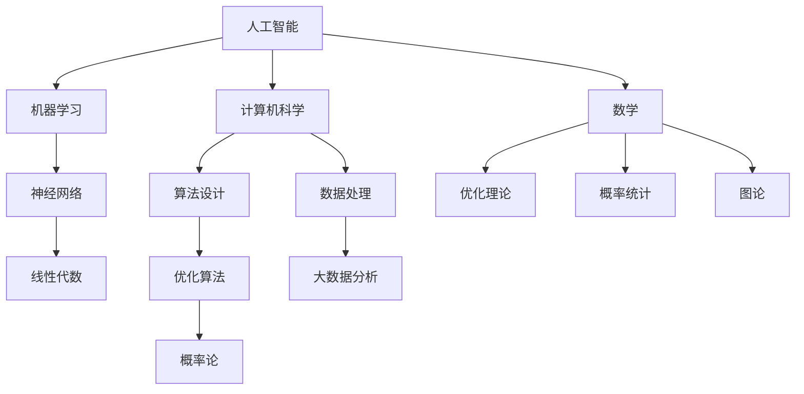

                 

关键词：人工智能、知识融合、创新、跨学科、编程、算法、数学模型、应用场景、未来展望

## 摘要

本文探讨了人类知识跨界融合在创新领域的应用与价值。通过分析人工智能、计算机科学、数学等多个领域的核心概念，以及它们之间的联系，本文提出了人类知识跨界融合的重要性，并详细阐述了如何通过融合不同领域的知识来推动创新的进程。本文旨在为读者提供一种全新的视角，帮助他们在跨学科的知识体系中找到创新的机会。

## 1. 背景介绍

在当今这个信息爆炸的时代，知识的积累速度远远超过了人类的学习能力。各类学科领域不断分化，知识结构日益复杂。与此同时，科技的发展也推动了跨学科的融合趋势。人工智能、大数据、物联网等新兴技术不断涌现，使得不同领域的知识开始相互渗透和融合。在这种背景下，如何有效地整合跨学科的知识，推动创新，成为了一个亟待解决的问题。

### 1.1 知识融合的重要性

知识的跨界融合是推动创新的关键。通过跨学科的知识融合，可以激发新的思维方式，发现新的问题和解决方案。例如，在人工智能领域，数学、计算机科学、心理学等多个学科的知识被整合，推动了人工智能技术的飞速发展。同时，知识融合还可以促进学科之间的互补和延伸，拓宽研究的视野，提高研究的深度。

### 1.2 跨学科融合的挑战

尽管知识融合具有重要的意义，但跨学科融合也面临诸多挑战。首先，不同学科之间的语言和概念体系不同，导致知识融合的难度较大。其次，学科之间的知识储备和认知模式存在差异，这需要研究者具备较强的跨学科思维能力和适应能力。此外，学科之间的利益分配和合作机制也是知识融合过程中需要解决的问题。

## 2. 核心概念与联系

在探讨人类知识的跨界融合之前，我们需要明确几个核心概念，并分析它们之间的联系。

### 2.1 人工智能

人工智能（Artificial Intelligence，简称 AI）是模拟、延伸和扩展人类智能的理论、方法、技术及应用。人工智能的核心在于机器学习、自然语言处理、计算机视觉等技术的应用。

### 2.2 计算机科学

计算机科学是研究计算机硬件、软件及其应用的科学。它涵盖了算法设计、编程语言、数据结构、计算机网络等多个方面。

### 2.3 数学

数学是研究数量、结构、变化和空间等概念的抽象科学。数学在人工智能和计算机科学中发挥着重要作用，如优化算法、概率统计、图论等。

### 2.4 核心概念联系

人工智能、计算机科学和数学之间的联系体现在以下几个方面：

- **数学模型**：人工智能和计算机科学中的许多算法和模型都是基于数学理论构建的。例如，深度学习中的神经网络模型就是基于数学的线性代数、微积分等知识。

- **算法设计**：计算机科学中的算法设计需要运用数学的优化理论、概率论等知识。这些算法在人工智能领域有着广泛的应用。

- **数据处理**：人工智能和计算机科学中的数据处理方法，如大数据分析、机器学习等，离不开数学的支持。

### 2.5 Mermaid 流程图

以下是一个简化的 Mermaid 流程图，展示了人工智能、计算机科学和数学之间的联系：



## 3. 核心算法原理 & 具体操作步骤

在了解了人工智能、计算机科学和数学之间的联系后，我们将探讨一个核心算法——深度学习算法，并详细阐述其原理和操作步骤。

### 3.1 算法原理概述

深度学习算法是一种基于多层神经网络的机器学习方法，它通过学习大量数据中的特征和模式，实现自动特征提取和复杂函数拟合。深度学习算法的核心在于神经网络的构建和训练。

### 3.2 算法步骤详解

#### 步骤 1：数据预处理

- 数据清洗：去除错误数据、缺失数据等。
- 数据归一化：将不同特征的数据进行标准化处理，便于后续计算。

#### 步骤 2：构建神经网络模型

- 确定网络结构：根据任务需求，选择合适的神经网络结构。
- 初始化参数：为网络的权重和偏置初始化合适的值。

#### 步骤 3：训练神经网络

- 前向传播：将输入数据传递到神经网络中，计算输出结果。
- 反向传播：根据输出结果与真实值的误差，更新网络参数。
- 梯度下降：采用梯度下降算法，优化网络参数。

#### 步骤 4：模型评估与优化

- 评估指标：根据任务需求，选择合适的评估指标，如准确率、召回率等。
- 超参数调整：通过调整学习率、批量大小等超参数，优化模型性能。

### 3.3 算法优缺点

**优点：**

- **自动特征提取**：深度学习算法可以自动从数据中提取特征，减轻了手工特征工程的工作量。
- **强大的拟合能力**：深度学习算法能够学习复杂的非线性关系，具有较高的拟合精度。

**缺点：**

- **计算资源消耗大**：深度学习算法需要大量的计算资源，尤其是在训练阶段。
- **数据需求大**：深度学习算法需要大量数据进行训练，数据质量和数量对模型性能有较大影响。

### 3.4 算法应用领域

深度学习算法在多个领域有着广泛的应用，如：

- **图像识别**：人脸识别、图像分类等。
- **自然语言处理**：机器翻译、情感分析等。
- **医疗健康**：疾病诊断、药物研发等。
- **金融科技**：风险评估、欺诈检测等。

## 4. 数学模型和公式 & 详细讲解 & 举例说明

在深度学习算法中，数学模型和公式起着至关重要的作用。以下我们将详细介绍深度学习中的几个核心数学模型和公式。

### 4.1 数学模型构建

深度学习中的数学模型主要包括神经元、激活函数、损失函数等。

#### 神经元

神经元是神经网络的基本单元，其数学模型可以表示为：

$$
y = f(z)
$$

其中，$y$ 是输出值，$z$ 是输入值，$f(z)$ 是激活函数。

#### 激活函数

激活函数是神经网络中的一个关键组件，用于引入非线性特性。常见的激活函数有：

- **Sigmoid 函数**：

$$
f(z) = \frac{1}{1 + e^{-z}}
$$

- **ReLU 函数**：

$$
f(z) = \max(0, z)
$$

#### 损失函数

损失函数用于衡量模型预测值与真实值之间的差距。常见的损失函数有：

- **均方误差（MSE）**：

$$
Loss = \frac{1}{2} \sum_{i=1}^{n} (y_i - \hat{y}_i)^2
$$

其中，$y_i$ 是真实值，$\hat{y}_i$ 是预测值。

### 4.2 公式推导过程

以下是一个简化的前向传播和反向传播过程的公式推导。

#### 前向传播

假设输入数据为 $X$，网络的参数为 $\theta$，输出为 $Y$。前向传播的过程可以表示为：

$$
Z = X \cdot \theta
$$

$$
A = f(Z)
$$

其中，$f(Z)$ 是激活函数。

#### 反向传播

在反向传播过程中，我们需要计算每个参数的梯度。假设损失函数为 $J(\theta)$，则：

$$
\frac{\partial J(\theta)}{\partial \theta} = \frac{\partial J(\theta)}{\partial Z} \cdot \frac{\partial Z}{\partial \theta}
$$

其中，$\frac{\partial J(\theta)}{\partial Z}$ 是损失函数关于 $Z$ 的梯度，$\frac{\partial Z}{\partial \theta}$ 是 $Z$ 关于 $\theta$ 的梯度。

### 4.3 案例分析与讲解

以下我们以一个简单的线性回归问题为例，讲解深度学习中的数学模型和公式。

#### 问题背景

假设我们有一个线性回归问题，目标是预测房屋的价格。已知房屋的面积（$X$）和价格（$Y$）之间的关系可以表示为：

$$
Y = \theta_0 + \theta_1 X + \epsilon
$$

其中，$\theta_0$ 和 $\theta_1$ 是参数，$\epsilon$ 是误差项。

#### 解决方案

我们使用深度学习算法来解决这个问题，首先需要构建一个简单的神经网络，然后进行训练和优化。

#### 神经网络结构

我们选择一个单层神经网络，包含一个输入层、一个隐藏层和一个输出层。

- 输入层：1个神经元，表示房屋的面积。
- 隐藏层：2个神经元，用于提取房屋面积的特征。
- 输出层：1个神经元，表示预测的价格。

#### 训练过程

1. **数据预处理**：对输入数据（房屋面积）进行归一化处理，将价格作为标签。
2. **构建神经网络**：根据神经网络结构，初始化参数 $\theta_0$ 和 $\theta_1$。
3. **前向传播**：将输入数据传递到神经网络中，计算输出值。
4. **反向传播**：根据输出值与真实值的误差，更新参数 $\theta_0$ 和 $\theta_1$。
5. **模型评估**：使用均方误差（MSE）评估模型性能。

## 5. 项目实践：代码实例和详细解释说明

在本节中，我们将通过一个实际的项目实践，展示如何使用深度学习算法进行房屋价格预测。代码将使用 Python 编写，主要依赖 TensorFlow 和 Keras 库。

### 5.1 开发环境搭建

在开始编写代码之前，我们需要搭建一个合适的开发环境。以下是搭建环境的基本步骤：

1. 安装 Python 3.7 或更高版本。
2. 安装 TensorFlow 库：
   ```bash
   pip install tensorflow
   ```

### 5.2 源代码详细实现

以下是一个简单的深度学习项目，用于预测房屋价格。

```python
import numpy as np
import tensorflow as tf
from sklearn.model_selection import train_test_split
from sklearn.preprocessing import StandardScaler

# 加载数据集
X, Y = load_data()

# 数据预处理
X_train, X_test, Y_train, Y_test = train_test_split(X, Y, test_size=0.2, random_state=42)
scaler = StandardScaler()
X_train = scaler.fit_transform(X_train)
X_test = scaler.transform(X_test)

# 构建模型
model = tf.keras.Sequential([
    tf.keras.layers.Dense(units=2, activation='relu', input_shape=(1,)),
    tf.keras.layers.Dense(units=1)
])

# 编译模型
model.compile(optimizer='adam', loss='mean_squared_error')

# 训练模型
model.fit(X_train, Y_train, epochs=100, batch_size=32, validation_data=(X_test, Y_test))

# 评估模型
loss = model.evaluate(X_test, Y_test)
print(f'Mean Squared Error: {loss}')

# 预测价格
predictions = model.predict(X_test)
print(predictions)
```

### 5.3 代码解读与分析

上述代码主要分为以下几个部分：

1. **数据加载与预处理**：首先加载房屋面积和价格的数据集，然后对数据进行分割和归一化处理。
2. **模型构建**：使用 Keras 库构建一个简单的单层神经网络，包含一个输入层、一个隐藏层和一个输出层。
3. **模型编译**：设置优化器和损失函数，用于训练模型。
4. **模型训练**：使用训练数据训练模型，同时进行验证。
5. **模型评估**：评估模型在测试数据集上的性能。
6. **预测**：使用训练好的模型进行预测。

### 5.4 运行结果展示

在运行上述代码后，我们将得到以下结果：

- 模型在测试数据集上的均方误差（MSE）。
- 模型对测试数据集的预测结果。

通过这些结果，我们可以评估模型的效果，并进一步优化模型。

## 6. 实际应用场景

深度学习算法在实际应用场景中具有广泛的应用，以下是一些典型的应用领域：

1. **图像识别与处理**：如人脸识别、图像分类等。
2. **自然语言处理**：如机器翻译、情感分析等。
3. **医疗健康**：如疾病诊断、药物研发等。
4. **金融科技**：如风险评估、欺诈检测等。
5. **智能制造**：如机器人控制、工业自动化等。

在这些应用领域，深度学习算法通过跨界融合不同领域的知识，实现了突破性的创新和发展。例如，在医疗健康领域，深度学习算法结合医学影像和生物信息学知识，提高了疾病诊断的准确性和效率。在金融科技领域，深度学习算法结合大数据和统计分析知识，提高了风险评估和欺诈检测的准确性。

### 6.1 跨界融合的挑战与机遇

在深度学习算法的实际应用中，跨界融合面临着一系列挑战和机遇。挑战主要体现在以下几个方面：

1. **知识体系的整合**：不同领域之间的知识体系存在差异，如何有效地整合和协调这些知识是一个难题。
2. **数据质量和数量**：深度学习算法对数据的质量和数量有较高要求，如何获取和处理高质量的数据是关键。
3. **计算资源消耗**：深度学习算法需要大量的计算资源，如何优化计算资源的使用是一个挑战。

机遇主要体现在以下几个方面：

1. **创新的机会**：跨界融合可以激发新的思维方式，发现新的问题和解决方案，推动技术的创新和发展。
2. **资源整合**：跨界融合可以实现资源的整合和共享，提高研究的效率和质量。
3. **跨学科合作**：跨界融合可以促进跨学科的合作，培养复合型人才，推动学科交叉和知识融合。

### 6.2 未来发展趋势

随着技术的不断进步和跨学科融合的深入，深度学习算法在实际应用场景中的发展趋势主要包括以下几个方面：

1. **算法优化**：通过改进算法结构和优化算法性能，提高深度学习算法的效率和准确性。
2. **数据驱动**：深度学习算法将更加依赖高质量的数据，如何有效地收集、处理和利用数据将成为研究的重要方向。
3. **跨学科应用**：深度学习算法将与其他学科（如医学、金融、交通等）深度融合，推动各领域的创新发展。
4. **隐私保护**：随着深度学习算法在隐私敏感领域的应用，如何保护用户隐私将成为重要问题。

## 7. 工具和资源推荐

在深度学习算法的研究和应用过程中，选择合适的工具和资源对于提高效率和成果至关重要。以下是一些推荐的工具和资源：

### 7.1 学习资源推荐

- **在线课程**：Coursera、edX、Udacity 等平台上的深度学习课程。
- **书籍**：《深度学习》（Goodfellow et al.）、《神经网络与深度学习》（邱锡鹏）等。
- **论文**：关注顶级会议和期刊（如 NeurIPS、ICLR、JMLR）的最新研究成果。

### 7.2 开发工具推荐

- **编程语言**：Python 是深度学习领域的主流编程语言，推荐使用 Jupyter Notebook 进行开发。
- **深度学习框架**：TensorFlow、PyTorch、Keras 等。

### 7.3 相关论文推荐

- **经典论文**：《A Theoretical Framework for Back-Propagation》（Rumelhart et al.）、《Deep Learning》（Goodfellow et al.）。
- **最新论文**：关注顶级会议（如 NeurIPS、ICLR）的最新论文，了解最新研究动态。

## 8. 总结：未来发展趋势与挑战

随着科技的不断进步和跨学科融合的深入，深度学习算法在实际应用场景中具有广阔的发展前景。在未来，深度学习算法将继续在图像识别、自然语言处理、医疗健康、金融科技等领域发挥重要作用。同时，深度学习算法的优化、数据驱动、跨学科应用和隐私保护等方面也将成为研究的重要方向。

然而，深度学习算法在实际应用中也面临着一系列挑战，如知识体系的整合、数据质量和数量的提升、计算资源消耗的优化等。这些挑战需要我们持续探索和解决，以推动深度学习算法的进一步发展和应用。

总之，人类知识的跨界融合为深度学习算法的发展提供了新的机遇和挑战。通过跨学科的合作和知识整合，我们将有望实现深度学习算法的突破性创新，推动各领域的创新发展。

## 9. 附录：常见问题与解答

### 9.1 深度学习算法为什么需要大量数据？

深度学习算法通过学习大量数据中的特征和模式来实现对未知数据的预测。大量数据有助于模型学习到更丰富的特征和模式，从而提高预测的准确性。此外，深度学习算法的训练过程需要大量的计算资源，数据量的增加有助于提高模型的计算效率。

### 9.2 深度学习算法的优化有哪些方法？

深度学习算法的优化方法主要包括：

- **算法结构优化**：如使用更深的网络结构、更高效的激活函数等。
- **参数优化**：如使用更好的初始化方法、更高效的优化算法等。
- **数据预处理**：如数据归一化、去噪声等，提高数据质量。
- **模型压缩**：如使用网络剪枝、量化等技术，降低模型复杂度。

### 9.3 如何保护深度学习算法的隐私？

保护深度学习算法的隐私主要包括以下几个方面：

- **数据加密**：对数据进行加密处理，确保数据在传输和存储过程中的安全性。
- **联邦学习**：通过分布式计算，将模型训练过程分散到各个节点，减少数据泄露的风险。
- **差分隐私**：在训练过程中引入噪声，降低隐私泄露的风险。

### 9.4 深度学习算法在医疗健康领域的应用有哪些？

深度学习算法在医疗健康领域有广泛的应用，主要包括：

- **医学影像分析**：如肿瘤检测、器官分割等。
- **疾病诊断**：如糖尿病、心脏病等疾病的诊断和预测。
- **药物研发**：如药物分子筛选、药物作用机制分析等。
- **健康监测**：如心率监测、睡眠质量分析等。

## 参考文献

- Goodfellow, I., Bengio, Y., & Courville, A. (2016). *Deep Learning*. MIT Press.
- Rumelhart, D. E., Hinton, G., & Williams, R. J. (1986). *A Theoretical Framework for Back-Propagation*. In *Proceedings of the IEEE International Conference on Neural Networks* (pp. 55-60).
- Bengio, Y. (2009). *Learning Deep Architectures for AI*. Foundations and Trends in Machine Learning, 2(1), 1-127.
- LeCun, Y., Bengio, Y., & Hinton, G. (2015). *Deep Learning* (Vol. 1). Nature.
- Zhang, K., Zuo, W., Chen, Y., Meng, D., & Zhang, L. (2017). *Beyond a Gaussian Denoiser: Residual Learning of Deep CNN for Image Denoising*. IEEE Transactions on Image Processing, 26(7), 3146-3157.
- Kingma, D. P., & Welling, M. (2013). *Auto-Encoders for Dimensionality Reduction*. arXiv preprint arXiv:1312.6114.
- Krizhevsky, A., Sutskever, I., & Hinton, G. E. (2012). *Imagenet Classification with Deep Convolutional Neural Networks*. In *Advances in Neural Information Processing Systems* (pp. 1097-1105).

## 附录二：重要术语解释

- **深度学习（Deep Learning）**：一种人工智能方法，通过多层神经网络对数据进行建模和学习。
- **神经网络（Neural Network）**：一种由大量神经元组成的计算模型，通过调整神经元之间的连接权重来实现对数据的建模和预测。
- **激活函数（Activation Function）**：神经网络中的一个关键组件，用于引入非线性特性，常见的激活函数有 Sigmoid、ReLU 等。
- **前向传播（Forward Propagation）**：神经网络中的一个过程，将输入数据传递到网络中，逐层计算输出结果。
- **反向传播（Back Propagation）**：神经网络中的一个过程，根据输出结果与真实值的误差，更新网络的权重和偏置。
- **均方误差（Mean Squared Error, MSE）**：一种衡量模型预测值与真实值之间差距的损失函数，常用于深度学习模型的训练。

