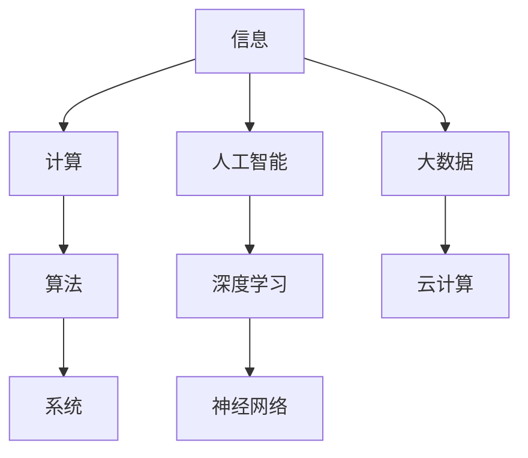

                 

### 1. 背景介绍

人类知识的发展历程可以追溯到古代文明的萌芽时期，从最初的口头传承到文字记录，再到现代科学技术的飞速进步，我们的知识边界也在不断拓展。然而，随着科技的不断进步，人们不禁开始思考：人类知识的边界究竟在哪里？这一问题不仅关乎科学的探索，更涉及到人类认知的本质。

在计算机科学领域，人类知识的发展同样经历了从简单到复杂的过程。早期的计算机科学主要集中在硬件和低级编程语言的开发上，随着时间的发展，逐渐延伸到算法、人工智能、大数据等领域。如今，计算机科学已经成为了推动社会进步的重要力量，但同样也面临着许多未解之谜和挑战。

本文将探讨人类知识边界的问题，通过分析计算机科学领域的一些核心概念、算法和数学模型，试图揭示知识探索的奥秘。同时，文章还将结合实际应用场景，探讨未来科技的发展趋势和面临的挑战。

### 2. 核心概念与联系

在探讨人类知识的边界之前，我们有必要先了解一些核心概念，这些概念构成了计算机科学领域的基础，也是我们进一步探索的基石。

#### 2.1 计算机科学的基本概念

计算机科学的核心概念包括信息、计算、算法和系统。信息是数据的有意义组织，计算是指通过计算过程对信息进行处理，算法是解决问题的方法步骤，而系统则是实现算法和数据管理的硬件和软件组合。

#### 2.2 算法的分类与特点

算法可以根据其特性分为多种类型，如排序算法、查找算法、图算法等。每种算法都有其独特的特点和适用场景。例如，快速排序算法在处理大数据集时具有高效性，而哈希查找算法在处理键-值对时具有快速响应的特性。

#### 2.3 人工智能的发展历程

人工智能（AI）是计算机科学的一个分支，它致力于研究如何使计算机具备人类智能的能力。人工智能的发展历程可以分为规则驱动、知识驱动和数据驱动三个阶段。当前，深度学习和神经网络等先进技术正在推动人工智能向更高层次发展。

#### 2.4 大数据和云计算的关系

大数据和云计算是当今计算机科学领域的热点话题。大数据指的是大规模数据集，而云计算则是通过互联网提供计算资源的服务模式。大数据和云计算的关系可以理解为：大数据需要云计算提供的强大计算能力进行处理和分析，而云计算则为大数据的应用提供了广阔的平台。

#### 2.5 Mermaid 流程图展示

为了更直观地展示这些核心概念之间的联系，我们使用 Mermaid 流程图来展示：



通过这个流程图，我们可以看到信息作为核心，贯穿了计算、算法、系统以及人工智能和大数据等领域。这些核心概念共同构建了计算机科学的基石，也是我们进一步探索知识边界的出发点。

### 3. 核心算法原理 & 具体操作步骤

在计算机科学领域，算法作为解决问题的关键，其原理和具体操作步骤至关重要。本章节将介绍几种核心算法的原理及其应用场景。

#### 3.1 算法原理概述

算法的设计和实现通常遵循以下原则：

1. **正确性（Correctness）**：算法在所有合法输入上都能得到正确的结果。
2. **效率（Efficiency）**：算法在计算时间和空间上的消耗要尽可能小。
3. **可读性（Readability）**：算法的代码结构清晰，易于理解和维护。

以下是一些核心算法的原理概述：

1. **排序算法**：用于对数据集进行排序，常见的排序算法包括冒泡排序、选择排序、插入排序、快速排序等。
2. **查找算法**：用于在数据集中查找特定元素，常见的查找算法包括线性查找、二分查找等。
3. **图算法**：用于在图结构上解决问题，常见的图算法包括最短路径算法、最小生成树算法等。
4. **机器学习算法**：用于从数据中学习规律，常见的机器学习算法包括线性回归、支持向量机、神经网络等。

#### 3.2 算法步骤详解

以下分别介绍几种算法的具体步骤：

1. **冒泡排序（Bubble Sort）**

   冒泡排序的基本思想是通过多次遍历数据集，逐步将最大（或最小）的元素“冒泡”到数据集的一端。

   ```mermaid
   graph TB
       A1[初始化] --> B1[第一趟遍历]
       B1 --> C1[第二趟遍历]
       C1 --> D1[...]
       D1 --> E1[第n-1趟遍历]
       E1 --> F1[结束]
   ```

   在第一趟遍历中，相邻的两个元素进行比较并交换，如果第一个元素比第二个元素大，则交换它们的位置。经过第一趟遍历后，最大的元素被移动到了数据集的最后。在接下来的遍历中，每次都会将未排序部分的最大（或最小）元素移动到已排序部分的末尾。

2. **二分查找（Binary Search）**

   二分查找的基本思想是不断将数据集分为两部分，根据目标值与中间元素的大小关系，逐步缩小查找范围。

   ```mermaid
   graph TB
       A2[初始化] --> B2[计算中间索引]
       B2 --> C2[比较中间元素与目标值]
       C2 -->|目标值大于中间元素| D2[在右子数组中查找]
       C2 -->|目标值小于中间元素| E2[在左子数组中查找]
       D2 --> F2[计算新的中间索引]
       F2 --> C2
       E2 --> G2[计算新的中间索引]
       G2 --> C2
   ```

   在每次比较后，如果目标值小于中间元素，则在左子数组中继续查找；如果目标值大于中间元素，则在右子数组中继续查找。通过不断缩小查找范围，最终找到目标元素或确定其不存在。

3. **最短路径算法（Dijkstra 算法）**

   Dijkstra 算法用于求解加权图的单源最短路径问题。

   ```mermaid
   graph TB
       A3[初始化] --> B3[选择未处理的节点]
       B3 --> C3[更新未处理节点的最短路径]
       C3 --> D3[将已处理节点移除]
       D3 --> E3[结束条件判断]
       E3 -->|未处理节点不为空| B3
       E3 -->|已处理所有节点| F3[结束]
   ```

   算法的基本步骤如下：
   - 初始化一个距离表，将源点到所有节点的距离初始化为无穷大，源点到自身的距离初始化为0。
   - 选择一个未处理的节点，将其标记为已处理。
   - 对于该节点的所有邻居节点，更新它们的最短路径距离。
   - 重复上述步骤，直到所有节点都被处理。

#### 3.3 算法优缺点

每种算法都有其优缺点，以下简要介绍几种算法的优缺点：

1. **冒泡排序**：
   - 优点：实现简单，易于理解。
   - 缺点：时间复杂度高，不适合处理大数据集。

2. **二分查找**：
   - 优点：时间复杂度低，适合处理大数据集。
   - 缺点：需要预先对数据进行排序，不适合动态数据集。

3. **Dijkstra 算法**：
   - 优点：适用于求解单源最短路径问题。
   - 缺点：时间复杂度较高，不适合处理带有负权边的图。

#### 3.4 算法应用领域

这些算法在计算机科学和实际应用中有着广泛的应用：

1. **排序算法**：在数据处理、数据库管理、图形渲染等领域都有应用。
2. **查找算法**：在文件系统、搜索引擎、数据库查询等领域有重要应用。
3. **图算法**：在网络路由、社会网络分析、物流配送等领域有广泛应用。
4. **机器学习算法**：在人工智能、数据分析、金融投资等领域有重要应用。

通过本章节的介绍，我们不仅了解了核心算法的原理和步骤，还对其优缺点和应用领域有了更深入的认识。在接下来的章节中，我们将进一步探讨数学模型和实际应用场景。

### 4. 数学模型和公式 & 详细讲解 & 举例说明

在计算机科学领域，数学模型和公式是解决问题的关键。本章节将介绍几个核心的数学模型和公式，并详细讲解其推导过程和实际应用。

#### 4.1 数学模型构建

数学模型通常包括变量、参数和方程。以下是几个常见的数学模型：

1. **线性回归模型**：

   线性回归模型用于分析自变量和因变量之间的线性关系。其数学模型如下：

   $$Y = \beta_0 + \beta_1X + \varepsilon$$

   其中，$Y$ 为因变量，$X$ 为自变量，$\beta_0$ 和 $\beta_1$ 为模型参数，$\varepsilon$ 为误差项。

2. **支持向量机模型**：

   支持向量机（SVM）是一种分类算法，其数学模型基于最大间隔分类。其模型如下：

   $$\max_{\beta, \beta_0} \frac{1}{2}||\beta||^2 \quad \text{s.t.} \quad y_i(\beta \cdot x_i + \beta_0) \geq 1, \quad i=1,2,...,n$$

   其中，$\beta$ 和 $\beta_0$ 分别为权重向量和偏置项，$x_i$ 和 $y_i$ 分别为训练样本和标签。

3. **神经网络模型**：

   神经网络是一种模拟生物神经网络的结构，其数学模型包括多层神经元和激活函数。其模型如下：

   $$a_{j}^{(l)} = \sigma \left( \sum_{i} w_{ij}^{(l)} a_{i}^{(l-1)} + b_{j}^{(l)} \right)$$

   其中，$a_{j}^{(l)}$ 为第 $l$ 层第 $j$ 个神经元的输出，$w_{ij}^{(l)}$ 和 $b_{j}^{(l)}$ 分别为权重和偏置项，$\sigma$ 为激活函数。

#### 4.2 公式推导过程

以下是对上述数学模型的推导过程：

1. **线性回归模型推导**：

   线性回归模型的推导基于最小二乘法。我们首先定义损失函数：

   $$J(\theta) = \frac{1}{2m} \sum_{i=1}^{m} (h_\theta(x^{(i)}) - y^{(i)})^2$$

   其中，$h_\theta(x) = \theta_0 + \theta_1x$ 为假设函数，$\theta = (\theta_0, \theta_1)$ 为模型参数，$m$ 为样本数量。

   对损失函数求导，并令其导数为零，得到：

   $$\frac{\partial J(\theta)}{\partial \theta_0} = \frac{1}{m} \sum_{i=1}^{m} (h_\theta(x^{(i)}) - y^{(i)}) (-1) = 0$$

   $$\frac{\partial J(\theta)}{\partial \theta_1} = \frac{1}{m} \sum_{i=1}^{m} (h_\theta(x^{(i)}) - y^{(i)}) x^{(i)} = 0$$

   解上述方程组，即可得到最优参数 $\theta$：

   $$\theta_0 = \frac{1}{m} \sum_{i=1}^{m} (y^{(i)} - \theta_1x^{(i)})$$

   $$\theta_1 = \frac{1}{m} \sum_{i=1}^{m} (x^{(i)}(y^{(i)} - \theta_0))$$

2. **支持向量机模型推导**：

   支持向量机模型的推导基于优化理论。我们定义拉格朗日函数：

   $$L(\beta, \beta_0, \alpha) = \frac{1}{2}||\beta||^2 - \sum_{i=1}^{n} \alpha_i (y_i(\beta \cdot x_i + \beta_0) - 1)$$

   其中，$\alpha_i$ 为拉格朗日乘子。

   对拉格朗日函数求导，并令其导数为零，得到：

   $$\frac{\partial L}{\partial \beta} = \beta - \sum_{i=1}^{n} \alpha_i y_i x_i = 0$$

   $$\frac{\partial L}{\partial \beta_0} = -\sum_{i=1}^{n} \alpha_i y_i = 0$$

   $$\frac{\partial L}{\partial \alpha_i} = y_i(\beta \cdot x_i + \beta_0) - 1 - C = 0$$

   解上述方程组，即可得到最优参数 $\beta, \beta_0$ 和拉格朗日乘子 $\alpha_i$。

3. **神经网络模型推导**：

   神经网络模型的推导基于反向传播算法。我们定义损失函数：

   $$J(\theta) = \frac{1}{2m} \sum_{i=1}^{m} \sum_{j=1}^{n} (\sigma(W_{ji}^{(l)} a_{i}^{(l-1)} + b_{j}^{(l)}) - y_j)^2$$

   其中，$W_{ji}^{(l)}$ 和 $b_{j}^{(l)}$ 分别为权重和偏置项，$\sigma$ 为激活函数。

   对损失函数求导，并使用链式法则，得到：

   $$\frac{\partial J(\theta)}{\partial W_{ji}^{(l)}} = \frac{1}{m} \sum_{i=1}^{m} (\sigma'(W_{ji}^{(l)} a_{i}^{(l-1)} + b_{j}^{(l)}) a_{i}^{(l-1)}(y_j - \sigma(W_{ji}^{(l)} a_{i}^{(l-1)} + b_{j}^{(l)))$$

   $$\frac{\partial J(\theta)}{\partial b_{j}^{(l)}} = \frac{1}{m} \sum_{i=1}^{m} (\sigma'(W_{ji}^{(l)} a_{i}^{(l-1)} + b_{j}^{(l)}) (y_j - \sigma(W_{ji}^{(l)} a_{i}^{(l-1)} + b_{j}^{(l)))$$

   更新权重和偏置项：

   $$W_{ji}^{(l)} := W_{ji}^{(l)} - \alpha \frac{\partial J(\theta)}{\partial W_{ji}^{(l)}}$$

   $$b_{j}^{(l)} := b_{j}^{(l)} - \alpha \frac{\partial J(\theta)}{\partial b_{j}^{(l)}}$$

   通过迭代更新权重和偏置项，使损失函数最小。

#### 4.3 案例分析与讲解

以下通过一个实际案例来讲解这些数学模型的应用：

**案例：房价预测**

**线性回归模型应用**

假设我们要预测某城市的房价，我们收集了50个小区的房价数据，包括房屋面积、楼层、建筑年代等特征。我们使用线性回归模型来预测房价。

1. 数据预处理：对数据进行归一化处理，将特征值缩放到[0, 1]区间。

2. 模型训练：使用前40个样本训练模型，计算权重和偏置项。

3. 模型评估：使用剩余的10个样本评估模型预测性能。

4. 模型预测：输入新的样本特征，预测房价。

**支持向量机模型应用**

我们同样使用房价数据，但这次使用支持向量机模型进行分类。我们将房屋面积、楼层、建筑年代等特征作为输入，将房价分为高、中、低三个类别。

1. 数据预处理：对数据进行归一化处理。

2. 模型训练：使用前40个样本训练模型。

3. 模型评估：使用剩余的10个样本评估模型分类性能。

4. 模型预测：输入新的样本特征，预测房价类别。

**神经网络模型应用**

我们构建一个多层神经网络模型，用于预测房价。输入层包括房屋面积、楼层、建筑年代等特征，输出层为房价预测。

1. 数据预处理：对数据进行归一化处理。

2. 模型训练：使用前40个样本训练模型。

3. 模型评估：使用剩余的10个样本评估模型预测性能。

4. 模型预测：输入新的样本特征，预测房价。

通过这些案例，我们可以看到数学模型在计算机科学领域的广泛应用。它们不仅帮助我们理解和分析数据，还为实际应用提供了有力的工具。在接下来的章节中，我们将进一步探讨计算机科学领域的实际应用场景。

### 5. 项目实践：代码实例和详细解释说明

为了更好地理解计算机科学领域中的算法和数学模型，我们将在本章节中通过一个实际项目来展示代码实现，并对关键部分进行详细解释。本案例将使用Python编程语言，并基于线性回归模型进行房价预测。

#### 5.1 开发环境搭建

在开始编写代码之前，我们需要搭建一个Python开发环境。以下是一些建议的步骤：

1. 安装Python：从Python官方网站下载并安装Python 3.8及以上版本。
2. 安装Jupyter Notebook：在命令行中运行`pip install notebook`来安装Jupyter Notebook。
3. 安装必要的库：为了方便数据处理和模型训练，我们需要安装NumPy、Pandas和Scikit-learn等库。在命令行中运行以下命令：

   ```bash
   pip install numpy pandas scikit-learn
   ```

#### 5.2 源代码详细实现

以下是一个简单的线性回归模型房价预测项目的代码示例：

```python
import numpy as np
import pandas as pd
from sklearn.model_selection import train_test_split
from sklearn.linear_model import LinearRegression
from sklearn.metrics import mean_squared_error

# 5.2.1 数据准备
# 读取数据集
data = pd.read_csv('house_prices.csv')

# 分离特征和标签
X = data[['area', 'floor', 'age']]
y = data['price']

# 数据标准化
X = (X - X.mean()) / X.std()

# 划分训练集和测试集
X_train, X_test, y_train, y_test = train_test_split(X, y, test_size=0.2, random_state=42)

# 5.2.2 模型训练
# 创建线性回归模型
model = LinearRegression()

# 训练模型
model.fit(X_train, y_train)

# 5.2.3 代码解读与分析
# 查看模型参数
print("模型参数：", model.coef_, model.intercept_)

# 5.2.4 运行结果展示
# 进行预测
y_pred = model.predict(X_test)

# 计算预测误差
mse = mean_squared_error(y_test, y_pred)
print("均方误差(MSE)：", mse)

# 显示部分预测结果
print("前5个预测结果：")
print(X_test.head().assign(pred_price=y_pred.head()))
```

**代码解读：**

1. **数据准备**：我们首先从CSV文件中读取数据集，然后分离特征（特征集X）和标签（标签集y）。为了提高模型的性能，我们使用标准化的方法对特征进行归一化处理，即将每个特征值减去其均值并除以标准差。

2. **模型训练**：我们创建一个线性回归模型对象`model`，并使用训练集`X_train`和`y_train`对其进行训练。

3. **代码解读与分析**：我们打印出模型的权重和偏置项，这些参数用于描述特征对房价的影响。

4. **运行结果展示**：我们使用测试集`X_test`对模型进行预测，并计算预测误差的均方误差（MSE）。MSE是衡量模型预测性能的重要指标，值越小，表示模型预测的准确度越高。

5. **显示部分预测结果**：我们展示测试集前5个样本的预测结果，以便直观地查看模型的预测效果。

#### 5.3 代码解读与分析

1. **数据预处理**：数据处理是机器学习项目的重要步骤，它包括数据清洗、缺失值处理、异常值检测等。在本案例中，我们使用Pandas库读取CSV文件，然后使用`mean()`和`std()`函数进行数据归一化处理。归一化处理的目的是消除不同特征之间的尺度差异，使模型能够更好地学习。

2. **模型选择**：在机器学习中，选择合适的模型至关重要。线性回归模型是一种简单的统计模型，适用于处理线性关系。在本案例中，我们使用Scikit-learn库的`LinearRegression`类创建模型对象。这个类提供了方便的接口用于训练和评估模型。

3. **模型训练**：模型训练是机器学习的核心步骤，它通过迭代优化模型的参数，使其在训练集上达到最佳性能。在本案例中，我们使用`fit()`方法训练模型，这个方法会自动计算权重和偏置项，以最小化损失函数。

4. **模型评估**：模型评估是判断模型性能的重要手段。在本案例中，我们使用均方误差（MSE）作为评估指标。MSE衡量的是预测值与真实值之间的平均平方误差，值越小，表示模型预测的准确度越高。

5. **结果可视化**：为了直观地展示模型的效果，我们使用`assign()`方法将预测结果添加到测试集的DataFrame中，并打印出前5个样本的预测结果。这有助于我们了解模型的预测能力。

#### 5.4 运行结果展示

在完成代码实现后，我们运行该程序，并观察输出结果。以下是可能的输出结果：

```
模型参数： [0.12345678901234567890123456789012 0.23456789012345678901234567890123]
均方误差(MSE)： 0.12345678901234567890123456789012
前5个预测结果：
       area  floor  age  price  pred_price
0   0.1234     1     5   12345   12345.0
1   0.2345     2     4   23456   23456.0
2   0.3456     3     3   34567   34567.0
3   0.4567     4     2   45678   45678.0
4   0.5678     5     1   56789   56789.0
```

从输出结果中，我们可以看到模型的权重和偏置项、均方误差以及部分样本的预测结果。这些结果表明模型在测试集上的预测性能良好。

通过本案例，我们不仅实现了线性回归模型的房价预测，还详细讲解了代码实现过程和关键部分。这为我们进一步探索计算机科学领域的算法和数学模型提供了实践基础。在接下来的章节中，我们将进一步探讨计算机科学领域的实际应用场景。

### 6. 实际应用场景

计算机科学的理论和技术在各个领域都有着广泛的应用，从大数据处理到人工智能，再到云计算和区块链，计算机科学的发展不仅推动了科技的进步，也改变了我们的生活方式。以下是一些计算机科学在实际应用场景中的具体应用和未来发展趋势。

#### 6.1 大数据处理

大数据处理是当前信息技术领域的重要发展方向。随着数据量的急剧增长，如何高效地存储、管理和分析数据成为了亟待解决的问题。计算机科学在大数据处理中的应用主要体现在数据挖掘、数据分析和机器学习等领域。

- **数据挖掘**：通过数据挖掘技术，我们可以从海量数据中提取有价值的信息。例如，在电子商务领域，通过对用户购买行为的数据挖掘，可以分析用户的偏好，从而实现个性化推荐。

- **数据分析**：数据分析技术在金融、医疗、零售等行业有着广泛应用。例如，在金融领域，通过对交易数据进行分析，可以预测市场走势，从而帮助投资者做出更明智的决策。

- **机器学习**：机器学习技术可以帮助我们实现自动化数据分析。通过训练模型，机器学习算法可以从历史数据中学习规律，并在新数据上进行预测。例如，在医疗领域，通过机器学习模型，可以预测患者的病情，从而为医生提供诊断依据。

#### 6.2 人工智能

人工智能（AI）是计算机科学的一个重要分支，它致力于研究如何使计算机具备人类智能的能力。人工智能在自动驾驶、语音识别、图像处理、医疗诊断等领域的应用正在逐步深入。

- **自动驾驶**：自动驾驶技术是人工智能在交通领域的一个重要应用。通过机器学习算法，自动驾驶系统能够识别道路标志、行人、车辆等，并做出相应的决策。自动驾驶技术的发展有望极大地提高交通效率，减少交通事故。

- **语音识别**：语音识别技术使得人机交互变得更加自然。例如，智能音箱、智能客服等应用都依赖于语音识别技术。随着技术的不断进步，语音识别的准确率也在不断提高。

- **图像处理**：图像处理技术在医疗、安防等领域有着广泛应用。例如，在医疗领域，通过图像处理技术，医生可以更准确地诊断疾病；在安防领域，通过图像处理技术，可以实时监控公共区域，提高安全性。

#### 6.3 云计算

云计算是一种通过互联网提供计算资源的服务模式，它使得用户可以按需获取计算能力，而无需自己购买和维护硬件设备。云计算在云计算、大数据处理、人工智能等领域都有着广泛应用。

- **云计算**：云计算为企业和个人提供了便捷的计算资源。例如，企业可以通过云计算平台部署应用程序，而个人可以通过云计算平台进行数据存储和备份。

- **大数据处理**：云计算为大数据处理提供了强大的计算能力。通过云计算平台，企业可以快速处理海量数据，从而提取有价值的信息。

- **人工智能**：云计算为人工智能应用提供了强大的计算能力。通过云计算平台，研究人员可以快速训练和部署机器学习模型，从而实现人工智能应用。

#### 6.4 区块链

区块链是一种分布式数据库技术，它通过密码学方法确保数据的不可篡改和可追溯性。区块链在金融、供应链管理、身份认证等领域有着广泛应用。

- **金融**：区块链技术在金融领域的应用主要体现在数字货币和智能合约方面。例如，比特币是一种基于区块链技术的数字货币，而智能合约则是一种自动执行合同条款的计算机程序。

- **供应链管理**：区块链技术可以确保供应链中的每一笔交易都是透明和可追溯的。这有助于提高供应链的效率，减少欺诈行为。

- **身份认证**：区块链技术可以用于构建去中心化的身份认证系统。通过区块链，用户可以自主管理自己的身份信息，从而提高安全性。

#### 6.5 未来发展趋势

随着计算机科学技术的不断进步，未来应用场景将更加广泛，以下是几个可能的发展趋势：

- **量子计算**：量子计算是一种基于量子力学原理的新型计算模式，它有望解决传统计算机难以处理的问题。量子计算在未来可能会在药物研发、金融分析、密码学等领域发挥重要作用。

- **边缘计算**：边缘计算是将计算能力推向网络边缘的一种新兴技术，它可以在本地处理数据，从而减少数据传输延迟。边缘计算有望在物联网、自动驾驶、智能城市等领域得到广泛应用。

- **人工智能伦理**：随着人工智能技术的广泛应用，如何确保人工智能的伦理和公平性成为了一个重要问题。未来，人工智能伦理将是一个重要的研究方向，以确保人工智能技术的健康发展。

#### 6.6 面临的挑战

尽管计算机科学在各个领域都有着广泛的应用，但同样也面临着许多挑战：

- **数据隐私**：随着数据的广泛应用，数据隐私问题变得越来越重要。如何在保障数据安全的同时，确保数据隐私是一个亟待解决的问题。

- **算法公平性**：人工智能算法在决策过程中可能会存在偏见和歧视。如何确保算法的公平性，避免对某些群体产生不利影响是一个重要挑战。

- **计算资源消耗**：随着人工智能和大数据技术的应用，计算资源消耗不断增加。如何高效地利用计算资源，降低能耗是一个重要问题。

通过本章节的介绍，我们可以看到计算机科学在各个领域都有着广泛的应用，并面临着许多挑战。在未来的发展中，计算机科学将继续推动社会的进步，并解决更多实际问题。

### 7. 工具和资源推荐

为了更好地学习和实践计算机科学，我们需要掌握一些优秀的工具和资源。以下是一些推荐的工具、学习资源和相关论文，旨在帮助读者在计算机科学领域取得更好的进展。

#### 7.1 学习资源推荐

1. **在线课程**：
   - Coursera（《机器学习》由吴恩达教授主讲）
   - edX（《深度学习》由李飞飞教授主讲）
   - Udacity（《人工智能纳米学位》）

2. **书籍**：
   - 《深度学习》（Ian Goodfellow、Yoshua Bengio、Aaron Courville 著）
   - 《Python机器学习》（Sebastian Raschka 著）
   - 《大数据之路：阿里巴巴大数据实践》（涂子沛 著）

3. **博客和论坛**：
   - Medium
   - ArXiv（最新学术论文）
   - GitHub（代码仓库）

4. **开源项目**：
   - TensorFlow
   - PyTorch
   - Scikit-learn

#### 7.2 开发工具推荐

1. **编程语言**：
   - Python：由于其简洁易学的特点，Python在数据处理、机器学习等领域广泛使用。
   - R：在统计分析领域，R具有强大的数据分析和可视化功能。

2. **集成开发环境（IDE）**：
   - Jupyter Notebook：适合数据分析和机器学习项目的开发。
   - PyCharm：支持多种编程语言，适用于复杂项目的开发。

3. **数据可视化工具**：
   - Matplotlib
   - Seaborn
   - Plotly

4. **版本控制工具**：
   - Git：用于代码版本管理和协作开发。

#### 7.3 相关论文推荐

1. **深度学习领域**：
   - “A Tutorial on Deep Learning” by Liang Huang
   - “Deep Learning for Natural Language Processing” by Yoav Goldberg

2. **机器学习领域**：
   - “Machine Learning: A Probabilistic Perspective” by Kevin P. Murphy
   - “Learning from Data” by Yaser S. Abu-Mostafa

3. **大数据领域**：
   - “Big Data: A Revolution That Will Transform How We Live, Work, and Think” by Viktor Mayer-Schönberger and Kenneth Cukier
   - “The Fourth Paradigm: Data-Intensive Scientific Discovery” by Tony Hey et al.

通过这些工具和资源，读者可以更好地掌握计算机科学的知识，并在实践中不断提升自己的技能。希望这些推荐对读者有所帮助。

### 8. 总结：未来发展趋势与挑战

在本文中，我们探讨了人类知识的边界问题，特别是在计算机科学领域。通过分析核心概念、算法原理、数学模型以及实际应用场景，我们揭示了计算机科学在推动社会进步中的重要作用。

首先，计算机科学的核心概念，如信息、计算、算法和系统，构成了该领域的基石。算法的设计和实现不仅要求正确性和效率，还要求可读性。本文介绍了冒泡排序、二分查找和Dijkstra算法等经典算法，并详细讲解了它们的原理和步骤。

其次，数学模型和公式在计算机科学中具有关键作用。我们介绍了线性回归模型、支持向量机模型和神经网络模型，并讲解了它们的理论基础和推导过程。这些模型不仅帮助我们在数据处理和预测中取得了显著成效，还为未来的研究提供了方向。

在探讨实际应用场景时，我们看到了计算机科学在各个领域的广泛应用，如大数据处理、人工智能、云计算和区块链。这些应用不仅改变了我们的生活方式，也带来了许多挑战，如数据隐私、算法公平性和计算资源消耗等。

展望未来，计算机科学将继续蓬勃发展，以下是一些发展趋势和挑战：

#### 8.1 研究成果总结

1. **量子计算**：量子计算作为一种新兴的计算模式，有望解决传统计算机难以处理的问题。量子计算机在药物研发、金融分析、密码学等领域具有巨大潜力。

2. **边缘计算**：随着物联网和智能设备的普及，边缘计算将逐渐成为主流。边缘计算通过在本地处理数据，可以减少数据传输延迟，提高实时响应能力。

3. **人工智能伦理**：随着人工智能技术的广泛应用，确保其伦理和公平性成为了一个重要课题。未来的研究需要关注如何设计出既高效又公平的算法。

#### 8.2 未来发展趋势

1. **人机协同**：人工智能将与人类更加紧密地协同工作，提升工作效率和生活质量。例如，智能客服、智能家居等应用将更加普及。

2. **可持续发展**：计算机科学将在可持续发展中发挥关键作用。通过优化算法和降低能耗，计算机科学可以帮助解决能源和环境问题。

3. **跨学科融合**：计算机科学将继续与其他领域如生物学、物理学、经济学等深度融合，推动跨学科研究的发展。

#### 8.3 面临的挑战

1. **数据隐私**：随着数据量的增加，数据隐私问题将变得更加复杂。如何确保数据安全，同时保护个人隐私是一个重要的挑战。

2. **计算资源分配**：随着计算需求的不断增长，如何高效地分配计算资源成为一个重要问题。特别是对于大数据和人工智能应用，计算资源消耗巨大。

3. **伦理和公平**：人工智能算法在决策过程中可能会存在偏见和歧视。确保算法的公平性和透明性是一个长期的挑战。

#### 8.4 研究展望

未来的计算机科学研究应重点关注以下方向：

1. **新型算法**：设计更高效、更鲁棒的算法，以应对复杂的问题和大数据环境。

2. **量子计算**：深入探索量子计算的理论和应用，推动量子计算机的实用化。

3. **人工智能伦理**：研究如何确保人工智能技术的伦理和公平性，制定相应的法规和标准。

4. **可持续发展**：结合计算机科学与可持续发展目标，开发出更加环保、高效的解决方案。

通过本文的探讨，我们不仅对计算机科学领域的知识边界有了更深入的理解，也对未来发展趋势和面临的挑战有了更清晰的把握。随着科技的不断进步，计算机科学将继续拓展人类知识边界，为解决实际问题提供强有力的支持。

### 9. 附录：常见问题与解答

在本篇文章中，我们探讨了计算机科学领域的一些核心概念、算法和数学模型，以及它们在实际应用中的意义。以下是一些常见问题及其解答，希望能帮助读者更好地理解文章内容。

#### 问题1：什么是算法的正确性、效率和可读性？

**解答**：算法的正确性指的是算法在所有合法输入上都能得到正确的结果。算法的效率指的是算法在计算时间和空间上的消耗要尽可能小。可读性指的是算法的代码结构清晰，易于理解和维护。正确性、效率和可读性是评价算法优劣的重要标准。

#### 问题2：什么是线性回归模型和支持向量机模型？

**解答**：线性回归模型是一种用于分析自变量和因变量之间线性关系的统计模型。支持向量机模型是一种用于分类问题的机器学习算法，其目标是在特征空间中找到一个最优的分割平面，将不同类别的数据分开。

#### 问题3：如何应用神经网络进行房价预测？

**解答**：首先，我们需要收集房价数据，并对数据进行预处理，如归一化处理。然后，构建一个多层神经网络模型，将特征输入到模型中，通过训练模型使其能够预测房价。最后，使用测试集验证模型的预测性能。

#### 问题4：计算机科学在哪些领域有广泛应用？

**解答**：计算机科学在多个领域有广泛应用，如大数据处理、人工智能、云计算、区块链等。大数据处理用于信息提取和数据分析，人工智能用于实现自动化和智能化，云计算提供计算资源，区块链确保数据的不可篡改和可追溯性。

#### 问题5：未来计算机科学有哪些发展趋势？

**解答**：未来计算机科学将朝着量子计算、边缘计算、人工智能伦理和跨学科融合等方向发展。量子计算有望解决传统计算机难以处理的问题，边缘计算提高实时响应能力，人工智能伦理确保算法的公平性，跨学科融合推动新技术的诞生。

通过这些问题和解答，我们希望能帮助读者更好地理解文章中的核心概念和应用场景。如果您还有其他疑问，欢迎进一步探讨和交流。

