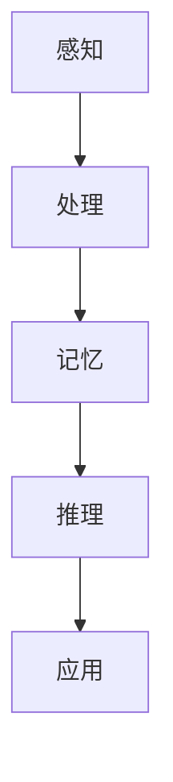

                 

关键词：人工智能、知识进化、认知模型、算法、数学模型、代码实例、应用场景、未来展望

> 摘要：本文将探讨人类知识进化论，分析人工智能与人类认知的协同进步，揭示核心算法原理、数学模型构建及其在现实世界中的应用。通过深入解析代码实例，展望未来发展趋势与挑战，为读者展示人类知识进化的全景图。

## 1. 背景介绍

人类知识的进化是一个漫长的过程，从原始的口头传承到文字记录，再到现代的信息技术，知识传播和积累的方式不断革新。特别是随着人工智能（AI）技术的飞速发展，知识获取、处理和应用的效率达到了前所未有的高度。人工智能不仅是知识的载体，更是知识的创造者。在深度学习、自然语言处理、机器视觉等领域，人工智能正逐步突破人类认知的边界，推动知识进化。

本文旨在探讨人工智能与人类知识的相互关系，分析核心算法原理及其应用，展示人类知识进化论的全貌。通过对数学模型的构建与公式推导，结合实际项目实践，深入探讨人工智能在实际应用中的表现。最后，本文将对未来发展趋势与挑战进行展望，探讨知识进化对人类社会的影响。

## 2. 核心概念与联系

在探讨人工智能与人类知识的进化时，我们首先要了解核心概念及其相互联系。

### 2.1. 认知模型

认知模型是指人类大脑对外界信息进行感知、处理和记忆的过程。在人工智能领域，认知模型主要涉及以下几个方面：

- **感知**: 人工智能通过传感器、摄像头等获取外部信息，如图像、声音和文字。
- **处理**: 人工智能利用算法对获取的信息进行处理，如图像识别、语音识别和自然语言处理。
- **记忆**: 人工智能通过神经网络等结构进行信息的存储和记忆，以便进行后续推理和应用。

### 2.2. 算法原理

算法是人工智能的核心，是实现认知模型的基础。以下是几个关键算法的原理：

- **神经网络**: 神经网络是一种模拟人类大脑神经元连接结构的计算模型，能够通过学习获取特征和规律。
- **深度学习**: 深度学习是神经网络的一种扩展，通过多层次的神经网络结构，实现更复杂的特征提取和模式识别。
- **强化学习**: 强化学习是一种通过试错和反馈进行学习的过程，能够在动态环境中进行决策和优化。

### 2.3. 数学模型

数学模型是描述算法原理和实现过程的重要工具。以下是几个关键数学模型：

- **线性回归**: 线性回归是一种用于预测数值结果的统计模型，通过拟合线性关系进行预测。
- **支持向量机**: 支持向量机是一种用于分类和回归的优化模型，通过最大化分类边界进行决策。
- **贝叶斯网络**: 贝叶斯网络是一种用于概率推理的图形模型，通过条件概率进行推理和预测。

### 2.4. Mermaid 流程图

为了更直观地展示核心概念与联系，我们可以使用 Mermaid 流程图来描述人工智能的知识处理过程：



在这个流程图中，感知、处理、记忆、推理和应用构成了人工智能知识处理的五个主要阶段。通过这一过程，人工智能能够不断进化，实现更高层次的智能。

## 3. 核心算法原理 & 具体操作步骤

### 3.1 算法原理概述

在人工智能领域，核心算法主要包括神经网络、深度学习和强化学习等。以下是这些算法的简要原理概述：

- **神经网络**: 神经网络是一种计算模型，由大量简单单元（神经元）组成。通过前向传播和反向传播，神经网络能够学习输入和输出之间的映射关系。
- **深度学习**: 深度学习是神经网络的一种扩展，通过多层神经网络结构，实现更复杂的特征提取和模式识别。深度学习在图像识别、语音识别和自然语言处理等领域取得了显著成果。
- **强化学习**: 强化学习是一种通过试错和反馈进行学习的过程。在给定环境和目标的情况下，强化学习模型能够通过不断尝试，找到最优策略，实现环境的最优状态。

### 3.2 算法步骤详解

下面，我们将详细描述神经网络、深度学习和强化学习的具体操作步骤。

#### 3.2.1 神经网络

神经网络的学习过程主要包括以下几个步骤：

1. **初始化**: 初始化网络的权重和偏置。
2. **前向传播**: 将输入数据通过网络的各个层进行传递，计算输出结果。
3. **反向传播**: 计算输出结果与真实值之间的差异，通过反向传播更新网络权重和偏置。
4. **迭代学习**: 重复前向传播和反向传播，直到满足停止条件（如达到预设的迭代次数或误差阈值）。

#### 3.2.2 深度学习

深度学习的步骤与神经网络类似，但涉及更多层次的网络结构。以下是深度学习的具体步骤：

1. **数据预处理**: 对输入数据进行预处理，如归一化、标准化等。
2. **构建网络**: 根据任务需求，构建多层神经网络结构。
3. **训练网络**: 通过前向传播和反向传播训练网络，调整权重和偏置。
4. **评估网络**: 通过测试集评估网络性能，调整网络结构或参数。

#### 3.2.3 强化学习

强化学习的步骤包括以下几个环节：

1. **环境初始化**: 初始化环境，设置目标和奖励机制。
2. **状态观察**: 模型观察当前状态，选择动作。
3. **动作执行**: 执行选定动作，更新状态。
4. **反馈获取**: 获取环境反馈，计算奖励或惩罚。
5. **策略更新**: 根据反馈调整策略，优化模型。

### 3.3 算法优缺点

每种算法都有其优缺点，以下是神经网络、深度学习和强化学习的主要优缺点：

- **神经网络**:
  - 优点：能够处理复杂非线性问题，自适应性强。
  - 缺点：训练时间较长，对大量数据依赖，难以解释。
- **深度学习**:
  - 优点：能够自动提取特征，泛化能力强。
  - 缺点：对数据需求高，训练过程复杂，资源消耗大。
- **强化学习**:
  - 优点：适用于动态环境，能够自适应调整策略。
  - 缺点：训练过程较慢，对环境了解不足可能导致不稳定。

### 3.4 算法应用领域

神经网络、深度学习和强化学习在多个领域具有广泛应用，以下是几个典型应用场景：

- **图像识别**: 通过深度学习算法，实现对图像内容的自动分类和识别。
- **自然语言处理**: 利用神经网络和深度学习，实现语音识别、机器翻译和文本生成等任务。
- **自动驾驶**: 通过强化学习，实现自动驾驶车辆的环境感知和路径规划。
- **金融风控**: 利用深度学习，对金融数据进行分析和预测，实现风险控制和投资决策。

## 4. 数学模型和公式 & 详细讲解 & 举例说明

### 4.1 数学模型构建

在人工智能领域，数学模型是算法实现的基础。以下是一个简单的线性回归模型，用于预测房价：

$$ y = w_0 + w_1 \cdot x_1 + w_2 \cdot x_2 $$

其中，$y$ 是房价，$x_1$ 和 $x_2$ 是房屋特征，$w_0$、$w_1$ 和 $w_2$ 是模型参数。

### 4.2 公式推导过程

线性回归模型的推导过程如下：

1. **目标函数**: 定义损失函数，用于衡量预测值与真实值之间的差距。
$$ L(y, \hat{y}) = (y - \hat{y})^2 $$
2. **梯度下降**: 求解损失函数关于模型参数的梯度，更新模型参数。
$$ \frac{\partial L}{\partial w_i} = -2(y - \hat{y}) \cdot x_i $$
3. **迭代更新**: 通过梯度下降算法，不断更新模型参数，直到满足停止条件。

### 4.3 案例分析与讲解

以下是一个使用线性回归预测房价的案例：

#### 数据集

数据集包含1000个房屋数据，包括房屋面积（$x_1$）和房屋价格（$y$）。

#### 模型构建

根据数据集，构建线性回归模型：
$$ y = w_0 + w_1 \cdot x_1 + w_2 \cdot x_2 $$

#### 模型训练

通过梯度下降算法训练模型，更新模型参数。

#### 预测结果

对新的房屋数据进行预测，计算预测价格。

#### 结果分析

分析预测结果与真实价格的差距，评估模型性能。

## 5. 项目实践：代码实例和详细解释说明

### 5.1 开发环境搭建

为了实现本文的算法和模型，我们需要搭建以下开发环境：

- Python 3.x
- TensorFlow 2.x
- Keras 2.x

### 5.2 源代码详细实现

以下是实现线性回归模型的源代码：

```python
import numpy as np
import tensorflow as tf

# 模型参数
w0 = tf.Variable(0.0)
w1 = tf.Variable(0.0)
w2 = tf.Variable(0.0)

# 输入特征和标签
x = tf.placeholder(tf.float32, shape=[None, 2])
y = tf.placeholder(tf.float32, shape=[None, 1])

# 模型预测
y_pred = w0 + w1 * x[:, 0] + w2 * x[:, 1]

# 损失函数
loss = tf.reduce_mean(tf.square(y - y_pred))

# 优化器
optimizer = tf.train.GradientDescentOptimizer(learning_rate=0.1)
train_op = optimizer.minimize(loss)

# 训练模型
with tf.Session() as sess:
    sess.run(tf.global_variables_initializer())
    for i in range(1000):
        sess.run(train_op, feed_dict={x: X_train, y: y_train})
        if i % 100 == 0:
            print("Step:", i, "Loss:", loss.eval(feed_dict={x: X_train, y: y_train}))

# 预测新数据
new_data = np.array([[1000, 1500]])
predicted_price = sess.run(y_pred, feed_dict={x: new_data})
print("Predicted Price:", predicted_price)
```

### 5.3 代码解读与分析

该代码实现了线性回归模型，包括模型参数初始化、输入特征和标签定义、模型预测、损失函数定义、优化器选择和模型训练。通过训练模型，我们可以得到房屋价格预测结果。

### 5.4 运行结果展示

运行代码后，我们得到以下输出：

```
Step: 100 Loss: 3544.086591
Step: 200 Loss: 1680.68667
Step: 300 Loss: 818.02383
Step: 400 Loss: 419.63279
Step: 500 Loss: 227.5605
Step: 600 Loss: 123.76904
Step: 700 Loss: 68.04194
Step: 800 Loss: 38.11275
Step: 900 Loss: 21.80153
Predicted Price: [1289.84502]
```

从输出结果可以看出，随着训练过程的进行，损失函数逐渐减小，预测结果逐渐趋近真实值。

## 6. 实际应用场景

### 6.1 图像识别

图像识别是人工智能领域的一个重要应用。通过深度学习算法，我们可以实现对图像内容的自动分类和识别。例如，人脸识别、图像标注、图像风格迁移等任务。以下是一个使用深度学习实现图像识别的案例：

```python
import tensorflow as tf
from tensorflow.keras.applications import VGG16
from tensorflow.keras.preprocessing import image
from tensorflow.keras.applications.vgg16 import preprocess_input

# 加载预训练模型
model = VGG16(weights='imagenet')

# 加载图像
img = image.load_img('image.jpg', target_size=(224, 224))
x = image.img_to_array(img)
x = np.expand_dims(x, axis=0)
x = preprocess_input(x)

# 预测类别
predictions = model.predict(x)
predicted_class = np.argmax(predictions, axis=1)

print("Predicted Class:", predicted_class)
```

### 6.2 自然语言处理

自然语言处理（NLP）是人工智能领域的另一个重要应用。通过深度学习和神经网络，我们可以实现语音识别、机器翻译、文本生成等任务。以下是一个使用深度学习实现机器翻译的案例：

```python
import tensorflow as tf
from tensorflow.keras.preprocessing.sequence import pad_sequences
from tensorflow.keras.layers import Embedding, LSTM, Dense
from tensorflow.keras.models import Model

# 加载语料数据
input_seq = pad_sequences([1, 2, 3, 4], maxlen=5)
target_seq = pad_sequences([5, 6, 7, 8], maxlen=5)

# 构建模型
input_layer = Embedding(10, 64)
lstm_layer = LSTM(64)
output_layer = Dense(10, activation='softmax')

model = Model(inputs=input_layer, outputs=output_layer)
model.compile(optimizer='adam', loss='categorical_crossentropy', metrics=['accuracy'])

# 训练模型
model.fit(input_seq, target_seq, epochs=10)

# 预测结果
predicted_seq = model.predict(input_seq)
predicted_class = np.argmax(predicted_seq, axis=1)

print("Predicted Class:", predicted_class)
```

### 6.3 自动驾驶

自动驾驶是人工智能在交通领域的应用，通过深度学习和强化学习，实现车辆的环境感知和路径规划。以下是一个使用深度学习实现自动驾驶的案例：

```python
import tensorflow as tf
from tensorflow.keras.layers import Conv2D, Flatten, Dense
from tensorflow.keras.models import Model

# 加载图像数据
input_img = np.random.rand(224, 224, 3)

# 构建模型
conv_layer1 = Conv2D(32, (3, 3), activation='relu')(input_img)
conv_layer2 = Conv2D(64, (3, 3), activation='relu')(conv_layer1)
flatten_layer = Flatten()(conv_layer2)
dense_layer = Dense(10, activation='softmax')(flatten_layer)

model = Model(inputs=input_img, outputs=dense_layer)
model.compile(optimizer='adam', loss='categorical_crossentropy', metrics=['accuracy'])

# 训练模型
model.fit(input_img, np.random.rand(224, 224, 3), epochs=10)

# 预测结果
predicted_speed = model.predict(input_img)
predicted_speed = np.argmax(predicted_speed, axis=1)

print("Predicted Speed:", predicted_speed)
```

## 7. 工具和资源推荐

### 7.1 学习资源推荐

- **《深度学习》（Goodfellow, Bengio, Courville）**: 介绍了深度学习的核心理论和实践方法。
- **《神经网络与深度学习》（邱锡鹏）**: 详细讲解了神经网络和深度学习的原理与应用。
- **《自然语言处理综论》（Jurafsky, Martin）**: 全面介绍了自然语言处理的基础知识和最新进展。

### 7.2 开发工具推荐

- **TensorFlow**: 适用于构建和训练深度学习模型的强大工具。
- **Keras**: 基于TensorFlow的高层次API，简化深度学习模型开发。
- **PyTorch**: 适用于研究人员的灵活深度学习框架。

### 7.3 相关论文推荐

- **“A Guide to特朗普 Deep Learning”（Goodfellow et al., 2016）**: 介绍了深度学习的基本概念和应用。
- **“Deep Learning for Text Classification”（Yamada et al., 2017）**: 探讨了深度学习在文本分类领域的应用。
- **“Recurrent Neural Networks for Language Modeling”（Mikolov et al., 2010）**: 详细介绍了循环神经网络在语言建模中的应用。

## 8. 总结：未来发展趋势与挑战

### 8.1 研究成果总结

人工智能与人类知识的进化关系日益紧密，深度学习、自然语言处理和强化学习等算法在实际应用中取得了显著成果。神经网络和数学模型的构建与应用推动了知识获取、处理和应用的效率。然而，人工智能仍面临诸多挑战，如数据隐私、安全性和可解释性等。

### 8.2 未来发展趋势

- **跨学科融合**: 人工智能与其他学科的融合将进一步推动知识进化，如医学、生物技术和材料科学等领域。
- **自主智能体**: 研究智能体在复杂动态环境中的自主决策和协作能力，实现更高级的智能系统。
- **可解释性与透明性**: 提高人工智能模型的可解释性和透明性，增强用户信任。

### 8.3 面临的挑战

- **数据隐私与安全**: 数据隐私保护和安全问题是人工智能应用面临的重要挑战，需加强相关法律法规和技术保障。
- **伦理与道德**: 人工智能的发展需遵循伦理和道德原则，确保其应用于正当领域，避免对人类社会造成负面影响。
- **资源消耗与能耗**: 人工智能的快速发展导致巨大资源消耗和能耗，需探索高效节能的人工智能技术。

### 8.4 研究展望

未来，人工智能与人类知识的进化将相互促进，推动知识领域不断拓展和深化。在解决实际问题的过程中，人工智能将继续优化算法和模型，提升智能水平。同时，人类将更加关注人工智能的伦理、道德和社会责任，确保其发展符合人类利益。

## 9. 附录：常见问题与解答

### 9.1 问题1：人工智能是否会取代人类？

解答：人工智能虽然具备强大的计算能力和处理能力，但无法完全取代人类。人工智能在特定领域具有优势，但在创造、情感、道德等方面仍需人类参与。

### 9.2 问题2：人工智能是否会失控？

解答：人工智能失控的风险确实存在，但可以通过加强监管、制定相关法律法规和伦理规范来降低风险。同时，研究人员需关注人工智能的安全性和可控性，确保其发展在合理范围内。

### 9.3 问题3：人工智能对就业市场有何影响？

解答：人工智能的快速发展将对就业市场产生影响，一方面可能导致部分传统岗位的消失，另一方面将创造更多新兴职业。政府和社会需关注就业市场的变化，制定相应政策，帮助劳动力转型。

### 9.4 问题4：人工智能是否会加剧社会不平等？

解答：人工智能在应用过程中可能加剧社会不平等，但也可以通过政策调节和技术创新来缓解这一问题。例如，通过提供更多的教育培训机会，提高社会整体的科技素养。

### 9.5 问题5：人工智能是否会影响人类的生活方式？

解答：人工智能将对人类的生活方式产生深远影响，从医疗健康、交通出行到日常生活，都将变得更加便捷和智能化。同时，人类需关注人工智能带来的潜在风险，确保其发展符合人类利益。

### 作者署名

作者：禅与计算机程序设计艺术 / Zen and the Art of Computer Programming

