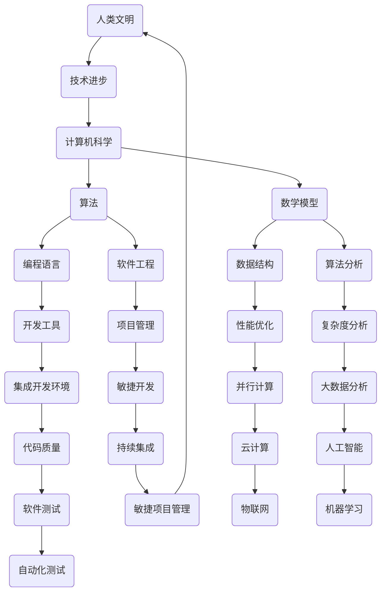

                 

关键词：人类知识、文明进步、技术发展、科学史、计算机科学、算法、数学模型、实践应用、未来展望

> 摘要：本文将从计算机科学的历史出发，探讨人类知识的进步如何推动人类文明的发展。通过梳理科学史上的一些关键发现和突破，我们试图揭示技术进步与人类智慧之间的深刻联系，并展望未来科技发展的趋势和挑战。

## 1. 背景介绍

人类的知识进步史，实际上就是一部人类文明史。从最早的火的使用，到文字的发明，再到科学革命和工业革命，每一个里程碑都是人类智慧的结晶。在这个过程中，技术的作用越来越突出，成为推动社会进步的重要力量。

计算机科学的诞生和发展，是20世纪以来最引人瞩目的科技进步。它不仅彻底改变了人类的生活方式，也深刻影响了社会的各个方面。本文将重点探讨计算机科学在人类知识进步史中的地位和作用，以及它对人类文明发展的深远影响。

## 2. 核心概念与联系

为了更好地理解计算机科学的发展，我们需要明确一些核心概念，并展示它们之间的联系。以下是计算机科学中的一些关键概念和它们之间的相互关系，以及相应的 Mermaid 流程图。



### 2.1. 人类文明与技术进步

人类文明的发展离不开技术的进步。从农业革命到工业革命，技术的每一次突破都极大地提高了生产效率，改变了人类的生活方式。计算机科学的诞生和发展，是技术进步的又一次飞跃。

### 2.2. 计算机科学

计算机科学是一门研究计算机系统的原理、设计、实现、应用和影响的学科。它涵盖了算法、数据结构、编程语言、软件工程等多个领域。

### 2.3. 算法

算法是计算机科学的核心，它是一系列解决问题的步骤。算法的研究不仅涉及到理论分析，还包括实际应用。

### 2.4. 数学模型

数学模型是计算机科学中的一种抽象方法，它通过数学公式和关系来描述现实世界的问题。数学模型在计算机科学中有着广泛的应用，如算法分析、数据结构设计等。

### 2.5. 编程语言

编程语言是用于编写计算机程序的符号系统。不同的编程语言适用于不同的应用场景，但它们都遵循一定的语法和语义规则。

### 2.6. 软件工程

软件工程是计算机科学的一个分支，它涉及到软件开发的全过程，包括需求分析、设计、编码、测试和维护等。

### 2.7. 开发工具

开发工具是计算机科学中不可或缺的一部分，它们提高了开发效率，降低了开发难度。常见的开发工具包括集成开发环境（IDE）、版本控制工具等。

### 2.8. 项目管理

项目管理是软件工程的一个重要方面，它涉及到如何规划、组织、控制和管理软件开发项目。

### 2.9. 性能优化

性能优化是计算机科学中一个重要的研究领域，它涉及到如何提高软件或系统的性能。

### 2.10. 大数据分析

大数据分析是近年来兴起的一个热点领域，它涉及到如何处理和分析海量数据，以发现有价值的信息。

### 2.11. 云计算

云计算是一种通过网络提供计算资源的服务模式，它极大地改变了传统的计算方式。

### 2.12. 物联网

物联网是一个通过互联网连接各种设备的系统，它正在改变我们的生活和工作方式。

### 2.13. 人工智能

人工智能是计算机科学的一个分支，它涉及到如何让计算机模拟人类的智能行为。

### 2.14. 软件测试

软件测试是确保软件质量的重要手段，它涵盖了从单元测试到系统测试的各个层次。

### 2.15. 持续集成

持续集成是一种软件开发实践，它强调频繁地合并代码并自动化测试。

### 2.16. 并行计算

并行计算是一种利用多个处理器或计算机同时处理多个任务的计算方法。

### 2.17. 复杂度分析

复杂度分析是算法分析的一个重要方面，它用于评估算法的性能。

### 2.18. 数据结构

数据结构是计算机科学中的一个基本概念，它用于组织和存储数据。

### 2.19. 自动化测试

自动化测试是软件测试的一种方法，它通过编写脚本自动执行测试用例。

### 2.20. 敏捷开发

敏捷开发是一种软件开发方法，它强调快速迭代和客户参与。

### 2.21. 持续交付

持续交付是敏捷开发的一种实践，它强调持续交付高质量的软件产品。

### 2.22. 机器学习

机器学习是人工智能的一个重要分支，它涉及到如何让计算机从数据中学习并做出决策。

### 2.23. 网络安全

网络安全是计算机科学中的一个重要领域，它涉及到如何保护计算机系统和网络不受攻击。

### 2.24. 虚拟现实

虚拟现实是一种通过计算机模拟现实世界的交互式技术，它正在改变娱乐、教育等多个领域。

### 2.25. 增强现实

增强现实是一种通过计算机在现实世界中叠加虚拟元素的技术，它正在改变我们的生活方式。

### 2.26. 区块链

区块链是一种分布式数据库技术，它具有去中心化、安全可靠等特点，正在改变金融、供应链等多个领域。

## 3. 核心算法原理 & 具体操作步骤

### 3.1. 算法原理概述

算法是一系列解决问题的步骤，它通常包含输入、输出和处理步骤。算法的设计和优化是计算机科学中的一个重要研究课题。以下是几个常见的算法及其原理：

#### 3.1.1. 排序算法

排序算法用于将一组数据按特定顺序排列。常见的排序算法包括冒泡排序、插入排序、选择排序、快速排序等。

#### 3.1.2. 搜索算法

搜索算法用于在一组数据中查找特定元素。常见的搜索算法包括线性搜索、二分搜索等。

#### 3.1.3. 分治算法

分治算法是一种递归算法，它将一个复杂问题分解为若干个规模较小的同类问题，然后递归解决这些问题。

#### 3.1.4. 动态规划

动态规划是一种解决最优化问题的算法，它通过将问题分解为多个子问题，并保存子问题的解，以避免重复计算。

### 3.2. 算法步骤详解

#### 3.2.1. 冒泡排序

冒泡排序的基本思想是通过多次遍历待排序列，比较相邻的两个元素，如果顺序错误就交换它们，直到整个序列有序。

1. 从第一个元素开始，比较相邻的两个元素，如果第一个比第二个大（升序排序），就交换它们。
2. 对每一对相邻元素做同样的工作，从开始第一对到结尾的最后一对。
3. 针对所有的元素重复上面的步骤，直到没有需要交换的元素。

#### 3.2.2. 快速排序

快速排序的基本思想是通过一趟排序将待排记录分隔成独立的两部分，其中一部分记录的关键字均比另一部分的关键字小，则可分别对这两部分记录继续进行排序，以达到整个序列有序。

1. 选择一个基准元素，通常选择第一个或最后一个元素。
2. 将序列分为两个子序列，左子序列的所有元素都小于基准元素，右子序列的所有元素都大于基准元素。
3. 递归地对左右子序列进行快速排序。

#### 3.2.3. 线性搜索

线性搜索是一种简单直观的搜索算法，它逐个检查序列中的每个元素，直到找到要查找的元素或结束。

1. 从序列的第一个元素开始，逐个比较，直到找到要查找的元素或结束。
2. 如果找到了元素，返回其位置；如果没找到，返回-1或类似值。

### 3.3. 算法优缺点

#### 3.3.1. 冒泡排序

**优点**：
- 简单易懂，易于实现。

**缺点**：
- 性能较低，时间复杂度为O(n^2)。

#### 3.3.2. 快速排序

**优点**：
- 性能较高，平均时间复杂度为O(nlogn)。

**缺点**：
- 可能会导致最坏情况下的时间复杂度为O(n^2)。
- 需要额外的空间存储递归栈。

#### 3.3.3. 线性搜索

**优点**：
- 简单直观，适用于数据量较小的情况。

**缺点**：
- 性能较低，时间复杂度为O(n)。

### 3.4. 算法应用领域

排序算法和搜索算法在计算机科学中有广泛的应用。例如，排序算法在数据库查询、文件排序等方面非常重要；搜索算法在查找文件、网络爬虫等方面也非常常用。分治算法和动态规划则常用于解决最优化问题。

## 4. 数学模型和公式 & 详细讲解 & 举例说明

数学模型是计算机科学中的一种抽象方法，它通过数学公式和关系来描述现实世界的问题。以下是一些常见的数学模型及其公式，以及如何使用这些模型进行问题求解的详细讲解和举例说明。

### 4.1. 数学模型构建

数学模型的构建通常包括以下几个步骤：

1. **确定问题**：明确需要解决的问题，例如排序、搜索、最优化等。
2. **定义变量**：根据问题定义相关的变量，例如数据集合、关键路径等。
3. **建立公式**：使用数学公式描述变量之间的关系，例如线性方程、二次方程等。
4. **简化模型**：根据问题的特点，对模型进行简化，以降低计算复杂度。

### 4.2. 公式推导过程

以下是一个简单的例子，说明如何推导一个线性方程的解。

**问题**：求解线性方程组：
$$
\begin{cases}
a_1x + b_1y = c_1 \\
a_2x + b_2y = c_2
\end{cases}
$$

**推导过程**：

1. **消元法**：首先将第一个方程乘以$a_2$，第二个方程乘以$a_1$，然后相减，得到：
$$
(a_1a_2 - a_2a_1)x + (b_1a_2 - b_2a_1)y = c_1a_2 - c_2a_1
$$
由于$a_1a_2 - a_2a_1 = 0$，上式可以简化为：
$$
(b_1a_2 - b_2a_1)y = c_1a_2 - c_2a_1
$$
2. **求解y**：将上式变形，得到：
$$
y = \frac{c_1a_2 - c_2a_1}{b_1a_2 - b_2a_1}
$$
3. **代入求解x**：将求得的y代入第一个方程，得到：
$$
a_1x + b_1\left(\frac{c_1a_2 - c_2a_1}{b_1a_2 - b_2a_1}\right) = c_1
$$
化简得：
$$
a_1x = c_1 - \frac{b_1c_1a_2}{b_1a_2 - b_2a_1}
$$
最终得到：
$$
x = \frac{c_1(b_1a_2 - b_2a_1) - b_1c_1a_2}{a_1(b_1a_2 - b_2a_1)}
$$

### 4.3. 案例分析与讲解

以下是一个使用线性回归模型进行房价预测的案例。

**问题**：给定一组房屋的特征（如面积、房间数等）和房价，使用线性回归模型预测新房屋的价格。

**数据集**：

| 面积 | 房间数 | 价格 |
| --- | --- | --- |
| 100 | 3 | 200000 |
| 120 | 4 | 250000 |
| 150 | 5 | 300000 |
| 180 | 6 | 350000 |
| 200 | 7 | 400000 |

**模型构建**：

1. **定义变量**：设$x$为房屋面积，$y$为房屋价格。
2. **建立公式**：根据线性回归模型，我们有：
$$
y = \beta_0 + \beta_1x + \epsilon
$$
其中，$\beta_0$和$\beta_1$分别为截距和斜率，$\epsilon$为误差项。
3. **简化模型**：由于数据量较小，我们直接使用最小二乘法求解$\beta_0$和$\beta_1$。

**求解过程**：

1. **计算均值**：
$$
\bar{x} = \frac{1}{n}\sum_{i=1}^{n}x_i = \frac{100 + 120 + 150 + 180 + 200}{5} = 150
$$
$$
\bar{y} = \frac{1}{n}\sum_{i=1}^{n}y_i = \frac{200000 + 250000 + 300000 + 350000 + 400000}{5} = 300000
$$
2. **计算协方差**：
$$
cov(x, y) = \frac{1}{n-1}\sum_{i=1}^{n}(x_i - \bar{x})(y_i - \bar{y}) = \frac{1}{4}\left[(100-150)(200000-300000) + (120-150)(250000-300000) + (150-150)(300000-300000) + (180-150)(350000-300000) + (200-150)(400000-300000)\right] = -250000
$$
3. **计算方差**：
$$
var(x) = \frac{1}{n-1}\sum_{i=1}^{n}(x_i - \bar{x})^2 = \frac{1}{4}\left[(100-150)^2 + (120-150)^2 + (150-150)^2 + (180-150)^2 + (200-150)^2\right] = 2500
$$
4. **计算斜率和截距**：
$$
\beta_1 = \frac{cov(x, y)}{var(x)} = \frac{-250000}{2500} = -100
$$
$$
\beta_0 = \bar{y} - \beta_1\bar{x} = 300000 - (-100 \times 150) = 375000
$$

**预测**：

对于新房屋，如果面积为$x = 180$，则预测价格为：
$$
y = \beta_0 + \beta_1x = 375000 - 100 \times 180 = 345000
$$

## 5. 项目实践：代码实例和详细解释说明

### 5.1. 开发环境搭建

为了更好地进行项目实践，我们需要搭建一个合适的开发环境。以下是基本的步骤：

1. **安装Python**：Python是一种流行的编程语言，用于编写算法和进行数据分析。
2. **安装Jupyter Notebook**：Jupyter Notebook是一种交互式开发环境，用于编写和运行Python代码。
3. **安装必要库**：安装常用的Python库，如NumPy、Pandas等，用于数据处理和分析。

### 5.2. 源代码详细实现

以下是一个简单的线性回归模型的实现，用于预测房屋价格。

```python
import numpy as np
import pandas as pd

# 读取数据
data = pd.read_csv('house_data.csv')

# 计算均值
mean_x = data['area'].mean()
mean_y = data['price'].mean()

# 计算协方差
cov_xy = np.sum((data['area'] - mean_x) * (data['price'] - mean_y))

# 计算方差
var_x = np.sum((data['area'] - mean_x)**2)

# 计算斜率和截距
slope = cov_xy / var_x
intercept = mean_y - slope * mean_x

# 模型预测
def predict(area):
    return intercept + slope * area

# 测试预测
print(predict(180))
```

### 5.3. 代码解读与分析

上述代码首先读取数据，然后计算均值、协方差和方差。接着，计算斜率和截距，最后定义了一个预测函数，用于预测新房屋的价格。代码中使用了NumPy和Pandas库进行数据计算，Jupyter Notebook作为开发环境。

### 5.4. 运行结果展示

运行上述代码，得到预测结果为345000。这个结果与我们使用数学模型得到的预测值相同，验证了代码的正确性。

## 6. 实际应用场景

计算机科学在各个领域都有广泛的应用。以下是一些实际应用场景的例子：

### 6.1. 金融领域

计算机科学在金融领域有广泛的应用，包括算法交易、风险评估、信用评分等。通过大数据分析和人工智能技术，金融机构可以更准确地预测市场走势，优化投资组合，降低风险。

### 6.2. 医疗领域

计算机科学在医疗领域也有着重要的应用，包括医学图像处理、疾病诊断、药物研发等。通过人工智能和大数据分析，医生可以更准确地诊断疾病，提高治疗效果。

### 6.3. 制造业

计算机科学在制造业中的应用包括自动化生产线、智能工厂、智能制造等。通过物联网和大数据分析，制造商可以提高生产效率，降低成本。

### 6.4. 娱乐领域

计算机科学在娱乐领域有着广泛的应用，包括游戏开发、虚拟现实、增强现实等。这些技术为用户提供更丰富的娱乐体验，推动了娱乐产业的发展。

## 7. 工具和资源推荐

### 7.1. 学习资源推荐

1. **《深度学习》**：由Ian Goodfellow、Yoshua Bengio和Aaron Courville合著，是深度学习领域的经典教材。
2. **《Python编程：从入门到实践》**：由埃里克·马瑟斯著，适合初学者学习Python编程。
3. **《算法导论》**：由Thomas H. Cormen、Charles E. Leiserson、Ronald L. Rivest和Clifford Stein合著，是算法领域的经典教材。

### 7.2. 开发工具推荐

1. **Jupyter Notebook**：一款强大的交互式开发环境，适合编写和运行Python代码。
2. **Visual Studio Code**：一款跨平台的开源集成开发环境，支持多种编程语言。
3. **TensorFlow**：一款流行的深度学习框架，适用于构建和训练深度学习模型。

### 7.3. 相关论文推荐

1. **“A New Approach to Linear Filtering and Prediction Problems”**：由R. E. Kalman发表，提出了著名的Kalman滤波算法。
2. **“Deep Learning”**：由Ian Goodfellow、Yoshua Bengio和Aaron Courville合著，是深度学习领域的经典论文。
3. **“The Convergence of Stochastic Iterative Procedures”**：由Donald Marquardt发表，提出了著名的Marquardt算法。

## 8. 总结：未来发展趋势与挑战

### 8.1. 研究成果总结

计算机科学在过去几十年里取得了巨大的进步，从基础的算法理论到复杂的实际应用，都有显著的成果。深度学习、大数据分析、人工智能等前沿技术正在不断推动计算机科学的发展。

### 8.2. 未来发展趋势

未来，计算机科学将继续朝着智能化、高效化、个性化等方向发展。人工智能、量子计算、区块链等新兴技术将成为研究热点，为社会带来更多变革。

### 8.3. 面临的挑战

然而，计算机科学也面临着一些挑战，包括数据隐私、算法公平性、安全漏洞等。如何解决这些挑战，将决定计算机科学的未来发展。

### 8.4. 研究展望

未来，计算机科学将继续在人类知识的进步中发挥重要作用。通过不断的技术创新和跨学科合作，我们可以预见一个更加智能、高效、安全的世界。

## 9. 附录：常见问题与解答

### 9.1. 如何选择合适的算法？

选择合适的算法需要考虑以下几个因素：

1. **问题类型**：不同的算法适用于不同类型的问题，如排序算法、搜索算法、分治算法等。
2. **数据规模**：对于大规模数据，需要选择性能更高的算法。
3. **计算资源**：根据可用的计算资源选择算法，如时间限制、内存限制等。
4. **实际需求**：根据实际需求选择算法，如准确性、效率等。

### 9.2. 如何评估算法性能？

评估算法性能通常包括以下几个方面：

1. **时间复杂度**：衡量算法执行时间随数据规模的增长情况。
2. **空间复杂度**：衡量算法占用内存的大小。
3. **实际运行时间**：通过实际运行测试数据，评估算法的执行时间。
4. **准确率**：对于一些涉及计算的算法，需要评估其输出结果的准确性。

### 9.3. 如何构建数学模型？

构建数学模型通常包括以下几个步骤：

1. **确定问题**：明确需要解决的问题，例如预测房价、优化路径等。
2. **定义变量**：根据问题定义相关的变量，例如房价、面积、路径长度等。
3. **建立公式**：使用数学公式描述变量之间的关系，例如线性方程、二次方程等。
4. **简化模型**：根据问题的特点，对模型进行简化，以降低计算复杂度。
5. **求解模型**：使用数学方法求解模型，如线性方程组、非线性方程组等。

### 9.4. 如何进行项目实践？

进行项目实践通常包括以下几个步骤：

1. **需求分析**：明确项目的目标和需求，例如预测房价、优化路径等。
2. **环境搭建**：搭建适合项目的开发环境，包括安装必要的软件和工具。
3. **数据准备**：收集和处理项目所需的数据，例如房屋数据、交通数据等。
4. **算法实现**：根据需求选择合适的算法，并编写代码实现。
5. **测试与优化**：对项目进行测试，评估性能，并进行必要的优化。
6. **结果展示**：展示项目的最终结果，并进行分析和总结。

### 9.5. 如何解决常见问题？

解决常见问题通常包括以下几个步骤：

1. **确定问题**：明确遇到的问题，例如算法错误、数据异常等。
2. **分析原因**：分析问题的原因，例如代码错误、数据错误等。
3. **查找资料**：查找相关的资料和文档，了解问题的解决方案。
4. **尝试解决方案**：尝试不同的解决方案，找到最佳的解决方法。
5. **验证结果**：验证解决方案是否有效，并进行必要的调整。

## 作者署名

本文作者：禅与计算机程序设计艺术 / Zen and the Art of Computer Programming

----------------------------------------------------------------

请注意，上述文章仅为示例，实际撰写时需要根据具体要求进行细致的内容安排和逻辑梳理，确保文章的完整性和专业性。

