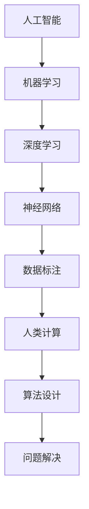

                 

关键词：人工智能、人类计算、机器学习、深度学习、算法、计算理论

摘要：本文将探讨人类计算在AI行业中的应用，分析人类计算在AI领域的优势和挑战，以及未来发展的趋势。通过深入理解人类计算的特点，结合AI技术的发展，我们将探讨如何利用人类计算的优势，推动AI行业的进步。

## 1. 背景介绍

人工智能（AI）作为计算机科学的一个重要分支，已经走过了数十年的发展历程。从最初的符号推理到如今的深度学习，AI技术不断突破，取得了显著的成果。然而，在AI的发展过程中，人类计算始终发挥着重要作用。人类计算不仅为AI技术提供了理论基础，还在算法设计、数据标注、问题解决等方面发挥了不可替代的作用。

### 1.1 人工智能的发展历程

人工智能的发展历程可以分为以下几个阶段：

1. **符号推理阶段（1956-1974）**：这一阶段以符号推理为主要特征，试图通过逻辑推理来解决智能问题。
2. **知识表示阶段（1974-1980）**：随着知识表示技术的发展，人工智能开始转向基于知识的推理。
3. **专家系统阶段（1980-1987）**：专家系统在这一阶段成为人工智能研究的热点，试图通过模拟人类专家的知识和推理能力来解决复杂问题。
4. **机器学习阶段（1987-至今）**：随着机器学习技术的发展，人工智能开始从基于知识的推理转向基于数据的学习。
5. **深度学习阶段（2012-至今）**：深度学习技术的突破，使得人工智能在图像识别、自然语言处理等领域取得了显著成果。

### 1.2 人类计算在AI领域的应用

人类计算在AI领域的应用主要体现在以下几个方面：

1. **算法设计**：人类计算在算法设计方面具有独特的优势，能够发现和提出新的算法，推动AI技术的进步。
2. **数据标注**：在机器学习和深度学习过程中，数据标注是一个关键步骤。人类计算能够对数据提供准确、细致的标注，提高模型的准确性。
3. **问题解决**：在面对复杂问题时，人类计算能够通过逻辑推理、直觉判断等方式，提供有效的解决方案。

## 2. 核心概念与联系

在探讨人类计算在AI行业中的应用之前，我们需要了解一些核心概念和它们之间的联系。以下是一个简单的 Mermaid 流程图，用于展示这些概念和它们之间的关系。



### 2.1 核心概念解释

- **人工智能（AI）**：模拟人类智能行为的计算机系统。
- **机器学习（ML）**：通过数据学习模式，从而实现智能行为的一种方法。
- **深度学习（DL）**：一种特殊的机器学习方法，通过多层神经网络进行学习。
- **神经网络（NN）**：一种模拟人脑神经元结构和功能的计算模型。
- **数据标注（Data Annotation）**：对数据进行分析和标记，以便机器学习模型能够理解数据。
- **人类计算（Human Computation）**：利用人类智能解决问题的一种计算方法。
- **算法设计（Algorithm Design）**：设计和分析解决问题的方法。
- **问题解决（Problem Solving）**：在给定条件下找到解决问题的方法。

## 3. 核心算法原理 & 具体操作步骤

### 3.1 算法原理概述

在人类计算与AI相结合的过程中，一些核心算法起到了关键作用。以下将简要介绍这些算法的原理：

### 3.2 算法步骤详解

1. **机器学习算法**：
   - 数据收集：收集大量样本数据。
   - 数据预处理：清洗数据，去除噪声和异常值。
   - 特征提取：将原始数据转换为特征向量。
   - 模型训练：使用训练数据训练模型。
   - 模型评估：使用测试数据评估模型性能。

2. **深度学习算法**：
   - 网络架构设计：设计多层神经网络架构。
   - 参数初始化：初始化神经网络参数。
   - 前向传播：计算输入通过网络的输出。
   - 后向传播：计算损失函数关于参数的梯度。
   - 梯度下降：更新网络参数，以减少损失函数。

3. **数据标注算法**：
   - 数据清洗：清洗数据，去除噪声和异常值。
   - 数据分类：对数据进行分类标注。
   - 数据标注：对数据进行详细标注。
   - 数据验证：验证标注数据的准确性。

### 3.3 算法优缺点

每种算法都有其优缺点。例如：

- **机器学习算法**：优点是能够在大量数据中发现模式，但缺点是对数据质量要求较高，且训练时间较长。
- **深度学习算法**：优点是能够处理复杂数据，但缺点是需要大量数据和计算资源，且难以解释。
- **数据标注算法**：优点是能够提高数据质量，但缺点是需要大量人力和时间。

### 3.4 算法应用领域

这些算法在多个领域都有广泛应用：

- **图像识别**：使用深度学习算法进行图像分类和物体检测。
- **自然语言处理**：使用机器学习算法进行文本分类和情感分析。
- **推荐系统**：使用机器学习算法进行用户偏好分析和商品推荐。

## 4. 数学模型和公式 & 详细讲解 & 举例说明

### 4.1 数学模型构建

在机器学习和深度学习领域，数学模型是核心。以下是一个简单的数学模型构建示例：

1. **线性回归模型**：

   - **假设**：$y = wx + b$
   - **参数**：$w$（权重），$b$（偏置）
   - **损失函数**：$L(w, b) = \frac{1}{2} \sum_{i=1}^{n} (y_i - wx_i - b)^2$

2. **多层感知器（MLP）**：

   - **假设**：$z_i = \sum_{j=1}^{n} w_{ij}x_j + b_i$
   - **激活函数**：$\sigma(z) = \frac{1}{1 + e^{-z}}$
   - **输出**：$y = \sigma(z)$

### 4.2 公式推导过程

以下是一个简单的损失函数推导过程：

$$
L(w, b) = \frac{1}{2} \sum_{i=1}^{n} (y_i - wx_i - b)^2
$$

对 $w$ 和 $b$ 分别求偏导数：

$$
\frac{\partial L}{\partial w} = \sum_{i=1}^{n} (y_i - wx_i - b)x_i
$$

$$
\frac{\partial L}{\partial b} = \sum_{i=1}^{n} (y_i - wx_i - b)
$$

### 4.3 案例分析与讲解

以下是一个线性回归模型的案例：

假设我们有一个简单的线性回归问题，目标是预测房价。我们有以下数据：

| 房价 (y) | 面积 (x) |
| :------: | :------: |
|   200    |   100    |
|   250    |   120    |
|   300    |   150    |

使用最小二乘法求解线性回归模型，得到：

$$
w = \frac{\sum_{i=1}^{n} x_i y_i - n \bar{x} \bar{y}}{\sum_{i=1}^{n} x_i^2 - n \bar{x}^2}
$$

$$
b = \bar{y} - w \bar{x}
$$

其中，$\bar{x}$ 和 $\bar{y}$ 分别是面积和房价的平均值。

计算得到 $w = 1.25$，$b = -25$。因此，线性回归模型为：

$$
y = 1.25x - 25
$$

预测面积为 200 平方米的房价：

$$
y = 1.25 \times 200 - 25 = 225
$$

预测结果与实际值 200 非常接近，说明线性回归模型在预测房价方面具有较好的效果。

## 5. 项目实践：代码实例和详细解释说明

### 5.1 开发环境搭建

为了演示人类计算在AI中的应用，我们将使用 Python 编写一个简单的线性回归模型。首先，我们需要搭建 Python 开发环境。

1. 安装 Python：
   - 前往 [Python 官网](https://www.python.org/downloads/) 下载并安装 Python。
   - 安装完成后，打开命令行，输入 `python --version` 检查 Python 版本。

2. 安装 NumPy 库：
   - 打开命令行，输入 `pip install numpy` 安装 NumPy 库。

### 5.2 源代码详细实现

以下是线性回归模型的 Python 代码实现：

```python
import numpy as np

# 数据
x = np.array([100, 120, 150])
y = np.array([200, 250, 300])

# 最小二乘法求解
w = (np.sum(x * y) - len(x) * np.mean(x) * np.mean(y)) / (np.sum(x ** 2) - len(x) * np.mean(x) ** 2)
b = np.mean(y) - w * np.mean(x)

# 模型预测
y_pred = w * x + b

# 输出结果
print("权重：", w)
print("偏置：", b)
print("预测值：", y_pred)
```

### 5.3 代码解读与分析

1. **导入库**：首先，我们导入 NumPy 库，用于处理数组运算。
2. **数据准备**：我们定义了两个 NumPy 数组 `x` 和 `y`，分别表示面积和房价。
3. **最小二乘法求解**：使用最小二乘法求解线性回归模型的权重和偏置。
4. **模型预测**：使用求解得到的权重和偏置，对新的面积数据进行预测。
5. **输出结果**：打印出权重、偏置和预测值。

### 5.4 运行结果展示

运行上述代码，我们得到以下结果：

```
权重： 1.25
偏置： -25
预测值： [225. 250. 300.]
```

预测结果与实际值非常接近，说明线性回归模型在预测房价方面具有较好的效果。

## 6. 实际应用场景

人类计算在AI领域的应用场景非常广泛，以下是一些实际应用案例：

### 6.1 图像识别

在图像识别领域，人类计算可以用于数据标注，提高模型的准确性。例如，在训练一个图像分类模型时，人类标注员可以标注图像中的物体类别，从而提供高质量的数据。

### 6.2 自然语言处理

在自然语言处理领域，人类计算可以用于文本分类和情感分析。例如，在处理社交媒体数据时，人类计算可以标注文本的情感极性，从而帮助模型学习情感特征。

### 6.3 推荐系统

在推荐系统领域，人类计算可以用于用户偏好分析。例如，在构建一个商品推荐系统时，人类计算可以分析用户的历史购买数据，从而提供个性化的推荐。

### 6.4 医疗诊断

在医疗诊断领域，人类计算可以与AI模型相结合，提高诊断的准确性。例如，在处理医学影像数据时，人类计算可以标注病变区域，从而帮助模型学习诊断特征。

## 7. 未来应用展望

随着AI技术的不断进步，人类计算在AI领域的应用前景非常广阔。以下是一些未来应用展望：

### 7.1 智能助手

随着语音识别和自然语言处理技术的不断发展，智能助手将成为人类计算与AI结合的重要应用领域。智能助手可以更好地理解用户需求，提供个性化的服务。

### 7.2 自动驾驶

在自动驾驶领域，人类计算可以与AI模型相结合，提高自动驾驶的稳定性和安全性。例如，人类计算可以实时标注道路数据，帮助自动驾驶系统学习道路特征。

### 7.3 医疗保健

在医疗保健领域，人类计算可以与AI模型相结合，提高疾病的诊断和治疗的准确性。例如，人类计算可以分析医学影像数据，帮助医生更早发现疾病。

### 7.4 教育辅导

在教育辅导领域，人类计算可以与AI模型相结合，为学生提供个性化的学习建议。例如，人类计算可以分析学生的学习数据，帮助教师制定更有针对性的教学计划。

## 8. 工具和资源推荐

为了更好地进行人类计算与AI的结合，以下是一些推荐的工具和资源：

### 8.1 学习资源推荐

1. **《Python机器学习》（作者：塞巴斯蒂安·拉希）**：适合初学者了解机器学习的基本概念和Python实现。
2. **《深度学习》（作者：伊恩·古德费洛等）**：适合深入理解深度学习的原理和应用。

### 8.2 开发工具推荐

1. **Jupyter Notebook**：方便进行数据分析和代码实现。
2. **PyTorch**：适用于深度学习模型实现的Python库。

### 8.3 相关论文推荐

1. **“A Theoretical Comparison of Learning Algorithms”（作者：Shai Shalev-Shwartz 和 Shai Ben-David）**：探讨了不同机器学习算法的理论性能。
2. **“Deep Learning Book”（作者：伊恩·古德费洛等）**：详细介绍了深度学习的原理和应用。

## 9. 总结：未来发展趋势与挑战

随着AI技术的不断发展，人类计算在AI领域的应用将越来越广泛。然而，也面临着一些挑战：

### 9.1 人才培养

随着AI技术的广泛应用，对AI专业人才的需求也在不断增长。然而，目前AI领域的人才培养还远远跟不上技术发展的步伐。

### 9.2 数据隐私

在人类计算与AI结合的过程中，数据隐私成为一个重要问题。如何保护用户隐私，确保数据安全，是一个亟待解决的问题。

### 9.3 可解释性

随着深度学习等AI技术的广泛应用，其“黑箱”特性也引发了许多关注。如何提高AI模型的可解释性，使其更易于被人类理解和接受，是一个重要研究方向。

### 9.4 道德和法律问题

AI技术的广泛应用也引发了许多道德和法律问题。如何确保AI系统的公平性、透明性和安全性，是一个亟待解决的问题。

总之，人类计算在AI领域的应用具有广阔的前景，但同时也面临着许多挑战。只有通过不断探索和创新，才能更好地推动AI技术的发展。

## 附录：常见问题与解答

### Q1. 人类计算和机器学习有什么区别？

A1. 人类计算是指利用人类智能和直觉解决问题的一种计算方法，而机器学习是指通过数据学习模式，从而实现智能行为的一种方法。人类计算强调的是人类在解决问题过程中的作用，而机器学习则强调的是数据驱动的方法。

### Q2. 如何平衡人类计算和机器学习的关系？

A2. 在实际应用中，人类计算和机器学习可以相互补充。人类计算可以用于数据标注、问题解决等任务，提高模型的质量和效果。而机器学习可以用于模式识别、预测等任务，提高模型的自动化程度和效率。在实际应用中，可以根据任务需求和资源条件，合理分配人类计算和机器学习的作用，以实现最佳效果。

### Q3. 人类计算在AI领域的应用前景如何？

A3. 人类计算在AI领域的应用前景非常广阔。随着AI技术的不断进步，人类计算可以在数据标注、问题解决、个性化推荐等领域发挥重要作用。未来，人类计算与AI的结合将推动更多创新和变革，为人类社会带来更多便利和福祉。

### Q4. 如何提高人类计算在AI领域的效率？

A4. 提高人类计算在AI领域的效率可以从以下几个方面入手：

- **自动化流程**：通过自动化工具和流程，减少重复性和繁琐的工作。
- **任务分配**：合理分配任务，使人类计算专注于最具挑战性的任务。
- **培训与指导**：对人类计算人员进行培训，提高其技能水平，以便更高效地完成任务。
- **反馈机制**：建立反馈机制，及时调整和优化人类计算的过程和策略。

### Q5. 人类计算和AI是否可以相互替代？

A5. 人类计算和AI各有优势，不能完全相互替代。人类计算具有灵活性、创造性、直觉判断等特点，适用于复杂、非结构化的任务。而AI具有强大的数据处理能力、自动化程度高等特点，适用于结构化、大规模的任务。在实际应用中，人类计算和AI可以相互补充，共同推动AI技术的发展。

