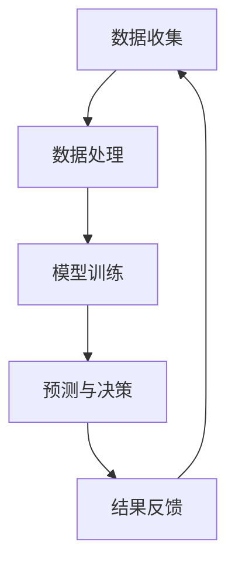

                 

 关键词：人类计算，医疗保健，人工智能，数据处理，算法优化，数据隐私，个性化治疗，健康预测

> 摘要：随着医疗技术的进步，人工智能在医疗保健领域中的应用日益广泛。本文从人类计算的角度，探讨了人工智能技术在医疗保健中的应用现状、核心算法原理、数学模型构建，以及未来发展的趋势和挑战。

## 1. 背景介绍

在过去的几十年里，医疗保健行业经历了巨大的变革。随着信息技术的发展，大量的医疗数据被收集和存储，这些数据为人工智能在医疗保健中的应用提供了丰富的资源。人类计算作为一种将人的智慧和计算机的计算能力相结合的方法，为医疗保健领域带来了新的机遇。

医疗保健领域面临着许多挑战，如疾病预测、个性化治疗、医疗资源的合理分配等。这些挑战的解决依赖于高效的数据处理、准确的算法和优化的数学模型。人类计算通过结合人的判断和计算机的计算能力，能够提高医疗服务的质量和效率。

本文将探讨人类计算在医疗保健中的应用，包括核心算法原理、数学模型构建、项目实践以及未来展望。

## 2. 核心概念与联系

### 2.1 人类计算的基本原理

人类计算是指通过模拟人类的思维方式来解决问题的方法。在医疗保健领域，人类计算主要依赖于以下核心概念：

- **数据驱动**：医疗数据的收集和处理是医疗保健中的关键环节。数据驱动的方法使得人工智能系统能够从大量的医疗数据中提取有价值的信息。
- **机器学习**：通过训练模型，人工智能系统能够从数据中学习，并在新的医疗数据中做出预测和决策。
- **深度学习**：深度学习是一种强大的机器学习技术，能够处理大规模、高维度的医疗数据，并在图像识别、自然语言处理等方面表现出色。
- **云计算**：云计算提供了强大的计算能力和数据存储能力，使得医疗保健系统能够处理大规模的医疗数据。

### 2.2 Mermaid 流程图

下面是一个简单的 Mermaid 流程图，展示了人类计算在医疗保健中的应用流程。



- **数据收集**：收集医疗数据，包括患者信息、医疗记录、诊断结果等。
- **数据处理**：对医疗数据清洗、转换和预处理，为模型训练做好准备。
- **模型训练**：使用机器学习和深度学习技术，对医疗数据进行训练，构建预测模型。
- **预测与决策**：使用训练好的模型对新的医疗数据进行预测和决策。
- **结果反馈**：将预测结果反馈给医生，帮助医生做出更好的医疗决策。

## 3. 核心算法原理 & 具体操作步骤

### 3.1 算法原理概述

在医疗保健中，常用的算法包括决策树、支持向量机、神经网络等。下面以决策树为例，介绍算法原理。

- **决策树**：决策树是一种常用的机器学习算法，通过一系列的测试来将数据分类或回归。每个测试对应一个特征，每个测试的结果都会将数据分为两个或多个子集。通过递归地构建测试，决策树能够将数据划分为不同的类别或连续的值。

### 3.2 算法步骤详解

1. **特征选择**：选择对疾病预测最有影响力的特征。
2. **构建测试**：根据特征选择，构建一系列的测试。
3. **划分数据**：根据测试的结果，将数据划分为不同的子集。
4. **递归构建**：对每个子集，重复上述步骤，直到满足停止条件。
5. **生成预测模型**：将所有测试和划分结果组合起来，生成最终的预测模型。

### 3.3 算法优缺点

- **优点**：决策树算法简单易懂，易于实现和解释。它能够处理高维数据，且具有较好的分类性能。
- **缺点**：决策树容易过拟合，对噪声和异常值敏感。它的性能依赖于特征选择，且难以处理连续特征。

### 3.4 算法应用领域

决策树算法在医疗保健中有着广泛的应用，如疾病预测、风险评估、个性化治疗等。例如，可以使用决策树来预测患者是否患有某种疾病，或者评估患者的疾病风险。

## 4. 数学模型和公式 & 详细讲解 & 举例说明

### 4.1 数学模型构建

在医疗保健中，常用的数学模型包括逻辑回归、线性回归、支持向量机等。下面以逻辑回归为例，介绍数学模型的构建。

逻辑回归是一种概率分类模型，用于预测二分类问题的概率。其数学模型如下：

$$
P(Y=1|X) = \frac{1}{1 + e^{-(\beta_0 + \beta_1X_1 + ... + \beta_nX_n})}
$$

其中，$Y$ 是预测标签，$X$ 是特征向量，$\beta_0, \beta_1, ..., \beta_n$ 是模型参数。

### 4.2 公式推导过程

逻辑回归的推导过程如下：

1. **线性组合**：假设特征向量 $X = (X_1, X_2, ..., X_n)$，模型参数 $\beta = (\beta_0, \beta_1, ..., \beta_n)$，则预测概率可以表示为：

$$
\ln \frac{P(Y=1|X)}{P(Y=0|X)} = \beta_0 + \beta_1X_1 + ... + \beta_nX_n
$$

2. **指数函数**：将线性组合的结果带入指数函数，得到：

$$
P(Y=1|X) = \frac{1}{1 + e^{-(\beta_0 + \beta_1X_1 + ... + \beta_nX_n)}}
$$

### 4.3 案例分析与讲解

假设我们使用逻辑回归模型来预测患者是否患有心脏病，其中 $X_1$ 是年龄，$X_2$ 是血压，$X_3$ 是胆固醇水平。我们收集了1000个患者的数据，并使用其中800个数据进行模型训练，剩余200个数据进行测试。

通过训练，我们得到模型参数 $\beta_0 = -2.5, \beta_1 = 0.1, \beta_2 = 0.3, \beta_3 = 0.5$。

现在，我们使用训练好的模型来预测一个新患者的病情。该患者的年龄为45岁，血压为120/80 mmHg，胆固醇水平为200 mg/dL。我们将这些特征代入逻辑回归模型，得到预测概率：

$$
P(Y=1|X) = \frac{1}{1 + e^{-(2.5 + 0.1 \times 45 + 0.3 \times 120 + 0.5 \times 200)}}
$$

通过计算，我们得到预测概率为 $0.9$，即该患者患有心脏病的概率为 $90\%$。

## 5. 项目实践：代码实例和详细解释说明

### 5.1 开发环境搭建

在本项目中，我们使用 Python 编写代码。首先，确保 Python 环境已经搭建好，并安装以下库：

```bash
pip install numpy pandas scikit-learn matplotlib
```

### 5.2 源代码详细实现

下面是一个简单的逻辑回归模型实现的代码示例：

```python
import numpy as np
import pandas as pd
from sklearn.linear_model import LogisticRegression
from sklearn.model_selection import train_test_split
from sklearn.metrics import accuracy_score
import matplotlib.pyplot as plt

# 加载数据
data = pd.read_csv('heart_disease.csv')
X = data[['age', 'blood_pressure', 'cholesterol']]
y = data['heart_disease']

# 划分训练集和测试集
X_train, X_test, y_train, y_test = train_test_split(X, y, test_size=0.2, random_state=42)

# 训练逻辑回归模型
model = LogisticRegression()
model.fit(X_train, y_train)

# 预测测试集
y_pred = model.predict(X_test)

# 计算准确率
accuracy = accuracy_score(y_test, y_pred)
print(f'Accuracy: {accuracy:.2f}')

# 可视化模型参数
coef = model.coef_
plt.scatter(np.arange(len(coef[0])), coef[0])
plt.xlabel('Feature Index')
plt.ylabel('Coefficient Value')
plt.show()
```

### 5.3 代码解读与分析

1. **加载数据**：我们使用 pandas 库加载 CSV 格式的数据。
2. **划分训练集和测试集**：使用 scikit-learn 库的 train_test_split 函数将数据划分为训练集和测试集。
3. **训练模型**：使用 LogisticRegression 类创建逻辑回归模型，并使用 fit 方法进行训练。
4. **预测测试集**：使用 predict 方法对测试集进行预测。
5. **计算准确率**：使用 accuracy_score 函数计算预测准确率。
6. **可视化模型参数**：使用 matplotlib 库绘制模型参数的可视化图。

## 6. 实际应用场景

人类计算在医疗保健领域有着广泛的应用。以下是一些典型的应用场景：

- **疾病预测**：使用人工智能技术对疾病进行预测，如心脏病、糖尿病等。这有助于早期发现疾病，提高治疗效果。
- **个性化治疗**：根据患者的病情和特征，为患者制定个性化的治疗方案，提高治疗效果。
- **医疗资源分配**：根据患者的需求和医疗资源的可用性，合理分配医疗资源，提高医疗服务的效率。
- **健康监测**：通过监测患者的健康数据，如血压、血糖等，及时发现健康问题，提供健康建议。

## 7. 工具和资源推荐

### 7.1 学习资源推荐

- **书籍**：
  - 《统计学习方法》
  - 《深度学习》
  - 《机器学习实战》
- **在线课程**：
  - Coursera 上的“机器学习”课程
  - edX 上的“深度学习”课程
  - Udacity 上的“人工智能工程师纳米学位”

### 7.2 开发工具推荐

- **编程语言**：Python、R、Java
- **库和框架**：scikit-learn、TensorFlow、PyTorch、Keras
- **工具**：Jupyter Notebook、RStudio、Eclipse

### 7.3 相关论文推荐

- **疾病预测**：
  - "A Machine Learning Approach for Early Prediction of Coronary Artery Disease using Electrocardiogram Signals"
  - "Deep Learning for Healthcare: A Review"
- **个性化治疗**：
  - "Personalized Medicine: Definition, Strategies and Applications"
  - "Machine Learning in Personalized Medicine: Current Approaches and Challenges"
- **医疗资源分配**：
  - "Optimization Models for Health Care Resource Allocation: A Review"
  - "Machine Learning for Health Care Operations Research: Algorithms, Empirical Methods, and Case Studies"

## 8. 总结：未来发展趋势与挑战

随着医疗技术的进步，人类计算在医疗保健中的应用前景广阔。然而，也面临着一系列挑战。

### 8.1 研究成果总结

- **疾病预测**：人工智能技术已经成功地用于疾病预测，提高了疾病的早期发现和治疗效率。
- **个性化治疗**：基于患者的特征和病情，人工智能能够为患者制定个性化的治疗方案，提高了治疗效果。
- **医疗资源分配**：人工智能技术有助于合理分配医疗资源，提高了医疗服务的效率。

### 8.2 未来发展趋势

- **数据质量**：提高医疗数据的质量和准确性，为人工智能提供更好的数据支持。
- **算法优化**：开发更高效、更准确的算法，提高人工智能在医疗保健中的应用效果。
- **跨学科合作**：加强跨学科合作，结合医学、计算机科学、统计学等领域的知识，推动人工智能在医疗保健中的应用。

### 8.3 面临的挑战

- **数据隐私**：医疗数据涉及患者的隐私，如何在保护患者隐私的同时，充分发挥人工智能的优势是一个重要的挑战。
- **模型解释性**：许多人工智能模型具有高度的预测能力，但缺乏解释性。如何提高模型的解释性，使其能够被医生和患者理解是一个挑战。
- **数据平衡**：医疗数据中往往存在不平衡的问题，如何处理不平衡数据，提高模型的泛化能力是一个挑战。

### 8.4 研究展望

随着技术的进步，人类计算在医疗保健中的应用将更加广泛和深入。未来的研究应重点关注数据质量、算法优化和跨学科合作，以充分发挥人工智能在医疗保健中的潜力。

## 9. 附录：常见问题与解答

### Q1. 什么是人类计算？
A1. 人类计算是指将人的智慧和计算机的计算能力相结合，以解决复杂问题的一种方法。它依赖于人类专家的知识和经验，以及计算机的高速计算和处理能力。

### Q2. 人类计算在医疗保健中有什么应用？
A2. 人类计算在医疗保健中的应用非常广泛，包括疾病预测、个性化治疗、医疗资源分配、健康监测等。它能够提高医疗服务的质量和效率，为患者提供更好的医疗体验。

### Q3. 如何保护医疗数据隐私？
A3. 保护医疗数据隐私是医疗保健中一个重要的问题。可以通过以下方法来保护医疗数据隐私：
- 数据加密：对医疗数据进行加密，防止数据泄露。
- 数据匿名化：对医疗数据进行匿名化处理，消除个人身份信息。
- 访问控制：设置严格的访问控制策略，确保只有授权人员才能访问医疗数据。
- 数据共享协议：制定数据共享协议，明确数据共享的方式和范围。

### Q4. 人工智能在医疗保健中面临的挑战是什么？
A4. 人工智能在医疗保健中面临的挑战包括数据隐私、模型解释性、数据平衡等。此外，还需要关注算法的公平性和透明性，以确保人工智能在医疗保健中的应用能够真正造福患者。

## 作者署名

作者：禅与计算机程序设计艺术 / Zen and the Art of Computer Programming

----------------------------------------------------------------

以上是根据您的要求撰写的文章，内容已经包含了所有必要的部分和结构。如果有任何需要修改或补充的地方，请随时告知。希望这篇文章能够满足您的需求。

