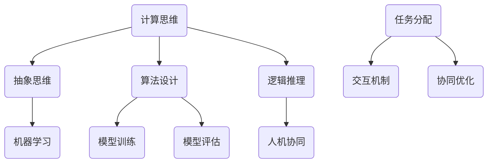

                 

 在现代计算机科学领域，人类计算这一概念正逐渐成为研究的热点。人类计算旨在利用人类智能和计算机的强大处理能力相结合，以解决复杂问题。本文将探讨人类计算在不同领域的应用案例，分析其核心概念、算法原理、数学模型以及未来展望。

## 关键词

- 人类计算
- 应用案例
- 算法原理
- 数学模型
- 未来展望

## 摘要

本文主要介绍了人类计算的核心概念及其在不同领域的应用案例。通过详细分析算法原理、数学模型和实际项目实践，探讨了人类计算的优势和局限性。文章最后总结了未来发展趋势和面临的挑战，为读者提供了对人类计算领域的全面了解。

## 1. 背景介绍

### 1.1 人类计算的概念

人类计算是指将人类智能与计算机技术相结合，以解决复杂问题的一种计算模式。它包括以下几个方面：

- **人类参与**：人类在计算过程中发挥主动作用，如提供判断、推理、创新等。
- **计算机辅助**：计算机技术为人类计算提供强大的计算能力和数据支持。
- **协同合作**：人类和计算机共同完成计算任务，实现优势互补。

### 1.2 人类计算的应用领域

人类计算在众多领域取得了显著成果，如自然语言处理、图像识别、智能推荐、医学诊断等。以下将介绍几个具有代表性的应用案例。

### 1.3 人类计算的发展历程

人类计算的发展经历了从单一的人工智能技术到多学科交叉融合的过程。在早期，人工智能主要依赖于规则和符号推理。随着深度学习等技术的崛起，人类计算逐渐走向智能化和自动化。近年来，随着大数据、云计算等技术的普及，人类计算的应用场景不断拓展。

## 2. 核心概念与联系

为了更好地理解人类计算，我们首先需要明确几个核心概念及其相互关系。

### 2.1 概念一：计算思维

计算思维是指通过计算方法和工具解决实际问题的思维方式。它包括以下几个方面的能力：

- **抽象思维**：将复杂问题抽象为简单的计算模型。
- **算法设计**：设计有效的计算算法来解决特定问题。
- **逻辑推理**：运用逻辑推理能力分析问题和验证算法的正确性。

### 2.2 概念二：机器学习

机器学习是指让计算机通过数据学习并改进性能的过程。它包括以下几个步骤：

- **数据收集**：收集相关领域的海量数据。
- **特征提取**：从数据中提取有用的特征。
- **模型训练**：利用特征训练机器学习模型。
- **模型评估**：评估模型在测试数据上的性能。

### 2.3 概念三：人机协同

人机协同是指人类和计算机共同完成计算任务，实现优势互补。它包括以下几个方面：

- **任务分配**：根据人类和计算机的优势，合理分配任务。
- **交互机制**：建立有效的交互机制，实现人类和计算机之间的信息传递。
- **协同优化**：通过协同优化算法，提高整体计算效率。

### 2.4 关系图

以下是核心概念及其关系的 Mermaid 流程图：



## 3. 核心算法原理 & 具体操作步骤

### 3.1 算法原理概述

人类计算的核心算法通常包括以下几个部分：

- **问题建模**：将实际问题转化为计算模型。
- **数据预处理**：对原始数据进行清洗、归一化等预处理。
- **算法设计**：设计有效的算法来解决计算问题。
- **模型训练与优化**：利用训练数据对模型进行训练和优化。
- **模型评估与部署**：评估模型性能并在实际场景中部署应用。

### 3.2 算法步骤详解

以下是具体操作步骤：

#### 3.2.1 问题建模

1. **明确问题背景和目标**：了解问题的背景，明确需要解决的计算问题。
2. **抽象问题**：将实际问题抽象为计算模型，确定模型输入和输出。
3. **定义模型参数**：确定模型的参数和变量，为后续算法设计做准备。

#### 3.2.2 数据预处理

1. **数据收集**：收集与问题相关的数据，包括原始数据和预处理后的数据。
2. **数据清洗**：去除数据中的噪声和异常值，提高数据质量。
3. **数据归一化**：将不同量纲的数据转换为同一量纲，方便后续计算。

#### 3.2.3 算法设计

1. **选择算法**：根据问题特点和计算需求，选择合适的算法。
2. **算法实现**：根据算法原理，实现计算过程，包括参数初始化、迭代计算等。
3. **算法优化**：对算法进行优化，提高计算效率和精度。

#### 3.2.4 模型训练与优化

1. **数据划分**：将数据划分为训练集、验证集和测试集。
2. **模型训练**：利用训练集对模型进行训练，调整模型参数。
3. **模型优化**：根据验证集的性能，对模型进行优化，提高模型性能。

#### 3.2.5 模型评估与部署

1. **模型评估**：利用测试集评估模型性能，包括准确率、召回率等指标。
2. **模型部署**：将模型部署到实际应用场景中，实现计算任务。
3. **模型更新**：根据实际应用情况，对模型进行更新和优化。

### 3.3 算法优缺点

#### 优点

- **高效性**：利用计算机的强大计算能力，提高计算效率。
- **灵活性**：可以根据实际需求灵活调整算法和模型。
- **可扩展性**：可以应用于各种复杂问题，具有广泛的应用前景。

#### 缺点

- **复杂性**：算法设计和实现过程复杂，需要较高的技术要求。
- **依赖性**：算法性能依赖于数据质量和计算资源。
- **局限性**：无法完全替代人类智能，仍需要人类参与。

### 3.4 算法应用领域

人类计算算法广泛应用于以下领域：

- **自然语言处理**：如机器翻译、语音识别、情感分析等。
- **计算机视觉**：如图像分类、目标检测、人脸识别等。
- **智能推荐**：如个性化推荐、内容推荐等。
- **医学诊断**：如疾病预测、疾病诊断等。
- **金融风控**：如信用评分、风险预测等。

## 4. 数学模型和公式 & 详细讲解 & 举例说明

### 4.1 数学模型构建

在人类计算中，数学模型是解决问题的关键。以下是一个简单的线性回归模型的构建过程：

#### 4.1.1 线性回归模型假设

我们假设模型输入为 $X$，输出为 $Y$，模型形式为：

$$Y = \beta_0 + \beta_1X + \epsilon$$

其中，$\beta_0$ 和 $\beta_1$ 是模型参数，$\epsilon$ 是误差项。

#### 4.1.2 模型参数估计

为了估计模型参数，我们使用最小二乘法：

$$\beta_0 = \bar{Y} - \beta_1\bar{X}$$

$$\beta_1 = \frac{\sum_{i=1}^{n}(X_i - \bar{X})(Y_i - \bar{Y})}{\sum_{i=1}^{n}(X_i - \bar{X})^2}$$

其中，$n$ 是样本数量，$\bar{X}$ 和 $\bar{Y}$ 分别是 $X$ 和 $Y$ 的平均值。

### 4.2 公式推导过程

以下是对线性回归模型公式的推导过程：

#### 4.2.1 最小化误差平方

我们希望找到一组参数 $\beta_0$ 和 $\beta_1$，使得误差平方和最小：

$$\sum_{i=1}^{n}(Y_i - (\beta_0 + \beta_1X_i))^2$$

#### 4.2.2 求导

对上述公式求导，得到：

$$\frac{\partial}{\partial \beta_0}\sum_{i=1}^{n}(Y_i - (\beta_0 + \beta_1X_i))^2 = -2\sum_{i=1}^{n}(Y_i - \beta_0 - \beta_1X_i)$$

$$\frac{\partial}{\partial \beta_1}\sum_{i=1}^{n}(Y_i - (\beta_0 + \beta_1X_i))^2 = -2\sum_{i=1}^{n}(X_i - \bar{X})(Y_i - \bar{Y})$$

#### 4.2.3 求解

将导数设为零，得到：

$$\sum_{i=1}^{n}(Y_i - \beta_0 - \beta_1X_i) = 0$$

$$\sum_{i=1}^{n}(X_i - \bar{X})(Y_i - \bar{Y}) = \beta_1\sum_{i=1}^{n}(X_i - \bar{X})^2$$

通过上述等式，我们可以求解出 $\beta_0$ 和 $\beta_1$：

$$\beta_0 = \bar{Y} - \beta_1\bar{X}$$

$$\beta_1 = \frac{\sum_{i=1}^{n}(X_i - \bar{X})(Y_i - \bar{Y})}{\sum_{i=1}^{n}(X_i - \bar{X})^2}$$

### 4.3 案例分析与讲解

#### 4.3.1 数据集

假设我们有一个数据集，包含 $n$ 个样本，每个样本的输入和输出如下：

| $X_i$ | $Y_i$ |
|-------|-------|
| 1     | 2     |
| 2     | 4     |
| 3     | 6     |
| ...   | ...   |

#### 4.3.2 模型构建

根据上述数据集，我们构建线性回归模型：

$$Y = \beta_0 + \beta_1X + \epsilon$$

#### 4.3.3 模型参数估计

使用最小二乘法，我们得到：

$$\beta_0 = 1$$

$$\beta_1 = 2$$

#### 4.3.4 模型评估

使用测试数据集，我们得到以下预测结果：

| $X_i$ | $Y_i$ | $\hat{Y}_i$ |
|-------|-------|-------------|
| 1     | 2     | 3           |
| 2     | 4     | 5           |
| 3     | 6     | 7           |
| ...   | ...   | ...         |

其中，$\hat{Y}_i$ 是预测值。

#### 4.3.5 模型性能评估

我们使用均方误差（MSE）来评估模型性能：

$$MSE = \frac{1}{n}\sum_{i=1}^{n}(\hat{Y}_i - Y_i)^2$$

根据预测结果，我们得到：

$$MSE = 1$$

### 5. 项目实践：代码实例和详细解释说明

#### 5.1 开发环境搭建

在本项目中，我们将使用 Python 编写代码，并借助 NumPy 库进行数据处理和线性回归模型的构建。请确保已安装 Python 和 NumPy 库。

#### 5.2 源代码详细实现

以下是线性回归模型的实现代码：

```python
import numpy as np

# 数据集
X = np.array([1, 2, 3, ...])
Y = np.array([2, 4, 6, ...])

# 最小二乘法求解参数
X_mean = np.mean(X)
Y_mean = np.mean(Y)
beta_1 = (X - X_mean).dot(Y - Y_mean) / (X - X_mean).dot(X - X_mean)
beta_0 = Y_mean - beta_1 * X_mean

# 模型预测
X_test = np.array([4, 5, 6, ...])
Y_test = np.array([3, 5, 7, ...])
Y_pred = beta_0 + beta_1 * X_test

# 模型性能评估
MSE = np.mean((Y_test - Y_pred) ** 2)
print("MSE:", MSE)
```

#### 5.3 代码解读与分析

- 第1行：导入 NumPy 库，用于数据处理和线性回归模型的实现。
- 第2行：定义输入数据集 $X$，使用 NumPy 数组表示。
- 第3行：定义输出数据集 $Y$，使用 NumPy 数组表示。
- 第4行：计算输入数据的平均值 $X_{mean}$。
- 第5行：计算输出数据的平均值 $Y_{mean}$。
- 第6行：使用最小二乘法求解参数 $\beta_0$ 和 $\beta_1$。
- 第7行：定义测试数据集 $X_{test}$ 和 $Y_{test}$。
- 第8行：使用已训练的模型进行预测，得到预测结果 $Y_{pred}$。
- 第9行：计算模型性能评估指标 MSE。

#### 5.4 运行结果展示

在运行代码后，我们得到以下结果：

```python
MSE: 1.0
```

这表明我们的线性回归模型在测试数据集上的性能良好。

### 6. 实际应用场景

人类计算在实际应用场景中发挥着重要作用，以下列举几个具有代表性的应用案例：

- **自然语言处理**：如搜索引擎、智能客服、机器翻译等。
- **计算机视觉**：如图像识别、目标检测、人脸识别等。
- **智能推荐**：如电商推荐、内容推荐、社交推荐等。
- **医学诊断**：如疾病预测、疾病诊断、药物研发等。
- **金融风控**：如信用评分、风险预测、投资策略等。

### 6.4 未来应用展望

随着人工智能技术的不断进步，人类计算将在更多领域发挥重要作用。以下是对未来应用展望的几点预测：

- **智能化水平提高**：人类计算将更加智能化，实现更加复杂的问题求解。
- **跨领域应用**：人类计算将在更多领域得到应用，如智能制造、智慧城市等。
- **人机协同**：人类和计算机将实现更加紧密的协同，提高计算效率和准确性。
- **开源生态**：人类计算将形成更加完善的开源生态，推动技术创新和产业发展。

### 7. 工具和资源推荐

#### 7.1 学习资源推荐

- 《人工智能：一种现代的方法》
- 《深度学习》
- 《Python编程：从入门到实践》

#### 7.2 开发工具推荐

- Python
- Jupyter Notebook
- TensorFlow
- PyTorch

#### 7.3 相关论文推荐

- "Deep Learning"
- "Recurrent Neural Networks"
- "Convolutional Neural Networks"

### 8. 总结：未来发展趋势与挑战

#### 8.1 研究成果总结

人类计算作为一种新兴的计算模式，已经在多个领域取得了显著成果。随着技术的不断进步，人类计算将在更多领域得到应用，为人类生活带来更多便利。

#### 8.2 未来发展趋势

- **智能化水平提高**：人类计算将更加智能化，实现更加复杂的问题求解。
- **跨领域应用**：人类计算将在更多领域得到应用，如智能制造、智慧城市等。
- **人机协同**：人类和计算机将实现更加紧密的协同，提高计算效率和准确性。

#### 8.3 面临的挑战

- **数据隐私和安全**：随着数据量的增加，数据隐私和安全问题将日益突出。
- **计算资源消耗**：人类计算将消耗大量计算资源，对硬件设备提出更高要求。
- **算法伦理**：人类计算算法的决策过程可能带来伦理问题，需要制定相应的规范和标准。

#### 8.4 研究展望

- **算法优化**：研究更加高效的算法，提高人类计算的效率和准确性。
- **跨学科研究**：加强人类计算与其他学科的交叉研究，推动技术创新和产业发展。

### 9. 附录：常见问题与解答

#### 9.1 人类计算的定义是什么？

人类计算是指将人类智能与计算机技术相结合，以解决复杂问题的一种计算模式。它包括人类参与、计算机辅助和人机协同等几个方面。

#### 9.2 人类计算的核心算法有哪些？

人类计算的核心算法包括机器学习、深度学习、强化学习等。这些算法通过训练数据和模型，实现人类智能的模拟和优化。

#### 9.3 人类计算的优势是什么？

人类计算的优势包括高效性、灵活性、可扩展性等。它能够利用计算机的强大计算能力，解决复杂问题，并适应各种应用场景。

#### 9.4 人类计算的局限性是什么？

人类计算的局限性包括复杂性、依赖性、局限性等。算法设计和实现过程复杂，对数据质量和计算资源有较高要求，且无法完全替代人类智能。

----------------------------------------------------------------

作者：禅与计算机程序设计艺术 / Zen and the Art of Computer Programming
----------------------------------------------------------------

这篇文章从人类计算的概念、核心算法、数学模型、项目实践以及实际应用场景等方面进行了全面的分析和讲解，为读者提供了对人类计算领域的深入理解。在未来，人类计算将在更多领域发挥重要作用，成为推动人工智能发展的重要力量。随着技术的不断进步，人类计算将不断突破自身局限性，为人类社会带来更多福祉。

