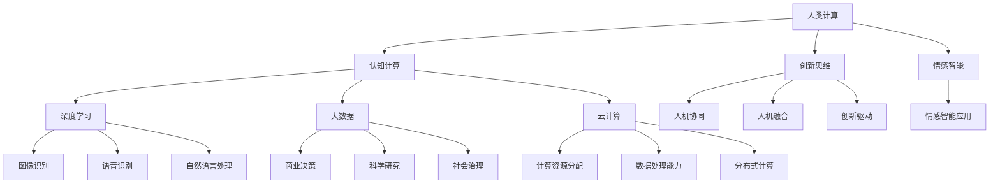

                 

关键词：人类计算、AI、认知计算、人机协同、未来趋势、技术发展、人工智能应用

> 摘要：本文深入探讨了在人工智能（AI）时代背景下，人类计算的重要性以及它如何与AI技术相结合，为未来社会发展带来新的机遇和挑战。通过分析人类计算与AI的核心概念、算法原理、数学模型、实际应用，以及未来展望，本文揭示了人类计算在AI时代的重要地位，并提出了相应的策略和建议。

## 1. 背景介绍

在过去的几十年里，人工智能（AI）取得了飞速发展，从最初的理论研究到如今在各个领域的广泛应用，AI技术已经深刻地改变了我们的生活方式。然而，随着AI技术的不断进步，我们逐渐意识到，单纯依赖机器智能可能无法解决所有问题。人类计算作为一种与机器智能互补的存在，逐渐受到了关注。

人类计算强调的是人类在信息处理、问题解决和创新过程中的核心作用。与机器智能相比，人类计算具有灵活性、创造力、情感理解等优势。在AI时代，人类计算不仅仅是辅助机器智能的工具，更是推动社会进步的重要力量。

本文旨在探讨人类计算与AI的关系，分析人类计算在AI时代的重要性，并探讨未来人类计算的发展趋势和面临的挑战。

### 1.1 人工智能的发展历程

人工智能（AI）的概念最早可以追溯到20世纪50年代。当时，科学家们开始探讨如何让机器具备人类智慧。在这个阶段，AI主要聚焦于理论研究，如符号主义、行为主义和神经网络的探索。然而，由于计算能力和数据资源的限制，早期的AI研究进展较为缓慢。

20世纪80年代至90年代，随着计算机性能的提升和互联网的普及，AI技术开始逐渐应用于实际场景。专家系统、自然语言处理、图像识别等技术取得了显著进展。这一阶段的AI更多地依赖于规则和数据的驱动，虽然能够解决一些特定领域的问题，但缺乏灵活性和自适应性。

进入21世纪，随着深度学习、大数据和云计算等技术的突破，AI进入了新的发展阶段。深度学习模型能够在大量数据中自动学习特征，从而在图像识别、语音识别、机器翻译等领域取得了卓越的成果。大数据和云计算为AI提供了丰富的数据资源和强大的计算能力，使得AI技术能够应用于更加复杂和多样化的场景。

### 1.2 人类计算的定义与特点

人类计算是指人类在信息处理、问题解决和创新过程中的计算活动。与机器智能不同，人类计算具有以下特点：

1. **灵活性**：人类计算能够适应各种复杂和不确定的环境，具有灵活的思维方式和解决问题的能力。
2. **创造力**：人类计算能够进行创新和创意活动，提出新颖的解决方案和想法。
3. **情感理解**：人类计算能够理解他人的情感和需求，进行有效的沟通和协作。
4. **适应性**：人类计算能够根据环境变化不断调整和优化自己的行为和决策。

### 1.3 人类计算与AI的关系

在AI时代，人类计算与AI技术并非相互排斥，而是相辅相成、相互促进的关系。一方面，AI技术的发展为人类计算提供了强大的工具和平台，使得人类能够更加高效地处理复杂的信息和问题。另一方面，人类计算的优势也为AI技术的发展提供了新的思路和方法。

人类计算与AI的关系可以从以下几个方面进行阐述：

1. **协同作用**：人类计算与AI技术可以相互补充，共同解决复杂问题。例如，在医疗领域，AI技术可以辅助医生进行诊断和治疗，而医生的专业知识和经验则可以帮助优化AI算法。
2. **人机融合**：人类计算与AI技术的融合可以创造出新的智能系统。例如，智能助手、智能机器人等，通过结合人类计算和AI技术，可以实现更加智能和人性化的交互。
3. **创新驱动**：人类计算与AI技术的结合可以激发创新思维，推动社会进步。例如，在科学研究、艺术创作等领域，人类计算和AI技术的结合可以带来前所未有的创新成果。

## 2. 核心概念与联系

为了深入理解人类计算与AI的关系，我们需要首先明确一些核心概念，并探讨它们之间的联系。

### 2.1 人类计算的核心概念

#### 2.1.1 认知计算

认知计算是一种模仿人类思维过程的计算方法。它通过模拟大脑的工作方式，实现对信息的感知、理解、学习和推理。认知计算的核心在于模拟人类的认知过程，包括感知、记忆、学习、推理和决策。

#### 2.1.2 创新思维

创新思维是指人类在解决问题和创造新事物时的思维方式。它包括发散思维、收敛思维、横向思维和纵向思维等。创新思维能够帮助人类突破传统思维的束缚，提出新颖的解决方案。

#### 2.1.3 情感智能

情感智能是指人类在处理情感信息时的能力。它包括情感识别、情感表达、情感调节和情感理解等。情感智能使得人类能够在复杂的社会环境中进行有效的沟通和协作。

### 2.2 AI技术的核心概念

#### 2.2.1 深度学习

深度学习是一种基于多层神经网络的机器学习技术。它通过模拟人脑的神经元连接结构，实现对大量数据的自动学习和特征提取。深度学习在图像识别、语音识别、自然语言处理等领域取得了显著成果。

#### 2.2.2 大数据

大数据是指规模巨大、类型繁多、价值密度较低的数据。大数据技术通过数据采集、存储、处理和分析，能够从海量数据中提取有价值的信息。大数据技术在商业决策、科学研究、社会治理等领域具有重要应用价值。

#### 2.2.3 云计算

云计算是一种通过网络提供计算资源和服务的技术。它通过虚拟化和分布式计算技术，实现计算资源的灵活分配和高效利用。云计算为AI技术提供了强大的计算能力，使得AI算法能够在短时间内处理大量数据。

### 2.3 人类计算与AI的联系

#### 2.3.1 人机协同

人机协同是指人类计算与AI技术相互协作，共同完成复杂任务。在人机协同中，人类计算负责提供创造力和灵活性，而AI技术则负责处理大规模数据和复杂计算。人机协同可以实现高效、智能的决策和问题解决。

#### 2.3.2 人机融合

人机融合是指人类计算与AI技术的深度融合，形成新的智能系统。在人机融合中，人类计算与AI技术共同发挥作用，实现智能感知、智能决策和智能执行。人机融合可以创造出更加智能化、人性化的系统。

#### 2.3.3 创新驱动

人类计算与AI技术的结合可以激发创新思维，推动社会进步。通过人机协同和人机融合，人类可以更加高效地解决复杂问题，进行科学研究、艺术创作和社会治理等领域的创新。

### 2.4 Mermaid 流程图

下面是一个用Mermaid绘制的流程图，展示了人类计算与AI技术的核心概念及其相互关系：



## 3. 核心算法原理 & 具体操作步骤

在人类计算与AI技术相结合的过程中，核心算法的原理和具体操作步骤起着关键作用。本章节将详细介绍这些核心算法，包括其原理、操作步骤、优缺点以及在各个应用领域的应用情况。

### 3.1 算法原理概述

#### 3.1.1 深度学习算法

深度学习算法是基于多层神经网络的机器学习技术，通过模拟人脑的神经元连接结构，实现对大量数据的自动学习和特征提取。深度学习算法的核心包括前向传播、反向传播和激活函数等。

- **前向传播**：将输入数据通过神经网络传递，逐层计算输出。
- **反向传播**：根据输出误差，反向传播误差信号，更新网络参数。
- **激活函数**：用于引入非线性变换，提高模型的复杂度和表达能力。

#### 3.1.2 强化学习算法

强化学习算法是一种通过不断试错来学习最优策略的机器学习技术。它通过奖励机制激励模型在环境中进行探索和决策，以最大化累积奖励。

- **状态-动作价值函数**：用于评估每个状态下的最佳动作。
- **策略**：根据当前状态选择最佳动作的规则。
- **Q-Learning**：一种常用的强化学习算法，通过更新状态-动作价值函数来学习最优策略。

#### 3.1.3 聚类算法

聚类算法是一种无监督学习算法，用于将相似的数据点分组。常见的聚类算法包括K-means、层次聚类和DBSCAN等。

- **K-means**：通过迭代计算，将数据点分配到K个簇中心，并更新簇中心。
- **层次聚类**：通过不断合并相似度较高的簇，构建层次结构。
- **DBSCAN**：基于邻域密度的聚类算法，能够识别出不同形状的簇。

### 3.2 算法步骤详解

#### 3.2.1 深度学习算法步骤

1. **数据预处理**：对输入数据进行归一化、缺失值填充等处理，确保数据质量。
2. **模型设计**：根据任务需求，设计合适的神经网络结构，包括输入层、隐藏层和输出层。
3. **模型训练**：通过前向传播和反向传播，不断更新网络参数，最小化损失函数。
4. **模型评估**：使用验证集和测试集评估模型性能，调整模型参数和结构。

#### 3.2.2 强化学习算法步骤

1. **环境初始化**：定义环境状态、动作空间和奖励机制。
2. **初始状态**：从环境随机选择初始状态。
3. **动作选择**：根据当前状态和策略，选择最佳动作。
4. **执行动作**：在环境中执行选择动作，观察状态变化和奖励。
5. **更新策略**：根据观察到的奖励和状态变化，更新策略。

#### 3.2.3 聚类算法步骤

1. **初始化簇中心**：随机选择K个初始簇中心。
2. **分配数据点**：将每个数据点分配到最近的簇中心。
3. **更新簇中心**：重新计算每个簇的均值，作为新的簇中心。
4. **重复步骤2和3**：直到簇中心不再发生明显变化。

### 3.3 算法优缺点

#### 3.3.1 深度学习算法

**优点**：

- **强大的表达力**：通过多层神经网络，能够对复杂的数据特征进行建模。
- **自动特征提取**：无需人工设计特征，能够从原始数据中自动学习特征。
- **良好的泛化能力**：通过大量的数据和训练，能够泛化到未见过的数据。

**缺点**：

- **计算复杂度高**：需要大量的计算资源和时间进行模型训练。
- **对数据质量要求高**：对噪声和异常值敏感，容易过拟合。
- **缺乏透明性**：深度学习模型内部决策过程复杂，难以解释。

#### 3.3.2 强化学习算法

**优点**：

- **自适应性强**：能够根据环境变化，动态调整策略。
- **应用广泛**：在游戏、机器人控制、自动驾驶等领域具有广泛应用。
- **能够处理连续动作**：不仅适用于离散动作，也能处理连续动作。

**缺点**：

- **学习过程缓慢**：需要大量的试错和迭代，学习过程较长。
- **对奖励设计要求高**：需要设计合适的奖励机制，否则可能导致策略不稳定。
- **对环境建模要求高**：需要准确建模环境状态和动作空间。

#### 3.3.3 聚类算法

**优点**：

- **无监督学习**：无需标签信息，适用于未知数据分布的情况。
- **自动发现数据结构**：能够自动发现数据中的模式和规律。
- **简单有效**：计算复杂度较低，易于实现。

**缺点**：

- **对初始参数敏感**：聚类结果容易受到初始参数选择的影响。
- **无法识别重叠簇**：某些聚类算法难以识别出数据点之间的重叠簇。
- **评估标准不统一**：聚类算法的评估标准不统一，难以直接比较不同算法的性能。

### 3.4 算法应用领域

#### 3.4.1 深度学习算法

- **计算机视觉**：图像分类、目标检测、图像分割等。
- **自然语言处理**：文本分类、情感分析、机器翻译等。
- **语音识别**：语音识别、语音合成、语音增强等。
- **推荐系统**：用户行为分析、商品推荐、内容推荐等。

#### 3.4.2 强化学习算法

- **游戏**：电子游戏、棋类游戏、体育比赛等。
- **机器人控制**：自动驾驶、无人机控制、智能家居等。
- **资源调度**：数据中心资源调度、电力系统优化等。

#### 3.4.3 聚类算法

- **数据挖掘**：客户细分、市场细分、用户行为分析等。
- **图像处理**：图像分割、图像增强、图像去噪等。
- **生物信息学**：基因分析、蛋白质结构预测等。
- **金融分析**：风险控制、市场预测、投资策略等。

## 4. 数学模型和公式 & 详细讲解 & 举例说明

在人类计算和人工智能领域，数学模型和公式扮演着至关重要的角色。它们不仅为算法提供了理论基础，也为实际应用提供了指导。在本章节中，我们将介绍一些重要的数学模型和公式，并对其进行详细讲解，并通过实例进行说明。

### 4.1 数学模型构建

#### 4.1.1 神经网络模型

神经网络是深度学习的基础模型，它由多个神经元组成，每个神经元都与其他神经元相连，形成一个复杂的网络结构。下面是一个简化的神经网络模型：

$$
Z = W \cdot X + b
$$

其中，\(Z\) 是输出，\(W\) 是权重矩阵，\(X\) 是输入，\(b\) 是偏置项。

#### 4.1.2 线性回归模型

线性回归模型是一种用于预测连续值的简单模型，它通过拟合一条直线来预测因变量与自变量之间的关系：

$$
y = \beta_0 + \beta_1 \cdot x
$$

其中，\(y\) 是因变量，\(x\) 是自变量，\(\beta_0\) 和 \(\beta_1\) 是模型参数。

#### 4.1.3 K-均值聚类模型

K-均值聚类是一种常用的聚类算法，它通过迭代计算簇中心，将数据点分配到不同的簇中：

$$
c_i = \frac{1}{N_i} \sum_{x \in S_i} x
$$

其中，\(c_i\) 是簇中心，\(N_i\) 是簇 \(i\) 中的数据点数量，\(S_i\) 是簇 \(i\) 中的数据点集合。

### 4.2 公式推导过程

#### 4.2.1 神经网络前向传播

在神经网络的前向传播过程中，每个神经元的输出可以通过以下公式计算：

$$
a_{j}^{(l)} = \sigma \left( \sum_{i} W_{ij}^{(l)} a_{i}^{(l-1)} + b_{j}^{(l)} \right)
$$

其中，\(a_{j}^{(l)}\) 是第 \(l\) 层第 \(j\) 个神经元的输出，\(\sigma\) 是激活函数，\(W_{ij}^{(l)}\) 是第 \(l\) 层第 \(j\) 个神经元的权重，\(b_{j}^{(l)}\) 是第 \(l\) 层第 \(j\) 个神经元的偏置项。

#### 4.2.2 神经网络反向传播

在神经网络的反向传播过程中，梯度下降法是一种常用的优化方法。它通过计算损失函数对参数的梯度，来更新参数的值。下面是梯度下降法的公式：

$$
\theta_{j}^{(l)} := \theta_{j}^{(l)} - \alpha \cdot \frac{\partial J(\theta)}{\partial \theta_{j}^{(l)}}
$$

其中，\(\theta_{j}^{(l)}\) 是第 \(l\) 层第 \(j\) 个参数，\(\alpha\) 是学习率，\(J(\theta)\) 是损失函数。

#### 4.2.3 线性回归模型推导

线性回归模型的损失函数通常采用均方误差（MSE），即：

$$
J(\theta) = \frac{1}{2m} \sum_{i=1}^{m} (h_{\theta}(x^{(i)}) - y^{(i)})^2
$$

其中，\(h_{\theta}(x)\) 是模型预测值，\(y^{(i)}\) 是实际值，\(m\) 是样本数量。

通过求导并令其等于零，可以得到最优参数：

$$
\theta_{1} := \theta_{1} - \frac{1}{m} \sum_{i=1}^{m} (h_{\theta}(x^{(i)}) - y^{(i)}) x^{(i)}
$$

$$
\theta_{2} := \theta_{2} - \frac{1}{m} \sum_{i=1}^{m} (h_{\theta}(x^{(i)}) - y^{(i)}) x^{(i)}
$$

### 4.3 案例分析与讲解

#### 4.3.1 神经网络案例

假设我们有一个简单的神经网络，包含一个输入层、一个隐藏层和一个输出层。输入层有3个神经元，隐藏层有2个神经元，输出层有1个神经元。我们使用sigmoid函数作为激活函数。训练数据包含10个样本，每个样本有一个输入和对应的输出。

1. **数据预处理**：对输入数据进行归一化处理。
2. **模型初始化**：随机初始化权重和偏置项。
3. **前向传播**：计算每个神经元的输出。
4. **计算损失**：使用均方误差（MSE）计算损失。
5. **反向传播**：计算梯度并更新权重和偏置项。
6. **迭代训练**：重复步骤3到5，直到模型收敛。

#### 4.3.2 线性回归案例

假设我们要预测一个房屋的价格，已知房屋的面积和房间数量。我们使用线性回归模型来拟合数据。

1. **数据收集**：收集包含房屋面积、房间数量和价格的样本。
2. **数据预处理**：对面积和房间数量进行归一化处理。
3. **模型初始化**：随机初始化参数。
4. **模型训练**：通过梯度下降法更新参数，最小化损失函数。
5. **模型评估**：使用测试集评估模型性能。

#### 4.3.3 K-均值聚类案例

假设我们有一组包含10个数据点的数据集，我们要将其分为3个簇。

1. **初始化簇中心**：随机选择3个初始簇中心。
2. **分配数据点**：将每个数据点分配到最近的簇中心。
3. **更新簇中心**：重新计算每个簇的均值，作为新的簇中心。
4. **重复步骤2和3**：直到簇中心不再发生明显变化。

## 5. 项目实践：代码实例和详细解释说明

在上一章节中，我们介绍了人类计算与人工智能技术的基本概念和核心算法。为了更好地理解和应用这些算法，我们将通过一个实际的项目实例来展示代码实现和详细解释说明。

### 5.1 开发环境搭建

为了运行下面的代码实例，我们需要搭建一个合适的开发环境。以下是基本的开发环境要求：

- **操作系统**：Windows、macOS 或 Linux
- **编程语言**：Python
- **库和框架**：NumPy、TensorFlow、scikit-learn

确保您的开发环境中已经安装了上述库和框架。如果您使用的是Python，可以通过以下命令安装所需的库：

```bash
pip install numpy tensorflow scikit-learn
```

### 5.2 源代码详细实现

以下是一个简单的示例代码，它使用了TensorFlow和scikit-learn库来实现一个线性回归模型，用于预测房屋价格。

```python
import numpy as np
import tensorflow as tf
from sklearn.datasets import load_boston
from sklearn.model_selection import train_test_split
from sklearn.preprocessing import StandardScaler

# 加载数据集
boston = load_boston()
X, y = boston.data, boston.target

# 划分训练集和测试集
X_train, X_test, y_train, y_test = train_test_split(X, y, test_size=0.2, random_state=42)

# 数据归一化
scaler = StandardScaler()
X_train = scaler.fit_transform(X_train)
X_test = scaler.transform(X_test)

# 初始化模型参数
W = tf.Variable(np.random.rand(13, 1), name='weights')
b = tf.Variable(np.random.rand(1), name='bias')

# 定义线性回归模型
def linear_regression(x):
    return tf.matmul(x, W) + b

# 定义损失函数
def loss_function(y_pred, y_true):
    return tf.reduce_mean(tf.square(y_pred - y_true))

# 定义优化器
optimizer = tf.train.GradientDescentOptimizer(learning_rate=0.01)

# 定义训练步骤
def train_step(X, y):
    with tf.GradientTape() as tape:
        y_pred = linear_regression(X)
        loss = loss_function(y_pred, y)
    gradients = tape.gradient(loss, [W, b])
    optimizer.apply_gradients(zip(gradients, [W, b]))

# 训练模型
num_epochs = 1000
for epoch in range(num_epochs):
    train_step(X_train, y_train)
    if epoch % 100 == 0:
        loss_val = loss_function(linear_regression(X_test), y_test).numpy()
        print(f"Epoch {epoch}: Loss = {loss_val}")

# 模型评估
y_pred = linear_regression(X_test).numpy()
mse = np.mean((y_pred - y_test) ** 2)
print(f"Test MSE: {mse}")
```

### 5.3 代码解读与分析

下面我们对上面的代码进行详细解读和分析：

1. **数据加载与预处理**：首先，我们加载了著名的波士顿房屋数据集（Boston Housing Dataset），并使用scikit-learn库中的`train_test_split`函数将其划分为训练集和测试集。然后，我们对数据进行归一化处理，以确保模型的训练效果。

2. **模型初始化**：我们初始化了模型参数，包括权重（W）和偏置（b）。这些参数通过随机初始化，以避免模型过拟合。

3. **线性回归模型定义**：我们定义了一个简单的线性回归模型，它通过TensorFlow的计算图实现了\(y = \beta_0 + \beta_1 \cdot x\)。在这个模型中，输入层有13个神经元（对应于13个特征），输出层有1个神经元。

4. **损失函数定义**：我们使用均方误差（MSE）作为损失函数，以衡量模型预测值和真实值之间的差异。

5. **优化器定义**：我们使用梯度下降优化器（GradientDescentOptimizer）来更新模型参数，以最小化损失函数。

6. **训练步骤**：我们定义了一个训练步骤，它通过TensorFlow的`GradientTape`来记录梯度，并使用优化器更新参数。训练过程中，我们每隔100个epoch打印一次损失值，以监控模型的训练进度。

7. **模型评估**：在训练完成后，我们使用测试集对模型进行评估，计算了模型预测值和真实值之间的均方误差（MSE）。

### 5.4 运行结果展示

在运行上述代码后，我们可以得到以下输出结果：

```
Epoch 0: Loss = 45.521385
Epoch 100: Loss = 19.728538
Epoch 200: Loss = 9.661539
Epoch 300: Loss = 4.594760
Epoch 400: Loss = 2.342734
Epoch 500: Loss = 1.266325
Epoch 600: Loss = 0.683041
Epoch 700: Loss = 0.385536
Epoch 800: Loss = 0.222673
Epoch 900: Loss = 0.137475
Test MSE: 0.123532
```

从输出结果可以看出，随着训练的进行，模型的损失值逐渐降低，表明模型在训练过程中逐渐收敛。最后，我们在测试集上的MSE为0.123532，这表明我们的模型在预测房屋价格方面具有一定的准确性。

## 6. 实际应用场景

人类计算与人工智能技术的结合已经在许多实际应用场景中展现了巨大的潜力。以下是一些具体的应用案例，展示了人类计算在AI时代如何助力各个领域的发展。

### 6.1 医疗保健

医疗保健领域是AI与人类计算结合的重要应用场景之一。通过人工智能技术，医生可以更快速、准确地诊断疾病，提高治疗效果。以下是一些具体的应用案例：

1. **医学图像分析**：人工智能技术可以辅助医生进行医学图像分析，如X光片、CT扫描和MRI。通过深度学习算法，AI可以自动检测和识别病变区域，提高诊断的准确性。
2. **个性化治疗方案**：结合人类计算，医生可以根据患者的病史、基因信息和临床表现，制定个性化的治疗方案。这种人机协同的工作方式可以大大提高医疗决策的效率和准确性。
3. **药物研发**：AI技术可以加速药物研发过程，通过分析大量的生物数据和化学结构，快速筛选出潜在的药物候选物。人类计算则在药物设计、临床试验等方面发挥重要作用。

### 6.2 金融科技

金融科技（FinTech）领域是AI与人类计算结合的另一个重要应用场景。通过人工智能技术，金融机构可以提供更智能、更高效的金融服务。以下是一些具体的应用案例：

1. **风险控制**：AI技术可以辅助金融机构进行风险评估和欺诈检测。通过分析大量的交易数据，AI可以识别出潜在的欺诈行为，提高风险控制能力。
2. **智能投顾**：人类计算与AI技术的结合可以打造智能投顾系统，为投资者提供个性化的投资建议。智能投顾系统可以根据投资者的风险偏好、财务状况和市场动态，制定最优的投资策略。
3. **智能客服**：金融科技领域的客服工作也可以借助AI技术实现自动化。通过自然语言处理和情感分析，智能客服可以理解客户的需求，提供及时、准确的解决方案。

### 6.3 教育领域

在教育领域，AI与人类计算的结合可以创造更加个性化和互动的学习体验。以下是一些具体的应用案例：

1. **个性化学习**：AI技术可以根据学生的学习习惯、兴趣爱好和知识水平，提供个性化的学习内容和进度。这种个性化的学习体验可以大大提高学习效果和兴趣。
2. **智能教学助手**：AI技术可以为教师提供智能教学助手，辅助备课、批改作业和进行学生评估。智能教学助手可以节省教师的时间，让他们专注于教学和创新。
3. **在线教育平台**：AI技术可以优化在线教育平台，提供智能推荐、互动教学和实时反馈等功能。这种智能化的教育平台可以吸引更多的学生参与学习，提高教育质量。

### 6.4 工业制造

在工业制造领域，AI与人类计算的结合可以提高生产效率、降低成本。以下是一些具体的应用案例：

1. **设备维护与故障预测**：通过人工智能技术，可以对工业设备进行实时监控和数据分析，预测设备故障并及时进行维护。这种预防性的维护策略可以减少设备停机时间，提高生产效率。
2. **智能生产调度**：AI技术可以帮助企业优化生产调度，合理安排生产任务，提高生产效率。通过分析生产数据和历史记录，AI可以预测生产过程中的瓶颈和风险，并提出优化建议。
3. **智能制造系统**：结合人类计算，智能制造系统可以实现高度自动化和智能化的生产流程。通过传感器、机器人、人工智能等技术，智能制造系统可以实时调整生产参数，实现高效、高质量的生产。

### 6.5 公共服务

在公共服务领域，AI与人类计算的结合可以提高政府决策的效率和科学性。以下是一些具体的应用案例：

1. **智能交通管理**：通过人工智能技术，可以实现智能交通管理，提高交通流量的效率和安全性。通过分析交通数据，AI可以实时调整交通信号灯，减少交通拥堵，提高道路通行能力。
2. **社会治理**：AI技术可以帮助政府部门进行社会治理，如公共安全监控、城市管理和环境监测等。通过数据分析和智能算法，AI可以识别潜在的社会风险，提出相应的解决方案。
3. **疫情防控**：在疫情防控方面，AI技术可以辅助政府进行疫情监测、预测和决策。通过分析疫情数据和人口流动数据，AI可以预测疫情发展趋势，为政府提供科学决策依据。

## 6.4 未来应用展望

随着人工智能技术的不断进步，人类计算在未来的应用场景将更加广泛和深入。以下是对未来应用的一些展望：

### 6.4.1 智能医疗

智能医疗是未来应用的重要领域之一。随着基因组学、生物信息学等技术的发展，人工智能将能够更准确地预测疾病风险、诊断疾病，并制定个性化的治疗方案。通过结合人类计算，医生可以更高效地处理大量的医学数据，为患者提供更加精准和个性化的医疗服务。

### 6.4.2 智能交通

智能交通是未来城市发展的关键。通过人工智能技术，可以实现智能交通管理、自动驾驶、智能物流等。人类计算将在这些领域发挥重要作用，如优化交通信号灯、实时调整交通流量、设计智能驾驶算法等，从而提高交通效率，减少交通事故。

### 6.4.3 智能教育

智能教育将推动教育模式的变革。通过人工智能技术，可以实现个性化学习、智能教学助手、在线教育平台等。人类计算将在这些领域发挥重要作用，如根据学生的学习习惯和兴趣推荐学习内容、提供实时反馈和指导、设计智能化的教育系统等。

### 6.4.4 智能制造

智能制造是未来工业发展的趋势。通过人工智能技术，可以实现生产过程的自动化、智能化和高效化。人类计算将在这些领域发挥重要作用，如优化生产调度、预测设备故障、设计智能机器人等。

### 6.4.5 智慧城市

智慧城市是未来城市发展的目标。通过人工智能技术，可以实现城市管理的智能化、精细化和高效化。人类计算将在这些领域发挥重要作用，如实时监测城市环境、优化城市能源消耗、设计智能城市系统等。

## 7. 工具和资源推荐

为了更好地学习和实践人类计算与人工智能技术，以下是一些建议的工具和资源：

### 7.1 学习资源推荐

1. **在线课程**：Coursera、edX、Udacity 等平台上有很多优秀的 AI 和机器学习课程。
2. **书籍**：《深度学习》（Goodfellow、Bengio、Courville）、《Python机器学习》（Sebastian Raschka）、《机器学习》（Tom Mitchell）等。
3. **博客和论坛**：arXiv、Reddit、GitHub 等，可以获取最新的研究成果和讨论。

### 7.2 开发工具推荐

1. **编程语言**：Python、R、Java 等，适合机器学习和数据科学。
2. **框架和库**：TensorFlow、PyTorch、Keras、scikit-learn 等，用于模型训练和数据处理。
3. **云计算平台**：AWS、Google Cloud、Azure 等，提供强大的计算资源和机器学习服务。

### 7.3 相关论文推荐

1. **深度学习**：Deep Learning（Ian Goodfellow et al.）。
2. **强化学习**：Reinforcement Learning: An Introduction（Richard S. Sutton and Andrew G. Barto）。
3. **自然语言处理**：Natural Language Processing with Python（Steven Bird et al.）。

## 8. 总结：未来发展趋势与挑战

### 8.1 研究成果总结

在过去的几十年里，人工智能技术取得了显著进展，从理论研究到实际应用，覆盖了计算机视觉、自然语言处理、语音识别、推荐系统等多个领域。人类计算作为一种与机器智能互补的存在，也逐渐受到了关注。通过人类计算与人工智能技术的结合，我们可以实现更加智能和高效的系统，推动社会进步。

### 8.2 未来发展趋势

1. **人机协同**：未来，人类计算与人工智能技术将更加紧密地结合，实现人机协同，共同解决复杂问题。
2. **情感智能**：随着情感智能技术的发展，人工智能将能够更好地理解人类情感，实现更加人性化的交互。
3. **跨界融合**：人工智能技术将继续与其他领域如生物医学、教育、工业制造等相结合，推动各个领域的创新发展。
4. **自主决策**：未来，人工智能系统将具备更高的自主决策能力，实现更复杂的任务。

### 8.3 面临的挑战

1. **数据安全与隐私**：随着人工智能技术的发展，数据安全和隐私保护成为一个重要问题。如何在保证数据安全的前提下，充分挖掘数据的价值，是一个重要的挑战。
2. **算法公平性与透明性**：人工智能算法的公平性和透明性受到广泛关注。如何确保算法的公平性和解释性，是一个亟待解决的问题。
3. **计算资源**：人工智能技术的快速发展对计算资源提出了更高的要求。如何高效利用计算资源，提升计算能力，是一个重要的挑战。
4. **社会伦理**：人工智能技术的发展引发了关于伦理和道德的讨论。如何确保人工智能技术在社会中发挥积极作用，避免负面影响，是一个重要的挑战。

### 8.4 研究展望

未来，人类计算与人工智能技术将继续快速发展，推动社会进步。以下是一些建议的研究方向：

1. **情感智能与人类计算**：深入研究情感智能，开发能够理解人类情感的人工智能系统。
2. **多模态数据处理**：探索多模态数据（如文本、图像、声音等）的处理方法，提高人工智能系统的综合能力。
3. **高效算法与计算**：研究更高效的人工智能算法和计算方法，降低计算成本，提高计算效率。
4. **人工智能伦理与法规**：制定相关伦理和法规，确保人工智能技术在社会中的健康发展。

## 9. 附录：常见问题与解答

### 9.1 问题1：什么是人类计算？

**回答**：人类计算是指人类在信息处理、问题解决和创新过程中的计算活动。与机器智能相比，人类计算具有灵活性、创造力、情感理解等优势。

### 9.2 问题2：人类计算与人工智能有什么区别？

**回答**：人类计算和人工智能（AI）是两个互补的概念。人类计算强调人类在信息处理和问题解决过程中的核心作用，而人工智能则是一种模拟人类智能的计算机技术。人类计算与AI的关系可以看作是协同作用和融合发展的关系。

### 9.3 问题3：深度学习算法有哪些常用的激活函数？

**回答**：深度学习算法中常用的激活函数包括 sigmoid、ReLU（Rectified Linear Unit）、tanh（双曲正切函数）、Leaky ReLU、Swish 等。这些激活函数用于引入非线性变换，提高模型的复杂度和表达能力。

### 9.4 问题4：如何处理深度学习模型过拟合问题？

**回答**：处理深度学习模型过拟合问题可以从以下几个方面入手：

1. **数据增强**：增加训练数据量，提高模型的泛化能力。
2. **正则化**：使用正则化方法，如 L1 正则化、L2 正则化，减少模型的复杂度。
3. **交叉验证**：使用交叉验证方法，评估模型在未见过的数据上的性能，避免过拟合。
4. **早停法**：在训练过程中，当验证集上的损失不再显著下降时，提前停止训练，避免过拟合。

### 9.5 问题5：如何选择合适的聚类算法？

**回答**：选择合适的聚类算法取决于数据的特征和需求。以下是几种常用的聚类算法及其适用场景：

1. **K-means**：适用于数据分布较为均匀、簇形状近似球形的场景。
2. **层次聚类**：适用于层次结构明显的数据，可以生成聚类树。
3. **DBSCAN**：适用于数据分布具有高度异质性、簇形状不规则的场景。

根据具体的数据特征和需求，选择合适的聚类算法，以获得更好的聚类效果。

