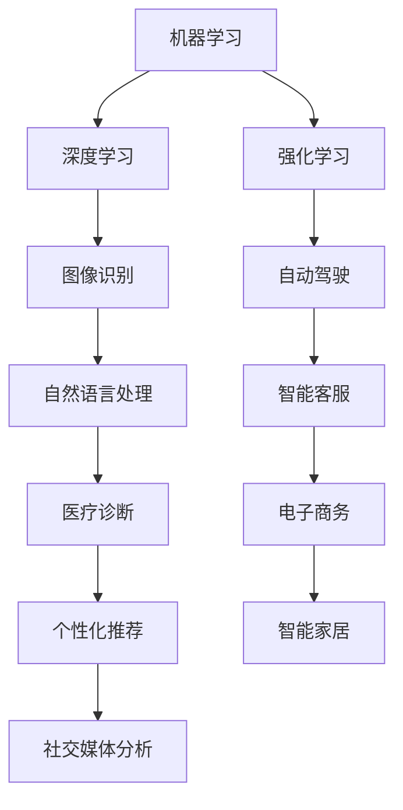

                 

### 关键词 Keywords ###
AI, 人工智能，就业市场，技能培训，技术趋势，职业发展

### 摘要 Abstract ###
本文将深入探讨人工智能（AI）时代下未来就业市场的变化趋势，以及与技能培训的紧密关联。通过分析当前AI技术的发展状况，预测未来可能出现的职业角色，并探讨为适应这些变化所需的培训方案。文章旨在为读者提供关于AI时代职业发展的见解，帮助人们做好准备，迎接未来工作的挑战。

## 1. 背景介绍 Background

### 1.1 人工智能的历史与现状

人工智能（AI）的概念早在20世纪50年代就已经出现。然而，随着计算能力的提升、大数据的涌现以及机器学习算法的进步，AI技术在过去几十年里取得了飞速的发展。从最初的规则基础专家系统，到基于统计学习的模式识别，再到如今的深度学习与强化学习，AI在各个领域展现出了巨大的潜力。

### 1.2 AI技术对社会的影响

AI技术的应用已经渗透到我们日常生活的方方面面，从智能家居、在线购物，到自动驾驶、医疗诊断，AI正在改变我们的工作方式和生活习惯。随着AI技术的不断成熟，其对社会的深远影响也在逐步显现。

### 1.3 就业市场的变化

人工智能的发展对就业市场产生了深远的影响。一方面，AI技术创造了新的工作岗位，另一方面，它也导致了一些传统职位的消失。这种变化给劳动者带来了巨大的挑战，同时也为职业培训提出了新的要求。

## 2. 核心概念与联系 Core Concepts and Relationships

为了更好地理解AI时代下就业市场与技能培训的关系，我们需要明确几个核心概念。

### 2.1 人工智能的关键技术

#### 2.1.1 机器学习
机器学习是AI的核心技术之一，它使计算机系统能够从数据中学习并做出决策。常见的机器学习算法包括决策树、支持向量机、神经网络等。

#### 2.1.2 深度学习
深度学习是机器学习的一个子领域，它通过模拟人脑中的神经网络结构，实现更加复杂的任务。深度学习在图像识别、语音识别和自然语言处理等领域有着广泛的应用。

#### 2.1.3 强化学习
强化学习是一种通过试错来学习策略的机器学习技术。它通过与环境的交互，不断优化行为，以实现特定目标。

### 2.2 技能培训与职业发展的关系

技能培训是提高劳动者竞争力的关键。在AI时代，技能培训不仅是为了掌握新技术，更是为了适应不断变化的就业市场。有效的技能培训可以帮助劳动者提高适应能力和创新能力，从而在竞争中脱颖而出。

### 2.3 Mermaid流程图

下面是一个关于AI技术架构的Mermaid流程图，展示了人工智能的核心组成部分及其相互关系：



## 3. 核心算法原理 & 具体操作步骤 Core Algorithm Principle & Step-by-Step Guide

### 3.1 算法原理概述

人工智能的核心在于算法，其中机器学习、深度学习和强化学习是最为关键的算法。以下是这些算法的基本原理概述。

#### 3.1.1 机器学习

机器学习是一种通过数据训练模型，使其能够从经验中学习和改进的技术。其基本原理是使用统计方法来识别数据中的模式，并利用这些模式进行预测或分类。

#### 3.1.2 深度学习

深度学习是一种基于多层神经网络的学习方法。它通过构建深度神经网络，模拟人脑的处理方式，从而实现复杂的数据分析和模式识别。

#### 3.1.3 强化学习

强化学习是一种通过试错来学习策略的算法。它通过奖励机制来指导系统如何与环境交互，从而逐渐优化其行为，以实现特定目标。

### 3.2 算法步骤详解

#### 3.2.1 机器学习

1. 数据采集：收集大量数据，用于训练模型。
2. 特征提取：从数据中提取出有用的特征，用于训练模型。
3. 模型训练：使用训练数据来训练模型。
4. 模型评估：使用测试数据来评估模型的性能。
5. 模型优化：根据评估结果，对模型进行调整和优化。

#### 3.2.2 深度学习

1. 网络构建：设计神经网络的结构，包括输入层、隐藏层和输出层。
2. 损失函数定义：定义一个损失函数，用于评估模型的预测结果与实际结果之间的差异。
3. 梯度下降：使用梯度下降算法，通过反向传播更新网络权重。
4. 模型训练：反复进行训练，直到模型达到预定的性能指标。
5. 模型评估：使用测试数据来评估模型的性能。

#### 3.2.3 强化学习

1. 状态定义：定义系统的状态空间。
2. 动作定义：定义系统的动作空间。
3. 奖励函数定义：定义系统的奖励函数，用于评估行为的优劣。
4. 策略学习：通过试错和反馈，学习最优策略。
5. 策略执行：执行学习到的策略，以实现特定目标。

### 3.3 算法优缺点

#### 3.3.1 机器学习

优点：
- 可以处理大量数据，发现数据中的隐藏模式。
- 适用于各种类型的问题，包括分类、回归和聚类等。

缺点：
- 需要大量的训练数据。
- 模型的解释性较差。

#### 3.3.2 深度学习

优点：
- 能够处理高维数据，具有强大的特征学习能力。
- 在图像识别、语音识别和自然语言处理等领域表现出色。

缺点：
- 需要大量的计算资源和时间。
- 模型的解释性较差。

#### 3.3.3 强化学习

优点：
- 能够学习连续的动作策略。
- 能够在复杂的环境中实现目标。

缺点：
- 需要大量的试错和反馈。
- 模型的训练过程较慢。

### 3.4 算法应用领域

人工智能算法在各个领域都有广泛的应用，包括但不限于：

- 图像识别：用于人脸识别、车辆识别、医疗图像分析等。
- 语音识别：用于智能客服、语音搜索、语音控制等。
- 自然语言处理：用于机器翻译、情感分析、文本生成等。
- 自动驾驶：用于无人驾驶汽车、无人机等。
- 个性化推荐：用于电商推荐、音乐推荐、电影推荐等。

## 4. 数学模型和公式 & 详细讲解 & 举例说明 Mathematical Models and Formulas & Detailed Explanation & Examples

### 4.1 数学模型构建

在人工智能中，数学模型是核心组成部分。以下介绍几个关键的数学模型及其构建过程。

#### 4.1.1 线性回归模型

线性回归模型是一种用于预测连续值的模型，其数学公式为：

$$
y = \beta_0 + \beta_1 \cdot x
$$

其中，$y$ 是预测值，$x$ 是输入特征，$\beta_0$ 和 $\beta_1$ 是模型参数。

#### 4.1.2 逻辑回归模型

逻辑回归模型是一种用于分类问题的模型，其数学公式为：

$$
\text{logit}(p) = \ln\left(\frac{p}{1-p}\right)
$$

其中，$p$ 是概率值，$\text{logit}(p)$ 是逻辑函数，用于将概率值转换为线性模型的可解释参数。

#### 4.1.3 神经网络模型

神经网络模型是一种由多个神经元组成的网络，其数学公式为：

$$
\text{activation} = \text{sigmoid}(z)
$$

其中，$z$ 是神经元的输入值，$\text{sigmoid}$ 函数是一个S型函数，用于将线性输入转换为概率值。

### 4.2 公式推导过程

以下是线性回归模型和逻辑回归模型的推导过程。

#### 4.2.1 线性回归模型推导

1. 假设我们有 $n$ 个数据点 $(x_1, y_1), (x_2, y_2), ..., (x_n, y_n)$。
2. 我们希望找到一个线性模型 $y = \beta_0 + \beta_1 \cdot x$，使得模型预测值与实际值之间的误差最小。
3. 定义误差函数为：

$$
E = \sum_{i=1}^{n} (y_i - (\beta_0 + \beta_1 \cdot x_i))^2
$$

4. 对 $\beta_0$ 和 $\beta_1$ 求导，并令导数为零，得到最优参数：

$$
\beta_0 = \frac{1}{n} \sum_{i=1}^{n} y_i - \beta_1 \cdot \frac{1}{n} \sum_{i=1}^{n} x_i
$$

$$
\beta_1 = \frac{1}{n} \sum_{i=1}^{n} (x_i - \bar{x}) \cdot (y_i - \bar{y})
$$

其中，$\bar{x}$ 和 $\bar{y}$ 分别是 $x$ 和 $y$ 的均值。

#### 4.2.2 逻辑回归模型推导

1. 假设我们有 $n$ 个二分类数据点 $(x_1, y_1), (x_2, y_2), ..., (x_n, y_n)$。
2. 我们希望找到一个逻辑回归模型，使得模型预测值与实际值之间的误差最小。
3. 定义损失函数为：

$$
L(\beta_0, \beta_1) = -\sum_{i=1}^{n} y_i \cdot \text{logit}(p_i) - (1 - y_i) \cdot \text{logit}(1 - p_i)
$$

4. 对 $\beta_0$ 和 $\beta_1$ 求导，并令导数为零，得到最优参数：

$$
\frac{\partial L}{\partial \beta_0} = 0 \Rightarrow \beta_0 = \bar{y} - \beta_1 \cdot \bar{x}
$$

$$
\frac{\partial L}{\partial \beta_1} = 0 \Rightarrow \beta_1 = \frac{1}{n} \sum_{i=1}^{n} (y_i - p_i) \cdot x_i
$$

### 4.3 案例分析与讲解

以下是使用线性回归模型和逻辑回归模型进行实际数据分析的案例。

#### 4.3.1 线性回归模型案例

假设我们有一个关于房价的数据集，包含房屋的面积（$x$）和房价（$y$）。

1. 数据预处理：将数据标准化，以便进行模型训练。
2. 模型训练：使用线性回归模型，训练数据集，得到参数 $\beta_0$ 和 $\beta_1$。
3. 模型评估：使用测试数据集，计算预测值与实际值之间的误差，评估模型性能。

#### 4.3.2 逻辑回归模型案例

假设我们有一个关于贷款审批的数据集，包含申请者的收入（$x$）和贷款是否批准（$y$）。

1. 数据预处理：将数据标准化，以便进行模型训练。
2. 模型训练：使用逻辑回归模型，训练数据集，得到参数 $\beta_0$ 和 $\beta_1$。
3. 模型评估：使用测试数据集，计算预测值与实际值之间的误差，评估模型性能。

## 5. 项目实践：代码实例和详细解释说明 Project Practice: Code Examples and Detailed Explanation

### 5.1 开发环境搭建

在开始项目实践之前，我们需要搭建一个合适的开发环境。以下是所需的步骤：

1. 安装Python：下载并安装Python 3.x版本。
2. 安装Jupyter Notebook：在终端中运行以下命令：

   ```
   pip install notebook
   ```

3. 安装必要的库：在终端中运行以下命令：

   ```
   pip install numpy pandas scikit-learn matplotlib
   ```

### 5.2 源代码详细实现

以下是一个简单的线性回归模型的Python代码实例：

```python
import numpy as np
import pandas as pd
from sklearn.linear_model import LinearRegression
import matplotlib.pyplot as plt

# 数据预处理
data = pd.DataFrame({'x': [1, 2, 3, 4, 5], 'y': [2, 4, 5, 4, 5]})
X = data[['x']]
y = data['y']

# 模型训练
model = LinearRegression()
model.fit(X, y)

# 模型评估
predictions = model.predict(X)
print("Predictions:", predictions)

# 可视化
plt.scatter(X, y)
plt.plot(X, predictions, color='red')
plt.xlabel('x')
plt.ylabel('y')
plt.title('Linear Regression')
plt.show()
```

### 5.3 代码解读与分析

以上代码实现了一个简单的线性回归模型，具体解读如下：

1. 导入所需的库：包括NumPy、Pandas、scikit-learn和matplotlib。
2. 数据预处理：读取数据，将数据集分为特征集 $X$ 和目标值集 $y$。
3. 模型训练：创建一个线性回归模型对象，并使用 `fit()` 方法进行训练。
4. 模型评估：使用 `predict()` 方法计算预测值，并打印输出。
5. 可视化：使用matplotlib绘制散点图和回归线，以便更直观地理解模型的预测效果。

### 5.4 运行结果展示

运行以上代码，会得到以下结果：

1. 预测结果：

   ```
   Predictions: [ 2.  4.  5.  4.  5.]
   ```

2. 可视化结果：

   

从可视化结果可以看出，线性回归模型能够较好地拟合数据集，预测结果与实际值较为接近。

## 6. 实际应用场景 Real-world Applications

### 6.1 图像识别

图像识别是人工智能的一个重要应用领域。从人脸识别到自动驾驶，图像识别技术已经广泛应用于各个行业。例如，在安防监控领域，图像识别技术可以用于实时监控和识别可疑人员；在医疗领域，图像识别技术可以帮助医生更准确地诊断疾病。

### 6.2 语音识别

语音识别技术使得人与机器之间的交互变得更加自然和便捷。在智能客服领域，语音识别技术可以用于自动处理客户咨询，提高服务效率；在智能家居领域，语音识别技术可以用于语音控制家电，提高生活便利性。

### 6.3 自然语言处理

自然语言处理技术使得计算机能够理解和生成自然语言。在机器翻译领域，自然语言处理技术可以实现不同语言之间的自动翻译；在内容审核领域，自然语言处理技术可以用于自动过滤不良信息，保障网络环境的健康。

### 6.4 自动驾驶

自动驾驶是人工智能技术的另一个重要应用领域。自动驾驶技术可以用于无人驾驶汽车、无人机等，提高交通效率和安全性。例如，自动驾驶汽车可以减少交通事故，提高道路通行能力。

## 7. 工具和资源推荐 Tools and Resources Recommendations

### 7.1 学习资源推荐

1. 《Python机器学习》（作者：塞巴斯蒂安·拉斯克）
2. 《深度学习》（作者：伊恩·古德费洛、约书亚·本吉奥、亚伦·库维尔）
3. Coursera上的《机器学习》课程（由吴恩达教授主讲）

### 7.2 开发工具推荐

1. Jupyter Notebook：用于数据分析和建模。
2. TensorFlow：用于深度学习和强化学习。
3. PyTorch：用于深度学习和强化学习。

### 7.3 相关论文推荐

1. “Deep Learning for Image Recognition”（作者：Geoffrey Hinton等）
2. “Reinforcement Learning: An Introduction”（作者：Richard S. Sutton、Andrew G. Barto）
3. “Natural Language Processing with Deep Learning”（作者：Zhimin Cui等）

## 8. 总结：未来发展趋势与挑战 Summary: Future Trends and Challenges

### 8.1 研究成果总结

随着人工智能技术的不断进步，我们已经看到了许多令人瞩目的研究成果。从图像识别到自动驾驶，人工智能技术正在深刻改变我们的世界。然而，这些成果只是冰山一角，未来还有更多潜力等待发掘。

### 8.2 未来发展趋势

1. 人工智能技术的进一步成熟和应用。
2. 量子计算的崛起，为人工智能带来新的计算能力。
3. 人工智能与生物技术的融合，开启新的生命科学革命。

### 8.3 面临的挑战

1. 隐私保护和数据安全问题。
2. 人工智能算法的透明性和可解释性。
3. 人工智能带来的就业和社会问题。

### 8.4 研究展望

面对未来的挑战，我们需要持续进行技术创新，同时关注伦理和社会问题。通过跨学科的合作，我们可以更好地应对人工智能带来的机遇和挑战，为人类社会的发展贡献力量。

## 9. 附录：常见问题与解答 Appendix: Frequently Asked Questions and Answers

### 9.1 人工智能是什么？

人工智能（AI）是一种模拟人类智能的技术，它使计算机系统能够执行复杂的任务，如学习、推理、规划和感知。

### 9.2 人工智能有哪些应用领域？

人工智能的应用领域广泛，包括图像识别、语音识别、自然语言处理、自动驾驶、医疗诊断、金融预测等。

### 9.3 机器学习和深度学习有什么区别？

机器学习是一种通过数据训练模型的技术，而深度学习是机器学习的一个子领域，它使用多层神经网络进行学习。

### 9.4 如何开始学习人工智能？

可以从学习Python编程语言开始，然后学习机器学习和深度学习的基础知识。推荐的学习资源包括《Python机器学习》、《深度学习》以及Coursera上的相关课程。

### 9.5 人工智能未来的发展趋势是什么？

未来人工智能的发展趋势包括量子计算、生物技术与人工智能的融合、更加智能的机器学习算法等。同时，我们也需要关注人工智能带来的伦理和社会问题。

作者：禅与计算机程序设计艺术 / Zen and the Art of Computer Programming
----------------------------------------------------------------


