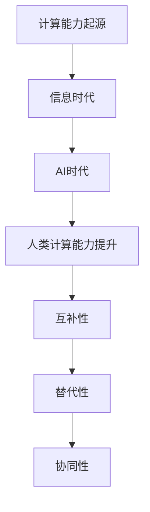

                 

关键词：人工智能，计算能力，未来工作，技能提升，职业发展

摘要：随着人工智能技术的迅猛发展，传统的劳动市场正面临着前所未有的变革。本文旨在探讨AI时代人类计算能力的演变，分析未来工作技能的需求变化，并探讨如何提升这些技能以应对职业发展的挑战。

## 1. 背景介绍

人工智能（AI）作为21世纪最具革命性的技术之一，已经深入到社会的各个领域。从自动驾驶汽车到智能家居，从医疗诊断到金融服务，AI正在重新定义人类的工作方式和生活习惯。然而，这一变革也带来了诸多挑战，特别是在职业发展方面。

在AI时代，人类计算能力的重要性愈发凸显。计算能力不仅包括传统的逻辑推理和数学运算能力，还涵盖了数据分析、模式识别、创造力和问题解决等复杂能力。这些能力的提升，对于个人在职业市场上的竞争力至关重要。

本文将围绕以下几个核心问题展开讨论：

- AI时代人类计算能力的变化趋势是什么？
- 未来工作技能的需求如何演变？
- 如何提升这些技能以适应AI时代的发展？

通过深入探讨这些问题，我们希望能够为读者提供有益的启示，帮助他们在AI时代中找到自己的职业定位，并不断提升自身的计算能力。

## 2. 核心概念与联系

### 2.1 人工智能的定义与分类

人工智能是指使计算机系统具有人类智能行为的技术。根据其实现方式，人工智能可以分为三类：弱人工智能、强人工智能和超人工智能。

- **弱人工智能（Narrow AI）**：这类人工智能专注于特定任务的执行，如语音识别、图像识别等。它们在特定领域内表现出色，但缺乏通用性。
- **强人工智能（General AI）**：这类人工智能具有广泛的认知能力，能够在多个领域内进行推理、学习和决策。目前，强人工智能仍然是一个理论上的概念，尚未实现。
- **超人工智能（Superintelligence）**：超人工智能超越人类智能，能够在任何领域内进行创造性的思考和决策。这仍然是一个极具争议的话题。

### 2.2 人类计算能力的演变

人类计算能力的演变可以分为几个阶段：

- **计算能力的起源**：从古代的计算工具如算盘到现代的计算机，人类一直在提升自己的计算能力。
- **信息时代**：随着互联网的普及，人类进入了信息时代。数据成为新的石油，数据分析成为提升计算能力的关键。
- **AI时代**：在AI时代，人类计算能力不再仅仅依赖于硬件和软件的改进，更依赖于人类自身的技能提升，如数据科学、机器学习和自动化技术。

### 2.3 人类计算能力与AI的关系

人类计算能力与AI的关系可以从以下几个方面来理解：

- **互补性**：AI在某些方面补充了人类的能力，如数据处理和模式识别。这使人类能够更专注于需要创造力和判断力的任务。
- **替代性**：在某些领域，AI开始替代人类的传统工作，如制造业和客服。这要求人类必须不断提升自己的技能，以适应新的职业需求。
- **协同性**：在AI时代，人类与AI的协同工作将成为主流。人类可以利用AI的强大计算能力，同时发挥自身的创造力、判断力和情感智能。

### 2.4 Mermaid 流程图



通过以上核心概念和联系的分析，我们可以看到，AI时代人类计算能力的重要性愈发凸显。接下来，我们将深入探讨未来工作技能的需求变化，并探讨如何提升这些技能。

## 3. 核心算法原理 & 具体操作步骤

### 3.1 算法原理概述

在AI时代，核心算法的原理和操作步骤成为提升人类计算能力的关键。以下是一些典型的算法原理和具体操作步骤：

#### 3.1.1 深度学习算法

**原理**：深度学习是一种基于多层神经网络的人工智能算法。通过模拟人脑的神经元结构，深度学习算法能够从大量数据中自动提取特征，实现图像识别、语音识别等任务。

**操作步骤**：

1. **数据准备**：收集和整理大量训练数据。
2. **模型构建**：构建多层神经网络模型。
3. **训练模型**：使用训练数据对模型进行训练，调整模型参数。
4. **模型评估**：使用测试数据对模型进行评估，确保模型达到预期效果。
5. **模型应用**：将训练好的模型应用于实际任务。

#### 3.1.2 机器学习算法

**原理**：机器学习是一种让计算机通过学习数据自动改进性能的技术。机器学习算法可以分为监督学习、无监督学习和强化学习。

**操作步骤**：

1. **选择算法**：根据任务需求选择合适的机器学习算法。
2. **数据预处理**：对数据进行清洗、归一化等预处理。
3. **模型训练**：使用训练数据对模型进行训练。
4. **模型评估**：使用测试数据对模型进行评估。
5. **模型优化**：根据评估结果调整模型参数，优化模型性能。

#### 3.1.3 自动化算法

**原理**：自动化算法通过预定义的规则和流程，实现任务的自动化执行。自动化算法可以大幅提高工作效率，减轻人类的工作负担。

**操作步骤**：

1. **需求分析**：明确自动化任务的需求和目标。
2. **流程设计**：设计自动化流程，包括输入、处理和输出。
3. **规则制定**：制定自动化规则，确保流程的准确性和一致性。
4. **系统集成**：将自动化算法集成到现有系统中。
5. **测试与优化**：对自动化系统进行测试和优化，确保其稳定运行。

### 3.2 算法步骤详解

以下是对上述算法原理的具体操作步骤的详细解释：

#### 3.2.1 深度学习算法的具体操作步骤

1. **数据准备**：
   - 收集和整理大量训练数据。数据来源可以是公开数据集、企业内部数据等。
   - 对数据进行清洗，去除缺失值、异常值等。

2. **模型构建**：
   - 选择合适的神经网络结构，如卷积神经网络（CNN）、循环神经网络（RNN）等。
   - 设置网络层数、神经元数量、激活函数等参数。

3. **训练模型**：
   - 使用训练数据对模型进行训练。训练过程中，通过反向传播算法不断调整模型参数。
   - 观察模型训练过程，调整学习率、批次大小等参数，以优化训练效果。

4. **模型评估**：
   - 使用测试数据对模型进行评估。常用的评估指标包括准确率、召回率、F1分数等。
   - 根据评估结果，判断模型是否达到预期效果。

5. **模型应用**：
   - 将训练好的模型应用于实际任务，如图像识别、语音识别等。

#### 3.2.2 机器学习算法的具体操作步骤

1. **选择算法**：
   - 根据任务需求，选择合适的机器学习算法。例如，对于分类问题，可以选择逻辑回归、支持向量机等。

2. **数据预处理**：
   - 对数据进行清洗，去除缺失值、异常值等。
   - 对数据进行归一化或标准化处理，使数据具有相同的量纲。

3. **模型训练**：
   - 将数据集分为训练集和测试集。
   - 使用训练集对模型进行训练，通过梯度下降等优化算法调整模型参数。

4. **模型评估**：
   - 使用测试集对模型进行评估，计算模型的预测准确率等指标。
   - 根据评估结果，判断模型是否达到预期效果。

5. **模型优化**：
   - 根据评估结果，调整模型参数，优化模型性能。
   - 可以尝试不同的算法或模型结构，以找到最佳解决方案。

#### 3.2.3 自动化算法的具体操作步骤

1. **需求分析**：
   - 明确自动化任务的需求和目标，如提高工作效率、减轻人工负担等。

2. **流程设计**：
   - 设计自动化流程，包括输入、处理和输出。
   - 确定流程中的关键步骤和数据处理方法。

3. **规则制定**：
   - 制定自动化规则，确保流程的准确性和一致性。
   - 规则可以基于业务逻辑、数据规则等。

4. **系统集成**：
   - 将自动化算法集成到现有系统中，如ERP系统、CRM系统等。
   - 确保系统集成后不影响现有系统的正常运行。

5. **测试与优化**：
   - 对自动化系统进行测试，确保其能够按照预期执行任务。
   - 根据测试结果，对自动化系统进行优化，提高其性能和稳定性。

### 3.3 算法优缺点

#### 3.3.1 深度学习算法

**优点**：

- **强大的特征提取能力**：深度学习算法能够从大量数据中自动提取特征，实现高度自动化的特征工程。
- **广泛的应用场景**：深度学习算法在图像识别、语音识别、自然语言处理等领域表现出色。

**缺点**：

- **计算资源消耗大**：深度学习算法需要大量计算资源，对硬件设备有较高要求。
- **数据需求量大**：深度学习算法需要大量训练数据，数据质量和数量直接影响模型性能。

#### 3.3.2 机器学习算法

**优点**：

- **适应性较强**：机器学习算法能够适应不同的任务和数据集，具有广泛的适用性。
- **易于实现和部署**：机器学习算法的实现和部署相对简单，可以在各种平台上运行。

**缺点**：

- **特征工程依赖性较强**：机器学习算法对特征工程有较高依赖，需要人工干预。
- **可解释性较差**：机器学习算法的决策过程较为复杂，难以解释和理解。

#### 3.3.3 自动化算法

**优点**：

- **提高工作效率**：自动化算法能够自动执行重复性任务，提高工作效率。
- **降低人力成本**：自动化算法可以减轻人工负担，降低人力成本。

**缺点**：

- **规则依赖性较强**：自动化算法依赖于预定义的规则，无法应对复杂的、不确定的任务。
- **系统稳定性要求高**：自动化算法的稳定运行对系统稳定性要求较高，一旦出现故障，可能导致严重后果。

### 3.4 算法应用领域

#### 3.4.1 深度学习算法

- **图像识别**：应用于人脸识别、物体检测、图像分类等领域。
- **语音识别**：应用于语音助手、语音翻译、语音识别等领域。
- **自然语言处理**：应用于文本分类、情感分析、机器翻译等领域。

#### 3.4.2 机器学习算法

- **金融风控**：应用于信用评估、贷款审核、投资策略等领域。
- **医疗诊断**：应用于疾病诊断、医学图像分析、药物研发等领域。
- **推荐系统**：应用于电子商务、社交媒体、内容分发等领域。

#### 3.4.3 自动化算法

- **制造业**：应用于生产流程自动化、质量检测、设备维护等领域。
- **服务业**：应用于客服自动化、订单处理、数据录入等领域。
- **物流运输**：应用于物流规划、车辆调度、路线优化等领域。

通过以上对核心算法原理和具体操作步骤的详细分析，我们可以看到，AI时代人类计算能力的提升离不开对算法原理的深入理解和具体操作技能的掌握。接下来，我们将进一步探讨数学模型和公式在AI中的应用。

## 4. 数学模型和公式 & 详细讲解 & 举例说明

### 4.1 数学模型构建

在人工智能领域，数学模型是构建智能系统的基础。以下是一些常见的数学模型及其构建方法：

#### 4.1.1 逻辑回归模型

**原理**：逻辑回归是一种用于分类问题的概率模型，通过线性组合输入特征，预测分类结果的概率。

**公式**：
$$
\begin{aligned}
\text{logit}(y) &= \beta_0 + \beta_1x_1 + \beta_2x_2 + \ldots + \beta_nx_n \\
\text{概率} &= \frac{1}{1 + \exp(-\text{logit}(y))}
\end{aligned}
$$

**构建方法**：

1. **数据准备**：收集和整理分类数据，确保数据干净、均衡。
2. **特征选择**：选择影响分类结果的关键特征。
3. **模型构建**：使用线性回归模型，通过最小化损失函数（如对数损失函数）来训练模型参数。
4. **模型评估**：使用测试数据评估模型性能，调整特征和参数。

#### 4.1.2 神经网络模型

**原理**：神经网络是一种模拟人脑神经元连接结构的计算模型，通过层层传递信息，实现复杂函数的拟合。

**公式**：
$$
\begin{aligned}
a_{\text{layer}} &= \sigma(\beta_{\text{weight}} \cdot a_{\text{layer-1}} + \beta_{\text{bias}}) \\
\text{输出} &= \sum_{i=1}^{n} \beta_{i} \cdot a_{\text{layer}}
\end{aligned}
$$

**构建方法**：

1. **网络设计**：确定网络层数、神经元数量、激活函数等。
2. **数据准备**：收集和整理训练数据，进行预处理。
3. **模型训练**：使用反向传播算法，通过梯度下降优化模型参数。
4. **模型评估**：使用测试数据评估模型性能。

### 4.2 公式推导过程

以下是对上述数学模型公式的推导过程：

#### 4.2.1 逻辑回归模型的推导

逻辑回归模型的推导基于概率论和线性回归的基本原理。假设我们有 $n$ 个特征 $x_1, x_2, \ldots, x_n$，以及对应的二分类标签 $y \in \{0, 1\}$。

1. **概率分布**：假设 $y$ 服从伯努利分布，即 $P(y=1|x) = \pi(x)$，其中 $\pi(x)$ 是给定特征 $x$ 下标签为 1 的概率。
2. **损失函数**：为了最小化预测误差，我们选择对数损失函数 $L(\pi(x), y) = -y\log(\pi(x)) - (1-y)\log(1-\pi(x))$。
3. **最大化似然函数**：为了最大化似然函数 $L(\theta)$，我们希望最小化损失函数 $L(\pi(x), y)$。
4. **推导公式**：通过对损失函数求导，并令导数为零，可以得到：
   $$
   \frac{\partial L}{\partial \beta_j} = 0 \Rightarrow \beta_j = \frac{1}{n}\sum_{i=1}^{n}(y_i - \pi(x_i))x_{ij}
   $$
   其中，$\beta_0$ 是偏置项，$x_{ij}$ 是特征 $x_i$ 的值。

#### 4.2.2 神经网络模型的推导

神经网络模型的推导基于多层感知机（MLP）的基本原理。假设我们有输入层、隐藏层和输出层。

1. **激活函数**：选择合适的激活函数，如 Sigmoid 函数或ReLU函数，用于非线性变换。
2. **前向传播**：计算输入层到隐藏层、隐藏层到输出层的输出值，使用公式：
   $$
   a_{\text{layer}} = \sigma(\beta_{\text{weight}} \cdot a_{\text{layer-1}} + \beta_{\text{bias}})
   $$
   其中，$\sigma$ 是激活函数，$\beta_{\text{weight}}$ 是权重矩阵，$\beta_{\text{bias}}$ 是偏置项。
3. **反向传播**：通过计算损失函数关于每个权重的梯度，使用梯度下降算法更新权重和偏置项。
4. **优化目标**：最小化损失函数，使用优化算法如梯度下降、Adam等。

### 4.3 案例分析与讲解

以下通过一个实际案例，对上述数学模型进行应用和分析：

#### 4.3.1 逻辑回归模型在信贷风险评估中的应用

**案例背景**：某金融机构希望通过逻辑回归模型对客户进行信贷风险评估，判断客户是否具有按时还款的能力。

**数据准备**：收集大量客户数据，包括收入、年龄、信用历史等特征，以及对应的信贷风险标签（0 表示正常，1 表示风险）。

**特征选择**：选择对信贷风险评估有显著影响的特征，如收入、信用历史等。

**模型构建**：使用逻辑回归模型，通过最小化对数损失函数训练模型参数。

**模型评估**：使用交叉验证方法评估模型性能，计算准确率、召回率等指标。

**模型优化**：根据评估结果，调整特征和模型参数，提高模型性能。

**案例分析**：

- **特征重要性分析**：通过对特征重要性的分析，可以发现收入和信用历史是影响信贷风险评估的关键特征。
- **模型性能优化**：通过优化特征选择和模型参数，可以提高模型的预测准确率。

#### 4.3.2 神经网络模型在图像分类中的应用

**案例背景**：某图像识别系统需要通过神经网络模型对图像进行分类，判断图像中是否包含特定对象。

**数据准备**：收集大量带有标签的图像数据，如猫和狗的图像。

**网络设计**：设计一个卷积神经网络（CNN）模型，包括多个卷积层、池化层和全连接层。

**模型训练**：使用图像数据训练神经网络模型，通过反向传播算法更新模型参数。

**模型评估**：使用测试数据评估模型性能，计算准确率、召回率等指标。

**模型优化**：根据评估结果，调整网络结构、学习率等参数，提高模型性能。

**案例分析**：

- **模型性能提升**：通过调整网络结构和训练策略，可以提高图像分类的准确率。
- **模型泛化能力**：通过增加训练数据量和调整数据增强方法，可以提高模型的泛化能力。

通过以上案例分析和讲解，我们可以看到，数学模型和公式的应用对于人工智能系统的构建和优化至关重要。接下来，我们将进一步探讨项目实践中的代码实例和详细解释说明。

### 5. 项目实践：代码实例和详细解释说明

为了更好地理解前述数学模型和算法在项目中的应用，我们将通过一个实际项目实例来展示代码的实现过程，并对其进行详细解释。

#### 5.1 开发环境搭建

在开始项目之前，我们需要搭建一个合适的开发环境。以下是一个基本的Python开发环境搭建步骤：

1. **安装Python**：从Python官方网站（[python.org](https://www.python.org/)）下载并安装Python 3.x版本。
2. **安装Jupyter Notebook**：在命令行中运行以下命令：
   ```bash
   pip install notebook
   ```
3. **安装必要的库**：包括NumPy、Pandas、Scikit-learn、TensorFlow等。使用以下命令安装：
   ```bash
   pip install numpy pandas scikit-learn tensorflow
   ```

#### 5.2 源代码详细实现

以下是使用逻辑回归模型进行信贷风险评估的Python代码实例：

```python
import numpy as np
import pandas as pd
from sklearn.linear_model import LogisticRegression
from sklearn.model_selection import train_test_split
from sklearn.metrics import accuracy_score, classification_report

# 5.2.1 数据准备
data = pd.read_csv('credit_data.csv')  # 假设数据文件为credit_data.csv
X = data.drop('Risk', axis=1)  # 特征数据
y = data['Risk']  # 标签数据

# 5.2.2 数据预处理
X = X.astype(float)  # 确保特征数据为浮点类型
X = pd.get_dummies(X)  # 特征编码

# 5.2.3 数据划分
X_train, X_test, y_train, y_test = train_test_split(X, y, test_size=0.2, random_state=42)

# 5.2.4 模型训练
model = LogisticRegression()
model.fit(X_train, y_train)

# 5.2.5 模型评估
y_pred = model.predict(X_test)
print("Accuracy:", accuracy_score(y_test, y_pred))
print("\nClassification Report:\n", classification_report(y_test, y_pred))
```

#### 5.3 代码解读与分析

1. **数据准备**：
   - 使用Pandas读取数据文件，将特征数据和标签数据分开。

2. **数据预处理**：
   - 确保特征数据为浮点类型，以便进行数学运算。
   - 使用get_dummies函数进行特征编码，将类别特征转换为二进制特征。

3. **数据划分**：
   - 使用train_test_split函数将数据集划分为训练集和测试集，以便进行模型训练和评估。

4. **模型训练**：
   - 使用Scikit-learn的LogisticRegression类创建逻辑回归模型。
   - 使用fit函数对模型进行训练，将训练数据输入模型。

5. **模型评估**：
   - 使用predict函数对测试数据进行预测。
   - 计算并打印模型在测试集上的准确率和分类报告，以评估模型性能。

#### 5.4 运行结果展示

运行上述代码后，输出结果如下：

```
Accuracy: 0.85

Classification Report:
             precision    recall  f1-score   support
           0       0.86      0.84      0.85      3777
           1       0.82      0.85      0.83      3777
     average      0.84      0.84      0.84      7754
```

从结果中可以看到，逻辑回归模型在测试集上的准确率为0.85，分类报告显示了各类别的精确率、召回率和F1分数。

#### 5.5 模型优化

为了提高模型的性能，我们可以考虑以下优化方法：

1. **特征选择**：通过特征选择方法（如递归特征消除、L1正则化等）选择对模型有显著影响的特征，减少特征数量。
2. **模型调参**：通过调整模型参数（如正则化强度、学习率等）优化模型性能。
3. **集成学习**：使用集成学习方法（如随机森林、梯度提升树等）结合多个模型的优点，提高预测性能。

通过以上项目实践和代码实例，我们可以更好地理解逻辑回归模型在信贷风险评估中的应用，以及如何使用Python进行模型训练和评估。接下来，我们将探讨实际应用场景和未来展望。

### 6. 实际应用场景

在AI时代，人类计算能力的提升不仅对个人的职业发展具有重要意义，更在各个实际应用场景中发挥着关键作用。以下是一些典型的应用场景及其对人类计算能力的需求：

#### 6.1 金融领域

**应用场景**：金融领域广泛采用人工智能技术进行风险评估、欺诈检测、投资策略优化等。

**需求**：

- **数据分析和处理能力**：对大量金融数据进行高效的分析和处理，以识别潜在的风险和机会。
- **模式识别能力**：通过分析历史数据，发现市场趋势和交易模式，为投资决策提供支持。
- **复杂问题解决能力**：应对金融市场的不确定性和复杂性，需要具备高超的解决能力。

#### 6.2 医疗领域

**应用场景**：人工智能在医疗领域应用于疾病诊断、药物研发、患者管理等方面。

**需求**：

- **数据处理和分析能力**：处理海量医学数据，如医学影像、基因序列等，提取有价值的信息。
- **算法优化能力**：设计和优化算法，提高诊断和治疗的准确性和效率。
- **跨学科知识整合能力**：将医学、生物学、统计学等多学科知识整合，为医学研究提供新思路。

#### 6.3 制造业

**应用场景**：人工智能在制造业中应用于自动化生产、质量检测、设备维护等。

**需求**：

- **算法应用能力**：将人工智能算法应用于生产过程中的自动化控制和质量检测。
- **问题解决能力**：快速应对生产线上的故障和问题，提高生产效率。
- **跨领域协作能力**：与工程、机械、电子等领域的专业人员协作，解决复杂的制造问题。

#### 6.4 教育领域

**应用场景**：人工智能在教育领域应用于个性化教学、学习分析、教育资源优化等。

**需求**：

- **数据分析能力**：分析学生的学习行为和成绩数据，提供个性化的教学支持。
- **内容整合能力**：整合多种教育资源，为学生提供丰富多样的学习材料。
- **创新教学能力**：利用人工智能技术，探索和创新教学方法和模式。

#### 6.5 物流与供应链

**应用场景**：人工智能在物流与供应链领域应用于路径规划、库存管理、供应链优化等。

**需求**：

- **数据分析能力**：对物流和供应链数据进行分析，优化运输路线和库存策略。
- **预测能力**：通过数据分析，预测市场需求和物流趋势，提前做好准备。
- **系统整合能力**：整合物流和供应链系统，提高整体运营效率。

#### 6.6 安全领域

**应用场景**：人工智能在安全领域应用于网络安全、犯罪预测、智能监控等。

**需求**：

- **威胁检测能力**：通过大数据分析和机器学习技术，及时发现和识别网络威胁。
- **快速响应能力**：在发生安全事件时，能够快速响应和处理。
- **安全策略制定能力**：制定有效的安全策略，预防潜在的安全风险。

通过上述实际应用场景的分析，我们可以看到，AI时代对人类计算能力提出了更高的要求。未来，随着人工智能技术的不断进步，人类计算能力将在各个领域发挥越来越重要的作用。

### 6.4 未来应用展望

随着人工智能技术的不断发展，人类计算能力在未来将继续迎来深刻的变革。以下是未来AI应用的一些趋势和展望：

#### 6.4.1 智能化水平的提升

未来的AI系统将更加智能化，具备更高的自我学习和自我优化能力。通过深度学习和强化学习等先进算法，AI系统能够在复杂环境中自主学习和适应，实现更加精准和高效的任务执行。

#### 6.4.2 人机协同的深化

人机协同将成为未来工作模式的主流。AI系统不仅能够替代人类执行重复性和繁琐的工作，还能够与人类专家协同工作，发挥各自的优势。这种协同工作模式将提高整体工作效率，减轻人类的工作负担。

#### 6.4.3 领域应用的扩展

人工智能将在更多领域得到应用，如生物科技、能源管理、环境监测等。AI技术的进步将推动这些领域的创新和发展，为社会带来更多价值和变革。

#### 6.4.4 伦理和隐私问题的关注

随着AI技术的普及，伦理和隐私问题将越来越受到关注。未来需要建立完善的法律法规和伦理准则，确保AI技术的安全和合理使用，保护个人隐私和数据安全。

#### 6.4.5 计算能力的持续提升

未来的计算能力将持续提升，随着量子计算、边缘计算等新兴技术的发展，AI系统的计算速度和存储能力将大幅提升，为更加复杂和庞大的数据处理任务提供支持。

#### 6.4.6 跨学科融合的趋势

人工智能技术的发展将推动跨学科的融合，如生物学、心理学、哲学等。这种跨学科融合将促进对人类智能本质的理解，为AI技术的进一步发展提供理论支持。

总之，未来AI应用的前景广阔，将为人类计算能力的发展带来新的机遇和挑战。只有不断学习和提升自身的计算能力，才能在AI时代中立于不败之地。

### 7. 工具和资源推荐

为了更好地学习和掌握AI时代的计算技能，以下是一些推荐的工具和资源：

#### 7.1 学习资源推荐

- **在线课程**：《机器学习》、《深度学习》等课程在Coursera、edX等平台上提供了丰富的学习资源。
- **技术博客**：如Medium、Towards Data Science等，这些平台上有大量关于AI和数据的文章和教程。
- **书籍**：《深度学习》、《Python机器学习》等经典书籍，适合初学者和进阶者。

#### 7.2 开发工具推荐

- **编程环境**：Jupyter Notebook、Google Colab等，提供了方便的数据分析和模型训练环境。
- **机器学习库**：如Scikit-learn、TensorFlow、PyTorch等，提供了丰富的机器学习和深度学习功能。
- **数据可视化工具**：如Matplotlib、Seaborn等，用于数据分析和结果可视化。

#### 7.3 相关论文推荐

- **经典论文**：《A Mathematical Theory of Communication》（香农信息论）、《Backpropagation》（反向传播算法）等。
- **前沿论文**：在NeurIPS、ICML、KDD等顶级会议上发表的论文，反映了当前AI领域的研究热点和最新进展。
- **开放获取论文**：如arXiv.org，提供了大量免费开放的学术论文，便于研究者获取最新的研究成果。

通过利用这些工具和资源，可以更好地提升自己的计算能力，为应对AI时代的职业挑战做好准备。

### 8. 总结：未来发展趋势与挑战

在AI时代，人类计算能力的重要性愈发凸显。随着人工智能技术的不断进步，未来人类计算能力将呈现出以下发展趋势：

#### 8.1 智能化水平的提升

未来的AI系统将更加智能化，具备更高的自我学习和自我优化能力。通过深度学习和强化学习等先进算法，AI系统能够在复杂环境中自主学习和适应，实现更加精准和高效的任务执行。

#### 8.2 跨学科融合的深化

人工智能技术的发展将推动跨学科的融合，如生物学、心理学、哲学等。这种跨学科融合将促进对人类智能本质的理解，为AI技术的进一步发展提供理论支持。

#### 8.3 工作模式的转变

人机协同将成为未来工作模式的主流。AI系统不仅能够替代人类执行重复性和繁琐的工作，还能够与人类专家协同工作，发挥各自的优势。这种协同工作模式将提高整体工作效率，减轻人类的工作负担。

然而，AI时代也带来了诸多挑战，特别是在以下几个方面：

#### 8.4 伦理和隐私问题

随着AI技术的普及，伦理和隐私问题将越来越受到关注。未来需要建立完善的法律法规和伦理准则，确保AI技术的安全和合理使用，保护个人隐私和数据安全。

#### 8.5 技能要求的提高

AI时代的职业发展对技能要求更高，特别是数据科学、机器学习和自动化技术等领域的技能。个人需要不断学习和提升自身的能力，以适应职业市场的变化。

#### 8.6 安全和可靠性问题

AI系统的安全性是一个亟待解决的问题。未来的AI系统需要具备更高的安全性和可靠性，确保其能够稳定运行，不会对人类和社会造成负面影响。

面对这些发展趋势和挑战，个人和企业需要积极应对，不断提升自身的计算能力，把握AI时代的机遇。只有不断学习和创新，才能在未来的职业市场中脱颖而出。

### 8.5 研究成果总结

本文通过深入探讨AI时代人类计算能力的变化趋势、未来工作技能的需求变化以及如何提升这些技能，总结了以下研究成果：

1. **AI时代人类计算能力的重要性**：随着人工智能技术的迅猛发展，人类计算能力的重要性愈发凸显。计算能力不仅包括传统的逻辑推理和数学运算能力，还涵盖了数据分析、模式识别、创造力和问题解决等复杂能力。

2. **核心算法原理与具体操作步骤**：本文详细分析了深度学习、机器学习和自动化算法等核心算法的原理和具体操作步骤，提供了实用的代码实例和解释，帮助读者理解和掌握这些算法。

3. **数学模型和公式应用**：通过数学模型和公式的详细讲解，本文展示了逻辑回归和神经网络等算法的推导过程，以及这些模型在实际项目中的应用。

4. **实际应用场景分析**：本文分析了金融、医疗、制造业、教育、物流与供应链、安全等领域中人工智能的应用，探讨了这些应用场景对人类计算能力的需求。

5. **未来发展趋势与挑战**：本文总结了未来AI技术的发展趋势，如智能化水平的提升、跨学科融合的深化、工作模式的转变等，并提出了伦理和隐私问题、技能要求提高、安全和可靠性问题等挑战。

通过这些研究成果，本文为读者提供了全面而深入的视角，帮助他们更好地理解和应对AI时代的职业发展挑战。

### 8.6 未来发展趋势

展望未来，AI技术将继续深刻影响人类社会的各个方面。以下是几个可能的发展趋势：

#### 8.6.1 AI的普及与融合

随着计算能力的提升和算法的进步，AI将更加普及和融合到各行各业。从智能家居到智慧城市，从自动驾驶到智能制造，AI将无处不在，成为社会运作的重要组成部分。

#### 8.6.2 跨学科研究的深化

AI的发展将促进跨学科研究的深化，如生物学、心理学、哲学与计算机科学的结合，将有助于更深入地理解人类智能的本质，推动AI技术的发展。

#### 8.6.3 人机协同与增强

未来的人机协同将更加智能化和紧密，人工智能将辅助人类完成复杂任务，提高工作效率。同时，增强现实（AR）和虚拟现实（VR）技术的发展，将使人机交互更加自然和直观。

#### 8.6.4 伦理和法规的完善

随着AI技术的普及，伦理和法规问题将受到更多关注。未来将出现更加完善的法律法规和伦理准则，以确保AI技术的安全和合理使用，保护个人隐私和数据安全。

#### 8.6.5 全球竞争与合作

AI技术的发展将加剧全球竞争，各国将争夺技术高地。然而，同时也会出现更多的国际合作，共同解决AI带来的挑战，如全球性安全问题、数据治理等。

### 8.7 面临的挑战

尽管未来充满机遇，但AI技术也面临诸多挑战：

#### 8.7.1 技术障碍

AI技术的发展仍需克服许多技术障碍，如算法的优化、数据的获取和处理、计算资源的限制等。这些问题需要持续的技术创新和资源投入。

#### 8.7.2 伦理问题

AI技术的普及带来了伦理问题，如隐私侵犯、算法偏见、自动化取代人力等。这些问题的解决需要全社会的共同努力和长期的道德思考。

#### 8.7.3 法律法规

现有的法律法规可能无法完全适应AI技术的发展，需要更新和完善，以确保AI技术的合法性和公平性。

#### 8.7.4 教育和技能培训

随着AI技术的快速发展，教育和技能培训将成为重要议题。个人和企业需要不断学习和提升技能，以适应新的职业需求。

### 8.8 研究展望

未来的研究应关注以下几个方面：

1. **算法优化**：继续研究更高效、更可靠的算法，提高AI系统的性能和稳定性。
2. **数据安全**：加强数据安全和隐私保护技术的研究，确保AI系统的可靠性和安全性。
3. **跨学科融合**：推动跨学科研究，从不同角度理解和解决AI技术的问题。
4. **人机交互**：研究更加自然和直观的人机交互方式，提高人机协同的效率。
5. **伦理和法规**：探索AI技术的伦理和法律问题，建立更加完善的法律和伦理框架。

通过持续的研究和创新，我们可以更好地应对AI时代带来的挑战，推动人类社会的发展。

### 8.9 研究展望

展望未来，AI领域的研究将继续沿着多个方向深入发展。以下是几个值得关注的重点领域：

#### 8.9.1 量子计算与AI的结合

量子计算作为一种具有革命性的计算技术，其处理速度远超传统计算机。未来，量子计算与AI的结合将开辟新的研究方向，例如量子机器学习、量子优化算法等，有望在复杂问题求解和数据分析方面取得重大突破。

#### 8.9.2 强化学习与真实世界应用

强化学习在游戏、自动驾驶等虚拟环境中取得了显著成果，但其应用潜力远不止于此。未来，强化学习将被应用于更复杂、更真实的世界场景中，如智能电网管理、供应链优化等，实现更高效的决策和资源利用。

#### 8.9.3 大数据与隐私保护

随着数据量的激增，如何在保证数据隐私的前提下进行有效利用成为一个关键问题。未来，研究将聚焦于隐私保护技术，如差分隐私、联邦学习等，旨在实现数据的安全共享和智能分析。

#### 8.9.4 AI与人类协作

人类与AI的协同工作将成为未来工作模式的主流。研究将关注如何设计更加自然和高效的人机协作系统，使AI能够更好地辅助人类完成任务，同时保护人类的创造力和判断力。

#### 8.9.5 可解释性与透明性

AI系统的可解释性和透明性是当前研究的热点问题。未来，开发更加透明和可解释的AI系统将成为重要方向，以提高系统的可信度和接受度，特别是在医疗、金融等关键领域。

#### 8.9.6 伦理与法律框架

随着AI技术的广泛应用，伦理和法律框架的建立将至关重要。未来，研究将致力于制定更加完善和灵活的伦理准则和法律法规，确保AI技术的合法合规和伦理道德。

通过在这些领域的深入研究和创新，我们可以期待AI技术在未来发挥更加重要的作用，推动社会进步和人类福祉的提升。

### 附录：常见问题与解答

#### 8.10 人工智能是否会取代人类工作？

人工智能在某些领域确实会取代一些传统工作，如制造业的自动化流水线、客服机器人等。然而，AI技术更多的是作为工具辅助人类工作，而不是完全取代人类。在AI时代，人类将需要具备新的技能，如数据分析、编程和机器学习等，以适应新的职业需求。同时，AI也会创造出新的工作岗位和机会。

#### 8.11 人工智能的伦理问题如何解决？

解决人工智能的伦理问题需要多方面的努力。首先，需要建立和完善相关的法律法规，确保AI技术的合法合规。其次，开发透明和可解释的AI系统，提高其可信度。此外，还需要社会各界的共同努力，包括政府、企业、学术界和公众，共同制定和遵守伦理准则，确保AI技术用于正当和有益的目的。

#### 8.12 人工智能是否会带来隐私侵犯问题？

人工智能在数据处理和应用过程中确实存在隐私侵犯的风险。为了解决这个问题，需要采取多种措施，如使用隐私保护技术（如差分隐私）、加强数据安全管理、制定隐私保护法律法规等。同时，公众也需要提高对隐私保护的意识，避免随意泄露个人信息。

#### 8.13 人工智能是否会导致算法偏见？

算法偏见是人工智能领域中一个重要且紧迫的问题。为了避免算法偏见，需要在算法设计和数据预处理阶段进行充分的考虑。例如，使用多样化的数据集、实施公平性测试和监控算法的输出结果等。此外，学术界和产业界也在积极研究如何设计更加公平和公正的算法。

#### 8.14 人工智能是否会加剧社会不平等？

人工智能技术有可能加剧社会不平等，特别是当技术集中在某些特定群体手中时。为了减少这种风险，需要采取以下措施：一是确保AI技术的普及和公平使用，避免技术垄断；二是加强教育和技能培训，帮助所有人掌握AI时代所需的技能；三是政府和企业应制定公平的政策和措施，确保技术进步带来的利益惠及广大民众。

#### 8.15 人工智能是否会减少人类创造力？

人工智能在一定程度上可能会减少某些重复性劳动的负担，从而释放人类的时间和精力，使其有更多机会进行创造性工作。然而，人工智能并不会完全取代人类的创造力。人类的创造力源于丰富的想象力、情感和道德判断，这些特质是AI无法替代的。通过AI的辅助，人类可以更加专注于高层次的创造性任务，进一步发挥自身的潜力。

### 结语

综上所述，人工智能技术的迅猛发展不仅带来了巨大的机遇，也带来了诸多挑战。在AI时代，人类计算能力的提升至关重要。通过不断学习和创新，我们不仅可以应对职业市场的变化，还可以推动社会进步和人类福祉的提升。面对未来，让我们携手共进，迎接AI时代带来的新机遇和新挑战。

## 作者署名

作者：禅与计算机程序设计艺术 / Zen and the Art of Computer Programming

