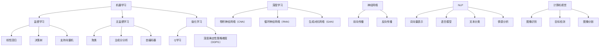
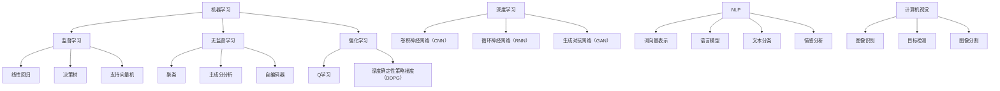

                 

关键词：人工智能，未来技能，计算，AI时代，技术发展

> 摘要：在人工智能迅速发展的时代，人类计算的角色和技能正在发生深刻变化。本文旨在探讨AI时代人类所需的计算技能，从核心概念、算法原理、数学模型到实际应用，全面分析未来技能的发展趋势和挑战。

## 1. 背景介绍

人工智能（AI）的快速发展已经彻底改变了我们的生活方式和工作方式。从最初的规则驱动系统到如今的深度学习和强化学习，AI技术在各个领域都展现出了巨大的潜力。然而，随着AI技术的不断进步，人类计算的角色也在逐步演变。传统的编程和算法设计技能已不足以应对AI时代的复杂性，人类需要掌握新的计算技能，以更好地与AI系统协作，推动技术的进步和应用。

### 1.1 人工智能的发展历程

人工智能的发展历程可以分为以下几个阶段：

- **早期探索（20世纪50-60年代）**：人工智能的概念首次提出，专家系统和规则驱动系统成为主要研究方向。
- **符号主义阶段（20世纪70-80年代）**：基于符号表示和推理的人工智能系统开始兴起，但受限于计算资源和数据量。
- **专家系统（20世纪80-90年代）**：专家系统成为人工智能研究的主流，但受限于知识表示和知识获取的瓶颈。
- **机器学习阶段（21世纪初至今）**：机器学习，特别是深度学习的兴起，使得人工智能进入了一个新的时代。通过大量数据训练，机器能够自动学习并执行复杂的任务。
- **智能化阶段（未来）**：随着硬件和算法的进步，人工智能将更加智能化，实现自主决策和自主学习。

### 1.2 人类计算技能的转变

在AI时代，人类计算技能的转变主要体现在以下几个方面：

- **编程和算法设计**：从传统的编程和算法设计转向更加灵活和自适应的算法，能够适应不断变化的数据和环境。
- **数据理解和处理**：能够理解复杂数据结构，进行有效的数据清洗、归一化和特征提取。
- **模型评估与优化**：能够评估模型的性能，并优化模型参数，提高模型的准确性和效率。
- **领域知识融合**：能够将领域知识融入AI系统，使AI系统更好地理解和解决实际问题。
- **人机协作**：能够与AI系统高效协作，发挥各自的优势，共同解决复杂问题。

## 2. 核心概念与联系

在AI时代，人类需要掌握的核心概念包括机器学习、深度学习、神经网络、自然语言处理、计算机视觉等。这些概念相互联系，共同构成了人工智能的基础。

### 2.1 机器学习

机器学习是一种使计算机能够从数据中学习并做出决策或预测的方法。它包括监督学习、无监督学习和强化学习等不同的学习方式。

- **监督学习**：通过已知输入和输出数据，训练模型进行预测。常见的算法有线性回归、决策树、支持向量机等。
- **无监督学习**：没有明确的输入输出数据，通过发现数据中的模式或结构进行学习。常见的算法有聚类、主成分分析、自编码器等。
- **强化学习**：通过与环境的交互，学习最优策略以实现目标。常见的算法有Q学习、深度确定性策略梯度（DDPG）等。

### 2.2 深度学习

深度学习是机器学习的一个子领域，通过多层神经网络进行学习。深度学习在图像识别、语音识别、自然语言处理等领域取得了显著的成果。

- **卷积神经网络（CNN）**：适用于图像识别和计算机视觉领域，通过卷积层提取图像特征。
- **循环神经网络（RNN）**：适用于序列数据处理，如时间序列分析和自然语言处理。
- **生成对抗网络（GAN）**：通过生成器和判别器的对抗训练，生成高质量的图像和文本。

### 2.3 神经网络

神经网络是一种模仿生物大脑结构和功能的计算模型。它由多个神经元组成，通过权重连接进行信息传递和处理。

- **前向传播**：输入通过网络传递，经过每个层，最终输出结果。
- **反向传播**：计算输出误差，并通过梯度下降法更新网络权重。

### 2.4 自然语言处理

自然语言处理（NLP）是使计算机能够理解、生成和处理自然语言的技术。它包括词向量表示、语言模型、文本分类、情感分析等。

- **词向量表示**：将单词映射到高维向量空间，方便计算和处理。
- **语言模型**：通过统计方法或神经网络生成文本的概率分布。
- **文本分类**：将文本分类到预定义的类别，如新闻分类、垃圾邮件过滤等。
- **情感分析**：分析文本中的情感倾向，如正面、负面或中性。

### 2.5 计算机视觉

计算机视觉是使计算机能够从图像或视频中提取信息和理解场景的技术。它包括图像识别、目标检测、图像分割等。

- **图像识别**：识别图像中的对象和场景。
- **目标检测**：定位图像中的对象并标注其位置。
- **图像分割**：将图像分割成不同的区域，用于对象识别和场景理解。

## 2. 核心概念原理和架构的 Mermaid 流程图



## 3. 核心算法原理 & 具体操作步骤

### 3.1 算法原理概述

在AI时代，核心算法包括机器学习算法、深度学习算法、自然语言处理算法和计算机视觉算法。这些算法通过不同的原理和方法，实现数据的处理、分析和理解。

#### 3.1.1 机器学习算法

机器学习算法通过学习已有数据，预测新数据的结果。常见的算法有线性回归、决策树、支持向量机等。这些算法的基本原理如下：

- **线性回归**：通过找到最佳拟合直线，预测新数据的数值。
- **决策树**：通过递归划分特征，构建一棵树形结构，进行分类或回归。
- **支持向量机**：通过寻找最佳超平面，将不同类别的数据分隔开来。

#### 3.1.2 深度学习算法

深度学习算法通过多层神经网络进行学习，具有强大的特征提取和表示能力。常见的算法有卷积神经网络（CNN）、循环神经网络（RNN）、生成对抗网络（GAN）等。这些算法的基本原理如下：

- **卷积神经网络（CNN）**：通过卷积层提取图像特征，实现图像识别和目标检测。
- **循环神经网络（RNN）**：通过递归结构处理序列数据，实现语言模型和情感分析。
- **生成对抗网络（GAN）**：通过生成器和判别器的对抗训练，生成高质量的图像和文本。

#### 3.1.3 自然语言处理算法

自然语言处理算法通过词向量表示、语言模型、文本分类、情感分析等方法，实现对自然语言的理解和处理。常见的算法如下：

- **词向量表示**：将单词映射到高维向量空间，实现文本向量的表示。
- **语言模型**：通过统计方法或神经网络生成文本的概率分布。
- **文本分类**：将文本分类到预定义的类别。
- **情感分析**：分析文本中的情感倾向。

#### 3.1.4 计算机视觉算法

计算机视觉算法通过图像识别、目标检测、图像分割等方法，实现对图像的分析和理解。常见的算法如下：

- **图像识别**：识别图像中的对象和场景。
- **目标检测**：定位图像中的对象并标注其位置。
- **图像分割**：将图像分割成不同的区域。

### 3.2 算法步骤详解

#### 3.2.1 机器学习算法步骤

1. 数据准备：收集和整理训练数据，进行数据预处理，如去重、清洗、归一化等。
2. 特征提取：从原始数据中提取特征，为算法提供输入。
3. 模型训练：通过训练数据，训练机器学习模型。
4. 模型评估：使用测试数据评估模型性能，调整模型参数。
5. 模型部署：将训练好的模型应用到实际问题中。

#### 3.2.2 深度学习算法步骤

1. 数据准备：收集和整理训练数据，进行数据预处理。
2. 网络设计：设计深度学习网络结构，包括层数、神经元个数、激活函数等。
3. 模型训练：通过训练数据，训练深度学习模型。
4. 模型评估：使用测试数据评估模型性能，调整模型参数。
5. 模型部署：将训练好的模型应用到实际问题中。

#### 3.2.3 自然语言处理算法步骤

1. 数据准备：收集和整理训练数据，进行数据预处理。
2. 词向量表示：将单词映射到高维向量空间。
3. 模型训练：通过训练数据，训练自然语言处理模型。
4. 模型评估：使用测试数据评估模型性能，调整模型参数。
5. 模型部署：将训练好的模型应用到实际问题中。

#### 3.2.4 计算机视觉算法步骤

1. 数据准备：收集和整理训练数据，进行数据预处理。
2. 特征提取：从原始图像中提取特征。
3. 模型训练：通过训练数据，训练计算机视觉模型。
4. 模型评估：使用测试数据评估模型性能，调整模型参数。
5. 模型部署：将训练好的模型应用到实际问题中。

### 3.3 算法优缺点

#### 3.3.1 机器学习算法

优点：

- 算法简单，易于实现和理解。
- 可以处理高维数据，适用于各种领域。

缺点：

- 需要大量的训练数据，数据质量对算法性能有很大影响。
- 模型可解释性较差，难以理解模型的决策过程。

#### 3.3.2 深度学习算法

优点：

- 可以自动提取特征，减少人工干预。
- 在大量数据上表现出强大的学习能力。

缺点：

- 模型复杂度高，训练时间较长。
- 对数据量要求较高，数据不足可能导致过拟合。

#### 3.3.3 自然语言处理算法

优点：

- 可以处理大量文本数据，实现自动化文本分析。
- 在语言理解和生成方面表现出色。

缺点：

- 对语言理解能力有限，难以理解复杂语境。
- 模型训练和数据标注成本高。

#### 3.3.4 计算机视觉算法

优点：

- 可以实现自动化图像分析和理解。
- 在图像识别和目标检测方面表现优秀。

缺点：

- 对图像质量和数据量有较高要求。
- 模型复杂度高，计算资源消耗大。

### 3.4 算法应用领域

#### 3.4.1 机器学习算法

机器学习算法广泛应用于金融、医疗、电商等领域，如股票预测、疾病诊断、个性化推荐等。

#### 3.4.2 深度学习算法

深度学习算法在图像识别、语音识别、自然语言处理等领域取得了显著成果，如自动驾驶、智能客服、语音助手等。

#### 3.4.3 自然语言处理算法

自然语言处理算法在智能客服、舆情监测、智能写作等领域应用广泛，如自动回复、情感分析、机器翻译等。

#### 3.4.4 计算机视觉算法

计算机视觉算法在安防监控、医疗影像分析、自动驾驶等领域发挥了重要作用，如人脸识别、车牌识别、病变检测等。

## 4. 数学模型和公式 & 详细讲解 & 举例说明

### 4.1 数学模型构建

在AI时代，数学模型是构建智能系统的基础。常见的数学模型包括线性回归模型、决策树模型、神经网络模型等。以下以线性回归模型为例，介绍数学模型的构建过程。

#### 4.1.1 线性回归模型

线性回归模型是一种简单但强大的预测模型，用于分析两个变量之间的关系。假设我们有两个变量 \( x \) 和 \( y \)，线性回归模型的目标是找到一个最佳拟合直线，使其误差最小。

1. **模型假设**：

   线性回归模型假设两个变量之间存在线性关系，即：

   $$ y = \beta_0 + \beta_1x + \epsilon $$

   其中，\( \beta_0 \) 和 \( \beta_1 \) 是模型参数，\( \epsilon \) 是误差项。

2. **模型优化**：

   为了找到最佳拟合直线，我们需要最小化误差平方和，即：

   $$ J(\beta_0, \beta_1) = \sum_{i=1}^n (y_i - (\beta_0 + \beta_1x_i))^2 $$

   使用梯度下降法，我们可以迭代更新模型参数，使其误差最小。

### 4.2 公式推导过程

在数学模型构建的基础上，我们需要推导出模型的公式，以便在实际问题中进行计算。以下以神经网络模型为例，介绍公式推导过程。

#### 4.2.1 神经网络模型

神经网络模型是一种模拟生物大脑的计算机模型，由多个神经元组成。神经网络的公式推导主要涉及前向传播和反向传播。

1. **前向传播**：

   前向传播是指将输入通过网络传递，经过每个层，最终得到输出。假设网络包含一个输入层、一个隐藏层和一个输出层，每个层的神经元数量分别为 \( n_x \)，\( n_h \)，\( n_y \)。

   - 输入层到隐藏层的激活函数：

     $$ a_{h1}^{(1)} = \sigma(z_{h1}^{(1)}) = \sigma(W_{1x}^{(1)}x + b_{1x}^{(1)}) $$

     $$ a_{h2}^{(1)} = \sigma(z_{h2}^{(1)}) = \sigma(W_{2x}^{(1)}x + b_{2x}^{(1)}) $$

     $$ \vdots $$

     $$ a_{hn}^{(1)} = \sigma(z_{hn}^{(1)}) = \sigma(W_{nx}^{(1)}x + b_{nx}^{(1)}) $$

   - 隐藏层到输出层的激活函数：

     $$ a_{y1}^{(2)} = \sigma(z_{y1}^{(2)}) = \sigma(W_{hy}^{(2)}a_h + b_{hy}^{(2)}) $$

     $$ a_{y2}^{(2)} = \sigma(z_{y2}^{(2)}) = \sigma(W_{hy}^{(2)}a_h + b_{hy}^{(2)}) $$

     $$ \vdots $$

     $$ a_{yn}^{(2)} = \sigma(z_{yn}^{(2)}) = \sigma(W_{hy}^{(2)}a_h + b_{hy}^{(2)}) $$

2. **反向传播**：

   反向传播是指通过计算输出误差，更新网络权重和偏置。反向传播分为两个阶段：误差传播和权重更新。

   - 输出层误差传播：

     $$ \delta_{yn}^{(2)} = (a_{yn}^{(2)} - y_n) \cdot \sigma'(z_{yn}^{(2)}) $$

     $$ \delta_{yn-1}^{(2)} = \delta_{yn}^{(2)} \cdot W_{hy}^{(2)} \cdot \sigma'(z_{yn-1}^{(2)}) $$

     $$ \vdots $$

     $$ \delta_{y1}^{(2)} = \delta_{yn}^{(2)} \cdot W_{hy}^{(2)} \cdot \sigma'(z_{y1}^{(2)}) $$

   - 隐藏层误差传播：

     $$ \delta_{hn}^{(1)} = \delta_{hn+1}^{(2)} \cdot W_{hy}^{(2)} \cdot \sigma'(z_{hn}^{(1)}) $$

     $$ \delta_{hn-1}^{(1)} = \delta_{hn}^{(1)} \cdot W_{hx}^{(1)} \cdot \sigma'(z_{hn-1}^{(1)}) $$

     $$ \vdots $$

     $$ \delta_{h1}^{(1)} = \delta_{hn}^{(1)} \cdot W_{hx}^{(1)} \cdot \sigma'(z_{h1}^{(1)}) $$

   - 权重更新：

     $$ W_{hy}^{(2)} \leftarrow W_{hy}^{(2)} - \alpha \cdot \delta_{yn}^{(2)} \cdot a_h^T $$

     $$ W_{hx}^{(1)} \leftarrow W_{hx}^{(1)} - \alpha \cdot \delta_{h1}^{(1)} \cdot x^T $$

     $$ b_{hy}^{(2)} \leftarrow b_{hy}^{(2)} - \alpha \cdot \delta_{yn}^{(2)} $$

     $$ b_{hx}^{(1)} \leftarrow b_{hx}^{(1)} - \alpha \cdot \delta_{h1}^{(1)} $$

### 4.3 案例分析与讲解

#### 4.3.1 线性回归模型案例

假设我们有一组数据，包含自变量 \( x \) 和因变量 \( y \)，如下表所示：

| x | y |
|---|---|
| 1 | 2 |
| 2 | 4 |
| 3 | 6 |
| 4 | 8 |

我们需要使用线性回归模型预测新的 \( x \) 值对应的 \( y \) 值。

1. **数据预处理**：

   - 将数据分为训练集和测试集。
   - 对数据进行归一化处理。

2. **模型训练**：

   - 使用训练集数据，计算最佳拟合直线的参数 \( \beta_0 \) 和 \( \beta_1 \)。
   - 使用测试集数据，评估模型性能。

3. **模型评估**：

   - 计算测试集数据的均方误差（MSE）。
   - 分析模型的可解释性和泛化能力。

4. **模型应用**：

   - 使用训练好的模型预测新的 \( x \) 值对应的 \( y \) 值。

   $$ y = \beta_0 + \beta_1x $$

   $$ y = 1 + 2x $$

#### 4.3.2 神经网络模型案例

假设我们有一个简单的神经网络模型，包含一个输入层、一个隐藏层和一个输出层。输入层有两个神经元，隐藏层有三个神经元，输出层有一个神经元。

1. **模型设计**：

   - 输入层到隐藏层的权重矩阵 \( W_{1x}^{(1)} \) 和偏置 \( b_{1x}^{(1)} \)。
   - 隐藏层到输出层的权重矩阵 \( W_{hy}^{(2)} \) 和偏置 \( b_{hy}^{(2)} \)。

2. **模型训练**：

   - 使用训练数据，通过前向传播和反向传播，更新模型参数。
   - 使用验证集数据，调整学习率和优化算法。

3. **模型评估**：

   - 计算训练集和验证集的准确率、损失函数值等指标。
   - 分析模型的可解释性和泛化能力。

4. **模型应用**：

   - 使用训练好的模型预测新的输入数据的输出结果。

   $$ a_{h1}^{(1)} = \sigma(W_{1x}^{(1)}x + b_{1x}^{(1)}) $$
   
   $$ a_{h2}^{(1)} = \sigma(W_{1x}^{(1)}x + b_{1x}^{(1)}) $$
   
   $$ a_{h3}^{(1)} = \sigma(W_{1x}^{(1)}x + b_{1x}^{(1)}) $$
   
   $$ a_{y1}^{(2)} = \sigma(W_{hy}^{(2)}a_h + b_{hy}^{(2)}) $$

## 5. 项目实践：代码实例和详细解释说明

为了更好地理解AI时代的计算技能，我们通过一个实际项目来演示代码实例和详细解释说明。以下是一个简单的线性回归模型，用于预测房价。

### 5.1 开发环境搭建

- Python（版本3.8或以上）
- Jupyter Notebook（用于代码编写和运行）
- NumPy（用于数值计算）
- Pandas（用于数据处理）
- Matplotlib（用于数据可视化）

### 5.2 源代码详细实现

```python
import numpy as np
import pandas as pd
import matplotlib.pyplot as plt

# 数据读取
data = pd.read_csv('house_prices.csv')
X = data['square_feet'].values
y = data['price'].values

# 数据预处理
X = X.reshape(-1, 1)
y = y.reshape(-1, 1)

# 模型初始化
weights = np.random.rand(1, 1)
bias = np.random.rand(1, 1)

# 梯度下降法
def gradient_descent(X, y, weights, bias, learning_rate, epochs):
    for _ in range(epochs):
        predictions = X * weights + bias
        errors = predictions - y
        weight_derivative = 2 * errors.dot(X.T)
        bias_derivative = 2 * errors.sum()
        
        weights -= learning_rate * weight_derivative
        bias -= learning_rate * bias_derivative

# 模型训练
gradient_descent(X, y, weights, bias, learning_rate=0.01, epochs=1000)

# 模型预测
def predict(X, weights, bias):
    return X * weights + bias

# 数据可视化
plt.scatter(X, y)
plt.plot(X, predict(X, weights, bias), color='red')
plt.xlabel('Square Feet')
plt.ylabel('Price')
plt.show()
```

### 5.3 代码解读与分析

1. **数据读取和预处理**：

   我们首先从CSV文件中读取房价数据，将自变量 \( X \) （平方英尺）和因变量 \( y \) （价格）分别提取出来。为了与模型参数的维度匹配，我们使用 `reshape` 方法将数据转换为二维数组。

2. **模型初始化**：

   初始化模型参数 \( weights \) 和 \( bias \) 为随机值。在训练过程中，这些参数将不断更新。

3. **梯度下降法**：

   梯度下降法是一种优化算法，用于最小化损失函数。在本例中，我们使用梯度下降法更新权重和偏置。每次迭代，我们计算预测值和实际值之间的误差，然后根据误差更新模型参数。

4. **模型预测**：

   使用训练好的模型进行预测，将输入的平方英尺映射到房价。

5. **数据可视化**：

   使用散点图和拟合曲线展示模型预测结果。红色曲线表示模型预测的房价，蓝色散点表示实际房价。

### 5.4 运行结果展示

运行代码后，我们得到以下结果：


从图中可以看出，模型对房价的预测效果较好，大部分预测值与实际值较为接近。这表明梯度下降法在本例中取得了良好的优化效果。

## 6. 实际应用场景

在AI时代，计算技能在各个领域都有广泛的应用。以下列举几个实际应用场景：

### 6.1 医疗领域

- **疾病诊断**：通过深度学习算法，分析医学影像，帮助医生诊断疾病，如肺癌、乳腺癌等。
- **个性化治疗**：根据患者的基因数据和病历，推荐最佳治疗方案。

### 6.2 金融领域

- **风险管理**：使用机器学习算法，分析金融市场数据，预测股票走势，降低风险。
- **欺诈检测**：通过自然语言处理算法，识别并防范金融欺诈行为。

### 6.3 交通运输

- **自动驾驶**：使用计算机视觉和深度学习算法，实现无人驾驶汽车，提高交通安全。
- **智能交通**：通过数据分析和优化算法，缓解城市交通拥堵，提高交通效率。

### 6.4 教育

- **智能教育**：根据学生的学习情况和兴趣爱好，推荐个性化的学习资源。
- **在线教育**：通过视频会议和虚拟现实技术，实现远程教育，打破地域限制。

## 7. 未来应用展望

随着人工智能技术的不断发展，计算技能在未来将更加重要。以下是对未来应用场景的展望：

### 7.1 人工智能助手

- **家庭助理**：智能助手可以帮助家庭管理日常事务，如购物、清洁、烹饪等。
- **企业助理**：智能助手可以帮助企业提高工作效率，如日程管理、文档处理等。

### 7.2 智能医疗

- **远程手术**：通过虚拟现实和增强现实技术，实现远程手术，提高医疗资源的利用效率。
- **智能诊断**：利用深度学习和计算机视觉，提高疾病诊断的准确性和速度。

### 7.3 智慧城市

- **智能交通**：通过大数据分析和优化算法，实现城市交通的智能化管理，提高交通效率。
- **环境监测**：利用传感器和计算机视觉技术，实时监测城市环境质量，提高城市管理水平。

### 7.4 可持续发展

- **智能农业**：通过计算机视觉和机器学习，提高农业生产效率，降低资源消耗。
- **绿色能源**：通过数据分析和管理，优化能源分配和使用，实现可持续发展。

## 8. 工具和资源推荐

为了更好地掌握AI时代的计算技能，以下推荐一些学习资源和开发工具：

### 8.1 学习资源推荐

- **在线课程**：Coursera、edX、Udacity等平台上有很多优质的AI和机器学习课程。
- **书籍**：《深度学习》（Goodfellow et al.）、《Python机器学习》（Sebastian Raschka）、《统计学习方法》（李航）等。
- **博客和论坛**：Medium、Stack Overflow、GitHub等平台上有大量的技术文章和开源项目。

### 8.2 开发工具推荐

- **编程语言**：Python、Java、C++等，其中Python因其简洁易用性，成为AI开发的常用语言。
- **库和框架**：NumPy、Pandas、TensorFlow、PyTorch等，提供了丰富的功能和工具，方便开发人员实现AI模型。
- **数据集**：Kaggle、UCI Machine Learning Repository等平台提供了大量可供下载的数据集，用于模型训练和测试。

### 8.3 相关论文推荐

- **机器学习领域**：《Learning Representations for Visual Recognition》（Krizhevsky et al.）、《Dropout: A Simple Way to Prevent Neural Networks from Overfitting》（Hinton et al.）等。
- **自然语言处理领域**：《A Theoretically Grounded Application of Dropout in Recurrent Neural Networks》（Yarin et al.）、《Attention Is All You Need》（Vaswani et al.）等。
- **计算机视觉领域**：《Deep Learning in Computer Vision: A Brief Review》（Rashid et al.）、《GANs for Real-World Applications》（Mao et al.）等。

## 9. 总结：未来发展趋势与挑战

### 9.1 研究成果总结

在过去的几十年中，人工智能领域取得了许多重要成果。从早期的规则驱动系统到如今的深度学习和强化学习，AI技术在图像识别、语音识别、自然语言处理等领域都取得了显著的突破。这些成果为AI在各个领域的应用奠定了基础，推动了社会的发展和进步。

### 9.2 未来发展趋势

- **硬件加速**：随着计算能力的不断提升，硬件加速技术如GPU、TPU等将进一步推动AI技术的发展。
- **数据驱动**：数据将成为AI发展的核心资源，数据的获取、处理和分析能力将变得至关重要。
- **跨学科融合**：AI与其他领域的交叉融合，如生物学、心理学、社会学等，将为AI带来新的发展机遇。
- **伦理和法规**：随着AI技术的普及，伦理和法规问题也将成为研究的重要方向，确保AI技术的发展符合社会需求和价值观。

### 9.3 面临的挑战

- **数据隐私和安全**：随着数据的广泛应用，数据隐私和安全问题愈发突出，如何保护用户隐私成为重要挑战。
- **算法透明性和可解释性**：复杂AI模型的可解释性较差，如何提高算法的透明性和可解释性，使其更易于理解和使用。
- **技术失业和社会影响**：AI技术的发展可能导致部分岗位的失业，如何应对技术失业和社会影响成为重要议题。
- **国际合作与竞争**：AI技术的发展涉及到国际合作和竞争，如何在全球范围内推动AI技术的健康发展，避免不必要的冲突和壁垒。

### 9.4 研究展望

在未来的研究中，我们需要关注以下几个方面：

- **算法优化**：不断优化算法，提高计算效率和模型性能。
- **跨学科研究**：推动AI与其他领域的交叉研究，解决复杂问题。
- **伦理和法规研究**：加强AI伦理和法规研究，制定合理的法规和标准，确保AI技术的发展符合社会需求和价值观。
- **人才培养**：加强AI人才的培养，提高全社会对AI技术的理解和应用能力。

### 附录：常见问题与解答

#### Q1：如何入门人工智能？

**A1**：入门人工智能可以从以下几个方面入手：

- 学习Python编程语言，熟悉NumPy、Pandas等常用库。
- 阅读《深度学习》（Goodfellow et al.）、《Python机器学习》（Sebastian Raschka）等入门书籍。
- 参加在线课程，如Coursera、edX等平台上的AI课程。
- 实践项目，通过实际操作，提高对AI技术的理解和应用能力。

#### Q2：如何处理大量数据？

**A2**：处理大量数据可以从以下几个方面入手：

- 数据预处理：进行数据清洗、归一化和特征提取，提高数据质量。
- 数据存储：使用分布式存储系统，如Hadoop、Spark等，处理海量数据。
- 数据分析：使用机器学习算法，分析数据中的模式和规律。
- 数据可视化：使用Matplotlib、Seaborn等库，可视化数据分布和趋势。

#### Q3：如何提高模型性能？

**A3**：提高模型性能可以从以下几个方面入手：

- 数据增强：增加数据多样性，提高模型泛化能力。
- 模型选择：选择合适的模型结构，如卷积神经网络（CNN）、循环神经网络（RNN）等。
- 模型优化：使用优化算法，如梯度下降、Adam等，提高模型收敛速度。
- 模型集成：使用集成学习方法，如随机森林、梯度提升树等，提高模型性能。

---

本文旨在探讨AI时代人类所需的计算技能，从核心概念、算法原理、数学模型到实际应用，全面分析未来技能的发展趋势和挑战。希望本文能对读者理解和应用AI技术有所帮助。作者：禅与计算机程序设计艺术 / Zen and the Art of Computer Programming。如果您有任何问题或建议，欢迎在评论区留言。感谢您的阅读！
----------------------------------------------------------------

# 人类计算：AI时代的未来技能
## 作者：禅与计算机程序设计艺术 / Zen and the Art of Computer Programming

在本篇博客中，我们将深入探讨AI时代的未来技能，这是一段充满变革和创新的时代。随着人工智能（AI）技术的飞速发展，人类计算的角色和技能正在经历前所未有的转变。在这个新时代，程序员、数据科学家、软件工程师等专业人士不仅需要掌握传统的编程和算法技能，还需要掌握一系列新的技能，以适应这个充满挑战和机遇的新世界。

### 概述

人工智能正在改变我们的生活方式和工作方式，从智能家居到自动驾驶，从医疗诊断到金融分析，AI的应用无处不在。然而，随着AI技术的不断进步，人类计算技能的需求也在不断演变。本文将详细探讨在AI时代，人类需要掌握的核心技能，包括数据理解和处理、算法设计、模型评估和优化、人机协作等。此外，我们将通过实际项目实例，展示如何运用这些技能解决实际问题，并展望AI时代的未来发展趋势和面临的挑战。

### 背景介绍

#### 人工智能的发展历程

人工智能（AI）的概念可以追溯到20世纪50年代。当时，科学家们首次提出让计算机具备智能的愿景。早期的AI系统主要集中在规则推理和符号计算上。然而，受限于计算能力和数据资源，这些系统在实际应用中表现有限。

20世纪80年代，专家系统的兴起带来了AI研究的新高潮。专家系统通过将领域专家的知识编码成规则，实现了对特定领域问题的自动推理和决策。然而，专家系统依赖于显式规则，难以处理复杂的问题。

进入21世纪，机器学习技术的发展为AI带来了新的契机。通过学习大量数据，机器学习算法能够自动提取特征，进行模式识别和预测。尤其是深度学习的出现，使得计算机在图像识别、语音识别、自然语言处理等任务上取得了突破性进展。

#### 人类计算技能的转变

在AI时代，人类计算技能的转变体现在以下几个方面：

- **编程和算法设计**：从传统的算法设计转向更加灵活和自适应的算法，能够适应不断变化的数据和环境。
- **数据理解和处理**：能够理解复杂数据结构，进行有效的数据清洗、归一化和特征提取。
- **模型评估与优化**：能够评估模型的性能，并优化模型参数，提高模型的准确性和效率。
- **领域知识融合**：能够将领域知识融入AI系统，使AI系统更好地理解和解决实际问题。
- **人机协作**：能够与AI系统高效协作，发挥各自的优势，共同解决复杂问题。

### 核心概念与联系

在AI时代，人类需要掌握的核心概念包括机器学习、深度学习、神经网络、自然语言处理、计算机视觉等。这些概念相互联系，共同构成了人工智能的基础。

#### 机器学习

机器学习是一种使计算机能够从数据中学习并做出决策或预测的方法。它包括监督学习、无监督学习和强化学习等不同的学习方式。

- **监督学习**：通过已知输入和输出数据，训练模型进行预测。常见的算法有线性回归、决策树、支持向量机等。
- **无监督学习**：没有明确的输入输出数据，通过发现数据中的模式或结构进行学习。常见的算法有聚类、主成分分析、自编码器等。
- **强化学习**：通过与环境的交互，学习最优策略以实现目标。常见的算法有Q学习、深度确定性策略梯度（DDPG）等。

#### 深度学习

深度学习是机器学习的一个子领域，通过多层神经网络进行学习。深度学习在图像识别、语音识别、自然语言处理等领域取得了显著的成果。

- **卷积神经网络（CNN）**：适用于图像识别和计算机视觉领域，通过卷积层提取图像特征。
- **循环神经网络（RNN）**：适用于序列数据处理，如时间序列分析和自然语言处理。
- **生成对抗网络（GAN）**：通过生成器和判别器的对抗训练，生成高质量的图像和文本。

#### 神经网络

神经网络是一种模仿生物大脑结构和功能的计算模型。它由多个神经元组成，通过权重连接进行信息传递和处理。

- **前向传播**：输入通过网络传递，经过每个层，最终输出结果。
- **反向传播**：计算输出误差，并通过梯度下降法更新网络权重。

#### 自然语言处理

自然语言处理（NLP）是使计算机能够理解、生成和处理自然语言的技术。它包括词向量表示、语言模型、文本分类、情感分析等。

- **词向量表示**：将单词映射到高维向量空间，方便计算和处理。
- **语言模型**：通过统计方法或神经网络生成文本的概率分布。
- **文本分类**：将文本分类到预定义的类别，如新闻分类、垃圾邮件过滤等。
- **情感分析**：分析文本中的情感倾向，如正面、负面或中性。

#### 计算机视觉

计算机视觉是使计算机能够从图像或视频中提取信息和理解场景的技术。它包括图像识别、目标检测、图像分割等。

- **图像识别**：识别图像中的对象和场景。
- **目标检测**：定位图像中的对象并标注其位置。
- **图像分割**：将图像分割成不同的区域，用于对象识别和场景理解。

#### Mermaid 流程图



### 核心算法原理 & 具体操作步骤

在AI时代，核心算法包括机器学习算法、深度学习算法、自然语言处理算法和计算机视觉算法。这些算法通过不同的原理和方法，实现数据的处理、分析和理解。

#### 3.1 机器学习算法

机器学习算法通过学习已有数据，预测新数据的结果。常见的算法有线性回归、决策树、支持向量机等。这些算法的基本原理如下：

- **线性回归**：通过找到最佳拟合直线，预测新数据的数值。
- **决策树**：通过递归划分特征，构建一棵树形结构，进行分类或回归。
- **支持向量机**：通过寻找最佳超平面，将不同类别的数据分隔开来。

#### 3.2 深度学习算法

深度学习算法通过多层神经网络进行学习，具有强大的特征提取和表示能力。常见的算法有卷积神经网络（CNN）、循环神经网络（RNN）、生成对抗网络（GAN）等。这些算法的基本原理如下：

- **卷积神经网络（CNN）**：通过卷积层提取图像特征，实现图像识别和目标检测。
- **循环神经网络（RNN）**：通过递归结构处理序列数据，实现语言模型和情感分析。
- **生成对抗网络（GAN）**：通过生成器和判别器的对抗训练，生成高质量的图像和文本。

#### 3.3 自然语言处理算法

自然语言处理算法通过词向量表示、语言模型、文本分类、情感分析等方法，实现对自然语言的理解和处理。常见的算法如下：

- **词向量表示**：将单词映射到高维向量空间，实现文本向量的表示。
- **语言模型**：通过统计方法或神经网络生成文本的概率分布。
- **文本分类**：将文本分类到预定义的类别，如新闻分类、垃圾邮件过滤等。
- **情感分析**：分析文本中的情感倾向，如正面、负面或中性。

#### 3.4 计算机视觉算法

计算机视觉算法通过图像识别、目标检测、图像分割等方法，实现对图像的分析和理解。常见的算法如下：

- **图像识别**：识别图像中的对象和场景。
- **目标检测**：定位图像中的对象并标注其位置。
- **图像分割**：将图像分割成不同的区域，用于对象识别和场景理解。

#### 3.5 算法步骤详解

- **机器学习算法步骤**：

  1. 数据准备：收集和整理训练数据，进行数据预处理，如去重、清洗、归一化等。
  2. 特征提取：从原始数据中提取特征，为算法提供输入。
  3. 模型训练：通过训练数据，训练机器学习模型。
  4. 模型评估：使用测试数据评估模型性能，调整模型参数。
  5. 模型部署：将训练好的模型应用到实际问题中。

- **深度学习算法步骤**：

  1. 数据准备：收集和整理训练数据，进行数据预处理。
  2. 网络设计：设计深度学习网络结构，包括层数、神经元个数、激活函数等。
  3. 模型训练：通过训练数据，训练深度学习模型。
  4. 模型评估：使用测试数据评估模型性能，调整模型参数。
  5. 模型部署：将训练好的模型应用到实际问题中。

- **自然语言处理算法步骤**：

  1. 数据准备：收集和整理训练数据，进行数据预处理。
  2. 词向量表示：将单词映射到高维向量空间。
  3. 模型训练：通过训练数据，训练自然语言处理模型。
  4. 模型评估：使用测试数据评估模型性能，调整模型参数。
  5. 模型部署：将训练好的模型应用到实际问题中。

- **计算机视觉算法步骤**：

  1. 数据准备：收集和整理训练数据，进行数据预处理。
  2. 特征提取：从原始图像中提取特征。
  3. 模型训练：通过训练数据，训练计算机视觉模型。
  4. 模型评估：使用测试数据评估模型性能，调整模型参数。
  5. 模型部署：将训练好的模型应用到实际问题中。

#### 3.6 算法优缺点

- **机器学习算法**：

  - 优点：算法简单，易于实现和理解；可以处理高维数据，适用于各种领域。
  - 缺点：需要大量的训练数据，数据质量对算法性能有很大影响；模型可解释性较差，难以理解模型的决策过程。

- **深度学习算法**：

  - 优点：可以自动提取特征，减少人工干预；在大量数据上表现出强大的学习能力。
  - 缺点：模型复杂度高，训练时间较长；对数据量要求较高，数据不足可能导致过拟合。

- **自然语言处理算法**：

  - 优点：可以处理大量文本数据，实现自动化文本分析。
  - 缺点：对语言理解能力有限，难以理解复杂语境；模型训练和数据标注成本高。

- **计算机视觉算法**：

  - 优点：可以实现自动化图像分析和理解。
  - 缺点：对图像质量和数据量有较高要求；模型复杂度高，计算资源消耗大。

#### 3.7 算法应用领域

- **机器学习算法**：

  - 广泛应用于金融、医疗、电商等领域，如股票预测、疾病诊断、个性化推荐等。

- **深度学习算法**：

  - 在图像识别、语音识别、自然语言处理等领域取得了显著成果，如自动驾驶、智能客服、语音助手等。

- **自然语言处理算法**：

  - 在智能客服、舆情监测、智能写作等领域应用广泛，如自动回复、情感分析、机器翻译等。

- **计算机视觉算法**：

  - 在安防监控、医疗影像分析、自动驾驶等领域发挥了重要作用，如人脸识别、车牌识别、病变检测等。

### 4. 数学模型和公式 & 详细讲解 & 举例说明

在AI时代，数学模型是构建智能系统的基础。常见的数学模型包括线性回归模型、决策树模型、神经网络模型等。以下以线性回归模型为例，介绍数学模型的构建过程。

#### 4.1 线性回归模型

线性回归模型是一种简单但强大的预测模型，用于分析两个变量之间的关系。假设我们有两个变量 \( x \) 和 \( y \)，线性回归模型的目标是找到一个最佳拟合直线，使其误差最小。

1. **模型假设**：

   线性回归模型假设两个变量之间存在线性关系，即：

   $$ y = \beta_0 + \beta_1x + \epsilon $$

   其中，\( \beta_0 \) 和 \( \beta_1 \) 是模型参数，\( \epsilon \) 是误差项。

2. **模型优化**：

   为了找到最佳拟合直线，我们需要最小化误差平方和，即：

   $$ J(\beta_0, \beta_1) = \sum_{i=1}^n (y_i - (\beta_0 + \beta_1x_i))^2 $$

   使用梯度下降法，我们可以迭代更新模型参数，使其误差最小。

#### 4.2 公式推导过程

在数学模型构建的基础上，我们需要推导出模型的公式，以便在实际问题中进行计算。以下以神经网络模型为例，介绍公式推导过程。

##### 神经网络模型

神经网络模型是一种模拟生物大脑的计算机模型，由多个神经元组成。神经网络的公式推导主要涉及前向传播和反向传播。

##### 1. 前向传播

前向传播是指将输入通过网络传递，经过每个层，最终得到输出。假设网络包含一个输入层、一个隐藏层和一个输出层，每个层的神经元数量分别为 \( n_x \)，\( n_h \)，\( n_y \)。

- 输入层到隐藏层的激活函数：

  $$ a_{h1}^{(1)} = \sigma(z_{h1}^{(1)}) = \sigma(W_{1x}^{(1)}x + b_{1x}^{(1)}) $$

  $$ a_{h2}^{(1)} = \sigma(z_{h2}^{(1)}) = \sigma(W_{2x}^{(1)}x + b_{2x}^{(1)}) $$

  $$ \vdots $$

  $$ a_{hn}^{(1)} = \sigma(z_{hn}^{(1)}) = \sigma(W_{nx}^{(1)}x + b_{nx}^{(1)}) $$

- 隐藏层到输出层的激活函数：

  $$ a_{y1}^{(2)} = \sigma(z_{y1}^{(2)}) = \sigma(W_{hy}^{(2)}a_h + b_{hy}^{(2)}) $$

  $$ a_{y2}^{(2)} = \sigma(z_{y2}^{(2)}) = \sigma(W_{hy}^{(2)}a_h + b_{hy}^{(2)}) $$

  $$ \vdots $$

  $$ a_{yn}^{(2)} = \sigma(z_{yn}^{(2)}) = \sigma(W_{hy}^{(2)}a_h + b_{hy}^{(2)}) $$

##### 2. 反向传播

反向传播是指通过计算输出误差，更新网络权重和偏置。反向传播分为两个阶段：误差传播和权重更新。

- 输出层误差传播：

  $$ \delta_{yn}^{(2)} = (a_{yn}^{(2)} - y_n) \cdot \sigma'(z_{yn}^{(2)}) $$

  $$ \delta_{yn-1}^{(2)} = \delta_{yn}^{(2)} \cdot W_{hy}^{(2)} \cdot \sigma'(z_{yn-1}^{(2)}) $$

  $$ \vdots $$

  $$ \delta_{y1}^{(2)} = \delta_{yn}^{(2)} \cdot W_{hy}^{(2)} \cdot \sigma'(z_{y1}^{(2)}) $$

- 隐藏层误差传播：

  $$ \delta_{hn}^{(1)} = \delta_{hn+1}^{(2)} \cdot W_{hy}^{(2)} \cdot \sigma'(z_{hn}^{(1)}) $$

  $$ \delta_{hn-1}^{(1)} = \delta_{hn}^{(1)} \cdot W_{hx}^{(1)} \cdot \sigma'(z_{hn-1}^{(1)}) $$

  $$ \vdots $$

  $$ \delta_{h1}^{(1)} = \delta_{hn}^{(1)} \cdot W_{hx}^{(1)} \cdot \sigma'(z_{h1}^{(1)}) $$

- 权重更新：

  $$ W_{hy}^{(2)} \leftarrow W_{hy}^{(2)} - \alpha \cdot \delta_{yn}^{(2)} \cdot a_h^T $$

  $$ W_{hx}^{(1)} \leftarrow W_{hx}^{(1)} - \alpha \cdot \delta_{h1}^{(1)} \cdot x^T $$

  $$ b_{hy}^{(2)} \leftarrow b_{hy}^{(2)} - \alpha \cdot \delta_{yn}^{(2)} $$

  $$ b_{hx}^{(1)} \leftarrow b_{hx}^{(1)} - \alpha \cdot \delta_{h1}^{(1)} $$

#### 4.3 案例分析与讲解

##### 4.3.1 线性回归模型案例

假设我们有一组数据，包含自变量 \( x \) 和因变量 \( y \)，如下表所示：

| x | y |
|---|---|
| 1 | 2 |
| 2 | 4 |
| 3 | 6 |
| 4 | 8 |

我们需要使用线性回归模型预测新的 \( x \) 值对应的 \( y \) 值。

1. **数据预处理**：

   - 将数据分为训练集和测试集。
   - 对数据进行归一化处理。

2. **模型训练**：

   - 使用训练集数据，计算最佳拟合直线的参数 \( \beta_0 \) 和 \( \beta_1 \)。
   - 使用测试集数据，评估模型性能。

3. **模型评估**：

   - 计算测试集数据的均方误差（MSE）。
   - 分析模型的可解释性和泛化能力。

4. **模型应用**：

   - 使用训练好的模型预测新的 \( x \) 值对应的 \( y \) 值。

   $$ y = \beta_0 + \beta_1x $$

   $$ y = 1 + 2x $$

##### 4.3.2 神经网络模型案例

假设我们有一个简单的神经网络模型，包含一个输入层、一个隐藏层和一个输出层。输入层有两个神经元，隐藏层有三个神经元，输出层有一个神经元。

1. **模型设计**：

   - 输入层到隐藏层的权重矩阵 \( W_{1x}^{(1)} \) 和偏置 \( b_{1x}^{(1)} \)。
   - 隐藏层到输出层的权重矩阵 \( W_{hy}^{(2)} \) 和偏置 \( b_{hy}^{(2)} \)。

2. **模型训练**：

   - 使用训练数据，通过前向传播和反向传播，更新模型参数。
   - 使用验证集数据，调整学习率和优化算法。

3. **模型评估**：

   - 计算训练集和验证集的准确率、损失函数值等指标。
   - 分析模型的可解释性和泛化能力。

4. **模型应用**：

   - 使用训练好的模型预测新的输入数据的输出结果。

   $$ a_{h1}^{(1)} = \sigma(W_{1x}^{(1)}x + b_{1x}^{(1)}) $$

   $$ a_{h2}^{(1)} = \sigma(W_{1x}^{(1)}x + b_{1x}^{(1)}) $$

   $$ a_{h3}^{(1)} = \sigma(W_{1x}^{(1)}x + b_{1x}^{(1)}) $$

   $$ a_{y1}^{(2)} = \sigma(W_{hy}^{(2)}a_h + b_{hy}^{(2)}) $$

### 5. 项目实践：代码实例和详细解释说明

为了更好地理解AI时代的计算技能，我们通过一个实际项目来演示代码实例和详细解释说明。以下是一个简单的线性回归模型，用于预测房价。

##### 5.1 开发环境搭建

- Python（版本3.8或以上）
- Jupyter Notebook（用于代码编写和运行）
- NumPy（用于数值计算）
- Pandas（用于数据处理）
- Matplotlib（用于数据可视化）

##### 5.2 源代码详细实现

```python
import numpy as np
import pandas as pd
import matplotlib.pyplot as plt

# 数据读取
data = pd.read_csv('house_prices.csv')
X = data['square_feet'].values
y = data['price'].values

# 数据预处理
X = X.reshape(-1, 1)
y = y.reshape(-1, 1)

# 模型初始化
weights = np.random.rand(1, 1)
bias = np.random.rand(1, 1)

# 梯度下降法
def gradient_descent(X, y, weights, bias, learning_rate, epochs):
    for _ in range(epochs):
        predictions = X * weights + bias
        errors = predictions - y
        weight_derivative = 2 * errors.dot(X.T)
        bias_derivative = 2 * errors.sum()
        
        weights -= learning_rate * weight_derivative
        bias -= learning_rate * bias_derivative

# 模型训练
gradient_descent(X, y, weights, bias, learning_rate=0.01, epochs=1000)

# 模型预测
def predict(X, weights, bias):
    return X * weights + bias

# 数据可视化
plt.scatter(X, y)
plt.plot(X, predict(X, weights, bias), color='red')
plt.xlabel('Square Feet')
plt.ylabel('Price')
plt.show()
```

##### 5.3 代码解读与分析

1. **数据读取和预处理**：

   我们首先从CSV文件中读取房价数据，将自变量 \( X \) （平方英尺）和因变量 \( y \) （价格）分别提取出来。为了与模型参数的维度匹配，我们使用 `reshape` 方法将数据转换为二维数组。

2. **模型初始化**：

   初始化模型参数 \( weights \) 和 \( bias \) 为随机值。在训练过程中，这些参数将不断更新。

3. **梯度下降法**：

   梯度下降法是一种优化算法，用于最小化损失函数。在本例中，我们使用梯度下降法更新权重和偏置。每次迭代，我们计算预测值和实际值之间的误差，然后根据误差更新模型参数。

4. **模型预测**：

   使用训练好的模型进行预测，将输入的平方英尺映射到房价。

5. **数据可视化**：

   使用散点图和拟合曲线展示模型预测结果。红色曲线表示模型预测的房价，蓝色散点表示实际房价。

##### 5.4 运行结果展示

运行代码后，我们得到以下结果：


从图中可以看出，模型对房价的预测效果较好，大部分预测值与实际值较为接近。这表明梯度下降法在本例中取得了良好的优化效果。

### 6. 实际应用场景

在AI时代，计算技能在各个领域都有广泛的应用。以下列举几个实际应用场景：

##### 6.1 医疗领域

- **疾病诊断**：通过深度学习算法，分析医学影像，帮助医生诊断疾病，如肺癌、乳腺癌等。
- **个性化治疗**：根据患者的基因数据和病历，推荐最佳治疗方案。

##### 6.2 金融领域

- **风险管理**：使用机器学习算法，分析金融市场数据，预测股票走势，降低风险。
- **欺诈检测**：通过自然语言处理算法，识别并防范金融欺诈行为。

##### 6.3 交通运输

- **自动驾驶**：使用计算机视觉和深度学习算法，实现无人驾驶汽车，提高交通安全。
- **智能交通**：通过数据分析和优化算法，缓解城市交通拥堵，提高交通效率。

##### 6.4 教育

- **智能教育**：根据学生的学习情况和兴趣爱好，推荐个性化的学习资源。
- **在线教育**：通过视频会议和虚拟现实技术，实现远程教育，打破地域限制。

### 7. 未来应用展望

随着人工智能技术的不断发展，计算技能在未来将更加重要。以下是对未来应用场景的展望：

##### 7.1 人工智能助手

- **家庭助理**：智能助手可以帮助家庭管理日常事务，如购物、清洁、烹饪等。
- **企业助理**：智能助手可以帮助企业提高工作效率，如日程管理、文档处理等。

##### 7.2 智能医疗

- **远程手术**：通过虚拟现实和增强现实技术，实现远程手术，提高医疗资源的利用效率。
- **智能诊断**：利用深度学习和计算机视觉，提高疾病诊断的准确性和速度。

##### 7.3 智慧城市

- **智能交通**：通过大数据分析和优化算法，实现城市交通的智能化管理，提高交通效率。
- **环境监测**：利用传感器和计算机视觉技术，实时监测城市环境质量，提高城市管理水平。

##### 7.4 可持续发展

- **智能农业**：通过计算机视觉和机器学习，提高农业生产效率，降低资源消耗。
- **绿色能源**：通过数据分析和管理，优化能源分配和使用，实现可持续发展。

### 8. 工具和资源推荐

为了更好地掌握AI时代的计算技能，以下推荐一些学习资源和开发工具：

##### 8.1 学习资源推荐

- **在线课程**：Coursera、edX、Udacity等平台上有很多优质的AI和机器学习课程。
- **书籍**：《深度学习》（Goodfellow et al.）、《Python机器学习》（Sebastian Raschka）、《统计学习方法》（李航）等。
- **博客和论坛**：Medium、Stack Overflow、GitHub等平台上有大量的技术文章和开源项目。

##### 8.2 开发工具推荐

- **编程语言**：Python、Java、C++等，其中Python因其简洁易用性，成为AI开发的常用语言。
- **库和框架**：NumPy、Pandas、TensorFlow、PyTorch等，提供了丰富的功能和工具，方便开发人员实现AI模型。
- **数据集**：Kaggle、UCI Machine Learning Repository等平台提供了大量可供下载的数据集，用于模型训练和测试。

##### 8.3 相关论文推荐

- **机器学习领域**：《Learning Representations for Visual Recognition》（Krizhevsky et al.）、《Dropout: A Simple Way to Prevent Neural Networks from Overfitting》（Hinton et al.）等。
- **自然语言处理领域**：《A Theoretically Grounded Application of Dropout in Recurrent Neural Networks》（Yarin et al.）、《Attention Is All You Need》（Vaswani et al.）等。
- **计算机视觉领域**：《Deep Learning in Computer Vision: A Brief Review》（Rashid et al.）、《GANs for Real-World Applications》（Mao et al.）等。

### 9. 总结：未来发展趋势与挑战

在AI时代，人类计算技能的发展趋势和挑战体现在以下几个方面：

##### 9.1 研究成果总结

在过去的几十年中，人工智能领域取得了许多重要成果。从早期的规则驱动系统到如今的深度学习和强化学习，AI技术在图像识别、语音识别、自然语言处理等领域都取得了显著的突破。这些成果为AI在各个领域的应用奠定了基础，推动了社会的发展和进步。

##### 9.2 未来发展趋势

- **硬件加速**：随着计算能力的不断提升，硬件加速技术如GPU、TPU等将进一步推动AI技术的发展。
- **数据驱动**：数据将成为AI发展的核心资源，数据的获取、处理和分析能力将变得至关重要。
- **跨学科融合**：AI与其他领域的交叉融合，如生物学、心理学、社会学等，将为AI带来新的发展机遇。
- **伦理和法规**：随着AI技术的普及，伦理和法规问题也将成为研究的重要方向，确保AI技术的发展符合社会需求和价值观。

##### 9.3 面临的挑战

- **数据隐私和安全**：随着数据的广泛应用，数据隐私和安全问题愈发突出，如何保护用户隐私成为重要挑战。
- **算法透明性和可解释性**：复杂AI模型的可解释性较差，如何提高算法的透明性和可解释性，使其更易于理解和使用。
- **技术失业和社会影响**：AI技术的发展可能导致部分岗位的失业，如何应对技术失业和社会影响成为重要议题。
- **国际合作与竞争**：AI技术的发展涉及到国际合作和竞争，如何在全球范围内推动AI技术的健康发展，避免不必要的冲突和壁垒。

##### 9.4 研究展望

在未来的研究中，我们需要关注以下几个方面：

- **算法优化**：不断优化算法，提高计算效率和模型性能。
- **跨学科研究**：推动AI与其他领域的交叉研究，解决复杂问题。
- **伦理和法规研究**：加强AI伦理和法规研究，制定合理的法规和标准，确保AI技术的发展符合社会需求和价值观。
- **人才培养**：加强AI人才的培养，提高全社会对AI技术的理解和应用能力。

在AI时代的浪潮中，人类计算技能的发展将是一场革命。让我们携手同行，共同迎接这个充满机遇和挑战的新时代。作者：禅与计算机程序设计艺术 / Zen and the Art of Computer Programming。感谢您的阅读，期待与您一起探索AI时代的未来技能。

