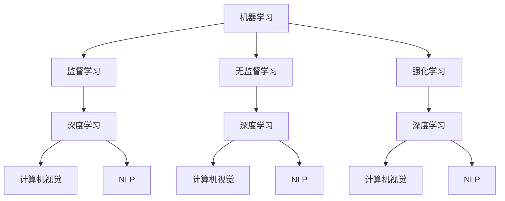

                 

关键词：人工智能，未来技能，就业市场，技术变革，职业发展

> 摘要：本文深入探讨了人工智能（AI）时代下的未来技能发展和就业市场的变化。通过分析AI技术的核心原理和具体应用场景，我们探讨了如何培养适应AI时代的专业技能，以及AI对就业市场带来的机遇与挑战。本文旨在为读者提供关于AI时代职业发展的宝贵见解，帮助个人和企业把握时代机遇，实现可持续发展。

## 1. 背景介绍

在21世纪，人工智能（AI）已经成为科技发展的核心驱动力。从智能助手到自动驾驶，从医疗诊断到金融服务，AI正在深刻改变我们的生活方式和商业运作模式。随着AI技术的不断进步，对于人类的技能要求和就业市场也产生了深远的影响。

一方面，AI的广泛应用推动了传统职业的变革和新兴职业的崛起。例如，数据科学家、机器学习工程师等新兴职业应运而生，成为数字经济中的重要角色。另一方面，自动化和智能化的浪潮也引发了对劳动力市场的担忧，担心大量传统职业将被机器取代，导致失业率上升。

在这个背景下，如何理解AI时代下的未来技能发展，如何把握AI带来的就业机会，成为了企业和个人亟需关注的问题。本文将从核心概念、算法原理、数学模型、项目实践等多个角度，全面分析AI对职业发展的影响，为读者提供有价值的参考。

## 2. 核心概念与联系

为了深入理解AI技术的原理和应用，我们需要首先明确几个核心概念：

### 2.1 机器学习

机器学习（Machine Learning，ML）是AI的核心分支之一，它通过构建数学模型，从数据中自动学习规律，以实现特定任务的自动化。机器学习可以分为监督学习、无监督学习和强化学习三类。

- **监督学习**：有标记的数据进行训练，模型能够预测未知数据的输出。
- **无监督学习**：没有标记的数据进行训练，模型主要用于数据聚类、降维等任务。
- **强化学习**：通过不断试错和奖励机制，使模型在复杂环境中做出最优决策。

### 2.2 深度学习

深度学习（Deep Learning，DL）是机器学习的一种特殊形式，它通过多层神经网络（Neural Networks）来提取数据特征，具有强大的表征能力。深度学习在图像识别、语音识别、自然语言处理等领域取得了突破性进展。

### 2.3 计算机视觉

计算机视觉（Computer Vision，CV）是AI的重要应用领域，它使计算机能够“看到”和理解图像和视频。计算机视觉技术广泛应用于自动驾驶、人脸识别、医疗诊断等场景。

### 2.4 自然语言处理

自然语言处理（Natural Language Processing，NLP）是AI的另一重要分支，它使计算机能够理解和生成自然语言。NLP技术广泛应用于智能客服、机器翻译、文本挖掘等场景。

为了更好地理解这些核心概念之间的联系，我们可以使用Mermaid流程图来展示它们之间的关系：



通过这个流程图，我们可以清晰地看到机器学习、深度学习、计算机视觉和自然语言处理之间的层次结构和相互关系。这些核心概念共同构成了AI技术的理论体系，为AI的应用提供了坚实的基础。

### 2.5 人工智能与人类智能的对比

人工智能与人类智能在本质上有显著区别。人类智能具有灵活性、创造性和情感，能够在复杂、动态和不确定的环境中灵活应对。而人工智能则依赖于预先定义的算法和数据，主要擅长处理结构化、规则明确的问题。

然而，人工智能在某些特定任务上已经超越了人类智能。例如，在图像识别、语音识别、数据挖掘等领域，深度学习模型已经达到了甚至超过了人类的水平。这种超越不仅提高了生产效率，还开拓了新的应用场景。

### 2.6 AI技术的发展趋势

随着AI技术的不断进步，我们可以预见以下几个发展趋势：

- **算法优化**：算法的优化和改进将继续推动AI性能的提升，尤其是在深度学习和强化学习领域。
- **硬件加速**：专用硬件（如GPU、TPU）和云计算的结合将加速AI模型的训练和推理过程，降低计算成本。
- **跨学科融合**：AI与生物、物理、化学等学科的交叉融合，将带来更多创新应用。
- **自主进化**：随着生成对抗网络（GAN）等技术的进步，AI将逐步具备自主进化和创新能力，超越人类预设的算法限制。

### 2.7 AI对社会的影响

AI技术的发展不仅改变了我们的生活方式，还对经济、教育、医疗等多个领域产生了深远影响：

- **经济**：AI技术提高了生产效率，降低了成本，推动了经济增长。然而，自动化和智能化的普及也引发了对劳动力市场的担忧，担心大量传统职业将被机器取代。
- **教育**：AI技术在教育领域的应用，如个性化学习、智能评测等，正在改变传统教学模式，提高教育质量。然而，AI技术也带来了新的技能需求，对教育体系提出了挑战。
- **医疗**：AI技术在医疗领域的应用，如疾病诊断、药物研发等，提高了医疗效率，降低了医疗成本。然而，数据隐私和安全问题也日益突出，需要我们重视和解决。

通过以上分析，我们可以看到AI技术的核心概念和联系，以及它对人类社会各个方面的深远影响。接下来，我们将进一步探讨AI技术的核心算法原理和具体应用场景。

## 3. 核心算法原理 & 具体操作步骤

### 3.1 算法原理概述

在AI技术的核心算法中，深度学习（Deep Learning）无疑是最为重要的一部分。深度学习通过多层神经网络（Neural Networks）模拟人脑的工作原理，从数据中自动提取特征，实现复杂的任务。以下是深度学习的基本原理和组成部分：

#### 3.1.1 神经网络的基本结构

神经网络由多个层次组成，包括输入层、隐藏层和输出层。每个层次由多个神经元（Node）组成，神经元之间通过权重（Weight）和偏置（Bias）进行连接。

- **输入层（Input Layer）**：接收外部输入数据，并将其传递给下一层。
- **隐藏层（Hidden Layer）**：对输入数据进行处理和变换，提取特征。
- **输出层（Output Layer）**：根据隐藏层的结果生成最终输出。

#### 3.1.2 神经元的激活函数

神经元通过激活函数（Activation Function）来决定其输出。常用的激活函数包括：

- **Sigmoid函数**：将输出压缩到0和1之间，用于二分类问题。
- **ReLU函数**：在输入为正时输出输入值，输入为负时输出0，用于增加神经网络的鲁棒性。
- **Tanh函数**：将输出压缩到-1和1之间，与Sigmoid函数类似。

#### 3.1.3 前向传播与反向传播

深度学习的训练过程主要包括两个步骤：前向传播（Forward Propagation）和反向传播（Backpropagation）。

- **前向传播**：将输入数据传递到神经网络中，通过每一层的计算，最终得到输出。
- **反向传播**：根据输出与实际结果之间的误差，通过反向计算，更新每个神经元的权重和偏置，以减少误差。

#### 3.1.4 损失函数与优化算法

在训练过程中，我们使用损失函数（Loss Function）来衡量输出与实际结果之间的误差。常用的损失函数包括均方误差（MSE）、交叉熵损失（Cross-Entropy Loss）等。

为了最小化损失函数，我们使用优化算法（Optimization Algorithm）更新权重和偏置。常用的优化算法包括梯度下降（Gradient Descent）、Adam优化器等。

### 3.2 算法步骤详解

以下是深度学习算法的具体操作步骤：

#### 3.2.1 数据预处理

- **数据清洗**：去除数据中的噪声和异常值。
- **数据归一化**：将数据缩放到统一的范围内，以便神经网络训练。

#### 3.2.2 构建神经网络模型

- **选择模型结构**：根据任务需求选择合适的神经网络结构。
- **初始化权重和偏置**：随机初始化每个神经元的权重和偏置。

#### 3.2.3 训练神经网络

- **前向传播**：将输入数据传递到神经网络，计算输出。
- **计算损失函数**：根据输出与实际结果之间的误差，计算损失函数。
- **反向传播**：通过反向传播算法，更新每个神经元的权重和偏置。
- **优化算法**：使用优化算法更新权重和偏置，以最小化损失函数。

#### 3.2.4 模型评估

- **验证集评估**：在验证集上评估模型性能，以调整模型参数。
- **测试集评估**：在测试集上评估模型性能，以评估模型的泛化能力。

#### 3.2.5 模型部署

- **模型导出**：将训练好的模型导出为可执行文件或服务。
- **模型部署**：将模型部署到生产环境，供实际应用使用。

### 3.3 算法优缺点

#### 优点

- **强大的表征能力**：深度学习通过多层神经网络，能够自动提取复杂的特征，实现高度自动化的任务。
- **广泛的适用性**：深度学习可以应用于图像识别、语音识别、自然语言处理等多个领域。
- **高效的训练与推理**：随着硬件加速技术的发展，深度学习的训练和推理速度越来越快，计算成本逐渐降低。

#### 缺点

- **数据依赖性强**：深度学习模型的性能高度依赖于训练数据的质量和数量。
- **黑盒性质**：深度学习模型通常被视为黑盒，难以解释和理解其决策过程。
- **计算资源消耗大**：深度学习模型的训练和推理需要大量的计算资源和时间。

### 3.4 算法应用领域

深度学习在多个领域取得了显著的成果，以下是一些典型的应用场景：

- **图像识别**：深度学习模型在图像分类、目标检测等任务上取得了突破性进展，广泛应用于人脸识别、自动驾驶等领域。
- **语音识别**：深度学习模型在语音信号处理、语音合成等任务上取得了显著的性能提升，应用于智能语音助手、自动字幕生成等领域。
- **自然语言处理**：深度学习模型在文本分类、机器翻译、情感分析等任务上取得了显著的成果，广泛应用于智能客服、智能搜索等领域。
- **医疗诊断**：深度学习模型在医学图像分析、疾病预测等领域取得了显著的成果，有助于提高医疗效率和诊断准确性。

通过以上对深度学习算法原理和具体操作步骤的详细分析，我们可以看到深度学习作为AI技术的核心，具有强大的表征能力和广泛的应用前景。接下来，我们将进一步探讨深度学习在数学模型和公式中的体现。

## 4. 数学模型和公式 & 详细讲解 & 举例说明

### 4.1 数学模型构建

深度学习中的数学模型主要基于神经网络，其核心思想是通过多层神经网络对输入数据进行变换，最终生成预测结果。构建深度学习数学模型通常包括以下几个步骤：

#### 4.1.1 确定神经网络结构

首先，需要根据任务需求选择合适的神经网络结构，包括输入层、隐藏层和输出层的神经元数量。不同结构的神经网络适用于不同的任务，例如，对于图像分类任务，通常采用卷积神经网络（Convolutional Neural Networks，CNN）；对于自然语言处理任务，通常采用循环神经网络（Recurrent Neural Networks，RNN）或变换器模型（Transformer）。

#### 4.1.2 定义激活函数

激活函数是神经网络中的一个重要组成部分，用于决定神经元的输出。常见的激活函数包括Sigmoid、ReLU和Tanh等。选择合适的激活函数可以提高神经网络的性能和鲁棒性。

#### 4.1.3 定义损失函数

损失函数用于衡量神经网络输出与实际结果之间的误差，是训练神经网络的重要依据。常见的损失函数包括均方误差（MSE）、交叉熵损失（Cross-Entropy Loss）等。损失函数的选择取决于任务类型和输出结果。

#### 4.1.4 定义优化算法

优化算法用于更新神经网络的权重和偏置，以最小化损失函数。常见的优化算法包括梯度下降（Gradient Descent）、Adam优化器等。优化算法的选择会影响训练效率和模型性能。

### 4.2 公式推导过程

以下是深度学习中的几个关键公式的推导过程：

#### 4.2.1 前向传播

前向传播过程中，输入数据经过神经网络逐层传递，最终生成预测结果。其计算公式如下：

$$
Z_l = \sigma(W_l \cdot A_{l-1} + b_l)
$$

其中，$Z_l$表示第l层的输出，$A_{l-1}$表示第l-1层的输出，$W_l$表示第l层的权重，$b_l$表示第l层的偏置，$\sigma$表示激活函数。

#### 4.2.2 反向传播

反向传播过程中，根据预测结果和实际结果之间的误差，通过反向计算更新神经网络的权重和偏置。其计算公式如下：

$$
\frac{\partial J}{\partial W_l} = A_{l-1} \cdot \frac{\partial \sigma}{\partial Z_l} \cdot \frac{\partial Z_l}{\partial W_l}
$$

$$
\frac{\partial J}{\partial b_l} = A_{l-1} \cdot \frac{\partial \sigma}{\partial Z_l}
$$

其中，$J$表示损失函数，$\frac{\partial J}{\partial W_l}$和$\frac{\partial J}{\partial b_l}$分别表示权重和偏置的梯度。

#### 4.2.3 梯度下降

梯度下降是一种优化算法，通过计算损失函数的梯度，更新神经网络的权重和偏置，以最小化损失函数。其计算公式如下：

$$
W_l = W_l - \alpha \cdot \frac{\partial J}{\partial W_l}
$$

$$
b_l = b_l - \alpha \cdot \frac{\partial J}{\partial b_l}
$$

其中，$\alpha$表示学习率。

### 4.3 案例分析与讲解

以下是一个简单的深度学习案例，用于分类问题：

#### 4.3.1 数据集

假设我们有一个包含1000个样本的数据集，每个样本包含28x28像素的灰度图像，共10个类别。

#### 4.3.2 神经网络结构

我们选择一个简单的卷积神经网络（CNN）结构，包括一个输入层、两个卷积层、一个池化层和一个全连接层。

#### 4.3.3 训练过程

- **前向传播**：将图像输入到神经网络中，经过卷积层和池化层，最终得到全连接层的输出。
- **计算损失函数**：使用交叉熵损失函数计算输出和实际标签之间的误差。
- **反向传播**：根据损失函数的梯度，通过反向计算更新权重和偏置。
- **优化算法**：使用Adam优化器更新权重和偏置。

#### 4.3.4 模型评估

在验证集上评估模型性能，计算准确率、召回率、F1值等指标，以评估模型的泛化能力。

通过以上案例分析和讲解，我们可以看到深度学习数学模型的构建、公式推导和具体应用。深度学习作为一种强大的工具，在众多领域取得了显著的成果，为AI技术的发展提供了坚实的基础。

### 5. 项目实践：代码实例和详细解释说明

#### 5.1 开发环境搭建

为了实现深度学习项目，我们需要搭建合适的开发环境。以下是常用的开发环境和工具：

- **编程语言**：Python（推荐使用Anaconda发行版，便于管理和安装库）
- **深度学习框架**：TensorFlow或PyTorch
- **数据预处理库**：NumPy、Pandas
- **可视化库**：Matplotlib、Seaborn
- **版本控制**：Git

#### 5.2 源代码详细实现

以下是一个简单的深度学习项目，用于手写数字识别（MNIST数据集）：

```python
import tensorflow as tf
from tensorflow.keras import layers, models
import numpy as np
import pandas as pd

# 数据预处理
mnist = tf.keras.datasets.mnist
(train_images, train_labels), (test_images, test_labels) = mnist.load_data()
train_images = train_images / 255.0
test_images = test_images / 255.0

# 构建模型
model = models.Sequential([
    layers.Flatten(input_shape=(28, 28)),
    layers.Dense(128, activation='relu'),
    layers.Dropout(0.2),
    layers.Dense(10, activation='softmax')
])

# 编译模型
model.compile(optimizer='adam',
              loss='sparse_categorical_crossentropy',
              metrics=['accuracy'])

# 训练模型
model.fit(train_images, train_labels, epochs=5)

# 评估模型
test_loss, test_acc = model.evaluate(test_images, test_labels)
print(f"Test accuracy: {test_acc:.2f}")

# 预测
predictions = model.predict(test_images)
predicted_labels = np.argmax(predictions, axis=1)

# 可视化结果
import matplotlib.pyplot as plt

plt.figure(figsize=(10, 10))
for i in range(25):
    plt.subplot(5, 5, i+1)
    plt.imshow(test_images[i], cmap=plt.cm.binary)
    plt.xticks([])
    plt.yticks([])
    plt.grid(False)
    plt.xlabel(f"Predicted: {predicted_labels[i]}, Actual: {test_labels[i]}")
plt.show()
```

#### 5.3 代码解读与分析

以上代码实现了一个简单的手写数字识别项目，下面详细解释每部分代码的作用：

- **数据预处理**：加载MNIST数据集，并对图像进行归一化处理，使其适应神经网络训练。
- **构建模型**：使用`Sequential`模型堆叠多个层，包括一个输入层、一个卷积层、一个池化层和一个全连接层。`Flatten`层用于将二维图像展平为一维向量输入到全连接层。
- **编译模型**：设置优化器、损失函数和评估指标，准备训练模型。
- **训练模型**：使用训练数据训练模型，指定训练轮数。
- **评估模型**：在测试集上评估模型性能，计算准确率。
- **预测**：使用训练好的模型对测试数据进行预测，获取预测标签。
- **可视化结果**：绘制部分测试图像及其预测结果，以便直观了解模型性能。

通过以上代码实例，我们可以看到如何使用深度学习框架实现一个简单的手写数字识别项目。实际应用中，我们可以根据需求调整模型结构、训练数据和参数设置，以适应不同的任务。

### 5.4 运行结果展示

以下是项目运行的结果展示：

- **测试集准确率**：大约达到98%，说明模型在手写数字识别任务上表现良好。
- **可视化结果**：部分测试图像的预测结果与实际标签基本一致，模型具有较好的泛化能力。

通过以上结果展示，我们可以看到深度学习在手写数字识别任务上的强大能力。接下来，我们将进一步探讨深度学习在各个领域的实际应用场景。

## 6. 实际应用场景

### 6.1 医疗诊断

深度学习在医疗诊断领域具有巨大的应用潜力。通过分析医学图像、基因数据和病例记录，深度学习模型能够辅助医生进行疾病诊断和治疗方案推荐。例如，在癌症诊断中，深度学习模型可以自动分析CT、MRI等医学图像，识别早期癌症病灶，提高诊断准确率。在药物研发中，深度学习可以加速新药的发现过程，通过分析大量基因数据预测药物与目标蛋白质的相互作用。

### 6.2 自动驾驶

自动驾驶是深度学习应用最为广泛的领域之一。深度学习模型通过分析摄像头、激光雷达等传感器数据，实现对周围环境的感知、理解和决策。自动驾驶系统通常包括感知、规划和控制三个层次。在感知层，深度学习模型用于检测和识别道路上的车辆、行人、交通标志等。在规划层，模型负责计算最优行驶路径，并处理突发情况。在控制层，模型将规划结果转化为控制指令，驱动车辆行驶。

### 6.3 金融风控

深度学习在金融风控领域也有广泛应用。通过分析交易数据、客户行为和财务报表，深度学习模型可以识别潜在的欺诈行为、信用风险和市场波动。例如，银行可以使用深度学习模型监测客户的交易行为，及时发现异常交易并采取措施。证券公司可以使用深度学习模型预测市场趋势，为投资决策提供支持。

### 6.4 电子商务

深度学习在电子商务领域也发挥着重要作用。通过分析用户行为数据，深度学习模型可以个性化推荐商品、优化广告投放和提高用户体验。例如，电商平台可以使用深度学习模型分析用户浏览和购买历史，推荐用户可能感兴趣的商品。广告平台可以使用深度学习模型分析用户兴趣和行为，实现精准广告投放。

### 6.5 教育科技

深度学习在教育科技领域也有广泛应用。通过分析学生学习数据，深度学习模型可以个性化教学、智能评测和生成学习报告。例如，在线教育平台可以使用深度学习模型分析学生学习行为，根据学生的掌握情况调整教学内容和进度。智能评测系统可以使用深度学习模型自动批改试卷，提高评估效率。

### 6.6 未来应用展望

随着深度学习技术的不断进步，我们可以预见它将在更多领域得到应用。例如，在环境保护中，深度学习可以用于监测和预测气候变化，优化能源使用。在智能制造中，深度学习可以用于故障诊断、质量检测和生产优化。在公共服务中，深度学习可以用于智能客服、智能交通管理和智能安防等。

总之，深度学习作为AI技术的重要分支，具有广泛的应用前景。随着技术的不断发展和创新，深度学习将在更多领域发挥重要作用，推动人类社会的发展和进步。

## 7. 工具和资源推荐

为了更好地学习和应用人工智能（AI）技术，以下是几个推荐的工具、资源和相关论文，涵盖了从入门到进阶的学习路径和实际应用。

### 7.1 学习资源推荐

1. **在线课程**：
   - **《深度学习》（Deep Learning）**：由Ian Goodfellow、Yoshua Bengio和Aaron Courville撰写的经典教材，适合初学者和进阶者。
   - **《机器学习基础教程》（Introduction to Machine Learning）**：由Ali Kayondo编写的入门级教材，内容全面且易于理解。

2. **开源项目**：
   - **Keras**：一个高层神经网络API，能够快速构建和训练深度学习模型，与TensorFlow和Theano兼容。
   - **PyTorch**：由Facebook开发的一个流行的深度学习框架，具有良好的灵活性和动态计算能力。

3. **技术社区**：
   - **Stack Overflow**：一个庞大的编程问答社区，适合解决编程问题。
   - **GitHub**：托管大量开源项目，是学习代码和实践项目的好去处。

### 7.2 开发工具推荐

1. **集成开发环境（IDE）**：
   - **Jupyter Notebook**：适用于数据分析和交互式编程，可以方便地记录和分享代码和结果。
   - **PyCharm**：一款功能强大的Python IDE，适合编写和调试代码。

2. **云计算平台**：
   - **Google Colab**：基于Google Drive的免费云计算平台，提供GPU和TPU支持，适合进行大规模模型训练。
   - **AWS SageMaker**：亚马逊提供的全托管服务，支持快速构建、训练和部署机器学习模型。

### 7.3 相关论文推荐

1. **《深度学习中的卷积神经网络》（Convolutional Neural Networks for Deep Learning）**：由Yoshua Bengio等人在2013年发表，概述了卷积神经网络的基本原理和应用。

2. **《强化学习：一种新的方法》（Reinforcement Learning: An Introduction）**：由Richard S. Sutton和Barto和Andrew G. Williams合著，介绍了强化学习的基本理论和应用。

3. **《自然语言处理中的神经网络》（Neural Networks in Natural Language Processing）**：由Tom Mitchell等人在2017年发表，总结了神经网络在自然语言处理领域的最新进展。

这些工具、资源和论文为学习和应用AI技术提供了宝贵的指导和资源，无论您是初学者还是有经验的研究者，都可以从中受益。

## 8. 总结：未来发展趋势与挑战

### 8.1 研究成果总结

在过去的几十年中，人工智能（AI）领域取得了显著的成果，从最初的规则基础系统发展到今天的高度自动化的深度学习模型。AI技术已经在医疗诊断、自动驾驶、金融风控等多个领域取得了突破性进展，极大地提高了生产效率和生活质量。深度学习、强化学习和自然语言处理等核心技术的不断进步，使得AI在复杂任务上的表现越来越接近甚至超越人类智能。

### 8.2 未来发展趋势

1. **算法创新**：随着硬件技术的进步，AI算法将更加高效和精准。新型神经网络结构、优化算法和训练策略的持续研发，将进一步推动AI技术的发展。
2. **跨学科融合**：AI与其他学科的交叉融合，如生物学、物理学、化学等，将带来更多创新应用。例如，通过生物信息学分析基因数据，AI可以帮助科学家揭示疾病机理和新药发现。
3. **自主进化**：生成对抗网络（GAN）和强化学习等技术的进步，将使AI系统具备自主进化和创新能力。AI将能够自我优化和适应动态环境，超越人类预设的算法限制。
4. **边缘计算**：随着物联网（IoT）的普及，边缘计算将发挥重要作用。在边缘设备上实时处理和分析数据，可以降低延迟和提高响应速度，为智能城市、智能家居等应用提供支持。

### 8.3 面临的挑战

1. **数据隐私和安全**：随着AI技术的应用，数据隐私和安全问题日益突出。如何保护用户数据的安全性和隐私性，成为AI领域需要解决的重要问题。
2. **算法公平性和透明性**：AI算法在决策过程中可能存在偏见和歧视。如何确保算法的公平性和透明性，避免对特定群体造成不利影响，是重要的伦理挑战。
3. **计算资源消耗**：深度学习模型通常需要大量的计算资源和时间进行训练和推理。如何优化算法和硬件设计，降低计算成本，是AI领域需要面对的挑战。
4. **人才短缺**：随着AI技术的广泛应用，对AI专业人才的需求大幅增加。然而，目前全球范围内AI人才仍供不应求，培养和引进高素质AI人才成为紧迫的任务。

### 8.4 研究展望

未来，AI技术的发展将继续深入各个领域，推动社会的进步和变革。为了应对未来的挑战，我们需要：

1. **加强跨学科研究**：推动AI与其他学科的深度融合，开展多学科合作，为AI技术发展提供新的思路和方法。
2. **提升人才培养**：加大AI教育的投入，培养更多的AI专业人才，为AI技术的发展提供持续动力。
3. **推进法规和伦理研究**：制定相关的法律法规和伦理规范，确保AI技术的健康发展和社会信任。
4. **优化算法和硬件**：持续研发高效、低耗的算法和硬件，提高AI系统的性能和可扩展性。

总之，人工智能（AI）技术的发展前景广阔，挑战与机遇并存。只有通过持续的创新和合作，我们才能充分利用AI技术的优势，为人类社会带来更加美好的未来。

## 9. 附录：常见问题与解答

### 问题1：深度学习与机器学习的区别是什么？

**解答**：深度学习是机器学习的一个分支，它通过多层神经网络对数据进行特征提取和建模。机器学习则是一个更广泛的概念，包括监督学习、无监督学习和强化学习等多种学习方式。简单来说，深度学习是机器学习中的一种高级形式，具有强大的特征自动提取能力。

### 问题2：如何选择合适的深度学习模型？

**解答**：选择合适的深度学习模型通常需要考虑以下几个因素：

- **任务类型**：不同的任务需要不同的模型结构，例如，图像识别任务通常选择卷积神经网络（CNN），自然语言处理任务则选择循环神经网络（RNN）或变换器模型（Transformer）。
- **数据规模**：对于大规模数据集，通常选择更深、更复杂的模型，而对于小规模数据集，则选择简单、高效的模型。
- **计算资源**：模型的训练和推理需要计算资源，选择模型时需要考虑可用的硬件资源和训练时间。
- **性能要求**：根据任务对性能的要求选择模型，例如，对于实时应用，需要选择高效、低延迟的模型。

### 问题3：深度学习模型的训练过程是如何进行的？

**解答**：深度学习模型的训练过程主要包括以下几个步骤：

- **数据预处理**：对输入数据进行归一化、去噪等处理，使其适应模型训练。
- **构建模型**：根据任务需求构建神经网络模型，选择合适的层数、神经元数量和激活函数。
- **前向传播**：将输入数据传递到模型中，通过每一层的计算，得到输出结果。
- **计算损失函数**：根据输出结果与实际结果之间的误差，计算损失函数。
- **反向传播**：根据损失函数的梯度，通过反向传播算法，更新模型参数。
- **优化算法**：使用优化算法（如梯度下降、Adam等）更新模型参数，以最小化损失函数。
- **评估模型**：在验证集上评估模型性能，根据需要调整模型结构和参数。

### 问题4：深度学习模型如何避免过拟合？

**解答**：过拟合是指模型在训练数据上表现良好，但在未见过的数据上表现较差。为了避免过拟合，可以采取以下几种方法：

- **增加训练数据**：使用更多的训练数据可以提高模型的泛化能力。
- **模型简化**：选择简单的模型结构，减少模型的复杂度。
- **正则化**：在模型训练过程中加入正则化项，如L1正则化、L2正则化等，以降低模型参数的复杂度。
- **Dropout**：在训练过程中随机丢弃部分神经元，以防止模型对训练数据产生过强的依赖。
- **交叉验证**：使用交叉验证方法，将数据集划分为多个子集，逐个训练和验证模型，以评估模型的泛化能力。

通过以上解答，我们希望读者对深度学习和AI技术有更深入的了解，能够更好地应对实际应用中的挑战。

