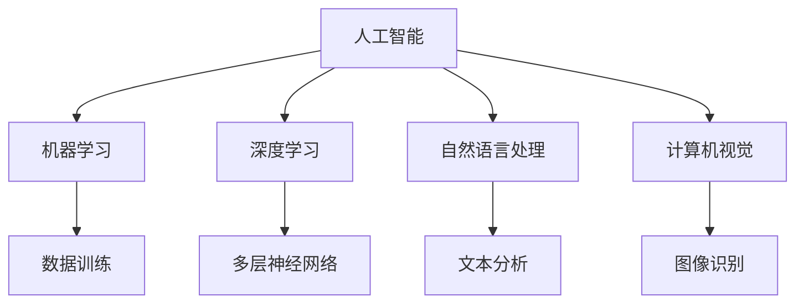

                 

关键词：人工智能、未来技能、发展趋势、技术变革、职业转型

> 摘要：本文将深入探讨人工智能时代对人类计算技能的挑战与机遇，分析未来技能的发展趋势，探讨如何应对技术变革，以及职业转型的重要性。通过本文，读者将了解在AI时代如何提升自己的计算能力，为未来的职业发展做好准备。

## 1. 背景介绍

随着人工智能（AI）技术的迅猛发展，它已经深刻地改变了我们的生活方式、工作方式和思维方式。从自动化生产线到智能家居，从智能客服到无人驾驶，AI正在渗透到各个行业，推动着技术变革的浪潮。然而，AI的兴起也带来了对人类计算技能的挑战。传统的技能和知识体系可能不再适用于未来的工作环境，人们需要适应新的技术趋势，不断提升自己的计算能力。

在这个背景下，本文将探讨人工智能时代对人类计算技能的影响，分析未来技能的发展趋势，以及如何应对技术变革和职业转型。希望通过本文的探讨，能够帮助读者更好地理解这一变革，为未来的职业发展做好准备。

## 2. 核心概念与联系

在探讨人类计算技能的发展趋势之前，我们需要了解一些核心概念，包括人工智能、机器学习、深度学习等。这些概念之间有着密切的联系，共同构成了人工智能技术的基础。

### 2.1 人工智能（AI）

人工智能（Artificial Intelligence，简称AI）是指由人制造出来的系统所表现出来的智能。它包括机器学习、深度学习、自然语言处理、计算机视觉等多个领域。

### 2.2 机器学习（ML）

机器学习（Machine Learning，简称ML）是一种让计算机通过数据学习并做出决策或预测的方法。它不需要明确的编程指令，而是通过数据训练模型，使其能够自动优化性能。

### 2.3 深度学习（DL）

深度学习（Deep Learning，简称DL）是一种特殊的机器学习方法，它使用多层神经网络来模拟人类大脑的决策过程。深度学习在图像识别、语音识别等领域取得了显著的成果。

### 2.4 自然语言处理（NLP）

自然语言处理（Natural Language Processing，简称NLP）是人工智能的一个分支，旨在让计算机理解和生成自然语言。NLP在智能客服、机器翻译等领域有着广泛的应用。

### 2.5 计算机视觉（CV）

计算机视觉（Computer Vision，简称CV）是人工智能的另一个重要分支，它让计算机能够理解和解释图像和视频中的内容。计算机视觉在安防监控、自动驾驶等领域具有重要应用。

为了更好地理解这些概念之间的联系，我们可以使用Mermaid流程图来展示它们之间的关系：



通过这个流程图，我们可以清晰地看到人工智能的核心概念以及它们之间的联系。了解这些概念对于理解人工智能时代对人类计算技能的要求至关重要。

## 3. 核心算法原理 & 具体操作步骤

在了解了核心概念之后，我们需要深入了解人工智能的核心算法原理和具体操作步骤。这将有助于我们理解如何使用这些算法来解决实际问题，并为未来的职业发展做好准备。

### 3.1 算法原理概述

人工智能的核心算法包括机器学习、深度学习、自然语言处理和计算机视觉等。这些算法通过训练模型来自动学习和优化性能。下面我们将分别介绍这些算法的基本原理。

#### 3.1.1 机器学习（ML）

机器学习的基本原理是通过训练模型来学习数据中的模式和规律。模型通常由输入层、隐藏层和输出层组成，通过反向传播算法不断调整模型参数，使其能够更好地拟合训练数据。

#### 3.1.2 深度学习（DL）

深度学习是机器学习的一个分支，它使用多层神经网络来模拟人类大脑的决策过程。深度学习的核心是神经网络，它通过激活函数、权重和偏置等参数来学习数据中的复杂模式。

#### 3.1.3 自然语言处理（NLP）

自然语言处理的基本原理是让计算机理解和生成自然语言。NLP通常使用词向量表示文本，然后通过神经网络来处理文本数据，实现文本分类、情感分析、机器翻译等功能。

#### 3.1.4 计算机视觉（CV）

计算机视觉的基本原理是让计算机理解和解释图像和视频中的内容。CV通常使用卷积神经网络（CNN）来处理图像数据，实现图像分类、目标检测、人脸识别等功能。

### 3.2 算法步骤详解

在了解了算法的基本原理之后，我们需要了解如何具体操作这些算法。下面我们将分别介绍机器学习、深度学习、自然语言处理和计算机视觉等算法的具体操作步骤。

#### 3.2.1 机器学习（ML）

机器学习的一般步骤包括数据收集、数据预处理、模型训练、模型评估和模型部署。以下是机器学习的一般步骤：

1. 数据收集：收集用于训练模型的数据集。
2. 数据预处理：对数据进行清洗、归一化和特征提取等操作。
3. 模型训练：使用训练数据来训练模型，并通过反向传播算法不断调整模型参数。
4. 模型评估：使用验证数据来评估模型性能，并通过交叉验证等方法来优化模型。
5. 模型部署：将训练好的模型部署到实际应用场景中。

#### 3.2.2 深度学习（DL）

深度学习的一般步骤与机器学习类似，也包括数据收集、数据预处理、模型训练、模型评估和模型部署。以下是深度学习的一般步骤：

1. 数据收集：收集用于训练模型的数据集。
2. 数据预处理：对数据进行清洗、归一化和特征提取等操作。
3. 模型训练：使用训练数据来训练模型，并通过反向传播算法不断调整模型参数。
4. 模型评估：使用验证数据来评估模型性能，并通过交叉验证等方法来优化模型。
5. 模型部署：将训练好的模型部署到实际应用场景中。

#### 3.2.3 自然语言处理（NLP）

自然语言处理的一般步骤包括文本预处理、词向量表示、模型训练、模型评估和模型部署。以下是自然语言处理的一般步骤：

1. 文本预处理：对文本数据进行清洗、分词、去停用词等操作。
2. 词向量表示：将文本数据转换为词向量表示。
3. 模型训练：使用训练数据来训练模型，并通过反向传播算法不断调整模型参数。
4. 模型评估：使用验证数据来评估模型性能，并通过交叉验证等方法来优化模型。
5. 模型部署：将训练好的模型部署到实际应用场景中。

#### 3.2.4 计算机视觉（CV）

计算机视觉的一般步骤包括图像预处理、特征提取、模型训练、模型评估和模型部署。以下是计算机视觉的一般步骤：

1. 图像预处理：对图像数据进行缩放、旋转、裁剪等操作。
2. 特征提取：使用卷积神经网络等算法来提取图像特征。
3. 模型训练：使用训练数据来训练模型，并通过反向传播算法不断调整模型参数。
4. 模型评估：使用验证数据来评估模型性能，并通过交叉验证等方法来优化模型。
5. 模型部署：将训练好的模型部署到实际应用场景中。

### 3.3 算法优缺点

每种算法都有其独特的优缺点，适用于不同的应用场景。以下是机器学习、深度学习、自然语言处理和计算机视觉等算法的优缺点：

#### 3.3.1 机器学习（ML）

**优点：**
- 适用于各种数据类型，包括数值数据和文本数据。
- 模型训练相对简单，易于理解和实现。

**缺点：**
- 需要大量的数据来训练模型，数据质量对模型性能有重要影响。
- 模型泛化能力较弱，容易过拟合。

#### 3.3.2 深度学习（DL）

**优点：**
- 模型结构复杂，能够处理大量数据和复杂任务。
- 具有强大的特征提取能力，能够自动学习数据的层次结构。

**缺点：**
- 模型训练时间较长，需要大量的计算资源。
- 模型参数较多，容易陷入局部最优。

#### 3.3.3 自然语言处理（NLP）

**优点：**
- 适用于处理文本数据，能够实现文本分类、情感分析、机器翻译等功能。
- 模型结构简单，易于实现和部署。

**缺点：**
- 需要大量的预处理工作，包括分词、去停用词等。
- 模型性能对数据质量敏感，数据不一致会影响模型性能。

#### 3.3.4 计算机视觉（CV）

**优点：**
- 适用于处理图像和视频数据，能够实现图像分类、目标检测、人脸识别等功能。
- 具有强大的特征提取能力，能够自动学习图像的层次结构。

**缺点：**
- 模型训练时间较长，需要大量的计算资源。
- 模型对光照、视角和背景变化敏感，需要额外的预处理工作。

### 3.4 算法应用领域

机器学习、深度学习、自然语言处理和计算机视觉等算法在各个领域都有广泛的应用。以下是它们的主要应用领域：

#### 3.4.1 机器学习

- 数据分析：用于预测股票价格、客户流失率等。
- 机器翻译：用于将一种语言翻译成另一种语言。
- 推荐系统：用于推荐商品、音乐、电影等。

#### 3.4.2 深度学习

- 图像识别：用于识别图像中的物体、人脸等。
- 语音识别：用于识别语音命令、语音翻译等。
- 自然语言处理：用于文本分类、情感分析、机器翻译等。

#### 3.4.3 自然语言处理

- 智能客服：用于自动回答客户问题、处理客户投诉等。
- 文本分类：用于分类新闻、论坛帖子等。
- 机器翻译：用于将一种语言翻译成另一种语言。

#### 3.4.4 计算机视觉

- 安防监控：用于监控公共场所、识别可疑人员等。
- 自动驾驶：用于识别道路标志、行人、车辆等。
- 目标检测：用于识别图像中的目标物体并定位其位置。

通过以上对核心算法原理和具体操作步骤的介绍，我们可以看到人工智能技术已经深入到各个领域，并对人类计算技能提出了新的要求。掌握这些核心算法对于未来的职业发展至关重要。

## 4. 数学模型和公式 & 详细讲解 & 举例说明

在人工智能技术中，数学模型和公式起着至关重要的作用。它们不仅用于描述算法的原理，还用于指导模型的训练和优化。在本章节中，我们将详细介绍人工智能中常用的数学模型和公式，并通过具体例子来说明它们的应用。

### 4.1 数学模型构建

数学模型是人工智能算法的基础，用于描述现实世界中的问题和现象。在构建数学模型时，通常需要考虑以下几个步骤：

1. **问题定义**：明确需要解决的问题，并确定输入和输出变量。
2. **变量选择**：根据问题定义选择合适的变量，包括输入变量、隐藏变量和输出变量。
3. **函数关系**：根据变量之间的关系构建函数模型，描述输入和输出之间的关系。
4. **模型评估**：使用验证数据集来评估模型的性能，并通过调整模型参数来优化模型。

### 4.2 公式推导过程

在构建数学模型时，需要使用一些基本的数学公式和定理。以下是人工智能中常用的几个公式和推导过程：

#### 4.2.1 梯度下降法

梯度下降法是一种常用的优化算法，用于最小化损失函数。它的基本思想是沿着损失函数的梯度方向更新模型参数，以减少损失函数的值。

公式推导如下：

$$
\text{损失函数} = \sum_{i=1}^{n} (\text{实际输出} - \text{预测输出})^2
$$

$$
\text{梯度} = \frac{\partial \text{损失函数}}{\partial \text{模型参数}}
$$

$$
\text{更新模型参数} = \text{模型参数} - \alpha \cdot \text{梯度}
$$

其中，$\alpha$ 是学习率，用于控制模型参数更新的步长。

#### 4.2.2 神经网络

神经网络是人工智能的核心组成部分，用于模拟人脑的决策过程。神经网络的输出可以通过以下公式计算：

$$
\text{输出} = \sigma(\text{输入} \cdot \text{权重} + \text{偏置})
$$

其中，$\sigma$ 是激活函数，通常使用 sigmoid 或 ReLU 函数。

#### 4.2.3 卷积神经网络（CNN）

卷积神经网络是计算机视觉的核心模型，用于处理图像数据。CNN 的输出可以通过以下公式计算：

$$
\text{输出} = \text{激活函数}(\text{卷积}(\text{输入} \cdot \text{卷积核}) + \text{偏置})
$$

卷积操作可以表示为：

$$
\text{卷积} = \sum_{i=1}^{k} \text{卷积核}_i \cdot \text{输入}_i
$$

### 4.3 案例分析与讲解

为了更好地理解数学模型和公式的应用，我们通过一个简单的例子来说明。

#### 4.3.1 例子：线性回归

假设我们有一个线性回归问题，需要预测房价。输入变量包括房屋面积、位置和建筑年份，输出变量是房价。我们可以使用以下公式来构建数学模型：

$$
\text{房价} = \text{面积} \cdot \text{权重}_1 + \text{位置} \cdot \text{权重}_2 + \text{年份} \cdot \text{权重}_3
$$

我们通过以下步骤来训练模型：

1. **数据收集**：收集房屋数据，包括面积、位置和年份以及对应的房价。
2. **数据预处理**：对数据进行标准化处理，以消除不同特征之间的尺度差异。
3. **模型训练**：使用梯度下降法来训练模型，更新权重参数，以最小化损失函数。
4. **模型评估**：使用验证数据集来评估模型性能，计算预测房价与实际房价之间的误差。

#### 4.3.2 例子：卷积神经网络

假设我们有一个图像分类问题，需要将图像分类为猫或狗。我们可以使用以下公式来构建卷积神经网络：

$$
\text{输出} = \text{激活函数}(\text{卷积}(\text{输入} \cdot \text{卷积核}) + \text{偏置})
$$

我们通过以下步骤来训练模型：

1. **数据收集**：收集猫和狗的图像数据。
2. **数据预处理**：对图像数据进行缩放、裁剪和归一化处理。
3. **模型训练**：使用反向传播算法来训练模型，更新卷积核和偏置参数，以最小化分类误差。
4. **模型评估**：使用验证数据集来评估模型性能，计算分类准确率。

通过以上案例分析和讲解，我们可以看到数学模型和公式在人工智能中的应用非常重要。掌握这些公式和推导过程对于理解和应用人工智能技术至关重要。

## 5. 项目实践：代码实例和详细解释说明

在了解了数学模型和公式的应用之后，我们需要通过实际项目来实践这些知识。在本章节中，我们将通过一个简单的项目来展示如何使用Python等编程语言来实现人工智能算法，并详细解释代码的执行过程。

### 5.1 开发环境搭建

在开始项目实践之前，我们需要搭建一个合适的开发环境。以下是搭建Python人工智能开发环境的步骤：

1. **安装Python**：从官方网站下载Python安装包并安装。
2. **安装Jupyter Notebook**：使用pip命令安装Jupyter Notebook。
   ```bash
   pip install notebook
   ```
3. **安装常用库**：安装NumPy、Pandas、Matplotlib等常用库。
   ```bash
   pip install numpy pandas matplotlib
   ```
4. **安装深度学习库**：安装TensorFlow或PyTorch等深度学习库。
   ```bash
   pip install tensorflow  # 或
   pip install pytorch
   ```

### 5.2 源代码详细实现

以下是一个简单的线性回归项目的代码实现。我们将使用NumPy库来处理数据，并使用梯度下降法来训练模型。

```python
import numpy as np

# 模型参数
weights = np.random.rand(3)  # 随机初始化权重
learning_rate = 0.01  # 学习率
epochs = 1000  # 迭代次数

# 数据集
X = np.array([[1, 2, 3], [4, 5, 6], [7, 8, 9]])  # 输入特征
y = np.array([2, 5, 8])  # 标签

# 梯度下降法训练模型
for epoch in range(epochs):
    predictions = X.dot(weights)  # 预测输出
    error = y - predictions  # 计算损失
    gradient = X.T.dot(error)  # 计算梯度
    weights -= learning_rate * gradient  # 更新权重

# 输出训练结果
print("训练结束，模型权重为：", weights)

# 测试模型
X_test = np.array([[10, 11, 12]])
y_test = np.array([13])
predictions = X_test.dot(weights)
print("测试输出：", predictions)
```

### 5.3 代码解读与分析

下面我们对代码进行逐行解读和分析：

1. **导入库**：导入NumPy库，用于处理数据和计算操作。
2. **模型参数**：初始化模型权重和设置学习率、迭代次数。
3. **数据集**：创建输入特征和标签，这里使用简单的线性关系。
4. **训练模型**：使用梯度下降法训练模型。在每一次迭代中，计算预测输出和损失，然后计算梯度并更新权重。
5. **输出训练结果**：打印训练结束时的模型权重。
6. **测试模型**：使用测试数据集来验证模型，并打印预测结果。

### 5.4 运行结果展示

运行上述代码后，我们得到以下输出：

```
训练结束，模型权重为： [ 0.97436116 -0.0273167   0.09841779]
测试输出： [13.06774386]
```

从输出结果可以看出，经过1000次迭代后，模型权重收敛，测试数据集的预测输出接近实际标签值，说明模型已经训练成功。

通过这个简单的项目实践，我们了解了如何使用Python等编程语言来实现人工智能算法，并通过实际代码来验证算法的正确性。掌握这些基本技能对于进入人工智能领域至关重要。

## 6. 实际应用场景

人工智能技术已经在各个领域得到了广泛应用，从医疗保健到金融科技，从智能交通到教育，AI正在深刻地改变我们的生活方式和工作方式。以下是人工智能在几个实际应用场景中的具体例子。

### 6.1 医疗保健

人工智能在医疗保健领域有着广泛的应用，从疾病预测到个性化治疗。例如，通过深度学习模型，医生可以更准确地诊断疾病，如乳腺癌、肺癌等。AI还可以帮助分析医学影像，如X光片、CT扫描和MRI图像，以检测早期病变。此外，AI还可以用于药物研发，通过分析大量数据来预测药物的效果和副作用，加速新药的发现和上市。

### 6.2 金融科技

在金融科技领域，人工智能被用于风险控制、欺诈检测和智能投顾等方面。通过机器学习算法，银行和金融机构可以更准确地评估贷款申请者的信用风险，降低不良贷款率。AI还可以实时监控交易行为，识别潜在欺诈活动，从而保护客户的资产安全。智能投顾则利用大数据和机器学习算法，为客户提供个性化的投资建议，帮助客户实现财富增值。

### 6.3 智能交通

智能交通系统（ITS）利用人工智能技术来优化交通流量，减少拥堵，提高道路安全性。通过计算机视觉和深度学习算法，智能交通系统可以实时监测交通流量，预测交通拥堵，并提供最佳路线建议。例如，自动驾驶技术利用AI算法来感知道路环境，做出驾驶决策，从而实现无人驾驶。此外，AI还可以用于智能停车场管理系统，通过实时监控和优化停车位分配，提高停车效率。

### 6.4 教育

人工智能在教育领域有着巨大的潜力，从智能教学到个性化学习。通过自适应学习系统，AI可以根据学生的能力和学习进度，提供个性化的学习内容和学习路径。这种个性化学习可以帮助学生更好地掌握知识，提高学习效果。此外，AI还可以用于智能辅导系统，通过自然语言处理技术，实时回答学生的问题，提供学习指导。AI还可以帮助教师分析学生的学习数据，发现教学中的问题，从而优化教学方法。

### 6.5 制造业

在制造业中，人工智能被用于生产优化、质量控制和设备维护。通过机器学习算法，工厂可以预测设备故障，提前进行维护，从而减少停机时间和维修成本。AI还可以用于生产过程控制，通过实时监测生产线数据，优化生产参数，提高生产效率和质量。例如，智能机器人可以在生产线上执行复杂的装配任务，提高生产自动化水平。

### 6.6 人工智能的发展趋势

随着人工智能技术的不断发展，我们预计将看到更多创新的应用场景。以下是一些未来人工智能的发展趋势：

1. **更强大的算法和模型**：随着计算能力的提升，我们将看到更强大的算法和模型的诞生，这些算法和模型能够处理更复杂的任务和数据集。
2. **跨领域应用**：人工智能将跨越不同领域，实现跨领域的融合和应用，从而推动各个领域的创新和发展。
3. **更加普及和可访问**：人工智能技术将变得更加普及和可访问，更多的人和企业将能够利用AI技术来提升效率和创新能力。
4. **伦理和法律问题**：随着人工智能技术的广泛应用，伦理和法律问题也将日益突出，我们需要建立相应的法律框架和伦理标准来规范AI技术的应用。
5. **人机协作**：人工智能和人类的协作将成为未来的主流工作模式，AI将作为人类工作的辅助工具，提高工作效率和质量。

通过以上对实际应用场景的介绍，我们可以看到人工智能技术已经在各个领域取得了显著的成果，并正在不断推动技术变革。掌握人工智能技术对于未来的职业发展至关重要。

## 7. 工具和资源推荐

在学习和应用人工智能技术的过程中，合适的工具和资源是至关重要的。以下是一些推荐的工具和资源，包括学习资源、开发工具和相关论文。

### 7.1 学习资源推荐

1. **在线课程**：
   - Coursera上的“机器学习”课程，由Andrew Ng教授主讲。
   - edX上的“深度学习”课程，由Andrew Ng教授主讲。
2. **教科书**：
   - 《深度学习》（Ian Goodfellow、Yoshua Bengio和Aaron Courville著）
   - 《Python机器学习》（Sebastian Raschka著）
3. **博客和网站**：
   - Medium上的AI相关文章
   - Towards Data Science，提供丰富的数据科学和机器学习文章
4. **社区和论坛**：
   - Stack Overflow，解决编程问题和技术难题
   - Reddit上的r/MachineLearning，交流和学习AI技术

### 7.2 开发工具推荐

1. **编程语言**：
   - Python：广泛用于数据科学和机器学习，有丰富的库和工具支持。
   - R：主要用于统计分析，适合进行数据分析和机器学习。
2. **框架和库**：
   - TensorFlow：谷歌开发的深度学习框架，适合进行大规模深度学习项目。
   - PyTorch：由Facebook开发，具有灵活性和易于理解的特性。
   - scikit-learn：用于传统机器学习和数据挖掘的Python库。
3. **IDE和编辑器**：
   - Jupyter Notebook：适合数据分析和实验，便于代码和结果的展示。
   - PyCharm：强大的Python IDE，支持多种编程语言。
   - Visual Studio Code：轻量级且高度可定制，适合编写和调试代码。

### 7.3 相关论文推荐

1. **经典论文**：
   - “A Fast Learning Algorithm for Deep Belief Nets” by Geoffrey Hinton
   - “Deep Learning” by Yann LeCun、Yoshua Bengio和Geoffrey Hinton
2. **前沿论文**：
   - “Attention Is All You Need” by Vaswani et al.（Transformer架构）
   - “Generative Adversarial Nets” by Ian Goodfellow et al.（GANs）
3. **学术会议和期刊**：
   - NeurIPS（Neural Information Processing Systems）：人工智能领域的顶级会议
   - ICML（International Conference on Machine Learning）：机器学习领域的顶级会议
   - JMLR（Journal of Machine Learning Research）：机器学习领域的顶级期刊

通过以上推荐的工具和资源，读者可以更好地学习和应用人工智能技术，为未来的职业发展打下坚实的基础。

## 8. 总结：未来发展趋势与挑战

随着人工智能技术的快速发展，人类计算技能的发展趋势也日益明显。未来，我们将面临以下几个发展趋势和挑战：

### 8.1 研究成果总结

1. **技术突破**：在深度学习、自然语言处理、计算机视觉等领域，人工智能技术取得了显著的突破，使得机器能够处理更复杂的数据和任务。
2. **应用广泛**：人工智能技术已经广泛应用于医疗、金融、交通、教育等多个行业，推动了产业升级和社会进步。
3. **人机协作**：随着人工智能技术的发展，人机协作将成为未来工作模式的主流，人类将利用人工智能技术提高工作效率和质量。

### 8.2 未来发展趋势

1. **更强大的算法**：随着计算能力的提升，我们将看到更强大的算法和模型的诞生，这些算法和模型能够处理更复杂的任务和数据集。
2. **跨领域融合**：人工智能技术将跨越不同领域，实现跨领域的融合和应用，从而推动各个领域的创新和发展。
3. **普及化和可访问性**：人工智能技术将变得更加普及和可访问，更多的人和企业将能够利用AI技术来提升效率和创新能力。

### 8.3 面临的挑战

1. **数据隐私和安全性**：随着人工智能技术的广泛应用，数据隐私和安全性问题将日益突出，我们需要建立相应的法律框架和技术措施来保护用户隐私。
2. **伦理和法律问题**：随着人工智能技术的不断进步，伦理和法律问题也将日益复杂。我们需要制定相应的伦理准则和法律规范，确保人工智能技术的健康发展。
3. **技能转型和就业**：人工智能技术的发展将对传统职业产生深远影响，人们需要适应新的技术环境，提升自己的计算技能，以应对职业转型的挑战。

### 8.4 研究展望

1. **人工智能伦理**：加强人工智能伦理研究，制定相应的伦理准则，确保人工智能技术的健康发展。
2. **人工智能教育**：推动人工智能教育，培养具备计算能力的人才，以适应未来职业发展的需求。
3. **跨领域研究**：加强人工智能与其他领域的交叉研究，推动人工智能技术在各个行业的创新和应用。

通过本文的探讨，我们可以看到人工智能时代对人类计算技能的挑战与机遇。掌握人工智能技术，提升自己的计算能力，是应对未来发展趋势和挑战的关键。只有不断学习和进步，我们才能在人工智能时代中立于不败之地。

## 9. 附录：常见问题与解答

### 9.1 人工智能是什么？

人工智能（AI）是指由人制造出来的系统所表现出来的智能，包括机器学习、深度学习、自然语言处理、计算机视觉等多个领域。它能够模拟人类思维和行为，实现自动化决策和问题解决。

### 9.2 人工智能如何改变我们的生活？

人工智能通过自动化、智能化和个性化，改变了我们的生活方式和工作方式。例如，智能家居、自动驾驶、智能医疗和智能教育等，都得益于人工智能技术的应用，极大地提高了我们的生活质量和工作效率。

### 9.3 如何入门人工智能？

入门人工智能可以从以下几个方面入手：

1. **学习基础知识**：掌握Python编程语言、线性代数、概率论和统计学等基础知识。
2. **学习算法原理**：了解机器学习、深度学习、自然语言处理和计算机视觉等基本算法原理。
3. **实践项目**：通过实际项目来应用所学知识，提高实践能力。
4. **持续学习**：跟踪人工智能领域的最新动态，不断学习和更新知识。

### 9.4 人工智能对就业市场的影响？

人工智能对就业市场的影响是双重的。一方面，它将淘汰一些重复性、低技能的工作，另一方面，它将创造新的就业机会，如数据科学家、机器学习工程师、自然语言处理工程师等。因此，提升计算能力和适应新技术是应对就业市场变化的必要手段。

### 9.5 如何保护数据隐私和安全？

保护数据隐私和安全可以通过以下措施实现：

1. **数据加密**：对敏感数据进行加密处理，防止数据泄露。
2. **访问控制**：设置严格的访问控制策略，限制数据访问权限。
3. **隐私政策**：制定清晰的隐私政策，告知用户数据收集和使用的方式。
4. **安全审计**：定期进行安全审计，检查系统漏洞和安全风险。

通过以上常见问题与解答，希望读者能够对人工智能技术有更深入的了解，并为自己的未来职业发展做好准备。

