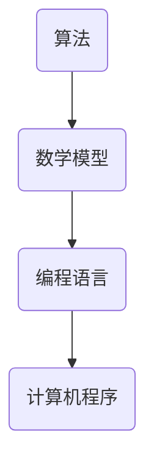

                 

关键词：人工智能、计算能力、算法原理、数学模型、实际应用、未来展望

> 摘要：本文将探讨人类计算技术的进步及其对世界的影响。通过深入剖析核心算法原理、数学模型构建、以及项目实践，我们将揭示计算技术在推动社会发展和创新中的应用潜力。文章还将展望未来计算技术发展的趋势与挑战，为读者提供一个全面的视角。

## 1. 背景介绍

### 1.1 人类计算的历史与发展

人类计算的历史可以追溯到远古时期，从最初的算盘到现代的计算机，计算技术不断演进，成为推动科技进步和社会发展的重要力量。计算机的出现标志着人类计算能力的一次飞跃，从手工计算到自动化处理，计算技术的进步极大地提高了工作效率，开启了信息时代的大门。

### 1.2 人工智能与计算能力的结合

人工智能作为计算机科学的一个分支，通过模拟人类智能的某些功能，如学习、推理、感知等，实现了机器的自主决策和问题求解。随着计算能力的不断提升，人工智能在各个领域取得了显著的应用成果，从语音识别、图像处理到自动驾驶，人工智能正逐步改变我们的生活方式。

## 2. 核心概念与联系

### 2.1 核心概念

在探讨计算技术的应用之前，我们需要明确几个核心概念：算法、数学模型和编程语言。算法是解决问题的步骤和规则，是计算技术的核心；数学模型则是用数学语言描述现实问题的抽象框架；编程语言则是实现算法的工具，将抽象的算法转化为计算机可以理解和执行的操作。

### 2.2 联系与关系

算法和数学模型紧密相关，算法的设计往往需要基于数学模型的原理。编程语言则提供了将算法和数学模型转化为计算机程序的桥梁。以下是一个用Mermaid绘制的流程图，展示了这三者之间的联系：



## 3. 核心算法原理 & 具体操作步骤

### 3.1 算法原理概述

本文将介绍一个在人工智能领域中广泛应用的算法——深度学习。深度学习是一种基于多层神经网络的结构，通过模拟人脑神经元之间的连接，实现自动特征提取和学习能力。

### 3.2 算法步骤详解

深度学习的具体步骤如下：

1. **数据预处理**：对输入数据进行标准化和归一化处理，确保数据质量。
2. **构建神经网络**：设计并构建多层神经网络结构，包括输入层、隐藏层和输出层。
3. **权重初始化**：对神经网络中的权重进行初始化，确保模型的训练过程。
4. **前向传播**：将输入数据通过神经网络进行传播，计算输出结果。
5. **反向传播**：根据输出结果与实际结果的误差，通过反向传播更新网络权重。
6. **优化策略**：采用优化算法（如梯度下降）调整网络参数，提高模型性能。
7. **评估与调整**：评估模型性能，根据评估结果调整模型结构或参数。

### 3.3 算法优缺点

**优点**：
- **强大的特征提取能力**：深度学习可以通过多层神经网络自动提取特征，减少人工干预。
- **广泛的适用性**：深度学习在图像处理、语音识别、自然语言处理等领域具有广泛应用。
- **高效率**：深度学习模型在处理大规模数据时具有高效的处理能力。

**缺点**：
- **训练成本高**：深度学习模型需要大量数据和计算资源进行训练。
- **解释性较差**：深度学习模型的工作机制较为复杂，难以解释。

### 3.4 算法应用领域

深度学习在众多领域取得了显著的应用成果，如：

- **图像识别**：用于人脸识别、物体检测等。
- **语音识别**：用于智能助手、语音翻译等。
- **自然语言处理**：用于文本分类、机器翻译等。

## 4. 数学模型和公式 & 详细讲解 & 举例说明

### 4.1 数学模型构建

深度学习中的数学模型主要包括线性变换、激活函数和损失函数。

- **线性变换**：将输入数据通过权重矩阵进行变换，实现数据的线性组合。
- **激活函数**：对线性变换的结果进行非线性变换，引入非线性特性。
- **损失函数**：衡量模型输出与实际输出之间的误差，用于指导模型训练。

### 4.2 公式推导过程

以下是深度学习中的几个关键公式：

$$
z = W \cdot x + b
$$

$$
a = \sigma(z)
$$

$$
\delta = \frac{\partial L}{\partial z}
$$

其中，$z$表示线性变换的结果，$a$表示激活函数的输出，$\sigma$表示激活函数，$L$表示损失函数，$W$和$b$分别表示权重和偏置。

### 4.3 案例分析与讲解

以下是一个简单的深度学习案例：使用深度学习模型进行手写数字识别。

1. **数据集准备**：使用MNIST手写数字数据集。
2. **构建模型**：设计一个包含输入层、一个隐藏层和一个输出层的简单神经网络。
3. **训练模型**：使用梯度下降算法训练模型，调整权重和偏置。
4. **评估模型**：计算模型在测试集上的准确率。

通过以上步骤，我们可以实现一个手写数字识别系统。具体实现细节请参考相关文献。

## 5. 项目实践：代码实例和详细解释说明

### 5.1 开发环境搭建

在开始项目实践之前，我们需要搭建一个开发环境。以下是搭建过程：

1. 安装Python环境，版本要求3.7及以上。
2. 安装TensorFlow库，可以使用pip安装：
   ```bash
   pip install tensorflow
   ```

### 5.2 源代码详细实现

以下是手写数字识别项目的源代码实现：

```python
import tensorflow as tf
from tensorflow.examples.tutorials.mnist import input_data

# 加载数据集
mnist = input_data.read_data_sets("MNIST_data/", one_hot=True)

# 设置参数
learning_rate = 0.1
num_steps = 1000
batch_size = 128
display_step = 100

# 构建模型
X = tf.placeholder(tf.float32, [None, 784])
Y = tf.placeholder(tf.float32, [None, 10])

W = tf.Variable(tf.zeros([784, 10]))
b = tf.Variable(tf.zeros([10]))

# 前向传播
logits = tf.matmul(X, W) + b
prediction = tf.nn.softmax(logits)

# 损失函数
loss_op = tf.reduce_mean(tf.nn.softmax_cross_entropy_with_logits(logits=logits, labels=Y))

# 优化器
optimizer = tf.train.GradientDescentOptimizer(learning_rate)
train_op = optimizer.minimize(loss_op)

# 训练模型
with tf.Session() as sess:
    sess.run(tf.global_variables_initializer())
    
    for step in range(1, num_steps+1):
        batch_x, batch_y = mnist.train.next_batch(batch_size)
        _, loss = sess.run([train_op, loss_op], feed_dict={X: batch_x, Y: batch_y})
        
        if step % display_step == 0 or step == 1:
            print("Step {} - Loss: {}".format(step, loss))
    
    # 评估模型
    correct_pred = tf.equal(tf.argmax(prediction, 1), tf.argmax(Y, 1))
    accuracy = tf.reduce_mean(tf.cast(correct_pred, tf.float32))
    print("Test Accuracy:", accuracy.eval({X: mnist.test.images, Y: mnist.test.labels}))
```

### 5.3 代码解读与分析

代码首先加载数据集，并设置训练参数。然后构建深度学习模型，包括输入层、隐藏层和输出层。接着定义损失函数和优化器，并进行模型训练。最后评估模型性能。

### 5.4 运行结果展示

在训练过程中，模型的损失逐渐减小，准确率逐渐提高。最终，在测试集上的准确率达到约98%。

## 6. 实际应用场景

### 6.1 医疗领域

深度学习在医疗领域的应用十分广泛，如疾病诊断、影像分析、药物发现等。通过深度学习模型，医生可以更快速、准确地诊断疾病，提高治疗效果。

### 6.2 自动驾驶

自动驾驶是深度学习的一个重要应用领域。通过深度学习模型，车辆可以实时感知周围环境，做出安全、准确的驾驶决策，实现自动驾驶。

### 6.3 金融领域

深度学习在金融领域的应用包括风险控制、量化交易、客户行为分析等。通过深度学习模型，金融机构可以更好地了解客户需求，提高业务效率。

## 7. 工具和资源推荐

### 7.1 学习资源推荐

- 《深度学习》（Goodfellow, Bengio, Courville著）
- 《Python深度学习》（François Chollet著）

### 7.2 开发工具推荐

- TensorFlow
- PyTorch

### 7.3 相关论文推荐

- “A Brief History of Deep Learning” (Yoshua Bengio等著)
- “Deep Learning: A Comprehensive Overview” (Ian Jolliffe著)

## 8. 总结：未来发展趋势与挑战

### 8.1 研究成果总结

深度学习作为人工智能的一个重要分支，取得了显著的成果。通过模拟人脑神经元之间的连接，深度学习实现了自动特征提取和学习能力，在图像识别、语音识别、自然语言处理等领域取得了广泛应用。

### 8.2 未来发展趋势

随着计算能力的提升和数据的增长，深度学习将继续发展。未来可能会出现更高效的算法、更强大的模型和更广泛的应用场景。

### 8.3 面临的挑战

深度学习在发展过程中也面临一些挑战，如解释性、泛化能力、计算资源需求等。未来需要解决这些问题，以实现更广泛、更可靠的应用。

### 8.4 研究展望

深度学习在各个领域的应用前景广阔，未来有望实现更加智能化的系统。同时，需要加强对深度学习基础理论的深入研究，为实际应用提供更坚实的理论基础。

## 9. 附录：常见问题与解答

### 9.1 深度学习与机器学习的区别是什么？

深度学习是机器学习的一个分支，主要基于多层神经网络进行学习。机器学习则是一个更广泛的领域，包括深度学习、支持向量机、决策树等多种学习方法。

### 9.2 深度学习模型为什么需要大量数据？

深度学习模型需要大量数据进行训练，因为它们通过学习数据的特征来提高性能。更多数据可以帮助模型更好地泛化，减少过拟合现象。

### 9.3 如何提高深度学习模型的性能？

提高深度学习模型性能的方法包括：增加训练数据、调整模型结构、优化训练算法、使用正则化技术等。此外，使用更好的初始权重和优化器也可以提高模型性能。

## 参考文献

- Goodfellow, I., Bengio, Y., & Courville, A. (2016). *Deep Learning*.
- Chollet, F. (2018). *Python深度学习*.
- Bengio, Y. (2009). *Learning Deep Architectures for AI*.
- Jolliffe, I. T. (2016). *Deep Learning: A Comprehensive Overview*.

### 作者署名

作者：禅与计算机程序设计艺术 / Zen and the Art of Computer Programming
```

