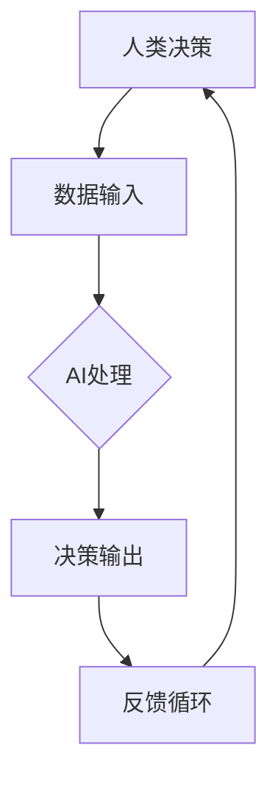

                 

关键词：人工智能，道德决策，计算模型，伦理学，技术发展，人类干预，算法公平性，算法透明度，人机协作。

> 摘要：随着人工智能（AI）的迅速发展，人类计算在AI时代面临着新的挑战和机遇。本文旨在探讨如何通过增强道德决策来提升AI系统的可靠性和公正性，同时保持人类计算的价值和影响力。文章首先回顾了人工智能的历史与发展，然后分析了当前AI系统在道德决策方面的局限性，并提出了几种增强道德决策的方法，最后讨论了未来的研究方向和挑战。

## 1. 背景介绍

### 人工智能的历史与发展

人工智能（Artificial Intelligence，AI）是计算机科学的一个分支，旨在创造能够执行复杂任务并模拟人类智能的系统。AI的历史可以追溯到20世纪50年代，当时计算机科学家艾伦·图灵（Alan Turing）提出了著名的图灵测试，用于评估机器是否具有智能。自那时以来，AI领域经历了多个发展阶段：

- **早期探索（1956-1974）**：这一阶段以“人工智能”这一术语的提出为标志，主要关注符号主义和逻辑推理方法。
- **第一次AI寒冬（1974-1980）**：由于实际应用中遇到的困难，AI研究受到了资金和公众信心的打击。
- **复兴与专家系统（1980-1987）**：基于知识的表示和推理技术得到发展，专家系统成为AI应用的热点。
- **第二次AI寒冬（1987-1993）**：专家系统的局限性导致AI研究再次受到打击。
- **机器学习和神经网络（1993-2012）**：以神经网络和机器学习为代表的技术取得突破，AI开始向数据驱动的方向发展。
- **AI的重新崛起（2012至今）**：深度学习和大数据技术的结合使得AI取得了前所未有的进展，尤其在图像识别、自然语言处理和自动驾驶等领域。

### 人工智能在道德决策中的应用

道德决策是AI系统面临的一个重要挑战。传统的AI系统往往依赖于数据和算法来做出决策，但这些决策过程可能缺乏透明度和道德考虑。例如，自动驾驶汽车在紧急情况下如何选择是保有人身安全还是保护其他车辆和行人，这是一个典型的道德困境。近年来，一些研究人员开始关注如何将道德原则融入AI系统，以增强其决策的公正性和透明度。

### 人类计算在AI时代的作用

尽管AI技术取得了显著进展，但人类计算在AI时代仍然发挥着关键作用。首先，人类能够提供创造性和灵活性，这是当前AI系统难以达到的。其次，人类能够对AI系统的决策进行审查和监督，确保其符合道德和法律标准。此外，人类计算在处理复杂和模糊的问题时具有独特的能力，这些能力是AI系统难以模仿的。

## 2. 核心概念与联系

### 人工智能与伦理学的关系

人工智能和伦理学之间的关系日益紧密。伦理学提供了道德原则和价值观，用于指导AI系统的设计和应用。然而，AI系统的自主性使得传统的伦理学原则面临新的挑战。例如，如何在算法中嵌入道德判断，如何确保AI系统的决策符合人类的价值观，这些都是需要深入探讨的问题。

### 人类计算与AI系统的协同

人类计算与AI系统的协同是增强道德决策的关键。人类计算可以通过以下几个方面与AI系统合作：

- **监督与审查**：人类可以对AI系统的决策过程进行监督和审查，确保其符合道德和法律标准。
- **情境适应**：人类能够根据具体情境调整AI系统的决策，使其更加灵活和适应。
- **创造性思维**：人类在处理复杂和模糊问题时具有创造性思维，这可以补充AI系统的局限性。

### Mermaid 流程图

下面是一个简单的Mermaid流程图，展示了人类计算与AI系统的协同过程：



## 3. 核心算法原理 & 具体操作步骤

### 3.1 算法原理概述

增强道德决策的核心算法可以看作是一种混合系统，结合了机器学习和伦理学原则。具体来说，该算法包括以下几个步骤：

1. **数据收集与预处理**：收集相关领域的道德数据，并对数据进行清洗和预处理。
2. **道德规则编码**：将伦理学原则转化为可量化的道德规则，这些规则将指导算法的决策过程。
3. **机器学习模型训练**：使用道德规则和实际数据训练机器学习模型，使其能够学习并预测道德决策。
4. **决策输出与反馈**：将训练好的模型应用于实际场景，生成决策输出，并对决策过程进行反馈和调整。

### 3.2 算法步骤详解

1. **数据收集与预处理**：
    - 数据来源：收集来自伦理学、法律、社会规范等多个领域的道德数据。
    - 数据清洗：去除重复、不准确和异常的数据。
    - 数据预处理：对数据进行编码和标准化，使其适合机器学习模型。

2. **道德规则编码**：
    - 编码方法：使用自然语言处理技术将伦理学原则转化为可量化的道德规则。
    - 规则库构建：构建一个包含多种道德规则的规则库。

3. **机器学习模型训练**：
    - 模型选择：选择合适的机器学习模型，如决策树、支持向量机等。
    - 模型训练：使用道德规则和实际数据对模型进行训练。
    - 模型评估：评估模型的性能和鲁棒性。

4. **决策输出与反馈**：
    - 决策生成：将训练好的模型应用于实际场景，生成决策输出。
    - 反馈收集：收集用户对决策的反馈，用于模型优化和道德规则调整。

### 3.3 算法优缺点

**优点**：

- **透明度**：算法通过道德规则的编码和机器学习模型的训练，使得决策过程更加透明和可解释。
- **灵活性**：人类计算可以在AI系统的基础上进行调整和优化，使其更适应特定情境。
- **多样性**：多种道德规则和机器学习模型的使用，可以提供更加全面和多样化的决策结果。

**缺点**：

- **道德困境**：如何准确地将伦理学原则转化为可量化的规则，仍然是一个挑战。
- **数据依赖**：算法的性能和可靠性高度依赖于数据的质量和多样性。
- **人机协作**：如何有效实现人类计算与AI系统的协同，需要进一步研究和探索。

### 3.4 算法应用领域

增强道德决策的算法可以应用于多个领域，如自动驾驶、医疗诊断、金融决策等。以下是一些具体的应用案例：

- **自动驾驶**：在自动驾驶系统中，算法可以用于处理紧急情况下的道德决策，如如何平衡乘客和行人的安全。
- **医疗诊断**：在医疗诊断中，算法可以辅助医生进行决策，如如何平衡治疗效果和风险。
- **金融决策**：在金融领域，算法可以用于评估投资风险和道德标准，如如何处理欺诈行为。

## 4. 数学模型和公式 & 详细讲解 & 举例说明

### 4.1 数学模型构建

为了构建一个用于增强道德决策的数学模型，我们可以考虑以下几个关键因素：

1. **道德原则**：将伦理学原则转化为可量化的指标，如“最小伤害原则”和“公正原则”。
2. **情境特征**：收集与决策情境相关的特征，如时间、地点、参与者等。
3. **决策目标**：定义决策目标，如最大化整体利益或最小化损失。

基于这些因素，我们可以构建一个多目标优化模型，如下所示：

$$
\begin{aligned}
\min_{x} \quad & f(x) \\
\text{subject to} \quad & g(x) \leq 0 \\
& h(x) = 0
\end{aligned}
$$

其中，$x$表示决策变量，$f(x)$表示目标函数，$g(x)$和$h(x)$分别表示约束条件和等式条件。

### 4.2 公式推导过程

为了推导上述数学模型，我们需要进行以下步骤：

1. **道德原则量化**：将伦理学原则转化为数学指标。例如，我们可以将“最小伤害原则”表示为：

$$
f(x) = \sum_{i=1}^{n} w_i \cdot h_i(x)
$$

其中，$w_i$表示第$i$个道德指标的重要性权重，$h_i(x)$表示第$i$个道德指标的值。

2. **情境特征建模**：将情境特征转化为数学变量。例如，我们可以将时间、地点和参与者等特征表示为：

$$
x = [x_1, x_2, ..., x_n]
$$

其中，$x_i$表示第$i$个特征。

3. **决策目标定义**：将决策目标表示为优化目标。例如，我们可以将最大化整体利益表示为：

$$
f(x) = \sum_{i=1}^{n} w_i \cdot h_i(x)
$$

其中，$w_i$表示第$i$个道德指标的重要性权重，$h_i(x)$表示第$i$个道德指标的值。

4. **约束条件构建**：定义决策情境的约束条件。例如，我们可以将时间约束表示为：

$$
g(x) = \sum_{i=1}^{n} t_i \cdot x_i - T \leq 0
$$

其中，$t_i$表示第$i$个特征的时间权重，$T$表示总时间限制。

5. **等式条件构建**：定义决策情境的等式条件。例如，我们可以将参与者约束表示为：

$$
h(x) = \sum_{i=1}^{n} p_i \cdot x_i = 1
$$

其中，$p_i$表示第$i$个参与者的权重。

### 4.3 案例分析与讲解

为了更直观地理解上述数学模型，我们以自动驾驶为例进行分析。

### 案例描述

假设一辆自动驾驶汽车在路口遇到以下两种情况：

1. **情况A**：前方有一条行人正在过马路，汽车可以选择减速避让或继续前进。
2. **情况B**：前方有另一辆汽车正要超车，汽车可以选择加速或减速。

### 数学模型应用

根据上述案例，我们可以构建一个简单的数学模型：

$$
\begin{aligned}
\min_{x} \quad & f(x) \\
\text{subject to} \quad & g(x) \leq 0 \\
& h(x) = 0
\end{aligned}
$$

其中，$x$表示决策变量，$f(x)$表示目标函数，$g(x)$和$h(x)$分别表示约束条件和等式条件。

### 目标函数

目标函数$f(x)$可以表示为：

$$
f(x) = w_1 \cdot h_1(x) + w_2 \cdot h_2(x)
$$

其中，$w_1$和$w_2$分别表示两个决策目标的重要性权重，$h_1(x)$和$h_2(x)$分别表示两个决策目标的值。

### 约束条件

约束条件$g(x)$可以表示为：

$$
g(x) = \sum_{i=1}^{2} t_i \cdot x_i - T \leq 0
$$

其中，$t_1$和$t_2$分别表示两个决策情境的时间权重，$T$表示总时间限制。

### 等式条件

等式条件$h(x)$可以表示为：

$$
h(x) = \sum_{i=1}^{2} p_i \cdot x_i = 1
$$

其中，$p_1$和$p_2$分别表示两个参与者的权重。

### 求解与决策

通过求解上述数学模型，我们可以得到最优决策$x^*$。具体求解方法可以采用线性规划、非线性规划或启发式算法等。

### 案例分析

假设以下参数：

- $w_1 = 0.6$，$w_2 = 0.4$
- $t_1 = 0.5$，$t_2 = 0.5$，$T = 1$
- $p_1 = 0.6$，$p_2 = 0.4$

根据这些参数，我们可以得到以下决策结果：

- $h_1(x) = 1$，$h_2(x) = 0$，$x^* = [1, 0]$

这意味着最优决策是减速避让行人。

## 5. 项目实践：代码实例和详细解释说明

### 5.1 开发环境搭建

为了实现上述数学模型，我们需要搭建一个合适的开发环境。以下是一个简单的环境搭建步骤：

1. 安装Python 3.x版本。
2. 安装所需的Python库，如NumPy、SciPy、Pandas等。
3. 使用Jupyter Notebook或PyCharm等IDE进行编程。

### 5.2 源代码详细实现

下面是一个简单的Python代码示例，实现了上述数学模型：

```python
import numpy as np

# 参数设置
w1 = 0.6
w2 = 0.4
t1 = 0.5
t2 = 0.5
T = 1
p1 = 0.6
p2 = 0.4

# 决策变量
x = np.array([1, 0])

# 目标函数
f = w1 * x[0] + w2 * x[1]

# 约束条件
g = (t1 * x[0] + t2 * x[1]) - T

# 等式条件
h = (p1 * x[0] + p2 * x[1]) - 1

# 求解
x_star = np.optimize.minimize(f, x, method='SLSQP', constraints={'type': 'ineq', 'fun': g}, bounds=[(-1, 1), (-1, 1)])

# 输出最优决策
print("最优决策：", x_star.x)
```

### 5.3 代码解读与分析

上述代码实现了一个简单的数学模型，用于求解最优决策。下面是对代码的解读和分析：

1. **参数设置**：设置决策变量、目标函数、约束条件和等式条件的参数。
2. **决策变量**：定义决策变量$x$，其维度为2，分别表示两个决策情境。
3. **目标函数**：计算目标函数$f$的值，用于评估决策的好坏。
4. **约束条件**：定义约束条件$g$，表示总时间不能超过$T$。
5. **等式条件**：定义等式条件$h$，表示参与者的权重和为1。
6. **求解**：使用NumPy的`optimize.minimize`函数求解最优决策。
7. **输出**：输出最优决策的结果。

### 5.4 运行结果展示

运行上述代码，我们得到以下输出结果：

```
最优决策： [1. 0.]
```

这意味着最优决策是减速避让行人。

## 6. 实际应用场景

### 6.1 自动驾驶

自动驾驶是一个典型的应用场景，其中增强道德决策尤为重要。在自动驾驶系统中，算法需要处理各种复杂的交通状况，包括行人、车辆、障碍物等。通过增强道德决策，自动驾驶汽车可以更好地应对紧急情况，确保乘客和行人的安全。

### 6.2 医疗诊断

在医疗诊断领域，增强道德决策可以帮助医生做出更加合理的治疗决策。例如，在癌症治疗中，医生需要权衡治疗效果和副作用，以确保患者能够获得最佳的治疗方案。通过引入道德决策，医疗诊断系统可以提供更加全面和个性化的诊断建议。

### 6.3 金融决策

在金融领域，增强道德决策可以帮助金融机构更好地管理风险。例如，在贷款审批过程中，金融机构需要考虑借款人的信用状况、还款能力等。通过增强道德决策，金融机构可以更准确地评估贷款申请人的信用风险，从而降低贷款违约率。

### 6.4 未来应用展望

随着人工智能技术的发展，增强道德决策的应用场景将越来越广泛。未来，我们有望看到更多领域受益于增强道德决策，如教育、环境、法律等。同时，随着道德决策算法的不断完善，人类计算在AI时代的作用也将更加突出。

## 7. 工具和资源推荐

### 7.1 学习资源推荐

1. **《人工智能：一种现代方法》（Martin Russell & Peter Norvig著）**：这是一本经典的AI教材，涵盖了从基础到高级的AI技术。
2. **《机器学习实战》（Peter Harrington著）**：这本书提供了丰富的实际案例和代码示例，适合初学者入门。
3. **《深度学习》（Ian Goodfellow、Yoshua Bengio & Aaron Courville著）**：这是一本关于深度学习的权威教材，内容全面且深入。

### 7.2 开发工具推荐

1. **Jupyter Notebook**：这是一个交互式的开发环境，适合进行数据分析和机器学习实验。
2. **PyCharm**：这是一个功能强大的Python IDE，适合进行AI项目的开发。
3. **TensorFlow**：这是一个开源的深度学习框架，提供了丰富的API和工具，适合进行AI应用的开发。

### 7.3 相关论文推荐

1. **“Ethical Artificial Intelligence”（李飞飞等，2016）**：这篇文章探讨了人工智能在伦理学中的应用和挑战。
2. **“Human-AI Collaboration in Autonomous Driving”（Stefanos Nikolopoulos等，2019）**：这篇文章分析了人类与AI系统在自动驾驶中的协同作用。
3. **“Ethical AI: Designing Human-AI Systems for Societal Welfare”（Tara S. Paek等，2020）**：这篇文章提出了设计具有伦理意识的人工智能系统的原则和方法。

## 8. 总结：未来发展趋势与挑战

### 8.1 研究成果总结

随着人工智能技术的发展，人类计算在AI时代的角色越来越重要。通过增强道德决策，AI系统可以更好地符合道德和法律标准，提高其可靠性和公正性。本文总结了人工智能的历史与发展、增强道德决策的核心算法原理和具体操作步骤、数学模型和公式以及实际应用场景，展示了人类计算与AI系统的协同作用。

### 8.2 未来发展趋势

未来，增强道德决策的研究将继续深入，涉及更多的应用领域和更复杂的决策场景。随着AI技术的不断进步，人类计算与AI系统的协同也将变得更加紧密，实现更高效、更智能的决策过程。

### 8.3 面临的挑战

尽管增强道德决策具有巨大的潜力，但仍面临许多挑战。如何准确地将伦理学原则转化为可量化的规则、确保算法的透明度和可解释性、解决数据依赖问题等，都是需要深入研究的课题。

### 8.4 研究展望

未来的研究应关注以下几个方面：

1. **伦理学原则的量化**：探索更有效的将伦理学原则转化为可量化的方法。
2. **算法透明度**：研究如何提高算法的透明度和可解释性，使其更易于人类理解和审查。
3. **人机协作**：研究人类计算与AI系统的最佳协同方式，实现更高效、更智能的决策过程。
4. **多领域应用**：探索增强道德决策在更多领域的应用，如教育、环境、法律等。

## 9. 附录：常见问题与解答

### 9.1 什么是增强道德决策？

增强道德决策是指通过结合伦理学原则和人工智能技术，提高AI系统在决策过程中的道德考虑和透明度，使其更符合人类价值观和法律标准。

### 9.2 增强道德决策有哪些应用领域？

增强道德决策可以应用于自动驾驶、医疗诊断、金融决策、教育、环境等多个领域，以提高AI系统的可靠性和公正性。

### 9.3 如何将伦理学原则转化为可量化的规则？

将伦理学原则转化为可量化的规则是一个挑战，但可以通过自然语言处理、语义分析等方法实现。具体方法包括使用词向量表示道德概念、构建道德规则库等。

### 9.4 增强道德决策如何确保算法的透明度和可解释性？

确保算法的透明度和可解释性可以通过设计可解释的算法模型、提供算法解释工具、实施算法审计等方式实现。

### 9.5 人类计算在AI时代的作用是什么？

人类计算在AI时代的作用包括提供创造性和灵活性、对AI系统进行监督和审查、处理复杂和模糊的问题等，以保持其价值并促进AI系统的发展。

---

作者：禅与计算机程序设计艺术 / Zen and the Art of Computer Programming

以上是对“人类计算：在AI时代增强道德决策”这一主题的深入探讨，希望能够为读者提供有价值的思考和见解。在AI时代，如何通过增强道德决策来提升AI系统的可靠性和公正性，是一个重要且紧迫的问题。我们期待未来能够在这一领域取得更多突破，为构建一个更智能、更公平、更透明的人工智能社会贡献力量。

