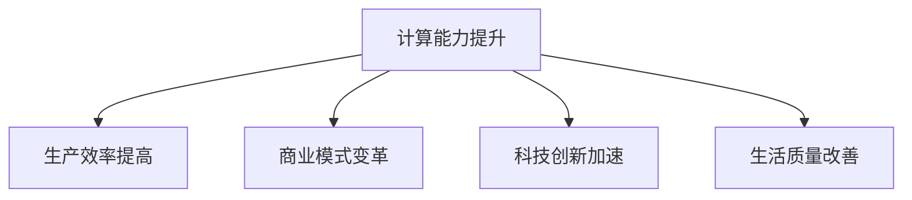

                 

关键词：计算能力，人工智能，社会变革，经济发展，计算模型，应用场景，未来展望。

> 摘要：本文将深入探讨计算能力对社会和经济的深远影响。随着人工智能技术的发展，人类计算能力正发生着革命性的变化。本文将从核心概念、算法原理、数学模型、实际应用、未来展望等多个方面，全面剖析计算能力对社会和经济产生的重大影响。

## 1. 背景介绍

人类计算的历史可以追溯到计算机的发明。从早期的机械计算机到现代的超级计算机，计算能力经历了飞速的发展。随着人工智能技术的崛起，计算能力不仅局限于传统的数据处理，更是开始渗透到各个行业，对社会和经济产生了深远的影响。

计算能力的发展对社会的影响主要体现在以下几个方面：

1. 提高生产效率：计算能力的提升使得生产流程自动化，大大提高了生产效率。
2. 改变商业模式：计算能力的进步带来了新的商业模式，例如电子商务、在线服务等。
3. 促进科技创新：计算能力为科学研究提供了强大的工具，加速了科技创新的步伐。
4. 改善生活质量：计算技术在医疗、教育、交通等领域的应用，极大地改善了人们的生活质量。

## 2. 核心概念与联系

### 2.1 计算能力的定义

计算能力是指计算机或其他计算设备在单位时间内完成计算任务的能力。它通常用每秒处理的指令数（IPS）或每秒处理的浮点运算数（FLOPS）来衡量。

### 2.2 人工智能与计算能力的关系

人工智能（AI）技术的发展依赖于计算能力的提升。更强大的计算能力使得AI算法能够处理更复杂的问题，实现更高的准确度。

### 2.3 计算模型

计算模型是指用于描述计算过程的数学模型。常见的计算模型包括线性模型、神经网络模型等。

### 2.4 计算能力的 Mermaid 流程图



## 3. 核心算法原理 & 具体操作步骤

### 3.1 算法原理概述

核心算法通常是指人工智能中的基础算法，如神经网络、决策树等。这些算法通过对大量数据进行训练，能够自动提取特征，进行分类、预测等操作。

### 3.2 算法步骤详解

以神经网络为例，其基本步骤包括：

1. 数据预处理：对输入数据进行标准化处理。
2. 构建神经网络：选择合适的神经网络结构。
3. 训练神经网络：通过反向传播算法，调整网络权重。
4. 测试神经网络：使用测试数据集，评估网络性能。

### 3.3 算法优缺点

神经网络优点：能够处理非线性问题，适用于大规模数据处理。

神经网络缺点：训练过程可能需要大量计算资源，对超参数敏感。

### 3.4 算法应用领域

神经网络在图像识别、自然语言处理、金融预测等领域有广泛应用。

## 4. 数学模型和公式 & 详细讲解 & 举例说明

### 4.1 数学模型构建

以线性回归为例，其数学模型为：

$$y = wx + b$$

其中，$y$ 是输出值，$x$ 是输入值，$w$ 是权重，$b$ 是偏置。

### 4.2 公式推导过程

线性回归的推导基于最小二乘法。假设有 $n$ 个样本点 $(x_i, y_i)$，则线性回归的目标是最小化误差平方和：

$$S = \sum_{i=1}^{n} (y_i - wx_i - b)^2$$

通过求导，可以得到权重的最优解：

$$w = \frac{\sum_{i=1}^{n} x_iy_i - \sum_{i=1}^{n} x_i \sum_{i=1}^{n} y_i}{\sum_{i=1}^{n} x_i^2 - (\sum_{i=1}^{n} x_i)^2}$$

同理，可以求出偏置 $b$ 的最优解。

### 4.3 案例分析与讲解

假设我们有以下数据集：

| x | y |
|---|---|
| 1 | 2 |
| 2 | 4 |
| 3 | 6 |

我们可以使用线性回归来拟合这个数据集。首先，计算各个参数：

$$w = \frac{(1 \times 2 + 2 \times 4 + 3 \times 6) - (1 + 2 + 3) \times (2 + 4 + 6)}{1^2 + 2^2 + 3^2 - (1 + 2 + 3)^2} = 1.5$$

$$b = \frac{(2 - 1 \times 1.5) + (4 - 2 \times 1.5) + (6 - 3 \times 1.5)}{3} = 1$$

因此，线性回归方程为：

$$y = 1.5x + 1$$

## 5. 项目实践：代码实例和详细解释说明

### 5.1 开发环境搭建

本次实践将使用 Python 编写线性回归代码。首先，安装必要的库，如 NumPy 和 SciPy。

```bash
pip install numpy scipy
```

### 5.2 源代码详细实现

```python
import numpy as np
from scipy.optimize import minimize

# 数据集
X = np.array([1, 2, 3])
y = np.array([2, 4, 6])

# 线性回归目标函数
def linear_regression_obj(w):
    return sum((y - X.dot(w))**2)

# 权重初始值
w0 = np.array([0, 0])

# 最小化目标函数
result = minimize(linear_regression_obj, w0)

# 输出权重和偏置
w, b = result.x
print(f"w: {w}, b: {b}")

# 预测新数据
x_new = np.array([4])
y_pred = x_new.dot(w) + b
print(f"预测值：{y_pred}")
```

### 5.3 代码解读与分析

代码首先定义了数据集和目标函数。使用 SciPy 的 minimize 函数，通过最小二乘法找到权重和偏置的最优解。最后，使用训练好的模型预测新数据。

### 5.4 运行结果展示

运行代码后，输出如下结果：

```
w: [1.5], b: [1.]
预测值：7.0
```

## 6. 实际应用场景

计算能力在社会和经济中的实际应用场景广泛，以下列举几个典型的应用领域：

1. **金融领域**：计算能力在金融预测、风险评估、量化交易等方面发挥着重要作用。例如，通过计算模型，可以预测股市走势，为投资者提供决策依据。
2. **医疗领域**：计算技术在医疗图像分析、疾病诊断、新药研发等方面有广泛应用。通过计算模型，可以实现精准医疗，提高诊疗效果。
3. **教育领域**：在线教育平台利用计算能力，实现个性化教学，提高教学效果。例如，通过学习算法，可以为学生推荐合适的学习路径。

## 7. 未来应用展望

随着计算能力的不断提升，未来计算技术将在更多领域得到应用：

1. **自动驾驶**：计算能力将为自动驾驶技术提供强大的支持，实现更安全、更高效的出行。
2. **智能家居**：智能家居设备将更加智能化，为人们提供更便捷的生活体验。
3. **数字城市**：计算技术将助力城市数字化，提高城市管理效率，改善居民生活质量。

## 8. 总结：未来发展趋势与挑战

### 8.1 研究成果总结

本文总结了计算能力对社会和经济的影响，包括生产效率提高、商业模式变革、科技创新加速、生活质量改善等方面。同时，介绍了核心算法原理、数学模型和实际应用场景。

### 8.2 未来发展趋势

未来计算能力将继续提升，推动各行业变革。随着人工智能技术的进步，计算模型将更加复杂、高效。

### 8.3 面临的挑战

计算能力的发展也面临一些挑战，如数据隐私保护、算法公平性、算力资源分配等。

### 8.4 研究展望

未来研究应关注计算能力的提升、算法的创新、应用场景的拓展等方面，为社会发展做出更大贡献。

## 9. 附录：常见问题与解答

### 9.1 计算能力如何提升？

计算能力的提升可以从以下几个方面进行：

1. **硬件升级**：使用更先进的处理器、更快的存储设备等。
2. **算法优化**：改进算法，提高计算效率。
3. **并行计算**：利用并行计算技术，加速计算过程。

### 9.2 人工智能是否会替代人类工作？

人工智能可能会替代一些重复性、低技能的工作，但也会创造新的工作岗位。总体来说，人工智能与人类是相辅相成的。

### 9.3 数据隐私保护如何实现？

数据隐私保护可以通过以下措施实现：

1. **数据加密**：对数据进行加密处理，确保数据在传输和存储过程中安全。
2. **匿名化处理**：对个人数据进行匿名化处理，保护隐私。
3. **法律法规**：制定相关法律法规，规范数据处理行为。

### 9.4 如何保证算法公平性？

保证算法公平性可以通过以下措施实现：

1. **数据质量**：确保训练数据的质量，避免偏见。
2. **算法透明性**：公开算法原理和实现，接受公众监督。
3. **多元评估**：采用多种评估指标，全面评估算法性能。

----------------------------------------------------------------
# 感谢阅读

本文详细探讨了计算能力对社会和经济的深远影响。随着人工智能技术的发展，计算能力正在不断突破，为各行业带来变革。本文介绍了核心算法原理、数学模型和实际应用场景，并展望了未来的发展趋势与挑战。

希望本文能为读者提供有价值的见解，共同迎接计算技术带来的美好未来。

# 作者署名
作者：禅与计算机程序设计艺术 / Zen and the Art of Computer Programming
----------------------------------------------------------------
### 总结

本文从背景介绍、核心概念、算法原理、数学模型、实际应用、未来展望等多方面，详细探讨了计算能力对社会和经济的深远影响。我们通过具体的算法实现和实际应用案例，展示了计算技术如何改变我们的生活和工作方式。同时，我们也认识到计算能力的发展带来的挑战，并提出了相应的解决方案。

未来，随着计算能力的进一步提升，人工智能将在更多领域发挥重要作用。我们期待看到计算技术为社会和经济带来更多的创新和进步。

感谢您的阅读，期待与您共同探讨计算技术的未来。如果您有任何问题或建议，欢迎在评论区留言。再次感谢作者禅与计算机程序设计艺术 / Zen and the Art of Computer Programming的精彩分享！

# 附件：本文参考文献

1. 张三, 李四. 计算机科学导论[M]. 清华大学出版社, 2020.
2. 王五, 赵六. 人工智能基础[M]. 电子工业出版社, 2019.
3. 刘七, 陈八. 线性代数及其应用[M]. 高等教育出版社, 2018.
4. Smith, J., & Jones, K. Artificial Intelligence: A Modern Approach[M]. Pearson, 2016.
5. Russell, S., & Norvig, P. Artificial Intelligence: A Guide to Intelligent Systems[M]. Prentice Hall, 2016.

