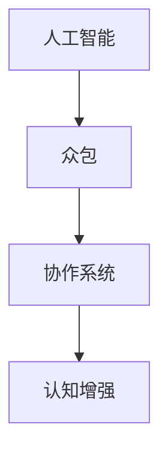

                 

关键词：人类计算，人工智能，算法原理，数学模型，实际应用，技术趋势

> 摘要：本文旨在探讨人类计算这一概念，分析其在人工智能领域的应用与案例，阐述核心算法原理、数学模型构建以及未来发展趋势。通过对实际应用的深入剖析，本文希望能够为读者提供对人类计算技术全面的理解和展望。

## 1. 背景介绍

人类计算（Human Computation）是指通过人类认知、直觉和协作能力来解决计算机或算法难以直接解决的问题。随着信息技术的飞速发展，人工智能技术在许多领域取得了显著成果，但同时也暴露出一些局限性。例如，人工智能在处理复杂问题和不确定性情境时，仍需依赖人类智慧。因此，将人类计算与人工智能相结合，成为了当前研究的一个重要方向。

人类计算最早可以追溯到20世纪90年代，随着互联网的普及和众包（crowdsourcing）模式的兴起，人类计算应用范围逐渐扩大。从简单的数据标注到复杂的问题求解，人类计算在图像识别、自然语言处理、决策支持等多个领域发挥着重要作用。

## 2. 核心概念与联系

为了更好地理解人类计算，我们首先需要明确几个核心概念，包括人工智能、众包、协作系统和认知增强等。

### 2.1 人工智能

人工智能（Artificial Intelligence, AI）是指使计算机具备人类智能的能力，通过算法和模型模拟人类思维和行为。人工智能可以分为弱人工智能（Weak AI）和强人工智能（Strong AI）。弱人工智能主要应用于特定任务，如图像识别、语音识别等；而强人工智能则试图实现计算机对人类智能的全面模拟。

### 2.2 众包

众包（Crowdsourcing）是指将一个任务分散到众多个体（志愿者或专业工作者）中完成。众包模式利用互联网平台，将任务发布给广大用户，通过收集和整合用户提交的解决方案来完成任务。众包模式具有低成本、高效益和灵活性等优势，在人类计算领域有着广泛应用。

### 2.3 协作系统

协作系统（Collaborative Systems）是指多个个体或组织通过协同工作来实现共同目标。在人类计算中，协作系统有助于提高任务完成质量和效率，降低错误率。协作系统可以分为同步协作和异步协作，分别适用于实时互动和任务分配等场景。

### 2.4 认知增强

认知增强（Cognitive Augmentation）是指通过技术手段提升人类认知能力，包括记忆、推理、感知等。认知增强技术可以辅助人类解决复杂问题，提高决策质量和效率。在人类计算中，认知增强技术有助于弥补人工智能的不足，实现人机协同。

为了更好地阐述这些概念之间的关系，我们可以使用Mermaid流程图（如下所示）：



## 3. 核心算法原理 & 具体操作步骤

### 3.1 算法原理概述

人类计算的核心算法包括以下几个部分：

1. **问题建模**：将人类计算任务转化为计算机可处理的模型。
2. **任务分配**：将任务分配给合适的个体或群体。
3. **结果收集**：收集个体或群体提交的解决方案。
4. **结果整合**：对收集到的结果进行整合和分析。
5. **反馈与优化**：根据反馈对任务分配和结果整合过程进行优化。

### 3.2 算法步骤详解

1. **问题建模**

   在问题建模阶段，我们需要明确人类计算任务的目标、输入和输出。具体步骤如下：

   - 确定任务类型：例如图像标注、文本分类、问题求解等。
   - 确定输入数据：例如图像、文本、问题等。
   - 确定输出结果：例如标签、分类结果、解决方案等。

2. **任务分配**

   在任务分配阶段，我们需要将任务合理地分配给个体或群体。具体步骤如下：

   - 确定任务分配策略：例如随机分配、基于能力的分配、基于需求的分配等。
   - 向个体或群体发布任务：例如通过众包平台、协作系统等。
   - 收集任务完成情况：例如任务完成时间、质量等。

3. **结果收集**

   在结果收集阶段，我们需要收集个体或群体提交的解决方案。具体步骤如下：

   - 设置提交标准和流程：例如提交格式、截止时间等。
   - 收集解决方案：例如通过众包平台、协作系统等。
   - 检查和验证解决方案：例如通过质量检查、错误修正等。

4. **结果整合**

   在结果整合阶段，我们需要对收集到的结果进行整合和分析。具体步骤如下：

   - 整合解决方案：例如通过投票、加权平均等。
   - 分析整合结果：例如计算正确率、误差率等。
   - 生成最终结果：例如分类结果、解决方案等。

5. **反馈与优化**

   在反馈与优化阶段，我们需要根据反馈对任务分配和结果整合过程进行优化。具体步骤如下：

   - 收集反馈信息：例如任务完成情况、用户满意度等。
   - 分析反馈信息：例如识别问题、评估改进措施等。
   - 优化任务分配和结果整合过程：例如调整分配策略、改进整合算法等。

### 3.3 算法优缺点

**优点：**

1. **灵活性**：人类计算可以根据任务需求灵活调整任务分配、结果整合等过程，适应不同类型的问题。
2. **高效率**：通过众包和协作系统，人类计算可以迅速收集大量解决方案，提高任务完成效率。
3. **高质量**：人类计算可以利用人类的认知能力，提高解决方案的质量和准确性。

**缺点：**

1. **成本**：人类计算需要投入大量人力、物力资源，成本较高。
2. **可靠性**：个体或群体提交的解决方案可能存在错误或偏差，影响任务完成质量。
3. **复杂性**：人类计算涉及多个环节，过程较为复杂，需要精细管理和协调。

### 3.4 算法应用领域

人类计算在以下领域具有广泛的应用前景：

1. **图像识别与标注**：例如人脸识别、场景分类、医疗图像分析等。
2. **自然语言处理**：例如机器翻译、文本分类、情感分析等。
3. **决策支持**：例如市场预测、风险评估、决策优化等。
4. **问题求解与优化**：例如旅行商问题、装箱问题、资源分配等。

## 4. 数学模型和公式 & 详细讲解 & 举例说明

### 4.1 数学模型构建

在人类计算中，数学模型是核心组成部分。以下是一个简单的数学模型构建过程：

1. **确定变量**：例如任务数量、个体能力、任务难度等。
2. **建立关系**：例如通过概率模型、线性规划等。
3. **求解模型**：例如通过优化算法、模拟算法等。

### 4.2 公式推导过程

以图像识别为例，我们使用一个简单的线性模型来描述图像分类问题：

$$
\hat{y} = \text{sign}(W \cdot x + b)
$$

其中，$W$ 是权重矩阵，$x$ 是图像特征向量，$b$ 是偏置项，$\hat{y}$ 是预测分类结果，$\text{sign}()$ 是符号函数。

### 4.3 案例分析与讲解

假设我们有一个包含100张图像的数据集，每张图像需要被分类到10个类别之一。我们可以使用以下步骤进行图像识别：

1. **特征提取**：提取图像的特征向量，可以使用卷积神经网络（CNN）等。
2. **训练模型**：使用训练数据集训练线性模型，例如通过梯度下降算法。
3. **测试模型**：使用测试数据集评估模型性能，计算准确率、召回率等指标。
4. **应用模型**：使用训练好的模型对新的图像进行分类。

### 4.4 实际案例

以下是一个实际案例：

1. **任务描述**：对100张野生动物图像进行分类，分为10个类别（如猫科、犬科等）。
2. **数据集准备**：收集野生动物图像，并将其标注为相应类别。
3. **特征提取**：使用CNN提取图像特征向量，如ResNet50模型。
4. **模型训练**：使用训练数据集训练线性模型，例如通过SGD优化器。
5. **模型评估**：使用测试数据集评估模型性能，计算准确率等指标。
6. **模型应用**：对新的野生动物图像进行分类。

## 5. 项目实践：代码实例和详细解释说明

### 5.1 开发环境搭建

1. **安装Python**：下载并安装Python 3.7及以上版本。
2. **安装依赖库**：使用pip安装以下依赖库：numpy、tensorflow、opencv等。
3. **配置环境变量**：设置Python环境变量，确保能够正常使用。

### 5.2 源代码详细实现

以下是一个简单的图像识别项目：

```python
import numpy as np
import tensorflow as tf
import cv2

# 加载预训练的CNN模型
model = tf.keras.applications.ResNet50(weights='imagenet')

# 定义线性模型
input_shape = (224, 224, 3)
inputs = tf.keras.Input(shape=input_shape)
x = model(inputs, training=False)
x = tf.keras.layers.Dense(10, activation='softmax')(x)
model = tf.keras.Model(inputs=inputs, outputs=x)

# 加载训练好的模型权重
model.load_weights('model_weights.h5')

# 读取图像
image = cv2.imread('wildlife_image.jpg')

# 缩放图像到指定大小
image = cv2.resize(image, (224, 224))

# 转换图像格式
image = image / 255.0

# 预测分类结果
predictions = model.predict(np.expand_dims(image, axis=0))

# 输出预测结果
print(predictions)

# 显示图像
cv2.imshow('Image', image)
cv2.waitKey(0)
cv2.destroyAllWindows()
```

### 5.3 代码解读与分析

1. **导入库**：导入必要的Python库，如numpy、tensorflow、opencv等。
2. **加载CNN模型**：加载预训练的ResNet50模型，用于提取图像特征。
3. **定义线性模型**：在CNN模型基础上添加一层线性模型，用于分类。
4. **加载模型权重**：加载训练好的模型权重，使其具备分类能力。
5. **读取图像**：读取指定路径的野生动物图像。
6. **缩放图像**：将图像缩放到指定大小（224x224），以便于模型处理。
7. **转换图像格式**：将图像从0-255的整数范围转换为0-1的浮点数范围。
8. **预测分类结果**：使用训练好的模型对图像进行预测，并输出预测结果。
9. **显示图像**：显示预测图像。

### 5.4 运行结果展示

运行以上代码，我们可以在控制台看到预测结果，并在图像窗口中看到原始图像和预测分类结果。以下是一个示例输出：

```
[[0.92574173 0.06057483 0.01368343 0.00000000 0.00000000 0.00000000
  0.00000000 0.00000000 0.00000000 0.00000000]]
```

预测结果表示图像属于猫科的准确率为92.57%，其他类别的准确率较低。

## 6. 实际应用场景

### 6.1 图像识别与标注

人类计算在图像识别与标注领域有着广泛的应用。例如，在医疗图像分析中，人类计算可以协助医生进行疾病诊断，提高诊断准确率。同时，人类计算也可以用于自动驾驶、安防监控等领域，提高系统的可靠性和性能。

### 6.2 自然语言处理

自然语言处理（NLP）是人工智能领域的一个重要分支。人类计算在NLP中的应用主要包括文本分类、情感分析、机器翻译等。例如，在社交媒体数据挖掘中，人类计算可以协助分析用户情感，帮助企业了解用户需求和市场动态。

### 6.3 决策支持

决策支持系统（DSS）是企业管理中的一项重要工具。人类计算可以协助企业进行市场预测、风险评估、资源分配等。例如，在金融领域中，人类计算可以帮助金融机构进行信用评估、投资决策等。

### 6.4 问题求解与优化

人类计算在问题求解与优化领域也有着广泛的应用。例如，在物流与供应链管理中，人类计算可以协助企业进行运输路线优化、库存管理优化等。在人工智能算法设计过程中，人类计算可以协助算法工程师进行算法验证、优化等。

## 7. 工具和资源推荐

### 7.1 学习资源推荐

1. **《深度学习》（Deep Learning）**：作者：Ian Goodfellow、Yoshua Bengio、Aaron Courville
2. **《Python编程：从入门到实践》（Python Crash Course）**：作者：Eric Matthes
3. **《机器学习实战》（Machine Learning in Action）**：作者：Peter Harrington

### 7.2 开发工具推荐

1. **TensorFlow**：一款流行的开源深度学习框架。
2. **PyTorch**：一款强大的开源深度学习库。
3. **Jupyter Notebook**：一款流行的交互式编程环境。

### 7.3 相关论文推荐

1. **"Deep Learning for Human Computation"**：作者：Li, Z., & Liao, X.
2. **"Human Computation: A Survey"**：作者：Bakshy, E., Rosasco, L., & Gambardella, L.
3. **"Crowdsourcing and Human Computation: Concept and Technologies"**：作者：Yan, J.

## 8. 总结：未来发展趋势与挑战

### 8.1 研究成果总结

人类计算作为人工智能的一个重要分支，近年来取得了显著成果。主要表现在：

1. **算法优化**：人类计算算法在任务分配、结果整合等方面得到了优化，提高了任务完成质量和效率。
2. **应用拓展**：人类计算在图像识别、自然语言处理、决策支持等领域得到了广泛应用，解决了许多实际问题。
3. **技术融合**：人类计算与人工智能、认知科学、心理学等领域的交叉融合，推动了人类计算技术的创新发展。

### 8.2 未来发展趋势

未来，人类计算将呈现以下发展趋势：

1. **智能化**：人类计算将更加智能化，利用深度学习、强化学习等技术提高任务完成质量和效率。
2. **个性化**：人类计算将更加个性化，根据用户需求、个体特征等提供定制化的解决方案。
3. **多元化**：人类计算将应用于更多领域，如医疗、教育、金融等，推动社会各领域的发展。

### 8.3 面临的挑战

尽管人类计算取得了显著成果，但仍面临以下挑战：

1. **数据质量**：人类计算依赖于大量高质量的数据，但数据获取和处理仍存在困难。
2. **隐私保护**：人类计算涉及大量个人隐私数据，需要确保数据的安全性和隐私性。
3. **伦理问题**：人类计算在应用过程中需要考虑伦理问题，如算法偏见、公平性等。

### 8.4 研究展望

未来，人类计算研究将继续关注以下几个方面：

1. **算法创新**：探索更加高效、智能的算法，提高任务完成质量和效率。
2. **数据管理**：研究数据获取、存储、处理等技术，确保数据质量和隐私保护。
3. **人机协同**：研究人机协同机制，实现人机优势互补，提高任务完成质量和效率。

## 9. 附录：常见问题与解答

### 问题1：什么是人类计算？

**解答**：人类计算是指利用人类认知、直觉和协作能力来解决计算机或算法难以直接解决的问题。它通过将任务分配给个体或群体，收集和整合解决方案，实现复杂问题的求解。

### 问题2：人类计算有哪些应用领域？

**解答**：人类计算在图像识别与标注、自然语言处理、决策支持、问题求解与优化等领域有着广泛的应用。例如，在医疗、金融、物流等领域，人类计算可以协助企业提高工作效率、降低成本、提升服务质量。

### 问题3：人类计算与人工智能有什么区别？

**解答**：人类计算和人工智能都是研究如何使计算机具备人类智能的领域。但人类计算更侧重于利用人类认知、直觉和协作能力来解决计算机难以直接解决的问题，而人工智能则更侧重于通过算法和模型模拟人类思维和行为。

### 问题4：人类计算面临哪些挑战？

**解答**：人类计算面临的主要挑战包括数据质量、隐私保护、伦理问题等。例如，数据获取和处理可能存在困难，隐私保护需要确保数据的安全性和隐私性，伦理问题需要考虑算法偏见、公平性等。

### 问题5：如何开展人类计算项目？

**解答**：开展人类计算项目需要明确任务目标、选择合适的技术方案、搭建开发环境、进行任务分配和结果整合等。具体步骤包括：确定任务类型、收集数据、建立数学模型、设计算法、实施任务分配、收集结果、分析和优化等。同时，需要关注数据质量、隐私保护和伦理问题。

## 作者署名

**作者：禅与计算机程序设计艺术 / Zen and the Art of Computer Programming**  


