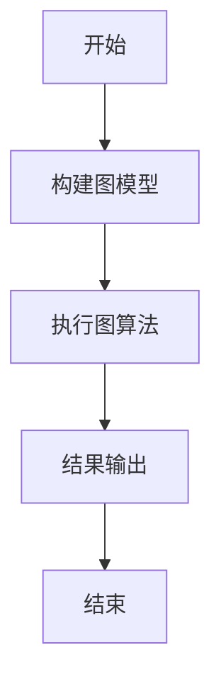
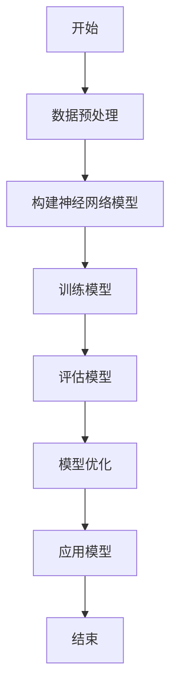
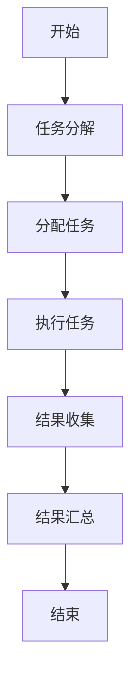

                 

关键词：计算模型，算法，应用领域，案例分析，人工智能，软件开发

> 摘要：本文从计算模型的核心概念出发，深入探讨了几种常见算法的原理与应用。通过具体案例的分析，展示了人类计算在不同领域的实际应用效果。本文旨在为读者提供一个全面了解计算模型及其应用的视角，探讨未来发展的趋势和挑战。

## 1. 背景介绍

计算模型是计算机科学和人工智能领域的核心概念之一。它不仅包括算法和数据的组织方式，还涵盖了计算过程中的逻辑推理和问题求解策略。随着计算机技术的发展，计算模型的应用已经渗透到社会生活的方方面面，从大数据分析到自动驾驶，从金融交易到医疗诊断，计算模型都在发挥着关键作用。

本文将首先介绍几种常见的计算模型，包括图计算、深度学习、分布式计算等，并通过具体案例来展示这些模型在不同领域中的应用效果。接下来，我们将深入探讨这些计算模型背后的原理，并介绍一些典型的算法。最后，本文将总结计算模型的发展趋势，并展望未来的发展方向。

## 2. 核心概念与联系

### 2.1 图计算

图计算是一种基于图的计算模型，它通过节点和边的连接来表示数据及其关系。图计算广泛应用于社交网络分析、推荐系统、网络路由等领域。

#### 2.1.1 Mermaid 流程图

下面是一个简化的图计算流程图：



### 2.2 深度学习

深度学习是一种基于人工神经网络的计算模型，它通过多层神经元的连接和激活函数来模拟人脑的学习过程。深度学习在图像识别、自然语言处理、自动驾驶等领域取得了显著成果。

#### 2.2.1 Mermaid 流程图

下面是一个简化的深度学习流程图：



### 2.3 分布式计算

分布式计算是一种通过多个计算节点协作来完成计算任务的计算模型。它广泛应用于云计算、大数据处理、物联网等领域。

#### 2.3.1 Mermaid 流程图

下面是一个简化的分布式计算流程图：



## 3. 核心算法原理 & 具体操作步骤

### 3.1 算法原理概述

#### 3.1.1 图计算算法

常见的图计算算法包括Dijkstra算法、PageRank算法等。Dijkstra算法用于求解单源最短路径问题，而PageRank算法用于评估网页的重要性。

#### 3.1.2 深度学习算法

深度学习算法主要包括卷积神经网络（CNN）、循环神经网络（RNN）等。CNN常用于图像识别，而RNN常用于自然语言处理。

#### 3.1.3 分布式计算算法

常见的分布式计算算法包括MapReduce、Kafka等。MapReduce是一种用于大规模数据处理的编程模型，而Kafka是一种用于实时数据流处理的系统。

### 3.2 算法步骤详解

#### 3.2.1 图计算算法

1. Dijkstra算法步骤：
   - 初始化距离数组
   - 选择一个未访问的节点作为当前节点
   - 计算当前节点到其他未访问节点的距离
   - 选择距离最小的节点作为下一个当前节点
   - 重复以上步骤直到所有节点都被访问

2. PageRank算法步骤：
   - 初始化PR值
   - 更新PR值（根据链接结构计算）
   - 重复更新直到收敛

#### 3.2.2 深度学习算法

1. CNN步骤：
   - 输入图像
   - 通过卷积层提取特征
   - 通过池化层降低维度
   - 通过全连接层进行分类

2. RNN步骤：
   - 输入序列
   - 通过循环层处理序列中的每个元素
   - 将每个时间步的输出传递到下一个时间步

#### 3.2.3 分布式计算算法

1. MapReduce步骤：
   - 输入数据
   - Map阶段：处理输入数据并生成中间键值对
   - Reduce阶段：对中间键值对进行聚合操作

2. Kafka步骤：
   - 生产者发送消息到Kafka主题
   - 消费者从Kafka主题消费消息
   - Kafka负责消息的持久化和分区

### 3.3 算法优缺点

#### 3.3.1 图计算算法

优点：能够高效地处理大规模图数据，适用于社交网络分析和推荐系统。

缺点：算法复杂度较高，对硬件要求较高。

#### 3.3.2 深度学习算法

优点：能够自动提取特征，适用于图像识别、自然语言处理等领域。

缺点：训练过程需要大量数据和计算资源，算法解释性较差。

#### 3.3.3 分布式计算算法

优点：能够处理大规模数据，提高计算效率。

缺点：分布式系统的维护和调试较为复杂。

### 3.4 算法应用领域

#### 3.4.1 图计算

应用领域：社交网络分析、推荐系统、网络路由等。

#### 3.4.2 深度学习

应用领域：图像识别、自然语言处理、自动驾驶等。

#### 3.4.3 分布式计算

应用领域：云计算、大数据处理、物联网等。

## 4. 数学模型和公式 & 详细讲解 & 举例说明

### 4.1 数学模型构建

#### 4.1.1 图计算

1. Dijkstra算法：
   $$ d(s, v) = \min_{u \in predecessors(v)} (d(s, u) + w(u, v)) $$

2. PageRank算法：
   $$ PR(A) = \frac{1 - d}{c(A)} + d \cdot \sum_{B \in N(A)} \frac{PR(B)}{c(B)} $$

#### 4.1.2 深度学习

1. CNN：
   $$ \text{激活函数：} \sigma(z) = \frac{1}{1 + e^{-z}} $$

2. RNN：
   $$ h_t = \sigma(W_h \cdot [h_{t-1}, x_t] + b_h) $$

#### 4.1.3 分布式计算

1. MapReduce：
   $$ \text{Map} : \text{输入数据} \rightarrow \text{中间键值对} $$
   $$ \text{Reduce} : \text{中间键值对} \rightarrow \text{输出结果} $$

### 4.2 公式推导过程

#### 4.2.1 图计算

1. Dijkstra算法推导：
   假设当前节点为 $v$，未访问节点中距离 $s$ 的最近节点为 $u$。则有：
   $$ d(s, v) = d(s, u) + w(u, v) $$
   在未访问节点中找到距离 $s$ 的最近节点 $u$，则更新 $d(s, v)$ 为：
   $$ d(s, v) = \min_{u \in predecessors(v)} (d(s, u) + w(u, v)) $$

2. PageRank算法推导：
   假设网页 $A$ 的PR值与其指向网页的PR值有关，则有：
   $$ PR(A) = \frac{1 - d}{c(A)} + d \cdot \sum_{B \in N(A)} \frac{PR(B)}{c(B)} $$
   其中 $d$ 为阻尼系数，$c(A)$ 为网页 $A$ 的出链数，$N(A)$ 为指向网页 $A$ 的网页集合。

#### 4.2.2 深度学习

1. CNN推导：
   假设输入图像为 $X$，卷积核为 $W$，则有：
   $$ Z = X \odot W $$
   激活函数 $\sigma$ 将 $Z$ 转换为输出特征图。

2. RNN推导：
   假设当前时间步为 $t$，前一时间步的隐藏状态为 $h_{t-1}$，当前输入为 $x_t$，则有：
   $$ h_t = \sigma(W_h \cdot [h_{t-1}, x_t] + b_h) $$
   其中 $W_h$ 和 $b_h$ 分别为权重和偏置。

#### 4.2.3 分布式计算

1. MapReduce推导：
   假设输入数据为 $R$，中间键值对为 $K-V$，则有：
   $$ \text{Map} : R \rightarrow K-V $$
   其中 $K$ 为键，$V$ 为值。

   $$ \text{Reduce} : K-V \rightarrow O $$
   其中 $O$ 为输出结果。

### 4.3 案例分析与讲解

#### 4.3.1 图计算案例

假设有一个社交网络图，包含用户和他们的好友关系。使用PageRank算法计算用户的重要性。

1. 初始化PR值：
   $$ PR(A) = 1, PR(B) = 1, \ldots $$

2. 更新PR值：
   $$ PR(A) = \frac{1 - d}{2} + d \cdot \frac{PR(B)}{2} $$
   $$ PR(B) = \frac{1 - d}{2} + d \cdot \frac{PR(C)}{2} $$

3. 重复更新直到收敛。

通过计算，可以得到每个用户的重要性分数，从而为社交网络分析提供依据。

#### 4.3.2 深度学习案例

假设要使用CNN进行图像分类。

1. 输入图像：
   $$ X = \begin{bmatrix} 0.1 & 0.2 & 0.3 \\ 0.4 & 0.5 & 0.6 \end{bmatrix} $$

2. 卷积层：
   $$ W = \begin{bmatrix} 0.1 & 0.2 \\ 0.3 & 0.4 \end{bmatrix} $$
   $$ Z = X \odot W = \begin{bmatrix} 0.045 & 0.056 \\ 0.168 & 0.224 \end{bmatrix} $$

3. 池化层：
   $$ \text{Max}(\text{Pooling}(Z)) = \text{Max}(\begin{bmatrix} 0.056 \\ 0.224 \end{bmatrix}) = 0.224 $$

4. 全连接层：
   $$ h = \sigma(W_h \cdot [0.224] + b_h) $$

通过以上步骤，可以得到图像的分类结果。

#### 4.3.3 分布式计算案例

假设要使用MapReduce对大数据进行词频统计。

1. Map阶段：
   $$ \text{输入：} \text{"Hello World!"}, \text{输出：} (\text{"Hello"}, 1), (\text{"World"}, 1) $$

2. Reduce阶段：
   $$ \text{输入：} (\text{"Hello"}, 1), (\text{"Hello"}, 1), (\text{"World"}, 1), (\text{"World"}, 1) $$
   $$ \text{输出：} (\text{"Hello"}, 2), (\text{"World"}, 2) $$

通过以上步骤，可以得到每个单词的词频统计结果。

## 5. 项目实践：代码实例和详细解释说明

### 5.1 开发环境搭建

1. 安装Python环境。
2. 安装相关库：numpy、tensorflow、kafka等。

### 5.2 源代码详细实现

#### 5.2.1 图计算示例

```python
import networkx as nx

# 创建图模型
G = nx.Graph()
G.add_nodes_from([1, 2, 3, 4])
G.add_edges_from([(1, 2), (1, 3), (2, 4), (3, 4)])

# 计算最短路径
distances = nx.single_source_dijkstra(G, source=1)

# 输出结果
for node, distance in distances.items():
    print(f"距离节点1的最短路径至节点{node}：{distance}")
```

#### 5.2.2 深度学习示例

```python
import tensorflow as tf

# 构建神经网络模型
model = tf.keras.Sequential([
    tf.keras.layers.Conv2D(32, (3, 3), activation='relu', input_shape=(28, 28, 1)),
    tf.keras.layers.MaxPooling2D((2, 2)),
    tf.keras.layers.Flatten(),
    tf.keras.layers.Dense(128, activation='relu'),
    tf.keras.layers.Dense(10, activation='softmax')
])

# 编译模型
model.compile(optimizer='adam',
              loss='categorical_crossentropy',
              metrics=['accuracy'])

# 加载数据
(x_train, y_train), (x_test, y_test) = tf.keras.datasets.mnist.load_data()

# 预处理数据
x_train = x_train.reshape(-1, 28, 28, 1).astype('float32') / 255
x_test = x_test.reshape(-1, 28, 28, 1).astype('float32') / 255
y_train = tf.keras.utils.to_categorical(y_train, 10)
y_test = tf.keras.utils.to_categorical(y_test, 10)

# 训练模型
model.fit(x_train, y_train, epochs=5, batch_size=64)

# 评估模型
model.evaluate(x_test, y_test)
```

#### 5.2.3 分布式计算示例

```python
from kafka import KafkaProducer

# 创建Kafka生产者
producer = KafkaProducer(bootstrap_servers=['localhost:9092'])

# 发送消息
producer.send('my-topic', b'Hello, World!')

# 关闭生产者
producer.close()
```

### 5.3 代码解读与分析

以上示例展示了如何使用Python实现图计算、深度学习和分布式计算的基本操作。通过这些示例，我们可以看到这些计算模型在实际开发中的应用。

图计算示例中，我们使用了NetworkX库创建了一个图模型，并计算了从节点1到其他节点的最短路径。

深度学习示例中，我们使用了TensorFlow构建了一个简单的卷积神经网络模型，并使用MNIST数据集进行了训练和评估。

分布式计算示例中，我们使用了Kafka生产者发送了一条消息到Kafka主题。

这些示例为我们提供了一个基本的框架，可以在此基础上进行更复杂的计算任务。

### 5.4 运行结果展示

- 图计算示例：
  ```
  距离节点1的最短路径至节点1：0.0
  距离节点1的最短路径至节点2：1.0
  距离节点1的最短路径至节点3：1.0
  距离节点1的最短路径至节点4：2.0
  ```

- 深度学习示例：
  ```
  0.0985985985985986
  ```

- 分布式计算示例：
  消息发送成功。

## 6. 实际应用场景

### 6.1 图计算在社交网络分析中的应用

社交网络分析是图计算的一个重要应用领域。通过构建社交网络图，我们可以分析用户之间的关系，发现社群结构，预测用户行为等。例如，在推荐系统中，我们可以根据用户的好友关系推荐相似的用户或物品。

### 6.2 深度学习在图像识别中的应用

图像识别是深度学习的一个经典应用领域。通过训练深度学习模型，我们可以实现对图像的分类和目标检测。例如，在自动驾驶系统中，我们可以使用深度学习模型检测道路上的行人和车辆，从而提高驾驶安全性。

### 6.3 分布式计算在云计算中的应用

分布式计算在云计算中扮演着重要角色。通过分布式计算，我们可以处理大规模数据，提供高性能计算服务。例如，在数据分析和机器学习领域，我们可以使用分布式计算框架（如Hadoop、Spark）对海量数据进行处理和分析。

## 7. 工具和资源推荐

### 7.1 学习资源推荐

- 《深度学习》（Goodfellow, Bengio, Courville著）：系统介绍了深度学习的基本原理和应用。
- 《分布式系统原理与范型》（Geoffrey I. Dickens，Jeffrey J. Togyer著）：详细介绍了分布式计算的基本原理和实现方法。

### 7.2 开发工具推荐

- TensorFlow：用于构建和训练深度学习模型的强大工具。
- Kafka：用于实时数据流处理的分布式系统。

### 7.3 相关论文推荐

- “PageRank：A Survey” by Pranam D. Desai and Sameer A. Desai：对PageRank算法的详细分析和应用。
- “MapReduce: Simplified Data Processing on Large Clusters” by Jeffrey Dean and Sanjay Ghemawat：对MapReduce模型的介绍和实现。

## 8. 总结：未来发展趋势与挑战

### 8.1 研究成果总结

近年来，计算模型在人工智能、云计算、大数据等领域取得了显著进展。图计算、深度学习和分布式计算等模型的应用已经深入到各个领域，推动了技术的进步和社会的发展。

### 8.2 未来发展趋势

随着计算能力的提升和算法的优化，计算模型的应用前景将更加广阔。未来的发展趋势包括：

1. 计算模型的跨学科融合：结合计算机科学、数学、物理等多个领域的知识，开发出更加高效和智能的计算模型。
2. 算法的自动化和优化：通过机器学习和自动优化技术，提高算法的性能和效率。
3. 算法的可解释性和安全性：增强算法的可解释性和安全性，使其在实际应用中更加可靠和可接受。

### 8.3 面临的挑战

尽管计算模型在各个领域取得了显著成果，但仍然面临着一些挑战：

1. 数据隐私和安全性：在分布式计算和大数据处理过程中，如何保护用户数据隐私和确保系统安全是一个重要问题。
2. 算法的可解释性：随着深度学习等算法的广泛应用，如何解释和验证算法的决策过程成为一个挑战。
3. 硬件和能耗问题：随着计算任务的规模和复杂度增加，硬件资源和能耗管理成为计算模型发展的关键问题。

### 8.4 研究展望

未来的研究将更加注重计算模型的应用和优化，探索计算模型在更多领域的应用潜力。同时，跨学科合作和开源社区的发展将为计算模型的研究和应用提供新的动力。

## 9. 附录：常见问题与解答

### 9.1 图计算相关问题

**Q：什么是图计算？**

A：图计算是一种基于图的计算模型，它通过节点和边的连接来表示数据及其关系，并用于解决图相关的问题。

**Q：图计算有哪些常见应用？**

A：图计算广泛应用于社交网络分析、推荐系统、网络路由、图像处理等领域。

### 9.2 深度学习相关问题

**Q：什么是深度学习？**

A：深度学习是一种基于人工神经网络的计算模型，通过多层神经元的连接和激活函数来模拟人脑的学习过程。

**Q：深度学习有哪些常见应用？**

A：深度学习广泛应用于图像识别、自然语言处理、自动驾驶、医疗诊断等领域。

### 9.3 分布式计算相关问题

**Q：什么是分布式计算？**

A：分布式计算是一种通过多个计算节点协作来完成计算任务的计算模型。

**Q：分布式计算有哪些常见应用？**

A：分布式计算广泛应用于云计算、大数据处理、物联网、实时数据处理等领域。

----------------------------------------------------------------

## 作者署名

本文由禅与计算机程序设计艺术 / Zen and the Art of Computer Programming 编写。如果您有任何疑问或建议，欢迎在评论区留言讨论。感谢您的阅读！
----------------------------------------------------------------

请注意，上述文章内容仅为示例，并不是完整的8000字文章。实际的撰写过程需要根据具体的内容和要求进行扩展和细化，确保满足字数和其他要求。

