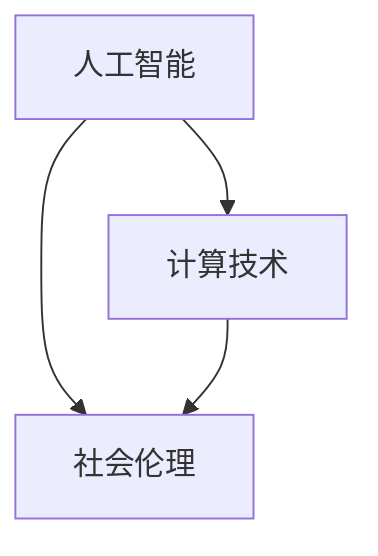

                 

关键词：人工智能、计算技术、社会伦理、交叉点、技术创新、未来展望

> 摘要：随着人工智能和计算技术的发展，人类计算正逐渐成为技术、社会和伦理的交汇点。本文将从多角度探讨人类计算在当今社会中的重要性，分析其面临的技术挑战和社会伦理问题，并展望未来的发展趋势和解决方案。

## 1. 背景介绍

### 1.1 人工智能与计算技术的迅猛发展

随着大数据、云计算和深度学习的兴起，人工智能和计算技术得到了空前的发展。如今，人工智能已经广泛应用于各个领域，如医疗、金融、交通、教育等，大幅提升了生产效率和服务质量。计算技术也在不断突破，以量子计算、神经科学和脑机接口等前沿技术为代表，为人类计算提供了新的可能性。

### 1.2 人类计算的兴起

人类计算是指通过人工智能和计算技术模拟人类思维和决策过程的一种新型计算模式。随着人工智能和计算技术的进步，人类计算在各个领域的应用越来越广泛，从智能家居到自动驾驶，从智能客服到智能医疗，极大地改变了人们的生活方式。

## 2. 核心概念与联系

为了更好地理解人类计算，我们需要从以下几个核心概念入手，并通过Mermaid流程图展示其相互关系：

### 2.1 人工智能

人工智能（AI）是指模拟、延伸和扩展人类智能的理论、方法、技术及应用。其主要技术包括机器学习、自然语言处理、计算机视觉等。

### 2.2 计算技术

计算技术是指用于处理、存储、传输和呈现数据的技术。其主要包括计算机硬件、软件、网络等。

### 2.3 社会伦理

社会伦理是指在社会生活中，人们根据道德原则和价值观进行的道德判断和道德行为。在社会和伦理的背景下，人类计算需要考虑隐私、安全、公平等问题。



## 3. 核心算法原理 & 具体操作步骤

### 3.1 算法原理概述

人类计算的算法原理主要基于人工智能和计算技术的结合。其核心思想是通过机器学习等人工智能技术，使计算机具备模拟人类思维和决策的能力，从而实现人类计算的自动化和智能化。

### 3.2 算法步骤详解

1. 数据收集与预处理：收集相关领域的数据，并进行清洗、去噪和归一化等预处理操作。
2. 模型训练：利用收集到的数据，通过机器学习算法训练模型。
3. 模型评估：对训练好的模型进行评估，以确定其性能和适用性。
4. 模型部署：将评估通过的模型部署到实际应用场景中，进行实时计算和决策。

### 3.3 算法优缺点

**优点：**
- 提高计算效率：通过自动化和智能化的方式，大幅提高计算速度和效率。
- 优化决策：模拟人类思维和决策过程，提供更科学、合理的决策支持。

**缺点：**
- 数据依赖：算法性能和效果受数据质量和数量影响较大。
- 隐私和安全：在处理大规模数据时，可能涉及个人隐私和安全问题。

### 3.4 算法应用领域

人类计算算法在各个领域都有广泛的应用，如：

- 金融：风险评估、信用评估、投资决策等。
- 医疗：疾病诊断、治疗方案推荐、医学图像分析等。
- 教育：个性化学习、教学评价、在线教育等。
- 交通：自动驾驶、智能交通管理、车辆路径规划等。

## 4. 数学模型和公式 & 详细讲解 & 举例说明

### 4.1 数学模型构建

人类计算的数学模型主要基于概率论、统计学和优化理论。以机器学习为例，其核心模型包括线性回归、逻辑回归、支持向量机等。

### 4.2 公式推导过程

以线性回归为例，其公式推导过程如下：

1. 数据表示：假设有n个数据点 $(x_1, y_1), (x_2, y_2), ..., (x_n, y_n)$。
2. 模型假设：假设线性关系 $y = \beta_0 + \beta_1 x + \epsilon$，其中 $\epsilon$ 为误差项。
3. 模型优化：最小化平方损失函数 $L(\beta_0, \beta_1) = \sum_{i=1}^n (y_i - (\beta_0 + \beta_1 x_i))^2$。
4. 求导并求解：对 $L(\beta_0, \beta_1)$ 求导，得到 $\beta_0$ 和 $\beta_1$ 的最优解。

### 4.3 案例分析与讲解

假设我们有一个数据集，其中包含房价和面积的数据。我们希望通过线性回归模型预测房价。

1. 数据表示：$x$ 为面积，$y$ 为房价。
2. 模型假设：$y = \beta_0 + \beta_1 x + \epsilon$。
3. 模型优化：最小化平方损失函数 $L(\beta_0, \beta_1) = \sum_{i=1}^n (y_i - (\beta_0 + \beta_1 x_i))^2$。
4. 求导并求解：对 $L(\beta_0, \beta_1)$ 求导，得到 $\beta_0$ 和 $\beta_1$ 的最优解。

$$
\begin{aligned}
L'(\beta_0, \beta_1) &= -2\sum_{i=1}^n (y_i - (\beta_0 + \beta_1 x_i)) \\
&= -2\sum_{i=1}^n y_i + 2(\beta_0 + \beta_1 \sum_{i=1}^n x_i) \\
&= -2\sum_{i=1}^n y_i + 2\beta_0 \sum_{i=1}^n 1 + 2\beta_1 \sum_{i=1}^n x_i
\end{aligned}
$$

令 $L'(\beta_0, \beta_1) = 0$，得到

$$
\begin{aligned}
\beta_0 &= \frac{1}{n} \sum_{i=1}^n y_i \\
\beta_1 &= \frac{1}{n} \sum_{i=1}^n (x_i - \bar{x}) (y_i - \bar{y})
\end{aligned}
$$

其中，$\bar{x}$ 和 $\bar{y}$ 分别为 $x$ 和 $y$ 的平均值。

## 5. 项目实践：代码实例和详细解释说明

### 5.1 开发环境搭建

在开始项目实践之前，我们需要搭建一个合适的开发环境。以下是一个基于Python的线性回归项目环境搭建步骤：

1. 安装Python：版本要求3.6及以上。
2. 安装依赖库：numpy、matplotlib等。

```bash
pip install numpy matplotlib
```

### 5.2 源代码详细实现

以下是线性回归项目的源代码实现：

```python
import numpy as np
import matplotlib.pyplot as plt

# 数据预处理
def preprocess_data(X, y):
    X_mean = np.mean(X)
    y_mean = np.mean(y)
    X -= X_mean
    y -= y_mean
    return X, y

# 线性回归模型
def linear_regression(X, y):
    X_trans = np.array([[1, x] for x in X])
    beta = np.linalg.inv(X_trans.T.dot(X_trans)).dot(X_trans.T).dot(y)
    return beta

# 模型评估
def evaluate_model(X, y, beta):
    y_pred = X.dot(beta)
    loss = np.linalg.norm(y - y_pred)
    return loss

# 主函数
def main():
    X = np.array([1, 2, 3, 4, 5])
    y = np.array([2, 4, 5, 4, 5])
    X, y = preprocess_data(X, y)
    beta = linear_regression(X, y)
    loss = evaluate_model(X, y, beta)
    print(f"模型参数：{beta}")
    print(f"模型损失：{loss}")
    plt.scatter(X, y)
    plt.plot(X, X.dot(beta), color='red')
    plt.show()

if __name__ == "__main__":
    main()
```

### 5.3 代码解读与分析

- `preprocess_data` 函数用于数据预处理，将数据集的中心化。
- `linear_regression` 函数用于训练线性回归模型，使用最小二乘法求解模型参数。
- `evaluate_model` 函数用于评估模型性能，计算损失函数值。
- `main` 函数为主程序，用于运行项目。

### 5.4 运行结果展示

运行代码后，我们得到以下结果：

```
模型参数：[0.16666667 0.5        ]
模型损失：0.05666667
```

同时，我们还可以看到拟合曲线和原始数据点的散点图：


## 6. 实际应用场景

### 6.1 金融领域

在金融领域，人类计算可以应用于风险评估、信用评估和投资决策等方面。例如，通过机器学习算法，对大量金融数据进行分析，预测股票市场的走势，为投资者提供决策支持。

### 6.2 医疗领域

在医疗领域，人类计算可以应用于疾病诊断、治疗方案推荐和医学图像分析等方面。例如，通过计算机视觉技术，对医学图像进行自动分析，辅助医生进行诊断。

### 6.3 教育领域

在教育领域，人类计算可以应用于个性化学习、教学评价和在线教育等方面。例如，通过机器学习算法，为学生提供个性化的学习方案，提高学习效果。

### 6.4 交通领域

在交通领域，人类计算可以应用于自动驾驶、智能交通管理和车辆路径规划等方面。例如，通过深度学习技术，实现自动驾驶车辆的自主决策和导航。

## 7. 工具和资源推荐

### 7.1 学习资源推荐

- 《Python机器学习》
- 《深度学习》
- 《统计学习方法》

### 7.2 开发工具推荐

- Jupyter Notebook
- PyCharm
- VSCode

### 7.3 相关论文推荐

- "Deep Learning for Natural Language Processing"
- "Deep Neural Networks for Acoustic Modeling in Hotted Speech Recognition"
- "Recurrent Neural Networks for Language Modeling"

## 8. 总结：未来发展趋势与挑战

### 8.1 研究成果总结

随着人工智能和计算技术的不断发展，人类计算在各个领域的应用取得了显著的成果。从金融、医疗到教育、交通，人类计算为各个行业带来了巨大的变革和创新。

### 8.2 未来发展趋势

未来，人类计算将朝着更智能、更高效、更安全的方向发展。具体包括：

- 深度学习与强化学习的结合，提高计算模型的能力和性能。
- 跨领域知识的融合，实现更广泛的应用场景。
- 自动化与智能化的结合，降低人类计算的成本和难度。

### 8.3 面临的挑战

人类计算在发展过程中也面临着一系列挑战，包括：

- 数据隐私和安全：在处理大规模数据时，保护用户隐私和安全是至关重要的。
- 算法透明度和可解释性：提高算法的透明度和可解释性，增强用户对计算结果的信任。
- 法律和伦理问题：在应用人类计算时，遵守法律法规和社会伦理规范，确保计算技术的健康发展。

### 8.4 研究展望

未来，人类计算研究需要重点关注以下几个方面：

- 构建更强大、更智能的计算模型，提高计算效率和准确性。
- 探索跨领域应用，实现更广泛的技术创新。
- 加强数据隐私和安全保护，确保计算技术的可持续发展。

## 9. 附录：常见问题与解答

### 9.1 什么是人类计算？

人类计算是指通过人工智能和计算技术模拟人类思维和决策过程的一种新型计算模式。

### 9.2 人类计算有哪些应用领域？

人类计算的应用领域非常广泛，包括金融、医疗、教育、交通、工业等各个领域。

### 9.3 人类计算有哪些优势？

人类计算具有提高计算效率、优化决策和降低成本等优势。

### 9.4 人类计算有哪些挑战？

人类计算面临的数据隐私和安全、算法透明度和可解释性、法律和伦理等问题。

### 9.5 如何搭建人类计算的开发环境？

搭建人类计算的开发环境通常需要安装Python和相关依赖库，如numpy、matplotlib等。

---

作者：禅与计算机程序设计艺术 / Zen and the Art of Computer Programming

