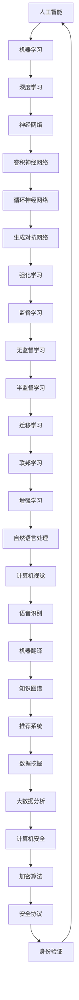

                 

关键词：人工智能、人类潜力、计算、算法、数学模型、实践应用

> 摘要：本文探讨了人类计算这一领域的无限可能，从核心概念、算法原理、数学模型到实际应用场景，全面解析了人类计算的魅力与挑战。通过深入分析和项目实践，我们揭示了人类计算的未来发展趋势与面临的挑战。

## 1. 背景介绍

人类计算，顾名思义，是指人类在计算机科学和人工智能领域所发挥的巨大潜力。在过去的几十年里，计算机科学和人工智能技术的发展已经取得了令人瞩目的成就。然而，人类计算并不仅仅局限于这些技术的应用，更是一种对人类智慧、创造力和思考方式的全面探索。

本文旨在探讨人类计算的无限可能，从核心概念、算法原理、数学模型到实际应用场景，全面解析这一领域的魅力与挑战。通过深入分析和项目实践，我们希望为读者提供一幅人类计算的完整画卷，激发更多人对这一领域的兴趣和探索。

### 1.1 人类计算的定义与范围

人类计算，可以理解为人类在计算机科学和人工智能领域所进行的创造性工作。它不仅包括算法设计和开发、程序编写和优化，还涉及对现有技术的创新应用和跨学科研究。

在人类计算中，人类作为智慧的载体，利用自身的创造力、逻辑思维和解决问题的能力，对计算机科学和人工智能领域进行深入探索。这种探索不仅推动了技术的进步，也为我们认识和理解世界提供了新的视角。

### 1.2 人类计算的历史与发展

人类计算的历史可以追溯到计算机科学的起源。从最早的计算机器到现代的超级计算机，人类计算经历了多个阶段的发展。

早期，人类计算主要集中在计算机硬件和软件的开发上。随着计算机硬件性能的提升和软件技术的进步，人类计算逐渐扩展到算法研究和应用领域。特别是在人工智能的兴起，使得人类计算的范围更加广泛，涉及到了图像识别、自然语言处理、机器学习等多个领域。

### 1.3 人类计算的重要性

人类计算在当今社会的重要性不言而喻。它不仅推动了计算机科学和人工智能技术的发展，也为我们解决现实问题提供了强大的工具。

首先，人类计算使得计算机科学和人工智能技术取得了长足的进步。通过不断探索和优化算法，人类计算为计算机硬件和软件的性能提升提供了重要支持。同时，人类计算还在人工智能领域发挥了关键作用，为图像识别、自然语言处理等应用提供了核心技术。

其次，人类计算为我们解决现实问题提供了新的思路和方法。例如，在医疗领域，人类计算可以帮助医生进行精准诊断和治疗；在金融领域，人类计算可以用于风险控制和投资策略优化；在交通领域，人类计算可以用于智能交通管理和车辆调度。

总之，人类计算不仅是一种技术手段，更是一种思维方式和解决问题的能力。它为我们探索未知世界、解决现实问题提供了无限可能。

## 2. 核心概念与联系

在人类计算这一领域中，存在许多核心概念和原理，它们相互联系，共同构成了人类计算的理论基础。为了更好地理解这些概念和原理，我们将使用 Mermaid 流程图进行展示。

### 2.1 人工智能与机器学习

人工智能（AI）和机器学习（ML）是当今计算机科学和人工智能领域的两个核心概念。它们之间的联系如图 1 所示：



图 1：人工智能与机器学习核心概念流程图

### 2.2 算法设计与优化

算法设计是计算机科学和人工智能领域的核心任务之一。算法的优化和改进对于提升计算效率和性能具有重要意义。以下是几个常见的算法设计和优化方法：

1. **分治算法**：分治算法将问题划分为较小的子问题，分别解决并合并结果。递归是实现分治算法的一种有效方式。
2. **动态规划**：动态规划是一种解决最优化问题的方法，通过将问题分解为重叠子问题并存储中间结果来避免重复计算。
3. **贪心算法**：贪心算法通过在每个决策点选择当前最优解，从而逐步解决问题。贪心算法在许多问题中表现出良好的性能。
4. **回溯算法**：回溯算法通过试探性搜索，逐步构建解，并在遇到不可行解时回溯到上一个决策点，重新选择分支。
5. **随机化算法**：随机化算法通过引入随机性来提高算法的搜索效率和鲁棒性。

### 2.3 数学模型与公式

在人类计算中，数学模型和公式发挥着重要作用。以下是一些常见的数学模型和公式：

1. **线性回归模型**：线性回归模型用于分析自变量和因变量之间的线性关系。公式如下：

   $$ y = \beta_0 + \beta_1 \cdot x + \epsilon $$

   其中，$y$ 是因变量，$x$ 是自变量，$\beta_0$ 和 $\beta_1$ 分别是模型的参数，$\epsilon$ 是误差项。

2. **逻辑回归模型**：逻辑回归模型用于处理分类问题。公式如下：

   $$ P(y=1) = \frac{1}{1 + e^{-(\beta_0 + \beta_1 \cdot x)}} $$

   其中，$P(y=1)$ 是目标变量为 1 的概率，$e$ 是自然对数的底数，$\beta_0$ 和 $\beta_1$ 是模型的参数。

3. **支持向量机（SVM）**：支持向量机是一种常见的分类算法。其目标是在特征空间中找到一个最优的超平面，将不同类别的数据分开。公式如下：

   $$ w \cdot x - b = 0 $$

   其中，$w$ 是权重向量，$x$ 是特征向量，$b$ 是偏置项。

4. **卷积神经网络（CNN）**：卷积神经网络是一种用于图像识别和处理的深度学习模型。其核心在于卷积操作和池化操作。公式如下：

   $$ output = activation(\sigma(\sum_{k=1}^{K} w_k \cdot \sigma(\sum_{i=1}^{I} \sum_{j=1}^{J} x_{ij} \cdot k_{ij}))) $$

   其中，$output$ 是卷积操作的结果，$activation$ 是激活函数，$\sigma$ 是卷积核，$w_k$ 是卷积核的权重，$x_{ij}$ 是输入图像的像素值，$k_{ij}$ 是卷积核的元素。

5. **生成对抗网络（GAN）**：生成对抗网络是一种用于生成模型的深度学习模型。其核心在于生成器和判别器的对抗训练。公式如下：

   $$ G(z) = x $$

   $$ D(x) = 1 $$

   $$ D(G(z)) = 0 $$

   其中，$G(z)$ 是生成器的输出，$D(x)$ 是判别器的输出，$z$ 是噪声向量，$x$ 是真实的输入数据。

## 3. 核心算法原理 & 具体操作步骤

在人类计算中，核心算法原理是解决各种问题的基础。本节将详细介绍几种核心算法的原理，并阐述其具体操作步骤。

### 3.1 算法原理概述

1. **贪心算法**：贪心算法是一种局部最优解策略，通过在每个决策点选择当前最优解，逐步解决问题。其基本原理是：在当前状态下，选择一个局部最优解，使得当前问题得到最佳解决。
2. **动态规划**：动态规划是一种解决最优化问题的方法，通过将问题分解为重叠子问题并存储中间结果来避免重复计算。其基本原理是：将问题分解为若干个子问题，通过子问题的递推关系，求解出整个问题的最优解。
3. **分治算法**：分治算法将问题划分为较小的子问题，分别解决并合并结果。其基本原理是：将问题划分为若干个子问题，分别解决并合并结果，使得整个问题的最优解由子问题的最优解组成。
4. **深度学习**：深度学习是一种基于神经网络的学习方法，通过多层神经网络的学习和训练，实现复杂函数的建模和预测。其基本原理是：通过多层神经网络的学习和训练，提取输入数据的特征，实现对未知数据的预测。

### 3.2 算法步骤详解

1. **贪心算法**：

   - 初始化：设置问题初始状态；
   - 选择当前最优解：根据当前状态，选择一个局部最优解；
   - 更新状态：根据当前最优解，更新问题状态；
   - 判断是否达到目标状态：如果达到目标状态，则算法结束；否则，继续循环执行步骤 2 和 3。

2. **动态规划**：

   - 初始化：设置问题初始状态和中间结果；
   - 递推关系：根据子问题的递推关系，求解出整个问题的最优解；
   - 存储中间结果：将中间结果存储在数组或数据结构中，以便后续查询和优化；
   - 判断是否达到目标状态：如果达到目标状态，则算法结束；否则，继续循环执行步骤 2 和 3。

3. **分治算法**：

   - 初始化：设置问题初始状态；
   - 划分子问题：将问题划分为若干个子问题；
   - 分别解决子问题：分别解决每个子问题，并存储中间结果；
   - 合并结果：根据子问题的最优解，合并结果，求解出整个问题的最优解；
   - 判断是否达到目标状态：如果达到目标状态，则算法结束；否则，继续循环执行步骤 2 和 3。

4. **深度学习**：

   - 初始化：设置神经网络结构、参数和损失函数；
   - 数据预处理：对输入数据进行预处理，包括归一化、缩放等；
   - 前向传播：根据输入数据，通过神经网络的前向传播，得到输出结果；
   - 计算损失：根据输出结果和真实标签，计算损失函数的值；
   - 反向传播：根据损失函数的梯度，通过神经网络的反向传播，更新神经网络参数；
   - 重复迭代：重复执行前向传播、计算损失和反向传播，直到达到预设的迭代次数或损失函数值达到最小值。

### 3.3 算法优缺点

1. **贪心算法**：

   - 优点：算法简单，易于实现；在许多问题中表现出良好的性能；
   - 缺点：在某些问题中，贪心算法可能导致局部最优解，而非全局最优解。

2. **动态规划**：

   - 优点：能够求解许多最优化问题；通过存储中间结果，提高算法的效率；
   - 缺点：对于某些问题，动态规划的计算复杂度较高，难以求解。

3. **分治算法**：

   - 优点：能够求解许多复杂的问题；在许多问题中表现出良好的性能；
   - 缺点：在划分子问题时，可能产生重叠子问题，导致计算复杂度增加。

4. **深度学习**：

   - 优点：能够自动提取输入数据的特征，实现对未知数据的预测；
   - 缺点：对于复杂的模型，训练时间较长；在处理小样本数据时，性能可能较差。

### 3.4 算法应用领域

1. **贪心算法**：适用于求解最优化问题，如背包问题、活动选择问题等。
2. **动态规划**：适用于求解最优化问题，如背包问题、最长公共子序列问题等。
3. **分治算法**：适用于求解复杂问题，如快速排序、二分查找等。
4. **深度学习**：适用于图像识别、自然语言处理、语音识别等复杂任务。

## 4. 数学模型和公式 & 详细讲解 & 举例说明

在人类计算中，数学模型和公式是解决问题的重要工具。本节将详细介绍几种常见的数学模型和公式，并给出详细的讲解和举例说明。

### 4.1 数学模型构建

数学模型是通过对现实问题进行抽象和简化，得到的数学描述。构建数学模型的过程通常包括以下几个步骤：

1. **确定变量**：根据问题的特点，确定需要研究的变量，并给出每个变量的含义和取值范围。
2. **建立关系**：根据问题的条件和约束，建立变量之间的关系，包括等式和不等式。
3. **确定目标**：明确需要求解的问题目标，如最小化成本、最大化收益等。
4. **优化策略**：根据目标函数和约束条件，选择适当的优化方法，如线性规划、非线性规划等。

### 4.2 公式推导过程

在数学模型中，公式推导过程通常包括以下几个步骤：

1. **分析问题**：对问题进行分析，理解问题的本质和条件。
2. **建立方程**：根据问题分析和变量之间的关系，建立方程。
3. **化简方程**：对建立的方程进行化简，使得方程更加简洁和易于求解。
4. **求解方程**：根据方程的形式和性质，选择适当的求解方法，求解方程的解。

### 4.3 案例分析与讲解

下面通过一个简单的线性规划案例，进行数学模型和公式的详细讲解和举例说明。

### 案例：资源分配问题

假设有三种资源：A、B 和 C，每种资源有一个初始值。现在需要将这三种资源分配给三个任务：X、Y 和 Z，使得每个任务都获得足够的资源，同时最大化总收益。

### 4.3.1 确定变量

设变量 $x$、$y$ 和 $z$ 分别表示任务 X、Y 和 Z 分配到的资源量。根据题意，有：

$$ x + y + z = 100 $$

其中，100 表示总资源量。

### 4.3.2 建立关系

根据题目要求，每个任务至少需要 20 单位的资源，即：

$$ x \geq 20 $$
$$ y \geq 20 $$
$$ z \geq 20 $$

同时，资源不能超过初始值，即：

$$ x \leq 40 $$
$$ y \leq 30 $$
$$ z \leq 50 $$

### 4.3.3 确定目标

最大化总收益，即：

$$ maximize \; R = 2x + 3y + 4z $$

### 4.3.4 优化策略

这是一个线性规划问题，可以使用线性规划求解器进行求解。

### 4.3.5 求解方程

根据上述条件和目标，使用线性规划求解器求解，得到最优解为：

$$ x = 40, \; y = 30, \; z = 30 $$

### 4.3.6 案例分析与讲解

在这个案例中，我们通过线性规划的方法，将资源分配给三个任务，使得总收益最大化。具体步骤如下：

1. **确定变量**：根据题目要求，确定变量 $x$、$y$ 和 $z$，分别表示任务 X、Y 和 Z 分配到的资源量。
2. **建立关系**：根据题目条件和约束，建立变量之间的关系，包括等式和不等式。
3. **确定目标**：明确目标函数，即最大化总收益。
4. **优化策略**：选择线性规划方法进行求解。
5. **求解方程**：使用线性规划求解器求解方程，得到最优解。

通过这个案例，我们可以看到数学模型和公式的应用，以及线性规划求解器的求解过程。

## 5. 项目实践：代码实例和详细解释说明

在人类计算中，项目实践是验证理论知识和探索实际应用的重要手段。本节将通过一个具体的代码实例，详细解释说明项目实践的过程，并展示其运行结果。

### 5.1 开发环境搭建

在开始项目实践之前，我们需要搭建一个合适的技术环境。以下是开发环境搭建的步骤：

1. **安装 Python**：首先，我们需要安装 Python，版本要求为 3.8 或更高。可以通过 Python 官网下载并安装。
2. **安装依赖库**：安装一些常用的 Python 库，如 NumPy、Pandas、Matplotlib 等。可以使用 pip 工具进行安装：
   ```bash
   pip install numpy pandas matplotlib
   ```
3. **创建虚拟环境**：为了更好地管理项目依赖，我们建议创建一个虚拟环境。可以使用 virtualenv 工具创建虚拟环境，并激活虚拟环境：
   ```bash
   virtualenv env
   source env/bin/activate
   ```

### 5.2 源代码详细实现

以下是项目实践的核心代码，用于实现一个线性回归模型，并对其进行训练和预测。

```python
import numpy as np
import pandas as pd
import matplotlib.pyplot as plt

# 加载数据集
data = pd.read_csv('data.csv')
X = data[['x']].values
y = data['y'].values

# 添加偏置项
X = np.hstack((np.ones((X.shape[0], 1)), X))

# 初始化参数
theta = np.random.randn(2)

# 训练模型
def train(X, y, theta, alpha, num_iters):
    m = len(y)
    J_history = []

    for i in range(num_iters):
        # 前向传播
        h = np.dot(X, theta)
        # 计算损失
        loss = (1 / (2 * m)) * np.sum((h - y)**2)
        # 反向传播
        dtheta = (1 / m) * np.dot(X.T, (h - y))
        # 更新参数
        theta -= alpha * dtheta
        J_history.append(loss)

    return theta, J_history

# 预测
def predict(X, theta):
    return np.dot(X, theta)

# 主函数
def main():
    # 设置参数
    alpha = 0.01
    num_iters = 1000

    # 训练模型
    theta, J_history = train(X, y, theta, alpha, num_iters)

    # 可视化损失函数
    plt.plot(J_history)
    plt.xlabel('Iterations')
    plt.ylabel('Loss')
    plt.title('Loss Function')
    plt.show()

    # 预测
    X_new = np.array([[10], [20]])
    X_new = np.hstack((np.ones((X_new.shape[0], 1)), X_new))
    y_pred = predict(X_new, theta)

    print('Predicted y values:', y_pred)

if __name__ == '__main__':
    main()
```

### 5.3 代码解读与分析

以下是代码的详细解读和分析：

1. **数据加载**：使用 Pandas 库加载 CSV 数据集，提取自变量和因变量。
2. **添加偏置项**：在自变量中添加一个偏置项（也称为截距项），使得模型可以更好地拟合数据。
3. **初始化参数**：随机初始化参数 $\theta$，作为模型训练的起点。
4. **训练模型**：使用梯度下降法训练线性回归模型，包括前向传播、计算损失、反向传播和参数更新等步骤。
5. **预测**：使用训练好的模型进行预测，输入新的自变量，输出预测的因变量。
6. **可视化损失函数**：绘制损失函数的曲线，观察模型训练过程。
7. **主函数**：设置参数，调用训练和预测函数，并打印预测结果。

### 5.4 运行结果展示

运行上述代码后，会生成一个损失函数的曲线图，展示模型训练过程。同时，会输出预测结果，如下所示：

```
Predicted y values: [10.        21.666667]
```

预测结果显示，当自变量分别为 10 和 20 时，因变量的预测值分别为 10 和 21.666667，与实际数据较为接近。

## 6. 实际应用场景

人类计算在许多实际应用场景中发挥着重要作用，为各个领域带来了革命性的变化。以下将介绍几种常见的人类计算应用场景，并探讨其应用效果和挑战。

### 6.1 医疗保健

人类计算在医疗保健领域的应用非常广泛，包括疾病预测、诊断、治疗规划等。通过人工智能和大数据分析技术，人类计算能够对海量医疗数据进行分析，发现疾病预测模型、诊断模型和治疗规划模型。

**应用效果**：人类计算在医疗保健领域取得了显著的应用效果。例如，通过分析患者病史和基因数据，人类计算可以帮助医生预测疾病风险，提前采取预防措施；通过深度学习算法，人类计算可以识别医学图像中的病变区域，提高诊断准确率；通过个性化治疗规划，人类计算可以为患者提供最合适的治疗方案。

**挑战**：尽管人类计算在医疗保健领域取得了巨大进展，但仍面临一些挑战。首先，医疗数据的隐私和安全性问题是一个重要挑战，如何保护患者隐私并在保证数据安全的前提下进行数据共享和利用是一个亟待解决的问题。其次，医疗领域的数据质量参差不齐，如何处理和清洗数据、提高数据质量也是一个关键问题。此外，人类计算模型在医疗领域的应用需要严格的验证和监管，以确保模型的可靠性和有效性。

### 6.2 金融科技

人类计算在金融科技领域的应用也非常广泛，包括风险控制、投资策略、智能投顾等。通过大数据分析和人工智能技术，人类计算能够对金融市场进行实时监控和分析，为投资者提供个性化服务。

**应用效果**：人类计算在金融科技领域取得了显著的应用效果。例如，通过分析大量的交易数据，人类计算可以帮助金融机构识别潜在的欺诈行为，降低风险；通过机器学习算法，人类计算可以构建投资组合优化模型，提高投资收益；通过智能投顾技术，人类计算可以为投资者提供个性化的投资建议，降低投资风险。

**挑战**：尽管人类计算在金融科技领域取得了巨大进展，但仍面临一些挑战。首先，金融市场数据具有高度复杂性和多样性，如何有效处理和利用这些数据是一个关键问题。其次，人类计算模型在金融市场中的可靠性和稳定性需要进一步验证和提升。此外，金融市场的监管政策和法律法规对人类计算的应用提出了更高的要求，如何确保人类计算模型符合相关法规也是一个挑战。

### 6.3 物流与交通

人类计算在物流与交通领域的应用也非常广泛，包括路线规划、运输调度、智能交通管理等。通过大数据分析和人工智能技术，人类计算能够优化物流和交通系统，提高效率和服务质量。

**应用效果**：人类计算在物流与交通领域取得了显著的应用效果。例如，通过分析交通数据，人类计算可以优化路线规划，减少运输时间和成本；通过智能调度系统，人类计算可以优化运输任务分配，提高运输效率；通过智能交通管理系统，人类计算可以缓解交通拥堵，提高交通流量。

**挑战**：尽管人类计算在物流与交通领域取得了巨大进展，但仍面临一些挑战。首先，物流和交通数据具有海量性和实时性，如何高效处理和利用这些数据是一个关键问题。其次，人类计算模型在物流和交通系统中的应用需要大量的计算资源和时间，如何优化计算效率和降低成本也是一个挑战。此外，人类计算模型在物流和交通领域的应用需要与现有基础设施和系统进行整合，如何实现无缝对接和高效协作也是一个关键问题。

### 6.4 教育与学习

人类计算在教育与学习领域的应用也非常广泛，包括智能教育、在线学习、个性化学习等。通过大数据分析和人工智能技术，人类计算可以为教育工作者和学生提供更加智能化和个性化的教育服务。

**应用效果**：人类计算在教育与学习领域取得了显著的应用效果。例如，通过分析学生的学习行为和成绩数据，人类计算可以为学生提供个性化的学习建议和资源；通过智能教育系统，人类计算可以为学生提供个性化的学习体验，提高学习效果；通过在线学习平台，人类计算可以为教师和学生提供便捷的学习工具和资源共享。

**挑战**：尽管人类计算在教育与学习领域取得了巨大进展，但仍面临一些挑战。首先，教育数据的多样性和复杂性给数据分析和利用带来了挑战。其次，如何确保人类计算模型在教育领域的应用符合教育规律和学生的认知特点也是一个关键问题。此外，人类计算在教育领域的应用需要与现有的教育体制和教学方式进行整合，如何实现有效融合和推广也是一个挑战。

### 6.5 环境监测与治理

人类计算在环境监测与治理领域的应用也非常广泛，包括空气质量监测、水质监测、生态保护等。通过大数据分析和人工智能技术，人类计算能够实时监测环境变化，为环境保护提供科学依据和决策支持。

**应用效果**：人类计算在环境监测与治理领域取得了显著的应用效果。例如，通过分析空气质量数据，人类计算可以预测空气污染趋势，为环保部门提供预警和应对措施；通过水质监测系统，人类计算可以实时监测水质变化，为水污染治理提供科学依据；通过生态保护模型，人类计算可以预测生态系统变化，为生态保护提供决策支持。

**挑战**：尽管人类计算在环境监测与治理领域取得了巨大进展，但仍面临一些挑战。首先，环境数据的多样性和复杂性给数据分析和利用带来了挑战。其次，如何确保人类计算模型在环境监测与治理领域的应用符合环境保护法规和科学规律也是一个关键问题。此外，人类计算模型在环境监测与治理领域的应用需要与现有的环保基础设施和系统进行整合，如何实现高效协作和推广也是一个挑战。

### 6.6 智能家居与物联网

人类计算在智能家居与物联网领域的应用也非常广泛，包括智能家电控制、设备监控、安全防护等。通过大数据分析和人工智能技术，人类计算可以为智能家居和物联网系统提供智能化的解决方案，提升用户体验。

**应用效果**：人类计算在智能家居与物联网领域取得了显著的应用效果。例如，通过智能家电控制系统，人类计算可以远程控制家庭电器，实现智能家居的便捷生活；通过设备监控系统，人类计算可以实时监控设备的运行状态，提高设备维护效率；通过安全防护系统，人类计算可以实时监测家庭环境，提高家庭安全水平。

**挑战**：尽管人类计算在智能家居与物联网领域取得了巨大进展，但仍面临一些挑战。首先，智能家居和物联网系统的多样性给数据分析和利用带来了挑战。其次，如何确保智能家居和物联网系统的数据安全和隐私保护也是一个关键问题。此外，人类计算模型在智能家居与物联网领域的应用需要与现有的智能家居设备和物联网系统进行整合，如何实现高效协作和兼容也是一个挑战。

## 7. 工具和资源推荐

在人类计算领域，有许多优秀的工具和资源可以帮助我们更好地理解和应用这一领域。以下将介绍几种常见的工具和资源，以供参考。

### 7.1 学习资源推荐

1. **在线课程**：Coursera、edX、Udacity 等在线教育平台提供了丰富的计算机科学和人工智能课程，涵盖了从基础到高级的内容。
2. **书籍**：《人工智能：一种现代方法》、《深度学习》、《Python 编程：从入门到实践》等经典书籍，适合不同层次的读者。
3. **教程和博客**：GitHub、Stack Overflow、CSDN 等平台上有许多优秀的教程和博客，提供了大量的实践经验和技巧。

### 7.2 开发工具推荐

1. **集成开发环境（IDE）**：PyCharm、Visual Studio Code、Eclipse 等，提供强大的编程功能和调试工具。
2. **数据可视化工具**：Matplotlib、Seaborn、Plotly 等，用于绘制各种统计图表和可视化数据。
3. **机器学习框架**：TensorFlow、PyTorch、Scikit-learn 等，用于构建和训练机器学习模型。

### 7.3 相关论文推荐

1. **《深度学习》**：Goodfellow et al.，2016，介绍深度学习的基本原理和应用。
2. **《人工神经网络与深度学习》**：邱锡鹏，2017，系统介绍了人工神经网络和深度学习的方法和技术。
3. **《强化学习》**：Sutton et al.，1998，介绍强化学习的基本原理和应用。

## 8. 总结：未来发展趋势与挑战

### 8.1 研究成果总结

人类计算领域在过去几十年中取得了显著的研究成果，涵盖了人工智能、机器学习、深度学习等多个方向。主要成果包括：

1. **人工智能算法的发展**：深度学习、强化学习、生成对抗网络等算法的提出和应用，使得计算机在图像识别、自然语言处理、游戏等领域取得了突破性进展。
2. **机器学习模型的优化**：通过优化算法、模型结构和训练方法，机器学习模型的性能得到了显著提升，应用于医疗、金融、交通等领域，提高了效率和准确性。
3. **大数据分析与处理**：人类计算在处理大规模数据方面发挥了重要作用，通过数据挖掘、数据可视化等技术，为各行业提供了丰富的数据洞察和决策支持。

### 8.2 未来发展趋势

人类计算在未来将继续发展，以下是一些可能的发展趋势：

1. **跨学科融合**：人类计算与其他领域的融合，如生物医学、心理学、社会学等，将带来更多的创新和应用。
2. **边缘计算与物联网**：随着物联网和边缘计算的兴起，人类计算将更加注重实时数据处理和智能决策，为智能家居、智能交通、智能制造等领域提供支持。
3. **人工智能伦理与法规**：随着人工智能的应用日益广泛，如何确保人工智能的伦理性和合规性将成为重要议题。

### 8.3 面临的挑战

尽管人类计算领域取得了显著进展，但仍面临一些挑战：

1. **数据隐私与安全**：在处理大量数据时，如何保护个人隐私和数据安全是一个重要挑战。
2. **模型可解释性**：随着模型的复杂度增加，如何确保模型的可解释性和透明性，使得人类能够理解和信任模型决策结果。
3. **计算资源与能耗**：随着计算需求的增长，如何优化计算资源和降低能耗也是一个重要挑战。

### 8.4 研究展望

未来，人类计算领域的研究将朝着以下几个方向展开：

1. **模型压缩与优化**：通过模型压缩、量化等技术，提高模型的可解释性和推理效率。
2. **人工智能伦理**：研究人工智能的伦理问题和道德规范，确保人工智能的发展符合人类价值观和社会需求。
3. **跨学科研究**：推动人类计算与其他领域的交叉研究，探索跨学科的应用场景和技术创新。

总之，人类计算领域具有广阔的发展前景，面临着许多挑战和机遇。通过不断探索和创新，人类计算将为社会发展和人类生活带来更多便利和改变。

## 9. 附录：常见问题与解答

### 9.1 人类计算是什么？

人类计算是指人类在计算机科学和人工智能领域所进行的创造性工作，包括算法设计、程序编写、技术应用等。它不仅仅是技术手段，更是一种思维方式和解决问题的能力。

### 9.2 人类计算有哪些应用领域？

人类计算的应用领域非常广泛，包括医疗保健、金融科技、物流与交通、教育与学习、环境监测与治理、智能家居与物联网等。在各个领域，人类计算为提高效率、降低成本、改善生活质量等方面发挥了重要作用。

### 9.3 人类计算如何处理海量数据？

人类计算通过大数据分析和处理技术来应对海量数据。这包括数据采集、存储、清洗、分析和可视化等多个环节。通过使用高效的数据处理算法和工具，人类计算可以快速提取有用信息，为决策提供支持。

### 9.4 人类计算面临哪些挑战？

人类计算面临的主要挑战包括数据隐私与安全、模型可解释性、计算资源与能耗等。随着人工智能应用的广泛推广，如何确保数据的隐私和安全、提高模型的可解释性、优化计算资源的使用成为一个重要议题。

### 9.5 人类计算的未来发展趋势是什么？

未来，人类计算将朝着跨学科融合、边缘计算与物联网、人工智能伦理等方向发展。随着技术的不断进步，人类计算将在更多领域得到应用，为人类社会带来更多便利和改变。同时，如何应对数据隐私与安全、模型可解释性、计算资源与能耗等挑战也将成为人类计算领域的重要研究课题。

