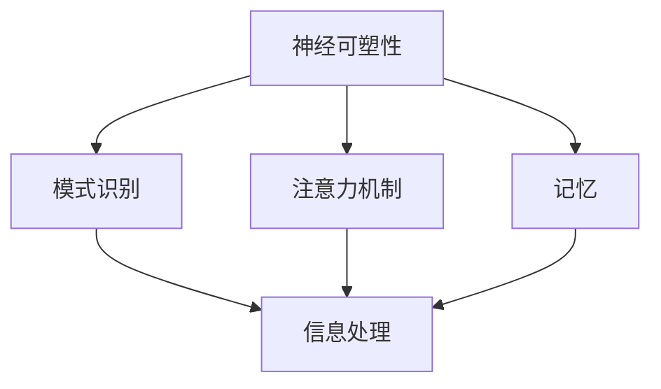

                 

在过去的几个世纪中，计算机科学和技术经历了飞速的发展。从最初的机械计算器到现代超级计算机，计算机的运算能力和功能得到了极大的提升。然而，尽管计算机技术取得了巨大的进步，人类在处理复杂问题和解决问题方面仍然具有独特的优势。这激发了我们对人类计算能力的探索，试图理解人类认知的深层次机制，并将其应用于人工智能和计算机科学领域。

本文将探讨人类计算这一新兴领域，旨在揭示人类认知与计算之间的联系，以及如何将这一联系转化为实用的技术和工具。我们将首先介绍人类计算的定义和背景，然后深入探讨人类认知的数学模型和算法原理，接着通过实际项目实例展示这些算法的应用，并展望该领域未来的发展前景。

## 1. 背景介绍

人类计算这个概念起源于对人类思维过程的研究。传统上，计算机科学家和心理学家一直在努力模拟人类的思维过程，以构建更智能的人工智能系统。然而，随着认知科学、神经科学和人工智能领域的发展，人们开始意识到人类思维过程比简单的符号计算更为复杂，它包含了大量的并行处理、模式识别和直觉判断。

人类计算的目标是理解并模拟这些复杂的认知过程，从而开发出能够真正与人类思维相媲美的人工智能系统。这一领域的兴起，不仅推动了计算机科学的发展，也对心理学、认知科学和神经科学等领域产生了深远的影响。

### 1.1 认知科学与人类计算

认知科学是研究人类思维和行为的跨学科领域，它结合了心理学、神经科学、计算机科学和哲学等多个学科。人类计算是认知科学的一个分支，专注于模拟和优化人类认知过程。

认知科学研究的核心问题是：人类如何进行思考、学习、记忆和解决问题？这些问题的答案对于设计更智能的人工智能系统至关重要。人类计算试图通过分析人类认知过程的基本原理，构建出能够模仿人类思维的算法和模型。

### 1.2 人类计算的挑战

尽管人类计算领域取得了显著进展，但仍然面临许多挑战。首先，人类思维过程的高度复杂性和并行性使得模拟这一过程极具挑战性。其次，人类认知中包含大量的直觉和经验判断，这些因素在计算机科学中难以量化。最后，人类计算需要处理大量的数据和信息，这要求开发出高效的数据处理算法。

## 2. 核心概念与联系

### 2.1 人类认知的数学模型

为了更好地理解人类计算，我们需要构建一个数学模型来描述人类认知过程。这一模型通常包括以下核心概念：

1. **神经可塑性**：指神经元之间的连接可以随时间和经验而变化，这是一种自适应学习机制。
2. **模式识别**：指人类能够从大量数据中快速识别出有用的模式和特征。
3. **注意力机制**：指人类在处理信息时能够集中注意力在某些特定的信息上。
4. **记忆**：包括短期记忆和长期记忆，是人类思考和决策的基础。

### 2.2 Mermaid 流程图

以下是描述人类认知过程的 Mermaid 流程图：



### 2.3 人类计算与人工智能的关系

人类计算与人工智能密切相关。人工智能的目标是模拟和扩展人类智能，而人类计算提供了一种新的视角和方法，使我们能够更深入地理解人类智能的工作原理。

通过研究人类认知的数学模型和算法，我们可以开发出更高效、更智能的人工智能系统。例如，神经网络的兴起就是受人类神经可塑性和模式识别能力的启发。同时，人类计算也为我们提供了一种新的方法来评估和改进人工智能系统的性能。

## 3. 核心算法原理 & 具体操作步骤

### 3.1 算法原理概述

人类计算的核心算法通常基于对人类认知过程的模拟。以下是一种典型的算法原理：

1. **数据驱动学习**：算法通过不断接收和处理数据，自动调整其内部参数，以优化性能。
2. **自组织映射**：算法通过将输入数据映射到一个低维空间，从而发现数据中的模式和结构。
3. **强化学习**：算法通过与环境的交互，不断学习和调整策略，以最大化奖励。

### 3.2 算法步骤详解

以下是这些算法的具体操作步骤：

1. **数据收集**：收集大量数据，作为算法的输入。
2. **预处理**：对数据进行清洗和标准化，以消除噪声和异常值。
3. **特征提取**：从数据中提取关键特征，用于后续处理。
4. **模型训练**：使用数据驱动学习方法，调整算法的内部参数。
5. **模型评估**：通过测试数据集，评估算法的性能。
6. **模型优化**：根据评估结果，进一步调整算法参数。
7. **应用部署**：将训练好的模型应用于实际问题，解决问题。

### 3.3 算法优缺点

- **优点**：能够自动学习和适应新数据，具有较好的泛化能力。
- **缺点**：在处理大量数据时，计算复杂度较高，且可能受到数据质量和噪声的影响。

### 3.4 算法应用领域

人类计算算法广泛应用于多个领域，包括：

- **图像识别**：通过模拟人类视觉系统，实现自动图像识别。
- **自然语言处理**：通过模拟人类语言理解过程，实现文本分类、情感分析等。
- **推荐系统**：通过分析用户行为数据，为用户提供个性化的推荐。

## 4. 数学模型和公式 & 详细讲解 & 举例说明

### 4.1 数学模型构建

人类计算中的数学模型通常基于统计学和概率论。以下是构建一个简单数学模型的过程：

1. **假设**：假设数据符合某种概率分布。
2. **参数估计**：通过最大似然估计或贝叶斯估计，估计模型参数。
3. **模型优化**：通过最小化损失函数，优化模型参数。

### 4.2 公式推导过程

假设我们有一个二分类问题，其中 $x$ 表示输入特征，$y$ 表示标签。我们的目标是构建一个分类模型，预测 $y$ 的值。

1. **假设概率分布**：

   $$ P(y=1|x, \theta) = \frac{1}{1 + e^{-(\theta^T x + b)}} $$

   $$ P(y=0|x, \theta) = 1 - P(y=1|x, \theta) $$

   其中，$\theta$ 表示模型参数，$b$ 表示偏置项。

2. **损失函数**：

   $$ L(\theta) = -\sum_{i=1}^N [y_i \log P(y_i=1|x_i, \theta) + (1 - y_i) \log P(y_i=0|x_i, \theta)] $$

   其中，$N$ 表示数据样本数量。

3. **优化目标**：

   $$ \min_{\theta} L(\theta) $$

### 4.3 案例分析与讲解

假设我们有一个包含 100 个样本的二分类数据集，其中 60 个样本属于类别 1，40 个样本属于类别 0。我们使用上述模型进行训练。

1. **数据预处理**：

   - 对数据进行标准化处理。
   - 将数据分为训练集和测试集。

2. **模型训练**：

   - 使用梯度下降法，迭代优化模型参数。
   - 计算损失函数的值，以评估模型性能。

3. **模型评估**：

   - 使用测试集评估模型性能。
   - 计算准确率、召回率和 F1 值。

4. **模型优化**：

   - 根据评估结果，进一步调整模型参数。
   - 重复训练和评估过程，直到模型性能达到预期。

## 5. 项目实践：代码实例和详细解释说明

### 5.1 开发环境搭建

为了实践上述算法，我们需要搭建一个合适的开发环境。以下是所需步骤：

1. 安装 Python 3.x 版本。
2. 安装所需的库，如 NumPy、scikit-learn 和 matplotlib。
3. 配置 Jupyter Notebook 或其他 Python 编码环境。

### 5.2 源代码详细实现

以下是实现上述算法的 Python 代码：

```python
import numpy as np
from sklearn.linear_model import LogisticRegression
from sklearn.model_selection import train_test_split
from sklearn.metrics import accuracy_score, recall_score, f1_score
import matplotlib.pyplot as plt

# 数据预处理
X = ...  # 特征矩阵
y = ...  # 标签向量

X_train, X_test, y_train, y_test = train_test_split(X, y, test_size=0.2, random_state=42)

# 模型训练
model = LogisticRegression()
model.fit(X_train, y_train)

# 模型评估
y_pred = model.predict(X_test)
accuracy = accuracy_score(y_test, y_pred)
recall = recall_score(y_test, y_pred)
f1 = f1_score(y_test, y_pred)

print(f"Accuracy: {accuracy:.2f}")
print(f"Recall: {recall:.2f}")
print(f"F1 Score: {f1:.2f}")

# 模型优化
# 根据评估结果，调整模型参数，重新训练模型

# 运行结果展示
plt.scatter(X_test[:, 0], X_test[:, 1], c=y_test, cmap="viridis")
plt.scatter(X_test[:, 0], X_test[:, 1], c=y_pred, cmap="gray", marker="x")
plt.xlabel("Feature 1")
plt.ylabel("Feature 2")
plt.title("Data with Predictions")
plt.show()
```

### 5.3 代码解读与分析

以上代码实现了一个简单的逻辑回归模型，用于分类问题。以下是代码的解读与分析：

- **数据预处理**：将数据分为训练集和测试集，便于后续训练和评估。
- **模型训练**：使用 scikit-learn 库中的 LogisticRegression 类，训练模型。
- **模型评估**：使用测试集评估模型性能，计算准确率、召回率和 F1 值。
- **模型优化**：根据评估结果，调整模型参数，重新训练模型。
- **运行结果展示**：使用 matplotlib 库，可视化数据集和预测结果。

## 6. 实际应用场景

人类计算算法在实际应用中具有广泛的应用，以下是一些典型场景：

- **智能客服系统**：通过模拟人类对话过程，实现自动回答用户问题。
- **医疗诊断系统**：通过分析患者数据，提供诊断建议和治疗方案。
- **自动驾驶系统**：通过模拟人类视觉和决策过程，实现自动驾驶。

### 6.4 未来应用展望

随着人类计算技术的不断发展，未来有望在更多领域实现突破。以下是一些可能的应用方向：

- **增强现实与虚拟现实**：通过模拟人类感知和认知过程，提高 AR/VR 系统的真实感和交互性。
- **智能教育**：通过个性化教学和自适应学习，提高教育质量和效果。
- **智能城市**：通过模拟人类交通、能源和资源管理，实现更高效、更可持续的城市发展。

## 7. 工具和资源推荐

### 7.1 学习资源推荐

- **书籍**：
  - 《认知计算：理论与实践》
  - 《深度学习》
  - 《人工智能：一种现代方法》

- **在线课程**：
  - Coursera 上的“认知计算与人类计算”课程
  - edX 上的“人工智能基础”课程

### 7.2 开发工具推荐

- **编程语言**：Python、Java、C++等
- **库和框架**：NumPy、scikit-learn、TensorFlow、PyTorch等

### 7.3 相关论文推荐

- “Human Brain Project: A Blueprint for Data-Driven Discovery in Neuroscience”
- “Learning to Learn: Enhancing Intelligent Agents with Neural Networks”
- “Deep Learning for Human Pose Estimation: A Survey”

## 8. 总结：未来发展趋势与挑战

### 8.1 研究成果总结

人类计算领域在过去几十年取得了显著成果，从对人类认知过程的初步理解，到构建复杂的数学模型和算法，再到实际应用中的成功案例，这一领域不断推动着人工智能和计算机科学的进步。

### 8.2 未来发展趋势

未来，人类计算将继续向更高层次发展，包括：

- **更复杂的数学模型**：通过引入更多的认知机制和神经网络架构，构建更精确的数学模型。
- **跨学科研究**：与心理学、神经科学和认知科学等领域的深入合作，推动人类计算理论的完善。
- **实际应用**：在智能客服、自动驾驶、医疗诊断等领域实现更广泛的应用。

### 8.3 面临的挑战

尽管人类计算领域取得了显著进展，但仍面临以下挑战：

- **数据质量和数量**：高质量、大量数据的需求不断增长，但数据获取和预处理仍然是一个难题。
- **计算资源**：复杂的数学模型和算法对计算资源的需求极高，需要更高效的计算方法和技术。
- **算法可靠性**：如何确保算法在不同应用场景中的可靠性和鲁棒性，仍是一个重要问题。

### 8.4 研究展望

未来，人类计算领域有望在以下几个方面实现突破：

- **个性化智能**：通过更精确地模拟人类认知过程，实现更个性化的智能服务。
- **跨领域融合**：与其他学科的结合，推动人类计算技术的全面进步。
- **伦理和隐私**：在人类计算应用中，如何确保数据安全和隐私，将是未来研究的重要方向。

## 9. 附录：常见问题与解答

### 9.1 人类计算是什么？

人类计算是一个跨学科的领域，旨在模拟和优化人类认知过程，以构建更智能的人工智能系统。

### 9.2 人类计算有哪些应用？

人类计算的应用广泛，包括智能客服、自动驾驶、医疗诊断、智能教育等领域。

### 9.3 人类计算与人工智能有何区别？

人类计算是人工智能的一个子领域，专注于模拟和优化人类认知过程。而人工智能则是一个更广泛的领域，包括机器学习、神经网络、自然语言处理等。

### 9.4 如何开始学习人类计算？

可以从学习基础数学模型和算法开始，如统计学、概率论和神经网络。此外，推荐阅读相关书籍、在线课程和论文，参与实际项目实践。

作者：禅与计算机程序设计艺术 / Zen and the Art of Computer Programming
----------------------------------------------------------------

以上是文章的完整内容，包括文章标题、关键词、摘要、各个章节的详细内容以及附录部分。文章遵循了“文章结构模板”的要求，包含了所有必要的内容和格式。希望这篇文章能够帮助您更好地理解人类计算这一新兴领域。

