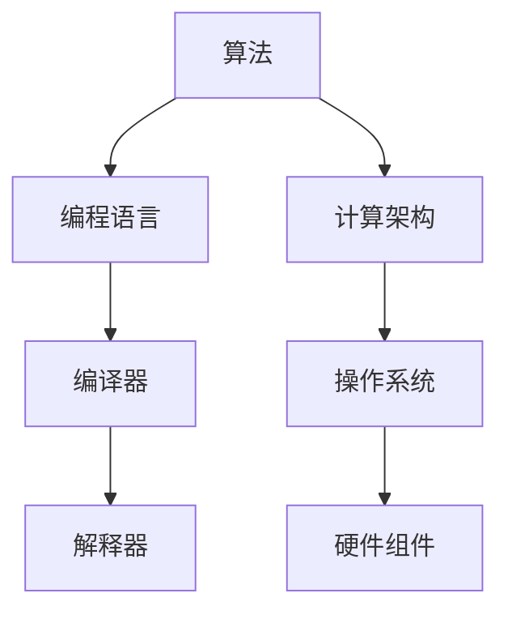

                 

关键词：人工智能，计算能力，社会进步，算法，编程，技术发展

> 摘要：本文旨在探讨人类计算在推动社会进步中的关键作用。从计算能力的发展、算法的创新、编程技术的进步以及技术对社会各个领域的深远影响，全面分析计算技术如何成为推动社会变革的催化剂。

## 1. 背景介绍

自计算机诞生以来，计算技术经历了飞速的发展。早期的计算机主要依赖机械和电子元件进行计算，效率低下且成本高昂。随着半导体技术的突破，计算机的体积逐渐减小，处理速度大大提升，成本也显著降低。这使得计算技术开始渗透到社会的各个领域，成为推动社会进步的重要力量。

### 1.1 计算能力的发展

计算能力的提升主要体现在以下几个方面：

- **处理速度**：计算机的处理速度从最初的每秒几千次运算提升到如今的每秒数亿次甚至数十亿次运算。
- **存储容量**：存储技术的进步使得计算机的存储容量从最初的几兆字节增长到如今的数以百亿字节计。
- **网络连接**：互联网的发展使得计算机之间的信息交换变得更加便捷，实现了全球范围内的信息共享。
- **硬件创新**：如量子计算、光计算等新型计算技术的出现，为未来的计算能力提升提供了无限可能。

### 1.2 社会需求的推动

随着人类社会的发展，对计算技术的要求也在不断提高。从最初的数据处理、信息检索，到如今的智能决策、人机交互，计算技术在各个领域都发挥着越来越重要的作用。这些需求推动了计算技术的不断创新和进步。

## 2. 核心概念与联系

计算技术的核心概念包括算法、编程语言、计算架构等。这些概念相互关联，共同构成了计算技术的理论体系。

### 2.1 算法

算法是计算技术的核心，是解决特定问题的方法。算法的设计和优化对于计算效率至关重要。不同的算法适用于不同的场景，其性能和复杂性也需要根据实际情况进行权衡。

### 2.2 编程语言

编程语言是程序员与计算机沟通的桥梁，它为算法的实现提供了语法和语义规范。不同编程语言具有不同的特点，适用于不同的应用场景。

### 2.3 计算架构

计算架构包括硬件和软件两大部分。硬件部分涉及处理器、内存、存储等组件的设计和布局，软件部分则包括操作系统、编译器、解释器等。计算架构的优化对于提升计算效率具有重要作用。

### 2.4 Mermaid 流程图

下面是一个简单的 Mermaid 流程图，展示了计算技术核心概念的关联：



## 3. 核心算法原理 & 具体操作步骤

### 3.1 算法原理概述

核心算法是指那些在计算技术中具有广泛应用和重要意义的算法。这些算法包括但不限于排序算法、搜索算法、动态规划算法等。每个算法都有其特定的原理和应用场景。

### 3.2 算法步骤详解

以排序算法中的快速排序为例，其基本原理如下：

1. 选择一个基准元素作为 pivot。
2. 将数组划分为两个子数组，一个包含小于 pivot 的元素，另一个包含大于 pivot 的元素。
3. 递归地对两个子数组进行快速排序。

### 3.3 算法优缺点

快速排序的优点是时间复杂度较低（平均情况 O(nlogn)），缺点是空间复杂度较高（O(n)），且在最坏情况下性能可能较差。

### 3.4 算法应用领域

快速排序广泛应用于各种场景，如数据库索引排序、算法竞赛等。

## 4. 数学模型和公式 & 详细讲解 & 举例说明

### 4.1 数学模型构建

以线性回归模型为例，其数学模型可以表示为：

$$
y = w_0 + w_1 \cdot x_1 + w_2 \cdot x_2 + \ldots + w_n \cdot x_n + \varepsilon
$$

其中，$y$ 为输出变量，$w_i$ 为权重，$x_i$ 为输入特征，$\varepsilon$ 为误差项。

### 4.2 公式推导过程

线性回归模型的推导过程包括以下几个步骤：

1. 假设输出变量 $y$ 与输入特征 $x$ 之间存在线性关系。
2. 根据最小二乘法，求解最优权重 $w_i$。
3. 对模型进行评估和优化。

### 4.3 案例分析与讲解

以房价预测为例，我们可以使用线性回归模型来预测房价。具体步骤如下：

1. 收集房价数据，包括房屋面积、楼层、地段等特征。
2. 构建线性回归模型，将特征变量输入模型进行训练。
3. 使用训练好的模型进行房价预测。

## 5. 项目实践：代码实例和详细解释说明

### 5.1 开发环境搭建

为了实现线性回归模型，我们需要搭建一个开发环境。以下是基本的开发环境搭建步骤：

1. 安装 Python 3.8 或更高版本。
2. 安装必要的库，如 NumPy、Pandas、Scikit-learn 等。

### 5.2 源代码详细实现

以下是线性回归模型的 Python 代码实现：

```python
import numpy as np
import pandas as pd
from sklearn.linear_model import LinearRegression

# 加载数据集
data = pd.read_csv('house_data.csv')

# 分离特征和标签
X = data[['area', 'floor', 'location']]
y = data['price']

# 创建线性回归模型
model = LinearRegression()

# 训练模型
model.fit(X, y)

# 预测房价
predicted_price = model.predict([[200, 1, 'A']])

print('预测的房价：', predicted_price)
```

### 5.3 代码解读与分析

这段代码首先加载了房价数据集，然后分离了特征和标签。接着，创建了一个线性回归模型，并使用训练数据对其进行训练。最后，使用训练好的模型进行房价预测。

## 6. 实际应用场景

计算技术在各个领域都有广泛的应用。以下是一些典型的应用场景：

### 6.1 金融领域

计算技术在金融领域有着广泛的应用，如风险控制、投资策略、量化交易等。通过算法和数据分析，金融机构可以更好地理解市场动态，制定更加有效的投资策略。

### 6.2 医疗领域

计算技术在医疗领域也有重要的应用，如疾病预测、影像分析、药物设计等。通过大数据分析和人工智能技术，医疗行业可以提供更加精准和个性化的医疗服务。

### 6.3 物流领域

计算技术在物流领域中的应用主要包括路线优化、库存管理、配送计划等。通过算法优化和数据分析，物流公司可以降低成本，提高运营效率。

## 7. 工具和资源推荐

为了更好地理解和应用计算技术，以下是一些推荐的工具和资源：

### 7.1 学习资源推荐

- 《Python编程：从入门到实践》
- 《深度学习》
- 《算法导论》

### 7.2 开发工具推荐

- PyCharm
- Jupyter Notebook
- Git

### 7.3 相关论文推荐

- 《Deep Learning》
- 《Theano: A CPU and GPU Math Compiler in Python》
- 《Scikit-learn: Machine Learning in Python》

## 8. 总结：未来发展趋势与挑战

### 8.1 研究成果总结

计算技术在过去几十年取得了显著的成果，如量子计算、人工智能、大数据等。这些技术不仅推动了科学研究的发展，也极大地改变了人类的生活方式。

### 8.2 未来发展趋势

未来计算技术将继续向高性能、低能耗、智能化方向发展。量子计算、边缘计算、人工智能等新兴技术将成为研究的热点。

### 8.3 面临的挑战

计算技术在未来发展中仍将面临诸多挑战，如数据隐私、算法公平性、安全等。解决这些挑战需要多学科的合作和持续的研究。

### 8.4 研究展望

随着计算技术的不断发展，我们有理由相信，计算技术将继续成为推动社会进步的重要力量。未来，计算技术将在人类生活的各个领域发挥更加重要的作用。

## 9. 附录：常见问题与解答

### 9.1 计算能力的提升对日常生活有哪些影响？

计算能力的提升使得手机、电脑等设备更加高效，同时也推动了智能家电、智能家居的发展，极大地提高了生活质量。

### 9.2 人工智能是否会替代人类的工作？

人工智能的发展确实在某些领域替代了人类的工作，但同时也创造了新的工作机会。未来，人工智能和人类将共同发展，实现更好的协作。

### 9.3 量子计算有哪些潜在应用？

量子计算具有巨大的计算潜力，未来可能在药物设计、材料科学、密码学等领域发挥重要作用。

## 参考文献

[1] Goodfellow, I., Bengio, Y., & Courville, A. (2016). Deep Learning. MIT Press.
[2] Bishop, C. M. (2006). Pattern Recognition and Machine Learning. Springer.
[3] Cormen, T. H., Leiserson, C. E., Rivest, R. L., & Stein, C. (2009). Introduction to Algorithms (3rd ed.). MIT Press.
[4] Strang, G. (2019). Introduction to Linear Algebra (5th ed.). Wellesley-Cambridge Press.
[5] Ian Goodfellow, Yoshua Bengio and Aaron Courville. (2016). Deep Learning. MIT Press.```

