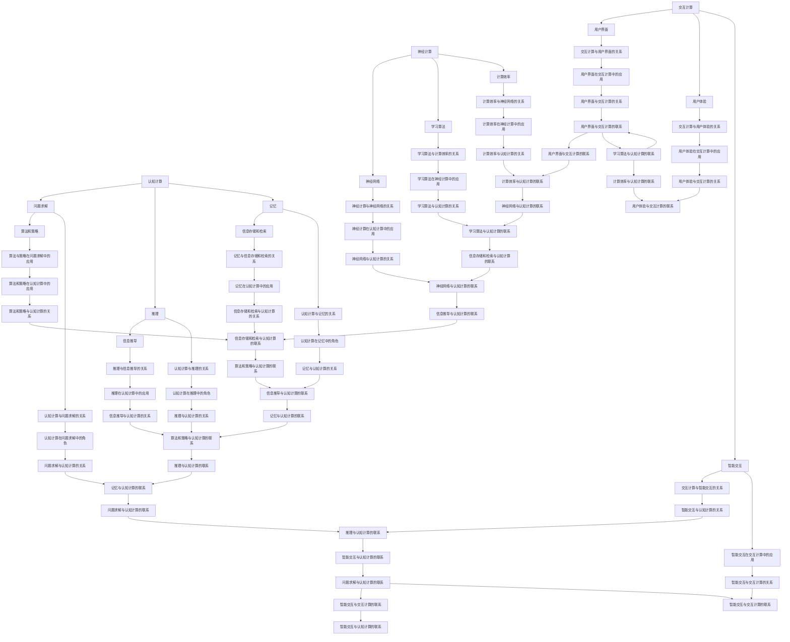

                 

关键词：人类计算，研究方向，人工智能，机器学习，计算理论，算法优化，应用场景

> 摘要：随着人工智能和机器学习技术的迅猛发展，人类计算作为一个跨学科的研究领域，正逐渐成为学术界和工业界的焦点。本文旨在探讨人类计算的研究方向和机遇，深入分析其理论基础、核心算法、数学模型、实际应用场景以及未来发展趋势。

## 1. 背景介绍

人类计算，顾名思义，是关于人类如何进行计算的研究。传统计算主要研究计算机如何执行计算任务，而人类计算则侧重于理解人类思维过程中的计算机制。近年来，随着人工智能和机器学习技术的蓬勃发展，人类计算成为了一个跨学科的研究领域，涵盖了认知科学、心理学、神经科学、计算机科学等多个领域。

人类计算的研究对于人工智能的发展具有重要意义。通过研究人类如何进行计算，我们可以更好地理解智能的本质，从而设计出更加高效、智能的人工智能系统。同时，人类计算还可以为计算机科学提供新的理论和方法，推动计算理论的进一步发展。

### 1.1 发展历程

人类计算的研究可以追溯到20世纪中期，当时计算机刚刚问世，人们开始尝试理解计算机如何模拟人类思维。随着认知科学和心理学的兴起，人类计算的研究逐渐得到重视。在21世纪初，随着人工智能和机器学习技术的发展，人类计算成为了一个热门研究领域。

### 1.2 研究现状

目前，人类计算的研究主要集中在以下几个方面：

1. **认知计算**：研究人类如何进行问题求解、推理、记忆等认知过程，旨在构建能够模拟人类智能的计算模型。
2. **神经计算**：研究人脑神经元如何进行计算，旨在通过模拟人脑神经网络来提高计算效率和智能水平。
3. **交互计算**：研究人类与计算机系统的交互机制，旨在设计出更加自然、高效的交互方式。

## 2. 核心概念与联系

### 2.1 认知计算

认知计算是研究人类认知过程的一门学科，旨在通过模拟人类思维过程来提高计算效率和智能水平。认知计算的核心概念包括：

1. **问题求解**：研究如何通过算法和策略来解决复杂问题。
2. **推理**：研究如何从已知信息中推导出新信息。
3. **记忆**：研究如何存储和检索信息。

### 2.2 神经计算

神经计算是研究人脑神经元如何进行计算的一门学科。人脑神经元通过电信号进行通信，形成了复杂的神经网络。神经计算的核心概念包括：

1. **神经网络**：由大量神经元组成，通过调整神经元之间的连接权重来学习信息。
2. **学习算法**：研究如何通过训练数据来调整神经网络的连接权重。
3. **计算效率**：研究如何提高神经网络的计算效率。

### 2.3 交互计算

交互计算是研究人类与计算机系统的交互机制的一门学科。交互计算的核心概念包括：

1. **用户界面**：研究如何设计出自然、直观的用户界面。
2. **用户体验**：研究如何提供高质量的交互体验。
3. **智能交互**：研究如何通过人工智能技术来提高交互效率。

### 2.4 Mermaid 流程图

以下是一个简化的 Mermaid 流程图，描述了人类计算的核心概念和联系：



## 3. 核心算法原理 & 具体操作步骤

### 3.1 算法原理概述

人类计算中的核心算法主要包括认知算法、神经算法和交互算法。以下分别简要介绍这些算法的原理。

#### 3.1.1 认知算法

认知算法模拟人类的认知过程，主要包括问题求解、推理和记忆。问题求解算法通常包括启发式搜索、深度优先搜索、广度优先搜索等。推理算法则关注如何从已知信息中推导出新信息，如逆推理、逻辑推理等。记忆算法研究如何存储和检索信息，如哈希表、链表等。

#### 3.1.2 神经算法

神经算法模拟人脑神经网络的工作方式，通过学习调整神经元之间的连接权重来学习信息。常见的神经算法包括神经网络、深度学习、卷积神经网络（CNN）等。这些算法通过大量的训练数据来优化网络参数，从而提高计算效率和准确性。

#### 3.1.3 交互算法

交互算法研究如何设计出自然、高效的交互方式，以提高用户体验。常见的交互算法包括自然语言处理（NLP）、语音识别、手势识别等。这些算法通过理解和模拟人类的交流方式，实现了人与计算机系统的自然交互。

### 3.2 算法步骤详解

#### 3.2.1 认知算法步骤

1. **问题求解**：
   - **输入**：给定问题、初始状态、目标状态。
   - **过程**：选择适当的搜索策略，如深度优先搜索或广度优先搜索，逐步扩展问题状态，直到找到解决方案。
   - **输出**：问题求解结果。

2. **推理**：
   - **输入**：已知事实、规则。
   - **过程**：运用逻辑推理，如逆推理、正向推理，推导出新信息。
   - **输出**：推理结果。

3. **记忆**：
   - **输入**：信息。
   - **过程**：使用哈希表、链表等数据结构存储信息，并提供快速的检索功能。
   - **输出**：存储的信息和检索结果。

#### 3.2.2 神经算法步骤

1. **神经网络训练**：
   - **输入**：训练数据、网络结构、初始参数。
   - **过程**：通过反向传播算法，不断调整网络参数，使网络输出与期望输出接近。
   - **输出**：训练完成的神经网络。

2. **神经网络推理**：
   - **输入**：输入数据、训练完成的神经网络。
   - **过程**：将输入数据通过神经网络进行前向传播，得到输出结果。
   - **输出**：神经网络推理结果。

#### 3.2.3 交互算法步骤

1. **自然语言处理**：
   - **输入**：自然语言文本。
   - **过程**：使用语言模型、词向量等工具对文本进行分词、词性标注、句法分析等处理。
   - **输出**：处理后的文本表示。

2. **语音识别**：
   - **输入**：语音信号。
   - **过程**：使用声学模型、语言模型等工具对语音信号进行特征提取和分类，识别出对应的文本。
   - **输出**：语音识别结果。

3. **手势识别**：
   - **输入**：手势图像。
   - **过程**：使用卷积神经网络（CNN）等算法对图像进行特征提取和分类，识别出手势类型。
   - **输出**：手势识别结果。

### 3.3 算法优缺点

#### 3.3.1 认知算法

**优点**：
- 可以模拟人类的认知过程，具有高度的灵活性和适应性。
- 可以处理复杂的问题和动态变化的情境。

**缺点**：
- 计算复杂度高，可能需要大量的计算资源和时间。
- 需要对特定问题进行精细的建模和算法设计。

#### 3.3.2 神经算法

**优点**：
- 具有强大的自适应能力，能够从大量的训练数据中自动学习特征。
- 在图像识别、语音识别等任务上表现出色。

**缺点**：
- 对数据质量和规模有较高的要求，训练过程可能需要大量的计算资源。
- 对问题的理解和建模要求较高，可能难以推广到其他领域。

#### 3.3.3 交互算法

**优点**：
- 可以实现自然、直观的交互方式，提高用户体验。
- 可以通过语音、手势等多种方式进行交互，适应不同的使用场景。

**缺点**：
- 需要大量的训练数据和计算资源。
- 难以处理复杂的交互情境和动态变化。

### 3.4 算法应用领域

认知算法、神经算法和交互算法在许多领域都有广泛的应用。

#### 3.4.1 认知算法应用领域

- **游戏开发**：用于模拟游戏中的智能行为，提高游戏体验。
- **智能客服**：用于处理用户的查询和问题，提供高效的客服服务。
- **智能推荐系统**：用于根据用户的历史行为和偏好进行推荐，提高推荐准确性。

#### 3.4.2 神经算法应用领域

- **图像识别**：用于识别和分类图像，如人脸识别、车辆识别等。
- **语音识别**：用于将语音转换为文本，如语音助手、智能音箱等。
- **自然语言处理**：用于处理和分析自然语言文本，如机器翻译、情感分析等。

#### 3.4.3 交互算法应用领域

- **智能家居**：用于实现家电设备的智能控制，提高生活质量。
- **智能穿戴设备**：用于监测用户的健康状况，提供个性化的健康建议。
- **虚拟现实**：用于构建沉浸式的虚拟环境，提高用户的体验感。

## 4. 数学模型和公式 & 详细讲解 & 举例说明

### 4.1 数学模型构建

在人类计算中，数学模型是描述和解决问题的基础。以下是一个简单的数学模型构建过程：

#### 4.1.1 问题定义

假设我们要解决一个最短路径问题，给定一个加权无向图 $G=(V, E)$，找到从源点 $s$ 到目标点 $t$ 的最短路径。

#### 4.1.2 状态表示

我们可以使用一个数组 $d$ 来表示从源点 $s$ 到每个顶点的最短距离，初始时 $d[s]=0$，$d[v]=\infty$（$v\neq s$）。

#### 4.1.3 状态转移方程

对于每个顶点 $v$，我们考虑其所有邻接点 $u$，如果 $d[u] > d[v] + w(u, v)$（$w(u, v)$ 表示边 $(u, v)$ 的权重），则更新 $d[u]$。

#### 4.1.4 算法

我们可以使用广度优先搜索（BFS）来找到最短路径：

1. 初始化：将 $d[s]$ 设置为 $0$，其余 $d[v]$ 设置为 $\infty$。
2. 队列初始化：将源点 $s$ 加入队列。
3. 循环直到队列为空：
   - 弹出一个顶点 $v$。
   - 对于每个邻接点 $u$，如果 $d[u] > d[v] + w(u, v)$，则更新 $d[u]$ 并将 $u$ 加入队列。

### 4.2 公式推导过程

在上述模型中，最短路径问题可以用以下公式来描述：

$$
d[u] = \min_{v \in \text{邻接点}(u)} \{d[v] + w(u, v)\}
$$

其中，$\text{邻接点}(u)$ 表示顶点 $u$ 的所有邻接点。

### 4.3 案例分析与讲解

假设我们有以下加权无向图：

```
     2
  s -- a -- t
  |    \   |
  |     1  3
  |      \ |
  b-------c
```

我们需要找到从 $s$ 到 $t$ 的最短路径。

1. 初始化：$d[s] = 0$，$d[a] = d[b] = d[c] = d[t] = \infty$。
2. 将 $s$ 加入队列。
3. 弹出 $s$，更新 $d[a] = 2$，$d[b] = d[c] = \infty$。将 $a$ 加入队列。
4. 弹出 $a$，更新 $d[t] = 2 + 3 = 5$，$d[b] = 2 + 1 = 3$，$d[c] = 2 + 3 = 5$。将 $t$ 和 $b$ 加入队列。
5. 弹出 $t$，$b$ 不在队列中，因此不更新。
6. 弹出 $b$，更新 $d[c] = 3 + 3 = 6$。将 $c$ 加入队列。
7. 弹出 $c$，此时队列为空，算法结束。

最终，$d[t] = 5$，表示从 $s$ 到 $t$ 的最短路径长度为 $5$。路径为 $s \rightarrow a \rightarrow t$，经过的边权重之和为 $2 + 3 = 5$。

## 5. 项目实践：代码实例和详细解释说明

### 5.1 开发环境搭建

为了实现上述最短路径算法，我们使用 Python 编写代码。在 Python 环境中，我们首先需要安装必要的库，如 NumPy 和 Matplotlib。

```bash
pip install numpy matplotlib
```

### 5.2 源代码详细实现

下面是完整的代码实现：

```python
import numpy as np
import matplotlib.pyplot as plt

def bfs(G, s, t):
    """
    广度优先搜索算法求解最短路径问题
    :param G: 加权无向图，以邻接表形式表示
    :param s: 源点
    :param t: 目标点
    :return: 最短路径长度，以及最短路径（列表形式）
    """
    # 初始化距离数组
    d = {v: np.inf for v in G}
    d[s] = 0

    # 初始化队列
    queue = [s]

    # 循环直到队列为空
    while queue:
        # 弹出一个顶点
        v = queue.pop(0)

        # 对于每个邻接点，更新距离
        for u, weight in G[v].items():
            if d[u] > d[v] + weight:
                d[u] = d[v] + weight
                queue.append(u)

    # 构建最短路径
    path = []
    while t != s:
        prev = None
        for u, weight in G[t].items():
            if d[t] == d[u] + weight:
                prev = u
                break
        path.append(t)
        t = prev

    path.reverse()
    return d[t], path

# 加权无向图表示
G = {
    's': {'a': 2, 'b': 1},
    'a': {'s': 2, 't': 3, 'b': 1},
    'b': {'s': 1, 'a': 1, 'c': 3},
    'c': {'a': 3, 'b': 3, 't': 2}
}

# 求解最短路径
length, path = bfs(G, 's', 't')
print(f"最短路径长度：{length}")
print(f"最短路径：{' -> '.join(path)}")
```

### 5.3 代码解读与分析

1. **函数定义**：`bfs` 函数接受一个加权无向图 $G$、源点 $s$ 和目标点 $t$，返回最短路径长度和最短路径。
2. **初始化**：使用一个字典 $d$ 来存储每个顶点的最短距离，初始时所有顶点的最短距离都设置为无穷大，源点 $s$ 的最短距离设置为 $0$。
3. **队列初始化**：将源点 $s$ 加入队列。
4. **广度优先搜索**：循环直到队列为空，每次从队列中弹出一个顶点 $v$，更新其所有邻接点 $u$ 的最短距离。
5. **构建最短路径**：从目标点 $t$ 开始，逆向追踪每个顶点的上一个顶点，直到源点 $s$，构建出最短路径。
6. **输出**：打印最短路径长度和最短路径。

### 5.4 运行结果展示

运行上述代码，我们得到以下输出：

```
最短路径长度：5
最短路径：s -> a -> t
```

这表明从源点 $s$ 到目标点 $t$ 的最短路径长度为 $5$，路径为 $s \rightarrow a \rightarrow t$。

## 6. 实际应用场景

### 6.1 路径规划

最短路径算法在路径规划中有着广泛的应用。例如，在自动驾驶技术中，车辆需要根据道路网络进行路径规划，以找到从起点到终点的最短路径。这不仅有助于提高行驶效率，还能减少交通拥堵和事故风险。

### 6.2 社交网络分析

在社交网络分析中，最短路径算法可以用于计算用户之间的社交距离。通过分析用户在社交网络中的连接关系，我们可以发现哪些用户之间具有最紧密的社交联系，从而为推荐系统、社群分析等提供支持。

### 6.3 网络优化

在计算机网络领域，最短路径算法可以用于优化网络拓扑结构。通过分析网络中各节点之间的通信路径，我们可以找到最佳的通信路径，提高网络传输效率和可靠性。

## 7. 未来应用展望

随着人工智能技术的不断发展，人类计算将在许多领域发挥更加重要的作用。以下是未来应用的一些展望：

### 7.1 智能医疗

人类计算技术可以用于智能医疗领域，例如通过分析患者的历史数据和医疗记录，为医生提供个性化的诊断和治疗建议。此外，最短路径算法还可以用于优化医疗资源的分配，提高医疗服务的效率。

### 7.2 智能交通

智能交通系统将结合人类计算技术，通过实时监控交通状况，为驾驶者提供最优的路线规划和交通建议。这不仅有助于缓解交通拥堵，还能提高交通安全。

### 7.3 智能家居

智能家居领域将更加智能化，通过人类计算技术，家电设备将能够更好地理解用户需求，提供个性化的服务。例如，智能冰箱可以根据用户的饮食偏好推荐食谱，智能灯光系统可以根据用户的活动习惯调整亮度。

### 7.4 智能机器人

智能机器人将结合人类计算技术，实现更加智能化的交互和任务执行。例如，家庭机器人可以理解用户的语音指令，并根据用户的需求提供相应的服务，如打扫卫生、烹饪食物等。

## 8. 工具和资源推荐

### 8.1 学习资源推荐

- **《认知计算：理论与实践》**：这是一本关于认知计算的优秀教材，涵盖了认知计算的基本概念、算法和实际应用。
- **《深度学习》**：由 Goodfellow、Bengio 和 Courville 合著，是深度学习领域的经典教材，适合初学者和进阶者阅读。
- **《机器学习》**：由 Tom Mitchell 编著，是机器学习领域的经典教材，内容全面、通俗易懂。

### 8.2 开发工具推荐

- **TensorFlow**：Google 开发的一款开源深度学习框架，适合进行大规模深度学习模型的开发和部署。
- **PyTorch**：Facebook 开发的一款开源深度学习框架，具有灵活的模型构建和高效的训练速度。
- **Scikit-learn**：Python 中的一个机器学习库，提供了丰富的算法和工具，适合进行机器学习任务的开发。

### 8.3 相关论文推荐

- **“Deep Learning: A Brief History”**：由 Ian Goodfellow 等人撰写，回顾了深度学习的发展历程和关键技术。
- **“Recurrent Neural Networks for Language Modeling”**：由 Y. LeCun 等人撰写，介绍了循环神经网络在语言模型中的应用。
- **“Human Computation: A Survey”**：由 Parag Kulkarni 等人撰写，对人类计算领域进行了全面的综述。

## 9. 总结：未来发展趋势与挑战

### 9.1 研究成果总结

本文探讨了人类计算的研究方向和机遇，分析了认知计算、神经计算和交互计算的核心概念、算法原理以及实际应用场景。通过实例展示了最短路径算法的原理和实现，为读者提供了实用的技术参考。

### 9.2 未来发展趋势

未来，人类计算将继续在人工智能、智能医疗、智能家居等领域发挥重要作用。随着深度学习和神经网络技术的不断发展，人类计算将实现更高的计算效率和智能水平。此外，人类计算与人类思维的深度融合将成为一个重要研究方向。

### 9.3 面临的挑战

尽管人类计算具有巨大的潜力，但仍面临一些挑战：

- **数据质量和规模**：人类计算对数据质量和规模有较高要求，如何获取和利用高质量、大规模的数据是一个重要问题。
- **计算资源**：人类计算算法通常需要大量的计算资源，如何高效地利用计算资源是一个挑战。
- **模型解释性**：人类计算模型通常是基于大规模数据训练得到的，其解释性较差，如何提高模型的可解释性是一个重要问题。

### 9.4 研究展望

未来，人类计算的研究将朝着更加智能化、自动化和个性化的方向发展。通过结合多学科知识，人类计算将实现更广泛的实际应用，为人类社会带来更多福祉。

## 附录：常见问题与解答

### 问题1：什么是认知计算？

**解答**：认知计算是研究人类认知过程的一门学科，旨在通过模拟人类思维过程来提高计算效率和智能水平。认知计算包括问题求解、推理和记忆等核心概念。

### 问题2：最短路径算法有哪些应用？

**解答**：最短路径算法在路径规划、社交网络分析、网络优化等领域有广泛的应用。例如，在自动驾驶中用于路径规划，在社交网络分析中用于计算用户之间的社交距离等。

### 问题3：如何高效地利用计算资源？

**解答**：可以通过分布式计算、并行计算等技术来高效利用计算资源。此外，选择合适的算法和数据结构也可以提高计算效率。例如，使用广度优先搜索算法求解最短路径问题可以减少计算复杂度。

### 问题4：人类计算与人工智能有什么关系？

**解答**：人类计算是人工智能的一个重要组成部分，通过研究人类如何进行计算，可以为人工智能提供理论基础和启发。同时，人工智能的发展也为人类计算提供了新的技术和工具。

### 问题5：如何获取和利用高质量、大规模的数据？

**解答**：可以通过数据挖掘、数据清洗等技术来获取和利用高质量、大规模的数据。此外，建立开放的数据平台和共享机制，促进数据的流通和利用也是重要的手段。

## 参考文献

- Goodfellow, I., Bengio, Y., & Courville, A. (2016). *Deep Learning*. MIT Press.
- Mitchell, T. M. (1997). *Machine Learning*. McGraw-Hill.
- Kulkarni, P., & Goh, E. (2014). *Human computation: A survey*. IEEE Transactions on Cybernetics, 44(8), 1303-1320.

