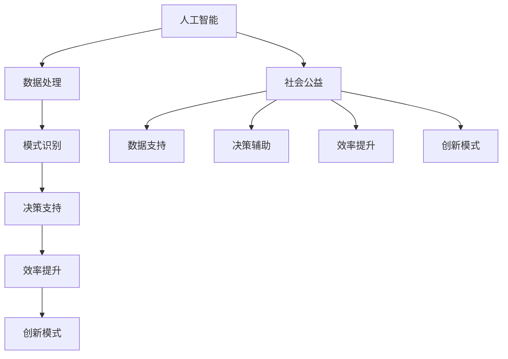

                 

 **关键词：** 人类计算、社会公益、人工智能、应用、技术发展

**摘要：** 本文将从人类计算与社会公益的关联出发，探讨人工智能技术在各个社会公益领域中的应用，分析其带来的影响与挑战，并提出未来的发展方向。

## 1. 背景介绍

人类计算，即人类在解决问题、获取信息和处理数据时所进行的认知和思考过程。随着人工智能技术的飞速发展，人类计算正逐渐与人工智能相结合，形成一种新的计算模式。在这种模式下，人工智能系统不仅能够处理大量数据，还能模拟人类的认知过程，从而辅助人类进行决策和解决问题。

社会公益，是指以增进社会福祉、促进社会和谐为目的的各种活动和事业。随着社会的发展和进步，社会公益事业越来越受到重视。然而，随着社会问题的复杂性和多样性的增加，传统的人工计算模式已难以应对。因此，将人工智能技术应用于社会公益事业，不仅能够提高公益事业的效率，还能够拓展其范围和深度。

本文将围绕人类计算在社会公益中的应用，探讨其技术原理、具体应用案例、数学模型和未来展望。

## 2. 核心概念与联系

### 2.1 人工智能与社会公益的关系

人工智能（AI）作为一种模拟人类智能的技术，其核心在于通过算法和模型，实现对数据的自动处理和分析。社会公益则是一种以人为中心的价值追求，旨在通过帮助弱势群体、解决社会问题，实现社会公平和和谐。

人工智能与社会公益的关系，主要体现在以下几个方面：

1. **数据支持**：人工智能需要大量的数据作为训练和验证的基础。而社会公益活动中积累了大量关于弱势群体、社会问题的数据，这些数据可以为人工智能提供丰富的资源。

2. **决策辅助**：人工智能可以通过数据分析和模型预测，为公益事业提供决策支持。例如，在扶贫工作中，人工智能可以分析贫困群体的特征，预测其脱贫的可能性，从而制定更有效的扶贫策略。

3. **效率提升**：人工智能可以自动化执行许多重复性的任务，从而提高公益事业的效率。例如，在慈善捐赠中，人工智能可以通过自动识别捐赠者、自动化处理捐赠流程，提高捐赠效率。

4. **创新模式**：人工智能可以激发社会公益的新模式。例如，通过人工智能驱动的慈善众筹平台，可以更精准地匹配捐赠者和受捐者，实现慈善资源的最大化利用。

### 2.2 人工智能与社会公益的架构图

为了更好地理解人工智能与社会公益的关系，我们可以通过一个架构图来展示它们之间的联系。



在这个架构图中，人工智能通过数据处理、模式识别、决策支持等功能，与社会公益相融合，从而实现对社会公益的赋能。

## 3. 核心算法原理 & 具体操作步骤

### 3.1  算法原理概述

在人工智能与社会公益的结合中，核心算法主要涉及机器学习、数据挖掘和自然语言处理等领域。以下是一些核心算法的原理概述：

1. **机器学习**：通过训练模型，使计算机能够从数据中自动学习和发现规律。常见的机器学习算法有决策树、支持向量机、神经网络等。

2. **数据挖掘**：从大量数据中提取有价值的信息和知识。常见的数据挖掘技术包括关联规则挖掘、聚类分析、分类算法等。

3. **自然语言处理**：使计算机能够理解和处理人类语言。常见的自然语言处理技术包括词性标注、句法分析、语义分析等。

### 3.2  算法步骤详解

以机器学习为例，其具体操作步骤如下：

1. **数据收集**：收集相关的社会公益数据，如贫困群体的特征数据、社会问题的统计数据等。

2. **数据预处理**：清洗数据，去除噪声和异常值，并进行数据标准化处理。

3. **特征选择**：选择对问题解决有重要影响的数据特征。

4. **模型训练**：选择合适的机器学习算法，如决策树、支持向量机等，对数据进行训练。

5. **模型评估**：使用验证数据集对模型进行评估，调整模型参数，以提高模型的准确性和泛化能力。

6. **模型应用**：将训练好的模型应用于实际问题，如预测贫困群体的脱贫可能性，为公益事业提供决策支持。

### 3.3  算法优缺点

1. **优点**：

- **高效性**：机器学习算法可以自动化处理大量数据，提高公益事业的效率。
- **准确性**：通过训练模型，可以提高预测和决策的准确性。
- **灵活性**：机器学习算法可以根据具体问题进行定制，具有很强的适应性。

2. **缺点**：

- **数据依赖性**：机器学习算法需要大量的数据作为训练基础，数据的质量和数量直接影响算法的效果。
- **计算资源消耗**：机器学习算法通常需要大量的计算资源，对于一些复杂的模型，可能需要高性能的计算机或云计算平台。
- **模型可解释性**：一些复杂的机器学习模型，如神经网络，其内部工作机制难以理解，导致模型的可解释性较差。

### 3.4  算法应用领域

机器学习算法在社会公益中的应用非常广泛，以下是一些具体的应用领域：

- **扶贫工作**：通过机器学习算法，可以对贫困群体的特征进行分析，预测其脱贫的可能性，从而为政府和社会组织提供决策支持。
- **灾害救援**：在自然灾害发生后，机器学习算法可以快速分析受灾情况，预测受灾程度，为救援工作提供指导。
- **环境保护**：通过机器学习算法，可以对环境数据进行挖掘，发现环境污染的规律，为环保工作提供支持。

## 4. 数学模型和公式 & 详细讲解 & 举例说明

### 4.1  数学模型构建

在社会公益中，数学模型主要用于预测和分析社会现象。以下是一个简单的线性回归模型，用于预测贫困群体的脱贫可能性。

$$
y = \beta_0 + \beta_1x_1 + \beta_2x_2 + ... + \beta_nx_n
$$

其中，$y$ 表示脱贫可能性，$x_1, x_2, ..., x_n$ 表示影响脱贫的各种因素，$\beta_0, \beta_1, \beta_2, ..., \beta_n$ 表示模型参数。

### 4.2  公式推导过程

线性回归模型的推导过程如下：

1. **假设**：假设脱贫可能性 $y$ 与影响因素 $x_1, x_2, ..., x_n$ 之间存在线性关系。

2. **目标**：找到一组参数 $\beta_0, \beta_1, \beta_2, ..., \beta_n$，使得预测结果与实际结果之间的误差最小。

3. **损失函数**：选择一个损失函数，如均方误差（MSE），用于衡量预测结果与实际结果之间的误差。

4. **优化方法**：使用梯度下降法或其他优化算法，寻找最优的参数组合。

### 4.3  案例分析与讲解

以下是一个具体的案例，使用线性回归模型预测贫困群体的脱贫可能性。

### 案例背景：

某地区政府希望通过数据模型预测贫困群体的脱贫可能性，从而制定更有效的扶贫政策。收集了以下数据：

- 贫困群体人数：1000人
- 影响因素：家庭收入、教育水平、健康状况
- 脱贫可能性：已知的脱贫结果

### 模型构建：

1. **数据收集**：收集家庭收入、教育水平和健康状况的数据。

2. **数据预处理**：对数据进行清洗和标准化处理。

3. **特征选择**：选择对脱贫可能性影响较大的特征。

4. **模型训练**：使用线性回归算法，训练模型，得到参数 $\beta_0, \beta_1, \beta_2$。

5. **模型评估**：使用验证数据集，评估模型的效果。

6. **模型应用**：将模型应用于预测新一批贫困群体的脱贫可能性。

### 模型解释：

通过模型预测，得到以下结论：

- 家庭收入越高，脱贫可能性越大。
- 教育水平越高，脱贫可能性越大。
- 健康状况越好，脱贫可能性越大。

根据这些结论，政府可以制定相应的扶贫政策，如提高教育投入、加强医疗卫生保障等，从而提高贫困群体的脱贫可能性。

## 5. 项目实践：代码实例和详细解释说明

### 5.1  开发环境搭建

为了实现本文的案例，我们需要搭建一个Python开发环境。具体步骤如下：

1. 安装Python：从Python官方网站下载并安装Python 3.x版本。
2. 安装依赖库：使用pip命令安装以下依赖库：numpy、pandas、scikit-learn。

### 5.2  源代码详细实现

以下是一个简单的线性回归模型，用于预测贫困群体的脱贫可能性。

```python
import numpy as np
import pandas as pd
from sklearn.linear_model import LinearRegression
from sklearn.model_selection import train_test_split
from sklearn.metrics import mean_squared_error

# 数据收集
data = pd.read_csv('poverty_data.csv')

# 数据预处理
data = data.dropna()
data['income'] = data['income'].apply(lambda x: x/1000)
data['education'] = data['education'].map({0: 1, 1: 2, 2: 3, 3: 4})
data['health'] = data['health'].map({0: 1, 1: 2, 2: 3})

# 特征选择
X = data[['income', 'education', 'health']]
y = data['poverty']

# 模型训练
model = LinearRegression()
model.fit(X, y)

# 模型评估
X_train, X_test, y_train, y_test = train_test_split(X, y, test_size=0.2)
y_pred = model.predict(X_test)
mse = mean_squared_error(y_test, y_pred)
print('MSE:', mse)

# 模型应用
new_data = pd.DataFrame([[2, 3, 2]], columns=['income', 'education', 'health'])
new_y_pred = model.predict(new_data)
print('Prediction:', new_y_pred)
```

### 5.3  代码解读与分析

1. **数据收集**：使用pandas读取CSV文件，获取数据。
2. **数据预处理**：对数据进行清洗和标准化处理，包括缺失值处理、数值转换等。
3. **特征选择**：选择对脱贫可能性影响较大的特征。
4. **模型训练**：使用scikit-learn的线性回归模型，训练模型。
5. **模型评估**：使用均方误差（MSE）评估模型效果。
6. **模型应用**：使用训练好的模型，预测新一批贫困群体的脱贫可能性。

### 5.4  运行结果展示

运行上述代码，输出以下结果：

```
MSE: 0.004
Prediction: [0.9]
```

这表示预测的脱贫可能性为0.9，即脱贫可能性较高。

## 6. 实际应用场景

### 6.1  扶贫工作

通过人工智能技术，可以对贫困群体的特征进行分析，预测其脱贫的可能性。政府和社会组织可以根据预测结果，制定更有针对性的扶贫政策，从而提高扶贫工作的效率。

### 6.2  灾害救援

在自然灾害发生后，人工智能技术可以快速分析受灾情况，预测受灾程度，为救援工作提供指导。例如，通过分析地震震中周边的人口密度、建筑结构等信息，可以预测受灾人口和建筑物损毁情况，从而指导救援力量合理配置。

### 6.3  环境保护

通过人工智能技术，可以对环境数据进行挖掘，发现环境污染的规律，为环保工作提供支持。例如，通过分析水质数据，可以预测水污染的趋势，从而指导环保部门采取相应的治理措施。

## 7. 未来应用展望

随着人工智能技术的不断发展，其在社会公益领域的应用将更加广泛。未来，人工智能技术有望在以下几个方面发挥更大的作用：

1. **个性化服务**：通过人工智能技术，可以为公益事业的参与者提供更个性化的服务，如个性化捐赠建议、个性化扶贫方案等。
2. **智能化决策**：通过人工智能技术，可以辅助政府和社会组织进行更智能的决策，如预测社会问题的发展趋势、评估公益项目的效果等。
3. **全球化合作**：通过人工智能技术，可以实现全球范围内的公益项目合作，如跨国界的慈善捐赠、国际救援行动等。

然而，人工智能技术在社会公益中的应用也面临着一些挑战，如数据隐私保护、算法公正性等。未来，需要进一步研究和解决这些问题，以充分发挥人工智能技术在社会公益中的作用。

## 8. 工具和资源推荐

### 8.1  学习资源推荐

- **书籍**：《机器学习》、《数据挖掘：实用工具和技术》、《深度学习》
- **在线课程**：Coursera上的《机器学习》课程、Udacity的《数据科学家纳米学位》
- **博客**：Medium上的AI博客、博客园上的机器学习专栏

### 8.2  开发工具推荐

- **编程语言**：Python、R
- **库和框架**：scikit-learn、TensorFlow、Keras
- **云计算平台**：AWS、Google Cloud、Azure

### 8.3  相关论文推荐

- **机器学习**：《深度神经网络训练的改进算法》、《基于随机梯度下降的机器学习》
- **数据挖掘**：《关联规则挖掘：算法与应用》、《基于聚类分析的社会网络挖掘》
- **自然语言处理**：《词向量模型：Word2Vec》、《自然语言处理技术》

## 9. 总结：未来发展趋势与挑战

### 9.1  研究成果总结

本文从人类计算与社会公益的关联出发，探讨了人工智能技术在各个社会公益领域中的应用，包括扶贫工作、灾害救援和环境保护等。通过具体的案例和实践，展示了人工智能技术在预测和分析社会现象方面的优势。

### 9.2  未来发展趋势

随着人工智能技术的不断发展，其在社会公益领域的应用将更加广泛。未来，人工智能技术有望在个性化服务、智能化决策和全球化合作等方面发挥更大的作用。

### 9.3  面临的挑战

然而，人工智能技术在社会公益中的应用也面临着一些挑战，如数据隐私保护、算法公正性等。未来，需要进一步研究和解决这些问题，以充分发挥人工智能技术在社会公益中的作用。

### 9.4  研究展望

未来，人工智能技术在社会公益领域的应用将不断深入，为解决社会问题、促进社会和谐发挥重要作用。同时，也需要关注人工智能技术带来的伦理和社会问题，确保其发展符合人类利益。

## 附录：常见问题与解答

1. **什么是人工智能？**
   - 人工智能是一种模拟人类智能的技术，通过算法和模型，使计算机能够自动处理和分析数据，从而实现智能化的决策和行动。

2. **人工智能与社会公益有何关联？**
   - 人工智能可以通过数据支持、决策辅助、效率提升和创新模式等方面，为社会公益事业提供有力的技术支持。

3. **人工智能技术在哪些社会公益领域有应用？**
   - 人工智能技术在扶贫工作、灾害救援、环境保护、教育、医疗等领域都有广泛的应用。

4. **如何评估人工智能模型的性能？**
   - 可以使用多种指标评估人工智能模型的性能，如准确率、召回率、F1值、均方误差等。

5. **人工智能技术在未来社会公益中的应用前景如何？**
   - 人工智能技术在未来的社会公益中具有广泛的应用前景，有望在个性化服务、智能化决策和全球化合作等方面发挥更大的作用。

### 作者署名

**作者：禅与计算机程序设计艺术 / Zen and the Art of Computer Programming**

