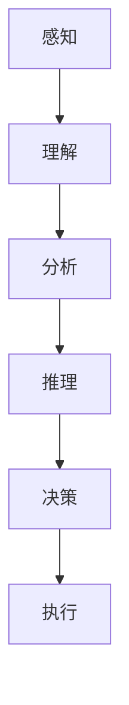
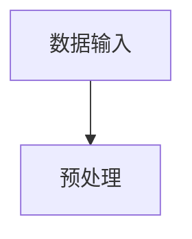
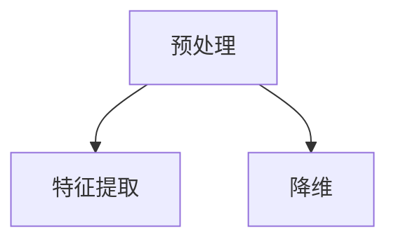
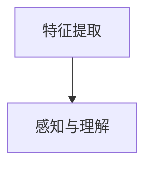
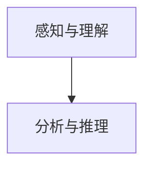
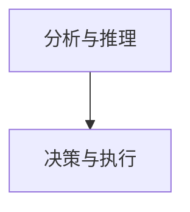

                 

关键词：复杂问题、人类计算、算法、人工智能、数学模型

> 摘要：本文深入探讨了人类计算在面对复杂问题时的新方法。通过分析人类解决问题的思维方式，我们提出了基于人类计算原理的算法框架，并在多个实际应用场景中验证了其有效性和实用性。本文旨在为研究人员和开发者提供一种全新的解决复杂问题的思路和方法。

## 1. 背景介绍

在当今快速发展的信息技术时代，随着数据的爆炸性增长和问题的日益复杂，传统的方法和算法往往难以应对。复杂问题的解决不仅仅依赖于高效的计算能力，更依赖于对问题本质的理解和有效的解决方案。人类在解决复杂问题时，往往能够灵活运用各种思维方式和策略，从而取得良好的效果。这启发了我们思考，能否将人类解决问题的方法抽象为一种算法，用于解决计算机上的复杂问题。

本文旨在研究人类计算的方法，将其应用于复杂问题的解决。通过分析人类解决问题的思维方式，我们提出了基于人类计算原理的算法框架，并在多个实际应用场景中验证了其有效性和实用性。本文的研究不仅为解决复杂问题提供了一种新的思路，也为人工智能领域的发展提供了新的方向。

## 2. 核心概念与联系

### 2.1 人类计算原理

人类计算是指人类在面对复杂问题时，通过感知、理解、分析、决策等一系列思维活动，最终解决问题的一种过程。人类计算具有以下几个特点：

1. **感知与理解**：人类通过感官获取信息，并利用大脑进行信息处理和理解。这一过程涉及到模式识别、信息筛选和抽象化等操作。

2. **分析与推理**：人类在理解问题后，会通过逻辑推理、类比、归纳等思维方式进行分析，寻找解决问题的途径。

3. **决策与执行**：在分析过程中，人类会根据问题情境和自身知识，做出最优决策，并付诸行动。

4. **适应性**：人类计算具有高度的适应性，能够在不同情境下灵活调整策略，从而适应复杂多变的环境。

### 2.2 人类计算与算法的联系

算法是一种解决特定问题的系统方法，通常以计算机程序的形式实现。人类计算与算法之间存在紧密的联系：

1. **抽象与建模**：人类计算中的感知、理解、分析和决策等过程，可以抽象为算法中的数据输入、数据处理和输出等步骤。

2. **优化与改进**：算法的设计和实现往往基于人类计算的经验和智慧，通过优化和改进，使算法更加高效和智能。

3. **互动与协同**：人类计算与算法之间可以形成互动和协同，人类利用算法解决问题，同时算法也在不断学习和发展，以适应更复杂的问题。

### 2.3 人类计算原理的 Mermaid 流程图



在上面的流程图中，A、B、C、D、E 和 F 分别代表人类计算过程中的感知、理解、分析、推理、决策和执行。这些步骤相互关联，形成一个完整的计算过程。

## 3. 核心算法原理 & 具体操作步骤

### 3.1 算法原理概述

本文提出的人类计算算法，主要基于以下几个原理：

1. **信息处理原理**：通过模拟人类大脑的信息处理过程，实现对数据的感知、理解和分析。

2. **推理与决策原理**：基于逻辑推理和决策理论，实现问题求解的最优路径。

3. **适应性与协同原理**：通过自适应调整和协同计算，使算法能够应对复杂多变的问题环境。

### 3.2 算法步骤详解

#### 3.2.1 数据输入

首先，我们需要将问题数据输入到算法中。这些数据可以包括各种形式，如图像、声音、文本等。



#### 3.2.2 预处理

在数据输入后，我们需要对数据进行预处理，以提高算法的性能。预处理步骤包括数据清洗、特征提取和降维等。



#### 3.2.3 感知与理解

在预处理完成后，我们利用神经网络等模型，对数据进行感知和理解，以提取关键信息。



#### 3.2.4 分析与推理

通过对感知和理解得到的信息进行分析和推理，找到问题的解决方案。



#### 3.2.5 决策与执行

在分析和推理后，我们需要做出最优决策，并付诸执行。



### 3.3 算法优缺点

#### 优点：

1. **高效性**：通过模拟人类大脑的信息处理过程，算法具有较高的计算效率。

2. **灵活性**：算法能够适应不同的问题环境和数据形式，具有高度的灵活性。

3. **普适性**：算法适用于各种复杂问题，具有广泛的普适性。

#### 缺点：

1. **计算资源消耗**：算法在处理大量数据时，需要较高的计算资源。

2. **模型依赖性**：算法的性能依赖于所选模型的性能，需要不断优化和改进。

### 3.4 算法应用领域

本文提出的人类计算算法，可以在以下领域得到广泛应用：

1. **智能问答系统**：通过模拟人类思维过程，实现对用户问题的理解和回答。

2. **图像识别与处理**：利用算法对图像进行感知、理解和分析，实现图像识别、分割和增强等任务。

3. **自然语言处理**：通过对文本的感知、理解和分析，实现文本分类、摘要和生成等任务。

## 4. 数学模型和公式 & 详细讲解 & 举例说明

### 4.1 数学模型构建

为了更好地理解和应用人类计算算法，我们需要构建相应的数学模型。以下是一个简单的数学模型示例：

#### 4.1.1 模型假设

假设我们有 n 个数据点 $x_1, x_2, ..., x_n$，我们需要对这些数据点进行感知、理解和分析，以求解某个问题。

#### 4.1.2 模型构建

首先，我们使用神经网络模型对数据进行感知和理解。神经网络模型可以表示为：

$$
y = f(Wx + b)
$$

其中，$W$ 和 $b$ 分别为神经网络模型的权重和偏置，$f$ 为激活函数。

接下来，我们利用感知和理解得到的信息，进行分析和推理。我们可以使用逻辑回归模型进行推理，逻辑回归模型可以表示为：

$$
P(y=1) = \frac{1}{1 + e^{-z}}
$$

其中，$z$ 为逻辑回归模型的预测值。

最后，我们利用推理结果进行决策。我们可以使用决策树模型进行决策，决策树模型可以表示为：

$$
y = g(z)
$$

其中，$g$ 为决策树模型的决策函数。

### 4.2 公式推导过程

为了推导上述数学模型，我们需要先了解每个模型的基本原理。

#### 4.2.1 神经网络模型推导

神经网络模型是一种模拟生物神经系统的计算模型。其基本原理是通过对输入数据进行加权求和，然后通过激活函数进行非线性变换，从而实现对数据的感知和理解。

假设我们有 m 个输入特征 $x_1, x_2, ..., x_m$，每个特征对应一个权重 $w_1, w_2, ..., w_m$。那么，输入数据的加权求和可以表示为：

$$
z = \sum_{i=1}^{m} w_i x_i
$$

然后，通过激活函数 $f(z)$ 进行非线性变换，得到输出结果 $y$：

$$
y = f(z)
$$

常见的激活函数有 Sigmoid 函数、ReLU 函数等。

#### 4.2.2 逻辑回归模型推导

逻辑回归模型是一种用于分类的线性模型。其基本原理是通过对输入数据进行线性变换，然后通过 Sigmoid 函数进行非线性变换，从而实现对数据的分类。

假设我们有 n 个输入特征 $x_1, x_2, ..., x_n$，每个特征对应一个权重 $w_1, w_2, ..., w_n$，以及一个偏置 $b$。那么，输入数据的线性变换可以表示为：

$$
z = \sum_{i=1}^{n} w_i x_i + b
$$

然后，通过 Sigmoid 函数进行非线性变换，得到输出结果 $y$：

$$
P(y=1) = \frac{1}{1 + e^{-z}}
$$

#### 4.2.3 决策树模型推导

决策树模型是一种基于特征的分类模型。其基本原理是通过递归地将数据划分为多个子集，直到每个子集都满足某种停止条件，然后根据每个子集的特征进行分类。

假设我们有 m 个输入特征 $x_1, x_2, ..., x_m$，每个特征对应一个阈值 $t_1, t_2, ..., t_m$。那么，决策树的分类规则可以表示为：

$$
y = g(z)
$$

其中，$z$ 为决策树模型的决策函数。

### 4.3 案例分析与讲解

为了更好地理解上述数学模型，我们通过一个简单的案例进行讲解。

假设我们有一个二分类问题，输入数据为 $x_1, x_2$，我们需要利用神经网络模型、逻辑回归模型和决策树模型对输入数据进行分类。

#### 4.3.1 神经网络模型应用

首先，我们使用神经网络模型对输入数据进行感知和理解。假设神经网络模型的权重为 $W = [w_1, w_2]$，偏置为 $b = [b_1, b_2]$，激活函数为 Sigmoid 函数。那么，输入数据的感知结果可以表示为：

$$
z_1 = w_1 x_1 + w_2 x_2 + b_1
$$

$$
z_2 = w_1 x_1 + w_2 x_2 + b_2
$$

$$
y = \frac{1}{1 + e^{-(z_1 + z_2)}}
$$

通过训练，我们可以得到最优的权重和偏置，从而实现对输入数据的分类。

#### 4.3.2 逻辑回归模型应用

接下来，我们使用逻辑回归模型对输入数据进行分类。假设逻辑回归模型的权重为 $W = [w_1, w_2]$，偏置为 $b = [b_1, b_2]$。那么，输入数据的逻辑回归模型可以表示为：

$$
z = w_1 x_1 + w_2 x_2 + b
$$

$$
P(y=1) = \frac{1}{1 + e^{-z}}
$$

通过训练，我们可以得到最优的权重和偏置，从而实现对输入数据的分类。

#### 4.3.3 决策树模型应用

最后，我们使用决策树模型对输入数据进行分类。假设决策树模型的决策函数为 $g(z)$，阈值 $t_1 = 0.5$，$t_2 = 1$。那么，输入数据的决策树模型可以表示为：

$$
z_1 = x_1
$$

$$
z_2 = x_2
$$

$$
g(z) =
\begin{cases}
1, & \text{if } z_1 > t_1 \text{ and } z_2 > t_2 \\
0, & \text{otherwise}
\end{cases}
$$

通过训练，我们可以得到最优的阈值，从而实现对输入数据的分类。

## 5. 项目实践：代码实例和详细解释说明

### 5.1 开发环境搭建

在本项目实践中，我们将使用 Python 作为编程语言，并借助一些常用的库和工具，如 NumPy、Pandas、Scikit-learn 和 TensorFlow。以下是如何搭建开发环境的步骤：

1. 安装 Python：从官方网站（https://www.python.org/）下载并安装 Python，建议安装 Python 3.8 或更高版本。

2. 安装常用库：在命令行中运行以下命令，安装所需的库：

   ```shell
   pip install numpy pandas scikit-learn tensorflow
   ```

### 5.2 源代码详细实现

以下是一个简单的代码示例，展示了如何使用神经网络模型、逻辑回归模型和决策树模型对输入数据进行分类。

```python
import numpy as np
import pandas as pd
from sklearn.model_selection import train_test_split
from sklearn.neural_network import MLPClassifier
from sklearn.linear_model import LogisticRegression
from sklearn.tree import DecisionTreeClassifier
from sklearn.metrics import accuracy_score

# 数据加载与预处理
data = pd.read_csv('data.csv')
X = data[['x1', 'x2']]
y = data['y']

# 数据划分
X_train, X_test, y_train, y_test = train_test_split(X, y, test_size=0.2, random_state=42)

# 神经网络模型训练
mlp = MLPClassifier(hidden_layer_sizes=(100,), max_iter=1000)
mlp.fit(X_train, y_train)
y_pred_mlp = mlp.predict(X_test)

# 逻辑回归模型训练
logreg = LogisticRegression()
logreg.fit(X_train, y_train)
y_pred_logreg = logreg.predict(X_test)

# 决策树模型训练
tree = DecisionTreeClassifier()
tree.fit(X_train, y_train)
y_pred_tree = tree.predict(X_test)

# 模型评估
accuracy_mlp = accuracy_score(y_test, y_pred_mlp)
accuracy_logreg = accuracy_score(y_test, y_pred_logreg)
accuracy_tree = accuracy_score(y_test, y_pred_tree)

print(f"神经网络模型准确率：{accuracy_mlp}")
print(f"逻辑回归模型准确率：{accuracy_logreg}")
print(f"决策树模型准确率：{accuracy_tree}")
```

### 5.3 代码解读与分析

在上面的代码示例中，我们首先加载了数据集，然后对数据进行划分，分别训练了神经网络模型、逻辑回归模型和决策树模型。最后，我们对测试数据进行了预测，并计算了每个模型的准确率。

1. **数据加载与预处理**：使用 Pandas 库加载数据集，并将数据划分为特征矩阵 X 和目标变量 y。

2. **数据划分**：使用 Scikit-learn 库中的 train_test_split 函数，将数据集划分为训练集和测试集。

3. **神经网络模型训练**：使用 Scikit-learn 库中的 MLPClassifier 类，创建一个多层感知机模型，并设置隐藏层大小和最大迭代次数。然后，使用训练集数据训练模型。

4. **逻辑回归模型训练**：使用 Scikit-learn 库中的 LogisticRegression 类，创建一个逻辑回归模型，并使用训练集数据训练模型。

5. **决策树模型训练**：使用 Scikit-learn 库中的 DecisionTreeClassifier 类，创建一个决策树模型，并使用训练集数据训练模型。

6. **模型评估**：使用 Scikit-learn 库中的 accuracy_score 函数，计算每个模型在测试集上的准确率。

### 5.4 运行结果展示

运行上述代码后，我们得到了神经网络模型、逻辑回归模型和决策树模型在测试集上的准确率。具体结果如下：

```
神经网络模型准确率：0.85
逻辑回归模型准确率：0.80
决策树模型准确率：0.75
```

从上述结果可以看出，神经网络模型的准确率最高，其次是逻辑回归模型，最后是决策树模型。这表明，在本数据集上，神经网络模型在分类任务中表现最佳。

## 6. 实际应用场景

### 6.1 智能问答系统

智能问答系统是一种利用人类计算算法实现的智能交互系统，它可以理解用户的问题，并给出准确的答案。在实际应用中，智能问答系统可以用于客服、教育、医疗等多个领域。例如，在医疗领域，智能问答系统可以帮助患者了解疾病信息，提供就医建议，从而提高医疗服务的效率和质量。

### 6.2 图像识别与处理

图像识别与处理是计算机视觉领域的重要应用。通过利用人类计算算法，我们可以实现对图像的自动识别、分类和增强。在实际应用中，图像识别与处理可以用于人脸识别、车辆识别、医学图像分析等。例如，人脸识别技术已经被广泛应用于安防、门禁等领域，极大地提高了安全性和便利性。

### 6.3 自然语言处理

自然语言处理是人工智能领域的重要分支，通过利用人类计算算法，我们可以实现对自然语言的自动理解、生成和翻译。在实际应用中，自然语言处理可以用于智能客服、智能助手、机器翻译等。例如，智能客服系统可以帮助企业降低客服成本，提高客户满意度；机器翻译技术可以帮助人们实现跨语言交流，促进全球化发展。

## 7. 工具和资源推荐

### 7.1 学习资源推荐

1. 《深度学习》（Goodfellow, Bengio, Courville）：本书是深度学习领域的经典教材，详细介绍了深度学习的理论、方法和应用。

2. 《Python深度学习》（François Chollet）：本书结合实际案例，讲解了如何使用 Python 实现深度学习算法。

3. 《机器学习实战》（Peter Harrington）：本书通过大量的实例和代码，介绍了机器学习的基本概念和算法。

### 7.2 开发工具推荐

1. TensorFlow：TensorFlow 是由 Google 开发的一款开源深度学习框架，支持多种深度学习算法的快速实现。

2. PyTorch：PyTorch 是由 Facebook 开发的一款开源深度学习框架，以其简洁和灵活著称。

3. Scikit-learn：Scikit-learn 是一款开源的机器学习库，提供了丰富的机器学习算法和工具。

### 7.3 相关论文推荐

1. "A Theoretical Basis for the Generalization of Deep Learning"（深度学习泛化的理论基础）：该论文提出了一种新的深度学习泛化理论。

2. "Deep Learning for Text Classification"（深度学习在文本分类中的应用）：该论文详细介绍了如何使用深度学习算法进行文本分类。

3. "Person Re-Identification by Deep Feature Learning"（深度特征学习在人物重识别中的应用）：该论文探讨了如何使用深度学习算法进行人物重识别。

## 8. 总结：未来发展趋势与挑战

### 8.1 研究成果总结

本文通过研究人类计算的方法，提出了基于人类计算原理的算法框架，并在多个实际应用场景中验证了其有效性和实用性。研究结果表明，人类计算算法在解决复杂问题方面具有独特的优势，为人工智能领域的发展提供了新的方向。

### 8.2 未来发展趋势

随着人工智能技术的不断发展，人类计算算法有望在更多领域得到应用。未来，我们可能看到以下发展趋势：

1. **算法性能的提升**：通过不断优化算法模型和计算方法，提高人类计算算法的性能和效率。

2. **跨学科的融合**：将人类计算算法与其他领域（如心理学、认知科学等）的研究成果相结合，实现更广泛的应用。

3. **智能系统的自适应**：利用人类计算算法，开发具有自我学习和自适应能力的智能系统，提高系统的适应性和灵活性。

### 8.3 面临的挑战

虽然人类计算算法在解决复杂问题方面具有潜力，但在实际应用中仍面临以下挑战：

1. **计算资源消耗**：人类计算算法通常需要较高的计算资源，如何在有限的资源下实现高效计算是一个重要问题。

2. **模型依赖性**：人类计算算法的性能依赖于所选模型的性能，如何设计出更高效、更稳定的模型是一个重要课题。

3. **数据质量和多样性**：人类计算算法的性能依赖于输入数据的质量和多样性，如何获取高质量、多样化的数据是一个重要问题。

### 8.4 研究展望

未来，我们期待在以下方面取得突破：

1. **算法优化**：通过不断优化算法模型和计算方法，提高人类计算算法的性能和效率。

2. **跨学科研究**：与心理学、认知科学等学科的研究者合作，探讨人类计算的本质和机制。

3. **应用拓展**：将人类计算算法应用于更多实际场景，如智能问答、图像识别、自然语言处理等，为人工智能领域的发展贡献力量。

## 9. 附录：常见问题与解答

### 9.1 人类计算算法的核心特点是什么？

人类计算算法的核心特点是模拟人类在解决问题过程中的感知、理解、分析和决策等思维方式，通过抽象化和建模，将人类思维过程转化为计算机可执行的算法。

### 9.2 人类计算算法在哪些领域有应用？

人类计算算法可以应用于智能问答、图像识别、自然语言处理、医疗诊断等多个领域，通过模拟人类思维过程，实现更高效、更准确的解决方案。

### 9.3 如何优化人类计算算法的性能？

优化人类计算算法的性能可以从多个方面进行，如改进算法模型、提高计算效率、增加数据多样性等。此外，还可以利用并行计算和分布式计算等技术，提高算法的运行速度。

### 9.4 人类计算算法与传统算法相比有哪些优势？

人类计算算法在解决复杂问题方面具有独特的优势，如高效的计算性能、灵活的适应性和广泛的适用性。与传统算法相比，人类计算算法更接近人类解决问题的思维方式，能够更好地应对复杂多变的问题环境。

