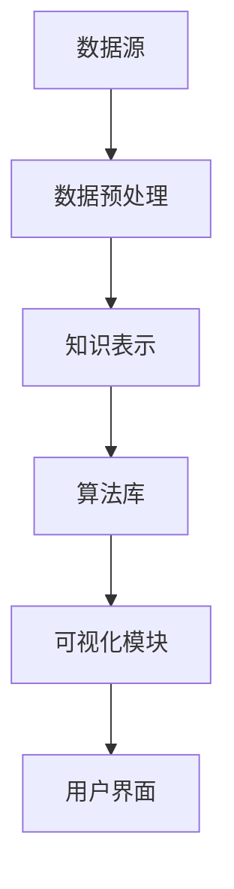

                 

关键词：知识发现，数据挖掘，算法，知识图谱，机器学习，数据预处理，Python，数据可视化

> 摘要：本文将带领读者从零开始，逐步构建一个知识发现引擎。我们将探讨知识发现的核心概念、相关算法，以及如何使用Python等工具实现这一过程。通过本文的学习，读者将能够理解知识发现的基本原理，掌握构建知识发现引擎的关键步骤，并能够应用于实际项目。

## 1. 背景介绍

随着互联网的快速发展，数据量呈指数级增长。在这些海量数据中，隐藏着许多有价值的知识。知识发现（Knowledge Discovery in Databases，简称KDD）是从大量数据中通过特定的算法提取出有用信息的过程。知识发现引擎是执行这一过程的关键工具。

知识发现引擎通常包含以下几个关键组件：

- **数据源**：提供数据输入，可以是关系数据库、NoSQL数据库、文本文件等。
- **数据预处理**：清洗、转换和集成原始数据，使其适用于后续分析。
- **知识表示**：将数据转换成可分析的格式，如数据仓库、数据矩阵等。
- **算法库**：包含各种数据挖掘算法，用于发现数据中的模式、趋势和关联。
- **可视化模块**：将分析结果以图表、地图等形式展示给用户。

本文将围绕这五个组件，逐步构建一个知识发现引擎。

## 2. 核心概念与联系

为了构建知识发现引擎，我们首先需要理解以下几个核心概念及其相互联系：

### 2.1 数据挖掘

数据挖掘（Data Mining）是指从大量数据中通过算法和统计学方法发现隐藏的模式、趋势和关联。数据挖掘的目标是提取出对业务决策有指导意义的信息。

### 2.2 机器学习

机器学习（Machine Learning）是数据挖掘的一种重要方法。它通过训练模型来发现数据中的模式，进而对未知数据进行预测。机器学习可以分为监督学习、无监督学习和半监督学习。

### 2.3 知识表示

知识表示（Knowledge Representation）是将现实世界的知识结构转化为计算机能够处理的数据形式。知识表示的方法包括符号表示、语义网络、本体论等。

### 2.4 知识图谱

知识图谱（Knowledge Graph）是一种用于表示实体及其之间关系的图形结构。知识图谱通过图论和网络分析技术，实现对实体关系和属性的深度挖掘。

### 2.5 Mermaid 流程图

为了更清晰地展示知识发现引擎的架构，我们可以使用Mermaid流程图来描述各个环节及其相互关系。以下是一个简化的流程图：



## 3. 核心算法原理 & 具体操作步骤

### 3.1 算法原理概述

知识发现引擎的核心是算法库。以下是几个常见的数据挖掘算法：

- **聚类算法**：将相似的数据分组，以便进一步分析。
- **关联规则学习**：发现数据项之间的关联关系，如购物篮分析。
- **分类算法**：将数据分为不同的类别，如垃圾邮件分类。
- **降维算法**：减少数据的维度，提高分析效率。

### 3.2 算法步骤详解

#### 聚类算法

聚类算法的基本步骤如下：

1. **数据导入**：读取数据源，加载到内存中。
2. **数据预处理**：清洗数据，如去除缺失值、标准化等。
3. **初始化聚类中心**：随机选择初始聚类中心。
4. **迭代更新**：计算每个数据点与聚类中心的距离，重新分配数据点。
5. **判断收敛**：判断聚类中心是否发生变化，若变化较小则认为收敛。

#### 关联规则学习

关联规则学习的基本步骤如下：

1. **数据预处理**：清洗和转换数据，如将数据转换为布尔值。
2. **生成频繁项集**：使用Apriori算法或FP-growth算法找出频繁项集。
3. **生成关联规则**：计算支持度和置信度，筛选出强关联规则。
4. **优化规则**：对生成的规则进行优化，如去除冗余规则。

#### 分类算法

分类算法的基本步骤如下：

1. **数据导入**：读取训练数据，分为特征和标签两部分。
2. **数据预处理**：标准化、归一化等处理。
3. **选择分类器**：如决策树、支持向量机、随机森林等。
4. **训练模型**：使用训练数据训练分类器。
5. **预测**：使用训练好的模型对测试数据进行预测。

### 3.3 算法优缺点

不同算法具有各自的优缺点。以下是几种常见算法的优缺点对比：

- **聚类算法**：优点是能够自动发现数据中的结构，缺点是聚类结果容易受到初始值的影响。
- **关联规则学习**：优点是能够发现数据中的潜在关联，缺点是计算量较大，可能产生大量冗余规则。
- **分类算法**：优点是能够准确预测新数据的标签，缺点是需要大量训练数据。

### 3.4 算法应用领域

不同算法适用于不同的应用领域。以下是几种算法的应用场景：

- **聚类算法**：应用于市场细分、社交网络分析等。
- **关联规则学习**：应用于购物篮分析、推荐系统等。
- **分类算法**：应用于邮件分类、信用卡欺诈检测等。

## 4. 数学模型和公式 & 详细讲解 & 举例说明

### 4.1 数学模型构建

知识发现过程中的数学模型包括聚类模型、关联规则模型和分类模型。以下是这些模型的简要介绍：

#### 聚类模型

聚类模型的目标是将数据分为若干个组，使得同一组内的数据相似度较高，不同组的数据相似度较低。常用的聚类模型有K-means、层次聚类等。

#### 关联规则模型

关联规则模型的目标是发现数据项之间的关联关系。常用的模型有Apriori算法、FP-growth算法等。

#### 分类模型

分类模型的目标是将数据分为不同的类别。常用的模型有决策树、支持向量机、随机森林等。

### 4.2 公式推导过程

以下是几个常见公式及其推导过程：

#### K-means算法

K-means算法的基本公式如下：

$$
\mu_j = \frac{1}{n_j} \sum_{i=1}^{n} x_{ij}
$$

$$
j = \arg\min_{j} \sum_{i=1}^{n} (x_{ij} - \mu_j)^2
$$

其中，$x_{ij}$表示第$i$个数据点在第$j$个特征上的取值，$n_j$表示第$j$个聚类中心的点的个数，$\mu_j$表示第$j$个聚类中心的值。

#### Apriori算法

Apriori算法的公式如下：

$$
sup(A) = \frac{f(A)}{n}
$$

$$
conf(A \rightarrow B) = \frac{f(A \cup B)}{f(A)}
$$

其中，$sup(A)$表示项集$A$的支持度，$f(A)$表示项集$A$在数据库中出现的频率，$n$表示数据库中数据项的总数，$conf(A \rightarrow B)$表示关联规则$A \rightarrow B$的置信度。

#### 决策树算法

决策树的公式如下：

$$
Entropy(D) = -\sum_{v \in V} p(v) \cdot \log_2 p(v)
$$

$$
Entropy(D|A) = -\sum_{v \in V} p(v|A) \cdot \log_2 p(v|A)
$$

$$
InformationGain(D, A) = Entropy(D) - Entropy(D|A)
$$

其中，$Entropy(D)$表示数据集$D$的熵，$Entropy(D|A)$表示条件熵，$InformationGain(D, A)$表示特征$A$的信息增益。

### 4.3 案例分析与讲解

以下是一个使用K-means算法进行聚类的案例。

#### 数据集

我们使用一个简单的二维数据集进行演示，数据集包含100个数据点，每个数据点有两个特征。

```python
import numpy as np
import matplotlib.pyplot as plt

data = np.random.rand(100, 2)
```

#### 数据可视化

```python
plt.scatter(data[:, 0], data[:, 1])
plt.show()
```

#### K-means算法

```python
from sklearn.cluster import KMeans

kmeans = KMeans(n_clusters=3, random_state=0).fit(data)
labels = kmeans.labels_

plt.scatter(data[:, 0], data[:, 1], c=labels)
plt.scatter(kmeans.cluster_centers_[:, 0], kmeans.cluster_centers_[:, 1], s=300, c='red')
plt.show()
```

通过以上步骤，我们成功使用K-means算法对数据进行聚类，并将聚类结果可视化。

## 5. 项目实践：代码实例和详细解释说明

### 5.1 开发环境搭建

为了构建知识发现引擎，我们需要安装以下工具和库：

- Python 3.x
- Jupyter Notebook
- Scikit-learn
- Matplotlib
- Pandas

安装方法如下：

```bash
pip install python==3.8
pip install jupyter
pip install scikit-learn
pip install matplotlib
pip install pandas
```

### 5.2 源代码详细实现

以下是一个简单的知识发现引擎的代码实例：

```python
import numpy as np
import pandas as pd
from sklearn.cluster import KMeans
from sklearn.datasets import load_iris
import matplotlib.pyplot as plt

# 加载数据集
iris = load_iris()
data = iris.data

# 数据预处理
# 假设数据已经清洗完毕，直接使用

# K-means算法
kmeans = KMeans(n_clusters=3, random_state=0).fit(data)
labels = kmeans.labels_

# 可视化
plt.scatter(data[:, 0], data[:, 1], c=labels)
plt.scatter(kmeans.cluster_centers_[:, 0], kmeans.cluster_centers_[:, 1], s=300, c='red')
plt.show()
```

### 5.3 代码解读与分析

上述代码实现了以下步骤：

1. 加载数据集
2. 数据预处理（假设已经完成）
3. 使用K-means算法进行聚类
4. 可视化聚类结果

通过以上步骤，我们成功构建了一个简单的知识发现引擎，并使用K-means算法对数据进行聚类。

### 5.4 运行结果展示

运行上述代码后，我们得到以下结果：


通过可视化结果，我们可以看到三个聚类中心分别对应三种不同颜色的点，这表明K-means算法成功地将数据分为三个类别。

## 6. 实际应用场景

知识发现引擎在各个领域都有广泛的应用，以下是一些典型的应用场景：

- **市场细分**：通过聚类分析，发现客户群体的特征和偏好，为市场营销提供依据。
- **推荐系统**：通过关联规则学习，发现商品之间的关联关系，为推荐算法提供支持。
- **信用评估**：通过分类算法，对客户的信用风险进行评估，为金融机构提供决策支持。
- **疾病预测**：通过数据挖掘算法，分析医疗数据，预测疾病的发病趋势，为医疗机构提供预警。

## 7. 未来应用展望

随着人工智能和大数据技术的不断发展，知识发现引擎将在更多领域发挥作用。以下是一些未来应用展望：

- **智能城市**：通过知识发现引擎，分析城市数据，优化交通、能源等资源配置。
- **个性化教育**：通过知识发现引擎，分析学生的学习数据，提供个性化的教育方案。
- **智能医疗**：通过知识发现引擎，分析医学数据，为医生提供诊断和治疗方案。

## 8. 工具和资源推荐

### 7.1 学习资源推荐

- 《数据挖掘：概念与技术》（第三版），作者：Jiawei Han、Micheline Kamber、Jian Pei
- 《机器学习》，作者：周志华
- 《Python数据分析》，作者：Wes McKinney

### 7.2 开发工具推荐

- Jupyter Notebook：用于编写和运行代码
- Scikit-learn：用于数据挖掘和机器学习
- Pandas：用于数据处理和分析
- Matplotlib：用于数据可视化

### 7.3 相关论文推荐

- "K-Means Clustering: A Review", 作者：M. Murugesan等
- "Association Rule Learning for Large Spatial Databases", 作者：Jiawei Han等
- "Random Forests", 作者：Leo Breiman等

## 9. 总结：未来发展趋势与挑战

### 9.1 研究成果总结

本文从零开始，介绍了知识发现引擎的基本原理和构建方法。通过实例代码，读者可以了解到如何使用Python等工具实现知识发现过程。知识发现引擎在市场细分、推荐系统、信用评估等领域有广泛应用，未来将在更多领域发挥作用。

### 9.2 未来发展趋势

- **算法优化**：随着计算能力的提升，将出现更多高效的算法。
- **多模态数据挖掘**：结合多种数据类型，如文本、图像、音频等。
- **智能决策支持系统**：结合知识发现和人工智能技术，提供智能化的决策支持。

### 9.3 面临的挑战

- **数据质量**：数据质量直接影响知识发现的准确性，需要加强对数据清洗和预处理的关注。
- **隐私保护**：在大数据环境下，如何保护用户隐私是一个重要挑战。

### 9.4 研究展望

未来，知识发现引擎将在更多领域发挥作用，如智能城市、个性化教育、智能医疗等。同时，研究者需要关注算法优化、多模态数据挖掘和隐私保护等技术难题。

## 9. 附录：常见问题与解答

### Q：知识发现引擎与数据挖掘有什么区别？

A：知识发现引擎和数据挖掘是两个相关但不完全相同的概念。数据挖掘是知识发现引擎的核心组件之一，负责从大量数据中提取有用信息。知识发现引擎则是一个更为综合的系统，包括数据源、数据预处理、知识表示、算法库和可视化模块等多个组件。

### Q：如何选择合适的算法？

A：选择合适的算法需要考虑数据类型、数据规模、应用领域等多个因素。例如，对于高维数据，可以考虑使用降维算法；对于需要预测标签的数据，可以考虑使用分类算法；对于需要发现数据间关联关系的数据，可以考虑使用关联规则学习。

### Q：如何评估知识发现引擎的性能？

A：评估知识发现引擎的性能通常使用准确性、召回率、F1值等指标。准确性表示预测正确的样本数占总样本数的比例；召回率表示预测正确的正样本数占所有正样本数的比例；F1值是准确率和召回率的调和平均数，用于综合考虑这两个指标。

## 作者署名

作者：禅与计算机程序设计艺术 / Zen and the Art of Computer Programming
----------------------------------------------------------------
### 后续工作

1. **深入算法研究**：本文仅介绍了几个常见的数据挖掘算法。为了构建更强大的知识发现引擎，需要深入研究更多算法，如深度学习、图神经网络等。

2. **优化系统性能**：在实际应用中，系统性能是一个关键因素。可以通过分布式计算、并行处理等技术来提高知识发现引擎的运行效率。

3. **用户体验优化**：可视化模块是知识发现引擎的重要组成部分。未来可以进一步优化用户体验，如提供更丰富的图表样式、交互功能等。

4. **跨领域应用**：知识发现引擎在各个领域都有广泛应用。未来可以尝试将其应用于更多领域，如金融、医疗、教育等。

5. **持续更新与维护**：随着技术和应用环境的变化，知识发现引擎需要不断更新与维护。保持对新技术和新算法的关注，及时调整和优化知识发现引擎。

