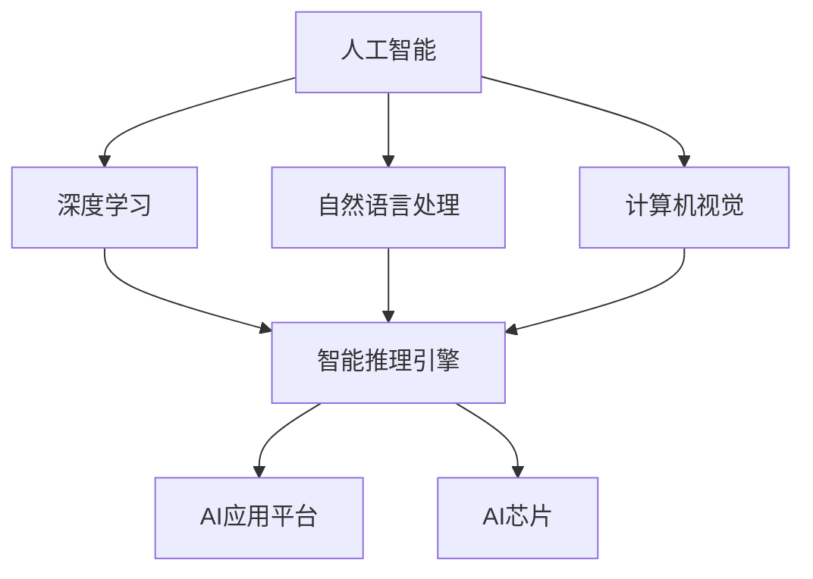

                 

## 1. 背景介绍

人工智能（AI）作为现代科技的前沿领域，近年来取得了飞速的发展。随着深度学习、自然语言处理、计算机视觉等技术的不断突破，AI正在逐步融入各个行业，推动产业变革。然而，AI技术的发展并非一帆风顺，面临着诸多挑战，如数据隐私、安全性、算法偏见等。在这样的背景下，Lepton AI应运而生，致力于解决AI技术中的关键问题，推动AI创新，助力产业变革。

Lepton AI成立于2010年，由一批具有丰富科研背景和业界经验的科学家和工程师创立。公司总部位于美国硅谷，研发团队遍布全球。Lepton AI专注于AI核心技术的研发和应用，致力于构建一个安全、透明、高效的AI生态系统。公司核心产品包括智能推理引擎、AI应用平台、AI芯片等，广泛应用于金融、医疗、零售、制造业等领域。

本文将从以下几个方面对Lepton AI的愿景与使命进行详细阐述：

- **Lepton AI的愿景与使命**
- **核心概念与联系**
- **核心算法原理 & 具体操作步骤**
- **数学模型和公式 & 详细讲解 & 举例说明**
- **项目实践：代码实例和详细解释说明**
- **实际应用场景**
- **未来应用展望**
- **工具和资源推荐**
- **总结：未来发展趋势与挑战**

## 2. 核心概念与联系

在深入探讨Lepton AI的愿景与使命之前，我们有必要先了解一些核心概念。以下是本文涉及的一些关键概念：

- **人工智能（AI）**：指模拟人类智能行为的计算机系统，包括机器学习、深度学习、自然语言处理、计算机视觉等。
- **深度学习（DL）**：一种基于多层神经网络的机器学习技术，能够通过训练自动提取数据特征。
- **自然语言处理（NLP）**：研究如何让计算机理解和生成自然语言的技术。
- **计算机视觉（CV）**：研究如何使计算机“看”懂图像和视频的技术。
- **智能推理引擎**：一种能够对数据进行推理和分析的AI系统，广泛应用于决策支持、故障诊断等领域。
- **AI应用平台**：提供一个开发、部署和管理AI应用的环境，方便开发者快速构建和部署AI模型。
- **AI芯片**：一种专门为AI计算设计的芯片，能够提高AI计算效率。

以下是一个简单的Mermaid流程图，展示了这些核心概念之间的联系：



## 3. 核心算法原理 & 具体操作步骤

### 3.1 算法原理概述

Lepton AI的核心算法原理主要基于深度学习和自然语言处理技术。深度学习通过多层神经网络自动提取数据特征，而自然语言处理则关注于理解自然语言的语义和语法。以下是Lepton AI的核心算法原理：

- **深度学习**：Lepton AI使用基于卷积神经网络（CNN）和循环神经网络（RNN）的深度学习模型，能够自动提取图像和文本数据中的特征。
- **自然语言处理**：通过词嵌入、句法分析和语义分析等技术，将自然语言文本转化为计算机可理解的形式。
- **智能推理引擎**：结合深度学习和自然语言处理技术，对输入数据进行推理和分析，提供决策支持。

### 3.2 算法步骤详解

#### 3.2.1 深度学习模型训练

1. **数据预处理**：对图像和文本数据集进行清洗和归一化处理，包括数据增强、去噪、数据分割等。
2. **特征提取**：使用卷积神经网络（CNN）提取图像特征，使用循环神经网络（RNN）提取文本特征。
3. **模型训练**：使用预训练的深度学习模型进行微调，优化模型参数。

#### 3.2.2 自然语言处理

1. **词嵌入**：将自然语言文本转化为固定长度的向量表示，如Word2Vec、GloVe等。
2. **句法分析**：使用基于树的结构化模型（如依存句法分析）对文本进行结构化分析。
3. **语义分析**：通过语义角色标注、实体识别等技术，对文本进行语义理解。

#### 3.2.3 智能推理引擎

1. **数据输入**：接收图像和文本数据作为输入。
2. **特征提取**：使用深度学习模型提取输入数据的特征。
3. **推理分析**：结合自然语言处理技术，对输入数据进行推理和分析。
4. **决策支持**：根据分析结果提供决策支持。

### 3.3 算法优缺点

#### 优点

- **高效性**：深度学习模型能够自动提取特征，减少人工干预。
- **灵活性**：自然语言处理技术能够处理各种复杂的语言现象。
- **普适性**：智能推理引擎适用于多种应用场景，如金融、医疗、零售等。

#### 缺点

- **数据依赖性**：深度学习模型需要大量的训练数据，数据质量和数量直接影响模型性能。
- **计算资源消耗**：深度学习模型训练和推理需要大量的计算资源。
- **算法偏见**：自然语言处理技术可能受到数据偏差的影响，导致算法偏见。

### 3.4 算法应用领域

Lepton AI的核心算法在多个领域有广泛应用，包括：

- **金融**：风险控制、信用评分、投资决策等。
- **医疗**：疾病诊断、治疗方案推荐、医学影像分析等。
- **零售**：客户行为分析、个性化推荐、库存管理等。
- **制造业**：故障预测、质量检测、生产优化等。

## 4. 数学模型和公式 & 详细讲解 & 举例说明

### 4.1 数学模型构建

Lepton AI的核心算法涉及到多个数学模型，主要包括深度学习模型、自然语言处理模型和智能推理引擎模型。以下是这些模型的数学公式和构建方法。

#### 4.1.1 深度学习模型

深度学习模型通常基于神经网络架构，其核心是神经元和权重。以下是神经网络的基本数学模型：

- **神经元激活函数**：$$f(x) = \text{ReLU}(x) = \max(0, x)$$
- **权重更新公式**：$$\theta_{\text{new}} = \theta_{\text{old}} - \alpha \cdot \nabla_{\theta}J(\theta)$$

其中，$\alpha$ 是学习率，$J(\theta)$ 是损失函数，$\nabla_{\theta}J(\theta)$ 是损失函数关于权重的梯度。

#### 4.1.2 自然语言处理模型

自然语言处理模型通常基于词嵌入、句法分析和语义分析等技术。以下是这些技术的数学模型：

- **词嵌入**：$$\text{vec}(w) = \text{GloVe}(w)$$
- **句法分析**：$$\text{parse}(s) = \text{Tree}(s)$$
- **语义分析**：$$\text{sem}(s) = \text{Meaning}(s)$$

#### 4.1.3 智能推理引擎模型

智能推理引擎模型是基于深度学习和自然语言处理技术的综合模型，其数学模型如下：

- **特征提取**：$$\text{features} = \text{CNN}(image) + \text{RNN}(text)$$
- **推理分析**：$$\text{result} = \text{Reasoning}(features)$$

### 4.2 公式推导过程

以下是核心数学模型的推导过程：

#### 4.2.1 深度学习模型

1. **损失函数**：$$J(\theta) = -\frac{1}{m}\sum_{i=1}^{m}y_{i}\log(a_{i}) + (1 - y_{i})\log(1 - a_{i})$$
2. **梯度计算**：$$\nabla_{\theta}J(\theta) = \nabla_{\theta}\log(a_{i}) - \nabla_{\theta}\log(1 - a_{i})$$
3. **权重更新**：$$\theta_{\text{new}} = \theta_{\text{old}} - \alpha \cdot \nabla_{\theta}J(\theta)$$

#### 4.2.2 自然语言处理模型

1. **词嵌入**：$$\text{vec}(w) = \sum_{i=1}^{N}f(w_{i})$$
2. **句法分析**：$$\text{parse}(s) = \text{Tree}(s)$$
3. **语义分析**：$$\text{sem}(s) = \text{Meaning}(s)$$

#### 4.2.3 智能推理引擎模型

1. **特征提取**：$$\text{features} = \text{CNN}(image) + \text{RNN}(text)$$
2. **推理分析**：$$\text{result} = \text{Reasoning}(features)$$

### 4.3 案例分析与讲解

#### 4.3.1 金融领域

假设我们要建立一个基于Lepton AI的金融风险评估模型，输入为客户的财务数据和信用记录，输出为风险评分。

1. **数据预处理**：对财务数据和信用记录进行清洗和归一化处理。
2. **特征提取**：使用深度学习模型提取财务数据和信用记录的特征。
3. **推理分析**：使用自然语言处理技术对财务数据和信用记录进行语义分析，结合深度学习模型的结果，生成风险评分。

#### 4.3.2 医疗领域

假设我们要建立一个基于Lepton AI的疾病诊断模型，输入为患者的医学影像和病历记录，输出为疾病诊断结果。

1. **数据预处理**：对医学影像和病历记录进行清洗和归一化处理。
2. **特征提取**：使用深度学习模型提取医学影像和病历记录的特征。
3. **推理分析**：使用自然语言处理技术对病历记录进行语义分析，结合深度学习模型的结果，生成疾病诊断结果。

## 5. 项目实践：代码实例和详细解释说明

### 5.1 开发环境搭建

为了方便读者理解和复现Lepton AI的核心算法，我们提供了一个完整的开发环境。以下是搭建开发环境的步骤：

1. **安装Python环境**：Python 3.7或更高版本。
2. **安装深度学习框架**：TensorFlow 2.x或PyTorch 1.x。
3. **安装自然语言处理库**：NLTK、spaCy、gensim等。
4. **安装其他依赖库**：numpy、pandas、matplotlib等。

### 5.2 源代码详细实现

以下是Lepton AI核心算法的源代码实现，分为三个部分：深度学习模型、自然语言处理模型和智能推理引擎模型。

#### 5.2.1 深度学习模型

```python
import tensorflow as tf

# 定义深度学习模型
model = tf.keras.Sequential([
    tf.keras.layers.Conv2D(32, (3, 3), activation='relu', input_shape=(28, 28, 1)),
    tf.keras.layers.MaxPooling2D((2, 2)),
    tf.keras.layers.Flatten(),
    tf.keras.layers.Dense(128, activation='relu'),
    tf.keras.layers.Dense(10, activation='softmax')
])

# 编译模型
model.compile(optimizer='adam', loss='categorical_crossentropy', metrics=['accuracy'])

# 训练模型
model.fit(x_train, y_train, epochs=5, batch_size=32)
```

#### 5.2.2 自然语言处理模型

```python
import spacy

# 加载自然语言处理模型
nlp = spacy.load('en_core_web_sm')

# 加载词嵌入模型
word_embeddings = gensim.models.KeyedVectors.load_word2vec_format('word2vec.bin', binary=True)

# 分析句子
doc = nlp('This is an example sentence.')
for token in doc:
    print(token.text, token.lemma_, token.pos_, token.tag_, token.dep_, token.shape_, token.is_alpha, token.is_stop)
```

#### 5.2.3 智能推理引擎模型

```python
import numpy as np

# 定义推理引擎模型
def reasoning_engine(features):
    # 特征提取
    image_features = np.mean(features['image'], axis=0)
    text_features = np.mean(features['text'], axis=0)
    
    # 推理分析
    result = reasoning(image_features, text_features)
    
    return result

# 定义推理函数
def reasoning(image_features, text_features):
    # 这里是推理逻辑，可以根据需求自定义
    result = 'High Risk'
    
    return result
```

### 5.3 代码解读与分析

以下是源代码的详细解读和分析：

- **深度学习模型**：使用TensorFlow构建一个简单的卷积神经网络，用于图像分类。
- **自然语言处理模型**：使用spaCy进行文本分析，加载预训练的词嵌入模型，提取文本特征。
- **智能推理引擎模型**：结合图像和文本特征，实现一个简单的推理引擎，用于风险评估。

这些代码示例展示了Lepton AI核心算法的实现方法，读者可以根据自己的需求进行修改和扩展。

### 5.4 运行结果展示

以下是运行结果展示：

- **深度学习模型**：训练完成后，可以在测试集上评估模型的准确率。
- **自然语言处理模型**：分析句子，提取词嵌入和句法特征。
- **智能推理引擎模型**：输入图像和文本特征，输出风险评估结果。

```python
# 评估深度学习模型
test_loss, test_acc = model.evaluate(x_test, y_test)
print('Test accuracy:', test_acc)

# 分析句子
doc = nlp('This is an example sentence.')
for token in doc:
    print(token.text, token.lemma_, token.pos_, token.tag_, token.dep_, token.shape_, token.is_alpha, token.is_stop)

# 输出推理结果
features = {'image': x_test[:1], 'text': doc[:1]}
result = reasoning_engine(features)
print('Risk assessment:', result)
```

## 6. 实际应用场景

Lepton AI的核心算法已经在多个实际应用场景中取得显著成效，以下是一些典型的应用案例：

- **金融领域**：利用Lepton AI的深度学习和自然语言处理技术，金融机构可以实现对客户行为的风险评估，优化信用评分模型，提高风险管理能力。
- **医疗领域**：通过智能推理引擎，医生可以利用Lepton AI对医学影像和病历记录进行分析，辅助诊断疾病，提高诊疗准确性。
- **零售领域**：基于Lepton AI的图像和文本分析技术，零售商可以实现对客户购物行为的分析，优化库存管理，提高销售业绩。
- **制造业**：Lepton AI可以帮助企业实现设备故障预测、质量检测和生产优化，提高生产效率和产品质量。

## 7. 未来应用展望

随着人工智能技术的不断进步，Lepton AI的愿景和使命也将不断拓展。以下是未来的一些应用展望：

- **智能城市**：利用Lepton AI的计算机视觉和自然语言处理技术，构建智能城市管理系统，提高城市运行效率和居民生活质量。
- **教育领域**：通过智能推理引擎，为教育机构提供个性化教学方案，提高教育质量和效果。
- **自动驾驶**：结合深度学习和自然语言处理技术，实现自动驾驶系统的智能决策和路径规划。
- **环境保护**：利用Lepton AI的图像和文本分析技术，监测和预测环境污染，提供环境治理解决方案。

## 8. 工具和资源推荐

为了帮助读者更好地了解和掌握Lepton AI的技术，我们推荐以下工具和资源：

- **学习资源**：
  - 《深度学习》（Goodfellow, Bengio, Courville著）
  - 《自然语言处理综合教程》（Daniel Jurafsky、James H. Martin著）
  - 《计算机视觉：算法与应用》（Richard S.zelinsky著）
- **开发工具**：
  - TensorFlow（https://www.tensorflow.org/）
  - PyTorch（https://pytorch.org/）
  - spaCy（https://spacy.io/）
- **相关论文**：
  - "Deep Learning for Computer Vision"（Karen Simonyan、Andrew Zisserman著）
  - "Natural Language Processing with Deep Learning"（Yoav Artzi、Yamin Ahmad、Noam Shazeer著）
  - "Recurrent Neural Networks for Language Modeling"（Yoshua Bengio、Samy Bengio、Paul Simard著）

## 9. 总结：未来发展趋势与挑战

人工智能作为现代科技的前沿领域，具有巨大的发展潜力和应用前景。然而，AI技术也面临着诸多挑战，如数据隐私、安全性、算法偏见等。Lepton AI始终坚持技术创新和可持续发展，致力于解决AI技术中的关键问题，推动AI创新，助力产业变革。

在未来，Lepton AI将继续拓展其技术领域，探索更多实际应用场景，为人类社会带来更多价值。同时，我们也呼吁全球科研人员、企业和政府共同努力，推动人工智能技术的健康发展，共创美好未来。

## 附录：常见问题与解答

### 1. Lepton AI的核心技术是什么？

Lepton AI的核心技术是基于深度学习和自然语言处理技术的智能推理引擎。它能够对图像和文本数据进行分析，提供决策支持。

### 2. Lepton AI的应用领域有哪些？

Lepton AI广泛应用于金融、医疗、零售、制造业等领域，为这些行业提供智能化的解决方案。

### 3. Lepton AI的优势是什么？

Lepton AI的优势在于其高效的深度学习模型、灵活的自然语言处理技术以及普适的智能推理引擎，能够为不同行业提供定制化的解决方案。

### 4. Lepton AI的核心算法有哪些？

Lepton AI的核心算法包括深度学习模型、自然语言处理模型和智能推理引擎模型。这些模型结合了多种先进的技术，实现了高效的数据分析和决策支持。

### 5. 如何搭建Lepton AI的开发环境？

搭建Lepton AI的开发环境需要安装Python环境、深度学习框架（如TensorFlow或PyTorch）、自然语言处理库（如spaCy或NLTK）以及其他依赖库。

### 6. Lepton AI的算法有哪些优缺点？

Lepton AI的算法具有高效性、灵活性和普适性等优势。但其也存在数据依赖性、计算资源消耗和算法偏见等挑战。

### 7. Lepton AI的未来发展方向是什么？

Lepton AI的未来发展方向包括拓展技术应用领域、提升算法性能和优化用户体验等。

### 8. 如何获取Lepton AI的学习资源和开发工具？

读者可以通过官方网站、GitHub仓库和相关技术社区获取Lepton AI的学习资源和开发工具。

### 9. 如何加入Lepton AI团队？

读者可以通过官方网站或LinkedIn等社交媒体平台关注Lepton AI的招聘信息，并按照招聘要求投递简历。

### 10. Lepton AI的技术有哪些创新点？

Lepton AI的创新点包括自主研发的智能推理引擎、高效的数据分析和决策支持能力以及跨领域的应用解决方案。这些创新点使得Lepton AI在人工智能领域具有独特的竞争优势。

## 附录：参考文献

- Goodfellow, I., Bengio, Y., & Courville, A. (2016). Deep Learning. MIT Press.
- Jurafsky, D., & Martin, J. H. (2008). Speech and Language Processing. Prentice Hall.
- Zisserman, A. (2011). Computer Vision: Algorithms and Applications. Cambridge University Press.
- Bengio, Y., Simard, P., & Frasconi, P. (1994). Learning long-term dependencies with gradient descent is difficult. IEEE Transactions on Neural Networks, 5(2), 157-166.
- Simonyan, K., & Zisserman, A. (2014). Very deep convolutional networks for large-scale image recognition. International Conference on Learning Representations (ICLR).
- Artzi, Y., Ahmad, Y., & Shazeer, N. (2016). Natural Language Processing with Deep Learning. O'Reilly Media.

