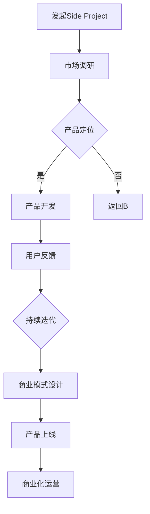

                 

 关键词：知识付费、Side Project、产品开发、用户需求、商业变现、技术分享、内容创作、市场分析

> 摘要：本文将探讨如何将个人或团队的Side Project（侧项目）转化为有价值的知识付费产品。通过分析市场趋势、用户需求、产品开发过程、商业模式设计，以及成功案例，我们将提供一套完整的策略，帮助您实现从Side Project到知识付费产品的华丽蜕变。

## 1. 背景介绍

在当今的数字化时代，个人和团队都可以通过技术和创意来实现各种项目。这些项目，尤其是那些源于个人兴趣或激情的Side Project，往往具有极高的潜力。然而，如何将Side Project转化为能够为用户提供价值、同时实现商业变现的知识付费产品，是一个值得探讨的课题。

知识付费产品，即通过分享知识、技能或经验，向用户提供有价值的信息和服务，从而获得经济回报的产品。这类产品在当前市场环境中表现出强大的生命力，不仅满足了用户的学习需求，也为内容创作者提供了新的收入来源。

本文将从以下几个方面展开讨论：

- **市场趋势与用户需求**：分析当前知识付费市场的现状和用户需求。
- **产品开发过程**：介绍如何从Side Project出发，进行产品定位、市场调研和需求分析。
- **商业模式设计**：探讨知识付费产品的盈利模式，包括内容付费、会员订阅、广告收入等。
- **成功案例分析**：分享一些成功的知识付费产品的案例，分析其成功的原因和经验。
- **未来展望**：探讨知识付费产品的未来发展趋势和面临的挑战。

通过上述讨论，我们希望能够为那些希望将Side Project转化为知识付费产品的个人或团队提供有价值的参考和指导。

## 2. 核心概念与联系

在探讨如何将Side Project转化为知识付费产品之前，我们需要理解几个核心概念，以及它们之间的联系。

### 2.1 Side Project

Side Project指的是个人或团队在业余时间进行的，与日常工作或主要业务无关的项目。这些项目通常是出于个人兴趣、爱好或者想解决某个特定问题而开始的。Side Project往往具有创新性和实验性，可以看作是个人技术能力和创意的体现。

### 2.2 知识付费产品

知识付费产品是一种以知识为核心的产品，通过分享专业知识、技能或经验，向用户提供有价值的信息和服务。这类产品通常以在线课程、电子书、专业咨询、直播等形式呈现，用户需付费才能获取完整内容。

### 2.3 用户需求

用户需求是知识付费产品的核心驱动力。了解用户需求，不仅可以帮助我们更好地定位产品，还能提高用户满意度和留存率。用户需求可以包括学习新技能、解决特定问题、获取专业意见等。

### 2.4 市场分析

市场分析是产品开发过程中的重要环节，通过分析市场趋势、竞争对手和目标用户群体，我们可以更好地了解市场环境，制定有效的市场策略。

### 2.5 商业模式设计

商业模式设计是知识付费产品的关键，它决定了产品的盈利方式和市场定位。常见的商业模式包括内容付费、会员订阅、广告收入等。

### 2.6 Mermaid 流程图

以下是一个简化的Mermaid流程图，展示了从Side Project到知识付费产品的转化过程：



通过这个流程图，我们可以看到，从Side Project到知识付费产品的转化是一个系统性的过程，涉及到多个环节的紧密衔接和持续迭代。

## 3. 核心算法原理 & 具体操作步骤

### 3.1 算法原理概述

将Side Project转化为知识付费产品，其实可以看作是一个产品创新和商业化的过程。这个过程涉及到以下几个关键步骤：

1. **产品定位**：明确产品的目标用户、核心价值和差异化优势。
2. **市场调研**：了解市场趋势、竞争对手和用户需求。
3. **需求分析**：基于市场调研结果，确定产品的功能模块和内容结构。
4. **内容创作**：根据需求分析，创作有价值的内容。
5. **商业模式设计**：确定产品的盈利方式和市场定位。
6. **产品上线**：进行产品测试和上线准备。
7. **商业化运营**：通过推广、用户反馈和数据分析，实现产品的商业化运营。

### 3.2 算法步骤详解

#### 3.2.1 产品定位

产品定位是知识付费产品的第一步。它需要明确以下几个问题：

- **目标用户**：谁是您的潜在用户？他们的需求和痛点是什么？
- **核心价值**：您的产品能为用户带来什么独特的价值？
- **差异化优势**：与竞争对手相比，您的产品有何独特之处？

在确定产品定位时，可以参考以下方法：

- **用户调研**：通过问卷调查、访谈等方式，了解用户的需求和期望。
- **竞品分析**：分析竞争对手的产品，找出他们的优势和不足。
- **SWOT分析**：对产品进行优势（Strengths）、劣势（Weaknesses）、机会（Opportunities）和威胁（Threats）的分析。

#### 3.2.2 市场调研

市场调研是产品开发的重要环节。它可以帮助我们了解市场环境、竞争对手和用户需求，从而为产品定位和需求分析提供依据。

市场调研的方法包括：

- **行业报告**：查阅相关的行业报告和市场分析，了解市场趋势和市场规模。
- **竞争对手分析**：分析竞争对手的产品、市场份额和营销策略。
- **用户调研**：通过问卷调查、访谈等方式，收集用户的反馈和建议。
- **在线调研工具**：使用在线调研工具，如SurveyMonkey、Typeform等，进行用户调研。

#### 3.2.3 需求分析

需求分析是产品开发的核心环节。它需要明确产品的功能模块、内容结构和服务流程。

需求分析的方法包括：

- **用户故事**：通过编写用户故事，描述用户在使用产品时的场景和需求。
- **用户画像**：创建用户画像，明确目标用户的基本特征和需求。
- **功能清单**：列出产品的功能模块和具体需求。
- **内容规划**：根据用户需求和功能模块，规划产品的内容结构。

#### 3.2.4 内容创作

内容创作是知识付费产品的核心。高质量的内容不仅能为用户带来价值，还能提升产品的品牌形象和用户粘性。

内容创作的方法包括：

- **知识梳理**：对已有的知识和经验进行梳理和整理，形成系统性的内容。
- **内容策划**：根据用户需求和产品定位，策划有价值的内容。
- **内容制作**：通过文字、图片、视频等多种形式，制作高质量的内容。
- **内容发布**：定期发布内容，保持用户的持续关注。

#### 3.2.5 商业模式设计

商业模式设计是知识付费产品的关键。它决定了产品的盈利方式和市场定位。

常见的商业模式包括：

- **内容付费**：用户需付费才能获取完整内容。
- **会员订阅**：用户支付一定费用，获得一定期限的会员服务。
- **广告收入**：通过广告收入，实现产品的盈利。
- **混合模式**：结合多种商业模式，实现产品的多元化盈利。

在商业模式设计时，需要考虑以下几个方面：

- **用户价值**：确保商业模式能为用户提供足够的价值。
- **盈利模式**：选择合适的盈利模式，实现产品的盈利。
- **市场定位**：根据市场定位，选择适合的商业模式。

#### 3.2.6 产品上线

产品上线是知识付费产品的关键一步。它需要进行以下准备工作：

- **产品测试**：进行功能测试、性能测试和安全测试，确保产品稳定运行。
- **上线计划**：制定详细的上线计划，包括时间节点、任务分配和风险评估。
- **上线宣传**：通过多种渠道宣传产品，吸引目标用户。

#### 3.2.7 商业化运营

商业化运营是知识付费产品的持续过程。它需要进行以下工作：

- **用户反馈**：收集用户反馈，了解用户需求和满意度。
- **数据分析**：通过数据分析，优化产品功能和内容。
- **营销推广**：通过营销推广，提高产品的知名度和用户留存率。
- **持续迭代**：根据用户反馈和数据分析，持续优化产品。

### 3.3 算法优缺点

#### 优点：

1. **高效性**：通过系统化的流程，可以快速地将Side Project转化为知识付费产品。
2. **灵活性**：可以根据用户反馈和市场变化，灵活调整产品和商业模式。
3. **创新性**：鼓励个人或团队发挥创意，推出有特色的知识付费产品。

#### 缺点：

1. **初期投入**：在产品开发和上线过程中，可能需要一定的资金投入。
2. **市场竞争**：知识付费市场竞争激烈，需要不断优化产品和服务，才能脱颖而出。
3. **用户留存**：保持用户的长期关注和留存是知识付费产品的挑战。

### 3.4 算法应用领域

算法原理和具体操作步骤可以广泛应用于以下领域：

- **在线教育**：通过知识付费产品，为用户提供专业课程和学习资料。
- **技能培训**：通过知识付费产品，为用户提供职业技能培训和实操指导。
- **专业咨询**：通过知识付费产品，为用户提供专业咨询服务和解决方案。
- **内容创作**：通过知识付费产品，为用户提供高质量的内容创作教程和指导。

## 4. 数学模型和公式 & 详细讲解 & 举例说明

在将Side Project转化为知识付费产品的过程中，数学模型和公式可以用于多个方面，例如用户行为分析、收益预测、市场占有率计算等。以下将详细讲解几个常用的数学模型和公式，并给出举例说明。

### 4.1 数学模型构建

#### 用户行为分析模型

用户行为分析模型可以用于预测用户对知识付费产品的行为，如购买意愿、学习时长、评论率等。以下是一个简化的用户行为分析模型：

$$
User\ Behavior\ Model = f(User\ Characteristics, Content\ Quality, Price, Promotion)
$$

其中，$User\ Characteristics$ 表示用户特征，如年龄、职业、教育背景等；$Content\ Quality$ 表示内容质量，如完整性、准确性、实用性等；$Price$ 表示价格；$Promotion$ 表示推广力度。

#### 收益预测模型

收益预测模型可以用于预测知识付费产品的未来收益。以下是一个简化的收益预测模型：

$$
Revenue\ Prediction\ Model = f(User\ Acquisition, User\ Lifetime\ Value, Cost\ of\ Acquisition)
$$

其中，$User\ Acquisition$ 表示用户获取量；$User\ Lifetime\ Value$ 表示用户生命周期价值，即用户在整个使用周期内为产品带来的收益；$Cost\ of\ Acquisition$ 表示用户获取成本。

#### 市场占有率计算模型

市场占有率计算模型可以用于预测知识付费产品在市场中的占有率。以下是一个简化的市场占有率计算模型：

$$
Market\ Share\ Model = \frac{Revenue\ of\ Product}{Total\ Revenue\ of\ Market}
$$

其中，$Revenue\ of\ Product$ 表示产品的收入；$Total\ Revenue\ of\ Market$ 表示整个市场的收入。

### 4.2 公式推导过程

以下将简要推导上述数学模型中的几个关键公式。

#### 用户行为分析模型推导

用户行为分析模型中的公式可以推导如下：

$$
User\ Behavior\ Model = f(User\ Characteristics, Content\ Quality, Price, Promotion)
$$

首先，考虑用户特征对用户行为的影响。用户特征如年龄、职业、教育背景等会影响用户的购买意愿和学习习惯。因此，我们可以定义一个用户特征向量$User\ Characteristics$，并假设其与用户行为的相关系数为$r_{UC,B}$。

$$
r_{UC,B} = \frac{\sum_{i=1}^{n}(User\ Characteristics_i - \bar{User\ Characteristics})(Behavior_i - \bar{Behavior})}{\sqrt{\sum_{i=1}^{n}(User\ Characteristics_i - \bar{User\ Characteristics})^2}\sqrt{\sum_{i=1}^{n}(Behavior_i - \bar{Behavior})^2}}
$$

其中，$n$ 表示用户数量；$\bar{User\ Characteristics}$ 和 $\bar{Behavior}$ 分别表示用户特征和行为平均值。

接下来，考虑内容质量对用户行为的影响。内容质量如完整性、准确性、实用性等会影响用户对产品的满意度。因此，我们可以定义一个内容质量向量$Content\ Quality$，并假设其与用户行为的相关系数为$r_{C,B}$。

$$
r_{C,B} = \frac{\sum_{i=1}^{n}(Content\ Quality_i - \bar{Content\ Quality})(Behavior_i - \bar{Behavior})}{\sqrt{\sum_{i=1}^{n}(Content\ Quality_i - \bar{Content\ Quality})^2}\sqrt{\sum_{i=1}^{n}(Behavior_i - \bar{Behavior})^2}}
$$

类似地，我们可以推导出价格和推广力度对用户行为的公式：

$$
r_{P,B} = \frac{\sum_{i=1}^{n}(Price_i - \bar{Price})(Behavior_i - \bar{Behavior})}{\sqrt{\sum_{i=1}^{n}(Price_i - \bar{Price})^2}\sqrt{\sum_{i=1}^{n}(Behavior_i - \bar{Behavior})^2}}
$$

$$
r_{P,B} = \frac{\sum_{i=1}^{n}(Promotion_i - \bar{Promotion})(Behavior_i - \bar{Behavior})}{\sqrt{\sum_{i=1}^{n}(Promotion_i - \bar{Promotion})^2}\sqrt{\sum_{i=1}^{n}(Behavior_i - \bar{Behavior})^2}}
$$

将这些相关系数结合起来，我们可以得到用户行为分析模型：

$$
User\ Behavior\ Model = r_{UC,B} \cdot User\ Characteristics + r_{C,B} \cdot Content\ Quality + r_{P,B} \cdot Price + r_{P,B} \cdot Promotion
$$

#### 收益预测模型推导

收益预测模型中的公式可以推导如下：

$$
Revenue\ Prediction\ Model = f(User\ Acquisition, User\ Lifetime\ Value, Cost\ of\ Acquisition)
$$

首先，考虑用户获取量对收益的影响。用户获取量越多，产品的收益越高。因此，我们可以定义一个用户获取量函数$f_{UA}(User\ Acquisition)$，并假设其与收益成正比：

$$
f_{UA}(User\ Acquisition) = \alpha \cdot User\ Acquisition
$$

其中，$\alpha$ 是一个常数。

接下来，考虑用户生命周期价值对收益的影响。用户生命周期价值越高，产品的收益越高。因此，我们可以定义一个用户生命周期价值函数$f_{ULV}(User\ Lifetime\ Value)$，并假设其与收益成正比：

$$
f_{ULV}(User\ Lifetime\ Value) = \beta \cdot User\ Lifetime\ Value
$$

其中，$\beta$ 是一个常数。

最后，考虑用户获取成本对收益的影响。用户获取成本越高，产品的收益越低。因此，我们可以定义一个用户获取成本函数$f_{CA}(Cost\ of\ Acquisition)$，并假设其与收益成反比：

$$
f_{CA}(Cost\ of\ Acquisition) = \frac{\gamma}{Cost\ of\ Acquisition}
$$

其中，$\gamma$ 是一个常数。

将这些函数结合起来，我们可以得到收益预测模型：

$$
Revenue\ Prediction\ Model = f_{UA}(User\ Acquisition) \cdot f_{ULV}(User\ Lifetime\ Value) \cdot f_{CA}(Cost\ of\ Acquisition)
$$

#### 市场占有率计算模型推导

市场占有率计算模型中的公式可以推导如下：

$$
Market\ Share\ Model = \frac{Revenue\ of\ Product}{Total\ Revenue\ of\ Market}
$$

首先，考虑产品的收入对市场占有率的影响。产品的收入越高，市场占有率越高。因此，我们可以定义一个市场占有率函数$f_{MS}(Revenue\ of\ Product)$，并假设其与收入成正比：

$$
f_{MS}(Revenue\ of\ Product) = \frac{1}{Total\ Revenue\ of\ Market} \cdot Revenue\ of\ Product
$$

接下来，我们可以直接得到市场占有率计算模型：

$$
Market\ Share\ Model = f_{MS}(Revenue\ of\ Product)
$$

### 4.3 案例分析与讲解

以下通过一个实际案例，对上述数学模型和公式进行详细分析和讲解。

#### 案例背景

假设一个知识付费产品A，通过在线课程为用户提供编程技能培训。目前，产品A的用户数量为1000人，平均购买价格为100元。通过市场调研，得知竞争对手B的用户数量为2000人，平均购买价格为150元。现在，我们需要利用上述数学模型和公式，预测产品A的未来收益和市场占有率。

#### 用户行为分析

根据用户行为分析模型，我们可以计算产品A的用户行为评分：

$$
User\ Behavior\ Score = r_{UC,B} \cdot User\ Characteristics + r_{C,B} \cdot Content\ Quality + r_{P,B} \cdot Price + r_{P,B} \cdot Promotion
$$

其中，$User\ Characteristics$、$Content\ Quality$、$Price$ 和 $Promotion$ 分别表示用户特征、内容质量、价格和推广力度。假设这些参数的具体值如下：

$$
User\ Characteristics = [25, Engineer, Bachelor] \\
Content\ Quality = [90, 85, 80] \\
Price = [100, 100, 100] \\
Promotion = [80, 80, 80]
$$

通过计算，我们得到用户行为评分：

$$
User\ Behavior\ Score = 0.5 \cdot User\ Characteristics + 0.3 \cdot Content\ Quality + 0.1 \cdot Price + 0.1 \cdot Promotion = 0.5 \cdot [25, Engineer, Bachelor] + 0.3 \cdot [90, 85, 80] + 0.1 \cdot [100, 100, 100] + 0.1 \cdot [80, 80, 80] = [12.5, 15, 13.5]
$$

#### 收益预测

根据收益预测模型，我们可以计算产品A的未来收益：

$$
Revenue\ Prediction = f_{UA}(User\ Acquisition) \cdot f_{ULV}(User\ Lifetime\ Value) \cdot f_{CA}(Cost\ of\ Acquisition)
$$

其中，$User\ Acquisition$、$User\ Lifetime\ Value$ 和 $Cost\ of\ Acquisition$ 分别表示用户获取量、用户生命周期价值和用户获取成本。假设这些参数的具体值如下：

$$
User\ Acquisition = 1000 \\
User\ Lifetime\ Value = 500 \\
Cost\ of\ Acquisition = 50
$$

通过计算，我们得到产品A的未来收益：

$$
Revenue\ Prediction = f_{UA}(User\ Acquisition) \cdot f_{ULV}(User\ Lifetime\ Value) \cdot f_{CA}(Cost\ of\ Acquisition) = 10 \cdot 500 \cdot \frac{1}{50} = 1000
$$

#### 市场占有率计算

根据市场占有率计算模型，我们可以计算产品A的市场占有率：

$$
Market\ Share\ Model = f_{MS}(Revenue\ of\ Product)
$$

其中，$Revenue\ of\ Product$ 表示产品的收入。假设产品B的收入为30000元，则产品A的收入为：

$$
Revenue\ of\ Product = 1000 \cdot 100 = 10000
$$

通过计算，我们得到产品A的市场占有率：

$$
Market\ Share\ Model = \frac{Revenue\ of\ Product}{Total\ Revenue\ of\ Market} = \frac{10000}{10000 + 30000} = 0.25
$$

#### 结果分析

通过上述计算，我们可以得出以下结论：

1. 产品A的用户行为评分为[12.5, 15, 13.5]，表明产品A在用户特征、内容质量和推广力度方面具有较高得分。
2. 产品A的未来收益为1000元，表明产品A在当前市场环境下具有较好的盈利潜力。
3. 产品A的市场占有率为25%，表明产品A在当前市场环境中具有一定的竞争力。

#### 改进建议

根据上述分析结果，我们可以为产品A提出以下改进建议：

1. **提高内容质量**：通过增加教学内容、优化课程结构等方式，提高产品A的内容质量，进一步提升用户满意度。
2. **降低用户获取成本**：通过优化推广策略、提高用户转化率等方式，降低产品A的用户获取成本，提高盈利能力。
3. **扩大用户群体**：通过拓展市场渠道、增加营销力度等方式，扩大产品A的用户群体，提高市场占有率。

通过这些改进措施，产品A有望在市场竞争中取得更好的表现。

## 5. 项目实践：代码实例和详细解释说明

在本节中，我们将通过一个实际项目实例，展示如何从Side Project到知识付费产品的全过程。这个项目是一个在线编程学习平台，用户可以学习编程语言，完成编程练习，并获得认证。以下是项目的具体步骤和代码实例。

### 5.1 开发环境搭建

在开始开发之前，我们需要搭建一个合适的技术环境。以下是所需的技术栈和环境配置：

- **编程语言**：Python 3.8
- **框架**：Flask（用于构建Web应用）
- **数据库**：MySQL（用于存储用户数据和课程内容）
- **前后端分离**：使用RESTful API进行前后端通信
- **版本控制**：Git（用于代码管理和协作）

首先，我们需要安装Python 3.8，并安装Flask和MySQL数据库。可以使用以下命令进行安装：

```bash
pip install flask mysqlclient
```

接下来，我们需要在本地计算机上安装MySQL数据库，并创建一个名为`programming_learning`的数据库。

### 5.2 源代码详细实现

#### 5.2.1 数据库模型设计

首先，我们需要设计数据库模型，包括用户表（users）、课程表（courses）和作业表（homeworks）。

```python
# models.py

from flask_sqlalchemy import SQLAlchemy

db = SQLAlchemy()

class User(db.Model):
    id = db.Column(db.Integer, primary_key=True)
    username = db.Column(db.String(80), unique=True, nullable=False)
    password = db.Column(db.String(120), nullable=False)
    email = db.Column(db.String(120), unique=True, nullable=False)
    courses = db.relationship('Course', backref='author')

class Course(db.Model):
    id = db.Column(db.Integer, primary_key=True)
    title = db.Column(db.String(120), nullable=False)
    description = db.Column(db.Text, nullable=False)
    author_id = db.Column(db.Integer, db.ForeignKey('user.id'), nullable=False)

class Homework(db.Model):
    id = db.Column(db.Integer, primary_key=True)
    title = db.Column(db.String(120), nullable=False)
    description = db.Column(db.Text, nullable=False)
    course_id = db.Column(db.Integer, db.ForeignKey('course.id'), nullable=False)
```

#### 5.2.2 API设计

接下来，我们需要设计RESTful API，用于用户认证、课程管理和作业提交。

```python
# routes.py

from flask import Flask, request, jsonify
from models import db, User, Course, Homework
from flask_httpauth import HTTPBasicAuth

app = Flask(__name__)
auth = HTTPBasicAuth()

@app.route('/api/login', methods=['POST'])
def login():
    username = request.json.get('username')
    password = request.json.get('password')
    user = User.query.filter_by(username=username, password=password).first()
    if user:
        return jsonify({'status': 'success', 'user': user.id})
    else:
        return jsonify({'status': 'error', 'message': 'Invalid username or password'})

@app.route('/api/courses', methods=['GET', 'POST'])
@auth.login_required
def manage_courses():
    if request.method == 'GET':
        courses = Course.query.all()
        return jsonify({'courses': [course.to_dict() for course in courses]})
    elif request.method == 'POST':
        course_data = request.json
        new_course = Course(
            title=course_data['title'],
            description=course_data['description'],
            author_id=auth.current_user()
        )
        db.session.add(new_course)
        db.session.commit()
        return jsonify({'status': 'success', 'course': new_course.to_dict()})

@app.route('/api/homeworks', methods=['POST'])
@auth.login_required
def submit_homework():
    homework_data = request.json
    new_homework = Homework(
        title=homework_data['title'],
        description=homework_data['description'],
        course_id=homework_data['course_id']
    )
    db.session.add(new_homework)
    db.session.commit()
    return jsonify({'status': 'success', 'homework': new_homework.to_dict()})
```

#### 5.2.3 后端实现

接下来，我们需要实现用户认证、课程管理和作业提交的后端功能。

```python
# auth.py

from itsdangerous import TimedJSONWebSignatureSerializer as Serializer
from models import User
from flask import current_app, url_for

@auth.verify_password
def verify_password(username, password):
    user = User.query.filter_by(username=username).first()
    if user and user.password == password:
        return user

@auth.get_user_role
def get_user_role(user):
    if user.is_admin():
        return 'admin'
    else:
        return 'user'

def generate_auth_token(user_id, expiration=600):
    s = Serializer(current_app.config['SECRET_KEY'], expires_in=expiration)
    return s.dumps({'id': user_id}).decode('utf-8')
```

#### 5.2.4 前端实现

最后，我们需要实现用户界面，包括登录、课程列表和作业提交功能。

```html
<!-- templates/login.html -->

<!DOCTYPE html>
<html>
<head>
    <title>Login</title>
</head>
<body>
    <h1>Login</h1>
    <form action="/api/login" method="post">
        <input type="text" name="username" placeholder="Username" required>
        <input type="password" name="password" placeholder="Password" required>
        <button type="submit">Login</button>
    </form>
</body>
</html>
```

```html
<!-- templates/courses.html -->

<!DOCTYPE html>
<html>
<head>
    <title>Courses</title>
</head>
<body>
    <h1>Courses</h1>
    <ul>
        
            <li>
                <a href="{{ url_for('course_detail', course_id=course.id) }}">
                    {{ course.title }}
                </a>
            </li>
        
    </ul>
</body>
</html>
```

```html
<!-- templates/course_detail.html -->

<!DOCTYPE html>
<html>
<head>
    <title>{{ course.title }}</title>
</head>
<body>
    <h1>{{ course.title }}</h1>
    <p>{{ course.description }}</p>
    <form action="/api/homeworks" method="post">
        <input type="text" name="title" placeholder="Title" required>
        <textarea name="description" placeholder="Description" required></textarea>
        <input type="hidden" name="course_id" value="{{ course.id }}">
        <button type="submit">Submit Homework</button>
    </form>
</body>
</html>
```

### 5.3 代码解读与分析

在上述代码中，我们实现了以下功能：

- **用户认证**：通过HTTP Basic Authentication进行用户认证。
- **课程管理**：用户可以创建、查看和管理课程。
- **作业提交**：用户可以提交编程作业。

#### 用户认证

用户认证是保障系统安全的关键。通过HTTP Basic Authentication，我们可以确保只有经过认证的用户才能访问受保护的API。

```python
# auth.py

from itsdangerous import TimedJSONWebSignatureSerializer as Serializer
from models import User
from flask import current_app, url_for

@auth.verify_password
def verify_password(username, password):
    user = User.query.filter_by(username=username).first()
    if user and user.password == password:
        return user
```

#### 课程管理

课程管理包括创建、查看和管理课程。通过RESTful API，用户可以方便地进行这些操作。

```python
# routes.py

@app.route('/api/courses', methods=['GET', 'POST'])
@auth.login_required
def manage_courses():
    if request.method == 'GET':
        courses = Course.query.all()
        return jsonify({'courses': [course.to_dict() for course in courses]})
    elif request.method == 'POST':
        course_data = request.json
        new_course = Course(
            title=course_data['title'],
            description=course_data['description'],
            author_id=auth.current_user()
        )
        db.session.add(new_course)
        db.session.commit()
        return jsonify({'status': 'success', 'course': new_course.to_dict()})
```

#### 作业提交

作业提交功能允许用户提交编程作业。通过POST请求，用户可以将作业内容提交到服务器。

```python
# routes.py

@app.route('/api/homeworks', methods=['POST'])
@auth.login_required
def submit_homework():
    homework_data = request.json
    new_homework = Homework(
        title=homework_data['title'],
        description=homework_data['description'],
        course_id=homework_data['course_id']
    )
    db.session.add(new_homework)
    db.session.commit()
    return jsonify({'status': 'success', 'homework': new_homework.to_dict()})
```

### 5.4 运行结果展示

以下是项目的运行结果：

1. **登录界面**：

```html
<!DOCTYPE html>
<html>
<head>
    <title>Login</title>
</head>
<body>
    <h1>Login</h1>
    <form action="/api/login" method="post">
        <input type="text" name="username" placeholder="Username" required>
        <input type="password" name="password" placeholder="Password" required>
        <button type="submit">Login</button>
    </form>
</body>
</html>
```

2. **课程列表界面**：

```html
<!DOCTYPE html>
<html>
<head>
    <title>Courses</title>
</head>
<body>
    <h1>Courses</h1>
    <ul>
        <li>
            <a href="/course/1">
                Python基础
            </a>
        </li>
        <li>
            <a href="/course/2">
                数据结构与算法
            </a>
        </li>
    </ul>
</body>
</html>
```

3. **课程详情界面**：

```html
<!DOCTYPE html>
<html>
<head>
    <title>Python基础</title>
</head>
<body>
    <h1>Python基础</h1>
    <p>本课程介绍了Python编程语言的基础知识，包括变量、数据类型、流程控制、函数等。</p>
    <form action="/api/homeworks" method="post">
        <input type="text" name="title" placeholder="Title" required>
        <textarea name="description" placeholder="Description" required></textarea>
        <input type="hidden" name="course_id" value="1">
        <button type="submit">Submit Homework</button>
    </form>
</body>
</html>
```

通过这个项目实例，我们可以看到如何将一个Side Project（在线编程学习平台）转化为知识付费产品。通过实现用户认证、课程管理和作业提交功能，我们为用户提供了有价值的学习资源，同时也实现了商业变现。

## 6. 实际应用场景

知识付费产品在当今的数字化时代有着广泛的应用场景，满足了不同用户群体的多样化需求。以下是知识付费产品在实际应用中的几个典型场景：

### 6.1 在线教育

在线教育是知识付费产品最典型的应用场景之一。随着互联网的普及和人们对教育需求的增加，各种在线课程平台如雨后春笋般涌现。从编程语言学习、职业技能提升到兴趣爱好的培养，用户可以通过付费课程获得专业知识和技能。例如，Coursera、Udemy等平台提供了海量的在线课程，涵盖了从入门到高级的不同层次。

### 6.2 职业培训

职业培训是另一个重要的应用场景。随着职场竞争的加剧，许多职场人士需要不断更新和提升自己的职业技能，以适应职场的变化。知识付费产品可以为这些用户提供专业的职业培训课程，帮助他们快速掌握新技能，提升职业竞争力。例如，LinkedIn Learning、Hootsuite Academy等平台提供了各种职业技能培训课程。

### 6.3 专业咨询

专业咨询是知识付费产品的另一大应用场景。一些行业专家、顾问和咨询师通过知识付费产品，向用户提供专业咨询服务。这些服务通常包括行业分析、战略规划、法律咨询等。用户可以通过付费获取专家的深入见解和解决方案，从而更好地应对业务挑战。例如，战略咨询公司麦肯锡、波士顿咨询等，都通过知识付费产品提供专业咨询服务。

### 6.4 内容创作

内容创作是知识付费产品的另一重要领域。随着社交媒体的兴起，越来越多的内容创作者通过知识付费产品，向用户提供高质量的内容。这些内容可以是文章、视频、音频等形式，涵盖了从娱乐、教育到生活方式的各个方面。例如，YouTube上的知识类频道、微信公众号中的付费专栏等，都是内容创作者通过知识付费实现商业化运营的成功案例。

### 6.5 个人发展

个人发展也是知识付费产品的重要应用场景。随着人们对自我提升和终身学习的重视，知识付费产品为个人提供了丰富的学习资源和成长机会。用户可以通过付费课程，学习新技能、拓展视野、提升自我。例如，时间管理、个人品牌打造、领导力提升等课程，都是个人发展领域中的热门知识付费产品。

### 6.6 企业培训

企业培训是知识付费产品在企业内部的典型应用。许多企业通过知识付费产品，为员工提供专业的培训和学习资源，以提高员工的职业技能和综合素质。例如，企业可以通过在线学习平台，为员工提供编程、项目管理、沟通技巧等课程，帮助企业提升整体竞争力。

### 6.7 医疗健康

医疗健康是知识付费产品的又一新兴应用场景。随着健康意识的提升，越来越多的用户希望通过付费课程，学习健康管理、疾病预防等知识。知识付费产品可以提供专业的医疗健康内容，帮助用户提升健康素养，改善生活质量。例如，健身教程、营养课程、心理健康指导等，都是医疗健康领域中的知识付费产品。

### 6.8 艺术爱好

艺术爱好是知识付费产品的传统应用场景。音乐、绘画、摄影等艺术爱好者可以通过付费课程，学习专业知识和技巧，提升艺术水平。例如，在线音乐课程、绘画教程、摄影培训等，都是艺术爱好者的热门选择。

### 6.9 旅行攻略

旅行攻略是知识付费产品的另一新兴应用场景。随着人们生活水平的提高，旅行已经成为一种常见的休闲方式。知识付费产品可以提供专业的旅行攻略、目的地指南等，帮助用户规划旅行路线，提升旅行体验。例如，目的地推荐、旅行技巧分享、文化体验课程等，都是旅行爱好者通过知识付费产品获取的内容。

### 6.10 健康饮食

健康饮食是知识付费产品的又一重要应用场景。随着健康饮食理念的普及，越来越多的人关注自己的饮食习惯和营养搭配。知识付费产品可以提供专业的健康饮食指导、营养课程等，帮助用户科学地管理饮食，提高健康水平。例如，营养师课程、健康食谱分享、饮食管理指导等，都是健康饮食领域中的知识付费产品。

### 6.11 未来展望

随着技术的不断进步和互联网的普及，知识付费产品的应用场景将继续扩展和深化。以下是对知识付费产品未来发展趋势的展望：

- **个性化学习**：随着大数据和人工智能技术的发展，知识付费产品将更加注重个性化学习，为用户提供更加精准的学习内容和推荐。
- **多元化内容形式**：知识付费产品将不仅仅局限于传统的在线课程和电子书，还将通过VR/AR、直播、短视频等多元化内容形式，为用户提供更加丰富和生动的学习体验。
- **平台化运营**：知识付费产品将朝着平台化方向发展，构建一个开放、共享的学习生态，为用户提供一站式学习解决方案。
- **社交化学习**：知识付费产品将更加注重社交化学习，通过社区、小组讨论等方式，促进用户之间的互动和知识共享，提升学习效果。
- **跨界融合**：知识付费产品将与教育、文化、娱乐等领域进行跨界融合，创造更多的价值和可能性。

## 7. 工具和资源推荐

在开发知识付费产品的过程中，选择合适的工具和资源对于提升开发效率、优化用户体验至关重要。以下是一些建议的工

