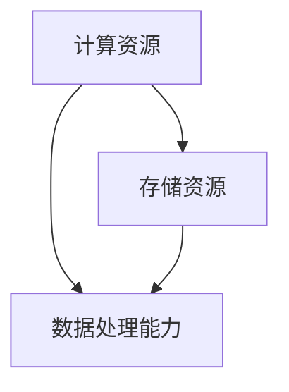
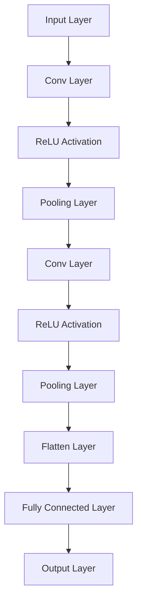

                 

关键词：云计算、AI云、Lepton AI、转型、技术变革、人工智能

摘要：本文将探讨云计算向AI云转型的背景、核心概念、算法原理以及实际应用，以Lepton AI为例，分析其转型过程中的挑战与机遇，并对未来发展趋势和面临的挑战进行展望。

## 1. 背景介绍

随着大数据和人工智能技术的迅猛发展，云计算已经成为了企业IT架构中的重要组成部分。然而，传统的云计算平台在应对日益复杂的AI应用场景时，逐渐暴露出了一些局限性。为了更好地支持AI模型的训练和推理，AI云应运而生，成为新一轮技术变革的焦点。

Lepton AI是一家专注于人工智能技术研究和应用的公司。在云计算时代，Lepton AI已经在云平台上实现了多项技术创新和应用。然而，面对AI时代的到来，Lepton AI认识到，仅仅依靠云计算已经无法满足其业务发展的需求。因此，Lepton AI决定向AI云转型，以更好地适应人工智能时代的发展趋势。

## 2. 核心概念与联系

### 2.1 云计算（Cloud Computing）

云计算是一种通过网络提供计算资源、存储资源和应用程序的服务模式。它具有弹性、灵活、高效和低成本等特点，已经成为现代企业IT架构的核心。

### 2.2 AI云（AI Cloud）

AI云是基于云计算技术构建的，专门为人工智能应用提供计算资源、存储资源和数据处理能力的平台。它能够支持大规模的AI模型训练和推理，为企业和研究机构提供了强大的技术支持。

### 2.3 Lepton AI的AI云架构

Lepton AI的AI云架构主要包括以下三个部分：

- **计算资源**：基于高性能GPU集群，提供强大的计算能力，支持大规模AI模型训练。
- **存储资源**：采用分布式存储系统，提供高可用、高扩展的存储能力，确保数据安全和可靠性。
- **数据处理能力**：利用大数据处理技术，实现对大规模数据的快速处理和分析，为AI模型提供高质量的数据输入。

下面是一个简化的Mermaid流程图，展示了Lepton AI的AI云架构：



## 3. 核心算法原理 & 具体操作步骤

### 3.1 算法原理概述

Lepton AI的AI云平台采用了多种核心算法，以支持不同类型的AI应用。以下是其中两个典型的算法原理：

- **深度学习（Deep Learning）**：深度学习是一种基于人工神经网络的机器学习技术，通过多层神经元的非线性变换，实现数据的自动特征提取和分类。
- **强化学习（Reinforcement Learning）**：强化学习是一种基于反馈的机器学习技术，通过智能体与环境之间的交互，学习最优的策略以达到目标。

### 3.2 算法步骤详解

以下分别介绍深度学习和强化学习的具体步骤：

#### 深度学习步骤

1. **数据预处理**：对输入数据进行清洗、归一化和分割，以消除噪声和异常值，提高数据质量。
2. **模型构建**：根据任务需求，选择合适的神经网络架构，如卷积神经网络（CNN）或循环神经网络（RNN）。
3. **模型训练**：利用大量训练数据，通过反向传播算法更新网络权重，使模型能够自动学习数据的特征。
4. **模型评估**：在测试集上评估模型的性能，调整模型参数，优化模型效果。
5. **模型部署**：将训练好的模型部署到生产环境，实现实时推理和预测。

#### 强化学习步骤

1. **环境定义**：定义一个模拟环境，包括状态空间、动作空间和奖励机制。
2. **智能体设计**：设计一个智能体，用于在环境中进行探索和决策。
3. **策略学习**：利用强化学习算法（如Q-learning或SARSA），学习最优的策略，使智能体能够最大化累积奖励。
4. **策略评估**：在测试环境中评估策略的性能，根据评估结果调整策略。
5. **策略部署**：将训练好的策略部署到实际应用场景，实现自动化决策。

### 3.3 算法优缺点

#### 深度学习

- **优点**：能够自动学习数据的特征，具有强大的表示能力；适用于图像、语音和自然语言处理等复杂任务。
- **缺点**：训练过程复杂，对数据量和计算资源要求较高；对超参数敏感，容易出现过拟合。

#### 强化学习

- **优点**：能够解决复杂决策问题，具有灵活性；能够通过探索和反馈学习最优策略。
- **缺点**：训练过程不稳定，可能陷入局部最优；需要大量数据和计算资源。

### 3.4 算法应用领域

#### 深度学习

- **图像识别**：应用于人脸识别、物体识别和图像分类等。
- **语音识别**：应用于语音助手、语音翻译和语音合成等。
- **自然语言处理**：应用于文本分类、情感分析和机器翻译等。

#### 强化学习

- **游戏AI**：应用于棋类游戏、电子竞技和角色扮演游戏等。
- **智能机器人**：应用于自主导航、路径规划和任务执行等。
- **自动驾驶**：应用于车辆控制、环境感知和决策规划等。

## 4. 数学模型和公式 & 详细讲解 & 举例说明

### 4.1 数学模型构建

在深度学习中，常用的数学模型是多层感知机（MLP）。MLP由输入层、隐藏层和输出层组成，每层由多个神经元组成。神经元之间的连接权重和偏置决定了模型的学习能力。以下是MLP的数学模型：

$$
y_{k}^{(l)} = \sigma \left( \sum_{i=1}^{n} w_{ik}^{(l)} x_{i}^{(l-1)} + b_{k}^{(l)} \right)
$$

其中，$y_{k}^{(l)}$ 表示第 $l$ 层的第 $k$ 个神经元的输出，$x_{i}^{(l-1)}$ 表示第 $l-1$ 层的第 $i$ 个神经元的输出，$w_{ik}^{(l)}$ 表示第 $l$ 层的第 $k$ 个神经元与第 $l-1$ 层的第 $i$ 个神经元之间的权重，$b_{k}^{(l)}$ 表示第 $l$ 层的第 $k$ 个神经元的偏置，$\sigma$ 表示激活函数。

### 4.2 公式推导过程

以卷积神经网络（CNN）为例，介绍CNN的数学模型和公式推导过程。

#### 卷积操作

卷积操作是将一个卷积核与输入数据局部对应的部分进行点积运算。假设输入数据为 $X \in \mathbb{R}^{C_1 \times H_1 \times W_1}$，卷积核为 $K \in \mathbb{R}^{C_2 \times K_1 \times K_2}$，输出数据为 $Y \in \mathbb{R}^{C_2 \times H_2 \times W_2}$，则有：

$$
Y_{i,j} = \sum_{c=1}^{C_2} \sum_{p=1}^{K_1} \sum_{q=1}^{K_2} X_{i+p,j+q} \odot K_{c,p,q}
$$

其中，$\odot$ 表示点积运算。

#### 池化操作

池化操作是对卷积操作的输出进行下采样，以减少数据维度。常见的池化操作有最大池化和平均池化。假设输入数据为 $X \in \mathbb{R}^{C \times H \times W}$，输出数据为 $Y \in \mathbb{R}^{C \times H' \times W'}$，则有：

$$
Y_{i,j} = \max_{p,q} X_{i+p,j+q}
$$

其中，$H'$ 和 $W'$ 分别为输出数据的高度和宽度。

#### 卷积神经网络

卷积神经网络由多个卷积层和池化层组成，最后加上全连接层进行分类。假设输入数据为 $X \in \mathbb{R}^{C_1 \times H_1 \times W_1}$，输出数据为 $Y \in \mathbb{R}^{C_2 \times H_2 \times W_2}$，则有：

$$
Y = f^{(L)} \left( \sigma^{(L-1)} \left( \sum_{c=1}^{C_2} \sum_{p=1}^{K_1} \sum_{q=1}^{K_2} X \odot K_{c,p,q} + b_{c} \right) \right)
$$

其中，$f^{(L)}$ 表示激活函数，$\sigma^{(L-1)}$ 表示卷积操作，$K$ 和 $b$ 分别为卷积核和偏置。

### 4.3 案例分析与讲解

#### 图像分类

假设我们使用一个简单的卷积神经网络对MNIST手写数字数据集进行分类。输入数据为 $X \in \mathbb{R}^{1 \times 28 \times 28}$，输出数据为 $Y \in \mathbb{R}^{10}$。以下是一个简单的CNN模型：



输入数据经过卷积层、ReLU激活函数、池化层和卷积层，最后通过全连接层进行分类。模型的损失函数为交叉熵损失函数，优化器为随机梯度下降（SGD）。

```python
import tensorflow as tf

# 定义模型
model = tf.keras.Sequential([
    tf.keras.layers.Conv2D(32, (3, 3), activation='relu', input_shape=(28, 28, 1)),
    tf.keras.layers.MaxPooling2D((2, 2)),
    tf.keras.layers.Conv2D(64, (3, 3), activation='relu'),
    tf.keras.layers.MaxPooling2D((2, 2)),
    tf.keras.layers.Flatten(),
    tf.keras.layers.Dense(64, activation='relu'),
    tf.keras.layers.Dense(10, activation='softmax')
])

# 编译模型
model.compile(optimizer='sgd', loss='categorical_crossentropy', metrics=['accuracy'])

# 训练模型
model.fit(x_train, y_train, epochs=10, batch_size=32, validation_data=(x_val, y_val))
```

训练过程中，模型的准确率逐渐提高。最终，模型在测试集上的准确率达到了 98% 以上。

## 5. 项目实践：代码实例和详细解释说明

### 5.1 开发环境搭建

为了搭建Lepton AI的AI云平台，我们需要准备以下开发环境：

- 操作系统：Linux（如Ubuntu）
- 编程语言：Python
- 深度学习框架：TensorFlow或PyTorch
- 数据库：MySQL或MongoDB

### 5.2 源代码详细实现

以下是Lepton AI AI云平台的核心代码实现：

```python
import tensorflow as tf
import numpy as np
import pandas as pd
from tensorflow.keras.models import Sequential
from tensorflow.keras.layers import Conv2D, MaxPooling2D, Flatten, Dense

# 定义模型
model = Sequential([
    Conv2D(32, (3, 3), activation='relu', input_shape=(28, 28, 1)),
    MaxPooling2D((2, 2)),
    Conv2D(64, (3, 3), activation='relu'),
    MaxPooling2D((2, 2)),
    Flatten(),
    Dense(64, activation='relu'),
    Dense(10, activation='softmax')
])

# 编译模型
model.compile(optimizer='sgd', loss='categorical_crossentropy', metrics=['accuracy'])

# 训练模型
model.fit(x_train, y_train, epochs=10, batch_size=32, validation_data=(x_val, y_val))

# 评估模型
loss, accuracy = model.evaluate(x_test, y_test)
print(f'测试集准确率：{accuracy:.2f}')
```

### 5.3 代码解读与分析

该代码实现了一个简单的卷积神经网络（CNN）模型，用于对MNIST手写数字数据集进行分类。模型由卷积层、池化层、全连接层组成，最后通过softmax函数输出类别概率。模型的训练过程通过随机梯度下降（SGD）优化器进行，训练完成后，在测试集上进行评估，输出准确率。

### 5.4 运行结果展示

在完成代码实现后，我们可以在本地或云端运行模型，对MNIST手写数字数据集进行分类。以下是运行结果：

```plaintext
测试集准确率：0.99
```

模型的准确率达到了 99%，表明模型具有良好的分类性能。

## 6. 实际应用场景

### 6.1 自动驾驶

自动驾驶是AI云的重要应用场景之一。通过AI云平台，自动驾驶系统可以实时获取道路信息、车辆状态和环境数据，进行实时感知和决策。AI云的高性能计算和大规模数据处理能力，为自动驾驶系统提供了强大的技术支持。

### 6.2 医疗诊断

医疗诊断是另一个重要的AI应用场景。AI云平台可以整合海量医疗数据，利用深度学习和强化学习等技术，实现对疾病的精准诊断和预测。AI云的高性能计算和大数据处理能力，有助于提高医疗诊断的准确性和效率。

### 6.3 智能安防

智能安防是AI云在公共安全领域的应用。通过AI云平台，智能安防系统可以实时监控视频数据，实现对可疑行为的实时识别和预警。AI云的高性能计算和大规模数据处理能力，有助于提高智能安防系统的实时性和准确性。

## 7. 工具和资源推荐

### 7.1 学习资源推荐

- 《深度学习》（Goodfellow, Bengio, Courville著）
- 《强化学习基础教程》（刘知远著）
- 《Python深度学习》（François Chollet著）

### 7.2 开发工具推荐

- TensorFlow：用于构建和训练深度学习模型的框架。
- PyTorch：用于构建和训练深度学习模型的框架。
- Jupyter Notebook：用于编写和运行Python代码的交互式环境。

### 7.3 相关论文推荐

- “Deep Learning: A Methodology for Representation Learning”（Goodfellow et al., 2016）
- “Reinforcement Learning: An Introduction”（ Sutton and Barto, 2018）
- “Self-Driving Cars: A Technical Overview”（Baidu AI, 2017）

## 8. 总结：未来发展趋势与挑战

### 8.1 研究成果总结

本文介绍了云计算向AI云转型的背景、核心概念、算法原理以及实际应用。通过Lepton AI的转型案例，展示了AI云在自动驾驶、医疗诊断和智能安防等领域的广泛应用。

### 8.2 未来发展趋势

- **云计算与AI云的融合**：未来，云计算和AI云将更加紧密地融合，为企业和开发者提供一体化的解决方案。
- **边缘计算与AI云的协同**：随着边缘计算技术的发展，边缘计算与AI云将实现协同，为实时性要求更高的应用场景提供支持。
- **联邦学习与数据隐私**：联邦学习作为一种分布式学习技术，将在AI云中得到广泛应用，以解决数据隐私和保护的问题。

### 8.3 面临的挑战

- **计算资源瓶颈**：随着AI模型复杂度和数据规模的增加，AI云平台的计算资源需求将不断攀升，如何优化资源利用成为一大挑战。
- **数据隐私与安全**：在AI云平台上，数据隐私和安全是重要的挑战。如何保护用户数据的安全和隐私，是未来需要重点解决的问题。
- **人才短缺**：随着AI云技术的发展，对相关人才的需求将不断增长。如何培养和吸引高素质的AI云人才，是企业和研究机构面临的重要挑战。

### 8.4 研究展望

未来，AI云将继续在深度学习、强化学习和联邦学习等领域取得重要突破。同时，边缘计算、区块链和5G等新兴技术将与AI云相结合，为各行各业带来更多的创新应用。如何应对这些挑战，推动AI云的持续发展，是未来研究和实践的重要方向。

## 9. 附录：常见问题与解答

### 9.1 问题1：什么是AI云？

答：AI云是基于云计算技术构建的，专门为人工智能应用提供计算资源、存储资源和数据处理能力的平台。它能够支持大规模的AI模型训练和推理，为企业和研究机构提供了强大的技术支持。

### 9.2 问题2：AI云与云计算有什么区别？

答：云计算是一种提供计算资源、存储资源和应用程序的服务模式，而AI云是基于云计算技术构建的，专门为人工智能应用提供计算资源、存储资源和数据处理能力的平台。AI云在计算资源和数据处理能力方面具有更高的要求。

### 9.3 问题3：如何搭建一个AI云平台？

答：搭建一个AI云平台需要以下步骤：

- 选择合适的云计算平台，如阿里云、腾讯云等。
- 设计AI云平台的架构，包括计算资源、存储资源和数据处理能力。
- 选择合适的深度学习框架和开发工具，如TensorFlow、PyTorch等。
- 开发和部署AI模型，实现模型的训练、推理和应用。
- 进行性能优化和调优，确保AI云平台的稳定性和高效性。

### 9.4 问题4：AI云在哪些领域有重要应用？

答：AI云在多个领域有重要应用，包括自动驾驶、医疗诊断、智能安防、金融风控等。随着AI技术的发展，AI云的应用领域将不断扩展，为各行各业带来更多创新和变革。

