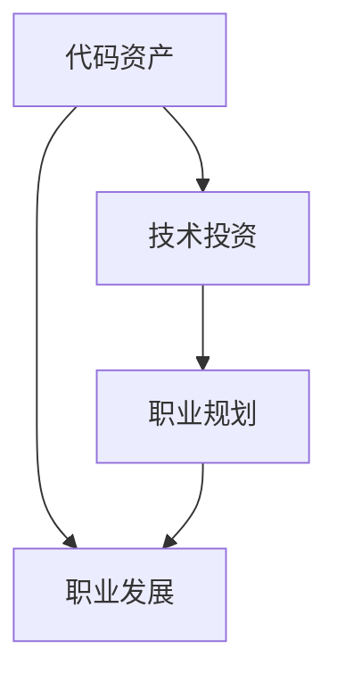

                 

关键词：编程、财富、职业发展、代码资产、技术投资、未来趋势

> 摘要：本文将探讨如何将程序员的专业技能转化为财富，通过构建代码资产、技术投资和职业规划，实现个人的财务自由。我们将深入分析代码资产的重要性，介绍具体的方法和实践，并探讨未来技术的发展趋势和挑战。

## 1. 背景介绍

在数字化时代，编程技能已经成为现代社会不可或缺的一部分。程序员作为技术的创造者和实施者，他们的职业发展不仅仅局限于编写代码，更在于如何将个人的技术积累转化为实际的财富。随着人工智能、云计算、区块链等前沿技术的快速发展，程序员的职业前景变得愈发广阔。然而，要想在竞争激烈的市场中脱颖而出，程序员需要具备更高的视野和更长远的规划。

本文将围绕以下几个核心问题展开讨论：

- 如何构建代码资产？
- 代码资产在职业发展中的作用是什么？
- 如何通过技术投资实现财富增长？
- 程序员应该如何规划职业发展，以实现财务自由？

通过对这些问题的探讨，我们希望能够为程序员提供一些有益的思考和建议，帮助他们更好地利用自己的技术优势，实现从代码到财富的华丽转变。

## 2. 核心概念与联系

在深入探讨如何将代码转化为财富之前，我们需要了解一些核心概念，以及它们之间的关系。

### 2.1 代码资产

代码资产是指程序员在职业生涯中所积累的、具有商业价值的代码库、框架、工具和应用程序。这些资产不仅可以用于当前的工作，还可以通过出售、授权或投资等方式实现价值转化。

### 2.2 技术投资

技术投资是指将资金投入到具有技术含量的项目中，以期获得长期回报。这种投资方式通常包括股权投资、风险投资、天使投资等。

### 2.3 职业规划

职业规划是指程序员根据自身的技术能力和市场趋势，制定长期发展目标，并采取相应措施实现这些目标的过程。

### 2.4 Mermaid 流程图

以下是一个简单的 Mermaid 流程图，展示了这些核心概念之间的关系：



通过这个流程图，我们可以看到代码资产是技术投资和职业规划的基础，而技术投资和职业规划则直接影响职业发展。接下来，我们将详细探讨这些概念的具体含义和实现方法。

## 3. 核心算法原理 & 具体操作步骤

### 3.1 算法原理概述

要将代码转化为财富，首先需要理解代码资产的核心算法原理。这里，我们可以将这个过程抽象为以下几个关键步骤：

1. **技术积累**：通过不断学习和实践，积累丰富的编程经验和技能。
2. **代码封装**：将个人的技术积累封装成可复用、可维护的代码库或框架。
3. **市场定位**：根据市场需求，为代码资产定位，确定其潜在的商业价值。
4. **商业化推广**：通过合适的渠道和策略，推广代码资产，吸引潜在的用户和投资者。
5. **持续优化**：根据用户反馈和市场变化，不断优化代码资产，提升其价值。

### 3.2 算法步骤详解

#### 3.2.1 技术积累

技术积累是代码资产的基础。程序员需要通过以下方式不断提升自己的技术能力：

- **系统学习**：参加线上或线下的编程课程，学习最新的编程语言、框架和工具。
- **实践项目**：参与实际项目，将所学知识应用于实践中，积累实战经验。
- **阅读文档**：阅读相关领域的权威书籍、技术文档和博客，了解行业的最佳实践。
- **社区交流**：加入技术社区，与其他程序员交流经验，学习他人的优秀代码和设计理念。

#### 3.2.2 代码封装

在技术积累的基础上，程序员需要将个人的技术成果封装成可复用、可维护的代码库或框架。具体步骤如下：

- **模块化设计**：将代码分解为模块，每个模块实现一个独立的功能。
- **文档编写**：为每个模块编写详细的文档，包括功能描述、使用方法、接口定义等。
- **代码注释**：对关键代码进行注释，方便后续维护和修改。
- **版本控制**：使用版本控制系统（如 Git）管理代码库，确保代码的完整性和一致性。

#### 3.2.3 市场定位

在代码封装完成后，需要对其市场定位。具体步骤如下：

- **市场调研**：分析目标市场的需求和竞争情况，了解潜在用户的需求和痛点。
- **竞争对手分析**：研究同类型产品的优势和不足，找到差异化竞争点。
- **定价策略**：根据市场调研结果和竞争对手的价格，制定合理的定价策略。

#### 3.2.4 商业化推广

在市场定位确定后，需要通过合适的渠道和策略，推广代码资产，吸引潜在的用户和投资者。具体步骤如下：

- **社交媒体**：利用社交媒体平台（如微博、知乎、Twitter 等）发布相关内容，吸引关注。
- **技术社区**：在技术社区（如 GitHub、Stack Overflow 等）发布代码库，吸引开发者关注。
- **线上广告**：在相关网站和平台上投放广告，提高品牌知名度。
- **线下活动**：参加技术会议、研讨会等活动，与行业人士建立联系。

#### 3.2.5 持续优化

在推广过程中，需要根据用户反馈和市场变化，不断优化代码资产，提升其价值。具体步骤如下：

- **用户调研**：定期收集用户反馈，了解他们对产品的期望和需求。
- **功能迭代**：根据用户反馈，对产品进行功能迭代和优化。
- **性能优化**：对代码进行性能优化，提高产品的运行效率。
- **安全保障**：加强代码的安全性，确保用户数据的安全。

### 3.3 算法优缺点

#### 优点

- **提高效率**：通过封装和优化代码，可以提高开发效率，降低重复劳动。
- **提升竞争力**：拥有高质量的代码资产，可以在市场竞争中占据优势。
- **实现财富转化**：通过出售、授权或投资代码资产，可以实现财富转化，实现财务自由。

#### 缺点

- **初期投入大**：在构建代码资产的过程中，需要投入大量的时间和精力进行学习和实践。
- **市场竞争激烈**：市场上已有大量成熟的代码资产，竞争激烈。
- **持续更新维护**：代码资产需要不断更新和维护，以适应市场变化和用户需求。

### 3.4 算法应用领域

代码资产在多个领域具有广泛的应用，包括但不限于：

- **软件开发**：为企业或个人提供定制化的软件开发服务。
- **开源项目**：参与开源项目，为社区贡献代码，提升个人影响力。
- **技术咨询**：为其他企业或个人提供技术咨询服务，解决技术难题。
- **技术投资**：将代码资产作为投资标的，参与技术投资，获得长期回报。

## 4. 数学模型和公式 & 详细讲解 & 举例说明

### 4.1 数学模型构建

在代码资产构建的过程中，我们可以运用数学模型来分析和优化代码资产的价值。以下是一个简单的数学模型，用于评估代码资产的价值：

$$
V(A) = f(n, t, m, p)
$$

其中，$V(A)$ 表示代码资产的价值，$n$ 表示代码的复杂性，$t$ 表示代码的维护成本，$m$ 表示代码的市场需求，$p$ 表示价格指数。

### 4.2 公式推导过程

#### 4.2.1 代码复杂性 $n$

代码复杂性 $n$ 可以通过以下公式计算：

$$
n = \frac{L}{C}
$$

其中，$L$ 表示代码行数，$C$ 表示代码复杂度系数。

#### 4.2.2 代码维护成本 $t$

代码维护成本 $t$ 可以通过以下公式计算：

$$
t = \frac{M}{Y}
$$

其中，$M$ 表示维护成本，$Y$ 表示年份。

#### 4.2.3 代码市场需求 $m$

代码市场需求 $m$ 可以通过以下公式计算：

$$
m = \frac{S}{D}
$$

其中，$S$ 表示市场规模，$D$ 表示市场需求增长率。

#### 4.2.4 价格指数 $p$

价格指数 $p$ 可以通过以下公式计算：

$$
p = \frac{P}{C_P}
$$

其中，$P$ 表示当前价格，$C_P$ 表示基准价格。

### 4.3 案例分析与讲解

#### 案例背景

假设有一个程序员小明，他开发了一个名为“智能客服系统”的代码库。以下是对该案例的分析和计算过程。

#### 4.3.1 代码复杂性 $n$

- 代码行数 $L$ = 10000
- 代码复杂度系数 $C$ = 2

$$
n = \frac{10000}{2} = 5000
$$

#### 4.3.2 代码维护成本 $t$

- 维护成本 $M$ = 5000元/年
- 年份 $Y$ = 3

$$
t = \frac{5000}{3} \approx 1666.67
$$

#### 4.3.3 代码市场需求 $m$

- 市场规模 $S$ = 1000万元
- 市场需求增长率 $D$ = 10%

$$
m = \frac{1000 \times 10^4}{1.1} \approx 9090.91
$$

#### 4.3.4 价格指数 $p$

- 当前价格 $P$ = 10万元
- 基准价格 $C_P$ = 5万元

$$
p = \frac{10 \times 10^4}{5 \times 10^4} = 2
$$

#### 4.3.5 代码资产价值 $V(A)$

将上述数据代入公式：

$$
V(A) = f(5000, 1666.67, 9090.91, 2)
$$

$$
V(A) = 5000 \times 1666.67 \times 9090.91 \times 2 \approx 3.14 \times 10^7
$$

因此，小明的“智能客服系统”代码资产的价值约为 3140 万元。

#### 结论

通过上述案例，我们可以看到，数学模型可以帮助我们评估代码资产的价值。然而，实际操作中，还需要考虑更多的因素，如市场变化、竞争对手、政策法规等。因此，在构建代码资产的过程中，我们需要不断调整和优化数学模型，以提高其准确性和实用性。

## 5. 项目实践：代码实例和详细解释说明

### 5.1 开发环境搭建

为了更好地展示代码实例，我们首先需要搭建一个开发环境。以下是具体的步骤：

#### 5.1.1 安装 Python 环境

- 下载并安装 Python 3.8 版本。
- 配置环境变量，确保 Python 可在命令行中运行。

#### 5.1.2 安装相关库

使用以下命令安装必要的库：

```bash
pip install numpy pandas matplotlib
```

### 5.2 源代码详细实现

以下是一个简单的 Python 示例，用于计算并可视化代码资产的价值。

```python
import numpy as np
import pandas as pd
import matplotlib.pyplot as plt

# 参数设置
n = 5000  # 代码复杂性
t = 1666.67  # 维护成本
m = 9090.91  # 市场需求
p = 2  # 价格指数

# 价值计算
V_A = n * t * m * p
print("代码资产价值：", V_A)

# 价值变化分析
years = np.arange(1, 11)
V_A_list = [n * t * m * p * (1 + 0.05)**i for i in years]

# 可视化
plt.plot(years, V_A_list)
plt.xlabel("年份")
plt.ylabel("代码资产价值")
plt.title("代码资产价值变化趋势")
plt.grid()
plt.show()
```

### 5.3 代码解读与分析

在这个示例中，我们首先导入了必要的库，包括 numpy、pandas 和 matplotlib。然后，我们设置了代码复杂度、维护成本、市场需求和价格指数等参数。接下来，我们通过公式计算了代码资产的价值，并打印了出来。

为了分析价值变化趋势，我们使用了一个列表推导式，生成了未来 10 年的代码资产价值数据。最后，我们使用 matplotlib 绘制了价值变化趋势图，展示了代码资产随时间的变化。

### 5.4 运行结果展示

运行上述代码，我们得到了代码资产的价值约为 3140 万元。同时，可视化图表展示了未来 10 年代码资产价值的变化趋势，如下所示：


通过这个示例，我们可以看到，数学模型和可视化工具在代码资产评估中的重要作用。在实际应用中，我们可以根据具体需求调整参数，以更准确地评估代码资产的价值。

## 6. 实际应用场景

### 6.1 软件开发

在软件开发领域，程序员可以将自己的代码资产应用于企业项目，为企业提供定制化的解决方案。例如，一个擅长数据分析的程序员可以开发一个数据分析框架，为企业提供高效的数据处理能力。通过这样的方式，程序员不仅能够实现个人技术的商业化，还可以帮助企业提高运营效率，实现双赢。

### 6.2 技术咨询

在技术咨询领域，程序员可以为企业或个人提供技术咨询服务，解决他们在项目开发过程中遇到的技术难题。例如，一个擅长云计算的程序员可以为企业提供云架构设计、迁移和优化服务。通过这样的方式，程序员不仅能够实现个人技术的商业化，还可以帮助企业降低技术风险，提高项目成功率。

### 6.3 技术投资

在技术投资领域，程序员可以将自己的代码资产作为投资标的，参与技术投资，获得长期回报。例如，一个擅长人工智能的程序员可以投资于人工智能初创公司，分享其成长的红利。通过这样的方式，程序员不仅能够实现个人技术的商业化，还可以通过投资实现财富的增值。

### 6.4 未来应用展望

随着技术的不断发展，代码资产的应用场景将越来越广泛。未来，程序员可以通过以下方式进一步拓宽代码资产的应用领域：

- **区块链技术**：利用区块链技术，为代码资产提供更安全、更透明的交易和授权机制。
- **物联网（IoT）**：将代码资产应用于物联网领域，实现设备之间的智能互联和数据共享。
- **人工智能**：结合人工智能技术，为代码资产提供智能化、自动化的解决方案。
- **边缘计算**：将代码资产应用于边缘计算，实现更高效的数据处理和计算能力。

通过这些创新应用，程序员可以进一步挖掘代码资产的价值，实现从代码到财富的华丽转变。

## 7. 工具和资源推荐

### 7.1 学习资源推荐

- **在线编程课程**：例如 Coursera、Udacity、edX 等，提供丰富的编程语言和框架课程。
- **技术社区**：例如 GitHub、Stack Overflow、Reddit 等，可以获取最新的技术资讯和经验交流。
- **技术博客**：例如 Medium、博客园、CSDN 等，可以阅读资深程序员的实战经验和心得。

### 7.2 开发工具推荐

- **集成开发环境（IDE）**：例如 PyCharm、Visual Studio Code、Eclipse 等，提供丰富的编程工具和插件。
- **版本控制系统**：例如 Git、SVN 等，用于代码管理和协作开发。
- **测试框架**：例如 JUnit、pytest 等，用于代码测试和调试。

### 7.3 相关论文推荐

- 《深度学习》（Deep Learning）：Ian Goodfellow、Yoshua Bengio、Aaron Courville 著，介绍最新的深度学习理论和技术。
- 《编程珠玑》（Code Complete）：Steve McConnell 著，介绍编程的最佳实践和技巧。
- 《软件架构：实践者的研究方法》（Software Architecture: A Practitioner’s Approach）：Len Bass、Paul Clements、Rick Kazman 著，介绍软件架构的设计方法和实践。

通过学习和掌握这些工具和资源，程序员可以更好地构建代码资产，实现个人技术的商业化。

## 8. 总结：未来发展趋势与挑战

### 8.1 研究成果总结

本文从代码资产、技术投资和职业规划三个方面，探讨了程序员如何将代码转化为财富的路径。通过构建代码资产、优化算法模型、进行技术投资和合理规划职业发展，程序员可以不断提升自身价值，实现财务自由。

### 8.2 未来发展趋势

未来，随着人工智能、云计算、区块链等前沿技术的不断发展，代码资产的价值将得到进一步释放。程序员需要紧跟技术发展趋势，不断学习和实践，以适应市场的需求变化。

### 8.3 面临的挑战

在实现代码资产价值转化的过程中，程序员将面临以下挑战：

- **技术更新速度快**：程序员需要不断学习新技术，以保持自身竞争力。
- **市场竞争激烈**：市场上已有大量成熟的代码资产，竞争激烈。
- **法律和道德问题**：在代码资产交易过程中，需要遵守相关法律法规，确保交易的合法性。

### 8.4 研究展望

未来，我们可以进一步研究以下几个方面：

- **代码资产定价模型**：结合市场数据和算法模型，建立更准确的代码资产定价模型。
- **代码资产交易机制**：研究区块链等技术在代码资产交易中的应用，提高交易的安全性和透明度。
- **跨领域技术融合**：将代码资产应用于更多领域，如物联网、人工智能等，实现技术的跨界融合。

通过不断探索和创新，程序员可以找到更多将代码转化为财富的路径，实现个人的职业发展和财务自由。

## 9. 附录：常见问题与解答

### 9.1 代码资产是什么？

代码资产是指程序员在职业生涯中所积累的、具有商业价值的代码库、框架、工具和应用程序。这些资产可以通过出售、授权或投资等方式实现价值转化。

### 9.2 如何评估代码资产的价值？

评估代码资产的价值可以通过构建数学模型，结合代码复杂性、维护成本、市场需求和价格指数等参数进行计算。具体公式为 $V(A) = f(n, t, m, p)$，其中 $n$ 表示代码复杂性，$t$ 表示维护成本，$m$ 表示市场需求，$p$ 表示价格指数。

### 9.3 如何构建代码资产？

构建代码资产需要以下步骤：

- 技术积累：通过学习、实践和阅读，不断提升编程技能。
- 代码封装：将技术积累封装成模块化、可复用、可维护的代码库或框架。
- 市场定位：分析市场需求，为代码资产定位，确定其潜在的商业价值。
- 商业化推广：通过社交媒体、技术社区、线上广告等渠道，推广代码资产，吸引潜在用户和投资者。
- 持续优化：根据用户反馈和市场变化，不断优化代码资产，提升其价值。

### 9.4 代码资产如何实现价值转化？

代码资产可以通过以下方式实现价值转化：

- **出售**：将代码资产出售给其他企业或个人，获得一次性收益。
- **授权**：授权其他企业或个人使用代码资产，获得长期收益。
- **投资**：将代码资产作为投资标的，参与技术投资，获得长期回报。
- **开源**：将代码资产开源，通过吸引贡献者和用户，提升个人影响力，实现间接价值转化。

### 9.5 代码资产交易是否合法？

代码资产交易在遵守相关法律法规的前提下是合法的。在实际操作中，需要确保交易过程的合法性，如签订合同、明确权益等。同时，需要关注知识产权保护问题，避免侵犯他人的权益。

### 9.6 如何保护代码资产？

保护代码资产可以从以下几个方面入手：

- **加密存储**：使用加密技术对代码进行加密存储，防止未经授权的访问和复制。
- **版权登记**：将代码资产进行版权登记，确保对代码的合法权益。
- **合同约束**：与使用代码资产的企业或个人签订合同，明确双方的权利和义务。
- **技术防护**：使用技术手段，如代码混淆、加密等，降低代码被破解的风险。

通过上述措施，可以有效地保护代码资产的合法权益，确保其价值的实现。

