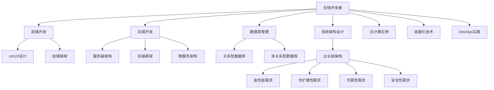

                 

关键词：全栈开发、企业级架构、技术进阶、系统架构设计、云计算、微服务、容器化、DevOps、持续集成、持续交付

摘要：本文旨在探讨从全栈开发到企业级架构师的职业进阶之路。通过分析全栈开发的技能要求、架构设计的核心要素、企业级架构的关键原则以及相关技术的应用，作者将帮助读者理解如何通过系统的学习和实践，实现从全栈开发者向企业级架构师的转变。

## 1. 背景介绍

在当今快速变化的技术时代，软件开发已成为推动创新和业务增长的核心动力。随着企业对于高效、稳定和可扩展的软件系统的需求不断增长，架构设计的复杂性和重要性日益凸显。全栈开发者和企业级架构师在软件开发生态系统中扮演着至关重要的角色。

全栈开发者通常具备前端、后端和数据库开发的技能，能够独立完成整个软件项目的开发工作。然而，随着项目的复杂度增加，全栈开发者需要不断提升自己的技能，以应对更高级别的系统架构设计和管理挑战。

企业级架构师则是专注于软件系统的高层架构设计，负责确保系统的性能、可靠性和可扩展性。他们需要具备深厚的系统架构知识和丰富的实践经验，能够从全局角度优化系统架构，提高企业的技术竞争力。

本文将围绕这两个角色，探讨如何通过不断学习和实践，实现从全栈开发者到企业级架构师的职业进阶。

## 2. 核心概念与联系

### 全栈开发

全栈开发（Full-Stack Development）是指开发者需要掌握前端和后端的所有技能，能够独立完成一个软件项目的开发工作。全栈开发者通常需要了解以下技术栈：

- **前端开发**：涉及HTML、CSS、JavaScript以及前端框架如React、Vue.js等。
- **后端开发**：包括服务器、数据库和应用程序逻辑，常用的后端技术有Node.js、Python（Django、Flask）、Java（Spring Boot）等。
- **数据库**：熟悉关系型数据库（如MySQL、PostgreSQL）和非关系型数据库（如MongoDB、Cassandra）。

### 企业级架构

企业级架构（Enterprise-Level Architecture）是指适用于大型企业的软件系统架构。它需要考虑系统的可靠性、性能、安全性、可扩展性和易维护性。企业级架构师需要掌握以下核心概念：

- **系统架构设计**：包括单体架构、微服务架构、服务导向架构（SOA）等。
- **云计算**：如AWS、Azure、Google Cloud等云平台的使用和架构设计。
- **容器化**：如Docker、Kubernetes等容器技术的应用。
- **DevOps**：持续集成（CI）和持续交付（CD）的实践。
- **分布式系统**：涉及分布式计算、分布式存储、分布式通信等。

### Mermaid 流程图

以下是全栈开发和企业级架构之间的联系流程图：



## 3. 核心算法原理 & 具体操作步骤

### 3.1 算法原理概述

在企业级架构中，核心算法的设计和实现是确保系统性能和可靠性的关键。以下是几种常见的企业级算法及其原理概述：

- **负载均衡算法**：用于分配网络请求到多个服务器，以提高系统的响应速度和可用性。
- **缓存算法**：用于存储常用数据，以减少数据库访问次数，提高系统性能。
- **分布式一致性算法**：如Paxos、Raft，用于保证分布式系统中的数据一致性。
- **分布式锁算法**：用于保证在分布式环境中对同一资源的互斥访问。

### 3.2 算法步骤详解

#### 负载均衡算法

负载均衡算法的主要步骤如下：

1. **请求接收**：服务器接收客户端请求。
2. **负载评估**：根据当前服务器的负载情况（如CPU利用率、内存使用率）进行评估。
3. **选择服务器**：根据评估结果选择负载较低的服务器。
4. **转发请求**：将请求转发到选中的服务器。

#### 缓存算法

缓存算法的步骤包括：

1. **数据缓存**：将常用数据存储到缓存中。
2. **缓存命中**：当请求的数据在缓存中存在时，直接返回缓存数据。
3. **缓存失效**：当缓存数据过期时，从数据库重新获取数据并更新缓存。

#### 分布式一致性算法

分布式一致性算法的基本步骤如下：

1. **提案**：服务器A向其他服务器提出数据变更提案。
2. **投票**：其他服务器对提案进行投票。
3. **决策**：根据投票结果决定是否接受提案。
4. **状态更新**：根据决策结果更新服务器状态。

#### 分布式锁算法

分布式锁算法的实现步骤包括：

1. **锁申请**：客户端向服务器申请锁。
2. **锁验证**：服务器验证锁的可用性。
3. **锁释放**：客户端完成操作后释放锁。

### 3.3 算法优缺点

每种算法都有其优缺点：

- **负载均衡算法**：优点是提高系统可用性和响应速度，缺点是引入了一定的网络开销。
- **缓存算法**：优点是提高系统性能，缺点是缓存一致性可能成为问题。
- **分布式一致性算法**：优点是实现数据一致性，缺点是性能开销较大。
- **分布式锁算法**：优点是保证分布式环境中的资源互斥访问，缺点是可能导致死锁。

### 3.4 算法应用领域

这些算法广泛应用于以下领域：

- **云计算平台**：用于分配计算资源和保证数据一致性。
- **分布式数据库**：用于保证多节点数据的一致性。
- **高并发应用**：用于提高系统的响应速度和稳定性。

## 4. 数学模型和公式 & 详细讲解 & 举例说明

### 4.1 数学模型构建

在企业级架构中，数学模型用于描述系统性能、资源利用率和成本效益等关键指标。以下是几个常见的数学模型：

- **响应时间模型**：用于预测系统的平均响应时间。
- **资源利用率模型**：用于评估系统资源的利用情况。
- **成本效益模型**：用于比较不同系统设计的成本和效益。

### 4.2 公式推导过程

以下是响应时间模型的推导过程：

响应时间（Response Time） = 服务时间（Service Time） + 等待时间（Waiting Time）

服务时间（Service Time） = 1/平均服务率

等待时间（Waiting Time） = 平均等待时间队列长度

平均服务率（Average Service Rate） = 1/平均服务时间

平均等待时间队列长度（Average Waiting Time Queue Length） = 1/平均服务率

### 4.3 案例分析与讲解

假设一个系统平均服务率为20请求/分钟，平均等待时间队列长度为2，计算系统的平均响应时间。

服务时间 = 1/20 = 0.05分钟

等待时间 = 2 * 0.05 = 0.1分钟

平均响应时间 = 0.05 + 0.1 = 0.15分钟

即平均响应时间为15秒。

通过这个例子，我们可以看到数学模型在预测系统性能方面的作用。

## 5. 项目实践：代码实例和详细解释说明

### 5.1 开发环境搭建

为了演示微服务架构的应用，我们将使用Docker和Kubernetes搭建一个简单的微服务系统。以下是开发环境的搭建步骤：

1. **安装Docker**：在服务器上安装Docker，并确保其正常工作。
2. **编写Dockerfile**：为每个微服务编写Dockerfile，定义容器镜像。
3. **构建镜像**：使用Docker build命令构建镜像。
4. **部署到Kubernetes**：编写Kubernetes配置文件，部署微服务到Kubernetes集群。

### 5.2 源代码详细实现

以下是使用Node.js编写的用户服务代码示例：

```javascript
// user-service.js
const express = require('express');
const app = express();
const port = 3000;

app.get('/', (req, res) => {
  res.send('User Service is running');
});

app.listen(port, () => {
  console.log(`User Service running on port ${port}`);
});
```

### 5.3 代码解读与分析

这段代码使用了Express框架创建一个简单的HTTP服务器，处理根路径的GET请求，并返回“User Service is running”消息。

### 5.4 运行结果展示

在部署到Kubernetes后，我们可以使用以下命令访问用户服务：

```
kubectl get pods
kubectl exec -it <user-service-pod-name> -- /bin/bash
```

在容器中运行`curl http://localhost:3000`，可以看到服务返回了预期的响应。

## 6. 实际应用场景

企业级架构师在多个实际应用场景中发挥着关键作用，以下是一些典型的应用场景：

- **电子商务平台**：确保高并发交易的稳定性，优化用户购物体验。
- **金融系统**：保证交易数据的一致性和安全性，满足金融合规要求。
- **社交媒体**：处理海量用户数据，实现实时数据更新和推送。
- **物联网（IoT）**：构建大规模分布式物联网系统，实现设备管理和数据分析。

### 6.4 未来应用展望

随着技术的不断发展，企业级架构师将面临更多的挑战和机遇。以下是一些未来的发展趋势：

- **云计算与边缘计算结合**：提供更灵活、高效的计算服务。
- **人工智能与架构设计**：利用AI优化系统架构，提高系统性能和可靠性。
- **区块链技术**：在分布式系统中引入区块链技术，提高数据透明性和安全性。
- **开源生态系统**：持续关注和参与开源社区，推动技术创新。

## 7. 工具和资源推荐

### 7.1 学习资源推荐

- 《设计数据密集型应用》（Design Data-Intensive Applications）
- 《微服务设计》（Microservices Design Patterns）
- 《Kubernetes实战》（Kubernetes Up & Running）

### 7.2 开发工具推荐

- Visual Studio Code
- Git
- Docker
- Kubernetes

### 7.3 相关论文推荐

- “The Design of the UNIX Operating System”
- “Distributed Systems: Concepts and Design”
- “Cloud Computing: Concepts, Technology & Architecture”

## 8. 总结：未来发展趋势与挑战

### 8.1 研究成果总结

本文通过分析全栈开发的技能要求、企业级架构的核心原则以及相关技术的应用，总结了从全栈开发者到企业级架构师的职业进阶之路。研究表明，系统架构设计、云计算、容器化、DevOps等技术对企业级软件系统的性能和可靠性具有至关重要的影响。

### 8.2 未来发展趋势

未来，企业级架构将更加注重云计算与边缘计算的融合、人工智能在架构设计中的应用、区块链技术带来的数据安全性和透明性提升，以及开源生态系统的持续发展。

### 8.3 面临的挑战

企业级架构师在未来的职业生涯中将面临不断变化的技术环境、日益复杂的应用场景和不断升级的安全威胁。他们需要持续学习新技术、掌握多领域知识，以适应快速变化的市场需求。

### 8.4 研究展望

本文的研究为从全栈开发者到企业级架构师的职业发展提供了有益的参考。未来的研究可以进一步探讨新兴技术在企业级架构中的应用，以及如何通过系统化的培训和实践，提高企业级架构师的职业素养和竞争力。

## 9. 附录：常见问题与解答

### 9.1 问题1：如何选择合适的系统架构？

**解答**：选择合适的系统架构需要考虑业务需求、技术能力、团队协作等多个因素。首先，明确业务目标和系统需求，然后根据需求选择合适的架构模式，如单体架构、微服务架构、服务导向架构等。最后，评估团队的技术能力和资源，确保能够成功实施和维护所选架构。

### 9.2 问题2：微服务架构与单体架构的区别是什么？

**解答**：微服务架构将应用程序拆分为多个独立的、可复用的服务，每个服务负责应用程序的一个特定功能。而单体架构则是将所有功能集中在一个单一的应用程序中。微服务架构的优点是提高了系统的可扩展性和可维护性，但需要更多的基础设施支持；单体架构则更加简单，但可能在性能和可维护性方面受限。

### 9.3 问题3：如何确保分布式系统的数据一致性？

**解答**：确保分布式系统的数据一致性可以通过多种分布式一致性算法实现，如Paxos、Raft等。这些算法通过分布式协调机制，确保多个节点之间的数据一致。此外，还可以使用分布式事务管理、最终一致性模型等技术来提高数据一致性。

### 9.4 问题4：什么是DevOps？它在企业级架构中有何作用？

**解答**：DevOps是一种软件开发和运维的实践方法，强调开发（Development）和运维（Operations）之间的紧密协作。它在企业级架构中的作用包括：

- 提高软件交付的频率和速度。
- 提升系统的稳定性和可靠性。
- 促进团队之间的沟通和合作。
- 利用自动化工具实现持续集成（CI）和持续交付（CD）。

### 9.5 问题5：容器化技术如何影响企业级架构？

**解答**：容器化技术（如Docker）通过将应用程序及其依赖项封装在容器中，实现了应用程序的轻量级、可移植和隔离。它对企业级架构的影响包括：

- 提高开发效率和部署速度。
- 简化基础设施的管理和维护。
- 提升系统的可扩展性和容错能力。
- 促进微服务架构的实施。

通过本文的探讨，我们希望读者能够对从全栈开发者到企业级架构师的职业进阶之路有更深入的理解。随着技术的不断进步，架构师的角色将变得更加重要，他们需要不断学习和适应新的技术和趋势，以应对不断变化的市场需求。作者在此祝愿所有读者在技术道路上取得长足的进步和成就。作者：禅与计算机程序设计艺术 / Zen and the Art of Computer Programming。
----------------------------------------------------------------

### 总结

本文从全栈开发者的视角出发，深入探讨了从全栈开发到企业级架构师的职业进阶之路。通过介绍全栈开发的技能要求、企业级架构的核心概念和原则，以及相关技术的应用，本文帮助读者理解了如何通过系统的学习和实践，实现这一重要的职业转变。

在企业级架构中，系统架构设计、云计算、容器化、DevOps等技术的应用至关重要。本文详细讲解了负载均衡、缓存、分布式一致性、分布式锁等核心算法的原理和步骤，并探讨了数学模型在系统性能评估中的应用。

通过项目实践，本文展示了如何使用Docker和Kubernetes搭建微服务架构，并提供了代码实例和详细解释。实际应用场景中，企业级架构师需要在电子商务、金融系统、社交媒体和物联网等领域发挥关键作用，并面对未来的技术挑战。

作者在此希望读者能够持续关注新兴技术，不断提升自己的技术能力，成为能够在复杂技术环境中游刃有余的企业级架构师。最后，作者祝愿所有读者在技术道路上取得长足的进步和成就。作者：禅与计算机程序设计艺术 / Zen and the Art of Computer Programming。

