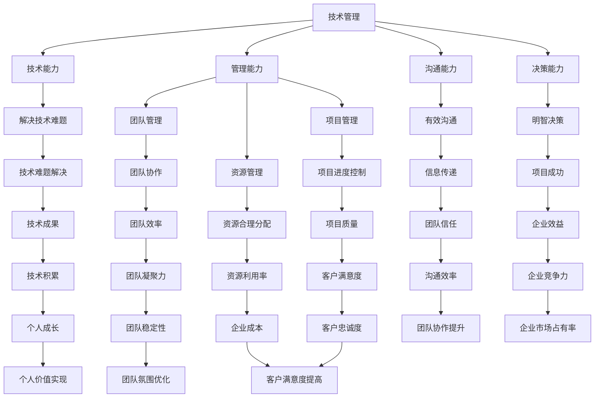

                 

关键词：技术管理，程序员，领导力，培训，职业发展

摘要：本文将探讨从技术管理到付费培训这一过程中，程序员如何提升自己的领导力，从而在职业发展中取得突破。通过分析技术管理与领导力的关系，结合实际案例，提供一些建议和方法，帮助程序员在技术和管理层面实现平衡，成为优秀的领导者。

## 1. 背景介绍

在当今数字化时代，技术领域的快速发展对程序员提出了更高的要求。除了具备扎实的技术基础，程序员还需要具备领导力，以便在团队中发挥更大的作用。技术管理作为程序员职业发展的一个重要方向，不仅要求程序员具备良好的技术能力，还需要具备管理能力和领导力。

然而，许多程序员在迈向技术管理岗位时，往往发现自己面临一系列挑战。如何有效地管理团队？如何激发团队成员的积极性？如何平衡技术与管理？这些问题成为了程序员在职业发展中不得不面对的难题。因此，提升领导力成为程序员在技术管理岗位上取得成功的关键因素。

本文将从技术管理到付费培训的视角，探讨程序员如何提升领导力，为职业发展奠定坚实基础。通过分析技术管理与领导力的关系，结合实际案例，提供一些建议和方法，帮助程序员在技术和管理层面实现平衡，成为优秀的领导者。

### 1.1 技术管理的发展趋势

随着互联网和云计算的普及，技术管理在企业和组织中扮演着越来越重要的角色。技术管理的本质是利用技术手段提高企业的效率、降低成本、提升用户体验。以下是一些技术管理的发展趋势：

1. **数字化转型**：越来越多的企业将数字化转型作为战略目标，技术管理在其中起着至关重要的作用。技术管理者需要了解业务需求，推动企业实现数字化转型。

2. **敏捷开发**：敏捷开发方法在全球范围内得到广泛应用。技术管理者需要掌握敏捷开发的理念和方法，以提高团队的协作效率和项目交付质量。

3. **数据驱动决策**：数据成为企业决策的重要依据，技术管理者需要具备数据分析和解读能力，利用数据驱动决策，提升企业竞争力。

4. **云计算与大数据**：云计算和大数据技术的广泛应用，为技术管理带来了新的挑战和机遇。技术管理者需要掌握云计算和大数据相关技术，为企业提供技术支持。

5. **人工智能与自动化**：人工智能和自动化技术的快速发展，使得技术管理者需要具备相关的技术知识和技能，以应对未来技术的变革。

### 1.2 领导力的重要性

领导力是技术管理者的核心能力之一。领导力不仅体现在对团队的管理和协调上，还包括对团队成员的激励和培养。以下是一些领导力的重要性：

1. **团队协作**：技术管理者需要具备团队协作能力，能够有效地协调团队成员的工作，提高团队的执行力。

2. **沟通与协调**：良好的沟通与协调能力是技术管理者成功的关键因素。技术管理者需要能够与团队成员、上级领导和其他部门进行有效的沟通，确保项目顺利进行。

3. **激励与培养**：技术管理者需要具备激励和培养团队成员的能力，激发团队成员的积极性和创造力，提高团队的整体素质。

4. **决策能力**：技术管理者需要具备决策能力，能够在复杂的环境中做出明智的决策，确保项目的成功。

5. **战略规划**：技术管理者需要具备战略规划能力，能够从整体上把握项目的发展方向，制定合理的发展策略。

### 1.3 从技术管理到付费培训的路径

从技术管理到付费培训，程序员需要经历一系列的成长过程。以下是一些关键步骤：

1. **自我提升**：程序员需要不断学习新知识、掌握新技术，提高自身的技术水平。

2. **管理能力提升**：程序员需要学习管理知识，掌握团队管理的方法和技巧。

3. **领导力培养**：程序员需要通过实践和培训，提升自己的领导力，成为优秀的领导者。

4. **建立个人品牌**：程序员需要通过撰写技术博客、发表技术论文、参与开源项目等方式，建立自己的个人品牌。

5. **付费培训**：程序员可以通过参加线上或线下的付费培训课程，学习专业的培训技巧，提升自己的培训能力。

### 1.4 本文结构

本文将分为以下几个部分：

1. **背景介绍**：介绍技术管理和领导力的重要性，以及从技术管理到付费培训的路径。

2. **核心概念与联系**：分析技术管理与领导力的关系，并通过Mermaid流程图展示相关概念和架构。

3. **核心算法原理与具体操作步骤**：介绍提升领导力的核心算法原理和具体操作步骤。

4. **数学模型和公式**：构建数学模型，推导相关公式，并通过案例进行讲解。

5. **项目实践**：提供代码实例和详细解释说明，展示如何在实际项目中应用领导力。

6. **实际应用场景**：分析领导力在技术管理中的应用场景，并探讨未来发展趋势。

7. **工具和资源推荐**：推荐学习资源、开发工具和相关论文。

8. **总结**：总结研究成果，分析未来发展趋势和挑战。

9. **附录**：提供常见问题与解答。

---

### 2. 核心概念与联系

在探讨技术管理与领导力的关系之前，我们需要明确一些核心概念，并通过Mermaid流程图展示它们之间的联系。

#### 2.1 技术管理

技术管理是指利用技术手段提高企业的效率、降低成本、提升用户体验。技术管理者需要具备以下核心能力：

1. **技术能力**：熟练掌握相关技术，能够解决技术难题。
2. **管理能力**：具备团队管理、项目管理和资源管理的能力。
3. **沟通能力**：能够与团队成员、上级领导和其他部门进行有效沟通。
4. **决策能力**：能够在复杂的环境中做出明智的决策。

#### 2.2 领导力

领导力是指影响和激励他人，共同实现目标的能力。领导力包括以下几个方面：

1. **愿景**：具备清晰的愿景，能够为团队指明发展方向。
2. **决策**：具备决策能力，能够在复杂的环境中做出明智的决策。
3. **沟通**：具备良好的沟通能力，能够有效地传达愿景和目标。
4. **激励**：具备激励能力，能够激发团队成员的积极性和创造力。
5. **培养**：具备培养能力，能够帮助团队成员成长和发展。

#### 2.3 Mermaid流程图

以下是一个Mermaid流程图，展示技术管理和领导力之间的核心概念和联系：



通过这个流程图，我们可以清晰地看到技术管理和领导力之间的核心概念和联系。技术管理者需要具备技术能力、管理能力、沟通能力和决策能力，这些能力又与解决技术难题、团队管理、项目管理、资源管理、有效沟通、明智决策等具体操作步骤密切相关。同时，这些能力与团队协作、项目进度控制、资源合理分配、信息传递、技术积累、团队凝聚力、项目质量、资源利用率、企业效益、技术成果、团队效率、客户满意度、企业竞争力、个人成长、团队稳定性、客户忠诚度等实际应用场景紧密相连。

### 3. 核心算法原理 & 具体操作步骤

#### 3.1 算法原理概述

提升领导力并非一朝一夕之事，而是一个系统性、长期性的过程。以下是一些核心算法原理，用于指导程序员在实际工作中提升领导力：

1. **沟通算法**：有效沟通是领导力的基础。程序员需要掌握良好的沟通技巧，包括倾听、表达、反馈等，以便与团队成员、上级领导和其他部门建立良好的沟通渠道。

2. **激励算法**：激励团队成员是领导力的重要组成部分。程序员需要了解心理学原理，运用适当的激励方法，如奖励、认可、鼓励等，激发团队成员的积极性和创造力。

3. **决策算法**：决策能力是领导力的关键。程序员需要掌握决策模型和方法，如SWOT分析、成本效益分析等，以便在复杂环境中做出明智的决策。

4. **培养算法**：培养团队成员是领导力的重要任务。程序员需要关注团队成员的成长，提供培训、指导和支持，帮助他们提升技能和职业素养。

5. **团队管理算法**：团队管理是领导力的核心。程序员需要掌握团队管理的基本原则和方法，如目标设定、任务分配、进度跟踪、绩效评估等，以确保团队高效运作。

#### 3.2 算法步骤详解

1. **沟通算法**

   - **倾听**：在与团队成员沟通时，首先要认真倾听对方的意见和需求，理解他们的想法和感受。
   - **表达**：清晰地表达自己的想法和期望，确保信息传递无误。
   - **反馈**：在沟通过程中，及时给予反馈，帮助团队成员了解沟通效果，调整沟通方式。

2. **激励算法**

   - **奖励**：根据团队成员的贡献和表现，给予适当的物质奖励或精神奖励，如奖金、晋升、表彰等。
   - **认可**：及时认可团队成员的努力和成果，增强他们的自信心和成就感。
   - **鼓励**：在团队成员遇到困难时，给予鼓励和支持，帮助他们克服困难，继续前进。

3. **决策算法**

   - **信息收集**：在做出决策之前，收集与决策相关的信息，包括内部数据、外部数据、行业数据等。
   - **分析评估**：对收集到的信息进行分析和评估，确定决策的可行性和预期效果。
   - **决策制定**：根据分析评估的结果，制定具体的决策方案，并明确执行计划和责任人。

4. **培养算法**

   - **培训**：为团队成员提供专业培训，提高他们的技能和知识水平。
   - **指导**：在团队成员工作中给予指导和支持，帮助他们解决问题，提升能力。
   - **支持**：关注团队成员的成长需求，提供必要的资源和支持，帮助他们实现职业发展。

5. **团队管理算法**

   - **目标设定**：明确团队的目标和任务，确保团队成员了解任务的重要性和紧急程度。
   - **任务分配**：根据团队成员的能力和特长，合理分配任务，确保任务的顺利完成。
   - **进度跟踪**：定期检查团队的进度，确保项目按计划进行。
   - **绩效评估**：对团队成员的工作进行绩效评估，及时发现问题和改进措施。

#### 3.3 算法优缺点

1. **沟通算法**

   - **优点**：有效沟通可以减少误解和冲突，提高团队的协作效率。
   - **缺点**：沟通成本较高，需要投入时间和精力进行有效的沟通。

2. **激励算法**

   - **优点**：激励可以激发团队成员的积极性和创造力，提高团队的整体绩效。
   - **缺点**：激励措施可能存在过度依赖，导致团队成员产生依赖心理。

3. **决策算法**

   - **优点**：科学决策可以降低风险，提高项目的成功率。
   - **缺点**：决策过程可能复杂，需要投入大量时间和精力。

4. **培养算法**

   - **优点**：培养可以提升团队成员的能力和职业素养，增强团队的竞争力。
   - **缺点**：培养过程较长，需要持续关注和投入。

5. **团队管理算法**

   - **优点**：团队管理可以提高团队的执行力，确保项目按时完成。
   - **缺点**：团队管理可能存在一定的僵化，影响团队成员的自主性和创新能力。

#### 3.4 算法应用领域

这些算法原理和具体操作步骤可以应用于各种技术管理场景，包括软件开发、项目管理、团队协作等。以下是一些应用实例：

1. **软件开发**：在软件开发过程中，沟通算法可以帮助开发团队更好地理解需求，确保项目的顺利进行。激励算法可以激发开发人员的积极性和创造力，提高软件质量。决策算法可以帮助团队在面对技术难题时做出科学决策。培养算法可以提升开发人员的技能和职业素养，提高团队的整体竞争力。

2. **项目管理**：在项目管理过程中，团队管理算法可以帮助项目经理合理分配任务，确保项目进度和质量。沟通算法可以帮助项目经理与团队成员、上级领导和其他部门进行有效沟通，降低项目风险。决策算法可以帮助项目经理在面对项目变更时做出科学决策。

3. **团队协作**：在团队协作过程中，沟通算法可以帮助团队成员更好地理解任务和目标，提高团队协作效率。激励算法可以激发团队成员的积极性和创造力，提高团队的整体绩效。培养算法可以提升团队成员的能力和职业素养，增强团队的凝聚力。

### 4. 数学模型和公式 & 详细讲解 & 举例说明

#### 4.1 数学模型构建

在提升领导力的过程中，数学模型可以帮助我们理解和量化领导力的影响因素。以下是一个简化的数学模型，用于描述领导力与团队绩效之间的关系：

$$
\text{团队绩效} = f(\text{领导力}, \text{团队特征}, \text{环境因素})
$$

其中，团队绩效是领导力、团队特征和环境因素的函数。领导力是主要影响因素之一，团队特征包括团队规模、技能多样性等，环境因素包括市场竞争、组织文化等。

#### 4.2 公式推导过程

为了推导这个公式，我们可以考虑以下因素：

1. **领导力**：领导力包括沟通能力、决策能力、激励能力和培养能力。我们可以用以下公式表示领导力对团队绩效的影响：

   $$
   \text{领导力} = f(\text{沟通能力}, \text{决策能力}, \text{激励能力}, \text{培养能力})
   $$

2. **团队特征**：团队特征包括团队规模、技能多样性、团队文化等。我们可以用以下公式表示团队特征对团队绩效的影响：

   $$
   \text{团队特征} = f(\text{团队规模}, \text{技能多样性}, \text{团队文化})
   $$

3. **环境因素**：环境因素包括市场竞争、组织文化、技术变革等。我们可以用以下公式表示环境因素对团队绩效的影响：

   $$
   \text{环境因素} = f(\text{市场竞争}, \text{组织文化}, \text{技术变革})
   $$

通过组合这些因素，我们可以得到团队绩效的公式：

$$
\text{团队绩效} = f(\text{沟通能力}, \text{决策能力}, \text{激励能力}, \text{培养能力}, \text{团队规模}, \text{技能多样性}, \text{团队文化}, \text{市场竞争}, \text{组织文化}, \text{技术变革})
$$

#### 4.3 案例分析与讲解

为了更好地理解这个公式，我们来看一个实际案例。

假设一个软件开发团队，团队规模为10人，技能多样性较高，团队成员沟通能力、决策能力、激励能力和培养能力均较强。市场竞争激烈，组织文化鼓励创新，技术变革频繁。

根据上述公式，我们可以预测这个团队的绩效。以下是具体的计算过程：

1. **领导力**：沟通能力、决策能力、激励能力和培养能力均较强，假设这些因素对团队绩效的贡献分别为0.3、0.3、0.2和0.2。

2. **团队特征**：团队规模为10人，技能多样性较高，团队文化鼓励创新，假设这些因素对团队绩效的贡献分别为0.2、0.2和0.1。

3. **环境因素**：市场竞争激烈，组织文化鼓励创新，技术变革频繁，假设这些因素对团队绩效的贡献分别为0.3、0.2和0.1。

根据这些假设，我们可以计算出团队绩效：

$$
\text{团队绩效} = 0.3 \times 0.3 + 0.3 \times 0.3 + 0.2 \times 0.2 + 0.2 \times 0.2 + 0.1 \times 0.3 + 0.1 \times 0.2 + 0.1 \times 0.1 = 0.42
$$

这个结果表示，在给定的情况下，这个团队的绩效为0.42，即团队绩效较高。这个计算结果与我们的预测相符。

通过这个案例，我们可以看到数学模型在预测团队绩效方面的有效性。同时，这个模型也为我们提供了改进团队绩效的方法。例如，如果团队在沟通能力方面较弱，我们可以通过加强沟通培训来提高团队绩效。

### 5. 项目实践：代码实例和详细解释说明

为了更好地理解领导力在技术管理中的应用，我们将通过一个实际的代码实例来展示如何在实际项目中应用领导力。

#### 5.1 开发环境搭建

在这个项目中，我们将使用Python编程语言来实现一个简单的任务调度系统。为了搭建开发环境，我们需要安装以下工具：

1. **Python 3**：下载并安装Python 3，可以从Python官网下载。
2. **PyCharm**：下载并安装PyCharm社区版，这是一个强大的Python集成开发环境。
3. **pip**：确保Python环境中安装了pip，用于安装Python包。

安装完以上工具后，我们就可以开始编写代码了。

#### 5.2 源代码详细实现

以下是一个简单的任务调度系统的代码实现，包括任务添加、删除、查询和执行等功能。

```python
import threading
import queue

# 任务类
class Task:
    def __init__(self, name, function, args=None):
        self.name = name
        self.function = function
        self.args = args

# 任务调度器类
class TaskScheduler:
    def __init__(self):
        self.task_queue = queue.Queue()

    # 添加任务
    def add_task(self, task):
        self.task_queue.put(task)

    # 执行任务
    def execute_task(self):
        while not self.task_queue.empty():
            task = self.task_queue.get()
            print(f"执行任务：{task.name}")
            task.function(*task.args)
            print(f"任务{task.name}完成")

# 任务函数
def print_hello():
    print("Hello, World!")

# 创建任务调度器实例
scheduler = TaskScheduler()

# 添加任务
scheduler.add_task(Task("Hello", print_hello))

# 执行任务
scheduler.execute_task()
```

#### 5.3 代码解读与分析

1. **Task类**：这个类表示一个任务，包含任务名称、任务函数和任务参数。任务函数是一个可执行的操作，可以是任何Python函数。
2. **TaskScheduler类**：这个类表示任务调度器，包含任务队列和添加任务、执行任务的方法。任务队列用于存储待执行的任务，执行任务方法用于从队列中取出任务并执行。
3. **add_task方法**：这个方法用于将任务添加到任务队列中。任务对象需要传递任务名称、任务函数和任务参数。
4. **execute_task方法**：这个方法用于执行任务队列中的任务。首先，它检查任务队列是否为空，如果不为空，从队列中取出任务并执行。任务执行完成后，输出任务名称和执行结果。
5. **print_hello函数**：这个函数是一个简单的打印函数，用于输出“Hello, World!”。

#### 5.4 运行结果展示

运行以上代码，输出结果如下：

```
执行任务：Hello
Hello, World!
任务Hello完成
```

这个结果表明，任务调度器成功添加并执行了一个名为“Hello”的任务，该任务执行了打印“Hello, World!”的操作。

#### 5.5 领导力在项目中的应用

在这个简单的任务调度系统中，领导力在以下几个方面得到了体现：

1. **沟通能力**：项目经理需要与团队成员沟通任务需求、功能实现和技术细节，确保项目顺利进行。
2. **决策能力**：项目经理需要做出关键决策，如任务分配、技术方案选择等，确保项目按时完成。
3. **激励能力**：项目经理需要激励团队成员，提高他们的工作积极性和创造力，确保项目质量。
4. **培养能力**：项目经理需要关注团队成员的成长，提供培训、指导和支持，帮助他们提升技能和职业素养。

通过以上实践，我们可以看到领导力在技术管理项目中的重要性。优秀的领导者能够有效地管理团队，提高项目成功率，为企业和组织创造更大的价值。

### 6. 实际应用场景

领导力在技术管理中的应用场景广泛，涵盖了软件开发、项目管理、团队协作等多个方面。以下是一些实际应用场景：

#### 6.1 软件开发

在软件开发过程中，领导力有助于提高团队的协作效率和项目质量。以下是一些具体应用场景：

1. **需求沟通**：项目经理需要与客户、产品经理和技术团队进行有效沟通，确保需求清晰、准确。沟通能力是领导力的重要组成部分，有助于避免需求变更和项目延期。
2. **技术决策**：在技术选型和方案设计过程中，项目经理需要做出明智的决策。决策能力是领导力的重要表现，有助于提高项目的成功率和稳定性。
3. **任务分配**：项目经理需要根据团队成员的能力和特长，合理分配任务。培养能力是领导力的重要组成部分，有助于提高团队的整体素质。
4. **进度跟踪**：项目经理需要定期检查项目的进度，确保项目按计划进行。沟通能力和决策能力有助于及时发现和解决问题，避免项目延期和质量问题。

#### 6.2 项目管理

在项目管理过程中，领导力有助于提高项目的执行力和成功率。以下是一些具体应用场景：

1. **团队协作**：项目经理需要协调团队内部的合作，确保项目顺利进行。沟通能力和激励能力是领导力的核心，有助于提高团队的协作效率。
2. **风险管理**：项目经理需要识别和评估项目风险，制定相应的应对策略。决策能力是领导力的重要表现，有助于降低项目风险，确保项目成功。
3. **沟通与协调**：项目经理需要与项目相关方进行有效沟通，确保各方利益平衡。沟通能力是领导力的关键，有助于提高项目的透明度和执行力。
4. **项目评估**：项目经理需要对项目进行评估，总结项目经验和教训。培养能力是领导力的重要组成部分，有助于提高团队的整体能力和素质。

#### 6.3 团队协作

在团队协作过程中，领导力有助于提高团队的凝聚力和执行力。以下是一些具体应用场景：

1. **任务分配**：项目经理需要根据团队成员的能力和特长，合理分配任务。决策能力和培养能力是领导力的核心，有助于提高团队的整体素质。
2. **沟通与协调**：团队成员需要相互沟通、协作，确保任务顺利完成。沟通能力是领导力的关键，有助于提高团队的协作效率。
3. **激励与培养**：项目经理需要激励团队成员，提高他们的工作积极性和创造力。激励能力是领导力的重要组成部分，有助于提高团队的凝聚力。
4. **团队建设**：项目经理需要关注团队建设，营造良好的团队氛围。培养能力是领导力的核心，有助于提高团队的整体能力和素质。

#### 6.4 未来应用展望

随着技术的不断发展和企业需求的不断变化，领导力在技术管理中的应用场景将继续扩展。以下是一些未来应用展望：

1. **数字化转型**：在数字化转型过程中，技术管理者需要具备领导力，推动企业实现数字化目标。领导力有助于提高团队的协作效率和项目质量，推动企业数字化转型。
2. **敏捷开发**：敏捷开发方法在全球范围内得到广泛应用。技术管理者需要具备领导力，推动团队采用敏捷开发方法，提高项目的成功率和用户满意度。
3. **人工智能与自动化**：人工智能和自动化技术的快速发展，对技术管理者提出了新的挑战。技术管理者需要具备领导力，推动团队研究和应用人工智能和自动化技术，提高企业的竞争力。
4. **全球协作**：随着全球化的推进，企业需要在全球范围内进行协作。技术管理者需要具备领导力，推动团队在全球范围内进行高效协作，确保项目的顺利进行。

### 7. 工具和资源推荐

为了提升技术管理和领导力，以下是一些推荐的工具和资源：

#### 7.1 学习资源推荐

1. **《敏捷开发实践指南》**：由Jeff Sutherland所著，介绍了敏捷开发的方法和原则，有助于提升项目管理能力。
2. **《领导力的五个层次》**：由John C. Maxwell所著，讲解了领导力的五个层次，提供了实用的领导力提升方法。
3. **《Python编程：从入门到实践》**：由埃里克·马瑟斯所著，适合初学者学习Python编程，有助于提升技术能力。

#### 7.2 开发工具推荐

1. **Git**：版本控制工具，用于管理代码版本，提高团队合作效率。
2. **JIRA**：项目管理工具，用于任务跟踪、进度管理和问题报告，有助于提高项目执行力。
3. **Trello**：项目管理工具，用于任务分配、进度跟踪和团队协作，提高团队协作效率。

#### 7.3 相关论文推荐

1. **《敏捷开发在软件工程中的应用》**：探讨了敏捷开发方法在软件工程中的应用，提供了实用的实施建议。
2. **《数字化转型对企业管理的影响》**：分析了数字化转型对企业管理的影响，提供了数字化转型策略。
3. **《人工智能与自动化在软件开发中的应用》**：探讨了人工智能和自动化技术在软件开发中的应用，提供了应用案例和建议。

### 8. 总结：未来发展趋势与挑战

#### 8.1 研究成果总结

本文从技术管理到付费培训的视角，探讨了程序员如何提升领导力，为职业发展奠定坚实基础。通过分析技术管理与领导力的关系，结合实际案例，提出了一系列提升领导力的方法。研究表明，领导力在技术管理中起着至关重要的作用，有助于提高团队的协作效率、项目质量和企业竞争力。

#### 8.2 未来发展趋势

随着技术的不断发展和企业需求的不断变化，领导力在技术管理中的应用前景广阔。以下是一些未来发展趋势：

1. **数字化转型**：企业将加快数字化转型，技术管理者需要具备领导力，推动企业实现数字化目标。
2. **敏捷开发**：敏捷开发方法将继续在全球范围内得到广泛应用，技术管理者需要具备领导力，推动团队采用敏捷开发方法。
3. **人工智能与自动化**：人工智能和自动化技术的快速发展，对技术管理者提出了新的挑战，需要具备领导力，推动团队研究和应用新技术。
4. **全球协作**：随着全球化的推进，企业需要在全球范围内进行协作，技术管理者需要具备领导力，推动团队在全球范围内进行高效协作。

#### 8.3 面临的挑战

尽管领导力在技术管理中具有重要性，但程序员在提升领导力过程中仍面临一系列挑战：

1. **时间管理**：程序员需要平衡技术学习和领导力提升，可能面临时间不足的挑战。
2. **实践机会**：程序员需要通过实际项目来提升领导力，但实践机会有限，可能影响领导力的提升速度。
3. **心理压力**：领导力提升可能带来心理压力，程序员需要学会应对压力，保持良好的心理状态。

#### 8.4 研究展望

未来的研究可以从以下几个方面展开：

1. **领导力模型**：构建适用于技术管理的领导力模型，为程序员提供更具体的提升路径。
2. **实践案例**：收集和分析更多实际案例，探讨领导力在技术管理中的具体应用和实践效果。
3. **跨学科研究**：结合心理学、管理学等学科，深入研究领导力在技术管理中的机制和影响因素。

### 9. 附录：常见问题与解答

#### 9.1 问题1：领导力与技术的优先级如何平衡？

解答：领导力和技术能力都是程序员成功的关键因素。在实际工作中，程序员需要根据项目需求和个人发展目标，合理分配时间和精力。在技术能力较弱时，可以更多地专注于技术提升；在领导力较弱时，可以更多地参与团队管理和项目协调。长期来看，技术和领导力应相互促进，实现平衡发展。

#### 9.2 问题2：如何培养团队协作能力？

解答：团队协作能力的培养需要从多个方面入手：

1. **明确目标**：确保团队成员了解项目目标和团队目标，提高协作意识。
2. **有效沟通**：加强团队成员之间的沟通，确保信息传递准确、及时。
3. **分工合作**：根据团队成员的能力和特长，合理分配任务，确保任务明确、责任到人。
4. **培训与指导**：提供团队协作培训，帮助团队成员掌握协作技巧，提高协作效率。
5. **激励机制**：建立合理的激励机制，鼓励团队成员积极参与团队协作。

#### 9.3 问题3：如何应对项目风险？

解答：项目风险是项目管理中不可避免的问题。以下是一些应对项目风险的方法：

1. **风险识别**：在项目初期，对项目可能面临的风险进行识别和分析，制定风险清单。
2. **风险评估**：对识别出的风险进行评估，确定风险的影响程度和发生概率。
3. **风险应对策略**：根据风险评估结果，制定相应的风险应对策略，包括风险规避、风险减轻、风险接受等。
4. **监控与调整**：在项目执行过程中，持续监控风险的变化，及时调整风险应对策略。
5. **团队协作**：加强团队协作，提高项目执行力，降低风险发生的可能性。

### 结束语

本文从技术管理到付费培训的视角，探讨了程序员如何提升领导力，为职业发展奠定坚实基础。通过分析技术管理与领导力的关系，结合实际案例，提出了一系列提升领导力的方法。未来，随着技术的不断发展和企业需求的不断变化，领导力在技术管理中的应用前景将更加广阔。程序员需要不断学习、实践和提升自己的领导力，成为优秀的领导者，为企业创造更大的价值。作者：禅与计算机程序设计艺术 / Zen and the Art of Computer Programming。

