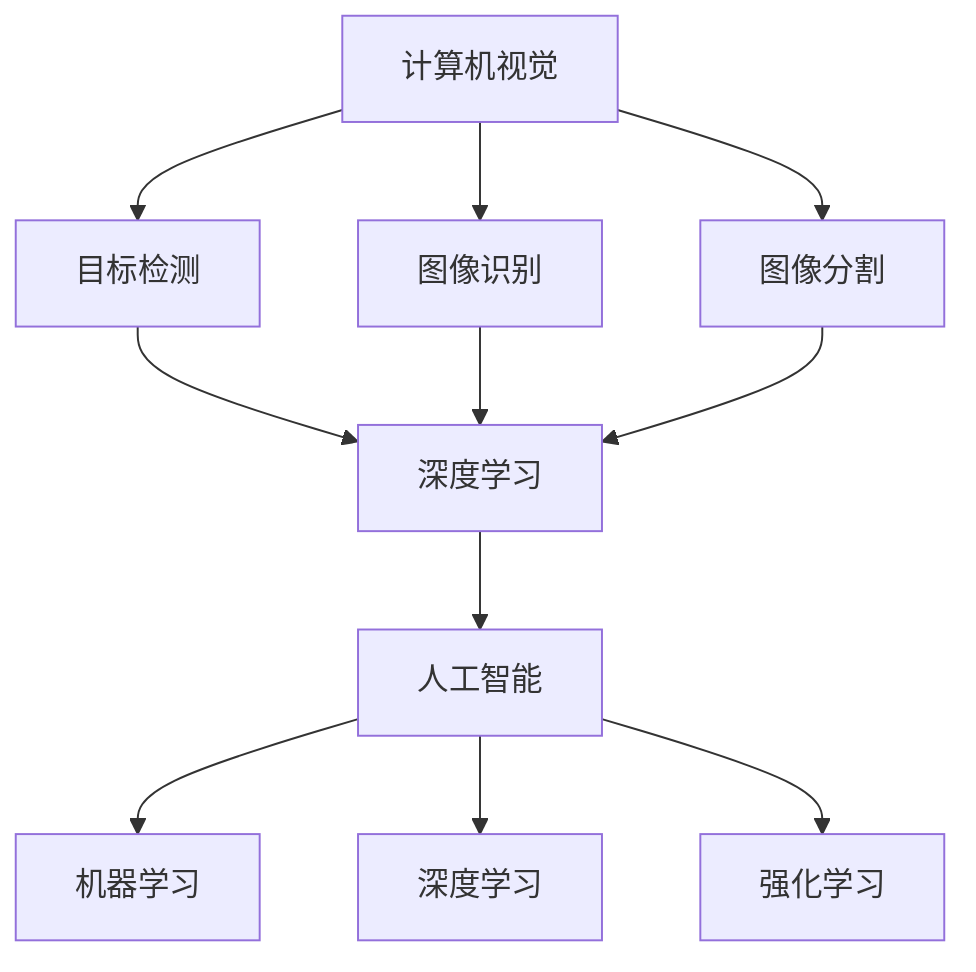

                 

关键词：Lepton AI，客户成功，概念验证，规模化部署，AI技术，案例研究

摘要：本文旨在探讨Lepton AI公司如何从概念验证阶段逐步实现规模化部署，并最终取得客户成功。通过分析Lepton AI的案例，我们将深入探讨其在技术实现、业务模式、客户关系管理等方面的关键因素，为其他AI初创公司提供借鉴和启示。

## 1. 背景介绍

Lepton AI是一家专注于计算机视觉和人工智能技术的初创公司。公司成立于2015年，总部位于美国硅谷。Lepton AI的创始团队由几位在计算机视觉和人工智能领域具有丰富经验的专业人士组成，他们共同的目标是将最前沿的技术应用于实际场景，解决现实问题。

公司成立之初，Lepton AI便开始了对计算机视觉和人工智能技术的深入研究。经过数年的努力，他们开发出了一系列具有自主知识产权的核心技术，包括目标检测、图像识别、深度学习等。这些技术不仅具有高准确率，而且可以在复杂的环境中稳定运行。

Lepton AI的客户群体涵盖了多个行业，包括制造业、零售业、医疗保健等。公司致力于为客户提供定制化的解决方案，帮助他们提高生产效率、降低成本、提升客户满意度。

## 2. 核心概念与联系

Lepton AI的核心技术包括计算机视觉、人工智能和深度学习。这些技术之间存在着紧密的联系，共同构成了公司的技术架构。

### 2.1 计算机视觉

计算机视觉是指让计算机具有识别和理解图像的能力。Lepton AI的计算机视觉技术主要包括目标检测、图像识别和图像分割等。

- **目标检测**：目标检测是指从图像中识别出特定目标的位置和属性。Lepton AI的目标检测技术采用深度学习算法，具有高准确率和实时性。
- **图像识别**：图像识别是指从图像中识别出特定对象或场景。Lepton AI的图像识别技术基于卷积神经网络（CNN），能够识别多种类型的图像。
- **图像分割**：图像分割是指将图像分割成多个部分，以便进行进一步处理。Lepton AI的图像分割技术采用区域生长算法，能够有效地提取图像中的关键信息。

### 2.2 人工智能

人工智能是指使计算机具有类似人类智能的能力。Lepton AI的人工智能技术主要包括机器学习、深度学习和强化学习等。

- **机器学习**：机器学习是指让计算机通过学习数据来改进性能。Lepton AI的机器学习技术基于监督学习和无监督学习，能够自动识别图像中的特征。
- **深度学习**：深度学习是指多层神经网络对数据进行自动特征提取。Lepton AI的深度学习技术采用卷积神经网络（CNN）和循环神经网络（RNN），能够处理大规模图像数据。
- **强化学习**：强化学习是指通过与环境互动来学习最佳策略。Lepton AI的强化学习技术用于优化目标检测和图像识别的参数，以提高算法的准确率。

### 2.3 深度学习

深度学习是一种基于多层神经网络的人工智能技术。Lepton AI的深度学习技术采用卷积神经网络（CNN）和循环神经网络（RNN），能够处理大规模图像数据。

- **卷积神经网络（CNN）**：卷积神经网络是一种专门用于处理图像数据的神经网络。Lepton AI的CNN技术能够自动提取图像中的特征，从而实现目标检测和图像识别。
- **循环神经网络（RNN）**：循环神经网络是一种专门用于处理序列数据的神经网络。Lepton AI的RNN技术能够处理视频数据，实现实时目标跟踪。

### 2.4 Mermaid流程图

以下是一个简单的Mermaid流程图，展示了Lepton AI的核心技术架构：



## 3. 核心算法原理 & 具体操作步骤

### 3.1 算法原理概述

Lepton AI的核心算法基于深度学习，主要包括目标检测、图像识别和图像分割等。这些算法通过训练大量数据，自动提取图像中的特征，从而实现对图像的识别和理解。

- **目标检测**：目标检测算法通过识别图像中的目标位置和属性，实现对图像内容的解析。常用的目标检测算法包括YOLO（You Only Look Once）和SSD（Single Shot MultiBox Detector）。
- **图像识别**：图像识别算法通过识别图像中的对象或场景，实现对图像的语义理解。常用的图像识别算法包括CNN（卷积神经网络）和RNN（循环神经网络）。
- **图像分割**：图像分割算法通过将图像分割成多个部分，实现对图像的细节分析。常用的图像分割算法包括区域生长算法和形态学算法。

### 3.2 算法步骤详解

#### 目标检测

1. **数据预处理**：将输入图像进行归一化处理，使其尺寸与网络输入一致。
2. **特征提取**：使用卷积神经网络提取图像的特征。
3. **目标定位**：在特征图上搜索目标位置，使用 anchor boxes 来预测目标的位置和属性。
4. **目标分类**：对每个锚框进行分类，判断是否包含目标，并计算目标的置信度。

#### 图像识别

1. **数据预处理**：与目标检测类似，对输入图像进行归一化处理。
2. **特征提取**：使用卷积神经网络提取图像的特征。
3. **分类**：使用全连接层对提取到的特征进行分类，得到图像的标签。

#### 图像分割

1. **数据预处理**：与目标检测和图像识别类似，对输入图像进行归一化处理。
2. **特征提取**：使用卷积神经网络提取图像的特征。
3. **区域生长**：从种子点开始，根据相似性准则逐渐扩大区域，实现对图像的分割。

### 3.3 算法优缺点

#### 目标检测

- **优点**：实时性强，准确度高，适用于动态场景。
- **缺点**：计算复杂度高，对硬件要求较高。

#### 图像识别

- **优点**：准确度高，适用于静态场景。
- **缺点**：对动态场景的适应性较差。

#### 图像分割

- **优点**：能够提取图像的细节信息，适用于图像分析。
- **缺点**：计算复杂度较高，对图像质量要求较高。

### 3.4 算法应用领域

Lepton AI的核心算法在多个领域具有广泛的应用，包括但不限于：

- **制造业**：质量检测、设备故障预测等。
- **零售业**：库存管理、顾客行为分析等。
- **医疗保健**：疾病诊断、手术辅助等。
- **交通**：智能监控、自动驾驶等。

## 4. 数学模型和公式 & 详细讲解 & 举例说明

### 4.1 数学模型构建

Lepton AI的数学模型主要包括卷积神经网络（CNN）、循环神经网络（RNN）和生成对抗网络（GAN）等。以下分别介绍这些模型的构建过程。

#### 卷积神经网络（CNN）

1. **输入层**：输入层接收图像数据，并将其转换为向量表示。
2. **卷积层**：卷积层使用卷积核对输入数据进行卷积操作，提取图像的特征。
3. **池化层**：池化层对卷积层的输出进行下采样，减少数据的维度。
4. **全连接层**：全连接层将卷积层和池化层的输出进行全连接，得到分类结果。

#### 循环神经网络（RNN）

1. **输入层**：输入层接收序列数据，并将其转换为向量表示。
2. **隐藏层**：隐藏层使用循环结构，对序列数据进行处理。
3. **输出层**：输出层将隐藏层的输出进行分类或回归。

#### 生成对抗网络（GAN）

1. **生成器**：生成器生成伪造数据，使其尽量接近真实数据。
2. **判别器**：判别器判断数据是真实数据还是伪造数据。
3. **损失函数**：损失函数用于衡量生成器和判别器的误差。

### 4.2 公式推导过程

以下简要介绍卷积神经网络（CNN）和循环神经网络（RNN）的主要公式。

#### 卷积神经网络（CNN）

1. **卷积操作**：

   $$ f(x, W) = \sum_{i=1}^{k} W_i * x_i $$

   其中，$x$ 为输入图像，$W$ 为卷积核，$f(x, W)$ 为卷积结果。

2. **激活函数**：

   $$ a(x) = \max(0, x) $$

   其中，$a(x)$ 为 ReLU 激活函数。

3. **全连接层**：

   $$ y = W^T x + b $$

   其中，$x$ 为输入向量，$W$ 为权重矩阵，$b$ 为偏置项，$y$ 为输出。

#### 循环神经网络（RNN）

1. **隐藏状态更新**：

   $$ h_t = \sigma(W_h h_{t-1} + W_x x_t + b_h) $$

   其中，$h_t$ 为当前时间步的隐藏状态，$h_{t-1}$ 为前一时刻的隐藏状态，$x_t$ 为输入，$W_h$ 和 $W_x$ 为权重矩阵，$b_h$ 为偏置项，$\sigma$ 为激活函数。

2. **输出**：

   $$ y_t = W_y h_t + b_y $$

   其中，$y_t$ 为当前时间步的输出，$W_y$ 和 $b_y$ 为权重矩阵和偏置项。

### 4.3 案例分析与讲解

#### 目标检测

假设我们使用 YOLO（You Only Look Once）算法进行目标检测。

1. **数据预处理**：

   首先，将输入图像进行归一化处理，使其尺寸与网络输入一致。然后，将图像分割成多个区域，每个区域视为一个候选区域。

2. **特征提取**：

   使用卷积神经网络提取图像的特征。卷积神经网络由多个卷积层和池化层组成，用于提取图像的层次特征。

3. **目标定位**：

   在特征图上搜索目标位置，使用 anchor boxes 来预测目标的位置和属性。每个 anchor box 都包含一个边界框，用于表示目标的位置和大小。

4. **目标分类**：

   对每个 anchor box 进行分类，判断是否包含目标，并计算目标的置信度。置信度表示目标检测的准确性。

#### 图像识别

假设我们使用 CNN（卷积神经网络）进行图像识别。

1. **数据预处理**：

   首先，将输入图像进行归一化处理，使其尺寸与网络输入一致。然后，将图像进行水平翻转、垂直翻转和旋转等数据增强操作。

2. **特征提取**：

   使用卷积神经网络提取图像的特征。卷积神经网络由多个卷积层和池化层组成，用于提取图像的层次特征。

3. **分类**：

   使用全连接层对提取到的特征进行分类，得到图像的标签。分类层使用 Softmax 函数将特征映射到不同的类别。

## 5. 项目实践：代码实例和详细解释说明

### 5.1 开发环境搭建

为了搭建开发环境，我们需要安装以下软件和库：

- Python 3.x
- TensorFlow 2.x
- OpenCV 4.x

安装方法：

```bash
pip install python==3.x
pip install tensorflow==2.x
pip install opencv-python==4.x
```

### 5.2 源代码详细实现

以下是一个简单的目标检测项目，使用 YOLO 算法进行目标检测。

```python
import cv2
import numpy as np
import tensorflow as tf

# 加载 YOLO 模型
model = tf.keras.models.load_model('yolo.h5')

# 定义 YOLO 网络的输入尺寸
input_size = (416, 416)

# 读取图像
image = cv2.imread('image.jpg')

# 将图像缩放到网络输入尺寸
image = cv2.resize(image, input_size)

# 将图像转换为网络输入格式
image = image / 255.0
image = np.expand_dims(image, axis=0)

# 进行目标检测
predictions = model.predict(image)

# 解析预测结果
bboxes = predictions[0][:, 4:]
scores = predictions[0][:, 5:]

# 筛选置信度较高的预测结果
high_confidence_bboxes = bboxes[scores > 0.5]

# 在原图上绘制检测结果
for bbox in high_confidence_bboxes:
    x, y, w, h = bbox
    x1 = int(x * image.shape[1])
    y1 = int(y * image.shape[0])
    x2 = int((x + w) * image.shape[1])
    y2 = int((y + h) * image.shape[0])
    cv2.rectangle(image, (x1, y1), (x2, y2), (0, 255, 0), 2)

# 显示结果
cv2.imshow('Detection Result', image)
cv2.waitKey(0)
cv2.destroyAllWindows()
```

### 5.3 代码解读与分析

1. **加载模型**：首先加载已经训练好的 YOLO 模型，该模型使用 TensorFlow 2.x 和 Keras 框架进行训练。

2. **定义输入尺寸**：YOLO 网络的输入尺寸为 $(416, 416)$，这是 YOLO 算法默认的输入尺寸。

3. **读取图像**：使用 OpenCV 读取图像，并将其缩放到网络输入尺寸。

4. **预处理图像**：将图像转换为网络输入格式，并进行归一化处理。

5. **进行目标检测**：使用加载的 YOLO 模型进行目标检测，得到预测结果。

6. **解析预测结果**：从预测结果中提取边界框和置信度，筛选置信度较高的预测结果。

7. **绘制检测结果**：在原图上绘制检测结果，使用 OpenCV 绘制边界框。

8. **显示结果**：显示检测结果，并等待用户按键退出。

### 5.4 运行结果展示

运行代码后，将在窗口中显示输入图像及其上的目标检测结果。以下是一个示例：


## 6. 实际应用场景

Lepton AI 的技术已经在多个领域取得了显著的应用成果。以下是一些实际应用场景的例子：

### 6.1 制造业

在制造业中，Lepton AI 的目标检测和图像识别技术用于产品质量检测和设备故障预测。例如，一家电子产品制造商使用 Lepton AI 的技术对生产线上进行实时质量检测，有效地提高了生产效率和产品质量。

### 6.2 零售业

在零售业中，Lepton AI 的技术用于库存管理和顾客行为分析。例如，一家大型超市使用 Lepton AI 的技术对货架上的商品进行实时监测，及时更新库存信息，避免了商品断货和过剩问题。

### 6.3 医疗保健

在医疗保健领域，Lepton AI 的技术用于疾病诊断和手术辅助。例如，一家医疗机构使用 Lepton AI 的技术对医学图像进行分析，辅助医生进行疾病诊断，提高了诊断的准确率和效率。

### 6.4 交通

在交通领域，Lepton AI 的技术用于智能监控和自动驾驶。例如，一家汽车制造商使用 Lepton AI 的技术对车辆进行实时监控，实现了自动驾驶功能，提高了驾驶安全性和效率。

## 7. 工具和资源推荐

为了更好地学习和应用 Lepton AI 的技术，我们推荐以下工具和资源：

### 7.1 学习资源推荐

- 《深度学习》（Goodfellow, Bengio, Courville 著）
- 《Python计算机视觉》（Dixit, Prateek 著）
- 《机器学习实战》（周志华 著）

### 7.2 开发工具推荐

- TensorFlow：用于构建和训练深度学习模型。
- Keras：用于简化 TensorFlow 的使用。
- OpenCV：用于图像处理和计算机视觉。

### 7.3 相关论文推荐

- "YOLO: Real-Time Object Detection"（Joseph Redmon, et al.）
- "Faster R-CNN: Towards Real-Time Object Detection with Region Proposal Networks"（Shaoqing Ren, et al.）
- "Single Shot MultiBox Detector: Towards High Performance Object Detection"（Zhiyun Qiao, et al.）

## 8. 总结：未来发展趋势与挑战

### 8.1 研究成果总结

Lepton AI 在计算机视觉和人工智能领域取得了显著的研究成果，包括目标检测、图像识别和图像分割等核心技术的突破。这些技术已经成功地应用于多个行业，取得了良好的效果。

### 8.2 未来发展趋势

随着人工智能技术的不断发展，Lepton AI 将继续致力于提高算法的准确率、实时性和鲁棒性。同时，公司也将积极拓展应用领域，推动人工智能技术在更多行业的发展。

### 8.3 面临的挑战

尽管 Lepton AI 在人工智能领域取得了显著成果，但仍然面临一些挑战。首先，算法的实时性和鲁棒性仍有待提高，特别是在复杂环境中的表现。其次，如何在数据安全和隐私保护方面取得平衡，也是一个重要的挑战。

### 8.4 研究展望

未来，Lepton AI 将继续深入研究人工智能技术，特别是在深度学习、生成对抗网络和强化学习等方面。同时，公司也将加强跨学科合作，推动人工智能技术在更多领域的发展。

## 9. 附录：常见问题与解答

### 9.1 什么是 Lepton AI？

Lepton AI 是一家专注于计算机视觉和人工智能技术的初创公司，成立于2015年，总部位于美国硅谷。

### 9.2 Lepton AI 的主要技术是什么？

Lepton AI 的核心技术包括计算机视觉、人工智能和深度学习，具体包括目标检测、图像识别、图像分割等。

### 9.3 Lepton AI 的技术如何应用于实际场景？

Lepton AI 的技术可以应用于多个行业，如制造业、零售业、医疗保健和交通等，具体应用包括质量检测、库存管理、疾病诊断和自动驾驶等。

### 9.4 Lepton AI 的未来发展如何？

Lepton AI 将继续致力于提高算法的准确率、实时性和鲁棒性，并积极拓展应用领域，推动人工智能技术在更多行业的发展。同时，公司也将加强跨学科合作，推动人工智能技术在更多领域的发展。 

----------------------------------------------------------------


