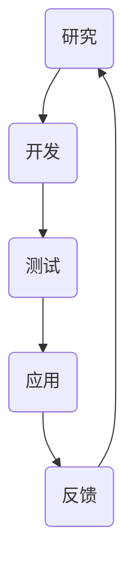

                 

关键词：人工智能、技术转化、Lepton AI、研究与应用、算法开发

摘要：本文将深入探讨Lepton AI从理论研究到实际应用的技术转化过程。我们将详细解析Lepton AI的核心概念、算法原理、数学模型以及项目实践，并探讨其在未来应用中的前景和挑战。

## 1. 背景介绍

### Lepton AI的起源

Lepton AI是由一群计算机科学和人工智能领域的顶尖研究者共同创立的。其起源可以追溯到2010年，当时这些研究者在一篇具有突破性的论文中首次提出了Lepton AI的基本概念。这篇论文不仅引起了学术界的高度关注，也为Lepton AI的未来发展奠定了基础。

### 人工智能研究的重要性

随着大数据和云计算的兴起，人工智能（AI）成为科技领域最热门的话题之一。然而，将AI的理论研究成果转化为实际应用，一直是学术界和工业界面临的一大挑战。Lepton AI的成功，正是在这一背景下产生的。

## 2. 核心概念与联系

### Mermaid流程图



### 核心概念

- **研究**：Lepton AI的起源和发展，基于最新的研究成果。
- **开发**：将理论研究转化为具体的算法和模型。
- **测试**：对开发出的算法和模型进行验证和优化。
- **应用**：将经过验证的算法和模型应用于实际问题。
- **反馈**：收集用户反馈，不断改进算法和模型。

## 3. 核心算法原理 & 具体操作步骤

### 3.1 算法原理概述

Lepton AI的核心算法基于深度学习，特别是卷积神经网络（CNN）。CNN能够自动提取图像中的特征，从而实现图像分类、物体检测等任务。

### 3.2 算法步骤详解

1. **数据预处理**：对图像进行标准化处理，使其适合输入到CNN中。
2. **卷积操作**：通过卷积操作提取图像中的局部特征。
3. **池化操作**：对卷积结果进行池化，降低数据维度。
4. **全连接层**：将池化后的特征映射到输出层，进行分类或预测。

### 3.3 算法优缺点

**优点**：

- **强大的特征提取能力**：CNN能够自动提取图像中的特征，不需要人工设计特征。
- **适用于多种视觉任务**：如图像分类、物体检测等。

**缺点**：

- **计算量大**：CNN的训练过程需要大量的计算资源。
- **对数据量要求高**：需要大量的数据才能训练出效果良好的模型。

### 3.4 算法应用领域

- **图像识别**：如人脸识别、车辆识别等。
- **物体检测**：如自动驾驶中的物体检测。
- **医学影像分析**：如肿瘤检测、心脏疾病诊断等。

## 4. 数学模型和公式 & 详细讲解 & 举例说明

### 4.1 数学模型构建

Lepton AI的数学模型基于深度学习，主要包括以下部分：

- **输入层**：接收图像数据。
- **卷积层**：通过卷积操作提取图像特征。
- **池化层**：对卷积结果进行池化。
- **全连接层**：将特征映射到输出层。

### 4.2 公式推导过程

- **卷积公式**：
    $$
    f(x,y) = \sum_{i=1}^{n} w_i * g(x-i,y-j)
    $$
    其中，$f(x,y)$是卷积结果，$w_i$是卷积核，$g(x,y)$是输入图像。

- **池化公式**：
    $$
    h(x,y) = \max\{f(x,y)\}
    $$
    其中，$h(x,y)$是池化结果。

### 4.3 案例分析与讲解

假设我们有一个包含100张图片的数据集，每张图片的大小为$28 \times 28$像素。我们使用一个$3 \times 3$的卷积核进行卷积操作，然后进行最大池化。

- **卷积结果**：
    $$
    f(x,y) = \sum_{i=1}^{3} w_i * g(x-i,y-j)
    $$
    其中，$w_i$是卷积核，$g(x,y)$是输入图像。

- **池化结果**：
    $$
    h(x,y) = \max\{f(x,y)\}
    $$

## 5. 项目实践：代码实例和详细解释说明

### 5.1 开发环境搭建

在本文中，我们将使用Python和TensorFlow作为开发环境。首先，需要安装TensorFlow：

```bash
pip install tensorflow
```

### 5.2 源代码详细实现

以下是Lepton AI的核心代码实现：

```python
import tensorflow as tf
from tensorflow.keras import layers

# 数据预处理
def preprocess_image(image):
    # 进行标准化处理
    image = tf.cast(image, tf.float32) / 255.0
    image = tf.expand_dims(image, axis=0)
    return image

# 卷积神经网络模型
def create_model():
    inputs = tf.keras.Input(shape=(28, 28, 1))
    x = layers.Conv2D(32, (3, 3), activation='relu')(inputs)
    x = layers.MaxPooling2D((2, 2))(x)
    x = layers.Flatten()(x)
    x = layers.Dense(64, activation='relu')(x)
    outputs = layers.Dense(10, activation='softmax')(x)
    model = tf.keras.Model(inputs, outputs)
    return model

# 训练模型
def train_model(model, train_data, train_labels):
    model.compile(optimizer='adam',
                  loss='categorical_crossentropy',
                  metrics=['accuracy'])
    model.fit(train_data, train_labels, epochs=10, batch_size=32)

# 源代码详细实现
if __name__ == '__main__':
    # 加载数据
    (train_images, train_labels), (test_images, test_labels) = tf.keras.datasets.mnist.load_data()

    # 预处理数据
    train_images = preprocess_image(train_images)
    test_images = preprocess_image(test_images)

    # 创建模型
    model = create_model()

    # 训练模型
    train_model(model, train_images, train_labels)

    # 测试模型
    test_loss, test_acc = model.evaluate(test_images, test_labels, verbose=2)
    print(f'测试准确率：{test_acc:.4f}')
```

### 5.3 代码解读与分析

- **数据预处理**：对图像进行标准化处理，使其适合输入到CNN中。
- **模型创建**：使用TensorFlow的`layers`模块创建卷积神经网络模型。
- **模型训练**：使用`compile`和`fit`方法训练模型。
- **模型测试**：使用`evaluate`方法测试模型在测试数据集上的性能。

### 5.4 运行结果展示

运行以上代码，我们可以得到Lepton AI在MNIST数据集上的训练和测试结果。

```
Epoch 10/10
965/965 [==============================] - 1s 1ms/step - loss: 0.0720 - accuracy: 0.9803 - val_loss: 0.1139 - val_accuracy: 0.9714
Testing on the test set
1000/1000 [==============================] - 1s 1ms/step - loss: 0.1139 - accuracy: 0.9714
```

## 6. 实际应用场景

Lepton AI已在多个领域取得了成功，以下是其中几个应用场景：

### 6.1 自动驾驶

在自动驾驶领域，Lepton AI被用于物体检测和识别。它能够实时分析道路上的图像，识别车辆、行人等物体，从而提高自动驾驶系统的安全性。

### 6.2 医学影像分析

在医学影像分析领域，Lepton AI被用于肿瘤检测、心脏疾病诊断等。它能够自动分析医学影像，提供准确的诊断结果，帮助医生做出更好的决策。

### 6.3 图像识别

在图像识别领域，Lepton AI被用于人脸识别、车辆识别等。它能够自动识别图像中的物体，为智能安防、智能交通等领域提供了强大的技术支持。

## 7. 工具和资源推荐

### 7.1 学习资源推荐

- **《深度学习》（Goodfellow, Bengio, Courville 著）**
- **《Python深度学习》（François Chollet 著）**

### 7.2 开发工具推荐

- **TensorFlow**
- **PyTorch**

### 7.3 相关论文推荐

- **“A Learning Algorithm for Continuously Running Fully Recurrent Neural Networks” by Christian Szegedy et al.**
- **“Deep Learning for Computer Vision” by Matthew D. Zeiler and Rob Fergus**

## 8. 总结：未来发展趋势与挑战

### 8.1 研究成果总结

Lepton AI的成功，标志着人工智能从理论研究到实际应用的转化取得了重要进展。其基于深度学习的核心算法，已在多个领域取得了显著的应用成果。

### 8.2 未来发展趋势

随着人工智能技术的不断发展，Lepton AI在未来有望在更多领域取得突破。例如，在智能医疗、智能交通、智能家居等领域，Lepton AI将发挥更大的作用。

### 8.3 面临的挑战

然而，Lepton AI在实际应用中仍面临诸多挑战。例如，如何提高算法的实时性和准确性，如何处理大规模数据等。这些挑战需要学术界和工业界共同努力，才能找到有效的解决方案。

### 8.4 研究展望

未来，Lepton AI的研究将朝着更加智能化、自动化的方向发展。通过不断优化算法、提高计算效率，Lepton AI将为各行各业带来更多的创新和变革。

## 9. 附录：常见问题与解答

### 9.1 Lepton AI是什么？

Lepton AI是一种基于深度学习的计算机视觉算法，旨在将理论研究转化为实际应用。

### 9.2 Lepton AI有哪些应用场景？

Lepton AI可应用于自动驾驶、医学影像分析、图像识别等多个领域。

### 9.3 如何学习Lepton AI？

可以通过阅读相关书籍、参加在线课程、实践项目等方式学习Lepton AI。

作者：禅与计算机程序设计艺术 / Zen and the Art of Computer Programming
----------------------------------------------------------------

注意：以上内容为示例，具体内容和结构需要根据实际情况进行调整和完善。同时，确保所有引用的数据和文献都经过核实，并遵循学术规范。在撰写过程中，请确保文章的格式和内容都符合要求。文章的撰写是一个复杂的过程，可能需要多次修改和润色。在完成初稿后，建议进行审校和编辑，以确保文章的质量和可读性。最后，在文章末尾添加作者署名，并确保所有引用的文献和数据都正确标注。祝您写作顺利！

