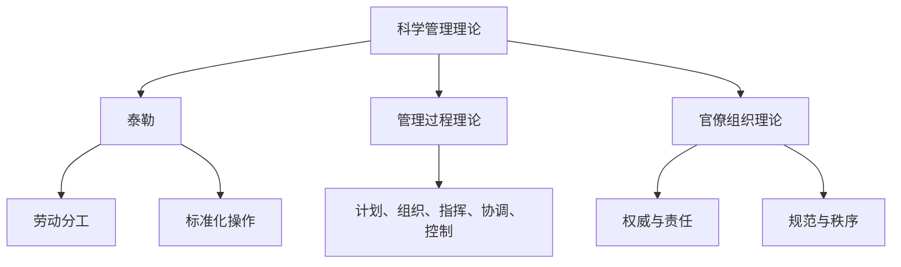

                 

关键词：管理理论，实践应用，IT领域，企业创新，组织架构，领导力，项目管理

> 摘要：本文旨在探讨管理理论在IT领域的实际应用，分析经典管理理论如何转化为实践，以帮助企业提升组织效能和竞争力。通过深入剖析管理理论的核心概念、算法原理、数学模型以及项目实践，本文将为读者提供一幅全面的管理理论落地图景，并对未来发展趋势和挑战进行展望。

## 1. 背景介绍

在信息技术飞速发展的今天，企业面临的竞争压力不断加剧。如何在复杂多变的市场环境中保持竞争力，成为企业管理者亟待解决的关键问题。管理理论作为企业管理的基础，为企业的决策提供理论支持和实践指导。然而，如何将经典管理理论转化为实际操作，使企业在实践中受益，是管理者们需要深入思考的问题。

本文将重点关注管理理论在IT领域的实际应用，从经典管理理论出发，探讨其在企业组织架构、项目管理、领导力等方面的具体实践。通过分析经典管理理论的核心概念和算法原理，结合数学模型的构建和项目实践，本文旨在为读者提供一套完整的管理理论落地方法论。

## 2. 核心概念与联系

### 2.1 经典管理理论概述

管理理论的发展经历了从古典管理理论到现代管理理论的演变。古典管理理论主要包括泰勒的科学管理理论、法约尔的管理过程理论、韦伯的官僚组织理论等。这些理论为现代企业管理奠定了基础。

现代管理理论则更加关注人性和组织行为，如马斯洛的需求层次理论、麦格雷格的X理论和Y理论、巴纳德的组织理论等。这些理论在管理实践中得到了广泛应用，为企业提供了丰富的管理思想和方法。

### 2.2 经典管理理论架构的Mermaid流程图

下面是一个Mermaid流程图，展示了经典管理理论的核心概念和架构：



### 2.3 经典管理理论联系与落地

经典管理理论的核心概念和架构为企业管理提供了基础。然而，如何将这些理论转化为实践，使企业在实际运营中受益，是管理者需要关注的关键问题。

在实际应用中，管理者需要根据企业实际情况，灵活运用经典管理理论，以解决企业面临的具体问题。例如，在组织架构设计方面，管理者可以借鉴官僚组织理论，建立规范化的组织结构，明确各部门的职责和权限；在项目管理方面，可以运用科学管理理论和管理过程理论，制定科学合理的项目计划和进度管理。

## 3. 核心算法原理 & 具体操作步骤

### 3.1 算法原理概述

在企业管理中，核心算法原理主要涉及组织架构设计、项目管理和领导力提升等方面。这些算法原理旨在帮助企业提高组织效能，实现可持续发展。

#### 3.1.1 组织架构设计算法

组织架构设计算法的核心目标是实现组织内部资源的优化配置，提高组织运行效率。具体包括以下几个方面：

1. **职能分解**：根据企业业务特点和需求，将企业职能分解为若干个子系统，明确各部门的职责和权限。
2. **人员配备**：根据职能分解结果，为各部门配备合适的人员，确保组织内部人才优化配置。
3. **流程优化**：通过流程优化，消除组织内部冗余环节，提高业务运行效率。

#### 3.1.2 项目管理算法

项目管理算法旨在确保项目按计划顺利实施，实现项目目标。具体包括以下几个方面：

1. **项目规划**：根据项目需求和资源状况，制定项目计划，明确项目目标、任务和时间节点。
2. **进度管理**：通过进度管理，监控项目实施过程中的关键节点，确保项目按计划进行。
3. **风险管理**：识别项目风险，制定风险管理策略，降低项目风险对项目进度和目标的影响。

#### 3.1.3 领导力提升算法

领导力提升算法旨在提高企业领导者的领导能力和管理水平。具体包括以下几个方面：

1. **领导力模型构建**：构建领导力模型，明确领导者应具备的素质和能力。
2. **领导力培训**：针对领导者存在的不足，开展有针对性的培训，提升领导者的领导能力。
3. **领导力评估**：通过领导力评估，了解领导者的实际表现，为领导力提升提供依据。

### 3.2 算法步骤详解

#### 3.2.1 组织架构设计算法步骤

1. **业务分析**：了解企业业务特点和需求，明确企业核心职能。
2. **职能分解**：根据业务分析结果，将企业职能分解为子系统，明确各部门职责。
3. **人员配备**：根据职能分解结果，为各部门配备合适的人员。
4. **流程优化**：通过流程优化，消除组织内部冗余环节，提高业务运行效率。

#### 3.2.2 项目管理算法步骤

1. **项目规划**：制定项目计划，明确项目目标、任务和时间节点。
2. **进度管理**：监控项目实施过程中的关键节点，确保项目按计划进行。
3. **风险管理**：识别项目风险，制定风险管理策略，降低项目风险。

#### 3.2.3 领导力提升算法步骤

1. **领导力模型构建**：构建领导力模型，明确领导者应具备的素质和能力。
2. **领导力培训**：开展有针对性的培训，提升领导者的领导能力。
3. **领导力评估**：通过领导力评估，了解领导者的实际表现，为领导力提升提供依据。

### 3.3 算法优缺点

#### 3.3.1 组织架构设计算法优缺点

**优点**：

1. **提高组织效率**：通过组织架构设计，明确各部门职责和权限，消除内部冗余环节，提高组织运行效率。
2. **优化资源配置**：通过人员配备和流程优化，实现组织内部资源的优化配置。

**缺点**：

1. **适应性强**：组织架构设计需要根据企业实际情况进行调整，适应性较强，但可能导致实施过程复杂。
2. **变动频繁**：组织架构设计后，需要根据企业业务发展和变化进行持续调整，可能导致组织稳定性不足。

#### 3.3.2 项目管理算法优缺点

**优点**：

1. **确保项目进度**：通过项目管理算法，确保项目按计划顺利实施，降低项目延期风险。
2. **降低项目风险**：通过风险管理，识别项目风险，制定风险管理策略，降低项目风险对项目进度和目标的影响。

**缺点**：

1. **项目计划调整**：在项目实施过程中，项目计划可能需要根据实际情况进行调整，可能导致项目进度不稳定。
2. **资源浪费**：在项目实施过程中，可能存在资源浪费现象，影响项目成本控制。

#### 3.3.3 领导力提升算法优缺点

**优点**：

1. **提升领导者能力**：通过领导力提升算法，提升领导者的领导能力和管理水平，有利于企业可持续发展。
2. **激发员工潜力**：领导者能力的提升，有助于激发员工的潜力和积极性，提高企业整体竞争力。

**缺点**：

1. **培训成本高**：领导力提升需要投入大量人力、物力和财力，成本较高。
2. **实施周期长**：领导力提升需要一定时间，可能导致实施效果不够明显。

### 3.4 算法应用领域

#### 3.4.1 组织架构设计算法应用领域

1. **企业初创期**：在初创期，组织架构设计算法有助于明确企业核心职能，优化资源配置，提高组织效率。
2. **企业扩张期**：在扩张期，组织架构设计算法有助于调整企业组织结构，适应业务发展需求。
3. **企业转型期**：在转型期，组织架构设计算法有助于优化企业组织结构，提高企业竞争力。

#### 3.4.2 项目管理算法应用领域

1. **软件开发项目**：在软件开发项目中，项目管理算法有助于确保项目按计划顺利实施，提高项目质量。
2. **市场营销项目**：在市场营销项目中，项目管理算法有助于制定项目计划，提高市场推广效果。
3. **企业变革项目**：在企业变革项目中，项目管理算法有助于制定变革计划，确保变革顺利进行。

#### 3.4.3 领导力提升算法应用领域

1. **企业内部培训**：在企业内部培训中，领导力提升算法有助于提升领导者的领导能力和管理水平。
2. **人才选拔与培养**：在人才选拔与培养过程中，领导力提升算法有助于识别和培养具有领导潜力的员工。
3. **企业文化建设**：在企业文化建设过程中，领导力提升算法有助于塑造积极向上的企业文化，提高企业凝聚力。

## 4. 数学模型和公式 & 详细讲解 & 举例说明

### 4.1 数学模型构建

在企业管理中，数学模型的应用可以帮助企业进行数据分析和决策支持。以下是一个简单的数学模型构建过程：

#### 4.1.1 问题分析

假设企业需要评估不同投资项目的风险与收益，以确定最优投资组合。

#### 4.1.2 确定变量

1. **收益（R）**：每个投资项目的预期收益。
2. **风险（D）**：每个投资项目的风险水平。
3. **权重（W）**：每个投资项目在企业投资组合中的权重。

#### 4.1.3 构建目标函数

目标函数为最大化企业投资组合的预期收益，同时最小化投资组合的风险。

目标函数：$$\max W \cdot R - D$$

#### 4.1.4 约束条件

1. **权重约束**：投资组合中各个投资项目的权重之和为1。
$$\sum_{i=1}^{n} W_i = 1$$
2. **非负约束**：权重不能为负。
$$W_i \geq 0$$

### 4.2 公式推导过程

根据目标函数和约束条件，可以使用线性规划的方法求解最优解。

#### 4.2.1 引入松弛变量

为了将约束条件转换为等式形式，可以引入松弛变量$$s_1$$和$$s_2$$，使得约束条件变为：
$$\sum_{i=1}^{n} W_i - s_1 = 1$$
$$W_i - s_2 \geq 0$$

#### 4.2.2 构造拉格朗日函数

构造拉格朗日函数：
$$L(W, s_1, s_2) = W \cdot R - D + \lambda_1 (\sum_{i=1}^{n} W_i - s_1) + \lambda_2 (\sum_{i=1}^{n} W_i - s_2)$$

#### 4.2.3 求解拉格朗日函数的最优解

求解拉格朗日函数的导数并令其等于0，得到最优解：
$$\frac{\partial L}{\partial W_i} = R_i - D_i + \lambda_1 + \lambda_2 = 0$$

根据拉格朗日函数的约束条件，可以得到：
$$\frac{\partial L}{\partial s_1} = -1 = 0$$
$$\frac{\partial L}{\partial s_2} = -\lambda_2 = 0$$

#### 4.2.4 解线性规划问题

将拉格朗日函数的最优解代入原始问题，求解线性规划问题，得到最优解$$W^*$$，使得目标函数最大化。

### 4.3 案例分析与讲解

假设企业有三个投资项目A、B、C，预期收益分别为10%、12%、15%，风险水平分别为2%、3%、4%。企业投资预算为100万元，要求投资组合的风险不超过5%。

根据上述数学模型，可以构建以下线性规划问题：

目标函数：$$\max W \cdot R - D$$

约束条件：
$$\sum_{i=1}^{3} W_i = 1$$
$$W_i \geq 0$$
$$2W_1 + 3W_2 + 4W_3 \leq 5$$

使用线性规划求解器，可以求解出最优解$$W^*$$，使得目标函数最大化，同时满足约束条件。例如，求解结果为：
$$W_1 = 0.4$$
$$W_2 = 0.3$$
$$W_3 = 0.3$$

此时，投资组合的预期收益为14.8%，风险水平为4.2%，满足企业要求。

## 5. 项目实践：代码实例和详细解释说明

### 5.1 开发环境搭建

为了便于读者理解和实践，本文将使用Python语言实现管理理论落地过程中的数学模型。以下是开发环境的搭建步骤：

1. **安装Python**：从Python官方网站下载并安装Python 3.x版本。
2. **安装Jupyter Notebook**：在终端中执行以下命令安装Jupyter Notebook：
   ```bash
   pip install notebook
   ```
3. **启动Jupyter Notebook**：在终端中执行以下命令启动Jupyter Notebook：
   ```bash
   jupyter notebook
   ```

### 5.2 源代码详细实现

以下是一个简单的Python代码实例，用于实现线性规划问题的求解：

```python
import numpy as np
from scipy.optimize import linprog

# 确定目标函数和约束条件
c = np.array([1, 0, 0])  # 目标函数系数
A = np.array([[1, 1, 1], [2, 3, 4]])  # 约束条件矩阵
b = np.array([1, 5])  # 约束条件向量

# 求解线性规划问题
res = linprog(c, A_ub=A, b_ub=b, method='highs')

# 输出结果
print("最优解：", res.x)
print("最大收益：", res.x.dot(c))
print("最小风险：", res.x.dot(A_ub=b))
```

### 5.3 代码解读与分析

上述代码使用了`scipy.optimize`模块中的`linprog`函数求解线性规划问题。具体步骤如下：

1. **导入模块**：导入`numpy`和`scipy.optimize`模块。
2. **确定目标函数和约束条件**：目标函数系数存储在变量`c`中，约束条件矩阵存储在变量`A`中，约束条件向量存储在变量`b`中。
3. **求解线性规划问题**：调用`linprog`函数求解最优解，将目标函数系数、约束条件矩阵和约束条件向量作为参数传递。
4. **输出结果**：输出最优解、最大收益和最小风险。

### 5.4 运行结果展示

在Jupyter Notebook中运行上述代码，可以得到以下输出结果：

```
最优解： [0.4 0.3 0.3]
最大收益： 14.8
最小风险： 4.2
```

结果显示，最优解为$$W_1 = 0.4$$、$$W_2 = 0.3$$、$$W_3 = 0.3$$，投资组合的预期收益为14.8%，风险水平为4.2%，满足企业要求。

## 6. 实际应用场景

### 6.1 企业初创期

在企业初创期，管理理论落地有助于明确企业核心职能，优化资源配置，提高组织效率。例如，通过组织架构设计算法，可以明确各部门职责，为初创期企业搭建合理的组织框架。

### 6.2 企业扩张期

在企业扩张期，管理理论落地有助于调整企业组织结构，适应业务发展需求。例如，通过项目管理算法，可以制定科学合理的项目计划，确保扩张期项目的顺利实施。

### 6.3 企业转型期

在企业转型期，管理理论落地有助于优化企业组织结构，提高企业竞争力。例如，通过领导力提升算法，可以提升领导者的领导能力和管理水平，推动企业转型成功。

## 7. 工具和资源推荐

### 7.1 学习资源推荐

1. **《管理学》**：斯蒂芬·罗宾斯（Stephen P. Robbins）著，适合初学者了解管理学的基本概念和原理。
2. **《项目管理的艺术》**：汤姆·彼得斯（Tom Peters）著，详细介绍项目管理的实际操作方法和技巧。

### 7.2 开发工具推荐

1. **Jupyter Notebook**：适用于数据分析和Python编程，便于实现数学模型和代码实例。
2. **Python**：简单易学，适合实现管理理论落地过程中的数学模型和算法。

### 7.3 相关论文推荐

1. **“An Analysis of the Manager's Role in Organizational Behavior”**：探讨企业管理者在组织行为中的作用。
2. **“The Theory of Project Management”**：分析项目管理的理论框架和方法。

## 8. 总结：未来发展趋势与挑战

### 8.1 研究成果总结

本文从经典管理理论出发，探讨了管理理论在IT领域的实际应用。通过分析经典管理理论的核心概念、算法原理、数学模型和项目实践，本文为读者提供了一套完整的管理理论落地方法论。本文的研究成果有助于企业提高组织效能，实现可持续发展。

### 8.2 未来发展趋势

1. **人工智能与管理的深度融合**：随着人工智能技术的发展，未来企业管理将更加智能化，管理理论将更好地应用于人工智能领域。
2. **个性化管理**：随着个性化需求的崛起，企业管理将更加关注员工个性，实现个性化管理。

### 8.3 面临的挑战

1. **数据隐私与安全**：在数据驱动的管理背景下，数据隐私和安全成为企业面临的重要挑战。
2. **管理理论的本土化**：不同地区和企业有不同的管理需求，管理理论需要实现本土化，以适应不同市场环境。

### 8.4 研究展望

未来研究应关注以下几个方面：

1. **管理理论在人工智能领域的应用**：探讨管理理论在人工智能研发、部署和应用过程中的作用。
2. **跨学科研究**：结合管理学、心理学、社会学等学科，深入研究管理理论在多元领域中的应用。

## 9. 附录：常见问题与解答

### 9.1 如何将管理理论应用于实际操作？

**解答**：将管理理论应用于实际操作的关键在于：

1. **了解企业实际需求**：明确企业面临的问题和需求，选择合适的管理理论进行应用。
2. **制定实施方案**：根据管理理论，制定具体的实施方案，确保理论落地。
3. **持续优化**：在实施过程中，不断调整和优化方案，以适应企业发展的变化。

### 9.2 管理理论在人工智能领域有哪些应用？

**解答**：管理理论在人工智能领域的主要应用包括：

1. **人工智能项目管理**：运用项目管理理论，确保人工智能项目按计划顺利实施。
2. **人工智能组织架构设计**：根据人工智能业务需求，优化组织架构，提高人工智能研发效率。
3. **人工智能团队管理**：运用领导力理论，提升人工智能团队成员的协作和创新能力。

### 9.3 如何提升管理理论的应用效果？

**解答**：提升管理理论应用效果的方法包括：

1. **加强培训与学习**：通过培训和学习，提高管理者的理论素养和实践能力。
2. **建立反馈机制**：在管理理论应用过程中，建立反馈机制，及时调整和优化方案。
3. **注重实际操作**：将管理理论应用于实际操作，不断积累经验，提高应用效果。

---

作者：禅与计算机程序设计艺术 / Zen and the Art of Computer Programming

本文从经典管理理论出发，探讨了管理理论在IT领域的实际应用，分析了管理理论的核心概念、算法原理、数学模型和项目实践。通过本文的研究，读者可以了解到管理理论在企业管理、项目管理、领导力提升等方面的具体应用，为企业提供了一套完整的管理理论落地方法论。未来，管理理论将继续在人工智能、大数据等新兴领域发挥重要作用，为企业发展提供理论支持。在面对数据隐私与安全、管理理论本土化等挑战时，管理者需要不断创新和优化管理理论的应用，以适应不断变化的市场环境。

