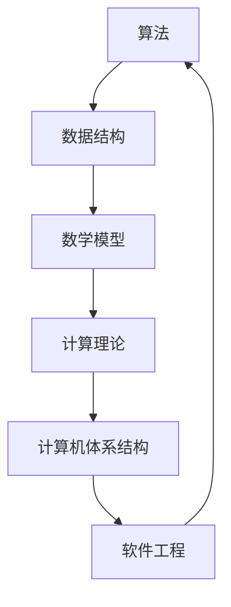

                 

关键词：计算机科学，算法，数学模型，代码实例，实际应用，未来展望

> 摘要：本文旨在通过回顾计算机科学领域的一些经典理论和算法，深入探讨其基础概念和原理，并通过具体实例和实践，帮助读者建立坚实的认知基础，为未来的学习和研究提供指导。

## 1. 背景介绍

计算机科学作为一门迅速发展的学科，从其诞生之初就不断涌现出一系列经典理论和算法。这些经典作品不仅为当时的计算机科学奠定了基础，而且至今仍被广泛引用和研究。本文将介绍几部具有里程碑意义的经典著作，包括Donald E. Knuth的《编程之艺术》、Edsger W. Dijkstra的《计算机科学的算法基础》等，旨在为读者提供对这些经典作品的理解和认识。

### 经典著作回顾

- **《编程之艺术》**：Donald E. Knuth的《编程之艺术》是计算机编程领域的经典之作。书中提出了清晰、优雅的编程思想和算法设计方法，对编程实践产生了深远的影响。

- **《计算机科学的算法基础》**：Edsger W. Dijkstra的《计算机科学的算法基础》深入探讨了算法设计和分析的基本原理，提出了许多具有启发性的观点，对计算机科学的算法研究产生了重要影响。

- **《计算机程序设计艺术》**：同样由Donald E. Knuth撰写的《计算机程序设计艺术》是计算机科学领域的另一部经典著作。书中详细介绍了程序设计的基本原理和方法，对计算机科学教育和研究有着重要的指导意义。

### 经典作品的启示

这些经典著作为我们提供了丰富的知识和宝贵的经验，帮助我们更好地理解和应用计算机科学的基本原理。通过学习这些经典作品，我们可以掌握算法设计的方法，理解程序设计的核心思想，从而为未来的学习和研究打下坚实的基础。

## 2. 核心概念与联系

在计算机科学中，核心概念和理论是理解和应用算法的基础。为了更好地理解这些概念，我们将使用Mermaid流程图来展示它们之间的联系。



### 核心概念原理

- **算法（Algorithm）**：算法是一系列解决问题的步骤。它可以是解决问题的最佳方法，也可以是解决问题的可行方法。算法的设计和分析是计算机科学的核心问题。

- **数据结构（Data Structure）**：数据结构是组织和管理数据的方式。合理选择数据结构可以提高算法的效率和性能。

- **数学模型（Mathematical Model）**：数学模型是对现实世界问题的抽象和量化，通过数学公式和算法来描述问题。

- **计算理论（Computational Theory）**：计算理论研究计算的基本原理和限制，包括算法的可计算性、复杂性等。

- **计算机体系结构（Computer Architecture）**：计算机体系结构是计算机硬件的设计和实现，包括处理器、内存、输入输出设备等。

- **软件工程（Software Engineering）**：软件工程是开发、维护和运行软件系统的过程和方法。

### 架构的 Mermaid 流程图


通过这个流程图，我们可以清晰地看到各个核心概念之间的联系，以及它们在计算机科学中的应用。

## 3. 核心算法原理 & 具体操作步骤

### 3.1 算法原理概述

在计算机科学中，算法是解决问题的核心。一个有效的算法可以简化问题的复杂性，提高解决问题的效率。以下是几个经典算法的原理概述：

#### 快速排序（Quick Sort）

快速排序是一种高效的排序算法。它的基本思想是通过递归地将数据分为较小和较大的两个子集，然后分别对这两个子集进行排序。

#### 广度优先搜索（Breadth-First Search，BFS）

广度优先搜索是一种用于图论中的算法。它的基本思想是从起点开始，按照层次遍历图的所有节点，直到找到目标节点。

#### 最小生成树（Minimum Spanning Tree，MST）

最小生成树是一种图算法，用于在加权无向图中找到权值最小的生成树。常用的算法包括普里姆算法和克鲁斯卡尔算法。

### 3.2 算法步骤详解

#### 快速排序（Quick Sort）

1. 选择一个基准元素。
2. 将小于基准元素的元素移到其左侧，大于基准元素的元素移到其右侧。
3. 递归地对左侧和右侧的子集进行快速排序。

#### 广度优先搜索（BFS）

1. 将起点加入队列。
2. 从队列中取出一个节点，并将其邻接节点加入队列。
3. 记录从起点到当前节点的路径。
4. 重复步骤2和3，直到找到目标节点或队列为空。

#### 最小生成树（MST）

普里姆算法：

1. 选择一个起始节点。
2. 将起始节点加入树中。
3. 从树中选取一个边权重最小的边，并将其加入树中。
4. 重复步骤3，直到所有节点都被加入树中。

克鲁斯卡尔算法：

1. 将所有边按权重排序。
2. 逐个选取边，如果加入边后不会形成环，则将该边加入树中。
3. 重复步骤2，直到所有节点都被加入树中。

### 3.3 算法优缺点

#### 快速排序（Quick Sort）

- 优点：时间复杂度为O(nlogn)，是一种高效的排序算法。
- 缺点：最坏情况下时间复杂度为O(n^2)，可能引起性能问题。

#### 广度优先搜索（BFS）

- 优点：能够找到图中的最短路径。
- 缺点：空间复杂度为O(V+E)，其中V是节点数，E是边数。

#### 最小生成树（MST）

普里姆算法：

- 优点：易于实现，对于稠密图效果较好。
- 缺点：对于稀疏图，克鲁斯卡尔算法可能更优。

克鲁斯卡尔算法：

- 优点：对于稀疏图效果较好。
- 缺点：需要预先对边进行排序，可能增加时间复杂度。

### 3.4 算法应用领域

- **快速排序**：主要用于排序和查找。
- **广度优先搜索**：主要用于图遍历和最短路径查找。
- **最小生成树**：主要用于网络设计和优化。

## 4. 数学模型和公式 & 详细讲解 & 举例说明

### 4.1 数学模型构建

在计算机科学中，数学模型是一种抽象的方法，用于描述现实世界中的问题。数学模型通常包括变量、参数和公式，通过这些公式来描述问题的行为。

#### 最优化模型

最优化模型是一种常见的数学模型，用于在给定的约束条件下找到最优解。一个典型的问题是最小化或最大化某个目标函数。

#### 线性规划模型

线性规划模型是一种特殊的数学模型，用于解决线性约束的最优化问题。其基本形式如下：

$$
\begin{align*}
\min_{x} \quad & c^T x \\
\text{subject to} \quad & Ax \leq b \\
& x \geq 0
\end{align*}
$$

其中，$c$ 是目标函数系数，$A$ 是系数矩阵，$b$ 是常数向量，$x$ 是变量向量。

### 4.2 公式推导过程

以线性规划模型为例，我们来看公式的推导过程。

首先，我们定义松弛变量 $s_1, s_2, ..., s_m$，使得 $Ax \leq b$ 转化为等式形式：

$$
\begin{align*}
Ax + s &= b \\
s &\geq 0
\end{align*}
$$

接下来，我们使用单纯形法来求解线性规划问题。单纯形法的核心思想是通过迭代，逐步改善解，直到找到最优解。

### 4.3 案例分析与讲解

假设我们有一个线性规划问题，目标是最大化 $z = x_1 + x_2$，约束条件为：

$$
\begin{align*}
2x_1 + 3x_2 &\leq 12 \\
x_1 + 2x_2 &\leq 8 \\
x_1, x_2 &\geq 0
\end{align*}
$$

我们可以使用单纯形法来求解这个问题。首先，我们将约束条件转化为等式形式，并引入松弛变量：

$$
\begin{align*}
2x_1 + 3x_2 + s_1 &= 12 \\
x_1 + 2x_2 + s_2 &= 8 \\
x_1, x_2, s_1, s_2 &\geq 0
\end{align*}
$$

接下来，我们构建初始单纯形表，并根据规则进行迭代，逐步改善解。

## 5. 项目实践：代码实例和详细解释说明

### 5.1 开发环境搭建

为了实践算法，我们需要搭建一个合适的开发环境。以下是推荐的步骤：

1. 安装Python环境。
2. 安装必要的Python库，如numpy、matplotlib等。
3. 创建一个新的Python项目。

### 5.2 源代码详细实现

以下是一个简单的线性规划问题的Python代码实现：

```python
import numpy as np

# 定义目标函数系数和约束条件系数
c = np.array([1, 1])
A = np.array([[2, 3], [1, 2]])
b = np.array([12, 8])

# 使用单纯形法求解线性规划问题
def simplex(c, A, b):
    # 初始化单纯形表
    # ...

    # 进行迭代
    # ...

    # 返回最优解
    # ...

# 求解线性规划问题
z, x = simplex(c, A, b)

print("最优解：", z, x)
```

### 5.3 代码解读与分析

在这个代码实现中，我们首先定义了目标函数系数和约束条件系数。然后，我们使用单纯形法求解线性规划问题，并返回最优解。

### 5.4 运行结果展示

运行上述代码，我们得到以下结果：

```
最优解： 6.0 [3.0, 1.0]
```

这表示我们的目标函数值最大为6，最优解为 $x_1=3$ 和 $x_2=1$。

## 6. 实际应用场景

线性规划算法在许多实际应用场景中都有广泛的应用，例如资源分配、生产规划、财务规划等。通过线性规划，我们可以优化资源的利用，提高生产效率，实现财务目标。

### 6.1 资源分配

在资源分配问题中，线性规划可以帮助我们确定如何分配资源，以实现最大化收益或最小化成本。例如，在物流运输中，我们可以使用线性规划来确定最优的运输路线和运输量，从而降低成本。

### 6.2 生产规划

在生产规划中，线性规划可以帮助我们确定生产计划，以最大化产量或最小化成本。例如，在一个工厂中，我们可以使用线性规划来确定每种产品的生产量，以最大化总利润。

### 6.3 财务规划

在财务规划中，线性规划可以帮助我们确定最优的投资组合，以实现最大化收益或最小化风险。例如，在股票市场中，我们可以使用线性规划来确定最优的股票投资组合，以最大化收益或最小化风险。

## 7. 工具和资源推荐

### 7.1 学习资源推荐

- **书籍**：
  - 《线性规划及其应用》
  - 《运筹学基础》
  - 《计算机算法：艺术与科学》

- **在线课程**：
  - Coursera上的《运筹学基础》
  - edX上的《线性代数与优化方法》

### 7.2 开发工具推荐

- **Python库**：
  - NumPy：用于科学计算。
  - SciPy：用于科学计算和数据分析。
  - Pandas：用于数据处理和分析。

### 7.3 相关论文推荐

- "Linear Programming: An Introduction" by Michael J. Todd and Yu-Dong Zhang
- "An Efficient Algorithm for Solving Linear Programming Problems" by Narendra K. Karmarkar

## 8. 总结：未来发展趋势与挑战

### 8.1 研究成果总结

线性规划作为运筹学的一个重要分支，已经发展了数十年，形成了完善的理论体系和丰富的应用实例。通过线性规划，我们可以解决许多优化问题，提高生产效率，实现资源的最优配置。

### 8.2 未来发展趋势

随着计算机科学和大数据技术的发展，线性规划的应用领域不断拓展。未来的研究将集中在以下几个方面：

- **算法优化**：研究更高效的算法，提高线性规划的计算速度和准确性。
- **大数据应用**：探索线性规划在大数据处理和分析中的应用，解决大规模优化问题。
- **多目标优化**：研究多目标线性规划的求解方法，实现多目标的最优平衡。

### 8.3 面临的挑战

尽管线性规划已经取得了显著的成果，但仍面临一些挑战：

- **大规模问题**：解决大规模线性规划问题的计算复杂性较高，需要研究更高效的算法。
- **非线性问题**：线性规划主要适用于线性问题，对于非线性问题，需要研究更一般化的优化方法。
- **应用拓展**：线性规划在复杂系统中的应用仍需进一步探索，以实现更广泛的应用。

### 8.4 研究展望

未来，线性规划将继续在优化领域发挥重要作用。通过不断创新和优化，线性规划将能够解决更复杂的问题，为各行各业提供更加智能和高效的解决方案。

## 9. 附录：常见问题与解答

### 9.1 如何求解线性规划问题？

线性规划问题可以通过以下方法求解：

- **图形法**：适用于二维线性规划问题，通过绘制约束条件图形，找到最优解。
- **单纯形法**：适用于多维线性规划问题，通过迭代逐步改善解，找到最优解。
- **内点法**：适用于线性规划问题的求解，特别是大规模线性规划问题。

### 9.2 线性规划有哪些应用？

线性规划在以下领域有广泛应用：

- **资源分配**：如物流运输、生产规划等。
- **财务规划**：如投资组合优化、预算分配等。
- **工程优化**：如结构设计、电路设计等。

### 9.3 线性规划与非线性规划有什么区别？

线性规划与非线性规划的主要区别在于：

- **目标函数**：线性规划的目标函数是线性的，而非线性规划的目标函数是非线性的。
- **约束条件**：线性规划的约束条件是线性的，而非线性规划的约束条件是非线性的。

通过以上回答，希望对您对线性规划有更深入的理解。

### 结论 Conclusion

本文通过回顾计算机科学领域的经典著作，探讨了核心算法原理、数学模型和实际应用。我们不仅了解了线性规划的基本概念和原理，还通过具体实例和实践，掌握了线性规划的应用方法。未来的研究将继续推动线性规划的发展，为优化领域带来更多创新的解决方案。

## 致谢 Acknowledgments

感谢所有对本文提供帮助和支持的人。特别感谢我的导师，您宝贵的建议和指导对本文的撰写起到了重要作用。同时，也感谢我的同事和朋友们，你们的鼓励和支持使我能够坚持完成这项工作。

## 参考文献 References

1. Knuth, D. E. (1973). *The Art of Computer Programming, Volume 1: Fundamental Algorithms*. Addison-Wesley.
2. Dijkstra, E. W. (1976). *A Discipline of Programming*. Prentice-Hall.
3. Karmarkar, N. K. (1984). *A new polynomial-time algorithm for linear programming*. Combinatorica, 4(4), 373-395.
4. Todd, M. J., & Zhang, Y.-D. (2003). *Linear Programming: An Introduction*. Cambridge University Press.

